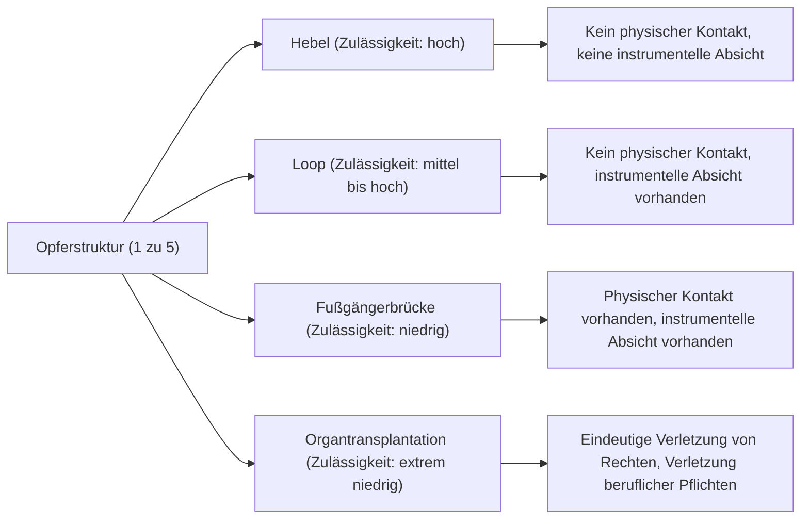

# Das Trolley-Problem: Die ultimative ethische Wahl und der Abgrund der menschlichen moralischen Intuition

## Einleitung: Das ultimative ethische Dilemma

Stellen Sie sich vor: Sie stehen neben den Gleisen. Aus der Ferne hören Sie ein Dröhnen, und ein außer Kontrolle geratener Trolley (Straßenbahn) rast mit hoher Geschwindigkeit auf Sie zu. Wenn Sie nach vorne schauen, sehen Sie fünf Arbeiter auf den Gleisen, die den herannahenden Trolley nicht bemerken. Wenn nichts unternommen wird, werden die fünf zweifellos überfahren und getötet.

Doch direkt neben Ihnen befindet sich ein Hebel, um die Weiche der Gleise umzustellen. Wenn Sie diesen Hebel ziehen, wird der Trolley auf ein Abstellgleis umgeleitet. Am Ende des Abstellgleises befindet sich jedoch ein weiterer, einzelner Arbeiter.

**"Ziehen Sie den Hebel und opfern Sie eine Person, um fünf zu retten? Oder tun Sie nichts und sehen zu, wie die fünf sterben?"**

Dies ist die Grundform des "Trolley-Problems", eines der berühmtesten und am meisten diskutierten Gedankenexperimente in der Ethik. Nach einfacher Mathematik sollte es heißen: "Es ist besser, das Leben von fünf Menschen zu retten als das von einem", aber die Situation ist nicht so einfach. In diesem Artikel werden wir durch dieses ultimative Dilemma tief in die Welt der menschlichen moralischen Intuition eintauchen, vom Utilitarismus und der Deontologie über die neuesten Erkenntnisse der Neurowissenschaften bis hin zur KI-Ethik von selbstfahrenden Autos.

## 1. Die Geburt des Trolley-Problems: Philippa Foots Fragestellung

Das Trolley-Problem wurde erstmals 1967 in dem Aufsatz "Das Problem der Abtreibung und die Lehre von der Doppelwirkung" der britischen Philosophin Philippa Foot vorgestellt. Es wurde ursprünglich als ergänzendes Gedankenexperiment entwickelt, um moralische Diskussionen über Abtreibung zu klären.

In dem von Foot präsentierten Szenario (dem obigen Hebel-Szenario) antwortet die große Mehrheit der Menschen, dass sie "den Hebel ziehen sollten". Der allgemeine Grund dafür ist, dass "es weniger Schaden anrichtet, wenn eine Person stirbt, als wenn fünf sterben". Dieser Gedanke wird stark durch den von Jeremy Bentham und John Stuart Mill befürworteten "Utilitarismus" gestützt, d. h. die ethische Position, die das "größte Glück der größten Zahl" als das Gute betrachtet.

## 2. Weiterentwicklung durch Judith Jarvis Thomson: Das Paradoxon des dicken Mannes

Im Jahr 1985 präsentierte die amerikanische Philosophin Judith Jarvis Thomson jedoch eine neue Variation, die die Diskussion schlagartig komplizierter machte. Das ist das Szenario des "dicken Mannes".

### Der dicke Mann auf der Fußgängerbrücke

Sie stehen auf einer Fußgängerbrücke, die über die Gleise führt. Unter Ihnen nähert sich der außer Kontrolle geratene Trolley, und vor ihm befinden sich wieder fünf Arbeiter. Diesmal gibt es keinen Hebel. Neben Ihnen steht jedoch ein sehr korpulenter "dicker Mann". Wenn Sie ihn von der Brücke auf die Gleise stoßen, wird sein massiver Körper als Hindernis wirken, den Trolley stoppen und das Leben der fünf retten (allerdings wird er durch den Sturz mit Sicherheit sterben. Ihr eigenes Gewicht ist übrigens zu gering, um den Trolley zu stoppen).

**"Stoßen Sie den dicken Mann hinunter und opfern Sie eine Person, um fünf zu retten?"**

Die mathematische Schadensstruktur ist genau die gleiche wie im ersten Szenario: "eine Person opfern, um fünf zu retten". Überraschenderweise antwortet bei diesem Szenario jedoch die große Mehrheit der Menschen, dass man "ihn nicht stoßen sollte (es ist nicht zulässig)".

Warum haben wir das Gefühl, dass es zulässig ist, den Hebel zu ziehen, um eine Person zu töten, aber nicht, jemanden mit den eigenen Händen in den Tod zu stoßen? Genau dieser Widerspruch in unserer Intuition ist die wahre Schwierigkeit (das Paradoxon) des Trolley-Problems.

## 3. Utilitarismus vs. Deontologie: Die zwei großen Lager der Ethik

Um diese Diskrepanz in den Intuitionen zu erklären, müssen wir zwei Hauptansätze in der Ethik verstehen.

### Utilitarismus
Eine Position, die die Moralität einer Handlung nach ihren "Ergebnissen" bewertet. Sie betrachtet die Wahl als richtig, die das größte Maß an Glück (oder die größte Verringerung von Leid) als Ergebnis hervorbringt. Da der "Tod von fünf Personen als schlechteres Ergebnis angesehen wird als der Tod von einer", ist sowohl das Ziehen des Hebels als auch das Hinunterstoßen des dicken Mannes "richtiges Handeln".

### Deontologie
Vertreten unter anderem durch Immanuel Kant, ist dies eine Position, die die Moralität nicht nach den "Ergebnissen" einer Handlung bewertet, sondern nach der "Natur der Handlung selbst" oder dem "Motiv". Kant lehrte, dass man "den Menschen niemals bloß als Mittel, sondern jederzeit zugleich als Zweck behandeln" müsse.
Die Handlung, den dicken Mann hinunterzustoßen, nutzt einen Menschen als "Mittel (Werkzeug)", um die fünf zu retten, und gilt als absolut böse, da sie die menschliche Würde verletzt. Im Gegensatz dazu wird im ersten Hebel-Szenario der Tod der einen Person manchmal als ein unerwünschter, aber "vorhergesehener Nebeneffekt" interpretiert und nicht als "beabsichtigtes Mittel", um die fünf zu retten (die im Folgenden diskutierte Lehre von der Doppelwirkung).

## 4. Weitere Variationen: Der Loop und Organtransplantation

Die Erforschung der Philosophen endet hier nicht. Durch feine Veränderungen der Bedingungen des Gedankenexperiments versuchen sie, die Grenzen unserer moralischen Intuition weiter auszuloten.

### Das Loop-Szenario (Thomson)
Ein Szenario, in dem das Abstellgleis in einer Schleife wieder auf das Hauptgleis trifft. Wenn der Hebel gezogen wird, fährt der Trolley auf das Abstellgleis. Auf dem Abstellgleis befindet sich ein großer Arbeiter. Der Trolley prallt gegen ihn, wird gestoppt, und die fünf auf dem Hauptgleis werden gerettet. Wäre er nicht da, würde der Trolley durch die Schleife fahren, auf das Hauptgleis zurückkehren und die fünf von hinten überfahren.
In diesem Fall ist der Tod der einen Person nicht bloß ein "Nebeneffekt", sondern ein "unverzichtbares Mittel", um die fünf zu retten (ohne ihn könnten die fünf nicht gerettet werden). Dennoch antworten viele Menschen, dass es auch in diesem Szenario "zulässig ist, den Hebel zu ziehen". Dies erschüttert die kantianische Erklärung (die Nutzung als Mittel ist unzulässig) für das Szenario des dicken Mannes.

### Das Organtransplantations-Szenario (Foot)
Der Schauplatz wechselt in ein Krankenhaus. Fünf Patienten werden noch am selben Tag an einem tödlichen Versagen jeweils unterschiedlicher Organe (Herz, Lunge, Niere usw.) sterben, wenn sie nicht rechtzeitig eine Transplantation erhalten. Da kommt ein gesunder junger Mann zu einer Routineuntersuchung. Seine Organe sind mit denen aller fünf Patienten kompatibel. Als Arzt könnten Sie diesen gesunden jungen Mann heimlich töten, seine Organe entnehmen und sie den fünf transplantieren. Sie könnten eine Person opfern, um fünf zu retten.
In diesem Szenario antworten fast 100 % der Menschen, dass dies "absolut unzulässig" ist. Die Schadensberechnung ist jedoch genau dieselbe wie beim Trolley-Problem.

## 5. Die Lehre von der Doppelwirkung (Doctrine of Double Effect)

Die auf den mittelalterlichen Theologen Thomas von Aquin zurückgehende "Lehre von der Doppelwirkung" ist ein einflussreicher Rahmen zur Erklärung der Widersprüche im Trolley-Problem. Nach diesem Prinzip ist eine Handlung, die sowohl eine "gute" als auch eine "schlechte" Wirkung hat, zulässig, wenn die folgenden Bedingungen erfüllt sind:

1. Die Handlung selbst muss gut oder zumindest moralisch neutral sein.
2. Es darf nur die gute Wirkung beabsichtigt sein, während die schlechte Wirkung nur vorhergesehen, aber nicht beabsichtigt wird.
3. Die schlechte Wirkung darf kein Mittel zur Erreichung der guten Wirkung sein.
4. Es muss ein hinreichender Grund (Verhältnismäßigkeit) dafür bestehen, dass die gute Wirkung die schlechte überwiegt.

Im Hebel-Szenario ist die Handlung des "Umleitens des Trolleys" an sich neutral, und der Tod der einen Person wird vorhergesehen, aber nicht beabsichtigt und ist auch kein Mittel. Im Fußgängerbrücken-Szenario gibt es jedoch die direkte schädigende Handlung des "Hinunterstoßens", und sein Tod (oder die Nutzung seines Körpers als Prellbock) wird als Mittel zur Rettung der fünf beabsichtigt, was nach diesem Prinzip als unzulässig bewertet wird.

## 6. Ansätze aus Neurowissenschaften und Evolutionspsychologie: Joshua Greenes Zwei-Prozess-Theorie

Zu Beginn des 21. Jahrhunderts verließ das Trolley-Problem den Sessel der Philosophen und wurde in die Labore der Hirnforschung und Psychologie gebracht. Joshua Greene, ein Psychologe der Harvard University, präsentierte Versuchspersonen verschiedene Szenarien des Trolley-Problems und scannte währenddessen ihre Gehirnaktivitäten mit fMRT (funktioneller Magnetresonanztomographie).

Die Ergebnisse waren erstaunlich.
- Als die Probanden über das **Fußgängerbrücken-Szenario** (das direkten physischen Kontakt und Schaden beinhaltet) nachdachten, wurden die Bereiche in ihrem Gehirn, die für **Emotionen und Intuitionen** zuständig sind (wie die Amygdala), stark aktiviert.
- Wenn sie über das **Hebel-Szenario** (das Schaden ohne physischen Kontakt beinhaltet) nachdachten oder wenn sie versuchten, im Fußgängerbrücken-Szenario (entgegen ihrer Intuition) ein utilitaristisches Urteil zu fällen ("man sollte ihn stoßen"), wurden die Bereiche, die für **logisches Denken und kognitive Kontrolle** zuständig sind (wie der präfrontale Kortex), stark aktiviert, und es dauerte länger, bis sie antworteten.

Daraus entwickelte Greene die "Zwei-Prozess-Theorie" (Dual-process theory).
Sie besagt, dass menschliche moralische Urteile nicht durch ein einziges logisches System bestimmt werden, sondern durch den Konflikt zwischen zwei Systemen: einem evolutionär älteren, "emotional-intuitiven System" und einem evolutionär neueren, "kognitiv-rationalen System".
Für unsere Vorfahren in der Steinzeit war das direkte Töten oder Schlagen eines Gefährten mit bloßen Händen eine alltägliche Bedrohung, weshalb wir eine starke Abneigung (eine emotionale Bremse) dagegen entwickelt haben. Da jedoch indirekter Schaden wie das "Ziehen eines Hebels, um jemanden in der Ferne sterben zu lassen" in der Evolution nicht vorkam, wirkt diese intuitive Bremse nicht so stark. Infolgedessen siegt im Hebel-Szenario die Berechnung des präfrontalen Kortex (1 < 5), während im Fußgängerbrücken-Szenario der emotionale Widerwillen die Berechnung überwiegt.

Diese Entdeckung warf eine neue philosophische Frage auf: "Sind unsere moralischen Intuitionen vielleicht keine absolute Wahrheit, sondern lediglich ein evolutionäres Nebenprodukt (ein Bug)?"

## 7. Anwendung in der realen Welt: Selbstfahrende Autos und KI-Ethik

Das einst rein theoretische Trolley-Problem ist in der modernen Gesellschaft zu einer äußerst realen Herausforderung geworden. Das beste Beispiel dafür ist die Entwicklung von "selbstfahrenden Autos (autonome KI)".

Wie sollte die KI programmiert sein, wenn ein selbstfahrendes Auto durch einen Bremsdefekt in einen unvermeidbaren Unfall gerät?
- Sollte es geradeaus weiterfahren und fünf Fußgänger auf dem Zebrastreifen überfahren?
- Oder sollte das Lenkrad herumgerissen und das Auto gegen eine Wand gefahren werden, wodurch das Leben des Besitzers (einer Person) im Auto geopfert wird?

In der groß angelegten Online-Studie "Moral Machine" des MIT (Massachusetts Institute of Technology) wurden Millionen von Menschen auf der ganzen Welt mit verschiedenen Szenarien konfrontiert. Es wurde untersucht, wen das selbstfahrende Auto bevorzugt retten sollte (jung oder alt, Mensch oder Tier, Fußgänger, die sich an die Regeln halten, oder solche, die bei Rot über die Ampel gehen usw.).
Die Ergebnisse zeigten, dass es weltweit einen starken utilitaristischen Konsens darüber gab, dass "mehr Leben gerettet werden sollten". Es wurde jedoch auch deutlich, dass es je nach kulturellem Hintergrund große Unterschiede gibt. Beispielsweise wurde in östlichen Kulturen ein starker Trend zur Respektierung älterer Menschen beobachtet, während im Westen junge Menschen und Kinder bevorzugt wurden.

Sollten KI-Entwickler ihre Autos so programmieren, dass sie "andere retten, selbst wenn sie den Besitzer opfern"? Und wenn sie das tun, würden die Verbraucher ein Auto kaufen, das sie möglicherweise tötet? (In vielen Umfragen antworteten die Menschen, dass sie "selbstfahrende Autos wünschen, die sich im Sinne der Gesellschaft utilitaristisch verhalten", zeigten aber gleichzeitig den Widerspruch, dass sie "ein solches Auto nicht für sich selbst kaufen möchten (sie möchten ein Auto, das sie selbst priorisiert schützt)").

Das Trolley-Problem ist längst keine bloße Spielerei im Philosophieunterricht mehr, sondern eine drängende praktische Aufgabe für Ingenieure, Juristen und politische Entscheidungsträger.

## 8. Weitere praktische Anwendungen und Variationen

Neben dem autonomen Fahren gibt es zahlreiche reale Situationen, die eine Trolley-Problem-Struktur aufweisen.

### Triage in der Medizin
Bei großen Katastrophen oder Pandemien (z. B. zu Beginn der COVID-19-Pandemie), wenn medizinische Ressourcen wie Beatmungsgeräte knapp werden, müssen Ärzte entscheiden, wem sie Ressourcen zuweisen und wen sie aufgeben. Die Entscheidung, "Ressourcen auf jüngere Menschen mit höheren Überlebenschancen zu konzentrieren und ältere Menschen mit geringeren Überlebenschancen zurückzustellen", ist genau die praktische Anwendung des Trolley-Problems auf der Grundlage des Utilitarismus.

### Gezielte Angriffe durch militärische Drohnen
Wenn ein Gebäude, in dem sich ein Terroristenführer versteckt hält, mit einer Drohne bombardiert wird, können viele künftige Terroranschläge verhindert werden. Gleichzeitig werden jedoch unbeteiligte Zivilisten in der Umgebung zu Kollateralschäden. Wie sollte ein militärischer Befehlshaber diese Balance der Opfer berechnen?

## Schlusswort: Die Bedeutung der Auseinandersetzung mit unbeantwortbaren Fragen

Letztlich gibt es beim Trolley-Problem keine "absolut richtige Antwort". Sowohl das Ziehen als auch das Nicht-Ziehen des Hebels haben jeweils starke ethische Begründungen und fatale Mängel.

Der wahre Zweck eines Gedankenexperiments besteht nicht darin, eine einzige richtige Antwort zu finden. Vielmehr geht es darum, die Prämissen unserer unbewussten moralischen Werte zu erschüttern und ihre Grenzen und Widersprüche ans Tageslicht zu bringen.
Wir alle glauben gleichzeitig an mehrere moralische Regeln wie "Leben ist gleich viel wert", "Mord ist böse" und "Wir sollten mehr Menschen retten". Aber erst in solch extremen Situationen, in denen diese Werte aufeinanderprallen, erkennen wir die Oberflächlichkeit unserer eigenen Ethik und die Komplexität der menschlichen Existenz.

Der Tag mag nicht mehr fern sein, an dem KI und Technologie in der zukünftigen Gesellschaft komplexe Entscheidungen für uns treffen. Es liegt jedoch an uns Menschen, zu entscheiden, welche Ethik wir dieser KI vermitteln. Der Hebel des außer Kontrolle geratenen Trolleys liegt jetzt in den Händen unserer gesamten Gesellschaft.
