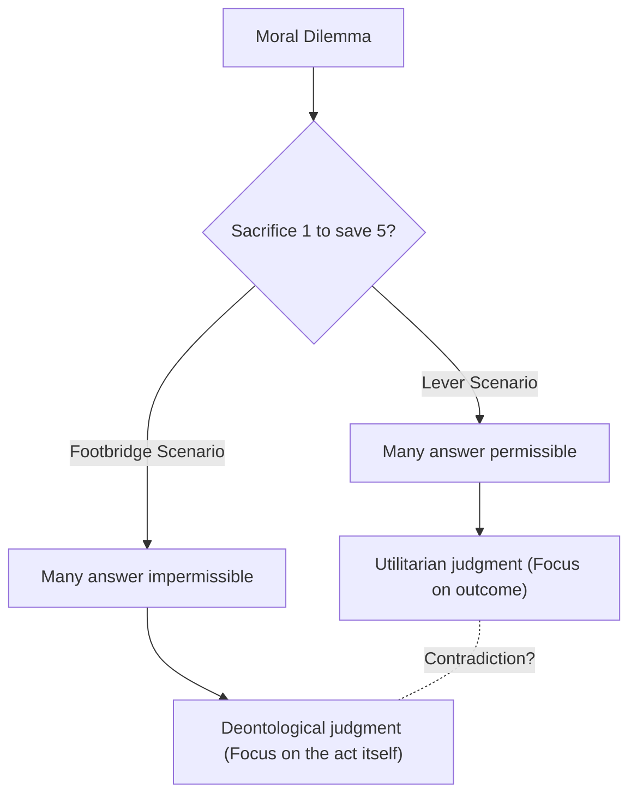
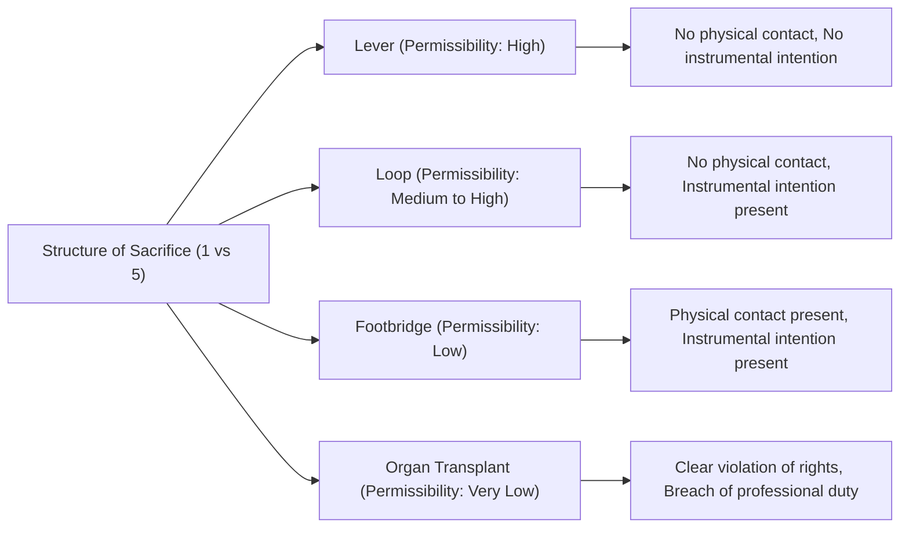

# The Trolley Problem: The Ultimate Choice in Ethics and the Abyss of Human Moral Intuition

## Introduction: The Ultimate Ethical Dilemma

Imagine this. You are standing next to a railway track. You hear a roar from the distance, and a runaway trolley (tram), having lost control, is hurtling toward you at breakneck speed. Looking ahead, there are five workers on the track, and they are unaware of the approaching trolley. At this rate, the five will undoubtedly be run over and killed.

However, right next to you is a lever that controls a switch (point) on the track. If you pull this lever, the trolley will divert onto a side track. But there is another worker on the side track.

**"Do you pull the lever, sacrificing one person to save five? Or do you do nothing and watch the five die?"**

This is the basic form of the "Trolley Problem," the most famous and debated thought experiment in ethics. Simple arithmetic suggests that "saving five lives is better than saving one," but things are not that simple. In this article, through this ultimate dilemma, we will thoroughly explore the deep world of human moral intuition, from utilitarianism and deontology to the latest neuroscience and the AI ethics of self-driving cars.

## 1. The Birth of the Trolley Problem: Philippa Foot's Proposition

The Trolley Problem was first introduced in 1967 by British philosopher Philippa Foot in her paper, "The Problem of Abortion and the Doctrine of the Double Effect." It was originally devised as an auxiliary thought experiment to clarify moral arguments regarding abortion.

In the scenario presented by Foot (the lever scenario above), the vast majority of people answer, "You should pull the lever." The general reason is that "one person dying causes less harm than five people dying." This line of thinking is strongly supported by the ethical stance of "Utilitarianism," advocated by Jeremy Bentham and John Stuart Mill, which considers "the greatest happiness for the greatest number" to be good.

## 2. Development by Judith Jarvis Thomson: The Fat Man Paradox

However, the debate became vastly more complex in 1985 when American philosopher Judith Jarvis Thomson presented a new variation. This is the "Fat Man" scenario.

### The Fat Man on the Footbridge

You are standing on a footbridge over the tracks. The runaway trolley is approaching below, and again, there are five workers ahead. This time, there is no lever. However, standing next to you is a very large "fat man." If you push him off the bridge onto the tracks, his massive body will act as an obstacle to stop the trolley, and the five lives will be saved (though the man pushed will certainly die. Note that you are too light to stop the trolley yourself).

**"Do you push the fat man, sacrificing one person to save five?"**

The mathematical equation of harm is exactly the same as in the first scenario: "sacrifice one to save five." However, surprisingly, in this scenario, the vast majority of people answer that "you should not (it is impermissible to) push him."

Why does it feel permissible to pull a lever to kill one person, but impermissible to kill one person by pushing them with your own hands? This inconsistency in intuition is the true difficulty (paradox) of the Trolley Problem.

## 3. Utilitarianism vs. Deontology: The Two Major Camps in Ethics

To explain this discrepancy in intuition, we need to understand two major approaches in ethics.

### Utilitarianism
This is the stance that evaluates the morality of an action based on its "outcome." An action is considered right if it results in the greatest total amount of happiness (or reduction of suffering). Because it considers "the death of five people to be a worse outcome than the death of one," both pulling the lever and pushing the fat man are considered "right actions."

### Deontology
Represented by Immanuel Kant, this stance evaluates morality not by the "outcome" of an action, but by the "nature of the act itself" or the "motive." Kant preached that "human beings must always be treated as an end, never merely as a means."
Pushing the fat man means using one person as a "means (tool)" to save five, violating human dignity and is thus deemed absolutely wrong. On the other hand, in the initial lever scenario, the death of one person is not an "intended means" to save five, but can be interpreted as merely a "foreseen side effect" that one wished to avoid (the Doctrine of Double Effect, discussed later).

## 4. Further Variations: The Loop and Organ Transplant

The exploration by philosophers does not stop here. By slightly altering the conditions of the thought experiment, they attempt to probe further into the boundaries of our moral intuition.

### The Loop Scenario (Thomson)
In this scenario, the side track loops back to merge with the main track. If you pull the lever, the trolley enters the side track. There is a large worker on the side track; the trolley will hit him and stop, saving the five on the main track. If he were not there, the trolley would go through the loop, return to the main track, and run over the five from behind.
In this case, the death of the one person is not merely a "side effect," but an "indispensable means" to save the five (since without him, the five cannot be saved). However, many people say it is "permissible to pull the lever" even in this scenario. This shakes the Kantian explanation against the fat man scenario (that using someone as a means is impermissible).

### The Organ Transplant Scenario (Foot)
The setting shifts to a hospital. Five patients will die today if they do not receive transplants for different vital organs (heart, lungs, kidneys, etc.) failing due to terminal conditions. A healthy young man arrives for a medical check-up. His organs are a match for all five. As a doctor, if you secretly murder this healthy young man and extract his organs to transplant into the five, you can save five by sacrificing one.
In this scenario, almost 100% of people answer that it is "absolutely impermissible." Yet, the math of harm is exactly the same as the Trolley Problem.

## 5. Doctrine of Double Effect

The "Doctrine of Double Effect," originating with the medieval theologian Thomas Aquinas, is a leading framework used to explain the paradox of the Trolley Problem. According to this principle, if an action produces both a "good effect" and a "bad effect," the action is permissible if it meets the following conditions:

1. The act itself must be good, or at least morally neutral.
2. Only the good effect must be intended, and the bad effect merely foreseen but not intended.
3. The bad effect must not be a means to achieve the good effect.
4. There must be a proportionally grave reason for permitting the bad effect.

In the lever scenario, the act of "diverting the trolley's path" is itself neutral, and the death of one person is foreseen but not intended, nor is it a means. However, in the footbridge scenario, there is a direct harmful act of "pushing someone," and moreover, their death (or using their body as a shield) itself is intended as the means to save the five, so it is judged impermissible by this principle.

## 6. Approaches from Neuroscience and Evolutionary Psychology: Joshua Greene's Dual-Process Theory

Entering the 21st century, the Trolley Problem left the philosophers' armchairs and was brought into the laboratories of neuroscience and psychology. Harvard psychologist Joshua Greene presented various Trolley Problem scenarios to subjects and scanned their brain activity during the process using fMRI (functional magnetic resonance imaging).

The results were astonishing.
- When contemplating the **footbridge scenario** (harm involving direct physical contact), brain regions governing **emotion and intuition** (such as the amygdala) were strongly activated in subjects.
- When contemplating the **lever scenario** (harm not involving physical contact), or when trying to make a utilitarian judgment in the footbridge scenario against intuition ("you should push"), brain regions governing **logical reasoning and cognitive control** (such as the prefrontal cortex) were strongly activated, and they took longer to answer.

From this, Greene proposed the "Dual-process theory."
It posits that human moral judgments are not determined by a single logical system, but by the competition between two systems: an evolutionarily old "emotional/intuitive system" and an evolutionarily new "cognitive/rational system."
For our Stone Age ancestors, directly pushing or striking a companion with one's hands was a daily threat, and we evolved to harbor a strong aversion (emotional brake) toward it. However, the indirect harm of "pulling a lever to kill someone far away" did not exist in the evolutionary process, so the intuitive brake does not engage strongly. As a result, in the lever scenario, the calculation of the prefrontal cortex (1 < 5) wins out, while in the footbridge scenario, emotional aversion overwhelms the calculation.

This discovery gave rise to a new philosophical question: "Is our moral intuition not an absolute truth, but merely a product of evolution (a bug)?"

## 7. Real-World Applications: Self-Driving Cars and AI Ethics

The Trolley Problem, once a pure thought experiment, has become an extremely realistic issue in modern society. The prime example is the development of "self-driving cars (autonomous driving AI)."

When a self-driving car faces an unavoidable accident due to a brake failure, how should the AI be programmed?
- Should it go straight ahead and run over five pedestrians crossing the crosswalk?
- Or should it swerve and crash into a wall, sacrificing the life of the owner (one person) inside?

In a large-scale online study called the "Moral Machine" conducted by MIT, various scenarios were presented to millions of people worldwide to investigate who a self-driving car should prioritize saving (young vs. old, humans vs. animals, law-abiding pedestrians vs. jaywalkers, etc.).
As a result, while a utilitarian view that "more lives should be saved" was universally strong worldwide, significant differences based on cultural backgrounds also became apparent. For example, Eastern cultures showed a stronger tendency to respect the elderly, whereas Western cultures tended to prioritize the youth and children.

Should AI development companies implement programming in their cars that "saves others even at the expense of the owner"? If implemented, would consumers buy a "car that might kill them"? (In many surveys, people give the contradictory answer that "a self-driving car that acts utilitarian for society as a whole is desirable," while simultaneously stating "I don't want to buy such a car myself; I want a car that protects me first and foremost").

The Trolley Problem is no longer a game in philosophy classrooms, but an urgent practical issue faced by engineers, legal scholars, and policymakers.

## 8. Other Real-World Applications and Variations

Besides autonomous driving, there are many real-world situations with a Trolley Problem-like structure.

### Triage in Medicine
In large-scale disasters or pandemics (e.g., the early stages of the COVID-19 outbreak), when medical resources like ventilators are scarce, doctors are forced to choose who to allocate resources to and who to let die. The decision to "concentrate resources on younger people with higher chances of survival and deprioritize the elderly with lower chances" is an actual application of the Trolley Problem based on utilitarianism.

### Targeted Strikes by Military Drones
Bombing a building where a terrorist leader is hiding with a drone can prevent many future terrorist attacks, but innocent civilians nearby will become collateral damage. How should a military commander calculate this balance of sacrifice?

## Conclusion: The Meaning of Facing Unanswerable Questions

Ultimately, there is no "absolutely correct answer" to the Trolley Problem. Both pulling the lever and not pulling it contain solid ethical foundations and fatal flaws.

The true purpose of a thought experiment is not to provide a single correct answer. It is to shake the premises of the moral values we unconsciously hold, and bring their limits and contradictions to light.
We all simultaneously believe in multiple moral rules, such as "all lives are equal," "murder is evil," and "we should save more people." It is only in extreme situations where these rules collide that we realize the shallowness of our own ethics and the complexity of human existence.

In the future society, the day may soon come when AI and technology make complex decisions on our behalf. However, it is us, the humans, who decide what kind of ethics to instil in that AI. The lever of the runaway trolley is now grasped in the hands of our entire society.
