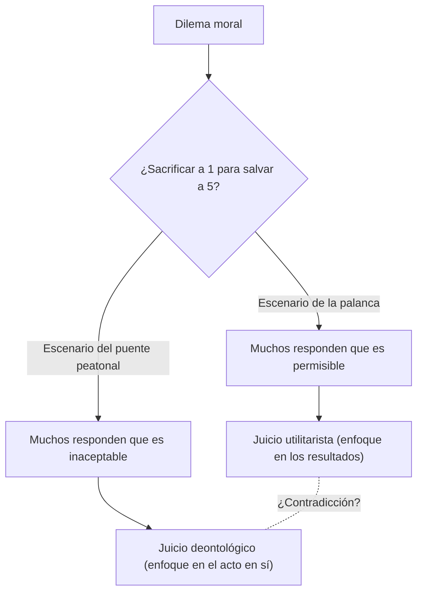
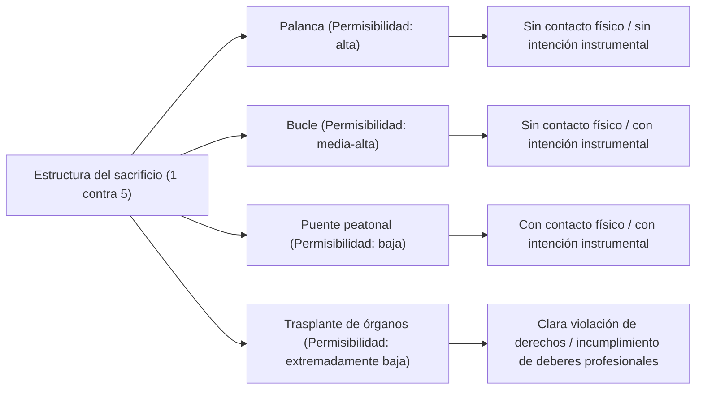

# El problema del tranvía: la elección definitiva en ética y el abismo de la intuición moral humana

## Introducción: El dilema ético definitivo

Imagina esto. Estás de pie junto a las vías del tren. A lo lejos escuchas un estruendo y un tranvía fuera de control se acerca a toda velocidad hacia ti. Al mirar hacia adelante, ves a cinco trabajadores en la vía, quienes no se han dado cuenta de que el tranvía se acerca. Si las cosas siguen así, sin duda los cinco morirán atropellados.

Sin embargo, justo a tu lado hay una palanca que cambia el desvío (cambio de agujas) de las vías. Si tiras de esta palanca, el tranvía cambiará su rumbo hacia una vía de desvío. Pero hay otro trabajador en la vía de desvío.

**"¿Tirarías de la palanca, sacrificando a una persona para salvar a cinco? ¿O te quedarías sin hacer nada y dejarías morir a los cinco?"**

Esta es la forma básica del "problema del tranvía" (Trolley Problem), el experimento mental más famoso y debatido en la ética. Matemáticamente hablando, debería ser "mejor salvar a cinco personas que a una", pero la situación no es tan simple. En este artículo, a través de este dilema definitivo, exploraremos exhaustivamente el profundo mundo de la intuición moral humana, desde el utilitarismo y la deontología, hasta los últimos avances en neurociencia y la ética de la IA en los vehículos autónomos.

## 1. El nacimiento del problema del tranvía: la propuesta de Philippa Foot

El problema del tranvía fue presentado por primera vez en 1967 por la filósofa británica Philippa Foot en su artículo "El problema del aborto y la doctrina del doble efecto". Originalmente fue concebido como un experimento mental auxiliar para aclarar el debate moral sobre el aborto.

En el escenario propuesto por Foot (el escenario de la palanca descrito anteriormente), la mayoría de la gente responde que "debería tirarse de la palanca". La razón general es que "es mejor que muera una persona en lugar de cinco, ya que el daño es menor". Este enfoque está fuertemente respaldado por el "utilitarismo" (Utilitarianism), propuesto por Jeremy Bentham y John Stuart Mill, una postura ética que considera como bueno "la mayor felicidad para el mayor número de personas".

## 2. El desarrollo por Judith Jarvis Thomson: la paradoja del hombre gordo

Sin embargo, en 1985, la filósofa estadounidense Judith Jarvis Thomson presentó una nueva variante, lo que hizo que el debate se volviera mucho más complejo. Este es el escenario del "hombre gordo" (The Fat Man).

### El hombre gordo en el puente peatonal

Estás parado en un puente peatonal que cruza las vías. Abajo, el tranvía descontrolado se acerca, y más adelante están los mismos cinco trabajadores. Esta vez no hay palanca. Sin embargo, a tu lado hay un "hombre gordo" de gran complexión física. Si lo empujas desde el puente hacia las vías, su enorme cuerpo actuará como un obstáculo para detener el tranvía, y se salvarán las vidas de las cinco personas (aunque, por supuesto, él morirá al ser empujado. Por cierto, tú eres demasiado ligero para detener el tranvía).

**"¿Empujarías al hombre gordo, sacrificando a una persona para salvar a cinco?"**

La estructura matemática del daño es exactamente la misma que en el primer escenario: "sacrificar a 1 para salvar a 5". Sin embargo, sorprendentemente, en este escenario la mayoría de las personas responden que "no se debe empujar (es inaceptable)".

¿Por qué sentimos que es aceptable tirar de una palanca para matar a una persona, pero que es inaceptable empujar y matar a una persona con nuestras propias manos? Esta contradicción en nuestra intuición es la verdadera dificultad (paradoja) del problema del tranvía.

## 3. Utilitarismo vs. Deontología: Las dos grandes facciones de la ética

Para explicar esta discrepancia en nuestras intuiciones, necesitamos entender dos de los enfoques principales en la ética.

### Utilitarismo (Utilitarianism)
Es la postura que evalúa la moralidad de una acción en función de sus "resultados". Se considera correcta la elección que maximiza la cantidad total de felicidad (o la reducción del sufrimiento) producida. Ya que considera que "la muerte de cinco personas es un resultado peor que la muerte de una", tanto tirar de la palanca como empujar al hombre gordo se consideran "acciones correctas".

### Deontología (Deontology)
Representada por Immanuel Kant, es la postura que evalúa la moralidad no por los "resultados" de la acción, sino por "la naturaleza de la acción en sí" o el "motivo". Kant argumentaba que "el ser humano debe ser tratado siempre como un fin, y nunca simplemente como un medio".
Empujar al hombre gordo significa usar a una persona como un "medio (herramienta)" para salvar a cinco, violando así la dignidad humana, lo que se considera un mal absoluto. Por otro lado, en el escenario inicial de la palanca, la muerte de una persona no es un "medio intencionado" para salvar a los cinco, sino un "efecto secundario previsto (resultado incidental)" que se deseaba evitar (la doctrina del doble efecto, de la que hablaremos más adelante).

## 4. Más variantes: el bucle y el trasplante de órganos

La exploración filosófica no se detiene aquí. Al alterar sutilmente las condiciones de los experimentos mentales, los filósofos intentan explorar los límites de nuestras intuiciones morales.

### El escenario del bucle (Thomson)
Es un escenario en el que la vía de desvío vuelve a unirse con la vía principal en forma de bucle. Si tiras de la palanca, el tranvía entra en la vía de desvío. Allí hay un trabajador corpulento; el tranvía lo golpeará y se detendrá, salvando así a los cinco en la vía principal. Si esa persona no estuviera allí, el tranvía recorrería el bucle y regresaría a la vía principal, atropellando a las cinco personas por la espalda.
En este caso, la muerte de uno no es un mero "efecto secundario", sino un "medio indispensable" para salvar a los cinco (porque sin él no se les podría salvar). Sin embargo, muchas personas aún responden que "tirar de la palanca es permisible" en este escenario. Esto socava la explicación kantiana contra el escenario del hombre gordo (que prohíbe el uso de personas como medios).

### El escenario del trasplante de órganos (Foot)
La escena cambia a un hospital. Cinco pacientes morirán hoy si no reciben un trasplante debido a la insuficiencia letal de diferentes órganos (corazón, pulmones, riñones, etc.). Un joven sano llega al hospital para un chequeo de rutina. Sus órganos son compatibles con los cinco pacientes. Como médico, si matas en secreto a este joven sano y trasplantas sus órganos, puedes salvar a los cinco sacrificando a uno.
En este escenario, casi el 100% de las personas responde que "es absolutamente inaceptable". Sin embargo, la ecuación matemática del daño es exactamente la misma que en el problema del tranvía.

## 5. La Doctrina del Doble Efecto (Doctrine of Double Effect)

La "doctrina del doble efecto", que se remonta al teólogo medieval Tomás de Aquino, es un marco importante para explicar las contradicciones del problema del tranvía. Según este principio, si una acción tiene tanto un "buen resultado" como un "mal resultado", la acción es permisible si se cumplen las siguientes condiciones:

1. La acción en sí misma es buena, o al menos moralmente neutral.
2. Solo se pretende el buen resultado, y el mal resultado simplemente se prevé pero no se pretende.
3. El mal resultado no es un medio para lograr el buen resultado.
4. Existe una razón suficiente (proporcionalidad) para que el buen resultado supere al mal resultado.

En el escenario de la palanca, la acción de "desviar el tranvía" es neutral; la muerte de una persona se prevé pero no se pretende, y no es un medio. Sin embargo, en el escenario del puente peatonal, hay una acción directa de causar daño ("empujar a una persona"), y la muerte de esa persona (o usar su cuerpo como un escudo) se pretende como el medio para salvar a los cinco, por lo que esta doctrina determina que es inaceptable.

## 6. El enfoque desde la neurociencia y la psicología evolutiva: la teoría del proceso dual de Joshua Greene

En el siglo XXI, el problema del tranvía dejó los sillones de los filósofos y se trasladó a los laboratorios de neurociencia y psicología. Joshua Greene, un psicólogo de la Universidad de Harvard, presentó varios escenarios del problema del tranvía a sujetos mientras escaneaba su actividad cerebral mediante fMRI (resonancia magnética funcional).

Los resultados fueron sorprendentes:
- Al considerar el **escenario del puente peatonal** (daño que implica contacto físico directo), se activaban intensamente las regiones del cerebro relacionadas con las **emociones y la intuición** (como la amígdala).
- Al considerar el **escenario de la palanca** (daño sin contacto físico), o al intentar (contra su intuición) hacer un juicio utilitarista en el escenario del puente peatonal de que "se debe empujar", las regiones responsables del **razonamiento lógico y el control cognitivo** (como la corteza prefrontal) se activaban fuertemente, y los sujetos tardaban más en responder.

A partir de esto, Greene propuso la "teoría del proceso dual" (Dual-process theory).
Afirma que nuestros juicios morales no provienen de un sistema lógico único, sino del conflicto entre dos sistemas: un "sistema emocional/intuitivo" evolutivamente antiguo y un "sistema cognitivo/racional" evolutivamente más reciente.
Para nuestros antepasados de la Edad de Piedra, golpear o empujar directamente a un compañero con sus propias manos era una amenaza cotidiana, por lo que evolucionaron para sentir una fuerte aversión (un freno emocional) ante ello. Sin embargo, el daño indirecto como "tirar de una palanca y causar la muerte a alguien lejano" no existía en nuestro proceso evolutivo, por lo que el freno intuitivo no actúa con fuerza. Como resultado, en el escenario de la palanca gana el cálculo de la corteza prefrontal (1 < 5), mientras que en el escenario del puente peatonal, la aversión emocional supera el cálculo.

Este descubrimiento planteó una nueva pregunta filosófica: "¿Son nuestras intuiciones morales no verdades absolutas, sino simplemente subproductos (errores) de la evolución?".

## 7. Aplicación en el mundo real: Vehículos autónomos y ética de la IA

El problema del tranvía, que antes era un experimento mental puro, se ha convertido en un desafío muy real en la sociedad moderna. El mejor ejemplo es el desarrollo de "vehículos autónomos (IA de conducción autónoma)".

Cuando un vehículo autónomo se enfrenta a un accidente inevitable debido a, por ejemplo, un fallo en los frenos, ¿cómo debería estar programada la IA?
- ¿Debería seguir recto y atropellar a cinco peatones que cruzan el paso de cebra?
- ¿O debería girar el volante para chocar contra un muro, sacrificando la vida del propietario (1 persona) que va dentro?

El MIT (Instituto Tecnológico de Massachusetts) llevó a cabo una gran encuesta en línea llamada "Máquina Moral" (Moral Machine), presentando varios escenarios a millones de personas de todo el mundo para investigar a quién debería priorizar un vehículo autónomo (jóvenes o ancianos, humanos o animales, peatones que respetan las normas o peatones que se saltan el semáforo en rojo, etc.).
Como resultado, aunque la perspectiva utilitarista de que "se deben salvar más vidas" era fuerte a nivel mundial, también quedó claro que existían grandes diferencias según el entorno cultural. Por ejemplo, en las culturas orientales había una fuerte tendencia a respetar a los ancianos, mientras que en occidente se priorizaba a los jóvenes y los niños.

¿Deberían las empresas de desarrollo de IA implementar programas en sus vehículos que "sacrifiquen al propietario para salvar a otros"? Si lo hicieran, ¿comprarían los consumidores "un coche que podría matarles"? (En muchas encuestas, las personas mostraron respuestas contradictorias, indicando que "es deseable que los vehículos autónomos actúen de forma utilitarista para la sociedad en general", pero que "ellos mismos no querrían comprar tal coche [quieren un coche que los proteja como prioridad principal]").

El problema del tranvía ya no es un juego en una clase de filosofía, sino un problema práctico urgente al que se enfrentan ingenieros, juristas y responsables políticos.

## 8. Otras aplicaciones y variantes en el mundo real

Además de la conducción autónoma, existen muchas situaciones en la realidad que tienen una estructura similar al problema del tranvía.

### Triaje en medicina
En un desastre a gran escala o una pandemia (por ejemplo, en las primeras etapas del brote de COVID-19), cuando hay escasez de recursos médicos como los respiradores artificiales, los médicos se ven obligados a elegir a quién asignar los recursos y a quién abandonar. La decisión de "concentrar los recursos en los jóvenes con mayor probabilidad de supervivencia y postergar a los ancianos con menos posibilidades" es exactamente la puesta en práctica del problema del tranvía basado en el utilitarismo.

### Ataques selectivos con drones militares
Si se bombardea con un vehículo aéreo no tripulado (dron) un edificio donde se esconde un líder terrorista, se pueden prevenir muchos ataques terroristas en el futuro, pero al mismo tiempo habrá daños colaterales a civiles inocentes que se encuentren en los alrededores. ¿Cómo debería un comandante militar calcular este equilibrio de sacrificios?

## Conclusión: El significado de enfrentar preguntas sin respuesta

A fin de cuentas, no existe una "respuesta absolutamente correcta" para el problema del tranvía. Tanto tirar de la palanca como no hacerlo tienen fundamentos éticos sólidos y defectos fatales.

El verdadero propósito del experimento mental no es encontrar una única respuesta correcta. Consiste en sacudir las premisas de los valores morales que albergamos inconscientemente y exponer sus límites y contradicciones a la luz del día.
Todos creemos simultáneamente en múltiples reglas morales, como que "la vida es igual", "el asesinato es malo" y "se debe salvar a tantas personas como sea posible", pero solo en situaciones extremas donde estas reglas colisionan, nos damos cuenta de lo superficiales que son nuestras propias éticas y de la complejidad del ser humano.

En la sociedad futura, puede que no esté lejos el día en que la IA y la tecnología tomen decisiones complejas en nuestro lugar. Sin embargo, somos los humanos quienes decidimos qué tipo de ética enseñar a esa IA. La palanca del tranvía descontrolado está ahora mismo en manos de toda nuestra sociedad.
