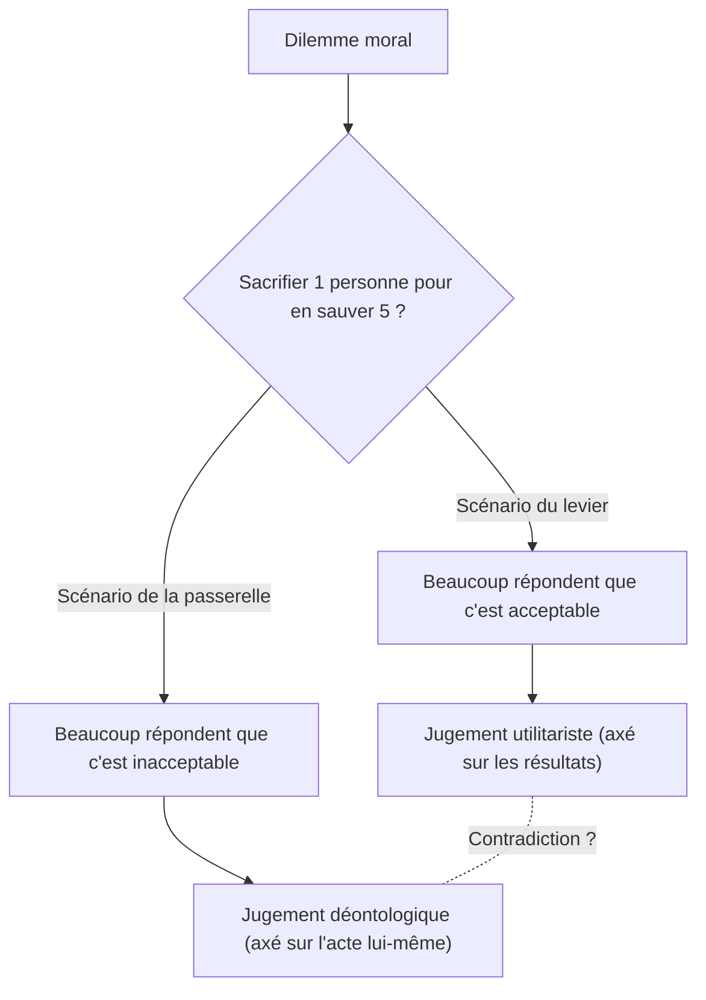

# Le problème du tramway : le choix ultime de l'éthique et les abysses de l'intuition morale humaine

## Introduction : Le dilemme éthique ultime

Imaginez. Vous vous tenez au bord d'une voie ferrée. Vous entendez un grondement au loin et voyez un tramway hors de contrôle foncer à toute vitesse vers vous. En regardant devant, il y a cinq ouvriers sur la voie, qui ne sont pas conscients de l'approche du tramway. S'il continue ainsi, les cinq seront sans aucun doute écrasés.

Cependant, juste à côté de vous se trouve un levier d'aiguillage. Si vous tirez ce levier, le tramway changera de direction vers une voie d'évitement. Néanmoins, il y a un autre ouvrier sur cette voie de déviation.

**« Tirerez-vous le levier, sacrifiant une personne pour en sauver cinq ? Ou bien, ne ferez-vous rien et laisserez-vous les cinq personnes mourir ? »**

C'est la forme fondamentale du « problème du tramway » (Trolley Problem), l'expérience de pensée la plus célèbre et la plus débattue en éthique. Un simple calcul suggérerait qu'« il vaut mieux sauver cinq vies plutôt qu'une », mais la situation n'est pas si simple. Cet article explore en profondeur le monde complexe de notre intuition morale à travers ce dilemme ultime, de l'utilitarisme à la déontologie, en passant par les récentes découvertes en neurosciences et l'éthique des intelligences artificielles (IA) dans les véhicules autonomes.

## 1. La naissance du problème du tramway : La proposition de Philippa Foot

Le problème du tramway a été présenté pour la première fois en 1967 par la philosophe britannique Philippa Foot dans son essai « Le problème de l'avortement et la doctrine du double effet ». Il a été initialement conçu comme une expérience de pensée auxiliaire pour clarifier le débat moral sur l'avortement.

Dans le scénario présenté par Foot (le scénario du levier ci-dessus), la grande majorité des gens répondent qu'ils « devraient tirer le levier ». La raison générale est qu'« un seul mort fait moins de dégâts que cinq ». Cette façon de penser est fortement étayée par la perspective éthique de l'« utilitarisme », prônée par Jeremy Bentham et John Stuart Mill, qui considère comme bien « le plus grand bonheur pour le plus grand nombre ».

## 2. Le développement par Judith Jarvis Thomson : Le paradoxe de l'homme gros

Cependant, en 1985, la philosophe américaine Judith Jarvis Thomson a introduit une nouvelle variation qui a rendu le débat beaucoup plus complexe. Il s'agit du scénario de « l'homme gros » (The Fat Man).

### L'homme gros sur la passerelle

Vous vous trouvez sur une passerelle au-dessus de la voie ferrée. En dessous, un tramway hors de contrôle s'approche, avec toujours cinq ouvriers plus loin. Cette fois, il n'y a pas de levier. Mais, à côté de vous, se tient un « homme gros » de forte corpulence. Si vous le poussez par-dessus le pont sur la voie, son corps massif agira comme un obstacle et arrêtera le tramway, sauvant ainsi la vie des cinq ouvriers (cependant, l'homme poussé mourra à coup sûr. Notez que votre propre poids est trop faible pour arrêter le tramway).

**« Pousserez-vous l'homme gros, sacrifiant une personne pour en sauver cinq ? »**

La structure mathématique des dommages est exactement la même que dans le premier scénario : « sacrifier une personne pour en sauver cinq ». Pourtant, de manière surprenante, dans ce scénario, la grande majorité des gens répondent qu'« on ne devrait pas le pousser (c'est inacceptable) ».

Pourquoi tirer un levier pour tuer une personne est-il jugé acceptable, alors que tuer quelqu'un de ses propres mains en le poussant semble inacceptable ? C'est précisément cette contradiction de l'intuition qui constitue la véritable difficulté (le paradoxe) du problème du tramway.

## 3. Utilitarisme contre Déontologie : Les deux grands camps de l'éthique

Pour expliquer cette incohérence intuitive, il est nécessaire de comprendre deux approches majeures en éthique.

### L'utilitarisme (Utilitarianism)
C'est la position qui évalue la moralité d'un acte selon ses « résultats ». Elle considère comme juste le choix qui maximise la quantité totale de bonheur produit (ou réduit au maximum la souffrance). Étant donné que « la mort de cinq personnes est un pire résultat que la mort d'une personne », tirer le levier et pousser l'homme gros sont tous deux considérés comme de « bonnes actions ».

### La déontologie (Deontology)
Représentée par Emmanuel Kant, c'est la position qui évalue la moralité non pas par les « résultats » de l'acte, mais par « la nature de l'acte lui-même » et ses « motivations ». Kant a enseigné qu'« il faut toujours traiter l'humanité comme une fin en soi, et jamais simplement comme un moyen ».
Pousser l'homme gros consiste à utiliser une personne humaine comme un « moyen » (outil) pour sauver cinq personnes, ce qui est considéré comme un mal absolu car cela viole la dignité humaine. En revanche, dans le premier scénario du levier, la mort d'une personne n'est pas interprétée comme un « moyen intentionnel » pour en sauver cinq, mais comme un « effet secondaire prévu (résultat fortuit) » qu'on aurait souhaité éviter (voir la doctrine du double effet ci-dessous).

## 4. D'autres variations : La boucle et la greffe d'organes

L'exploration philosophique ne s'arrête pas là. En modifiant subtilement les conditions de l'expérience de pensée, les philosophes tentent de sonder davantage les frontières de notre intuition morale.

### Le scénario de la boucle (Thomson)
C'est un scénario où la voie d'évitement forme une boucle qui rejoint la voie principale. Si vous tirez le levier, le tramway s'engage sur la voie d'évitement. Sur cette voie se trouve un grand ouvrier ; le tramway le percutera et s'arrêtera, sauvant ainsi les cinq ouvriers sur la voie principale. S'il n'était pas là, le tramway parcourrait la boucle pour revenir sur la voie principale et écraserait les cinq par derrière.
Dans ce cas, la mort d'une personne n'est plus un simple « effet secondaire », mais un « moyen indispensable » pour sauver les cinq (car sans lui, on ne pourrait pas les sauver). Pourtant, même dans ce scénario, beaucoup de gens répondent qu'« il est acceptable de tirer le levier ». Cela remet en question l'explication kantienne du scénario de l'homme gros (l'utilisation comme moyen est inacceptable).

### Le scénario de la transplantation d'organes (Foot)
La scène se déplace dans un hôpital. Cinq patients mourront aujourd'hui à moins de recevoir une greffe pour différentes insuffisances organiques mortelles (cœur, poumons, reins, etc.). Un jeune homme en bonne santé se présente alors pour un examen de routine. Ses organes sont compatibles avec les cinq patients. En tant que médecin, si vous tuez secrètement ce jeune homme pour lui retirer ses organes et les greffer aux cinq patients, vous pouvez sauver cinq personnes en sacrifiant une seule.
Dans ce scénario, presque 100 % des gens répondent que c'est « absolument inacceptable ». Et pourtant, l'équation des dommages est exactement la même que dans le problème du tramway.

## 5. La doctrine du double effet (Doctrine of Double Effect)

La « doctrine du double effet », issue du théologien médiéval Thomas d'Aquin, est un cadre conceptuel puissant pour expliquer les contradictions du problème du tramway. Selon ce principe, si une action produit à la fois un « bon effet » et un « mauvais effet », elle est acceptable si elle remplit les conditions suivantes :

1. L'action elle-même est bonne, ou au moins moralement neutre.
2. Seul le bon effet est intentionnel, le mauvais effet est simplement prévu et non intentionnel.
3. Le mauvais effet ne sert pas de moyen pour obtenir le bon effet.
4. Il y a une raison proportionnellement suffisante pour permettre le mauvais effet face au bon effet.

Dans le scénario du levier, l'action de « dévier la trajectoire du tramway » est neutre en soi, la mort d'une personne est prévue mais non intentionnelle, et n'est pas un moyen. En revanche, dans le scénario de la passerelle, il y a une action directe de nuisance (« pousser quelqu'un »), et la mort de la personne (ou l'utilisation de son corps comme bouclier) est intentionnellement employée comme un moyen de sauver cinq personnes, ce qui est jugé inacceptable par ce principe.

## 6. Approche des neurosciences et de la psychologie évolutionniste : La théorie des processus duels de Joshua Greene

Au 21e siècle, le problème du tramway a quitté les fauteuils des philosophes pour entrer dans les laboratoires de neurosciences et de psychologie. Le psychologue de l'Université de Harvard, Joshua Greene, a soumis divers scénarios du problème du tramway à des sujets, tout en scannant leur activité cérébrale par IRMf (imagerie par résonance magnétique fonctionnelle).

Les résultats ont été stupéfiants :
- En considérant **le scénario de la passerelle** (préjudice direct impliquant un contact physique), les zones du cerveau gérant **les émotions et l'intuition** (comme l'amygdale) étaient fortement activées chez les sujets.
- En considérant **le scénario du levier** (préjudice sans contact physique), ou lorsque les sujets tentaient (contre leur intuition) de porter un jugement utilitariste dans le scénario de la passerelle, les zones du cerveau gérant **le raisonnement logique et le contrôle cognitif** (comme le cortex préfrontal) étaient fortement activées, et il leur fallait plus de temps pour répondre.

Greene a ainsi proposé la « théorie des processus duels (Dual-process theory) ».
Selon lui, nos jugements moraux ne découlent pas d'un système logique unique, mais de la compétition entre deux systèmes : un « système émotionnel et intuitif » ancien du point de vue de l'évolution, et un « système cognitif et rationnel » plus récent.
Pour nos ancêtres de l'âge de pierre, pousser ou frapper directement un congénère de leurs propres mains était une menace quotidienne, et nous avons évolué pour ressentir une forte aversion (un frein émotionnel) face à cela. En revanche, un dommage indirect tel que « tirer un levier pour tuer quelqu'un au loin » n'existait pas au cours de l'évolution, le frein intuitif s'y active donc faiblement. Par conséquent, le calcul du cortex préfrontal (1 < 5) l'emporte dans le scénario du levier, tandis que l'aversion émotionnelle submerge ce calcul dans le scénario de la passerelle.

Cette découverte a soulevé une nouvelle question philosophique : « Nos intuitions morales ne sont-elles pas des vérités absolues, mais de simples produits (ou bugs) de l'évolution ? »

## 7. Application dans le monde réel : Les voitures autonomes et l'éthique de l'IA

Le problème du tramway, autrefois pure expérience de pensée, est devenu un enjeu très réel dans la société moderne. Le développement des « voitures autonomes (IA de conduite autonome) » en est l'exemple le plus flagrant.

Lorsqu'une voiture autonome fait face à un accident inévitable, par exemple à cause d'une panne de freins, comment l'IA devrait-elle être programmée pour réagir ?
- Doit-elle continuer tout droit et écraser cinq piétons traversant sur un passage clouté ?
- Ou bien doit-elle braquer, percuter un mur et sacrifier la vie du propriétaire à bord (1 personne) ?

Une vaste enquête en ligne menée par le MIT (Massachusetts Institute of Technology), appelée « Moral Machine », a soumis divers scénarios à des millions de personnes à travers le monde pour déterminer qui une voiture autonome devrait prioriser de sauver (jeunes ou personnes âgées, humains ou animaux, piétons respectueux des lois ou ceux ignorant les feux de circulation, etc.).
Les résultats ont révélé qu'il existait une forte tendance utilitariste globale selon laquelle « il faut sauver le plus grand nombre de vies », tout en mettant en évidence de grandes différences liées aux cultures. Par exemple, les cultures orientales montraient une plus forte propension à respecter les personnes âgées, tandis que l'Occident tendait à prioriser les jeunes et les enfants.

Les entreprises de développement d'IA devraient-elles implémenter des programmes dans leurs véhicules qui « sacrifieraient le propriétaire pour sauver d'autres personnes » ? S'ils le faisaient, les consommateurs achèteraient-ils « une voiture qui pourrait les tuer » ? (Dans de nombreuses enquêtes, bien que les gens affirment qu'« il est préférable que les voitures autonomes agissent de manière utilitariste pour la société dans son ensemble », ils montrent également des réponses contradictoires en déclarant qu'« ils ne voudraient pas acheter ce genre de voiture pour eux-mêmes (ils veulent une voiture qui les protège en priorité) »).

Le problème du tramway n'est plus un simple jeu de classe de philosophie, mais un défi pratique urgent pour les ingénieurs, les juristes et les décideurs politiques.

## 8. Autres applications pratiques et variations

Au-delà de la conduite autonome, il existe de nombreuses réalités présentant une structure similaire à celle du problème du tramway.

### Le triage en médecine
Lors de catastrophes majeures ou de pandémies (par exemple, au début de la pandémie de COVID-19), lorsque les ressources médicales telles que les respirateurs artificiels viennent à manquer, les médecins sont contraints de décider à qui allouer les ressources et qui laisser de côté. La décision de « concentrer les ressources sur les jeunes ayant de plus grandes chances de survie et reléguer au second plan les personnes âgées avec peu d'espoir » est précisément une mise en pratique du problème du tramway fondée sur l'utilitarisme.

### Les frappes de drones militaires
Bombarder avec un drone un bâtiment où se cache le chef d'un groupe terroriste peut prévenir de nombreuses attaques futures, mais en même temps, des civils innocents se trouvant à proximité seront victimes de dommages collatéraux. Comment un commandant militaire devrait-il calculer l'équilibre de ces sacrifices ?

## Conclusion : Le sens de faire face à une question sans réponse

En fin de compte, il n'existe pas de « bonne réponse absolue » au problème du tramway. Que l'on tire ou non le levier, chaque choix comporte des fondements éthiques solides mais aussi des failles fatales.

Le véritable but de cette expérience de pensée n'est pas de trouver une réponse unique, mais d'ébranler les fondements des valeurs morales que nous portons inconsciemment, et de mettre en lumière leurs limites et leurs contradictions.
Nous croyons tous simultanément en plusieurs règles morales, telles que « toutes les vies sont égales », « le meurtre est mal » et « il faut sauver le plus grand nombre ». Mais ce n'est que dans des situations extrêmes où ces principes entrent en collision que nous prenons conscience de la superficialité de notre éthique et de la complexité de l'existence humaine.

Dans la société de demain, le jour où l'IA et la technologie prendront des décisions complexes à notre place n'est peut-être plus si lointain. Cependant, c'est à nous, humains, de décider quelle éthique inculquer à cette IA. Le levier du tramway hors de contrôle est aujourd'hui fermement tenu entre les mains de notre société tout entière.
