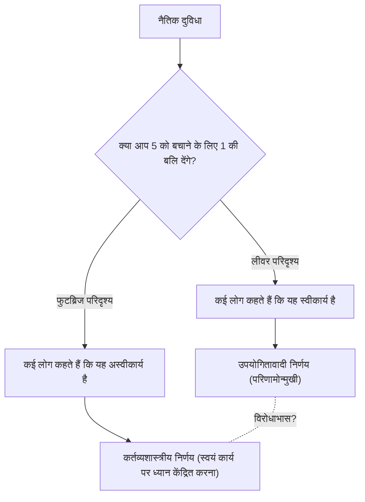
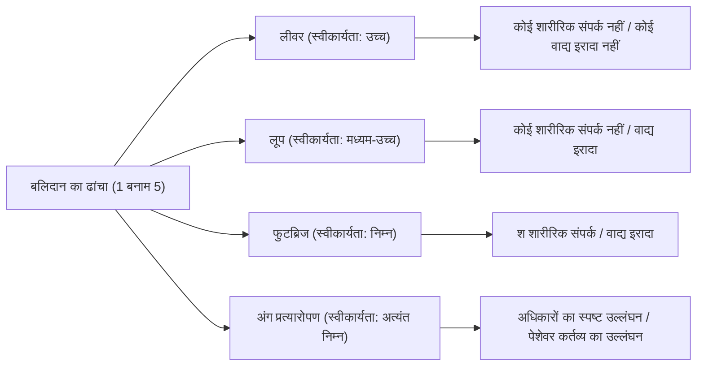

# ट्रॉली समस्या: नैतिकता में अंतिम विकल्प और मानव नैतिक अंतर्ज्ञान की गहराई

## परिचय: अंतिम नैतिक दुविधा

कल्पना कीजिए। आप रेलवे ट्रैक के किनारे खड़े हैं। दूर से एक गड़गड़ाहट सुनाई देती है, और एक बेकाबू ट्रॉली (ट्राम) तेज़ गति से आपकी ओर आ रही है। आगे देखते हुए, ट्रैक पर 5 कर्मचारी हैं जो ट्रॉली के आने से अनजान हैं। अगर ऐसा ही चलता रहा तो निःसंदेह पांचों कुचल कर मर जाएंगे।

हालाँकि, आपके ठीक बगल में ट्रैक के स्विच (पॉइंट) को बदलने के लिए एक लीवर है। यदि आप इस लीवर को खींचते हैं, तो ट्रॉली अपना रास्ता एक साइड ट्रैक (साइडिंग) की ओर बदल लेगी। लेकिन, साइड ट्रैक पर 1 अन्य कर्मचारी है।

**"क्या आप लीवर खींचेंगे और 5 को बचाने के लिए 1 की बलि देंगे? या आप कुछ नहीं करेंगे और 5 लोगों को मरता हुआ देखेंगे?"**

यह "ट्रॉली समस्या (Trolley Problem)" का मूल रूप है, जो नैतिकता में सबसे प्रसिद्ध और सबसे अधिक बहस वाले विचार प्रयोगों में से एक है। सरल गणित के अनुसार, "1 को बचाने की तुलना में 5 लोगों की जान बचाना बेहतर है", लेकिन स्थिति इतनी सरल नहीं है। इस लेख में, हम इस अंतिम दुविधा के माध्यम से मानव नैतिक अंतर्ज्ञान की गहरी दुनिया का पता लगाएंगे, उपयोगितावाद और कर्तव्यशास्त्र से लेकर नवीनतम तंत्रिका विज्ञान और सेल्फ-ड्राइविंग कारों की AI नैतिकता तक।

## 1. ट्रॉली समस्या का जन्म: फिलिप्पा फुट की प्रस्तुति

ट्रॉली समस्या पहली बार 1967 में ब्रिटिश दार्शनिक फिलिप्पा फुट (Philippa Foot) द्वारा प्रकाशित पेपर "गर्भपात की समस्या और दोहरे प्रभाव का सिद्धांत" में प्रस्तुत की गई थी। इसे मूल रूप से गर्भपात के इर्द-गिर्द नैतिक तर्कों को स्पष्ट करने के लिए एक सहायक विचार प्रयोग के रूप में तैयार किया गया था।

फुट द्वारा प्रस्तुत परिदृश्य (ऊपर दिया गया लीवर परिदृश्य) में, अधिकांश लोग जवाब देते हैं कि "लीवर खींचा जाना चाहिए।" सामान्य कारण यह है कि "1 व्यक्ति के मरने से 5 लोगों के मरने की तुलना में कम नुकसान होता है।" यह विचार "उपयोगितावाद (Utilitarianism)" द्वारा दृढ़ता से समर्थित है, जिसकी वकालत जेरेमी बेंथम और जॉन स्टुअर्ट मिल ने की थी, जो "अधिकतम लोगों के लिए अधिकतम खुशी" को सबसे अच्छी नैतिक स्थिति मानता है।

## 2. जूडिथ जार्विस थॉमसन द्वारा विकास: मोटे आदमी का विरोधाभास

हालाँकि, 1985 में, अमेरिकी दार्शनिक जूडिथ जार्विस थॉमसन (Judith Jarvis Thomson) ने एक नई विविधता प्रस्तुत की, जिसने चर्चा को अचानक जटिल बना दिया। यह "मोटा आदमी (The Fat Man)" परिदृश्य है।

### फुटब्रिज पर मोटा आदमी

आप पटरियों के ऊपर एक फुटब्रिज पर खड़े हैं। नीचे एक बेकाबू ट्रॉली आ रही है, और हमेशा की तरह, आगे 5 कर्मचारी हैं। इस बार कोई लीवर नहीं है। हालाँकि, आपके बगल में बहुत भारी शरीर वाला एक "मोटा आदमी" खड़ा है। यदि आप उसे पुल से पटरियों पर धकेलते हैं, तो उसका विशाल शरीर एक बाधा बन जाएगा और ट्रॉली को रोक देगा, जिससे 5 लोगों की जान बच जाएगी (हालांकि, जिसे धकेला गया है वह निश्चित रूप से मर जाएगा। वैसे, आपका वजन ट्रॉली को रोकने के लिए बहुत हल्का है)।

**"क्या आप 5 लोगों को बचाने के लिए मोटे आदमी को धकेलेंगे और 1 की बलि देंगे?"**

गणितीय क्षति का ढांचा बिल्कुल पहले परिदृश्य जैसा ही है: "5 को बचाने के लिए 1 की बलि देना"। हालाँकि, आश्चर्यजनक रूप से, इस परिदृश्य में, अधिकांश लोग जवाब देते हैं कि "आपको धक्का नहीं देना चाहिए (यह अस्वीकार्य है)।"

ऐसा क्यों है कि लीवर खींचना और 1 व्यक्ति को मारना स्वीकार्य माना जाता है, लेकिन 1 व्यक्ति को अपने हाथों से धकेल कर मारना अस्वीकार्य लगता है? अंतर्ज्ञान में यह विरोधाभास ट्रॉली समस्या की सच्ची कठिनाई (विरोधाभास) है।

## 3. उपयोगितावाद बनाम कर्तव्यशास्त्र: नैतिकता के दो प्रमुख शिविर

इस अंतर्ज्ञान विसंगति को समझाने के लिए, हमें नैतिकता में दो मुख्य दृष्टिकोणों को समझने की आवश्यकता है।

### उपयोगितावाद (Utilitarianism)
यह एक ऐसा दृष्टिकोण है जो किसी कार्य की नैतिकता का मूल्यांकन उसके "परिणामों" से करता है। यह उस विकल्प को सही मानता है जो उत्पन्न होने वाली खुशी की कुल मात्रा (या दर्द में कमी) को अधिकतम करता है। चूंकि "5 लोगों की मृत्यु 1 व्यक्ति की मृत्यु से भी बदतर परिणाम है," लीवर खींचना या मोटे व्यक्ति को धक्का देना दोनों "सही कार्य" माने जाते हैं।

### कर्तव्यशास्त्र (Deontology)
इमैनुएल कांट द्वारा दर्शाया गया, यह एक ऐसा दृष्टिकोण है जो किसी कार्य की नैतिकता का मूल्यांकन उसके "परिणामों" से नहीं बल्कि "स्वयं कार्य की प्रकृति" या "उद्देश्य" से करता है। कांट ने तर्क दिया कि "मनुष्य को केवल एक साधन के रूप में नहीं, बल्कि हमेशा एक साध्य के रूप में माना जाना चाहिए।"
मोटे आदमी को धक्का देने का कार्य 5 लोगों को बचाने के लिए 1 व्यक्ति का "साधन (उपकरण)" के रूप में उपयोग करना है, और इसे पूरी तरह से बुरा माना जाता है क्योंकि यह मानवीय गरिमा का उल्लंघन करता है। दूसरी ओर, पहले लीवर परिदृश्य में, 1 व्यक्ति की मृत्यु की व्याख्या 5 को बचाने के लिए "इरादतन साधन" के रूप में नहीं की जाती है, बल्कि केवल एक "पूर्वानुमानित दुष्प्रभाव (आकस्मिक परिणाम)" के रूप में की जाती है जिसे टाला जाना था (बाद में वर्णित दोहरे प्रभाव का सिद्धांत)।

## 4. आगे की विविधताएँ: लूप और अंग प्रत्यारोपण

दार्शनिकों की खोज यहीं नहीं रुकती। विचार प्रयोग की शर्तों को सूक्ष्म रूप से बदलकर, वे हमारे नैतिक अंतर्ज्ञान की सीमाओं का और पता लगाने का प्रयास करते हैं।

### लूप परिदृश्य (थॉमसन)
यह एक ऐसा परिदृश्य है जहाँ साइड ट्रैक एक लूप बनाता है जो फिर से मुख्य ट्रैक में मिल जाता है। यदि आप लीवर खींचते हैं, तो ट्रॉली साइड ट्रैक पर चली जाती है। साइड ट्रैक पर 1 बड़ा कर्मचारी है, और ट्रॉली उससे टकराने से रुक जाएगी, जिससे मुख्य ट्रैक पर 5 लोग बच जाएंगे। यदि वह 1 व्यक्ति वहां नहीं होता, तो ट्रॉली लूप से होकर मुख्य ट्रैक पर वापस आ जाती और 5 लोगों को पीछे से कुचल देती।
इस मामले में, 1 व्यक्ति की मृत्यु केवल एक "दुष्प्रभाव" नहीं है, बल्कि 5 लोगों को बचाने के लिए एक "अपरिहार्य साधन" है (क्योंकि उसके बिना, 5 को बचाया नहीं जा सकता)। हालाँकि, कई लोग अभी भी जवाब देते हैं कि इस परिदृश्य में भी "लीवर खींचना स्वीकार्य है।" यह मोटे आदमी के परिदृश्य (जहां साधन के रूप में उपयोग अस्वीकार्य है) के लिए कांटियन स्पष्टीकरण को कमजोर करता है।

### अंग प्रत्यारोपण परिदृश्य (फुट)
दृश्य एक अस्पताल में स्थानांतरित हो जाता है। 5 मरीज़ हैं जो आज मरने वाले हैं यदि उन्हें प्रत्यारोपण नहीं मिलता है, क्योंकि उनके विभिन्न अंग (हृदय, फेफड़े, गुर्दे, आदि) घातक रूप से विफल हो रहे हैं। फिर, एक स्वस्थ युवक स्वास्थ्य जांच के लिए आता है। उसके अंग सभी 5 लोगों के साथ मेल खाते हैं। एक डॉक्टर के रूप में, यदि आप गुप्त रूप से इस स्वस्थ युवक की हत्या करते हैं और उसके अंगों को 5 लोगों में प्रत्यारोपित करते हैं, तो आप 5 को बचाने के लिए 1 की बलि दे सकते हैं।
इस परिदृश्य में, लगभग 100% लोग जवाब देते हैं "बिल्कुल अस्वीकार्य।" फिर भी, क्षति की गणना ट्रॉली समस्या के समान ही है।

## 5. दोहरे प्रभाव का सिद्धांत (Doctrine of Double Effect)

मध्ययुगीन धर्मशास्त्री थॉमस एक्विनास से उत्पन्न "दोहरे प्रभाव का सिद्धांत", ट्रॉली समस्या के विरोधाभास को समझाने के लिए एक प्रमुख ढांचा है। इस सिद्धांत के अनुसार, यदि किसी कार्य के "अच्छे परिणाम" और "बुरे परिणाम" दोनों होते हैं, तो वह कार्य स्वीकार्य है यदि वह निम्नलिखित शर्तों को पूरा करता है:

1. कार्य स्वयं अच्छा है, या कम से कम नैतिक रूप से तटस्थ है।
2. केवल अच्छा परिणाम ही अभिप्रेत है, और बुरा परिणाम केवल पूर्वानुमानित है लेकिन अभिप्रेत नहीं है।
3. बुरा परिणाम अच्छा परिणाम प्राप्त करने का साधन नहीं है।
4. अच्छे परिणाम के लिए बुरे परिणाम को पछाड़ने के लिए पर्याप्त कारण (आनुपातिकता) है।

लीवर परिदृश्य में, "ट्रॉली के मार्ग को भटकाने" का कार्य स्वयं तटस्थ है, और 1 व्यक्ति की मृत्यु का पूर्वाभास है लेकिन इसका इरादा नहीं है, न ही यह एक साधन है। हालाँकि, फुटब्रिज परिदृश्य में, "किसी को धक्का देना" नुकसान का एक सीधा कार्य है, और 5 लोगों को बचाने के साधन के रूप में उसकी मृत्यु (या उसके शरीर को ढाल के रूप में उपयोग करना) का इरादा है, इसलिए इस सिद्धांत के तहत इसे अस्वीकार्य माना जाता है।

## 6. तंत्रिका विज्ञान और विकासवादी मनोविज्ञान का दृष्टिकोण: जोशुआ ग्रीन का दोहरी प्रक्रिया सिद्धांत

21वीं सदी में प्रवेश करते हुए, ट्रॉली समस्या ने दार्शनिकों की आर्मचेयर छोड़ दी और मस्तिष्क विज्ञान और मनोविज्ञान की प्रयोगशालाओं में प्रवेश किया। हार्वर्ड विश्वविद्यालय के मनोवैज्ञानिक जोशुआ ग्रीन (Joshua Greene) ने विषयों को विभिन्न ट्रॉली समस्या परिदृश्य प्रस्तुत किए और fMRI (कार्यात्मक चुंबकीय अनुनाद इमेजिंग) के साथ उनकी मस्तिष्क गतिविधि को स्कैन किया।

परिणाम आश्चर्यजनक थे।
- जब **फुटब्रिज परिदृश्य** (प्रत्यक्ष शारीरिक संपर्क से जुड़ा नुकसान) पर विचार किया गया, तो मस्तिष्क के **भावनाओं और अंतर्ज्ञान** को नियंत्रित करने वाले क्षेत्र (जैसे एमिग्डाला) विषयों में दृढ़ता से सक्रिय हो गए।
- जब **लीवर परिदृश्य** (श शारीरिक संपर्क के बिना नुकसान) पर विचार किया गया, या जब विषयों ने फुटब्रिज परिदृश्य में उपयोगितावादी निर्णय लेने की कोशिश की (उनके अंतर्ज्ञान के विरुद्ध जाकर कि उन्हें "धक्का देना चाहिए"), तो मस्तिष्क के **तार्किक तर्क और संज्ञानात्मक नियंत्रण** को नियंत्रित करने वाले क्षेत्र (जैसे प्रीफ्रंटल कॉर्टेक्स) दृढ़ता से सक्रिय हो गए, और उत्तर देने में अधिक समय लगा।

यहां से, ग्रीन ने "दोहरी प्रक्रिया सिद्धांत (Dual-process theory)" का प्रस्ताव रखा।
मानव नैतिक निर्णय एकल तार्किक प्रणाली द्वारा निर्धारित नहीं होते हैं, बल्कि विकासवादी पुरानी "भावनात्मक और सहज प्रणाली" और विकासवादी नई "संज्ञानात्मक और तर्कसंगत प्रणाली" के बीच प्रतिस्पर्धा द्वारा निर्धारित होते हैं।
पाषाण युग में हमारे पूर्वजों के लिए, किसी साथी को सीधे हाथों से धक्का देना या मारना एक दैनिक खतरा था, और वे इसके प्रति एक मजबूत घृणा (भावनात्मक ब्रेक) विकसित करने के लिए विकसित हुए। हालाँकि, "दूर किसी को मारने के लिए लीवर खींचने" का अप्रत्यक्ष नुकसान विकास की प्रक्रिया में मौजूद नहीं था, इसलिए सहज ब्रेक मजबूती से काम नहीं करता है। परिणामस्वरूप, प्रीफ्रंटल कॉर्टेक्स की गणना (1 < 5) लीवर परिदृश्य में जीत जाती है, और भावनात्मक घृणा फुटब्रिज परिदृश्य में गणना को अभिभूत कर देती है।

इस खोज ने एक नया दार्शनिक प्रश्न उत्पन्न किया: "क्या हमारे नैतिक अंतर्ज्ञान पूर्ण सत्य नहीं हैं, बल्कि केवल विकास का एक उत्पाद (बग) हैं?"

## 7. वास्तविक दुनिया में अनुप्रयोग: सेल्फ-ड्राइविंग कारें और AI नैतिकता

एक समय जो एक शुद्ध विचार प्रयोग था, ट्रॉली समस्या आधुनिक समाज में एक बहुत ही वास्तविक मुद्दा बन गई है। इसका एक प्रमुख उदाहरण "सेल्फ-ड्राइविंग कारों (ऑटोनॉमस ड्राइविंग AI)" का विकास है।

जब कोई सेल्फ-ड्राइविंग कार ब्रेक फेल होने जैसी अपरिहार्य दुर्घटना का सामना करती है, तो AI को कैसे प्रोग्राम किया जाना चाहिए?
- क्या इसे सीधे जाना चाहिए और क्रॉस वॉक पार कर रहे 5 पैदल यात्रियों को कुचल देना चाहिए?
- या इसे स्टीयरिंग व्हील को घुमाना चाहिए, एक दीवार से टकराना चाहिए, और मालिक (1 व्यक्ति) के जीवन का बलिदान करना चाहिए जो उसमें सवार है?

MIT (मैसाचुसेट्स इंस्टीट्यूट ऑफ टेक्नोलॉजी) द्वारा आयोजित एक बड़े पैमाने के ऑनलाइन सर्वेक्षण "मोरल मशीन (Moral Machine)" में, दुनिया भर के लाखों लोगों को विभिन्न परिदृश्यों के साथ प्रस्तुत किया गया था ताकि यह पता लगाया जा सके कि सेल्फ-ड्राइविंग कारों को किसे बचाने को प्राथमिकता देनी चाहिए (युवा या बुजुर्ग, इंसान या जानवर, कानून का पालन करने वाले पैदल यात्री या लाल बत्ती पार करने वाले)।
नतीजतन, जबकि "अधिक लोगों की जान बचाई जानी चाहिए" का उपयोगितावादी दृष्टिकोण विश्व स्तर पर मजबूत था, यह भी स्पष्ट हो गया कि सांस्कृतिक पृष्ठभूमि के आधार पर महत्वपूर्ण अंतर थे। उदाहरण के लिए, पूर्वी संस्कृतियों में बुजुर्गों का सम्मान करने की एक मजबूत प्रवृत्ति थी, जबकि पश्चिम में युवाओं और बच्चों को प्राथमिकता देने की प्रवृत्ति देखी गई।

क्या AI विकास कंपनियों को अपनी कारों में ऐसे प्रोग्राम लागू करने चाहिए जो "दूसरों को बचाने के लिए मालिकों की बलि दें"? यदि लागू किया जाता है, तो क्या उपभोक्ता "एक ऐसी कार खरीदेंगे जो उन्हें मार सकती है"? (कई सर्वेक्षणों में, लोगों ने परस्पर विरोधी प्रतिक्रियाएं दीं: "एक समाज के रूप में, उपयोगितावादी रूप से व्यवहार करने वाली सेल्फ-ड्राइविंग कारें वांछनीय हैं," लेकिन "मैं व्यक्तिगत रूप से ऐसी कार नहीं खरीदना चाहता (मैं ऐसी कार खरीदना चाहता हूं जो मेरी सबसे पहले रक्षा करे)")।

ट्रॉली समस्या अब दर्शनशास्त्र की कक्षाओं का खेल नहीं है, बल्कि इंजीनियरों, कानूनविदों और नीति निर्माताओं के सामने एक तत्काल व्यावहारिक मुद्दा है।

## 8. अन्य व्यावहारिक अनुप्रयोग और विविधताएँ

स्वायत्त ड्राइविंग के अलावा, ऐसी कई वास्तविकताएं हैं जिनमें ट्रॉली समस्या जैसी संरचनाएं हैं।

### चिकित्सा में ट्राइएज
बड़े पैमाने की आपदाओं या महामारियों (जैसे, COVID-19 महामारी के शुरुआती चरण) में, जब वेंटिलेटर जैसे चिकित्सा संसाधन कम होते हैं, तो डॉक्टरों को यह चुनने के लिए मजबूर होना पड़ता है कि किसे संसाधन आवंटित करने हैं और किसे छोड़ना है। "उच्च जीवित रहने की संभावना वाले युवाओं पर संसाधनों को केंद्रित करने और कम संभावना वाले बुजुर्गों को टालने" का निर्णय उपयोगितावाद पर आधारित ट्रॉली समस्या का ही अभ्यास है।

### सैन्य ड्रोन द्वारा लक्षित हमले
यदि एक ड्रोन (मानवरहित हवाई वाहन) उस इमारत पर बमबारी करता है जहां एक आतंकवादी नेता छिपा है, तो यह भविष्य के कई आतंकी हमलों को रोक सकता है, लेकिन साथ ही, आस-पास के निर्दोष नागरिक भी चपेट में आ जाएंगे (संपार्श्विक क्षति)। एक सैन्य कमांडर को इस बलिदान के संतुलन की गणना कैसे करनी चाहिए?

## निष्कर्ष: अनुत्तरित प्रश्नों का सामना करने का अर्थ

अंततः, ट्रॉली समस्या का कोई "पूर्णतः सही उत्तर" नहीं है। लीवर खींचना या न खींचना, दोनों के अपने मजबूत नैतिक आधार और घातक खामियां हैं।

विचार प्रयोग का वास्तविक उद्देश्य एक सही उत्तर देना नहीं है। यह उन नैतिक मूल्यों की धारणाओं को हिलाना है जिन्हें हम अनजाने में पकड़ते हैं, और उनकी सीमाओं और विरोधाभासों को प्रकाश में लाना है।
हम सभी एक साथ कई नैतिक नियमों में विश्वास करते हैं, जैसे "सभी जीवन समान हैं," "हत्या बुरी है," और "अधिक लोगों को बचाया जाना चाहिए।" हालाँकि, केवल एक चरम स्थिति में जहाँ ये नियम टकराते हैं, हम पहली बार अपनी नैतिकता के उथलेपन और मनुष्य होने की जटिलता को महसूस करते हैं।

भविष्य के समाज में, वह दिन जल्द ही आ सकता है जब AI और तकनीक हमारे बजाय जटिल निर्णय लेंगे। हालाँकि, हम इंसान ही यह तय करेंगे कि उस AI में किस तरह की नैतिकता पैदा की जाए। भागती हुई ट्रॉली का लीवर अब हमारे पूरे समाज के हाथों में है।
