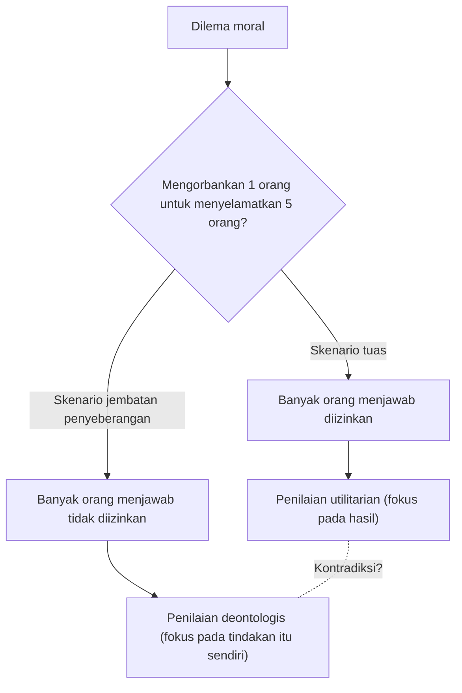
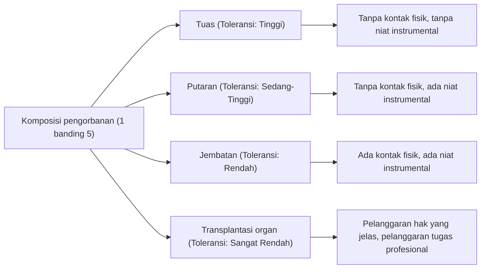

# Masalah Troli: Pilihan Utama dalam Etika dan Kedalaman Intuisi Moral Manusia

## Pendahuluan: Dilema Etika yang Paling Ekstrem

Bayangkan. Anda sedang berdiri di pinggir rel kereta. Dari kejauhan terdengar suara gemuruh, dan sebuah troli (trem) yang kehilangan kendali melaju dengan kecepatan tinggi ke arah Anda. Melihat ke depan, ada 5 pekerja di ujung rel, dan mereka tidak menyadari kedatangan troli. Jika dibiarkan, 5 orang tersebut pasti akan tertabrak dan tewas.

Namun, tepat di sebelah Anda, ada tuas untuk mengubah titik percabangan rel (wesel). Jika Anda menarik tuas ini, troli akan berubah arah ke jalur cadangan. Akan tetapi, di ujung jalur cadangan tersebut ada 1 orang pekerja lain.

**"Apakah Anda akan menarik tuas, mengorbankan 1 orang untuk menyelamatkan 5 orang? Atau, Anda tidak melakukan apa-apa dan membiarkan 5 orang mati?"**

Inilah bentuk dasar dari "Masalah Troli (Trolley Problem)", eksperimen pikiran yang paling terkenal dan paling banyak diperdebatkan dalam etika. Dalam matematika sederhana, seharusnya "lebih baik menyelamatkan nyawa 5 orang daripada 1 orang", tetapi situasinya tidak sesederhana itu. Dalam artikel ini, melalui dilema ekstrem ini, kita akan mengeksplorasi secara mendalam dunia intuisi moral manusia, dari utilitarianisme dan deontologi, hingga neurosains terbaru dan etika AI pada mobil otonom.

## 1. Lahirnya Masalah Troli: Gagasan Philippa Foot

Masalah Troli pertama kali disajikan dalam esai tahun 1967 "Masalah Aborsi dan Doktrin Efek Ganda" yang diterbitkan oleh filsuf Inggris Philippa Foot. Awalnya, ini dirancang sebagai eksperimen pikiran tambahan untuk memperjelas perdebatan moral tentang aborsi.

Dalam skenario yang disajikan oleh Foot (skenario tuas di atas), mayoritas orang menjawab "harus menarik tuas". Alasan umumnya adalah "karena 1 orang yang mati kerugiannya lebih sedikit daripada 5 orang yang mati". Pemikiran ini sangat didukung oleh posisi etis "Utilitarianisme" yang diusulkan oleh Jeremy Bentham dan John Stuart Mill, yaitu kebaikan adalah "kebahagiaan terbesar untuk jumlah terbesar".

## 2. Pengembangan oleh Judith Jarvis Thomson: Paradoks Pria Gemuk

Namun, pada tahun 1985 filsuf Amerika Judith Jarvis Thomson menyajikan variasi baru yang tiba-tiba membuat perdebatan menjadi jauh lebih kompleks. Itulah skenario "Pria Gemuk (The Fat Man)".

### Pria Gemuk di Atas Jembatan Penyeberangan

Anda sedang berdiri di jembatan penyeberangan di atas rel kereta. Di bawah, troli yang lepas kendali sedang mendekat, dan di ujung sana tetap ada 5 pekerja. Kali ini tidak ada tuas. Namun, di sebelah Anda berdiri seorang "pria gemuk" yang bertubuh sangat besar. Jika Anda mendorongnya dari atas jembatan ke rel, tubuh besarnya akan menjadi rintangan yang menghentikan troli, dan nyawa 5 orang akan terselamatkan (tetapi, dia yang didorong pasti akan mati. Catatan: berat badan Anda terlalu ringan sehingga tidak bisa menghentikan troli).

**"Apakah Anda akan mendorong pria gemuk itu, mengorbankan 1 orang untuk menyelamatkan 5 orang?"**

Komposisi kerugian matematisnya sama persis dengan skenario pertama, "mengorbankan 1 orang untuk menyelamatkan 5 orang". Namun, yang mengejutkan, dalam skenario ini mayoritas orang menjawab "tidak boleh didorong (tidak diizinkan)".

Mengapa menarik tuas untuk membunuh 1 orang dapat ditoleransi, tetapi mendorong dan membunuh 1 orang dengan tangan sendiri terasa tidak dapat diizinkan? Kontradiksi intuisi inilah yang menjadi kesulitan sejati (paradoks) dari Masalah Troli.

## 3. Utilitarianisme vs Deontologi: Dua Kubu Utama dalam Etika

Untuk menjelaskan ketidaksesuaian intuisi ini, kita perlu memahami dua pendekatan utama dalam etika.

### Utilitarianisme
Posisi yang mengevaluasi moralitas suatu tindakan berdasarkan "hasil"-nya. Pilihan yang menghasilkan jumlah total kebahagiaan (atau pengurangan penderitaan) terbesar dianggap benar. Karena menganggap "kematian 5 orang adalah hasil yang lebih buruk daripada kematian 1 orang", menarik tuas maupun mendorong pria gemuk keduanya dianggap sebagai "tindakan yang benar".

### Deontologi
Posisi yang diwakili oleh Immanuel Kant, yang mengevaluasi moralitas bukan berdasarkan "hasil" tindakan, melainkan "sifat dari tindakan itu sendiri" atau "niat". Kant mengajarkan bahwa "manusia tidak boleh diperlakukan hanya sebagai alat, tetapi selalu sebagai tujuan".
Tindakan mendorong pria gemuk berarti menggunakan manusia sebagai "alat (instrumen)" untuk menyelamatkan 5 orang, yang melanggar martabat manusia sehingga dianggap sebagai kejahatan absolut. Di sisi lain, pada skenario tuas pertama, kematian 1 orang mungkin ditafsirkan bukan sebagai "alat yang disengaja" untuk menyelamatkan 5 orang, tetapi hanya sebagai "efek samping yang diprediksi (akibat ikutan)" yang ingin dihindari (doktrin efek ganda yang akan dijelaskan nanti).

## 4. Variasi Lebih Lanjut: Putaran dan Transplantasi Organ

Eksplorasi para filsuf tidak berhenti di sini. Dengan sedikit mengubah kondisi eksperimen pikiran, mereka mencoba mencari batas-batas intuisi moral kita lebih jauh.

### Skenario Putaran (Thomson)
Skenario di mana jalur cadangan bergabung kembali ke jalur utama membentuk putaran (loop). Jika Anda menarik tuas, troli akan masuk ke jalur cadangan. Di jalur cadangan ada 1 pekerja bertubuh besar, dan dengan troli menabraknya, troli akan berhenti dan 5 orang di jalur utama terselamatkan. Jika 1 orang itu tidak ada, troli akan melewati putaran, kembali ke jalur utama, dan menabrak 5 orang dari belakang.
Dalam kasus ini, kematian 1 orang bukan sekadar "efek samping", melainkan "alat yang sangat diperlukan" untuk menyelamatkan 5 orang (karena tanpa dia, 5 orang tidak bisa diselamatkan). Namun, banyak orang tetap menjawab "menarik tuas itu diizinkan" bahkan dalam skenario ini. Ini menggoyahkan penjelasan Kantian (penggunaan sebagai alat tidak diizinkan) terhadap skenario pria gemuk.

### Skenario Transplantasi Organ (Foot)
Latar dipindahkan ke rumah sakit. Lima pasien akan mati hari ini tanpa transplantasi karena kegagalan fatal pada organ yang berbeda (jantung, paru-paru, ginjal, dll.). Kemudian, seorang pemuda sehat datang untuk pemeriksaan kesehatan. Organnya cocok dengan kelima pasien tersebut. Anda sebagai dokter bisa diam-diam membunuh pemuda sehat ini, mengambil organnya, dan mentransplantasikannya kepada 5 orang tersebut, mengorbankan 1 orang untuk menyelamatkan 5 orang.
Dalam skenario ini, hampir 100% orang akan menjawab "sama sekali tidak diizinkan". Padahal, rumus perhitungan kerugiannya persis sama dengan masalah troli.

## 5. Doktrin Efek Ganda (Doctrine of Double Effect)

"Doktrin Efek Ganda", yang berakar dari teolog abad pertengahan Thomas Aquinas, adalah salah satu kerangka kerja yang kuat untuk menjelaskan kontradiksi dalam masalah troli. Menurut prinsip ini, ketika sebuah tindakan membawa "hasil baik" dan "hasil buruk" secara bersamaan, tindakan tersebut diperbolehkan jika memenuhi syarat-syarat berikut:

1. Tindakan itu sendiri baik, atau setidaknya netral secara moral.
2. Hanya hasil yang baik yang disengaja, sementara hasil yang buruk hanya diprediksi tetapi tidak disengaja.
3. Hasil yang buruk tidak menjadi alat untuk mencapai hasil yang baik.
4. Ada alasan yang cukup (proporsionalitas) bahwa hasil yang baik melebihi hasil yang buruk.

Dalam skenario tuas, tindakan "mengalihkan jalur troli" itu sendiri netral, dan kematian 1 orang dapat diprediksi namun tidak disengaja, serta bukan merupakan alat. Akan tetapi, dalam skenario jembatan penyeberangan, ada tindakan kekerasan langsung yaitu "mendorong orang", dan kematian (atau penggunaan tubuhnya sebagai penahan) orang tersebut secara khusus disengaja sebagai alat untuk menyelamatkan 5 orang, sehingga dinilai tidak diizinkan menurut prinsip ini.

## 6. Pendekatan dari Neurosains dan Psikologi Evolusioner: Teori Proses Ganda Joshua Greene

Memasuki abad ke-21, masalah troli meninggalkan kursi malas para filsuf dan dibawa ke dalam laboratorium neurosains dan psikologi. Psikolog Universitas Harvard, Joshua Greene, menyajikan berbagai skenario masalah troli kepada subjek penelitian dan memindai aktivitas otak mereka menggunakan fMRI (functional magnetic resonance imaging) selama proses tersebut.

Hasilnya sangat mengejutkan.
- Saat memikirkan **skenario jembatan penyeberangan** (bahaya yang melibatkan kontak fisik langsung), area di otak subjek yang mengendalikan **emosi dan intuisi** (seperti amigdala) sangat aktif.
- Saat memikirkan **skenario tuas** (bahaya tanpa kontak fisik), atau ketika mencoba membuat penilaian utilitarian (melawan intuisi) yang menyatakan "harus didorong" dalam skenario jembatan, area otak yang mengendalikan **penalaran logis dan kontrol kognitif** (seperti korteks prefrontal) sangat aktif, dan butuh waktu lebih lama untuk menjawab.

Dari sini, Greene mengusulkan "Teori Proses Ganda (Dual-process theory)".
Penilaian moral manusia tidak ditentukan oleh sistem logis tunggal, tetapi oleh persaingan antara dua sistem: "sistem emosional/intuitif" yang secara evolusioner lebih tua dan "sistem kognitif/rasional" yang lebih baru secara evolusioner.
Bagi nenek moyang kita di Zaman Batu, mendorong atau memukul teman dengan tangan kosong secara langsung adalah ancaman sehari-hari, sehingga kita berevolusi untuk merasakan keengganan yang kuat (rem emosional) terhadap hal itu. Namun, bahaya tidak langsung seperti "menarik tuas dan menyebabkan kematian seseorang dari kejauhan" tidak ada dalam proses evolusi, sehingga rem intuitif tidak bekerja dengan kuat. Akibatnya, pada skenario tuas, perhitungan korteks prefrontal (1 < 5) menang, sedangkan pada skenario jembatan, keengganan emosional mengalahkan perhitungan tersebut.

Penemuan ini melahirkan pertanyaan filosofis baru: "Apakah intuisi moral kita bukanlah kebenaran mutlak, melainkan hanya produk (bug) dari evolusi?"

## 7. Penerapan di Dunia Nyata: Etika AI dan Mobil Otonom

Masalah troli yang dulunya hanya sekadar eksperimen pikiran, kini menjadi isu yang sangat nyata dalam masyarakat modern. Contoh paling menonjol dari hal ini adalah pengembangan "mobil otonom (AI pengemudi otomatis)".

Ketika sebuah mobil otonom menghadapi kecelakaan yang tidak dapat dihindari, misalnya karena rem blong, bagaimana seharusnya AI diprogram?
- Apakah harus melaju lurus dan menabrak 5 pejalan kaki yang sedang menyeberang jalan?
- Ataukah harus membanting setir dan menabrak tembok, mengorbankan nyawa pemilik (1 orang) yang ada di dalamnya?

Dalam survei online skala besar "Moral Machine" yang dilakukan oleh MIT (Massachusetts Institute of Technology), jutaan orang dari seluruh dunia disajikan dengan berbagai skenario untuk meneliti siapa yang harus diprioritaskan oleh mobil otonom untuk diselamatkan (misalnya pemuda atau orang tua, manusia atau hewan, pejalan kaki yang mematuhi hukum atau pejalan kaki yang melanggar lampu merah, dll.).
Hasilnya, meskipun pandangan utilitarian yang menyatakan "harus menyelamatkan nyawa sebanyak mungkin" sangat kuat secara universal, perbedaan latar belakang budaya juga terbukti menciptakan perbedaan yang signifikan. Sebagai contoh, dalam budaya Timur terdapat kecenderungan kuat untuk menghormati orang tua, sementara di Barat terlihat kecenderungan untuk memprioritaskan pemuda dan anak-anak.

Apakah perusahaan pengembang AI harus mengimplementasikan program yang "menyelamatkan orang lain bahkan jika harus mengorbankan pemiliknya" pada mobil mereka? Jika diimplementasikan, apakah konsumen akan membeli "mobil yang mungkin membunuh diri mereka sendiri"? (Dalam banyak survei, orang-orang menunjukkan jawaban yang kontradiktif: mereka setuju bahwa "sebagai masyarakat secara keseluruhan, mobil otonom yang berperilaku utilitarian sangat diinginkan", namun juga menyatakan "saya sendiri tidak ingin membeli mobil seperti itu (saya ingin membeli mobil yang mengutamakan keselamatan saya)").

Masalah troli bukan lagi permainan di kelas filsafat, melainkan tugas praktis mendesak yang dihadapi oleh para insinyur, ahli hukum, dan pembuat kebijakan.

## 8. Penerapan Praktis dan Variasi Lainnya

Selain mengemudi otonom, ada banyak kenyataan yang memiliki struktur seperti masalah troli.

### Triage dalam Medis
Dalam bencana berskala besar atau pandemi (misal: masa awal penyebaran COVID-19), ketika sumber daya medis seperti ventilator langka, dokter dihadapkan pada pilihan kepada siapa mereka akan mengalokasikan sumber daya dan siapa yang akan ditinggalkan. Penilaian yang "memusatkan sumber daya pada kaum muda yang memiliki probabilitas bertahan hidup lebih tinggi, dan menunda orang tua yang kemungkinannya lebih rendah untuk diselamatkan" adalah praktik dari masalah troli yang didasarkan pada utilitarianisme.

### Serangan Target oleh Drone Militer
Menjatuhkan bom menggunakan pesawat tak berawak (drone) ke bangunan tempat pemimpin teroris bersembunyi dapat mencegah banyak terorisme di masa depan, tetapi pada saat yang sama, warga sipil tak berdosa di sekitarnya akan menjadi korban (kerusakan tambahan/collateral damage). Bagaimana seharusnya komandan militer menghitung keseimbangan pengorbanan ini?

## Penutup: Makna Menghadapi Pertanyaan Tanpa Jawaban

Pada akhirnya, tidak ada "jawaban benar yang absolut" untuk masalah troli. Baik menarik maupun tidak menarik tuas, keduanya mengandung dasar etis yang kuat dan juga kecacatan yang fatal.

Tujuan sebenarnya dari eksperimen pikiran bukanlah untuk menghasilkan satu jawaban yang benar. Tujuannya adalah untuk mengguncang premis nilai-nilai moral yang secara tidak sadar kita pegang, dan mengungkap keterbatasan serta kontradiksinya.
Kita semua meyakini berbagai aturan moral secara bersamaan, seperti "nyawa itu setara", "pembunuhan itu jahat", dan "kita harus menyelamatkan lebih banyak orang". Namun, di bawah kondisi ekstrem di mana aturan-aturan tersebut saling berbenturan, barulah kita menyadari betapa dangkalnya etika kita sendiri dan betapa kompleksnya keberadaan manusia.

Dalam masyarakat masa depan, mungkin tidak lama lagi hari di mana AI dan teknologi akan membuat keputusan rumit menggantikan kita akan tiba. Akan tetapi, manusialah yang menentukan etika seperti apa yang akan diajarkan kepada AI tersebut. Tuas dari troli yang lepas kendali kini sedang digenggam di tangan seluruh masyarakat kita.
