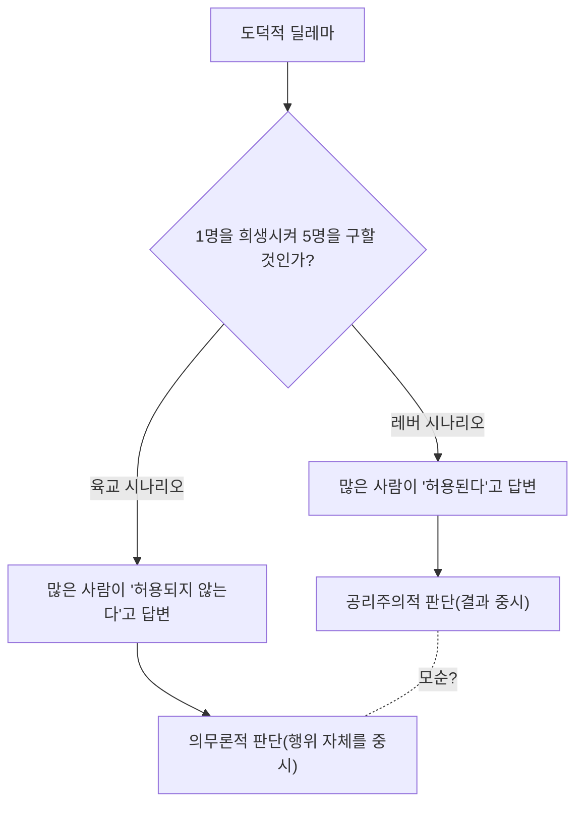
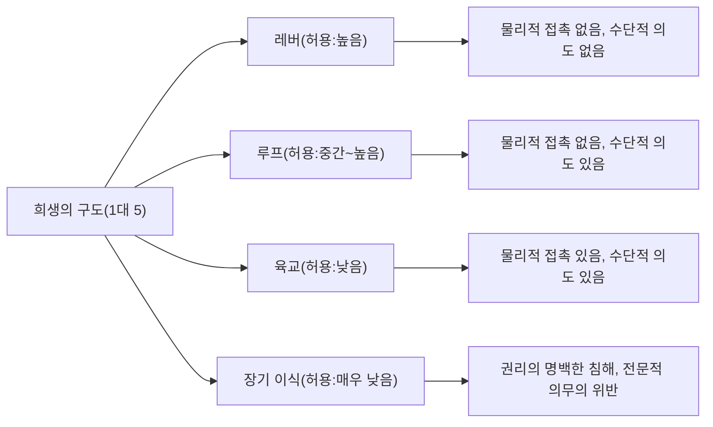

# 트롤리 딜레마: 윤리학의 궁극적 선택과 인간 도덕적 직관의 심연

## 시작하며: 궁극의 윤리적 딜레마

상상해 보십시오. 당신은 선로 옆에 서 있습니다. 멀리서 굉음이 들리고, 통제력을 잃은 트롤리(노면전차)가 맹렬한 속도로 이쪽을 향해 폭주해 옵니다. 앞을 보니 선로 끝에는 5명의 작업부가 있으며, 그들은 트롤리가 접근하는 것을 눈치채지 못하고 있습니다. 이대로라면 틀림없이 5명은 치여 죽고 맙니다.

하지만 당신 바로 옆에는 선로의 분기점(포인트)을 바꿀 수 있는 레버가 있습니다. 이 레버를 당기면 트롤리는 대피선으로 진로를 바꿉니다. 단, 대피선 끝에는 또 다른 1명의 작업부가 있습니다.

**"당신은 레버를 당겨 1명을 희생시키고 5명을 구하겠습니까? 아니면 아무것도 하지 않고 5명이 죽는 것을 지켜보겠습니까?"**

이것이 윤리학에서 가장 유명하고 또 가장 논쟁을 불러일으킨 사고실험 '트롤리 딜레마(Trolley Problem)'의 기본형입니다. 단순한 산수로 말하자면 '1명의 목숨보다 5명의 목숨을 구하는 것이 낫다'고 되겠지만, 사태는 그리 단순하지 않습니다. 본 기사에서는 이 궁극의 딜레마를 통해 공리주의와 의무론, 나아가 최신 신경과학부터 자율주행차의 AI 윤리에 이르기까지 인간의 도덕적 직관의 깊은 세계를 철저히 탐구합니다.

## 1. 트롤리 딜레마의 탄생: 필리파 풋의 제기

트롤리 딜레마는 1967년 영국의 철학자 필리파 풋(Philippa Foot)이 발표한 논문 '낙태 문제와 이중 결과의 원칙'에서 처음 제시되었습니다. 원래는 낙태에 관한 도덕적 논의를 명확히 하기 위한 보조적인 사고실험으로 고안된 것이었습니다.

풋이 제시한 시나리오(위의 레버 시나리오)에서는 대다수의 사람들이 "레버를 당겨야 한다"고 대답합니다. "5명이 죽는 것보다 1명이 죽는 것이 피해가 적기 때문"이라는 것이 일반적인 이유입니다. 이 생각은 제러미 벤담이나 존 스튜어트 밀이 제창한 '공리주의(Utilitarianism)', 즉 '최대 다수의 최대 행복'을 선으로 여기는 윤리적 입장에 강하게 뒷받침되어 있습니다.

## 2. 주디스 자비스 톰슨에 의한 발전: 뚱뚱한 남자의 역설

하지만 1985년 미국의 철학자 주디스 자비스 톰슨(Judith Jarvis Thomson)이 새로운 변형을 제시하면서 논의는 단숨에 복잡해집니다. 그것이 '뚱뚱한 남자(The Fat Man)' 시나리오입니다.

### 육교 위의 뚱뚱한 남자

당신은 선로 위를 지나는 육교 위에 서 있습니다. 아래에는 폭주하는 트롤리가 다가오고 있으며, 그 앞에는 역시 5명의 작업부가 있습니다. 이번에는 레버가 없습니다. 하지만 당신 옆에는 아주 체격이 좋은 '뚱뚱한 남자'가 서 있습니다. 당신이 그를 다리 위에서 선로로 밀어 떨어뜨리면, 그의 거대한 몸이 장애물이 되어 트롤리는 멈추고 5명의 목숨은 구해집니다(단, 밀쳐진 그는 확실히 죽습니다. 참고로 당신의 몸무게로는 너무 가벼워서 트롤리를 멈출 수 없습니다).

**"당신은 뚱뚱한 남자를 밀어 떨어뜨려 1명을 희생시키고 5명을 구하겠습니까?"**

수학적인 피해의 구도는 첫 번째 시나리오와 완전히 똑같은 '1명을 희생시키고 5명을 구한다'입니다. 그러나 놀랍게도 이 시나리오가 되면 대다수의 사람들이 "밀어 떨어뜨려서는 안 된다(허용되지 않는다)"고 대답하는 것입니다.

어째서 레버를 당겨 1명을 죽이는 것은 허용되면서, 내 손으로 직접 1명을 밀어 죽이는 것은 허용되지 않는다고 느끼는 걸까요? 이 직관의 모순이야말로 트롤리 딜레마의 진정한 어려움(역설)인 것입니다.

## 3. 공리주의 vs 의무론: 윤리학의 양대 진영

이 직관의 불일치를 설명하기 위해 윤리학에서의 두 가지 주요 접근법을 이해할 필요가 있습니다.

### 공리주의(Utilitarianism)
행위의 도덕성을 그 '결과'로 평가하는 입장입니다. 결과적으로 창출되는 행복(혹은 고통의 감소)의 총량이 가장 커지는 선택을 옳다고 봅니다. '1명의 죽음보다 5명의 죽음이 더 나쁜 결과이다'라고 생각하기 때문에 레버를 당기는 것도, 뚱뚱한 남자를 밀어 떨어뜨리는 것도 모두 '옳은 행위'가 됩니다.

### 의무론(Deontology)
이마누엘 칸트로 대표되며, 행위의 '결과'가 아닌 '행위 자체의 성질'이나 '동기'로 도덕성을 평가하는 입장입니다. 칸트는 "인간을 단순한 수단으로 삼지 말고, 항상 목적으로 대우해야 한다"고 설파했습니다.
뚱뚱한 남자를 밀어 떨어뜨리는 행위는 5명을 구하기 위한 '수단(도구)'으로 1명의 인간을 이용하는 것이 되어 인간의 존엄성을 침해하기 때문에 절대적인 악으로 간주됩니다. 반면 첫 번째 레버 시나리오에서 1명의 죽음은 5명을 구하기 위한 '의도된 수단'이 아니라, 피하고 싶었지만 '예견된 부작용(부수적 결과)'에 불과하다고 해석되기도 합니다(후술할 이중 결과의 원칙).

## 4. 추가 변형: 루프와 장기 이식

철학자들의 탐구는 여기서 멈추지 않습니다. 사고실험의 조건을 미묘하게 바꿈으로써 우리의 도덕적 직관의 경계선을 더 파고들고자 합니다.

### 루프 시나리오(톰슨)
대피선이 다시 본선으로 합류하는 루프 모양으로 된 시나리오입니다. 레버를 당기면 트롤리는 대피선으로 들어갑니다. 대피선에는 체격이 큰 1명의 작업부가 있으며, 그에게 트롤리가 부딪힘으로써 트롤리는 멈추고 본선의 5명은 구해집니다. 만약 그 1명이 없다면 트롤리는 루프를 통과해 본선으로 돌아와 뒤에서 5명을 치게 됩니다.
이 경우 1명의 죽음은 단순한 '부작용'이 아니라 5명을 구하기 위한 '불가결한 수단'이 됩니다(그가 없으면 5명을 구할 수 없기 때문입니다). 그러나 많은 사람들은 이 시나리오에서도 "레버를 당기는 것은 허용된다"고 대답합니다. 이는 뚱뚱한 남자 시나리오(수단으로서의 이용은 허용되지 않는다)에 대한 칸트주의적 설명을 뒤흔드는 것입니다.

### 장기 이식 시나리오(풋)
장면은 병원으로 바뀝니다. 5명의 환자가 각각 다른 장기(심장, 폐, 신장 등)의 치명적인 부전으로 인해 오늘 중으로 이식을 받지 못하면 죽고 맙니다. 그곳에 건강 검진을 위해 1명의 건강한 젊은이가 찾아왔습니다. 그의 장기는 5명 전원과 적합합니다. 의사인 당신은 이 건강한 젊은이를 몰래 살해하고 장기를 꺼내 5명에게 이식하면, 1명을 희생시켜 5명을 구할 수 있습니다.
이 시나리오에서는 거의 100%의 사람이 "절대 허용되지 않는다"고 대답합니다. 하지만 피해의 계산식은 트롤리 딜레마와 완전히 똑같습니다.

## 5. 이중 결과의 원칙(Doctrine of Double Effect)

중세의 신학자 토마스 아퀴나스에서 비롯된 '이중 결과의 원칙'은 트롤리 딜레마의 모순을 설명하는 하나의 유력한 틀입니다. 이 원칙에 따르면 어떤 행위가 '좋은 결과'와 '나쁜 결과'를 모두 가져올 경우, 다음 조건을 충족하면 그 행위는 허용됩니다.

1. 행위 자체가 선이거나 최소한 도덕적으로 중립적일 것.
2. 좋은 결과만을 의도하며 나쁜 결과는 단지 예견될 뿐 의도되지 않을 것.
3. 나쁜 결과가 좋은 결과를 달성하기 위한 수단이 되지 않을 것.
4. 좋은 결과가 나쁜 결과를 상회할 만한 충분한 이유(비례성)가 있을 것.

레버 시나리오에서는 '트롤리의 진로를 벗어나게 한다'는 행위 자체는 중립적이며 1명의 죽음은 예견되지만 의도되지 않았고 수단도 아닙니다. 그러나 육교 시나리오에서는 '사람을 밀어 떨어뜨린다'는 직접적인 위해 행위가 있고, 게다가 그 사람의 죽음(또는 몸을 방패로 삼는 것) 자체가 5명을 구하는 수단으로 의도되어 있기 때문에 이 원칙에 의해 허용되지 않는다고 판정됩니다.

## 6. 신경과학과 진화심리학적 접근: 조슈아 그린의 이중 과정 이론

21세기에 접어들며 트롤리 딜레마는 철학자의 안락의자를 떠나 뇌과학이나 심리학의 실험실로 옮겨졌습니다. 하버드 대학의 심리학자 조슈아 그린(Joshua Greene)은 피험자에게 트롤리 딜레마의 다양한 시나리오를 제시하고, 그동안의 뇌 활동을 fMRI(기능적 자기공명영상)로 스캔했습니다.

결과는 놀라웠습니다.
- **육교 시나리오**(직접적인 물리적 접촉을 수반하는 위해)를 생각할 때 피험자의 뇌에서는 **감정이나 직관**을 관장하는 영역(편도체 등)이 강하게 활성화되었습니다.
- **레버 시나리오**(물리적 접촉을 수반하지 않는 위해)를 생각할 때, 혹은 육교 시나리오에서 '밀어 떨어뜨려야 한다'고 (직관을 거스르고) 공리주의적인 판단을 내리려 할 때, 피험자의 뇌에서는 **논리적 추론이나 인지 통제**를 관장하는 영역(전전두엽 피질 등)이 강하게 활성화되었고 답변하기까지 시간이 걸렸습니다.

그린은 이를 통해 '이중 과정 이론(Dual-process theory)'을 제창했습니다.
인간의 도덕적 판단은 단일한 논리적 시스템이 아니라, 진화적으로 오래된 '감정적·직관적 시스템'과 진화적으로 새로운 '인지적·합리적 시스템'의 두 가지 경합에 의해 결정된다는 것입니다.
석기 시대의 우리 조상들에게 동료를 직접 손으로 밀어 떨어뜨리거나 때리는 것은 일상적인 위협이었고, 이에 대해 강한 혐오감(감정적 브레이크)을 갖도록 진화했습니다. 그러나 '레버를 당겨 멀리 있는 누군가를 죽게 한다'는 간접적인 위해는 진화 과정에 존재하지 않았기 때문에 직관적인 브레이크가 강하게 작동하지 않습니다. 그 결과 레버 시나리오에서는 전전두엽 피질의 계산(1 < 5)이 승리하고, 육교 시나리오에서는 감정적 혐오감이 계산을 압도하는 것입니다.

이 발견은 "우리의 도덕적 직관은 절대적인 진리가 아니라, 단순한 진화의 산물(버그)에 불과한 것이 아닐까?"라는 새로운 철학적 질문을 낳았습니다.

## 7. 현실 세계로의 적용: 자율주행차와 AI 윤리

과거에는 순수한 사고실험이었던 트롤리 딜레마는 현대 사회에서 지극히 현실적인 과제가 되었습니다. 그 대표적인 예가 '자율주행차(자율주행 AI)'의 개발입니다.

자율주행차가 브레이크 고장 등으로 인해 피할 수 없는 사고에 직면했을 때, AI는 어떻게 프로그래밍되어 있어야 할까요?
- 그대로 직진하여 횡단보도를 건너는 5명의 보행자를 칠 것인가?
- 아니면 핸들을 꺾어 벽에 격돌하여 타고 있는 소유자(1명)의 목숨을 희생시킬 것인가?

MIT(매사추세츠 공과대학)가 실시한 대규모 온라인 조사 '모럴 머신(Moral Machine)'에서는 전 세계 수백만 명의 사람들에게 다양한 시나리오를 제시하고 자율주행차가 누구를 우선하여 구해야 하는지(젊은이인가 노인인가, 사람인가 동물인가, 법을 지키는 보행자인가 신호 위반 보행자인가 등)를 조사했습니다.
결과적으로 "더 많은 목숨을 구해야 강하다"는 공리주의적인 견해가 세계적으로 공통되게 강했지만, 문화적 배경에 따라 큰 차이가 있다는 것도 밝혀졌습니다. 예를 들어 동양 문화권에서는 고령자를 존중하는 경향이 강했고, 서양에서는 젊은이나 아이를 우선하는 경향이 나타났습니다.

AI 개발 기업은 자사의 자동차에 '소유자를 희생해서라도 타인을 구하는' 프로그램을 탑재해야 할까요? 만약 탑재한다면, 소비자는 '나를 죽일지도 모르는 차'를 살까요? (많은 설문조사에서 사람들은 "사회 전체적으로는 공리주의적으로 행동하는 자율주행차가 바람직하다"고 대답하면서도, "나 자신은 그런 차를 사고 싶지 않다(나를 최우선으로 지키는 차를 사고 싶다)"는 모순된 답변을 보였습니다).

트롤리 딜레마는 더 이상 철학 교실의 유희가 아니라 엔지니어, 법학자, 정책 입안자가 직면한 시급한 실무 과제인 것입니다.

## 8. 기타 현실적 응용과 변형

자율주행 외에도 트롤리 딜레마적 구조를 가진 현실은 수없이 존재합니다.

### 의료에서의 트리아지(Triage)
대규모 재난이나 팬데믹(예: 코로나19 초기 유행)에서 인공호흡기 등 의료 자원이 부족할 경우, 의사는 누구에게 자원을 할당하고 누구를 포기할 것인가 하는 선택을 강요받습니다. '생존 가능성이 더 높은 젊은이에게 자원을 집중하고 가망이 낮은 고령자를 뒤로 미룬다'는 판단은 바로 공리주의에 기반한 트롤리 딜레마의 실천입니다.

### 군사 드론의 표적 공격
테러리스트의 지도자가 잠복해 있는 건물을 무인기(드론)로 폭격하면 미래의 수많은 테러를 막을 수 있지만, 동시에 주변에 있는 무고한 민간인이 희생(부수적 피해)됩니다. 군 사령관은 이 희생의 균형을 어떻게 계산해야 할까요?

## 마치며: 정답 없는 질문과 마주하는 의미

결국 트롤리 딜레마에 '절대적으로 옳은 정답'은 존재하지 않습니다. 레버를 당기는 것도, 당기지 않는 것도 각각 확고한 윤리적 근거와 치명적인 결함을 포함하고 있습니다.

사고실험의 진정한 목적은 하나의 정답을 내는 것이 아닙니다. 우리가 무의식적으로 안고 있는 도덕적 가치관의 전제를 뒤흔들고, 그 한계나 모순을 백일하에 드러내는 데 있습니다.
우리는 모두 '생명은 평등하다', '살인은 악이다', '더 많은 사람을 구해야 한다'는 여러 도덕적 규칙을 동시에 믿고 있지만, 그것들이 충돌하는 극한 상황에 이르러서야 비로소 내 윤리의 얕은 바닥이나 인간이라는 존재의 복잡성을 깨닫게 되는 것입니다.

미래 사회에서 AI나 기술이 우리를 대신해 복잡한 결정을 내리게 될 날도 머지않았을지 모릅니다. 하지만 그 AI에게 어떤 윤리를 가르칠지 결정하는 것은 우리 인간입니다. 폭주하는 트롤리의 레버는 지금 우리 사회 전체의 손에 꽉 쥐어져 있는 것입니다.
