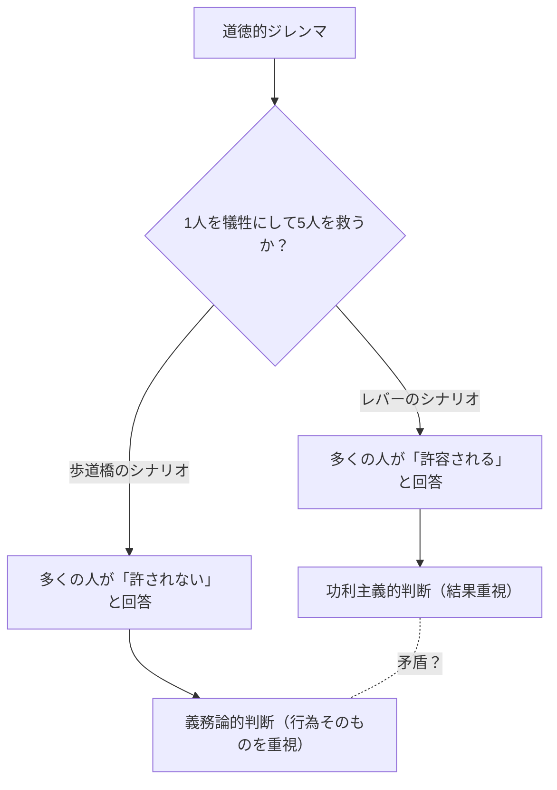
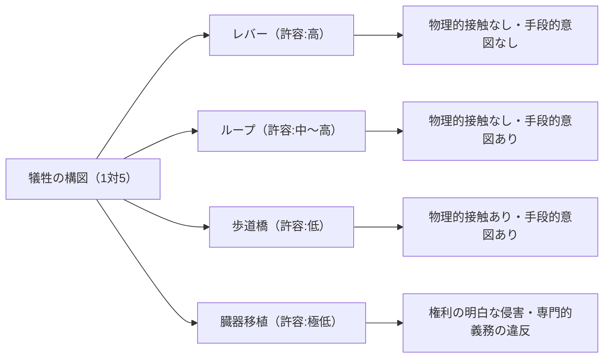

# トロッコ問題：倫理学の究極の選択と人間の道徳的直観の深淵

## はじめに：究極の倫理的ジレンマ

想像してください。あなたは線路の脇に立っています。遠くから轟音が聞こえ、コントロールを失ったトロッコ（路面電車）が猛スピードでこちらへ向かって暴走してきます。前方を見ると、線路の先には5人の作業員がおり、彼らはトロッコの接近に気づいていません。このままでは間違いなく5人は轢き殺されてしまいます。

しかし、あなたのすぐそばには、線路の分岐器（ポイント）を切り替えるレバーがあります。このレバーを引けば、トロッコは待避線へと進路を変えます。ただし、待避線の先には別の1人の作業員がいます。

**「あなたはレバーを引き、1人を犠牲にして5人を救いますか？それとも、何もせず5人が死ぬのを見過ごしますか？」**

これが、倫理学において最も有名で、かつ最も議論を呼んできた思考実験「トロッコ問題（Trolley Problem）」の基本形です。単純な算数で言えば「1人の命より5人の命を救う方が良い」となるはずですが、事態はそう単純ではありません。本記事では、この究極のジレンマを通じて、功利主義と義務論、さらには最新の神経科学から自動運転車のAI倫理に至るまで、人間の道徳的直観の奥深い世界を徹底的に探求します。

## 1. トロッコ問題の誕生：フィリッパ・フットの提起

トロッコ問題は、1967年にイギリスの哲学者フィリッパ・フット（Philippa Foot）が発表した論文「中絶問題と二重結果の教義」の中で初めて提示されました。元々は中絶に関する道徳的議論を明確にするための補助的な思考実験として考案されたものでした。

フットが提示したシナリオ（上記のレバーのシナリオ）では、大多数の人々が「レバーを引くべきだ」と回答します。「5人が死ぬより1人が死ぬ方が、被害が少ないから」というのが一般的な理由です。この考え方は、ジェレミー・ベンサムやジョン・スチュアート・ミルが提唱した「功利主義（Utilitarianism）」、すなわち「最大多数の最大幸福」を善とする倫理的立場に強く裏付けられています。

## 2. ジュディス・ジャーヴィス・トムソンによる発展：太った男のパラドックス

しかし、1985年にアメリカの哲学者ジュディス・ジャーヴィス・トムソン（Judith Jarvis Thomson）が新たなバリエーションを提示したことで、議論は一気に複雑さを増します。それが「太った男（The Fat Man）」のシナリオです。

### 歩道橋の上の太った男

あなたは線路の上にかかる歩道橋の上に立っています。下には暴走するトロッコが迫っており、その先にはやはり5人の作業員がいます。今回はレバーはありません。しかし、あなたの隣には非常に体格の良い「太った男」が立っています。あなたが彼を橋の上から線路へと突き落とせば、彼の巨大な身体が障害物となってトロッコは止まり、5人の命は救われます（ただし、突き落とされた彼は確実に死にます。なお、あなたの体重では軽すぎてトロッコを止めることはできません）。

**「あなたは太った男を突き落とし、1人を犠牲にして5人を救いますか？」**

数学的な被害の構図は最初のシナリオと全く同じ「1人を犠牲にして5人を救う」です。しかし、驚くべきことに、このシナリオになると大多数の人々が「突き落とすべきではない（許されない）」と回答するのです。

なぜ、レバーを引いて1人を殺すことは許容されるのに、自分の手で1人を突き落として殺すことは許されないと感じるのでしょうか？この直観の矛盾こそが、トロッコ問題の真の難しさ（パラドックス）なのです。

## 3. 功利主義 vs 義務論：倫理学の二大陣営

この直観の不一致を説明するために、倫理学における二つの主要なアプローチを理解する必要があります。

### 功利主義（Utilitarianism）
行為の道徳性を、その「結果」によって評価する立場です。結果として生み出される幸福（あるいは苦痛の減少）の総量が最も大きくなる選択を正しいとします。「1人の死よりも5人の死の方が悪い結果である」と考えるため、レバーを引くことも、太った男を突き落とすことも、どちらも「正しい行為」となります。

### 義務論（Deontology）
イマヌエル・カントに代表される、行為の「結果」ではなく「行為そのものの性質」や「動機」によって道徳性を評価する立場です。カントは「人間を単なる手段としてではなく、常に目的として扱わなければならない」と説きました。
太った男を突き落とす行為は、5人を救うための「手段（道具）」として1人の人間を利用していることになり、人間の尊厳を侵すため絶対的に悪であるとみなされます。一方、最初のレバーのシナリオでは、1人の死は5人を救うための「意図された手段」ではなく、避けたかったが「予見された副作用（付随的結果）」にすぎないと解釈されることがあります（後述の二重結果の教義）。

## 4. さらなるバリエーション：ループと臓器移植

哲学者の探求はここで止まりません。思考実験の条件を微妙に変えることで、私たちの道徳的直観の境界線をさらに探ろうとします。

### ループのシナリオ（トムソン）
待避線が再び本線に合流するループ状になっているシナリオです。レバーを引くとトロッコは待避線に入ります。待避線には大柄な1人の作業員がおり、彼にトロッコがぶつかることでトロッコは止まり、本線の5人は救われます。もしその1人がいなければ、トロッコはループを通って本線に戻り、背後から5人を轢いてしまいます。
この場合、1人の死は単なる「副作用」ではなく、5人を救うための「不可欠な手段」となっています（彼がいなければ5人を救えないため）。しかし、多くの人はこのシナリオでも「レバーを引くことは許される」と答えます。これは太った男のシナリオ（手段としての利用は許されない）に対するカント主義的な説明を揺るがすものです。

### 臓器移植のシナリオ（フット）
場面は病院に移ります。5人の患者が、それぞれ異なる臓器（心臓、肺、腎臓など）の致命的な不全により、今日中に移植を受けなければ死んでしまいます。そこに、健康診断のために1人の健康な若者がやってきました。彼の臓器は5人全員と適合します。医師であるあなたは、この健康な若者をこっそり殺害し、臓器を取り出して5人に移植すれば、1人を犠牲にして5人を救うことができます。
このシナリオでは、ほぼ100%の人が「絶対に許されない」と答えます。しかし、被害の計算式はトロッコ問題と全く同じです。

## 5. 二重結果の教義（Doctrine of Double Effect）

中世の神学者トマス・アクィナスに端を発する「二重結果の教義」は、トロッコ問題の矛盾を説明する一つの有力な枠組みです。この原則によれば、ある行為が「良い結果」と「悪い結果」の両方をもたらす場合、以下の条件を満たせばその行為は許容されます。

1. 行為そのものが善、または少なくとも道徳的に中立であること。
2. 良い結果のみが意図され、悪い結果は単に予見されるだけで意図されていないこと。
3. 悪い結果が良い結果を達成するための手段となっていないこと。
4. 良い結果が悪い結果を上回るだけの十分な理由（比例性）があること。

レバーのシナリオでは、「トロッコの進路を逸らす」という行為自体は中立であり、1人の死は予見されるが意図されておらず、手段でもありません。しかし、歩道橋のシナリオでは、「人を突き落とす」という直接的な危害行為があり、しかもその人の死（または体を弾除けにすること）自体が5人を救う手段として意図されているため、この原則によって許されないと判定されます。

## 6. 神経科学と進化心理学からのアプローチ：ジョシュア・グリーンの二重過程理論

21世紀に入り、トロッコ問題は哲学者のアームチェアを離れ、脳科学や心理学の実験室へと持ち込まれました。ハーバード大学の心理学者ジョシュア・グリーン（Joshua Greene）は、被験者にトロッコ問題の様々なシナリオを提示し、その間の脳の活動をfMRI（機能的磁気共鳴画像法）でスキャンしました。

結果は驚くべきものでした。
- **歩道橋のシナリオ**（直接的な物理的接触を伴う危害）を考えているとき、被験者の脳では**感情や直感**を司る領域（扁桃体など）が強く活性化しました。
- **レバーのシナリオ**（物理的接触を伴わない危害）を考えているとき、または歩道橋のシナリオで「突き落とすべき」と（直感に逆らって）功利主義的な判断を下そうとしているとき、被験者の脳では**論理的推論や認知コントロール**を司る領域（前頭前皮質など）が強く活性化し、回答までに時間がかかりました。

グリーンはここから「二重過程理論（Dual-process theory）」を提唱しました。
人間の道徳的判断は、単一の論理的システムではなく、進化的に古い「感情的・直感的なシステム」と、進化的に新しい「認知的・合理的なシステム」の二つの競合によって決定されるというのです。
石器時代の私たちの祖先にとって、仲間を直接手で突き落としたり殴ったりすることは日常的な脅威であり、それに対して強い嫌悪感（感情的ブレーキ）を抱くように進化しました。しかし、「レバーを引いて遠くの誰かを死なせる」という間接的な危害は進化の過程に存在しなかったため、直感的なブレーキが強く働きません。その結果、レバーのシナリオでは前頭前皮質の計算（1 < 5）が勝利し、歩道橋のシナリオでは感情的嫌悪感が計算を圧倒するのです。

この発見は、「私たちの道徳的直観は絶対的な真理ではなく、単なる進化の産物（バグ）に過ぎないのではないか？」という新たな哲学的問いを生み出しました。

## 7. 現実世界への適用：自動運転車とAIの倫理

かつては純粋な思考実験であったトロッコ問題は、現代社会において極めて現実的な課題となっています。その最たる例が「自動運転車（自動運転AI）」の開発です。

自動運転車がブレーキの故障などにより避けられない事故に直面したとき、AIはどのようにプログラミングされているべきでしょうか？
- そのまま直進して横断歩道を渡っている5人の歩行者を轢くべきか？
- それともハンドルを切って壁に激突し、乗っている所有者（1人）の命を犠牲にすべきか？

MIT（マサチューセッツ工科大学）が実施した大規模なオンライン調査「モラル・マシン（Moral Machine）」では、世界中の数百万人の人々に様々なシナリオを提示し、自動運転車が誰を優先して救うべきか（若者か老人か、人間か動物か、法律を守っている歩行者か信号無視の歩行者かなど）を調査しました。
結果として、「より多くの命を救うべきだ」という功利主義的な見解が世界的に共通して強かったものの、文化的背景によって大きな差異があることも明らかになりました。例えば、東洋の文化圏では高齢者を尊重する傾向が強く、西洋では若者や子供を優先する傾向が見られました。

AIの開発企業は、自社の自動車に「所有者を犠牲にしてでも他者を救う」プログラムを実装すべきでしょうか？もし実装した場合、消費者は「自分を殺すかもしれない車」を買うでしょうか？（多くのアンケートでは、人々は「社会全体としては功利主義的に振る舞う自動運転車が望ましい」と答えつつ、「自分自身はそのような車を買いたくない（自分を最優先で守る車を買いたい）」という矛盾した回答を示しています）。

トロッコ問題はもはや哲学教室の遊びではなく、エンジニア、法学者、政策立案者が直面する喫緊の実務課題なのです。

## 8. その他の現実的応用とバリエーション

自動運転以外にも、トロッコ問題的構造を持つ現実は数多く存在します。

### 医療におけるトリアージ
大規模災害やパンデミック（例：新型コロナウイルスの流行初期）において、人工呼吸器などの医療資源が不足した場合、医師は誰に資源を割り当て、誰を見捨てるかという選択を迫られます。「より生存可能性の高い若者に資源を集中させ、助かる見込みの低い高齢者を後回しにする」という判断は、まさに功利主義に基づくトロッコ問題の実践です。

### 軍事ドローンの標的攻撃
テロリストの指導者が潜伏している建物を無人機（ドローン）で爆撃すれば、将来の多くのテロを防ぐことができますが、同時に周辺にいる無関係な民間人が巻き添え（コラテラル・ダメージ）になります。軍の司令官は、この犠牲のバランスをどのように計算すべきでしょうか。

## おわりに：答えのない問いに向き合う意味

結局のところ、トロッコ問題に「絶対的に正しい正解」は存在しません。レバーを引くのも、引かないのも、それぞれに強固な倫理的根拠と、致命的な欠陥が含まれています。

思考実験の真の目的は、一つの正解を出すことではありません。私たちが無意識に抱いている道徳的価値観の前提を揺さぶり、その限界や矛盾を白日の下に晒すことにあります。
私たちは皆、「命は平等である」「殺人は悪である」「より多くの人を救うべきである」といった複数の道徳的ルールを同時に信じていますが、それらが衝突する極限状態において、初めて自分自身の倫理の底の浅さや、人間という存在の複雑さに気づかされるのです。

未来の社会において、AIやテクノロジーが私たちの代わりに複雑な決断を下すようになる日も近いかもしれません。しかし、そのAIにどのような倫理を教え込むのかを決定するのは、私たち人間です。暴走するトロッコのレバーは、今、私たちの社会全体の手の中に握りしめられているのです。
