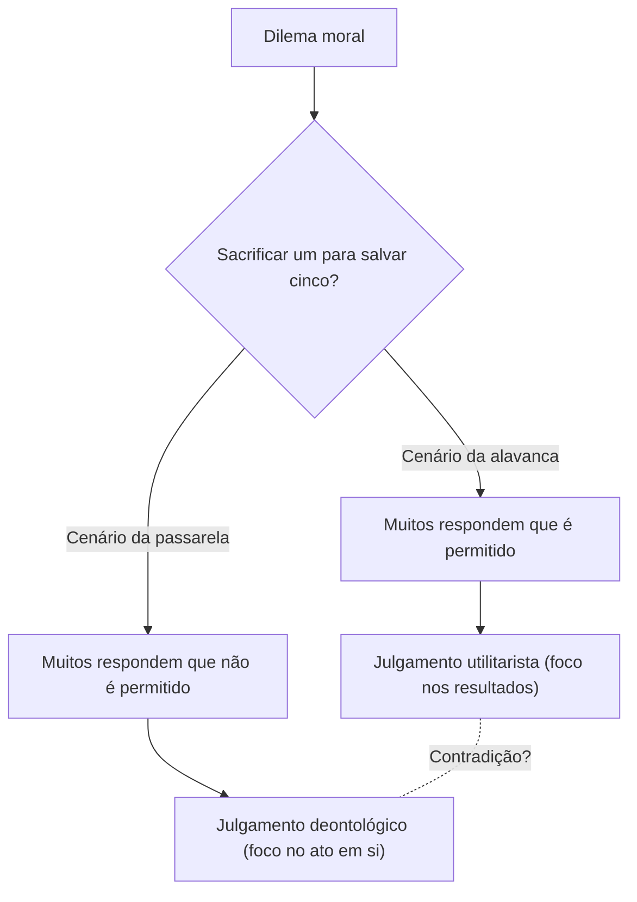
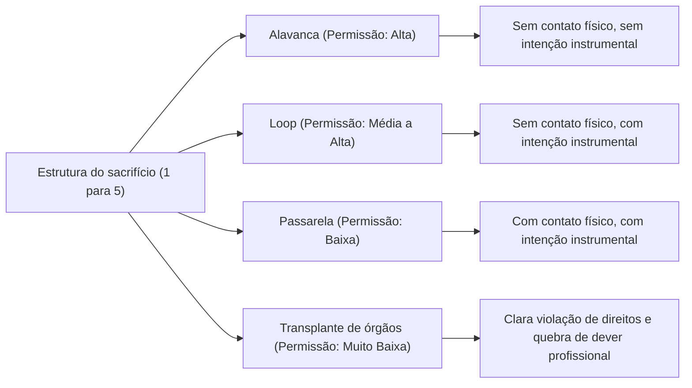

# O Problema do Bonde: A Escolha Definitiva da Ética e o Abismo da Intuição Moral Humana

## Introdução: O Dilema Ético Supremo

Imagine o seguinte: você está em pé ao lado dos trilhos de um trem. De longe, ouve-se um estrondo, e um bonde (ou trem) desgovernado e fora de controle vem em sua direção em alta velocidade. Olhando para frente, há cinco trabalhadores nos trilhos que não perceberam a aproximação do bonde. Se nada for feito, os cinco certamente serão atropelados e mortos.

No entanto, bem ao seu lado, há uma alavanca que pode mudar a chave dos trilhos. Se você puxar essa alavanca, o bonde mudará de curso para um trilho de desvio. O problema é que há um outro trabalhador nesse trilho de desvio.

**"Você puxaria a alavanca, sacrificando uma pessoa para salvar cinco? Ou não faria nada e deixaria as cinco pessoas morrerem?"**

Esta é a forma básica do "Problema do Bonde" (Trolley Problem), o experimento mental mais famoso e debatido da ética. Em termos de matemática simples, "salvar a vida de cinco pessoas é melhor do que salvar uma", mas a situação não é tão simples. Neste artigo, através deste dilema supremo, exploraremos profundamente o complexo mundo da intuição moral humana, passando pelo utilitarismo, pela deontologia, até as mais recentes descobertas da neurociência e a ética de IA em carros autônomos.

## 1. O Nascimento do Problema do Bonde: A Proposição de Philippa Foot

O Problema do Bonde foi apresentado pela primeira vez em 1967 pela filósofa britânica Philippa Foot em seu ensaio "O Problema do Aborto e a Doutrina do Duplo Efeito". Originalmente, foi concebido como um experimento mental auxiliar para esclarecer debates morais sobre o aborto.

No cenário apresentado por Foot (o cenário da alavanca acima), a maioria das pessoas responde que "a alavanca deve ser puxada". O motivo comum é que "é menos prejudicial uma pessoa morrer do que cinco". Essa forma de pensar é fortemente fundamentada no "Utilitarismo" (Utilitarianism), defendido por Jeremy Bentham e John Stuart Mill, uma posição ética que considera o bem como a "maior felicidade para o maior número".

## 2. O Desenvolvimento por Judith Jarvis Thomson: O Paradoxo do Homem Gordo

No entanto, em 1985, a filósofa americana Judith Jarvis Thomson introduziu uma nova variação que tornou o debate repentinamente mais complexo. Esse é o cenário do "Homem Gordo" (The Fat Man).

### O Homem Gordo na Passarela

Você está em pé sobre uma passarela que cruza os trilhos. Abaixo de você, um bonde desgovernado se aproxima, e no seu caminho estão novamente os cinco trabalhadores. Desta vez, não há alavanca. Porém, ao seu lado está um "homem gordo" de grande porte. Se você o empurrar da ponte para os trilhos, o corpo enorme dele servirá de obstáculo, parando o bonde e salvando a vida dos cinco (contudo, a pessoa empurrada morrerá com certeza. Note que você é leve demais para parar o bonde).

**"Você empurraria o homem gordo, sacrificando um para salvar cinco?"**

A estrutura matemática do dano é exatamente a mesma do primeiro cenário: "sacrificar um para salvar cinco". Surpreendentemente, contudo, a grande maioria das pessoas responde a este cenário afirmando que "não se deve empurrar (não é permitido)".

Por que, então, puxar a alavanca para matar uma pessoa é considerado aceitável, enquanto empurrar alguém com as próprias mãos não é? Essa contradição na intuição é exatamente a verdadeira dificuldade (paradoxo) do Problema do Bonde.

## 3. Utilitarismo vs Deontologia: As Duas Grandes Vertentes da Ética

Para explicar essa inconsistência na intuição, precisamos entender duas das principais abordagens na ética.

### Utilitarismo (Utilitarianism)
É a posição que avalia a moralidade de um ato pelos seus "resultados". A escolha correta é aquela que produz a maior quantidade total de felicidade (ou redução do sofrimento). Como "a morte de cinco pessoas é um resultado pior do que a morte de uma", tanto puxar a alavanca quanto empurrar o homem gordo seriam considerados "atos corretos".

### Deontologia (Deontology)
Representada por Immanuel Kant, é a posição que avalia a moralidade não pelo "resultado" do ato, mas pela "natureza da própria ação" ou por suas "motivações". Kant ensinou que "a humanidade deve ser tratada sempre como um fim em si mesma, e nunca apenas como um meio".
O ato de empurrar o homem gordo utiliza um ser humano como "meio (ferramenta)" para salvar cinco, violando assim a dignidade humana e sendo, portanto, considerado absolutamente mau. Por outro lado, no primeiro cenário da alavanca, a morte de uma pessoa pode ser interpretada não como um "meio intencional" para salvar cinco, mas apenas como um "efeito colateral previsto (consequência secundária)" indesejado (conforme a Doutrina do Duplo Efeito descrita a seguir).

## 4. Mais Variações: O Loop e o Transplante de Órgãos

A exploração filosófica não para por aqui. Ao alterar sutilmente as condições do experimento mental, tenta-se testar ainda mais os limites da nossa intuição moral.

### O Cenário do Loop (Thomson)
Este é um cenário em que o trilho de desvio forma um loop (um laço) que retorna à via principal. Se você puxar a alavanca, o bonde entra no desvio. No desvio, há um trabalhador corpulento; ao bater nele, o bonde para, salvando os cinco da via principal. Se esse trabalhador não estivesse lá, o bonde passaria pelo loop, voltaria à via principal e atropelaria as cinco pessoas por trás.
Neste caso, a morte da pessoa não é um mero "efeito colateral", mas um "meio indispensável" para salvar os cinco (pois sem ele, os cinco não seriam salvos). No entanto, muitas pessoas afirmam que, mesmo neste cenário, "puxar a alavanca é permitido". Isso abala a explicação de viés kantiano aplicada ao cenário do homem gordo (onde o uso como meio é inaceitável).

### O Cenário do Transplante de Órgãos (Foot)
A cena muda para um hospital. Cinco pacientes sofrem de insuficiência fatal em órgãos diferentes (coração, pulmões, rins, etc.) e morrerão até o final do dia se não receberem um transplante. Um jovem saudável chega ao hospital para um exame de rotina. Seus órgãos são compatíveis com todos os cinco pacientes. Como médico, se você assassinar secretamente esse jovem saudável e remover seus órgãos para transplantá-los nos cinco, você sacrificará uma pessoa para salvar cinco.
Neste cenário, quase 100% das pessoas respondem que "isso é absolutamente inaceitável". A matemática do dano, contudo, é exatamente a mesma do Problema do Bonde.

## 5. Doutrina do Duplo Efeito (Doctrine of Double Effect)

A "Doutrina do Duplo Efeito", que remonta ao teólogo medieval Tomás de Aquino, é uma estrutura importante para explicar as contradições no Problema do Bonde. De acordo com este princípio, se um ato produz tanto um "bom resultado" quanto um "mau resultado", o ato é permissível se atender às seguintes condições:

1. O ato em si deve ser bom, ou pelo menos moralmente neutro.
2. Apenas o bom resultado deve ser intencionado; o mau resultado é meramente previsto e não desejado.
3. O mau resultado não deve ser um meio para alcançar o bom resultado.
4. Deve haver uma razão suficiente (proporcionalidade) para que o bom resultado compense o mau resultado.

No cenário da alavanca, a ação de "desviar o curso do bonde" em si é neutra, e a morte da pessoa é prevista, mas não intencional nem usada como meio. No entanto, no cenário da passarela, há um ato direto de dano ("empurrar alguém"), e a morte dessa pessoa (ou o uso de seu corpo como escudo) é intencionada como um meio para salvar cinco, sendo, portanto, considerada inaceitável por este princípio.

## 6. Abordagem a partir da Neurociência e da Psicologia Evolutiva: A Teoria do Processo Duplo de Joshua Greene

No século 21, o Problema do Bonde deixou a poltrona dos filósofos e entrou nos laboratórios de neurociência e psicologia. Joshua Greene, um psicólogo da Universidade de Harvard, apresentou vários cenários do Problema do Bonde a participantes e escaneou a atividade de seus cérebros através de fMRI (ressonância magnética funcional).

Os resultados foram surpreendentes.
- Ao pensar no **cenário da passarela** (dano direto com contato físico), as áreas do cérebro dos participantes relacionadas à **emoção e intuição** (como a amígdala) foram fortemente ativadas.
- Ao pensar no **cenário da alavanca** (dano indireto sem contato físico), ou quando tentavam fazer um julgamento utilitarista ("devo empurrar") no cenário da passarela (contrariando a intuição), as áreas do cérebro relacionadas ao **raciocínio lógico e ao controle cognitivo** (como o córtex pré-frontal) foram intensamente ativadas, levando mais tempo para responder.

A partir disso, Greene propôs a "Teoria do Processo Duplo" (Dual-process theory).
Os julgamentos morais humanos não são determinados por um sistema lógico único, mas pela competição entre dois sistemas: um "sistema emocional/intuitivo" (evolutivamente mais antigo) e um "sistema cognitivo/racional" (evolutivamente mais novo).
Para os nossos ancestrais da Idade da Pedra, empurrar ou bater em companheiros diretamente com as mãos era uma ameaça cotidiana, e evoluímos para sentir uma forte aversão (um freio emocional) a isso. No entanto, danos indiretos, como "puxar uma alavanca para matar alguém ao longe", não existiam no processo evolutivo, então esse freio intuitivo não é ativado de forma tão intensa. Como resultado, no cenário da alavanca o cálculo do córtex pré-frontal (1 < 5) vence, enquanto no cenário da passarela a aversão emocional domina o cálculo.

Essa descoberta deu origem a uma nova questão filosófica: "Nossa intuição moral não seria uma verdade absoluta, mas apenas um produto (ou bug) da evolução?"

## 7. Aplicação no Mundo Real: Carros Autônomos e a Ética da IA

O Problema do Bonde, que costumava ser um puro experimento mental, tornou-se uma questão extremamente prática na sociedade contemporânea. O maior exemplo disso é o desenvolvimento de "carros autônomos" (IAs para dirigir).

Quando um carro autônomo enfrenta um acidente inevitável devido a uma falha nos freios, por exemplo, como a IA deve ser programada?
- Deve continuar em frente e atropelar cinco pedestres atravessando a faixa?
- Ou deve virar o volante e bater em um muro, sacrificando a vida do proprietário (uma pessoa) a bordo?

No "Moral Machine", uma grande pesquisa online conduzida pelo MIT (Instituto de Tecnologia de Massachusetts), diversos cenários foram apresentados a milhões de pessoas ao redor do mundo para investigar a quem os carros autônomos deveriam dar prioridade de salvamento (jovens ou idosos, humanos ou animais, pedestres que respeitam as leis ou pedestres que ignoram o sinal, etc.).
O resultado mostrou que, embora a visão utilitarista de que "deve-se salvar mais vidas" tenha sido fortemente compartilhada globalmente, houve também diferenças significativas de acordo com a formação cultural. Por exemplo, culturas orientais tenderam a respeitar os idosos, enquanto o Ocidente tendeu a dar preferência aos jovens e às crianças.

Devem as empresas que desenvolvem a IA implementar em seus carros um programa que "salve os outros, mesmo sacrificando o proprietário"? Se implementado, os consumidores comprariam "um carro que poderia matá-los"? (Em muitas pesquisas, as pessoas mostraram respostas contraditórias, dizendo "é desejável que, para a sociedade, os carros autônomos hajam de forma utilitarista", ao mesmo tempo que declararam "eu não gostaria de comprar um carro assim para mim (quero um carro que me proteja como prioridade máxima)").

O Problema do Bonde não é mais um jogo das aulas de filosofia, mas um desafio prático urgente enfrentado por engenheiros, juristas e formuladores de políticas.

## 8. Outras Aplicações Práticas e Variações

Além da condução autônoma, existem muitas realidades com estruturas similares às do Problema do Bonde.

### Triagem na Medicina
Em desastres de grande escala ou pandemias (por exemplo: nos primeiros dias da COVID-19), se recursos médicos como respiradores faltam, os médicos são forçados a decidir a quem alocar os recursos e a quem abandonar. A decisão de "concentrar recursos nos jovens com maiores chances de sobrevivência, adiando o atendimento aos idosos com baixas perspectivas de vida" é essencialmente uma aplicação utilitarista do Problema do Bonde.

### Ataques Seletivos por Drones Militares
Bombardear com drones o esconderijo do líder de um grupo terrorista pode evitar muitos ataques futuros, mas ao mesmo tempo resultará em danos colaterais a civis inocentes nas proximidades. Como um comandante militar deve calcular o equilíbrio desses sacrifícios?

## Conclusão: O Significado de Enfrentar Perguntas Sem Resposta

No fim das contas, não existe uma "resposta absolutamente correta" para o Problema do Bonde. Puxar ou não a alavanca possui fundamentações éticas sólidas e falhas cruciais.

O verdadeiro propósito dos experimentos mentais não é fornecer uma única resposta correta. Consiste em abalar os fundamentos dos valores morais que carregamos inconscientemente, expondo suas limitações e contradições sob a luz do dia.
Todos nós acreditamos simultaneamente em várias regras morais, como "as vidas são iguais", "o assassinato é mau" e "devemos salvar o maior número de pessoas possível", mas é apenas nos extremos, quando essas regras colidem, que percebemos a superficialidade de nossa ética e a complexidade da condição humana.

Pode não demorar muito até que IAs e a tecnologia tomem decisões difíceis no nosso lugar na sociedade futura. Porém, somos nós, seres humanos, que decidiremos qual ética ensinar a essas IAs. A alavanca do bonde desgovernado agora está apertada nas mãos de toda a nossa sociedade.
