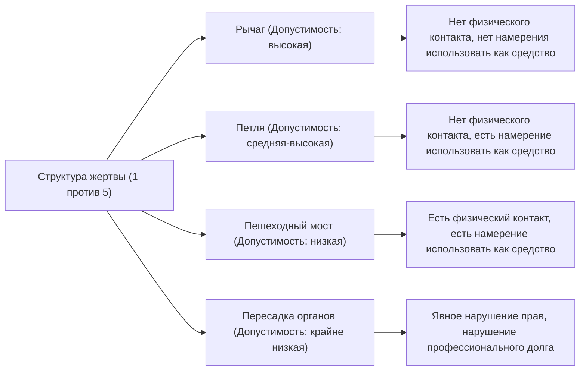

# Проблема вагонетки: Абсолютный выбор в этике и бездна человеческой моральной интуиции

## Введение: Абсолютная моральная дилемма

Представьте себе: вы стоите у железнодорожных путей. Издалека доносится грохот — это потерявшая управление вагонетка (трамвай) на огромной скорости несётся прямо на вас. Взглянув вперёд, вы видите пятерых рабочих на путях, которые не замечают приближения вагонетки. Если всё так и останется, они неминуемо погибнут.

Однако прямо рядом с вами находится рычаг для переключения стрелки. Если вы потянете за этот рычаг, вагонетка изменит курс и поедет по запасному пути. Но на запасном пути находится ещё один рабочий.

**«Потянете ли вы за рычаг, пожертвовав одним человеком ради спасения пятерых? Или же ничего не сделаете и позволите пятерым погибнуть?»**

Это базовая форма «Проблемы вагонетки» (Trolley Problem) — самого известного и обсуждаемого мысленного эксперимента в этике. С точки зрения простой арифметики кажется, что «лучше спасти пять жизней, чем одну», но всё не так просто. В этой статье через призму этой абсолютной дилеммы мы глубоко исследуем сложный мир человеческой моральной интуиции: от утилитаризма и деонтологии до новейших достижений нейробиологии и этики ИИ в беспилотных автомобилях.

## 1. Рождение проблемы вагонетки: концепция Филиппы Фут

Проблема вагонетки была впервые представлена в 1967 году британским философом Филиппой Фут (Philippa Foot) в её статье «Проблема аборта и доктрина двойного эффекта». Изначально она была задумана как вспомогательный мысленный эксперимент для прояснения моральных дискуссий об абортах.

В сценарии, предложенном Фут (сценарий с рычагом, описанный выше), подавляющее большинство людей отвечает, что «нужно потянуть за рычаг». Обычная причина: «Меньший ущерб — когда умирает один человек, а не пять». Эта идея тесно связана с этической позицией «утилитаризма» (Utilitarianism), предложенной Джереми Бентамом и Джоном Стюартом Миллем, которая утверждает, что благо — это «наибольшее счастье для наибольшего числа людей».

## 2. Развитие Джудит Джарвис Томсон: Парадокс толстяка

Однако в 1985 году американский философ Джудит Джарвис Томсон (Judith Jarvis Thomson) предложила новую вариацию, которая значительно усложнила дискуссию. Это сценарий с «Толстяком» (The Fat Man).

### Толстяк на пешеходном мосту

Вы стоите на пешеходном мосту над железнодорожными путями. Снизу приближается неуправляемая вагонетка, а впереди всё так же находятся пятеро рабочих. В этот раз рычага нет. Но рядом с вами стоит очень крупный «толстяк». Если вы столкнёте его с моста на пути, его огромное тело станет препятствием, вагонетка остановится, и пять жизней будут спасены (однако сам он, упав, неминуемо погибнет; при этом ваш собственный вес слишком мал, чтобы остановить вагонетку).

**«Столкнёте ли вы толстяка, пожертвовав одним ради спасения пятерых?»**

Математическая структура ущерба здесь абсолютно такая же, как и в первом сценарии: «пожертвовать одним, чтобы спасти пятерых». Но, как ни удивительно, в этом сценарии подавляющее большинство людей отвечает, что «сталкивать не следует (это недопустимо)».

Почему мы чувствуем, что потянуть за рычаг и убить одного допустимо, а столкнуть одного человека своими руками — нет? В этом противоречии интуиции и кроется истинная сложность (парадокс) проблемы вагонетки.

```mermaid
graph TD
    A["Моральная дилемма"] --> B{"Пожертвовать одним, чтобы спасти пятерых?"}
    B -- "Сценарий с рычагом" --> C["Многие отвечают, что это допустимо"]
    B -- "Сценарий с мостом" --> D["Многие отвечают, что это недопустимо"]
    C --> E["Утилитаристское суждение (акцент на результат)"]
    D --> F["Деонтологическое суждение (акцент на сам поступок)"]
    E -. "Противоречие?" .- F
```

## 3. Утилитаризм vs Деонтология: Два главных лагеря в этике

Чтобы объяснить это расхождение в интуиции, необходимо понять два основных подхода в этике.

### Утилитаризм (Utilitarianism)
Это позиция, которая оценивает нравственность поступка по его «результатам». Правильным считается выбор, который максимизирует общее количество счастья (или минимизирует страдания) в результате. Поскольку «смерть пятерых — это хуже, чем смерть одного», и нажатие рычага, и сталкивание толстяка признаются «правильными поступками».

### Деонтология (Deontology)
Позиция, представителем которой является Иммануил Кант, оценивающая моральность не по «результату» поступка, а по «природе самого поступка» или «мотивам». Кант утверждал, что «человека всегда следует рассматривать как цель, а не только как средство».
Сталкивание толстяка означает использование человека как «средства (инструмента)» для спасения пятерых, что нарушает человеческое достоинство и считается абсолютным злом. С другой стороны, в первом сценарии с рычагом смерть одного человека не является «намеренным средством» спасения пятерых; она может интерпретироваться лишь как нежелательный, но «предвиденный побочный эффект» (доктрина двойного эффекта, о которой пойдет речь ниже).

## 4. Дальнейшие вариации: Петля и пересадка органов

Поиски философов на этом не заканчиваются. Слегка изменяя условия мысленного эксперимента, они пытаются ещё глубже исследовать границы нашей моральной интуиции.

### Сценарий с петлёй (Томсон)
Сценарий, в котором запасной путь делает петлю и снова соединяется с главным. Если потянуть за рычаг, вагонетка поедет по запасному пути. Там находится один крупный рабочий, столкновение с которым остановит вагонетку и спасёт пятерых на главном пути. Если бы этого человека не было, вагонетка прошла бы по петле, вернулась на главный путь и задавила бы пятерых сзади.
В этом случае смерть одного — это уже не просто «побочный эффект», а «необходимое средство» для спасения пятерых (ведь без него их не спасти). И всё же многие люди отвечают, что в этом сценарии «допустимо потянуть рычаг». Это ставит под сомнение кантианское объяснение сценария с толстяком (где использование человека как средства недопустимо).

### Сценарий с пересадкой органов (Фут)
Действие переносится в больницу. Пятеро пациентов страдают от смертельной недостаточности разных органов (сердце, лёгкие, почки и т. д.) и умрут сегодня же, если не получат пересадку. В это время на медосмотр приходит один здоровый молодой человек. Его органы подходят всем пятерым. Будучи врачом, вы можете тайно убить этого здорового юношу, извлечь его органы и пересадить их пятерым пациентам, пожертвовав одним ради спасения пятерых.
В этом сценарии почти 100% людей отвечают, что это «абсолютно недопустимо». Однако математика ущерба здесь совершенно такая же, как и в проблеме вагонетки.

## 5. Доктрина двойного эффекта (Doctrine of Double Effect)

«Доктрина двойного эффекта», берущая начало от средневекового теолога Фомы Аквинского, является одной из влиятельных концепций, объясняющих противоречия проблемы вагонетки. Согласно этому принципу, если действие приводит как к «хорошему», так и к «плохому» результату, оно допустимо при соблюдении следующих условий:

1. Само действие должно быть благим или хотя бы морально нейтральным.
2. Намерением должен быть только хороший результат, тогда как плохой результат может лишь предвидеться, но не быть целью.
3. Плохой результат не должен быть средством достижения хорошего.
4. Должна быть достаточно веская причина (пропорциональность) того, что хороший результат перевешивает плохой.

В сценарии с рычагом само действие «отклонения вагонетки» нейтрально; смерть одного предвидится, но не является намерением или средством. В сценарии же с мостом присутствует прямой акт причинения вреда («толкнуть человека»), и смерть человека (или использование его тела как живого щита) сама по себе является намеренным средством для спасения пятерых. Таким образом, по этому принципу такое действие признаётся недопустимым.

## 6. Подход нейробиологии и эволюционной психологии: Теория двойного процесса Джошуа Грина

В XXI веке проблема вагонетки покинула кресла философов и переместилась в лаборатории нейробиологов и психологов. Психолог из Гарвардского университета Джошуа Грин (Joshua Greene) предлагал испытуемым различные сценарии проблемы вагонетки, сканируя активность их мозга с помощью фМРТ (функциональной магнитно-резонансной томографии).

Результаты оказались поразительными.
- При размышлении о **сценарии с мостом** (вред, связанный с прямым физическим контактом) в мозге испытуемых сильно активизировались зоны, отвечающие за **эмоции и интуицию** (например, миндалевидное тело).
- При размышлении о **сценарии с рычагом** (вред без физического контакта) или при попытке принять утилитаристское решение (вопреки интуиции) в сценарии с мостом — «нужно столкнуть» — сильно активизировались зоны, отвечающие за **логические рассуждения и когнитивный контроль** (например, префронтальная кора), и на ответ уходило больше времени.

На основе этого Грин предложил «теорию двойного процесса» (Dual-process theory).
Он утверждал, что моральные суждения человека определяются не единой логической системой, а конкуренцией двух систем: эволюционно древней «эмоционально-интуитивной» и эволюционно новой «когнитивно-рациональной».
Для наших предков в каменном веке непосредственное толкание или избиение сородича было повседневной угрозой, поэтому в ходе эволюции у нас выработалось сильное отвращение (эмоциональный тормоз) к таким действиям. Однако косвенного вреда, такого как «потянуть рычаг, чтобы кто-то умер вдалеке», в процессе эволюции не существовало, и поэтому интуитивный тормоз здесь не так силён. В результате, в сценарии с рычагом побеждают расчеты префронтальной коры (1 < 5), а в сценарии с мостом эмоциональное отвращение подавляет эти расчёты.

Это открытие породило новый философский вопрос: «А не является ли наша моральная интуиция вовсе не абсолютной истиной, а просто побочным продуктом эволюции (багом)?»

## 7. Применение в реальном мире: Беспилотные автомобили и этика ИИ

Проблема вагонетки, некогда бывшая чисто мысленным экспериментом, в современном обществе стала крайне практической задачей. Ярчайший пример — разработка «беспилотных автомобилей (ИИ автономного вождения)».

Как должен быть запрограммирован ИИ на случай неизбежной аварии, например, при отказе тормозов?
- Должен ли он продолжать двигаться прямо и сбить пятерых пешеходов на переходе?
- Или же он должен повернуть руль, врезаться в стену и пожертвовать жизнью владельца автомобиля (одного человека)?

В масштабном онлайн-опросе «Моральная машина» (Moral Machine), проведённом MIT (Массачусетским технологическим институтом), миллионам людей по всему миру предлагались различные сценарии, чтобы выяснить, кого должен спасать беспилотный автомобиль в первую очередь (молодых или стариков, людей или животных, пешеходов, соблюдающих правила, или нарушителей).
В результате выяснилось, что хотя утилитаристская точка зрения («нужно спасти как можно больше жизней») была сильна повсеместно, культурные различия также играли большую роль. Например, в восточных культурах наблюдалась тенденция к уважению пожилых людей, тогда как на Западе приоритет отдавался молодежи и детям.

Должны ли разработчики ИИ внедрять в свои автомобили программу «пожертвовать владельцем ради спасения других»? Если они это сделают, купят ли потребители «автомобиль, который может их убить»? (В ходе многих опросов люди давали противоречивые ответы: «для общества в целом желательно, чтобы беспилотные автомобили вели себя утилитарно», но при этом «я сам не хочу покупать такой автомобиль (я хочу машину, которая в первую очередь защитит меня)»).

Проблема вагонетки — это уже не игра для философских классов, а насущная практическая задача, с которой сталкиваются инженеры, юристы и политики.

## 8. Другие практические применения и вариации

Помимо беспилотного вождения, существует множество реальных ситуаций, имеющих структуру проблемы вагонетки.

### Медицинский триаж (сортировка)
Во время масштабных катастроф или пандемий (например, в начале эпидемии COVID-19), когда не хватает медицинских ресурсов, таких как аппараты ИВЛ, врачи вынуждены делать выбор: кому выделить ресурсы, а кого оставить умирать. Решение «сосредоточить ресурсы на молодых с более высокими шансами на выживание и оставить напоследок пожилых, чьи шансы невелики» — это настоящая проблема вагонетки на основе утилитаризма в действии.

### Целевые удары военных дронов
Удар с беспилотника (дрона) по зданию, где скрывается лидер террористов, может предотвратить множество терактов в будущем, но в то же время невинные мирные жители вокруг станут сопутствующим ущербом (collateral damage). Как военный командир должен рассчитывать этот баланс жертв?

## Заключение: Смысл столкновения с вопросом без ответа

В конечном счете, в проблеме вагонетки нет «абсолютно правильного ответа». И в том, чтобы потянуть за рычаг, и в том, чтобы его не трогать, есть как прочные этические основания, так и фатальные недостатки.

Истинная цель мысленного эксперимента заключается не в том, чтобы найти единственный верный ответ. Она состоит в том, чтобы пошатнуть основы моральных ценностей, которых мы придерживаемся неосознанно, и вынести на свет их ограничения и противоречия.
Мы все верим одновременно в несколько моральных правил, таких как «жизни равны», «убийство — это зло», «нужно спасти как можно больше людей», но только в экстремальных ситуациях, когда эти правила сталкиваются, мы впервые осознаем неглубокость собственной этики и сложность человеческого бытия.

Возможно, близок тот день в будущем обществе, когда ИИ и технологии будут принимать сложные решения за нас. Однако решать, какой именно этике обучать этот ИИ, предстоит нам, людям. Рычаг перед неуправляемой вагонеткой прямо сейчас находится в руках всего нашего общества.
