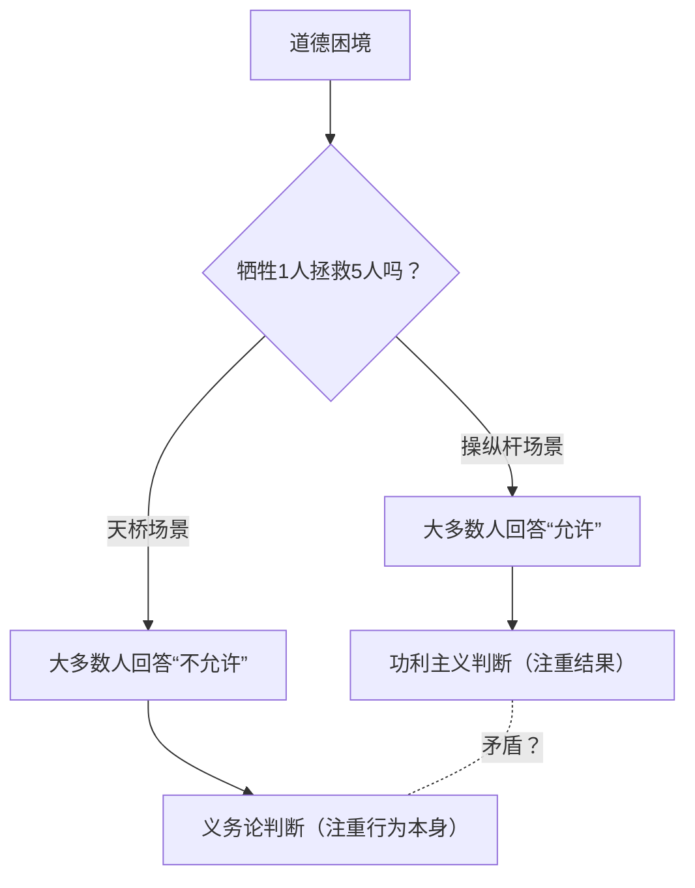
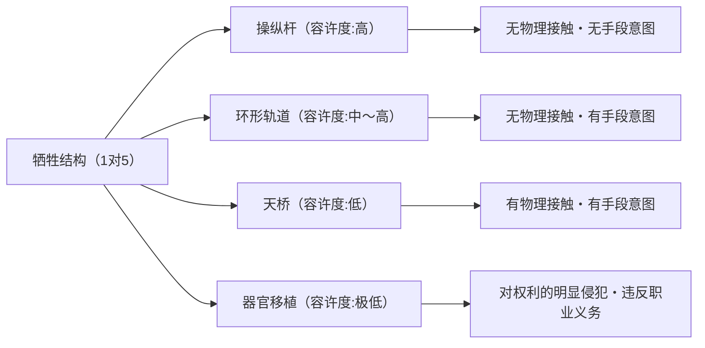

# 电车难题：伦理学的终极选择与人类道德直觉的深渊

## 引言：终极的伦理困境

想象一下，你正站在铁轨旁。远处传来轰鸣声，一辆失控的电车（有轨电车）正以极快的速度向你这边冲来。你往前看，铁轨前方有5名工人，他们并没有注意到电车的逼近。如果就这样下去，这5人毫无疑问会被电车碾死。

但是，就在你身旁，有一个可以切换铁轨岔道（道岔）的操纵杆。如果你拉下这个操纵杆，电车就会改变方向驶入备用轨道。然而，在备用轨道的前方，还有另外1名工人。

**“你会拉下操纵杆，牺牲1人来拯救5人吗？还是什么都不做，眼睁睁看着5人死去？”**

这就是伦理学中最著名、也最具争议的思想实验——“电车难题（Trolley Problem）”的基本形态。如果只用简单的算术来看，答案应该是“救5个人的命比救1个人的命更好”，但事情并没有那么简单。在本文中，我们将通过这个终极困境，彻底探索从功利主义、义务论，到最新的神经科学，再到自动驾驶汽车的AI伦理，那深奥的人类道德直觉世界。

## 1. 电车难题的诞生：菲利帕·福特的提出

电车难题首次出现在英国哲学家菲利帕·福特（Philippa Foot）于1967年发表的论文《堕胎问题与双重效应原则》中。它最初是作为辅助的思想实验，用来阐明关于堕胎的道德争论。

在福特提出的场景（上述的操纵杆场景）中，绝大多数人的回答是“应该拉下操纵杆”。一般的理由是“死1个人比死5个人的损失要小”。这种想法受到了杰里米·边沁（Jeremy Bentham）和约翰·斯图尔特·密尔（John Stuart Mill）所提倡的“功利主义（Utilitarianism）”，即主张“最大多数人的最大幸福”为善的伦理立场的强烈支持。

## 2. 朱迪斯·贾维斯·汤姆森的发展：胖子悖论

然而，在1985年，美国哲学家朱迪斯·贾维斯·汤姆森（Judith Jarvis Thomson）提出了一个新的变体，让讨论的复杂性瞬间倍增。这就是“胖子（The Fat Man）”场景。

### 天桥上的胖子

你正站在横跨铁轨的天桥上。下方是疾驰而来的失控电车，前方依然有5名工人。这次没有操纵杆。但是，你的旁边站着一个体格极其魁梧的“胖子”。如果你把他从天桥上推下铁轨，他巨大的身体就会成为障碍物逼停电车，从而拯救那5个人的生命（不过，被推下去的他一定会死。另外，你自己的体重太轻，无法逼停电车）。

**“你会把胖子推下去，牺牲1人来拯救5人吗？”**

在数学上的损失结构与第一个场景完全相同，都是“牺牲1人拯救5人”。然而，令人惊讶的是，在这个场景中，绝大多数人的回答是“不该推（不被允许）”。

为什么拉下操纵杆杀死1人是可以被接受的，而亲手将1人推下致死却让人觉得不可原谅呢？这种直觉上的矛盾，正是电车难题真正的难点（悖论）所在。

## 3. 功利主义 vs 义务论：伦理学的两大阵营

为了解释这种直觉上的不一致，我们需要了解伦理学中的两种主要方法。

### 功利主义（Utilitarianism）
这是一种根据行为的“结果”来评价其道德性的立场。它认为，能产生最大幸福总量（或最大程度减少痛苦）的选择就是正确的。因为它认为“5个人的死比1个人的死是更坏的结果”，所以无论是拉下操纵杆，还是把胖子推下去，都是“正确的行为”。

### 义务论（Deontology）
以伊曼努尔·康德（Immanuel Kant）为代表，这是一种不根据行为的“结果”，而是根据“行为本身的性质”和“动机”来评价其道德性的立场。康德主张“对待人，绝不能仅仅作为手段，而应始终作为目的”。
把胖子推下去的行为，等同于把1个人当作拯救5个人的“手段（工具）”来利用，这侵犯了人的尊严，因此被认为是绝对的恶。另一方面，在最初的操纵杆场景中，1个人的死亡有时并不被解释为拯救5个人的“有意图的手段”，而仅仅是想要避免但却“可预见的副作用（附带结果）”（即下文将提到的双重效应原则）。

## 4. 进一步的变体：环形轨道与器官移植

哲学家的探索并没有就此停止。通过微妙地改变思想实验的条件，他们试图进一步探寻我们道德直觉的边界。

### 环形轨道场景（汤姆森）
这是一个备用轨道再次与主轨道汇合呈环形的场景。拉下操纵杆后，电车会驶入备用轨道。备用轨道上有一个魁梧的工人，电车撞上他后会停下来，从而主轨道上的5人得救。如果那1个人不在那里，电车就会穿过环形轨道回到主轨道，从背后碾死那5人。
在这种情况下，1个人的死亡不再仅仅是“副作用”，而是拯救5个人的“不可或缺的手段”（因为如果没有他，就无法拯救那5人）。然而，许多人在此场景下依然回答“允许拉下操纵杆”。这动摇了对胖子场景（不允许作为手段被利用）的康德主义解释。

### 器官移植场景（福特）
场景转移到医院。有5名患者分别因为不同器官（心脏、肺、肾脏等）的致命衰竭，如果今天不接受移植就会死亡。这时，有1名健康的年轻人来做体检。他的器官与这5个人完全匹配。作为医生的你，如果偷偷杀掉这个健康的年轻人，取出他的器官移植给那5人，就可以牺牲1人来拯救5人。
在这个场景中，几乎100%的人都会回答“绝对不允许”。但是，损失的计算公式与电车难题完全相同。

## 5. 双重效应原则（Doctrine of Double Effect）

起源于中世纪神学家托马斯·阿奎那的“双重效应原则”，是解释电车难题矛盾的一个有力框架。根据这一原则，如果某个行为同时带来“好结果”和“坏结果”，只要满足以下条件，该行为就是被允许的。

1. 行为本身必须是善的，或者至少在道德上是中立的。
2. 只有好结果是被意图的，坏结果仅仅是被预见到的，而不是被意图的。
3. 坏结果不能成为实现好结果的手段。
4. 必须有充分的理由（比例性）让好结果足以弥补坏结果。

在操纵杆场景中，“让电车改变方向”的行为本身是中立的，1个人的死亡是被预见的但不是被意图的，也不是手段。然而，在天桥场景中，存在“推人”这种直接的伤害行为，而且他的死（或者用他的身体作挡箭牌）本身就是作为拯救5个人的手段而被意图的，因此根据这个原则被判定为不允许。

## 6. 神经科学与进化心理学的方法：约书亚·格林的双过程理论

进入21世纪后，电车难题离开了哲学家的安乐椅，被带入了脑科学和心理学的实验室。哈佛大学的心理学家约书亚·格林（Joshua Greene）向受试者展示了电车难题的各种场景，并用fMRI（功能性磁共振成像）扫描了他们在此期间的大脑活动。

结果令人震惊。
- 当受试者思考**天桥场景**（伴有直接物理接触的伤害）时，大脑中掌管**情绪和直觉**的区域（如杏仁核等）被强烈激活。
- 当受试者思考**操纵杆场景**（不伴有物理接触的伤害），或者在天桥场景中试图（违背直觉地）做出“应该推下去”的功利主义判断时，大脑中掌管**逻辑推理和认知控制**的区域（如前额叶皮层等）被强烈激活，并且回答所需的时间也更长。

格林由此提出了“双过程理论（Dual-process theory）”。
人类的道德判断并非由单一的逻辑系统决定，而是由进化上古老的“情绪-直觉系统”与进化上较新的“认知-理性系统”这两个相互竞争的系统来决定的。
对于石器时代的祖先来说，亲手将同伴推下或殴打是日常的威胁，为了应对这种威胁，我们进化出了对这种行为强烈的厌恶感（情绪制动）。但是，对于“拉下操纵杆让远处的某人死去”这种间接的伤害，在进化的过程中是不存在的，因此直觉的制动并没有发挥强烈的作用。结果就是，在操纵杆场景中，前额叶皮层的计算（1 < 5）取得了胜利，而在天桥场景中，情绪上的厌恶感压倒了理性的计算。

这一发现催生了一个新的哲学问题：“我们的道德直觉是否并非绝对的真理，而仅仅只是进化的产物（bug）？”

## 7. 在现实世界中的应用：自动驾驶汽车与AI的伦理

曾经只是纯粹思想实验的电车难题，在现代社会已经成为了极其现实的课题。其中最突出的例子就是“自动驾驶汽车（自动驾驶AI）”的开发。

当自动驾驶汽车遇到刹车失灵等不可避免的事故时，AI应该被设定为什么样的程序呢？
- 是直行撞死正在过斑马线的5名行人？
- 还是打方向盘撞向墙壁，牺牲车内车主（1人）的生命？

麻省理工学院（MIT）开展了一项名为“道德机器（Moral Machine）”的大规模在线调查，向全球数百万人展示了各种场景，调查自动驾驶汽车应该优先拯救谁（年轻人还是老年人、人类还是动物、遵守交通规则的行人还是闯红灯的行人等）。
结果显示，虽然“应该拯救更多人的生命”这种功利主义的观点在世界范围内普遍较强，但也暴露出因文化背景差异而带来的巨大分歧。例如，东方文化圈更倾向于尊重老年人，而西方文化圈则更倾向于优先保护年轻人和儿童。

开发AI的企业，是否应该在自己的汽车中植入“即使牺牲车主也要拯救他人”的程序呢？如果植入了，消费者会购买一辆“可能会杀死自己”的汽车吗？（在许多问卷调查中，人们一边回答“从整个社会的角度来看，希望自动驾驶汽车能表现出功利主义”，一边又自相矛盾地表示“自己不想买这样的车（想要买优先保护自己的车）”）。

电车难题已经不再是哲学课堂上的游戏，而是工程师、法学家、政策制定者必须面对的迫在眉睫的现实问题。

## 8. 其他的现实应用与变体

除了自动驾驶，现实中还有许多具有电车难题结构的困境。

### 医疗中的伤员分流（Triage）
在大规模灾害或大流行病（例：新冠病毒流行初期）中，当呼吸机等医疗资源短缺时，医生将被迫做出选择：将资源分配给谁，又放弃谁。“将资源集中在生存可能性更高的年轻人身上，推迟救助生存希望渺茫的老年人”，这种判断正是基于功利主义的电车难题的实践。

### 军事无人机的目标打击
如果用无人机轰炸恐怖分子领导人潜伏的建筑物，可以防止未来发生更多恐怖袭击，但同时也会使周围无辜的平民受到波及（附带损害）。军队指挥官该如何计算这种牺牲的平衡呢。

## 结语：面对没有答案的问题的意义

归根结底，电车难题并不存在“绝对正确的标准答案”。无论是拉下操纵杆，还是不拉，都包含了各自坚实的伦理依据，以及致命的缺陷。

思想实验的真正目的，并不是为了得出一个正确答案。它的意义在于动摇我们无意识中抱有的道德价值观的前提，将其局限性和矛盾暴露在光天化日之下。
我们每个人同时相信着“生命是平等的”、“杀人是恶的”、“应该拯救更多的人”等多个道德准则，但在它们相互冲突的极限状态下，我们才会首次意识到自身伦理的浅薄，以及人类这种存在的复杂性。

在未来的社会中，AI和科技代替我们做出复杂决定的那一天或许已经不远了。然而，决定要赋予AI何种伦理的，是我们人类自己。失控电车的操纵杆，现在正紧紧握在我们整个社会的手中。
