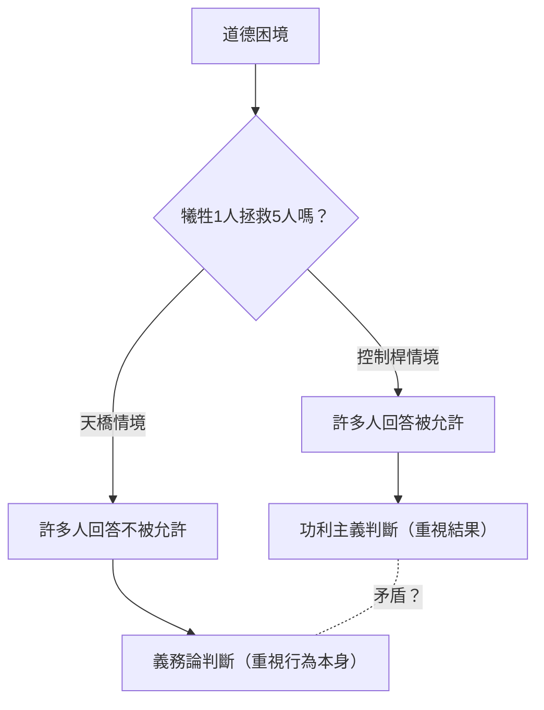
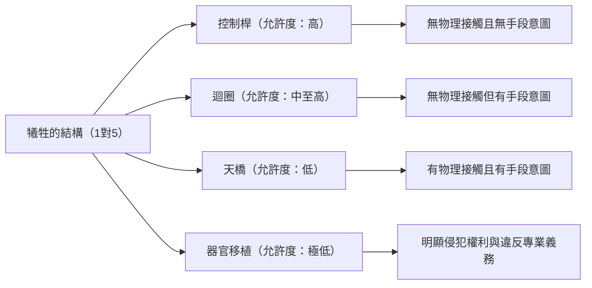

# 電車難題：倫理學的終極選擇與人類道德直覺的深淵

## 前言：終極的倫理困境

想像一下，你站在鐵軌旁。遠處傳來轟鳴聲，一輛失控的電車正以極快的速度朝這邊衝來。看著前方，鐵軌上有 5 名工人，他們並沒有察覺到電車的逼近。照這樣下去，這 5 人無疑會被輾死。

然而，就在你身邊，有一個可以切換鐵軌分岔點的控制桿。只要拉下這個控制桿，電車就會改變路線，駛入側線。但是，側線的前方還有另外 1 名工人。

**「你會拉下控制桿，犧牲 1 人來拯救 5 人嗎？還是什麼都不做，眼睜睜看著 5 人死去？」**

這就是倫理學中最著名、也最具爭議的思想實驗「電車難題（Trolley Problem）」的基本型態。用簡單的算術來說，應該是「拯救 5 條人命比拯救 1 條人命更好」，但事情並沒有那麼簡單。本文將透過這個終極困境，從功利主義與義務論，甚至到最新的神經科學與自動駕駛汽車的 AI 倫理，徹底探索人類道德直覺的深邃世界。

## 1. 電車難題的誕生：菲利帕·福特的提出

電車難題首次出現在 1967 年英國哲學家菲利帕·福特（Philippa Foot）發表的論文《墮胎問題與雙重效應原則》中。它最初是作為釐清墮胎相關道德爭議的輔助思想實驗而設計的。

在福特提出的情境（上述的控制桿情境）中，大多數人都會回答「應該拉下控制桿」。一般的理由是「死 1 個人比死 5 個人造成的傷害更小」。這種觀點強烈地呼應了傑里米·邊沁（Jeremy Bentham）和約翰·史都華·彌爾（John Stuart Mill）所提倡的「功利主義（Utilitarianism）」，即以「最大多數人的最大幸福」為善的倫理立場。

## 2. 朱迪斯·賈維斯·湯姆森的發展：胖子悖論

然而，在 1985 年，美國哲學家朱迪斯·賈維斯·湯姆森（Judith Jarvis Thomson）提出了一個新的變體，使爭論瞬間變得更加複雜。這就是「胖子（The Fat Man）」的情境。

### 天橋上的胖子

你站在橫跨鐵軌的天橋上。下方是一輛失控逼近的電車，前方同樣有 5 名工人。這次沒有控制桿。但是，你旁邊站著一位體格非常魁梧的「胖子」。如果你把他從橋上推落到鐵軌上，他巨大的身軀將成為障礙物擋住電車，從而拯救這 5 人的性命（不過，被推下去的他必死無疑。順帶一提，你的體重太輕，無法擋住電車）。

**「你會把胖子推下去，犧牲 1 人來拯救 5 人嗎？」**

數學上的傷害結構與第一個情境完全相同，都是「犧牲 1 人拯救 5 人」。然而，令人驚訝的是，在這個情境中，大多數人都回答「不應該推（不被允許）」。

為什麼拉下控制桿殺死 1 人是可以被允許的，而親手推下 1 人致死卻讓人覺得不被允許呢？這種直覺上的矛盾，正是電車難題真正的困難之處（悖論）。

## 3. 功利主義 vs 義務論：倫理學的兩大陣營

為了解釋這種直覺上的不一致，我們需要理解倫理學中的兩種主要方法。

### 功利主義（Utilitarianism）
這是一種根據行為的「結果」來評估其道德性的立場。認為能產生最大總量幸福（或減少最多痛苦）的選擇就是正確的。因為「1 人的死亡比 5 人的死亡結果更好」，所以無論是拉下控制桿還是推下胖子，兩者都被視為「正確的行為」。

### 義務論（Deontology）
以伊曼努爾·康德（Immanuel Kant）為代表，這是一種不根據行為的「結果」，而是根據「行為本身的性質」或「動機」來評估道德性的立場。康德主張「必須始終將人視為目的，而不僅僅是手段」。
將胖子推下去的行為，等於是把 1 個人當作拯救 5 個人的「手段（工具）」，這侵犯了人類的尊嚴，因此被視為絕對的惡。另一方面，在第一個控制桿情境中，1 個人的死亡並不是拯救 5 個人的「意圖手段」，而是為了避免傷害而「預見到的副作用（附帶結果）」（詳見後述的雙重效應原則）。

## 4. 進階變體：迴圈與器官移植

哲學家的探索並未止步於此。透過微妙地改變思想實驗的條件，他們試圖進一步探索我們道德直覺的邊界。

### 迴圈情境（湯姆森）
在這個情境中，側線會形成迴圈再次與主線會合。拉下控制桿後，電車會進入側線。側線上有一位身材高大的工人，電車撞上他後會停下來，從而拯救主線上的 5 人。如果那 1 個人不在那裡，電車就會通過迴圈回到主線，從背後輾過這 5 人。
在這種情況下，那 1 個人的死就不再只是「副作用」，而是拯救 5 個人的「不可或缺的手段」（因為沒有他，就無法拯救那 5 人）。然而，許多人在這個情境中依然回答「拉下控制桿是被允許的」。這動搖了針對胖子情境（不允許將人作為手段）的康德式解釋。

### 器官移植情境（福特）
場景轉移到醫院。有 5 名患者分別因為不同的器官（如心臟、肺、腎臟等）發生致命衰竭，如果今天不接受移植就會死亡。這時，一位健康的年輕人來進行體檢。他的器官與這 5 人完全匹配。身為醫生的你，如果偷偷殺害這個健康的年輕人，取出他的器官移植給這 5 人，就能犧牲 1 人來拯救 5 人。
在這個情境中，幾乎 100% 的人都會回答「絕對不允許」。然而，傷害的計算公式與電車難題完全相同。

## 5. 雙重效應原則（Doctrine of Double Effect）

源自中世紀神學家托馬斯·阿奎那（Thomas Aquinas）的「雙重效應原則」，是解釋電車難題矛盾的一個有力框架。根據這個原則，如果一個行為同時帶來「好結果」和「壞結果」，只要滿足以下條件，該行為就是被允許的：

1. 行為本身是善的，或者至少在道德上是中立的。
2. 只有好結果是被意圖的，壞結果只是被預見而並非意圖。
3. 壞結果不能作為達成好結果的手段。
4. 必須有充分的理由（比例性），使得好結果能超過壞結果。

在控制桿情境中，「改變電車路線」這個行為本身是中立的，1 個人的死雖然被預見但並未被意圖，也不是手段。然而，在天橋情境中，存在「把人推下去」的直接傷害行為，而且這個人的死（或將其身體當作擋箭牌）本身被意圖作為拯救 5 個人的手段，因此根據這個原則，這是不被允許的。

## 6. 來自神經科學與演化心理學的觀點：約書亞·格林的雙歷程理論

進入 21 世紀後，電車難題離開了哲學家的安樂椅，進入了腦科學和心理學的實驗室。哈佛大學心理學家約書亞·格林（Joshua Greene）向受試者展示了各種電車難題情境，並透過功能性磁振造影（fMRI）掃描他們大腦的活動。

結果令人驚訝：
- 當思考**天橋情境**（伴隨直接物理接觸的傷害）時，受試者大腦中掌管**情感和直覺**的區域（如杏仁核）會強烈活化。
- 當思考**控制桿情境**（不伴隨物理接觸的傷害）時，或者在天橋情境中（違背直覺地）試圖做出「應該推下去」的功利主義判斷時，受試者大腦中掌管**邏輯推理和認知控制**的區域（如前額葉皮質）會強烈活化，並且需要更長的時間來回答。

格林由此提出了「雙歷程理論（Dual-process theory）」。
人類的道德判斷並非單一的邏輯系統，而是由演化上較古老的「情感與直覺系統」和較新的「認知與理性系統」這兩個競爭系統所決定的。
對於我們石器時代的祖先來說，親手推倒或毆打同伴是日常的威脅，我們在演化中產生了對此的強烈厭惡感（情感剎車）。然而，「拉下控制桿讓遠處的某人死去」這種間接傷害在演化過程中並不存在，因此直覺上的剎車不會強烈作用。結果，在控制桿情境中，前額葉皮質的計算（1 < 5）獲勝，而在天橋情境中，情感上的厭惡感壓倒了計算。

這項發現引發了新的哲學問題：「我們的道德直覺難道不是絕對的真理，而只不過是演化的產物（甚至是 Bug）嗎？」

## 7. 在現實世界的應用：自動駕駛汽車與 AI 的倫理

曾經純粹是思想實驗的電車難題，在現代社會中已成為極具現實意義的課題。最典型的例子就是「自動駕駛汽車（自動駕駛 AI）」的開發。

當自動駕駛汽車面臨煞車失靈等不可避免的事故時，AI 應該被編程為何種反應？
- 應該直行並輾過正在過斑馬線的 5 名行人嗎？
- 還是應該轉動方向盤撞向牆壁，犧牲車上車主（1 人）的性命？

麻省理工學院（MIT）進行了一項名為「道德機器（Moral Machine）」的大規模線上調查，向全球數百萬人展示了各種情境，調查自動駕駛汽車應該優先拯救誰（年輕人還是老人、人類還是動物、遵守交通規則的行人還是闖紅燈的行人等）。
結果顯示，儘管「應該拯救更多生命」的功利主義觀點在世界各地都很普遍，但文化背景也造成了巨大差異。例如，東方文化圈傾向於尊重長者，而西方則傾向於優先考慮年輕人和兒童。

AI 開發公司是否應該在他們的汽車中實作「即使犧牲車主也要拯救他人」的程式？如果實作了，消費者會買一輛「可能會殺死自己」的車嗎？（在許多問卷調查中，人們給出了矛盾的回答：一方面認為「對整個社會來說，功利主義的自動駕駛汽車是理想的」，另一方面又表示「自己不想買這種車（想買優先保護自己的車）」）。

電車難題已經不再是哲學課堂上的遊戲，而是工程師、法學家和政策制定者面臨的迫切實務挑戰。

## 8. 其他現實應用與變體

除了自動駕駛，現實中還有許多具有電車難題結構的情境。

### 醫療中的檢傷分類
在大規模災難或大流行病（如：新冠肺炎爆發初期）中，當人工呼吸器等醫療資源短缺時，醫生會面臨將資源分配給誰、放棄誰的選擇。「將資源集中在生存機率較高的年輕人身上，而將康復希望渺茫的老年人往後排」的判斷，正是基於功利主義的電車難題實踐。

### 軍事無人機的目標攻擊
如果用無人機轟炸恐怖分子頭目藏身的建築物，可以防止未來發生許多恐怖襲擊，但同時也會波及周圍無辜的平民（附帶損害）。軍隊指揮官應該如何計算這種犧牲的平衡呢？

## 結語：面對無解之題的意義

歸根究底，電車難題並不存在「絕對正確的標準答案」。無論是拉下還是不拉下控制桿，都有其強而有力的倫理依據，同時也包含著致命的缺陷。

思想實驗的真正目的，並不是為了解得出一個標準答案。而是要動搖我們潛意識中抱持的道德價值觀前提，並將其局限性和矛盾暴露在陽光之下。
我們都同時相信「生命是平等的」、「殺人是惡的」、「應該拯救更多的人」等多重道德規則，但在這些規則相互衝突的極限狀態下，我們才首次意識到自身倫理的膚淺，以及人類存在的複雜性。

在未來的社會中，AI 和科技代替我們做出複雜決定的日子可能很快就會到來。然而，決定賦予 AI 何種倫理的，依然是我們人類。失控電車的控制桿，現在正緊緊握在我們整個社會的手中。
