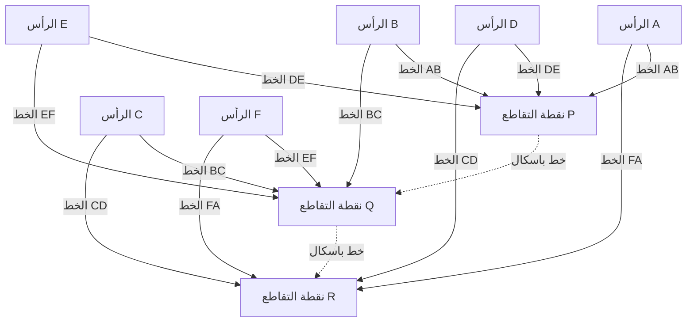

## 1. مقدمة: العبقري الذي غيّر العالم في 39 عامًا فقط من حياته

"الإنسان ليس سوى قصبة، هي الأضعف في الطبيعة؛ ولكنه قصبة مفكرة."
[بليز باسكال](https://kenji.blog/ar/p/pascal/) (19 يونيو 1623 - 19 أغسطس 1662)، الذي ترك هذه المقولة الشهيرة، هو عملاق فكري يمثل فرنسا في القرن السابع عشر. كعالم رياضيات، وعالم فيزياء، وفيلسوف، ولاهوتي مسيحي، ترك إنجازات ضخمة محفورة بعمق في تاريخ البشرية في مختلف المجالات.

كانت حياته معركة مستمرة مع المرض، وتوفي في سن مبكرة عن 39 عامًا. ومع ذلك، خلال هذه الحياة القصيرة، وضع أسس الهندسة الإسقاطية، واخترع أول آلة حاسبة ميكانيكية عملية في العالم، وكان رائدًا في المجال الرياضي الجديد لنظرية الاحتمالات، وأرسى المبادئ الأساسية للفيزياء فيما يتعلق بميكانيكا الموائع والضغط الجوي. تفصل هذه المقالة حياة هذا العبقري الذي رحل مبكرًا، وكيف توصل إلى هذه الاكتشافات الرائدة، والتأثير العميق الذي تركه على الأجيال اللاحقة.

## 2. ولادة طفل معجزة وبيئة تعليمية فريدة (1623 - 1639)

### 2.1. الولادة في أوفيرني ووفاة والدته
ولد [بليز باسكال](https://kenji.blog/ar/p/pascal/) عام 1623 في كليرمون فيران، أوفيرني، في وسط جنوب فرنسا. كان والده، إتيان باسكال، شخصية بارزة شغل منصب رئيس محكمة الضرائب المحلية وكان أيضًا عالم رياضيات ممتازًا. كانت عائلة باسكال في بيئة فكرية متميزة للغاية، ولكن عندما كان بليز في الثالثة من عمره فقط، توفيت والدته أنطوانيت. قرر والده إتيان عدم الزواج مرة أخرى وكرس نفسه بالكامل لتعليم أطفاله الثلاثة: بليز، وشقيقته الكبرى جيلبرت، وشقيقته الصغرى جاكلين.

### 2.2. الانتقال إلى باريس وسياسة إتيان التعليمية
في عام 1631، ولتوفير أفضل تعليم ممكن لأطفاله، نقل إتيان العائلة إلى باريس. نظرًا لعدم رضاه عن التعليم المدرسي في ذلك الوقت، اختار إتيان أن يصبح مدرسًا خاصًا لأطفاله بنفسه. كانت سياسته التعليمية فريدة جدًا: "لا تُعلّم الرياضيات، وهي مادة مجردة للغاية، حتى يتطور عقل الطفل بشكل كافٍ." أعطى الأولوية للغات والتاريخ، وتخلص من جميع كتب الرياضيات من المنزل.

ومع ذلك، فإن هذا "الحظر" بشكل متناقض حفز فضول الشاب بليز بشدة. في سن الثانية عشرة، بدأ بليز في استكشاف الهندسة بمفرده أثناء وقت لعبه. من خلال رسم أشكال على الأرض بالفحم، أثبت بشكل مستقل الطرح 32 في كتاب *الأصول* ل[إقليدس](https://kenji.blog/ar/p/euclid/): "مجموع الزوايا الداخلية للمثلث يساوي زاويتين قائمتين (180 درجة)." وعندما شهد والده هذه اللمحة الساحقة من الموهبة، غيّر سياسته، وسمح له بدراسة الرياضيات، وبدأ في اصطحابه إلى تجمعات أعظم مفكري أوروبا التي استضافها الأب ميرسين (سلف الأكاديمية الفرنسية للعلوم).

## 3. إنجازات مبتكرة في الرياضيات

ازدهرت موهبة باسكال الرياضية مبكرًا في سنوات مراهقته. امتدت أبحاثه لتشمل مجموعة واسعة من المجالات، من الرياضيات البحتة إلى الرياضيات التطبيقية.

### 3.1. ريادة الهندسة الإسقاطية: مبرهنة باسكال (الشكل السداسي الغامض)

في عام 1639، واجه باسكال البالغ من العمر 16 عامًا أعمال الهندسة الإسقاطية لجيرار ديسارغ في أكاديمية ميرسين. ولأنه فهم أفكار ديسارغ بعمق، اكتشف باسكال مبرهنة رائدة تتعلق بالقطوع المخروطية ونشرها في ورقة واحدة (مقال). يُعرف هذا اليوم باسم **مبرهنة باسكال**.

تنطبق مبرهنة باسكال على أي شكل سداسي مرسوم داخل قطع مخروطي (شكل بيضاوي، قطع مكافئ، قطع زائد، ودائرة).

> المبرهنة: إذا رُسم شكل سداسي داخل قطع مخروطي، فإن نقاط التقاطع الثلاث للأضلاع المتقابلة تقع على خط مستقيم واحد (خط باسكال).

تحديد نقاط التقاطع باستخدام الصيغ الرياضية:

$$
\text{نقطة تقاطع } P = AB \cap DE, \quad Q = BC \cap EF, \quad R = CD \cap FA \implies P, Q, R \text{ تقع على خط واحد}
$$

رسم هذه المبرهنة ينتج المخطط التالي:

أرسل هذا الاكتشاف موجة صدمة هائلة عبر المجتمع الرياضي في ذلك الوقت. هناك حكاية مفادها أن حتى عالم الرياضيات العظيم [رينيه ديكارت](https://kenji.blog/ar/p/descartes/) رفض تصديق أن صبيًا يبلغ من العمر 16 عامًا قد أنتج مثل هذا الإثبات المتقدم، مشتبهًا في أنه "لا بد أن الأب هو من كتبه". استمد باسكال أكثر من 400 نتيجة من هذه المبرهنة، مما أدى إلى تقدم كبير في هندسة عصره.

### 3.2. أول آلة حاسبة ميكانيكية في العالم: "باسكالين"

في عام 1639، تم تعيين والده إتيان مفوضًا للضرائب في روان، وانتقلت العائلة إلى هناك. ولرؤيته والده مرهقًا بسبب الحسابات الضريبية الهائلة في وقت متأخر من الليل، شرع باسكال في تطوير آلة لأتمتة الحسابات وتخفيف العبء عن والده.

في عام 1642، وبعد الكثير من التجربة والخطأ، أكمل باسكال البالغ من العمر 19 عامًا آلة حاسبة ميكانيكية باستخدام التروس، سميت "باسكالين". قام هذا الجهاز تلقائيًا بالجمع والطرح مع دوران التروس المحددة مسبقًا، والجدير بالذكر أنه كان أحد أوائل الآلات الحاسبة في العالم التي طبقت "آلية الحمل" العملية. تم تصنيع العشرات من آلات باسكالين لاحقًا، وحصل حتى على براءة اختراع من العائلة المالكة الفرنسية. يُعتبر باسكال أحد أوائل الرواد في تاريخ هندسة البرمجيات وتصميم الأجهزة.

### 3.3. مثلث باسكال ونظرية ذات الحدين

المفهوم الرياضي الذي يُعرف به اسم باسكال على نطاق واسع هو **مثلث باسكال**. هذا ترتيب هندسي لمعاملات مفكوك ذات الحدين في شكل مثلث. على الرغم من أنه كان معروفًا قبل باسكال من قبل علماء رياضيات مثل جيا شيان ويانغ هوي في الصين، وعمر الخيام في بلاد فارس، إلا أن باسكال درس خصائص هذا المثلث بشكل منهجي وشامل في *رسالة في المثلث الحسابي* عام 1653.

تم بناء مثلث باسكال بحيث يكون الرقم في الصف $n$ من الأعلى والموضع $k$ من اليسار هو المعامل ذو الحدين $\binom{n}{k}$. يتم التعبير عن نظرية ذات الحدين على النحو التالي:

$$
(x + y)^n = \sum_{k=0}^{n} \binom{n}{k} x^{n-k} y^k = \sum_{k=0}^{n} \frac{n!}{k!(n-k)!} x^{n-k} y^k
$$

أثبت باسكال العديد من المبرهنات لتطبيق هذا المثلث على التوافقيات وحسابات الاحتمالات، بدءًا من الخاصية الأساسية وهي أن كل عنصر في المثلث هو مجموع العنصرين الموجودين فوقه مباشرة (قاعدة باسكال: $\binom{n}{k} = \binom{n-1}{k-1} + \binom{n-1}{k}$). في هذا البحث، قام أيضًا بصياغة مبدأ الاستقراء الرياضي بوضوح، مما زاد من تنقيح أساليب الرياضيات الاستنتاجية.

### 3.4. تأسيس نظرية الاحتمالات: المراسلات مع فيرما

كان أحد أدوار باسكال الأكثر أهمية في تاريخ الرياضيات هو تأسيس نظرية الاحتمالات. بدأ الأمر في عام 1654 عندما طرح أنطوان جومبو، شوفالييه دي ميري، وهو نبيل مولع بالمقامرة، على باسكال "مشكلة النقاط".

**مشكلة النقاط**:
> يلعب لاعبان متساويان في المهارة لعبة حيث يأخذ أول من يصل إلى عدد معين من الانتصارات (على سبيل المثال، 3 انتصارات) الجائزة بأكملها. ومع ذلك، تُجبر اللعبة على التوقف عندما يحصل أحد اللاعبين على انتصارين والآخر على انتصار واحد. كيف ينبغي توزيع الجائزة بشكل أكثر إنصافًا في هذه المرحلة؟

لمعالجة هذه المشكلة الصعبة، كتب باسكال رسائل إلى [بيير دي فيرما](https://kenji.blog/ar/p/fermat/)، وهو عالم رياضيات عبقري آخر يعيش في تولوز. توصل الاثنان إلى الحل من خلال نهجين مختلفين تمامًا.

- **نهج فيرما**: طريقة توافقية تسرد جميع السيناريوهات المستقبلية الممكنة (مخطط شجري) وتحسب احتمال حدوث كل منها لتحديد نسبة التوزيع.
- **نهج باسكال**: طريقة عودية تحسب "القيمة المتوقعة" (Expected value) للعب اللعبة الفردية التالية من الحالة الحالية وتحلها بشكل عودي.

في حساب باسكال، إذا كانت الأرباح المتوقعة من الفوز أو الخسارة في اللعبة التالية هي $E_{\text{فوز}}$ و $E_{\text{خسارة}}$ على التوالي، فسيتم التعبير عن القيمة المتوقعة الحالية $E$ على النحو التالي:

$$
E = \frac{1}{2} E_{\text{فوز}} + \frac{1}{2} E_{\text{خسارة}}
$$

تطابقت الاستنتاجات التي توصل إليها الاثنان من خلال مراسلاتهما بشكل مثالي، وشكلت هذه الرسائل المتبادلة فجر نظرية الاحتمالات الحديثة. لقد أثبتوا أن الصدفة وعدم اليقين، اللذين كانا يُنسبان سابقًا إلى الإرادة الإلهية أو الحظ، يمكن قياسهما من خلال حساب رياضي دقيق.

## 4. مساهمات في الفيزياء: إثبات الفراغ وميكانيكا الموائع

لم يقتصر عقل باسكال الفضولي على الرياضيات المجردة؛ بل وُجه أيضًا نحو توضيح الظواهر الفيزيائية في العالم الطبيعي.

### 4.1. إثبات وجود الفراغ (تجربة بوي دي دوم)

في المجتمع الفيزيائي في ذلك الوقت، كان يُعتقد في النظرية التي اقترحها اليوناني القديم أرسطو بأن "الطبيعة تمقت الفراغ (Horror vacui)" كحقيقة مطلقة، وكان يُعتبر من المستحيل أن يوجد "فراغ" لا يحتوي على أي شيء في الفضاء.

ومع ذلك، في عام 1643، أجرى الإيطالي إيفانجليستا توريتشيلي تجربة باستخدام أنبوب زجاجي مملوء بالزئبق واكتشف تشكل فراغ (فراغ توريتشيلي) في الجزء العلوي من الأنبوب. عند علمه بذلك، كرر باسكال تجربة توريتشيلي بدقة. وافترض أنه إذا كان الفضاء المتشكل في الجزء العلوي من الأنبوب فراغًا حقًا، فإن ما يدعمه يجب أن يكون وزن الغلاف الجوي (الضغط الجوي).

في عام 1648، طلب باسكال من صهره، فلورين بيرييه، إجراء تجربة واسعة النطاق تقيس كيفية تغير ارتفاع بارومتر الزئبق بين قمة وقاعدة جبل بوي دي دوم (ارتفاع 1465 مترًا) في منطقة أوفيرني. كانت النتيجة، تمامًا كما توقع باسكال، أن عمود الزئبق كان أقل عند القمة منه عند القاعدة. هذا لأنه في الارتفاعات العالية، يوجد قدر أقل من الغلاف الجوي يستقر في الأعلى، مما يؤدي إلى انخفاض الضغط الجوي.

أثبتت هذه النتيجة التجريبية الدراماتيكية بشكل قاطع وجود الضغط الجوي وحطمت في الوقت نفسه العقيدة الأرسطية القائلة بأن "الطبيعة تمقت الفراغ". سُميت وحدة الضغط الجوي، "هيكتوباسكال (hPa)"، تكريمًا لإنجازه العظيم.

### 4.2. مبدأ باسكال

أثناء تقدمه في أبحاثه حول ضغط الموائع، اكتشف قانونًا أساسيًا يتعلق بالموائع المحصورة. هذا هو **مبدأ باسكال**.

> المبدأ: الضغط الممارس على مائع ساكن محصور ينتقل بشكل موحد ودون نقصان إلى جميع أجزاء المائع وإلى جدران الوعاء الذي يحتويه، بغض النظر عن الاتجاه.

يُعبر عنه رياضيًا، إذا كانت مساحتا مكبسين هما $A_1$ و $A_2$، والقوى المطبقة هي $F_1$ و $F_2$، نظرًا لأن الضغط $P$ ثابت:

$$
P = \frac{F_1}{A_1} = \frac{F_2}{A_2} \implies F_2 = F_1 \frac{A_2}{A_1}
$$

هذا المبدأ، الذي يسمح بتوليد قوة هائلة على مكبس ذي مساحة مقطع عرضي كبيرة من خلال تطبيق قوة صغيرة على مكبس ذي مساحة مقطع عرضي صغيرة، هو التكنولوجيا الأساسية لجميع آلات الموائع الحديثة، مثل الرافعات الهيدروليكية ومكابح السيارات الهيدروليكية.

## 5. الإخلاص للفلسفة والفكر الديني، و 'الخواطر'

في حين كان باسكال منغمسًا بعمق في السعي وراء الحقيقة العلمية، كان لديه دائمًا عطش داخلي للإيمان. كرس النصف الأخير من حياته للتأمل الفلسفي واللاهوتي العميق، بعيدًا عن العلم.

### 5.1. ليلة النار واليانسينية

في ليلة 23 نوفمبر 1654، تعرض باسكال البالغ من العمر 31 عامًا لحادث خطير عندما انطلقت خيول عربته فجأة على جسر فوق نهر السين، وكادت تطيح به حتى الموت. بعد أن نجا بأعجوبة من الموت، اختبر في تلك الليلة لقاءً صوفيًا (سُمي لاحقًا "ليلة النار") حيث شعر بحضور الله الغامر. كتب مشاعره العميقة على قطعة من الرق وخاطها في بطانة معطفه، وكان يحملها معه دائمًا لبقية حياته.

بعد هذه التجربة، انسحب من البحث العلمي العلماني وطور علاقات عميقة مع النساك في دير بورت رويال، مركز "اليانسينية"، وهي حركة إصلاحية صارمة داخل الكنيسة الكاثوليكية.

### 5.2. رياضيات الدحروج (دراسة استثنائية في أواخر حياته)

على الرغم من تكريسه للدين، عاد باسكال إلى البحث الرياضي مرة واحدة فقط. في عام 1658، وبينما كان يعاني من آلام شديدة في الأسنان، بدأ باسكال يفكر في المسائل الرياضية المتعلقة بـ "الدحروج (Cycloid: المسار الذي ترسمه نقطة على محيط دائرة تتدحرج على طول خط مستقيم)" لتشتيت انتباهه. وبشكل غامض، اختفى الألم، وهو ما اعتبره باسكال إعلانًا إلهيًا. وفي غضون ثمانية أيام فقط، اكتشف طرقًا مبتكرة لإيجاد المساحة ومركز الثقل وحجم مجسمات الدوران للدحروج.

أعلن عن مسابقة بجوائز بخصوص هذه المشكلة تحت الاسم المستعار عاموس ديتونفيل، ونشر هو نفسه حلولاً مثالية. "طريقة غير القابل للتجزئة" التي استخدمها هنا كانت بمثابة جسر أساسي لاكتشاف التفاضل والتكامل من قبل [إسحاق نيوتن](https://kenji.blog/ar/p/newton/) وغوتفريد فيلهلم لايبنيز لاحقًا.

### 5.3. رهان باسكال ونظرية القرار

اعتقد باسكال أنه من المستحيل إثبات وجود الله تمامًا من خلال المنطق أو العقل. ومع ذلك، فقد جادل في عقلانية الإيمان بنهج مميز لمؤسس نظرية الاحتمالات. هذا هو **رهان باسكال**.

حلل ما إذا كان من الأفضل والأعلى قيمة متوقعة "الإيمان بالله" أم "عدم الإيمان بالله" بالنسبة للبشر غير المتأكدين من وجود الله.

- إذا كان الله موجودًا وأنت تؤمن به: تكسب السعادة الأبدية (الجنة).
- إذا كان الله موجودًا وأنت لا تؤمن به: تتلقى العقاب الأبدي (النار).
- إذا لم يكن الله موجودًا وأنت تؤمن به: تخسر فقط بعض الملذات الدنيوية المحدودة.
- إذا لم يكن الله موجودًا وأنت لا تؤمن به: تكسب ملذات دنيوية محدودة.

بحساب ذلك بالقيم المتوقعة، مهما كان احتمال وجود الله منخفضًا (طالما أنه لا يساوي صفرًا)، فإن القيمة المتوقعة للإيمان بالله تصبح "لانهائية". لذلك، جادل بأن الشخص العقلاني يجب أن يراهن (يؤمن) على وجود الله. تحظى هذه الحجة بتقدير كبير باعتبارها سلفًا لنظرية الألعاب الحديثة ونظرية القرار.

### 5.4. 'الخواطر' و "القصبة المفكرة"

في سنواته الأخيرة، بدأ باسكال في كتابة "دفاع عن الدين المسيحي" ضخم لتوجيه الملحدين والمتشككين إلى الإيمان المسيحي. ومع ذلك، أخذت بنيته الضعيفة منذ الطفولة والإرهاق في العمل خسائرها، وتدهورت صحته بسرعة. متحملًا الصداع الشديد وآلام المعدة، أخذ يدون أفكارًا مجزأة بالتتابع على قصاصات من الورق كلما خطرت بباله.

في 19 أغسطس 1662، توفي باسكال عن عمر يناهز 39 عامًا. تم تجميع ما يقرب من 1000 ملاحظة مجزأة تركها وراءه ونشرها من قبل أصدقائه في بورت رويال بعد وفاته باسم *خواطر* (*Pensées*).

من بين الأجزاء العديدة التي جُمعت في *الخواطر*، يشتهر الاقتباس التالي بشكل خاص:

> الإنسان ليس سوى قصبة، هي الأضعف في الطبيعة؛ ولكنه قصبة مفكرة. لا يحتاج الكون كله إلى التسلح لسحقه. يكفي بخار أو قطرة ماء لقتله. ولكن، حتى لو سحقه الكون، سيظل الإنسان أنبل مما يقتله، لأنه يعلم أنه يموت والميزة التي يتمتع بها الكون عليه؛ أما الكون فلا يعرف شيئًا عن ذلك.
>
> كل كرامتنا تتكون إذن من الفكر. (من *الخواطر*، المقطع 347)

واجه باسكال حقيقة أنه مقارنة بالاتساع الهائل والقوة الساحقة للكون الأكبر، فإن جسم الإنسان هش وعابر مثل قصبة واحدة. ومع ذلك، في الوقت نفسه، صرح بفخر أن الكرامة المطلقة وعظمة البشرية تكمن تحديدًا في القدرة على "التفكير" وإدراك القيود والبؤس الخاصة بالمرء.

## 6. الخاتمة: إرث باسكال الحي اليوم

السنوات الـ 39 التي عاشها [بليز باسكال](https://kenji.blog/ar/p/pascal/) كانت قصيرة جدًا إجمالاً ومليئة بآلام المرض. ومع ذلك، قفز حدسه الحاد وتفكيره العميق دون عناء فوق حدود الرياضيات والفيزياء والهندسة والفلسفة، مما وسع آفاق المعرفة البشرية بشكل كبير.

البذور التي زرعها تبث الحياة في بيانات الضغط الجوي (هيكتوباسكال) التي نستخدمها يوميًا في التنبؤات الجوية، ومكابح السيارات (مبدأ باسكال)، وتقييم المخاطر في التأمين والتمويل (نظرية الاحتمالات)، وحتى أسس هندسة الكمبيوتر نفسها. لغة البرمجة "باسكال"، التي طورها نيكلاوس ويرث في عام 1970، سميت باسمه تكريمًا لكونه مبتكر أول آلة حاسبة في العالم.

"الإنسان قصبة مفكرة". في عصرنا الحديث، حيث يتطور الذكاء الاصطناعي (AI) وتُطرح قيمة "الفكر" البشري للتساؤل من جديد، تتحدث إلينا هذه الكلمات بصدى أعمق. مهما تقدمت التكنولوجيا، تستمر حياة باسكال وفلسفته في سؤالنا باستمرار عن أين يكمن جوهر الإنسانية وكرامتها حقًا.
