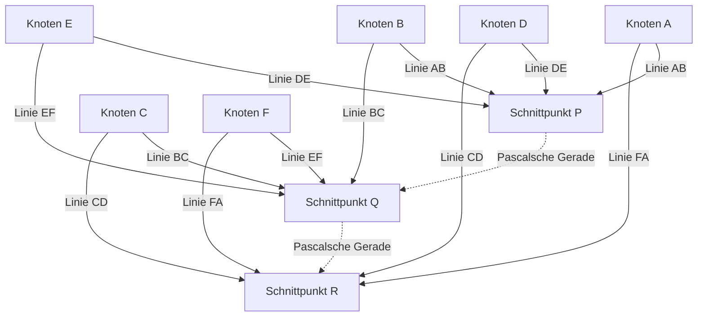

## 1. Einleitung: Das Genie, das in nur 39 Lebensjahren die Welt veränderte

„Der Mensch ist nur ein Schilfrohr, das schwächste der Natur; aber er ist ein denkendes Schilfrohr.“
[Blaise Pascal](https://kenji.blog/de/p/pascal/) (19. Juni 1623 - 19. August 1662), der dieses berühmte Zitat hinterließ, ist ein Gigant des Intellekts, der das Frankreich des 17. Jahrhunderts repräsentiert. Als Mathematiker, Physiker, Philosoph und christlicher Theologe hinterließ er monumentale Errungenschaften, die sich in verschiedenen Bereichen tief in die Menschheitsgeschichte eingeprägt haben.

Sein Leben war ein ständiger Kampf gegen Krankheiten, und er verstarb im frühen Alter von 39 Jahren. Dennoch legte er in diesem kurzen Leben die Grundlagen der projektiven Geometrie, erfand die erste praktische mechanische Rechenmaschine der Welt, war Pionier auf dem neuen mathematischen Gebiet der Wahrscheinlichkeitstheorie und etablierte grundlegende Prinzipien der Physik in Bezug auf Strömungsmechanik und Luftdruck. Dieser Artikel beschreibt das Leben dieses früh verstorbenen Genies, wie er zu diesen bahnbrechenden Entdeckungen gelangte und welch tiefgreifenden Einfluss er auf nachfolgende Generationen hatte.

## 2. Geburt eines Wunderkindes und ein einzigartiges Bildungsumfeld (1623 - 1639)

### 2.1. Geburt in der Auvergne und der Tod seiner Mutter
[Blaise Pascal](https://kenji.blog/de/p/pascal/) wurde 1623 in Clermont-Ferrand, Auvergne, im südlichen Zentrum Frankreichs geboren. Sein Vater, Étienne Pascal, war eine prominente Persönlichkeit, die als Präsident des örtlichen Steuergerichtshofs fungierte und zudem ein hervorragender Mathematiker war. Die Familie Pascal befand sich in einem höchst privilegierten intellektuellen Umfeld, doch als Blaise erst drei Jahre alt war, verstarb seine Mutter Antoinette. Sein Vater Étienne beschloss, nicht wieder zu heiraten, und widmete sich ganz der Ausbildung seiner drei Kinder: Blaise, seiner älteren Schwester Gilberte und seiner jüngeren Schwester Jacqueline.

### 2.2. Umzug nach Paris und Étiennes Bildungspolitik
Um seinen Kindern die bestmögliche Ausbildung zu bieten, zog Étienne 1631 mit der Familie nach Paris. Unzufrieden mit der damaligen Schulbildung, entschied sich Étienne, selbst Privatlehrer für seine Kinder zu werden. Seine Bildungspolitik war sehr eigenwillig: „Lehre keine Mathematik, die ein allzu abstraktes Fach ist, bevor die Vernunft des Kindes ausreichend entwickelt ist.“ Er räumte Sprachen und Geschichte Vorrang ein und verbannte sämtliche Mathematikbücher aus dem Haus.

Dieses „Verbot“ regte die Neugier des jungen Blaise jedoch paradoxerweise intensiv an. Im Alter von 12 Jahren begann Blaise, die Geometrie während seiner Spielzeit auf eigene Faust zu erkunden. Indem er mit Kohle Figuren auf den Boden zeichnete, bewies er unabhängig die 32. Proposition in [Euklid](https://kenji.blog/de/p/euclid/)s *Elementen*: „Die Summe der Innenwinkel eines Dreiecks ist gleich zwei rechten Winkeln (180 Grad).“ Als sein Vater diesen überwältigenden Beweis an Talent miterlebte, änderte er seine Politik, erlaubte ihm, Mathematik zu studieren, und begann, ihn zu den Versammlungen der größten Intellektuellen Europas mitzunehmen, die von Pater Mersenne (dem Vorläufer der französischen Akademie der Wissenschaften) ausgerichtet wurden.

## 3. Innovative Errungenschaften in der Mathematik

Pascals mathematisches Talent erblühte schon früh in seinen Teenagerjahren. Seine Forschungen umfassten ein breites Spektrum an Bereichen, von der reinen bis zur angewandten Mathematik.

### 3.1. Pionier der projektiven Geometrie: Der Satz von Pascal (Mystisches Hexagramm)

Im Jahr 1639 begegnete der 16-jährige Pascal in der Mersenne-Akademie den Werken Girard Desargues' zur projektiven Geometrie. Pascal verstand Desargues' Ideen zutiefst, entdeckte einen bahnbrechenden Lehrsatz über Kegelschnitte und veröffentlichte ihn auf einem einzigen Blatt Papier (Essay). Dies ist heute als **Satz von Pascal** bekannt.

Der Satz von Pascal gilt für jedes Hexagon (Sechseck), das einem Kegelschnitt (Ellipse, Parabel, Hyperbel und Kreis) eingeschrieben ist.

> Satz: Wenn ein Hexagon einem Kegelschnitt eingeschrieben ist, liegen die drei Schnittpunkte der gegenüberliegenden Seiten auf einer einzigen geraden Linie (Pascalsche Gerade).

Definition der Schnittpunkte mithilfe mathematischer Formeln:

$$
\text{Schnittpunkt } P = AB \cap DE, \quad Q = BC \cap EF, \quad R = CD \cap FA \implies P, Q, R \text{ sind kollinear}
$$

Die schematische Darstellung dieses Satzes ergibt folgendes Diagramm:

Diese Entdeckung sandte eine massive Schockwelle durch die damalige mathematische Gemeinschaft. Es gibt eine Anekdote, dass selbst der große Mathematiker [René Descartes](https://kenji.blog/de/p/descartes/) sich weigerte zu glauben, dass ein 16-jähriger Junge einen derart fortgeschrittenen Beweis erbracht hatte, und vermutete, dass er „vom Vater geschrieben worden sein müsse“. Pascal leitete über 400 Korollare aus diesem Satz ab und brachte die Geometrie seiner Zeit maßgeblich voran.

### 3.2. Die erste mechanische Rechenmaschine der Welt: Die „Pascaline“

Im Jahr 1639 wurde sein Vater Étienne zum Steuerkommissar in Rouen ernannt, und die Familie zog dorthin um. Als Pascal sah, wie sein Vater bis spät in die Nacht von immensen Steuerberechnungen überfordert war, machte er sich daran, eine Maschine zu entwickeln, um Berechnungen zu automatisieren und die Last seines Vaters zu erleichtern.

1642, nach viel Versuch und Irrtum, stellte der 19-jährige Pascal eine mechanische Rechenmaschine mit Zahnrädern fertig, die „Pascaline“ genannt wurde. Dieses Gerät führte bei der Drehung voreingestellter Zahnräder automatisch Additionen und Subtraktionen durch, und es war vor allem eine der ersten Rechenmaschinen der Welt, die einen praktischen „Übertragsmechanismus“ implementierte. Dutzende Pascalinen wurden in der Folgezeit hergestellt, und er erhielt sogar ein Patent vom französischen Königshaus. Pascal gilt als einer der frühesten Pioniere in der Geschichte des Software-Engineerings und des Hardware-Designs.

### 3.3. Das Pascalsche Dreieck und der binomische Lehrsatz

Das mathematische Konzept, für das der Name Pascal am weitesten bekannt ist, ist das **Pascalsche Dreieck**. Dies ist eine geometrische Anordnung der Koeffizienten einer Binomialentwicklung in Dreiecksform. Obwohl es vor Pascal Mathematikern wie Jia Xian und Yang Hui in China sowie Omar Khayyam in Persien bekannt war, studierte Pascal die Eigenschaften dieses Dreiecks in seiner *Abhandlung über das arithmetische Dreieck* von 1653 systematisch und gründlich.

Das Pascalsche Dreieck ist so aufgebaut, dass die Zahl in der $n$-ten Zeile von oben und an der $k$-ten Position von links der Binomialkoeffizient $\binom{n}{k}$ ist. Der binomische Lehrsatz wird wie folgt ausgedrückt:

$$
(x + y)^n = \sum_{k=0}^{n} \binom{n}{k} x^{n-k} y^k = \sum_{k=0}^{n} \frac{n!}{k!(n-k)!} x^{n-k} y^k
$$

Pascal bewies viele Sätze zur Anwendung dieses Dreiecks auf die Kombinatorik und Wahrscheinlichkeitsberechnungen, beginnend mit der grundlegenden Eigenschaft, dass jedes Element im Dreieck die Summe der beiden direkt darüber liegenden Elemente ist (Pascalsche Regel: $\binom{n}{k} = \binom{n-1}{k-1} + \binom{n-1}{k}$). In dieser Forschung formulierte er auch klar das Prinzip der vollständigen Induktion und verfeinerte damit die Methoden der deduktiven Mathematik weiter.

### 3.4. Begründung der Wahrscheinlichkeitstheorie: Briefwechsel mit Fermat

Eine von Pascals entscheidendsten Rollen in der Geschichte der Mathematik war die Begründung der Wahrscheinlichkeitstheorie. Es begann 1654, als Antoine Gombaud, Chevalier de Méré, ein Adliger mit Vorliebe für Glücksspiele, Pascal mit dem „Teilungsproblem“ konfrontierte.

**Das Teilungsproblem**:
> Zwei gleich starke Spieler spielen ein Spiel, bei dem der Erste, der eine bestimmte Anzahl von Siegen (z. B. 3 Siege) erreicht, den gesamten Preistopf gewinnt. Das Spiel muss jedoch abgebrochen werden, wenn ein Spieler 2 Siege und der andere 1 Sieg hat. Wie sollte der Preistopf zu diesem Zeitpunkt am fairsten aufgeteilt werden?

Um dieses schwierige Problem anzugehen, schrieb Pascal Briefe an [Pierre de Fermat](https://kenji.blog/de/p/fermat/), ein weiteres in Toulouse lebendes Mathematikgenie. Die beiden gelangten durch völlig unterschiedliche Ansätze zur Lösung.

- **Fermats Ansatz**: Eine kombinatorische Methode, die alle möglichen zukünftigen Szenarien (Baumdiagramm) auflistet und die Wahrscheinlichkeit des Eintretens jedes einzelnen berechnet, um das Verteilungsverhältnis zu bestimmen.
- **Pascals Ansatz**: Eine rekursive Methode, die den „Erwartungswert“ (Expected value) des Spielens des nächsten einzelnen Spiels ausgehend vom aktuellen Zustand berechnet und ihn rekursiv löst.

In Pascals Berechnung, wenn der erwartete Gewinn aus dem Gewinnen oder Verlieren des nächsten Spiels $E_{\text{gewinnen}}$ bzw. $E_{\text{verlieren}}$ ist, wird der aktuelle Erwartungswert $E$ wie folgt ausgedrückt:

$$
E = \frac{1}{2} E_{\text{gewinnen}} + \frac{1}{2} E_{\text{verlieren}}
$$

Die Schlussfolgerungen, zu denen die beiden durch ihren Briefwechsel gelangten, stimmten perfekt überein, und diese ausgetauschten Briefe markierten den Beginn der modernen Wahrscheinlichkeitstheorie. Sie bewiesen, dass Zufall und Ungewissheit, die zuvor göttlichem Willen oder Glück zugeschrieben wurden, durch rigorose mathematische Berechnungen quantifiziert werden konnten.

## 4. Beiträge zur Physik: Beweis des Vakuums und Strömungsmechanik

Pascals Forschergeist beschränkte sich nicht auf abstrakte Mathematik; er richtete sich auch auf die Aufklärung physikalischer Phänomene in der Natur.

### 4.1. Beweis für die Existenz des Vakuums (Das Puy-de-Dôme-Experiment)

In der damaligen physikalischen Gemeinschaft wurde die vom antiken Griechen Aristoteles aufgestellte Theorie, dass „die Natur das Vakuum verabscheut (Horror vacui)“, als absolute Wahrheit geglaubt, und es galt als unmöglich, dass ein „Vakuum“ mit Nichts im Raum existieren könne.

Im Jahr 1643 führte jedoch der Italiener Evangelista Torricelli ein Experiment mit einem mit Quecksilber gefüllten Glasrohr durch und entdeckte, dass sich am oberen Ende des Rohres ein Vakuum (Torricellisches Vakuum) bildete. Als Pascal davon erfuhr, wiederholte er Torricellis Experiment mit großer Genauigkeit. Er stellte die Hypothese auf, dass, wenn der Raum, der sich oben im Rohr bildete, wirklich ein Vakuum war, das, was ihn stützte, das Gewicht der Atmosphäre (Luftdruck) sein müsse.

1648 bat Pascal seinen Schwager, Florin Périer, ein groß angelegtes Experiment durchzuführen, bei dem gemessen wurde, wie sich die Höhe eines Quecksilberbarometers zwischen dem Gipfel und dem Fuß des Berges Puy de Dôme (Höhe 1465 m) in der Region Auvergne veränderte. Das Ergebnis war genau so, wie Pascal es vorhergesagt hatte: Die Quecksilbersäule war auf dem Gipfel niedriger als am Fuß. Dies liegt daran, dass in höheren Lagen weniger Atmosphäre darüber lastet, was zu einem geringeren Luftdruck führt.

Dieses dramatische experimentelle Ergebnis bewies endgültig die Existenz des Luftdrucks und erschütterte gleichzeitig das aristotelische Dogma, dass „die Natur das Vakuum verabscheut“. Die Einheit des Luftdrucks, das „Hektopascal (hPa)“, wurde zu Ehren seiner großen Errungenschaft benannt.

### 4.2. Das Pascalsche Prinzip

Als er seine Forschungen zum Flüssigkeitsdruck vorantrieb, entdeckte er ein grundlegendes Gesetz bezüglich eingeschlossener Flüssigkeiten. Dies ist das **Pascalsche Prinzip**.

> Prinzip: Ein Druck, der auf eine eingeschlossene statische Flüssigkeit ausgeübt wird, überträgt sich gleichmäßig und unvermindert auf alle Teile der Flüssigkeit und auf die Wände des umgebenden Gefäßes, unabhängig von der Richtung.

Mathematisch ausgedrückt: Wenn die Flächen zweier Kolben $A_1$ und $A_2$ sind und die ausgeübten Kräfte $F_1$ und $F_2$ sind, da der Druck $P$ konstant ist:

$$
P = \frac{F_1}{A_1} = \frac{F_2}{A_2} \implies F_2 = F_1 \frac{A_2}{A_1}
$$

Dieses Prinzip, das es ermöglicht, auf einen Kolben mit großer Querschnittsfläche eine gewaltige Kraft zu erzeugen, indem man eine kleine Kraft auf einen Kolben mit kleiner Querschnittsfläche ausübt, ist die grundlegende Technologie für alle modernen Strömungsmaschinen, wie z. B. hydraulische Wagenheber und hydraulische Automobilbremsen.

## 5. Hingabe an Philosophie und religiöses Denken, und 'Pensées'

Während Pascal tief in das Streben nach wissenschaftlicher Wahrheit versunken war, hatte er immer einen inneren Durst nach Glauben. Die zweite Hälfte seines Lebens war einer tiefen philosophischen und theologischen Kontemplation gewidmet, fernab der Wissenschaft.

### 5.1. Die Nacht des Feuers und der Jansenismus

In der Nacht des 23. November 1654 war der 31-jährige Pascal in einen schweren Unfall verwickelt, als die Pferde seiner Kutsche auf einer Brücke über die Seine durchgingen und ihn fast in den Tod stürzten. Dem Tod wie durch ein Wunder entronnen, erlebte er in jener Nacht eine mystische Begegnung (später das „Mémorial“ oder die „Nacht des Feuers“ genannt), bei der er die überwältigende Präsenz Gottes spürte. Er schrieb seine tiefe Ergriffenheit auf ein Stück Pergament und nähte es in das Futter seines Mantels ein, um es für den Rest seines Lebens immer bei sich zu tragen.

Nach dieser Erfahrung zog er sich aus der säkularen wissenschaftlichen Forschung zurück und entwickelte tiefe Verbindungen zu den Einsiedlern der Abtei Port-Royal, dem Zentrum des „Jansenismus“, einer strengen Reformbewegung innerhalb der katholischen Kirche.

### 5.2. Die Mathematik der Zykloide (Eine außergewöhnliche Spätstudie)

Obwohl er sich der Religion widmete, kehrte Pascal nur ein einziges Mal zur mathematischen Forschung zurück. 1658 begann Pascal, der an starken Zahnschmerzen litt, über mathematische Probleme im Zusammenhang mit der „Zykloide (der von einem Punkt auf dem Umfang eines Kreises gezeichneten Bahn, während dieser auf einer geraden Linie abrollt)“ nachzudenken, um sich abzulenken. Mysteriöserweise verschwanden die Schmerzen, was Pascal als göttliche Offenbarung auffasste. In nur acht Tagen entdeckte er innovative Methoden, um den Flächeninhalt, den Schwerpunkt und das Volumen von Rotationskörpern der Zykloide zu ermitteln.

Er kündigte unter dem Pseudonym Amos Dettonville ein Preisausschreiben zu diesem Problem an und veröffentlichte selbst perfekte Lösungen. Die von ihm hierbei angewandte „Methode der Indivisiblen“ diente später als wesentliche Brücke zur Entdeckung der Infinitesimalrechnung durch [Isaac Newton](https://kenji.blog/de/p/newton/) und Gottfried Wilhelm Leibniz.

### 5.3. Die Pascalsche Wette und die Entscheidungstheorie

Pascal glaubte, dass es unmöglich sei, die Existenz Gottes durch Logik oder Vernunft vollständig zu beweisen. Dennoch argumentierte er für die Rationalität des Glaubens mit einem Ansatz, der charakteristisch für den Begründer der Wahrscheinlichkeitstheorie war. Dies ist die **Pascalsche Wette**.

Er analysierte, ob es für Menschen, die sich nicht sicher sind, ob Gott existiert, einen höheren Erwartungswert hat, „an Gott zu glauben“ oder „nicht an Gott zu glauben“.

- Wenn Gott existiert und Sie an Ihn glauben: Sie erlangen unendliches Glück (Himmel).
- Wenn Gott existiert und Sie nicht an Ihn glauben: Sie erhalten unendliche Strafe (Hölle).
- Wenn Gott nicht existiert und Sie an Ihn glauben: Sie verlieren nur einige begrenzte weltliche Freuden.
- Wenn Gott nicht existiert und Sie nicht an Ihn glauben: Sie gewinnen begrenzte weltliche Freuden.

Berechnet man dies mit Erwartungswerten, so wird der Erwartungswert des Glaubens an Gott, egal wie gering die Wahrscheinlichkeit der Existenz Gottes auch sein mag (solange sie nicht null ist), „unendlich“. Daher argumentierte er, dass ein rationaler Mensch darauf wetten (glauben) sollte, dass Gott existiert. Dieses Argument wird als Vorläufer der modernen Spieltheorie und Entscheidungstheorie hoch geschätzt.

### 5.4. Die 'Pensées' und das „denkende Schilfrohr“

In seinen späten Jahren begann Pascal, eine groß angelegte 'Apologie der christlichen Religion' zu verfassen, um Atheisten und Skeptiker zum christlichen Glauben zu führen. Seine von Kindheit an schwache Konstitution und Überarbeitung forderten jedoch ihren Tribut, und seine Gesundheit verschlechterte sich rapide. Unter starken Kopf- und Magenschmerzen litt er, während er nacheinander fragmentarische Gedanken auf Zetteln notierte, wie sie ihm in den Sinn kamen.

Am 19. August 1662 verstarb Pascal im Alter von 39 Jahren. Die rund 1.000 fragmentarischen Notizen, die er hinterließ, wurden nach seinem Tod von seinen Freunden aus Port-Royal zusammengestellt und als *Pensées* (Gedanken) veröffentlicht.

Unter den zahlreichen in den *Pensées* gesammelten Fragmenten ist das folgende Zitat besonders berühmt:

> Der Mensch ist nur ein Schilfrohr, das schwächste der Natur; aber er ist ein denkendes Schilfrohr. Das ganze Universum muss sich nicht wappnen, um ihn zu zermalmen. Ein Dampf, ein Wassertropfen genügen, um ihn zu töten. Aber selbst wenn das Universum ihn zermalmen würde, wäre der Mensch immer noch edler als das, was ihn tötet, weil er weiß, dass er stirbt, und er kennt den Vorteil, den das Universum über ihn hat; das Universum weiß nichts davon.
>
> All unsere Würde besteht also im Denken. (Aus den *Pensées*, Fragment 347)

Pascal stellte sich der Tatsache, dass der menschliche Körper im Vergleich zur überwältigenden Weite und Macht des Makrokosmos so zerbrechlich und flüchtig wie ein einzelnes Schilfrohr ist. Gleichzeitig erklärte er jedoch stolz, dass die absolute Würde und Größe der Menschheit genau in der Fähigkeit liegt, zu „denken“ und sich der eigenen Begrenzungen und des eigenen Elends bewusst zu sein.

## 6. Fazit: Pascals Vermächtnis lebt heute weiter

Die 39 Jahre, die [Blaise Pascal](https://kenji.blog/de/p/pascal/) durchlebte, waren insgesamt viel zu kurz und geprägt von den Qualen seiner Krankheit. Seine geschärfte Intuition und sein tiefgründiges Denken übersprangen jedoch mühelos die Grenzen von Mathematik, Physik, Ingenieurwesen und Philosophie und erweiterten den Horizont des menschlichen Wissens enorm.

Die Samen, die er säte, verleihen den Luftdruckdaten (Hektopascal), die wir täglich in Wettervorhersagen verwenden, Automobilbremsen (Pascalsches Prinzip), der Risikobewertung bei Versicherungen und Finanzen (Wahrscheinlichkeitstheorie) und sogar den Grundlagen der Computerarchitektur selbst Leben. Die 1970 von Niklaus Wirth entwickelte Programmiersprache „Pascal“ wurde ihm zu Ehren benannt, dem Schöpfer der ersten Rechenmaschine der Welt.

„Der Mensch ist ein denkendes Schilfrohr.“ In unserer modernen Ära, in der sich die KI (Künstliche Intelligenz) entwickelt und der Wert des menschlichen „Denkens“ erneut in Frage gestellt wird, sprechen diese Worte mit noch tieferer Resonanz zu uns. Egal, wie sehr die Technologie voranschreitet, Pascals Leben und Philosophie fragen uns weiterhin unaufhörlich, wo das Wesen der Menschheit und ihre Würde wahrhaftig liegen.
