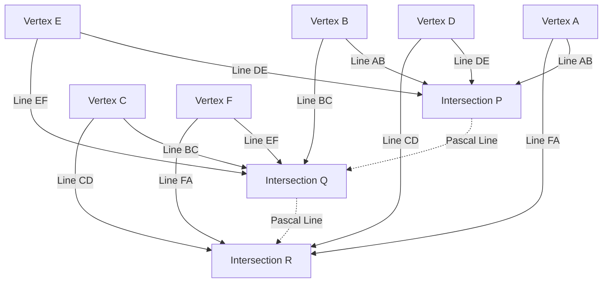

## 1. Introduction: The Genius Who Changed the World in Just 39 Years of Life

"Man is but a reed, the most feeble thing in nature; but he is a thinking reed."
[Blaise Pascal](https://kenji.blog/en/p/pascal/) (June 19, 1623 - August 19, 1662), who left behind this famous quote, is a giant of intellect representing 17th-century France. As a mathematician, physicist, philosopher, and Christian theologian, he left behind monumental achievements deeply engraved in human history across various fields.

His life was a constant battle with illness, and he passed away at the young age of 39. However, during this short life, he laid the foundations of projective geometry, invented the world's first practical mechanical calculator, pioneered the new mathematical field of probability theory, and established fundamental principles of physics regarding fluid mechanics and atmospheric pressure. This article details the life of this early-departed genius, how he arrived at these groundbreaking discoveries, and the profound impact he had on subsequent generations.

## 2. Birth of a Prodigy and a Unique Educational Environment (1623 - 1639)

### 2.1. Birth in Auvergne and the Death of His Mother
[Blaise Pascal](https://kenji.blog/en/p/pascal/) was born in 1623 in Clermont-Ferrand, Auvergne, in central-southern France. His father, Étienne Pascal, was a prominent figure serving as the president of the local Court of Aids (tax court) and was also an excellent mathematician. The Pascal family was in a highly privileged intellectual environment, but when Blaise was only three years old, his mother, Antoinette, passed away. His father Étienne decided not to remarry and dedicated himself entirely to the education of his three children: Blaise, his older sister Gilberte, and his younger sister Jacqueline.

### 2.2. Move to Paris and Étienne's Educational Policy
In 1631, to provide his children with the best possible education, Étienne moved the family to Paris. Dissatisfied with the school education of the time, Étienne chose to become a private tutor to his children himself. His educational policy was very unique: "Do not teach mathematics, which is an overly abstract subject, until the child's reason is sufficiently developed." He prioritized languages and history, and eliminated all mathematical books from the house.

However, this "prohibition" paradoxically stimulated young Blaise's curiosity intensely. At the age of 12, Blaise began exploring geometry on his own during his playtime. Drawing figures on the floor with charcoal, he independently proved the 32nd proposition in [Euclid](https://kenji.blog/en/p/euclid/)'s *Elements*: "The sum of the interior angles of a triangle is equal to two right angles (180 degrees)." Witnessing this overwhelming glimpse of talent, his father changed his policy, allowed him to study mathematics, and began taking him to the gatherings of Europe's greatest intellectuals hosted by Father Mersenne (the predecessor of the French Academy of Sciences).

## 3. Innovative Achievements in Mathematics

Pascal's mathematical talent blossomed early in his teenage years. His research spanned a wide range of areas, from pure mathematics to applied mathematics.

### 3.1. Pioneering Projective Geometry: Pascal's Theorem (Mystic Hexagram)

In 1639, 16-year-old Pascal encountered the projective geometry works of Girard Desargues at the Mersenne Academy. Deeply understanding Desargues' ideas, Pascal discovered a groundbreaking theorem concerning conic sections and published it on a single sheet of paper (essay). This is known today as **Pascal's theorem**.

Pascal's theorem holds for any hexagon inscribed in a conic section (ellipse, parabola, hyperbola, and circle).

> Theorem: If a hexagon is inscribed in a conic section, the three intersection points of the opposite sides lie on a single straight line (Pascal line).

Defining the intersection points using mathematical formulas:

$$
\text{Intersection } P = AB \cap DE, \quad Q = BC \cap EF, \quad R = CD \cap FA \implies P, Q, R \text{ are collinear}
$$

Schematizing this theorem yields the following diagram:

This discovery sent a massive shockwave through the mathematical community of the time. There is an anecdote that even the great mathematician [René Descartes](https://kenji.blog/en/p/descartes/) refused to believe that a 16-year-old boy had produced such an advanced proof, suspecting that "it must have been written by the father." Pascal derived over 400 corollaries from this theorem, significantly advancing the geometry of his time.

### 3.2. The World's First Mechanical Calculator: "Pascaline"

In 1639, his father Étienne was appointed as a tax commissioner in Rouen, and the family relocated there. Seeing his father overwhelmed by immense tax calculations late into the night, Pascal set out to develop a machine to automate calculations and ease his father's burden.

In 1642, after much trial and error, 19-year-old Pascal completed a mechanical calculator using gears, called the "Pascaline." This device automatically performed addition and subtraction as pre-set gears rotated, and notably, it was one of the world's first calculators to implement a practical "carry mechanism." Dozens of Pascalines were subsequently manufactured, and he even obtained a patent from the French royalty. Pascal is considered one of the earliest pioneers in the history of software engineering and hardware design.

### 3.3. Pascal's Triangle and the Binomial Theorem

The mathematical concept for which Pascal's name is most widely known is **Pascal's triangle**. This is a geometric arrangement of the coefficients in a binomial expansion into a triangular shape. Although it was known before Pascal by mathematicians such as Jia Xian and Yang Hui in China, and Omar Khayyam in Persia, Pascal systematically and thoroughly studied the properties of this triangle in his 1653 *Treatise on the Arithmetical Triangle*.

Pascal's triangle is constructed such that the number in the $n$-th row from the top and $k$-th position from the left is the binomial coefficient $\binom{n}{k}$. The binomial theorem is expressed as follows:

$$
(x + y)^n = \sum_{k=0}^{n} \binom{n}{k} x^{n-k} y^k = \sum_{k=0}^{n} \frac{n!}{k!(n-k)!} x^{n-k} y^k
$$

Pascal proved many theorems for applying this triangle to combinatorics and probability calculations, starting with the fundamental property that each element in the triangle is the sum of the two elements directly above it (Pascal's rule: $\binom{n}{k} = \binom{n-1}{k-1} + \binom{n-1}{k}$). In this research, he also clearly formulated the principle of mathematical induction, further refining the methods of deductive mathematics.

### 3.4. Foundation of Probability Theory: Correspondence with Fermat

One of Pascal's most crucial roles in the history of mathematics was the founding of probability theory. It began in 1654 when Antoine Gombaud, Chevalier de Méré, a nobleman fond of gambling, presented Pascal with the "Problem of points."

**The Problem of Points**:
> Two players of equal skill are playing a game where the first to reach a certain number of wins (e.g., 3 wins) takes the entire prize pot. However, the game is forced to stop when one player has 2 wins and the other has 1 win. How should the prize pot be distributed most fairly at this point?

To tackle this difficult problem, Pascal wrote letters to [Pierre de Fermat](https://kenji.blog/en/p/fermat/), another genius mathematician living in Toulouse. The two arrived at the solution through entirely different approaches.

- **Fermat's Approach**: A combinatorial method that lists all possible future scenarios (tree diagram) and calculates the probability of each occurring to determine the distribution ratio.
- **Pascal's Approach**: A recursive method that calculates the "Expected value" of playing the next single game from the current state and solves it recursively.

In Pascal's calculation, if the expected earnings from winning or losing the next game are $E_{\text{win}}$ and $E_{\text{lose}}$ respectively, the current expected value $E$ is expressed as follows:

$$
E = \frac{1}{2} E_{\text{win}} + \frac{1}{2} E_{\text{lose}}
$$

The conclusions reached by the two through their correspondence matched perfectly, and these exchanged letters marked the dawn of modern probability theory. They proved that chance and uncertainty, previously attributed to divine will or luck, could be quantified by rigorous mathematical calculation.

## 4. Contributions to Physics: Proof of Vacuum and Fluid Mechanics

Pascal's inquiring mind was not limited to abstract mathematics; it was also directed towards elucidating physical phenomena in the natural world.

### 4.1. Proof of the Existence of Vacuum (The Puy de Dôme Experiment)

In the physics community of the time, the theory proposed by ancient Greek Aristotle that "nature abhors a vacuum (Horror vacui)" was believed as an absolute truth, and it was considered impossible for a "vacuum" with nothing in space to exist.

However, in 1643, Italian Evangelista Torricelli conducted an experiment using a glass tube filled with mercury and discovered that a vacuum (Torricellian vacuum) formed at the top of the tube. Upon learning of this, Pascal rigorously replicated Torricelli's experiment. He hypothesized that if the space formed at the top of the tube was truly a vacuum, then what supported it must be the weight of the atmosphere (atmospheric pressure).

In 1648, Pascal asked his brother-in-law, Florin Périer, to conduct a large-scale experiment measuring how the height of a mercury barometer changed between the summit and the base of the Puy de Dôme mountain (elevation 1465m) in the Auvergne region. The result, exactly as Pascal predicted, was that the mercury column was lower at the summit than at the base. This is because at higher altitudes, there is less atmosphere resting above, resulting in lower atmospheric pressure.

This dramatic experimental result definitively proved the existence of atmospheric pressure and simultaneously shattered the Aristotelian dogma that "nature abhors a vacuum." The unit of atmospheric pressure, "hectopascal (hPa)," was named in honor of his great achievement.

### 4.2. Pascal's Principle

As he advanced his research on fluid pressure, he discovered a fundamental law regarding confined fluids. This is **Pascal's principle**.

> Principle: Pressure applied to a confined static fluid is transmitted uniformly and undiminished to all parts of the fluid and the walls of the containing vessel, regardless of direction.

Expressed mathematically, if the areas of two pistons are $A_1$ and $A_2$, and the applied forces are $F_1$ and $F_2$, since the pressure $P$ is constant:

$$
P = \frac{F_1}{A_1} = \frac{F_2}{A_2} \implies F_2 = F_1 \frac{A_2}{A_1}
$$

This principle, which allows a massive force to be generated on a piston with a large cross-sectional area by applying a small force to a piston with a small cross-sectional area, is the foundational technology for all modern fluid machinery, such as hydraulic jacks and automobile hydraulic brakes.

## 5. Devotion to Philosophy and Religious Thought, and 'Pensées'

While Pascal was deeply immersed in the pursuit of scientific truth, he always had an inner thirst for faith. The latter half of his life was dedicated to profound philosophical and theological contemplation, away from science.

### 5.1. The Night of Fire and Jansenism

On the night of November 23, 1654, 31-year-old Pascal was involved in a severe accident when the horses of his carriage bolted on a bridge over the Seine, nearly plunging him to his death. Miraculously escaping death, that night he experienced a mystical encounter (later called the "Night of Fire") where he felt the overwhelming presence of God. He wrote down his profound emotion on a piece of parchment and sewed it into the lining of his coat, carrying it with him always for the rest of his life.

Following this experience, he withdrew from secular scientific research and developed deep ties with the hermits of the Port-Royal abbey, the center of "Jansenism," a rigorous reform movement within the Catholic Church.

### 5.2. The Mathematics of the Cycloid (An Exceptional Late-Life Study)

Although devoted to religion, Pascal returned to mathematical research just once. In 1658, suffering from severe toothaches, Pascal began thinking about mathematical problems concerning the "Cycloid (the trajectory drawn by a point on the circumference of a circle as it rolls along a straight line)" to distract himself. Mysteriously, the pain vanished, which Pascal took as a divine revelation. Within just eight days, he discovered innovative methods to find the area, center of gravity, and volume of solids of revolution of the cycloid.

He announced a prize competition regarding this problem under the pseudonym Amos Dettonville, and published perfect solutions himself. The "method of indivisibles" he employed here served as an essential bridge to the discovery of calculus by [Isaac Newton](https://kenji.blog/en/p/newton/) and Gottfried Wilhelm Leibniz later on.

### 5.3. Pascal's Wager and Decision Theory

Pascal believed that it was impossible to completely prove the existence of God through logic or reason. However, he argued for the rationality of faith with an approach characteristic of the founder of probability theory. This is **Pascal's Wager**.

He analyzed whether it is of higher expected value to "believe in God" or "not believe in God" for humans who are uncertain if God exists.

- If God exists and you believe in Him: You gain infinite happiness (Heaven).
- If God exists and you do not believe in Him: You receive infinite punishment (Hell).
- If God does not exist and you believe in Him: You only lose a few limited worldly pleasures.
- If God does not exist and you do not believe in Him: You gain limited worldly pleasures.

Calculating this with expected values, no matter how low the probability of God's existence might be (as long as it is not zero), the expected value of believing in God becomes "infinity." Therefore, he argued that a rational person should wager on (believe in) the side that God exists. This argument is highly regarded as a precursor to modern game theory and decision theory.

### 5.4. 'Pensées' and the "Thinking Reed"

In his later years, Pascal began writing a grand 'Apology for the Christian Religion' to guide atheists and skeptics to Christian faith. However, his constitution, frail since childhood, and overwork took their toll, and his health rapidly deteriorated. Enduring severe headaches and stomach pains, he sequentially jotted down fragmented thoughts on pieces of paper as they came to mind.

On August 19, 1662, Pascal passed away at the age of 39. The approximately 1,000 fragmented notes he left behind were compiled and published by his friends at Port-Royal after his death as *Pensées* (meaning "thoughts").

Among the numerous fragments collected in *Pensées*, the following quote is particularly famous:

> Man is but a reed, the most feeble thing in nature; but he is a thinking reed. The entire universe need not arm itself to crush him. A vapor, a drop of water suffices to kill him. But, if the universe were to crush him, man would still be more noble than that which killed him, because he knows that he dies and the advantage which the universe has over him; the universe knows nothing of this.
>
> All our dignity consists, then, in thought. (From *Pensées*, Fragment 347)

Pascal faced the fact that compared to the overwhelming vastness and power of the macrocosm, the human body is as fragile and fleeting as a single reed. However, at the same time, he proudly declared that humanity's absolute dignity and greatness lie precisely in the ability to "think" and be conscious of one's own limitations and misery.

## 6. Conclusion: Pascal's Legacy Living on Today

The 39 years that [Blaise Pascal](https://kenji.blog/en/p/pascal/) raced through were altogether too short and filled with the agony of illness. However, his sharpened intuition and profound thinking effortlessly leaped over the boundaries of mathematics, physics, engineering, and philosophy, vastly expanding the horizons of human knowledge.

The seeds he sowed breathe life into the atmospheric pressure data (hectopascal) we use daily in weather forecasts, automobile brakes (Pascal's principle), risk assessment in insurance and finance (probability theory), and even the very foundations of computer architecture. The programming language "Pascal," developed by Niklaus Wirth in 1970, was named in honor of him, the creator of the world's first calculator.

"Man is a thinking reed." In our modern era, where AI (Artificial Intelligence) is developing and the value of human "thought" is being questioned anew, these words speak to us with an even deeper resonance. No matter how much technology advances, Pascal's life and philosophy continue to constantly ask us where the essence of humanity and its dignity truly lie.
