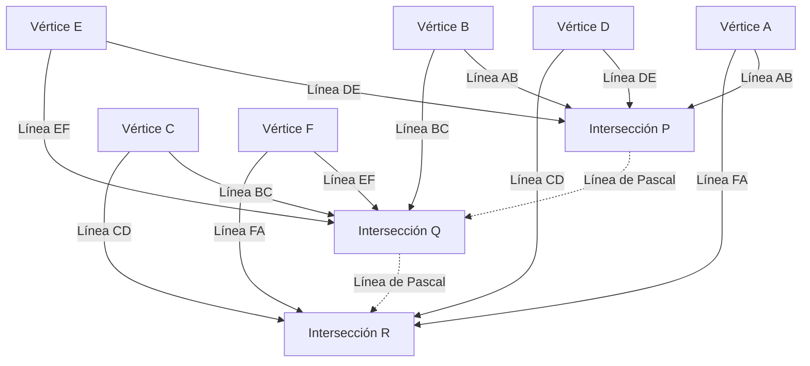

## 1. Introducción: El genio que cambió el mundo en solo 39 años de vida

"El hombre no es más que una caña, la más débil de la naturaleza; pero es una caña pensante."
[Blaise Pascal](https://kenji.blog/es/p/pascal/) (19 de junio de 1623 - 19 de agosto de 1662), quien dejó esta famosa cita, es un gigante del intelecto que representa a la Francia del siglo XVII. Como matemático, físico, filósofo y teólogo cristiano, dejó logros monumentales profundamente grabados en la historia humana en varios campos.

Su vida fue una batalla constante contra la enfermedad, y falleció a la temprana edad de 39 años. Sin embargo, durante esta corta vida, sentó las bases de la geometría proyectiva, inventó la primera calculadora mecánica práctica del mundo, fue pionero en el nuevo campo matemático de la teoría de la probabilidad y estableció principios fundamentales de la física con respecto a la mecánica de fluidos y la presión atmosférica. Este artículo detalla la vida de este genio que partió pronto, cómo llegó a estos descubrimientos revolucionarios y el profundo impacto que tuvo en las generaciones posteriores.

## 2. Nacimiento de un prodigio y un entorno educativo único (1623 - 1639)

### 2.1. Nacimiento en Auvernia y la muerte de su madre
[Blaise Pascal](https://kenji.blog/es/p/pascal/) nació en 1623 en Clermont-Ferrand, Auvernia, en el centro-sur de Francia. Su padre, Étienne Pascal, era una figura destacada que se desempeñaba como presidente de la Corte de Ayudas (tribunal de impuestos) local y también era un excelente matemático. La familia [Pascal](https://kenji.blog/es/p/pascal/) se encontraba en un entorno intelectual muy privilegiado, pero cuando Blaise tenía solo tres años, su madre, Antoinette, falleció. Su padre Étienne decidió no volver a casarse y se dedicó por entero a la educación de sus tres hijos: Blaise, su hermana mayor Gilberte y su hermana menor Jacqueline.

### 2.2. Traslado a París y la política educativa de Étienne
En 1631, para brindar a sus hijos la mejor educación posible, Étienne mudó a la familia a París. Insatisfecho con la educación escolar de la época, Étienne decidió convertirse él mismo en tutor privado de sus hijos. Su política educativa era muy singular: "No enseñar matemáticas, que es una materia demasiado abstracta, hasta que la razón del niño esté suficientemente desarrollada". Dio prioridad a los idiomas y la historia, y eliminó todos los libros matemáticos de la casa.

Sin embargo, esta "prohibición", paradójicamente, estimuló intensamente la curiosidad del joven Blaise. A la edad de 12 años, Blaise comenzó a explorar la geometría por su cuenta durante su tiempo de juego. Dibujando figuras en el suelo con carbón, demostró de forma independiente la 32ª proposición de los *Elementos* de [Euclides](https://kenji.blog/p/euclid/): "La suma de los ángulos interiores de un triángulo es igual a dos ángulos rectos (180 grados)". Al presenciar este abrumador destello de talento, su padre cambió su política, le permitió estudiar matemáticas y comenzó a llevarlo a las reuniones de los intelectuales más grandes de Europa organizadas por el padre [Mersenne](https://kenji.blog/es/p/mersenne/) (la predecesora de la Academia de Ciencias de Francia).

## 3. Logros innovadores en matemáticas

El talento matemático de [Pascal](https://kenji.blog/es/p/pascal/) floreció temprano en su adolescencia. Su investigación abarcó una amplia gama de áreas, desde las matemáticas puras hasta las matemáticas aplicadas.

### 3.1. Pionero de la geometría proyectiva: El teorema de [Pascal](https://kenji.blog/es/p/pascal/) (Hexagrama místico)

En 1639, [Pascal](https://kenji.blog/es/p/pascal/), de 16 años, se encontró con las obras de geometría proyectiva de Girard Desargues en la Academia Mersenne. Entendiendo profundamente las ideas de Desargues, Pascal descubrió un teorema revolucionario sobre las secciones cónicas y lo publicó en una sola hoja de papel (ensayo). Esto se conoce hoy como el **teorema de [Pascal](https://kenji.blog/es/p/pascal/)**.

El teorema de [Pascal](https://kenji.blog/es/p/pascal/) se cumple para cualquier hexágono inscrito en una sección cónica (elipse, parábola, hipérbola y círculo).

> Teorema: Si un hexágono está inscrito en una sección cónica, los tres puntos de intersección de los lados opuestos se encuentran en una sola línea recta (línea de [Pascal](https://kenji.blog/es/p/pascal/)).

Definiendo los puntos de intersección usando fórmulas matemáticas:

$$
\text{Intersección } P = AB \cap DE, \quad Q = BC \cap EF, \quad R = CD \cap FA \implies P, Q, R \text{ son colineales}
$$

Esquematizando este teorema se obtiene el siguiente diagrama:

Este descubrimiento causó una enorme conmoción en la comunidad matemática de la época. Existe una anécdota de que incluso el gran matemático [René Descartes](https://kenji.blog/es/p/descartes/) se negó a creer que un joven de 16 años hubiera producido una prueba tan avanzada, sospechando que "debía haber sido escrita por el padre". [Pascal](https://kenji.blog/es/p/pascal/) derivó más de 400 corolarios de este teorema, haciendo avanzar significativamente la geometría de su tiempo.

### 3.2. La primera calculadora mecánica del mundo: La "[Pascal](https://kenji.blog/es/p/pascal/)ina"

En 1639, su padre Étienne fue nombrado comisionado de impuestos en Ruan, y la familia se trasladó allí. Al ver a su padre abrumado por los inmensos cálculos de impuestos a altas horas de la noche, [Pascal](https://kenji.blog/es/p/pascal/) se propuso desarrollar una máquina para automatizar los cálculos y aliviar la carga de su padre.

En 1642, tras muchas pruebas y errores, [Pascal](https://kenji.blog/es/p/pascal/), de 19 años, completó una calculadora mecánica que usaba engranajes, llamada "Pascalina". Este dispositivo realizaba automáticamente sumas y restas a medida que giraban los engranajes preestablecidos y, en particular, fue una de las primeras calculadoras del mundo en implementar un "mecanismo de acarreo" práctico. Posteriormente se fabricaron docenas de Pascalinas, e incluso obtuvo una patente de la realeza francesa. Se considera a [Pascal](https://kenji.blog/es/p/pascal/) uno de los primeros pioneros en la historia de la ingeniería de software y el diseño de hardware.

### 3.3. El triángulo de [Pascal](https://kenji.blog/es/p/pascal/) y el teorema del binomio

El concepto matemático por el que el nombre de [Pascal](https://kenji.blog/es/p/pascal/) es más conocido es el **triángulo de Pascal**. Se trata de una disposición geométrica de los coeficientes de una expansión binomial en forma triangular. Aunque ya era conocido antes de Pascal por matemáticos como Jia Xian y Yang Hui en China, y Omar Khayyam en Persia, [Pascal](https://kenji.blog/es/p/pascal/) estudió sistemática y exhaustivamente las propiedades de este triángulo en su *Tratado del triángulo aritmético* de 1653.

El triángulo de [Pascal](https://kenji.blog/es/p/pascal/) se construye de tal manera que el número en la fila $n$-ésima desde la parte superior y en la posición $k$-ésima desde la izquierda es el coeficiente binomial $\binom{n}{k}$. El teorema del binomio se expresa de la siguiente manera:

$$
(x + y)^n = \sum_{k=0}^{n} \binom{n}{k} x^{n-k} y^k = \sum_{k=0}^{n} \frac{n!}{k!(n-k)!} x^{n-k} y^k
$$

[Pascal](https://kenji.blog/es/p/pascal/) demostró muchos teoremas para aplicar este triángulo a la combinatoria y los cálculos de probabilidad, comenzando por la propiedad fundamental de que cada elemento del triángulo es la suma de los dos elementos directamente por encima de él (regla de [Pascal](https://kenji.blog/es/p/pascal/): $\binom{n}{k} = \binom{n-1}{k-1} + \binom{n-1}{k}$). En esta investigación, también formuló claramente el principio de inducción matemática, refinando aún más los métodos de las matemáticas deductivas.

### 3.4. Fundación de la teoría de la probabilidad: Correspondencia con [Fermat](https://kenji.blog/es/p/fermat/)

Uno de los papeles más cruciales de [Pascal](https://kenji.blog/es/p/pascal/) en la historia de las matemáticas fue la fundación de la teoría de la probabilidad. Todo comenzó en 1654 cuando Antoine Gombaud, caballero de Méré, un noble aficionado a los juegos de azar, le presentó a [Pascal](https://kenji.blog/es/p/pascal/) el "Problema de los puntos".

**El Problema de los Puntos**:
> Dos jugadores de igual habilidad juegan a un juego en el que el primero en alcanzar un cierto número de victorias (por ejemplo, 3 victorias) se lleva todo el premio. Sin embargo, el juego se ve obligado a detenerse cuando un jugador tiene 2 victorias y el otro tiene 1 victoria. ¿Cómo se debe distribuir el premio de la manera más justa en este punto?

Para abordar este difícil problema, [Pascal](https://kenji.blog/es/p/pascal/) escribió cartas a [Pierre de Fermat](https://kenji.blog/es/p/fermat/), otro genio matemático que vivía en Toulouse. Los dos llegaron a la solución a través de enfoques completamente diferentes.

- **El enfoque de [Fermat](https://kenji.blog/es/p/fermat/)**: Un método combinatorio que enumera todos los escenarios futuros posibles (diagrama de árbol) y calcula la probabilidad de que ocurra cada uno para determinar la proporción de distribución.
- **El enfoque de [Pascal](https://kenji.blog/es/p/pascal/)**: Un método recursivo que calcula el "Valor esperado" de jugar el siguiente juego individual a partir del estado actual y lo resuelve de forma recursiva.

En el cálculo de [Pascal](https://kenji.blog/es/p/pascal/), si las ganancias esperadas de ganar o perder el siguiente juego son $E_{\text{ganar}}$ y $E_{\text{perder}}$ respectivamente, el valor esperado actual $E$ se expresa de la siguiente manera:

$$
E = \frac{1}{2} E_{\text{ganar}} + \frac{1}{2} E_{\text{perder}}
$$

Las conclusiones a las que llegaron ambos a través de su correspondencia coincidieron perfectamente, y estas cartas intercambiadas marcaron el amanecer de la teoría de la probabilidad moderna. Demostraron que el azar y la incertidumbre, previamente atribuidos a la voluntad divina o a la suerte, podían cuantificarse mediante un cálculo matemático riguroso.

## 4. Contribuciones a la física: Prueba del vacío y mecánica de fluidos

La mente inquisitiva de [Pascal](https://kenji.blog/es/p/pascal/) no se limitó a las matemáticas abstractas; también se dirigió a dilucidar los fenómenos físicos en el mundo natural.

### 4.1. Prueba de la existencia del vacío (El experimento del Puy de Dôme)

En la comunidad de físicos de la época, la teoría propuesta por el antiguo griego Aristóteles de que "la naturaleza aborrece el vacío (Horror vacui)" se creía como una verdad absoluta, y se consideraba imposible que existiera un "vacío" con nada en el espacio.

Sin embargo, en 1643, el italiano Evangelista Torricelli llevó a cabo un experimento utilizando un tubo de vidrio lleno de mercurio y descubrió que se formaba un vacío (vacío torricelliano) en la parte superior del tubo. Al enterarse de esto, [Pascal](https://kenji.blog/es/p/pascal/) replicó rigurosamente el experimento de Torricelli. Hipotetizó que si el espacio formado en la parte superior del tubo era realmente un vacío, entonces lo que lo soportaba debía ser el peso de la atmósfera (presión atmosférica).

En 1648, [Pascal](https://kenji.blog/es/p/pascal/) le pidió a su cuñado, Florin Périer, que llevara a cabo un experimento a gran escala que midiera cómo cambiaba la altura de un barómetro de mercurio entre la cumbre y la base de la montaña Puy de Dôme (elevación 1465 m) en la región de Auvernia. El resultado, exactamente como [Pascal](https://kenji.blog/es/p/pascal/) predijo, fue que la columna de mercurio era más baja en la cumbre que en la base. Esto se debe a que en altitudes más altas, hay menos atmósfera descansando por encima, lo que resulta en una presión atmosférica más baja.

Este dramático resultado experimental demostró definitivamente la existencia de la presión atmosférica y, simultáneamente, hizo añicos el dogma aristotélico de que "la naturaleza aborrece el vacío". La unidad de presión atmosférica, "hectopascal (hPa)", fue nombrada en honor a su gran logro.

### 4.2. El principio de [Pascal](https://kenji.blog/es/p/pascal/)

A medida que avanzaba en su investigación sobre la presión de los fluidos, descubrió una ley fundamental con respecto a los fluidos confinados. Este es el **principio de [Pascal](https://kenji.blog/es/p/pascal/)**.

> Principio: La presión ejercida sobre un fluido estático confinado se transmite uniformemente y sin disminuir a todas las partes del fluido y a las paredes del recipiente que lo contiene, independientemente de la dirección.

Expresado matemáticamente, si las áreas de dos pistones son $A_1$ y $A_2$, y las fuerzas aplicadas son $F_1$ y $F_2$, dado que la presión $P$ es constante:

$$
P = \frac{F_1}{A_1} = \frac{F_2}{A_2} \implies F_2 = F_1 \frac{A_2}{A_1}
$$

Este principio, que permite generar una fuerza masiva en un pistón con un área transversal grande aplicando una pequeña fuerza a un pistón con un área transversal pequeña, es la tecnología fundamental para toda la maquinaria moderna de fluidos, como los gatos hidráulicos y los frenos hidráulicos de automóviles.

## 5. Devoción a la filosofía y al pensamiento religioso, y los 'Pensamientos'

Si bien [Pascal](https://kenji.blog/es/p/pascal/) estaba profundamente inmerso en la búsqueda de la verdad científica, siempre tuvo una sed interior de fe. La última mitad de su vida se dedicó a una profunda contemplación filosófica y teológica, lejos de la ciencia.

### 5.1. La noche de fuego y el jansenismo

En la noche del 23 de noviembre de 1654, [Pascal](https://kenji.blog/es/p/pascal/), de 31 años, estuvo involucrado en un grave accidente cuando los caballos de su carruaje se desbocaron en un puente sobre el Sena, a punto de precipitarlo a la muerte. Escapando milagrosamente de la muerte, esa noche experimentó un encuentro místico (más tarde llamado la "Noche de Fuego") donde sintió la abrumadora presencia de Dios. Escribió su profunda emoción en un trozo de pergamino y lo cosió en el forro de su abrigo, llevándolo siempre consigo por el resto de su vida.

A raíz de esta experiencia, se retiró de la investigación científica secular y desarrolló profundos lazos con los ermitaños de la abadía de Port-Royal, el centro del "jansenismo", un riguroso movimiento de reforma dentro de la Iglesia Católica.

### 5.2. Las matemáticas de la cicloide (Un estudio excepcional en la vida tardía)

Aunque dedicado a la religión, [Pascal](https://kenji.blog/es/p/pascal/) volvió a la investigación matemática solo una vez. En 1658, sufriendo de severos dolores de muelas, Pascal comenzó a pensar en problemas matemáticos relacionados con la "Cicloide (la trayectoria trazada por un punto en la circunferencia de un círculo mientras rueda a lo largo de una línea recta)" para distraerse. Misteriosamente, el dolor desapareció, lo que [Pascal](https://kenji.blog/es/p/pascal/) tomó como una revelación divina. En solo ocho días, descubrió métodos innovadores para encontrar el área, el centro de gravedad y el volumen de sólidos de revolución de la cicloide.

Anunció un concurso de premios sobre este problema bajo el seudónimo de Amos Dettonville, y él mismo publicó soluciones perfectas. El "método de los indivisibles" que empleó aquí sirvió como un puente esencial para el descubrimiento del cálculo por [Isaac Newton](https://kenji.blog/es/p/newton/) y Gottfried Wilhelm Leibniz más tarde.

### 5.3. La apuesta de [Pascal](https://kenji.blog/es/p/pascal/) y la teoría de la decisión

[Pascal](https://kenji.blog/es/p/pascal/) creía que era imposible probar completamente la existencia de Dios a través de la lógica o la razón. Sin embargo, argumentó a favor de la racionalidad de la fe con un enfoque característico del fundador de la teoría de la probabilidad. Esta es la **Apuesta de [Pascal](https://kenji.blog/es/p/pascal/)**.

Analizó si es de un valor esperado más alto "creer en Dios" o "no creer en Dios" para los humanos que no están seguros de si Dios existe.

- Si Dios existe y crees en Él: Ganas la felicidad infinita (Cielo).
- Si Dios existe y no crees en Él: Recibes un castigo infinito (Infierno).
- Si Dios no existe y crees en Él: Solo pierdes algunos placeres mundanos limitados.
- Si Dios no existe y no crees en Él: Ganas placeres mundanos limitados.

Calculando esto con valores esperados, no importa cuán baja pueda ser la probabilidad de la existencia de Dios (siempre y cuando no sea cero), el valor esperado de creer en Dios se convierte en "infinito". Por lo tanto, argumentó que una persona racional debería apostar (creer) por el lado de que Dios existe. Este argumento es muy apreciado como un precursor de la teoría de juegos moderna y la teoría de la decisión.

### 5.4. Los 'Pensamientos' y la "caña pensante"

En sus últimos años, [Pascal](https://kenji.blog/es/p/pascal/) comenzó a escribir una gran "Apología de la religión cristiana" para guiar a ateos y escépticos a la fe cristiana. Sin embargo, su constitución, frágil desde la infancia, y el exceso de trabajo cobraron su precio, y su salud se deterioró rápidamente. Soportando severos dolores de cabeza y de estómago, fue anotando secuencialmente pensamientos fragmentados en trozos de papel a medida que le venían a la mente.

El 19 de agosto de 1662, [Pascal](https://kenji.blog/es/p/pascal/) falleció a la edad de 39 años. Las aproximadamente 1.000 notas fragmentadas que dejó fueron compiladas y publicadas por sus amigos de Port-Royal después de su muerte como *Pensamientos* (*Pensées*).

Entre los numerosos fragmentos recogidos en los *Pensamientos*, la siguiente cita es particularmente famosa:

> El hombre no es más que una caña, la más débil de la naturaleza; pero es una caña pensante. El universo entero no necesita armarse para aplastarlo. Un vapor, una gota de agua es suficiente para matarlo. Pero, si el universo lo aplastara, el hombre seguiría siendo más noble que lo que lo mató, porque sabe que muere y la ventaja que el universo tiene sobre él; el universo no sabe nada de esto.
>
> Toda nuestra dignidad consiste, pues, en el pensamiento. (De los *Pensamientos*, Fragmento 347)

[Pascal](https://kenji.blog/es/p/pascal/) se enfrentó al hecho de que, en comparación con la abrumadora inmensidad y poder del macrocosmos, el cuerpo humano es tan frágil y fugaz como una sola caña. Sin embargo, al mismo tiempo, declaró con orgullo que la dignidad y grandeza absolutas de la humanidad residen precisamente en la capacidad de "pensar" y ser consciente de las propias limitaciones y miserias.

## 6. Conclusión: El legado de [Pascal](https://kenji.blog/es/p/pascal/) sigue vivo hoy

Los 39 años por los que pasó [Blaise Pascal](https://kenji.blog/es/p/pascal/) fueron demasiado cortos en su conjunto y estuvieron llenos de la agonía de la enfermedad. Sin embargo, su intuición aguda y su pensamiento profundo saltaron sin esfuerzo los límites de las matemáticas, la física, la ingeniería y la filosofía, expandiendo enormemente los horizontes del conocimiento humano.

Las semillas que sembró dan vida a los datos de presión atmosférica (hectopascales) que usamos a diario en los pronósticos meteorológicos, los frenos de los automóviles (principio de [Pascal](https://kenji.blog/es/p/pascal/)), la evaluación de riesgos en seguros y finanzas (teoría de la probabilidad), e incluso los cimientos mismos de la arquitectura informática. El lenguaje de programación "[Pascal](https://kenji.blog/es/p/pascal/)", desarrollado por Niklaus Wirth en 1970, fue nombrado en honor a él, el creador de la primera calculadora del mundo.

"El hombre es una caña pensante". En nuestra era moderna, donde la IA (Inteligencia Artificial) se está desarrollando y el valor del "pensamiento" humano se cuestiona de nuevo, estas palabras nos hablan con una resonancia aún más profunda. No importa cuánto avance la tecnología, la vida y la filosofía de [Pascal](https://kenji.blog/es/p/pascal/) continúan preguntándonos constantemente dónde residen verdaderamente la esencia de la humanidad y su dignidad.
