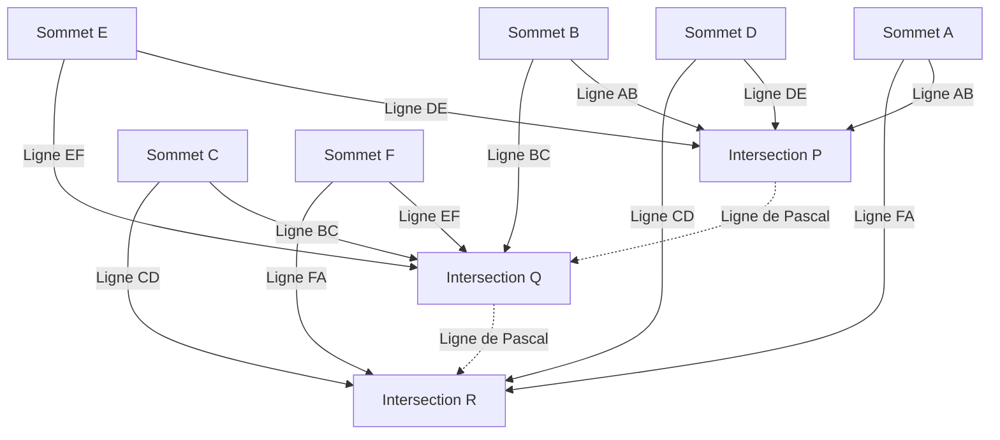

## 1. Introduction : Le génie qui a changé le monde en seulement 39 ans de vie

« L'homme n'est qu'un roseau, le plus faible de la nature ; mais c'est un roseau pensant. »
[Blaise Pascal](https://kenji.blog/p/pascal/) (19 juin 1623 - 19 août 1662), qui a laissé cette célèbre citation, est un géant de l'intellect représentant la France du 17ème siècle. En tant que mathématicien, physicien, philosophe et théologien chrétien, il a laissé des réalisations monumentales profondément gravées dans l'histoire de l'humanité dans divers domaines.

Sa vie fut une bataille constante contre la maladie, et il est décédé à l'âge précoce de 39 ans. Cependant, au cours de cette courte vie, il a jeté les bases de la géométrie projective, inventé la première calculatrice mécanique pratique au monde, ouvert le nouveau domaine mathématique de la théorie des probabilités et établi des principes fondamentaux de la physique concernant la mécanique des fluides et la pression atmosphérique. Cet article détaille la vie de ce génie disparu trop tôt, comment il est parvenu à ces découvertes révolutionnaires et l'impact profond qu'il a eu sur les générations suivantes.

## 2. Naissance d'un prodige et environnement éducatif unique (1623 - 1639)

### 2.1. Naissance en Auvergne et mort de sa mère
[Blaise Pascal](https://kenji.blog/p/pascal/) est né en 1623 à Clermont-Ferrand, en Auvergne, dans le centre-sud de la France. Son père, Étienne Pascal, était une personnalité de premier plan, président de la Cour des Aides (tribunal fiscal) locale, et également un excellent mathématicien. La famille Pascal bénéficiait d'un environnement intellectuel très privilégié, mais alors que Blaise n'avait que trois ans, sa mère, Antoinette, décéda. Son père Étienne décida de ne pas se remarier et de se consacrer entièrement à l'éducation de ses trois enfants : Blaise, sa sœur aînée Gilberte et sa sœur cadette Jacqueline.

### 2.2. Déménagement à Paris et politique éducative d'Étienne
En 1631, pour offrir à ses enfants la meilleure éducation possible, Étienne déménagea avec sa famille à Paris. Insatisfait de l'enseignement scolaire de l'époque, Étienne choisit de devenir lui-même le précepteur de ses enfants. Sa politique éducative était très singulière : « Ne pas enseigner les mathématiques, qui sont une matière trop abstraite, avant que la raison de l'enfant ne soit suffisamment développée. » Il privilégia les langues et l'histoire, et élimina tous les livres de mathématiques de la maison.

Cependant, cette « interdiction » a paradoxalement stimulé intensément la curiosité du jeune Blaise. À l'âge de 12 ans, Blaise commença à explorer la géométrie par lui-même pendant ses jeux. Dessinant des figures sur le sol avec du charbon, il prouva indépendamment la 32ème proposition des *Éléments* d'[[Euclid](https://kenji.blog/p/euclid/)e](https://kenji.blog/p/euclid/) : « La somme des angles intérieurs d'un triangle est égale à deux angles droits (180 degrés). » Témoin de cet aperçu écrasant de talent, son père changea de politique, lui permit d'étudier les mathématiques et commença à l'emmener aux réunions des plus grands intellectuels d'Europe organisées par le père Mersenne (le prédécesseur de l'Académie des sciences française).

## 3. Réalisations innovantes en mathématiques

Le talent mathématique de Pascal s'est épanoui très tôt au cours de son adolescence. Ses recherches ont couvert un large éventail de domaines, des mathématiques pures aux mathématiques appliquées.

### 3.1. Pionnier de la géométrie projective : Le théorème de Pascal (Hexagramme mystique)

En 1639, Pascal, alors âgé de 16 ans, découvre les travaux de géométrie projective de Girard Desargues à l'Académie de Mersenne. Comprenant profondément les idées de Desargues, Pascal découvrit un théorème révolutionnaire concernant les coniques et le publia sur une simple feuille de papier (essai). Ceci est connu aujourd'hui sous le nom de **théorème de Pascal**.

Le théorème de Pascal s'applique à tout hexagone inscrit dans une conique (ellipse, parabole, hyperbole et cercle).

> Théorème : Si un hexagone est inscrit dans une conique, les trois points d'intersection des côtés opposés se trouvent sur une même ligne droite (droite de Pascal).

Définition des points d'intersection à l'aide de formules mathématiques :

$$
\text{Intersection } P = AB \cap DE, \quad Q = BC \cap EF, \quad R = CD \cap FA \implies P, Q, R \text{ sont colinéaires}
$$

La schématisation de ce théorème donne le diagramme suivant :

Cette découverte a provoqué une onde de choc massive au sein de la communauté mathématique de l'époque. Une anecdote raconte que même le grand mathématicien [René Descartes](https://kenji.blog/p/descartes/) refusa de croire qu'un garçon de 16 ans ait pu produire une démonstration aussi avancée, soupçonnant qu'elle « devait avoir été écrite par le père ». Pascal a tiré plus de 400 corollaires de ce théorème, faisant considérablement progresser la géométrie de son temps.

### 3.2. La première calculatrice mécanique au monde : La « Pascaline »

En 1639, son père Étienne fut nommé commissaire des impôts à Rouen, et la famille s'y installa. Voyant son père accablé par d'immenses calculs d'impôts tard dans la nuit, Pascal entreprit de développer une machine pour automatiser les calculs et alléger le fardeau de son père.

En 1642, après de nombreux essais et erreurs, Pascal, âgé de 19 ans, acheva une calculatrice mécanique utilisant des engrenages, appelée la « Pascaline ». Cet appareil effectuait automatiquement les additions et les soustractions grâce à la rotation d'engrenages prédéfinis et, notamment, ce fut l'une des premières calculatrices au monde à mettre en œuvre un « mécanisme de retenue » pratique. Des dizaines de Pascalines furent ensuite fabriquées, et il obtint même un brevet de la royauté française. Pascal est considéré comme l'un des premiers pionniers de l'histoire du génie logiciel et de la conception de matériel.

### 3.3. Le triangle de Pascal et le théorème du binôme

Le concept mathématique pour lequel le nom de Pascal est le plus connu est le **triangle de Pascal**. Il s'agit d'une disposition géométrique des coefficients d'un développement binomial en forme de triangle. Bien qu'il fût connu avant Pascal par des mathématiciens tels que Jia Xian et Yang Hui en Chine, et Omar Khayyam en Perse, Pascal a étudié systématiquement et minutieusement les propriétés de ce triangle dans son *Traité du triangle arithmétique* de 1653.

Le triangle de Pascal est construit de telle sorte que le nombre de la $n$-ième ligne en partant du haut et de la $k$-ième position en partant de la gauche est le coefficient binomial $\binom{n}{k}$. Le théorème du binôme s'exprime comme suit :

$$
(x + y)^n = \sum_{k=0}^{n} \binom{n}{k} x^{n-k} y^k = \sum_{k=0}^{n} \frac{n!}{k!(n-k)!} x^{n-k} y^k
$$

Pascal a prouvé de nombreux théorèmes pour appliquer ce triangle à la combinatoire et aux calculs de probabilités, en commençant par la propriété fondamentale selon laquelle chaque élément du triangle est la somme des deux éléments situés directement au-dessus de lui (règle de Pascal : $\binom{n}{k} = \binom{n-1}{k-1} + \binom{n-1}{k}$). Dans ces recherches, il a également formulé clairement le principe du raisonnement par récurrence, affinant encore les méthodes des mathématiques déductives.

### 3.4. Fondation de la théorie des probabilités : Correspondance avec Fermat

L'un des rôles les plus cruciaux de Pascal dans l'histoire des mathématiques fut la fondation de la théorie des probabilités. Tout a commencé en 1654 lorsqu'Antoine Gombaud, le chevalier de Méré, un noble passionné de jeux de hasard, a soumis à Pascal le « problème des partis ».

**Le problème des partis** :
> Deux joueurs de force égale jouent à un jeu où le premier à atteindre un certain nombre de victoires (par exemple, 3 victoires) remporte la totalité de la mise. Cependant, le jeu est forcé de s'arrêter lorsqu'un joueur a 2 victoires et l'autre 1 victoire. Comment la mise doit-elle être répartie de la manière la plus équitable à ce stade ?

Pour s'attaquer à ce problème difficile, Pascal écrivit des lettres à [Pierre de Fermat](https://kenji.blog/p/fermat/), un autre mathématicien de génie vivant à Toulouse. Les deux sont parvenus à la solution par des approches totalement différentes.

- **L'approche de Fermat** : Une méthode combinatoire qui répertorie tous les scénarios futurs possibles (arbre de probabilité) et calcule la probabilité d'occurrence de chacun pour déterminer le ratio de distribution.
- **L'approche de Pascal** : Une méthode récursive qui calcule « l'espérance » de jouer la prochaine partie unique à partir de l'état actuel et la résout par récurrence.

Dans le calcul de Pascal, si les gains attendus en gagnant ou en perdant la partie suivante sont respectivement $E_{\text{gagner}}$ et $E_{\text{perdre}}$, l'espérance actuelle $E$ s'exprime comme suit :

$$
E = \frac{1}{2} E_{\text{gagner}} + \frac{1}{2} E_{\text{perdre}}
$$

Les conclusions auxquelles les deux hommes sont parvenus grâce à leur correspondance correspondaient parfaitement, et ces lettres échangées ont marqué l'aube de la théorie des probabilités moderne. Ils ont prouvé que le hasard et l'incertitude, auparavant attribués à la volonté divine ou à la chance, pouvaient être quantifiés par un calcul mathématique rigoureux.

## 4. Contributions à la physique : Preuve du vide et mécanique des fluides

L'esprit inquisiteur de Pascal ne se limitait pas aux mathématiques abstraites ; il s'est également dirigé vers l'élucidation des phénomènes physiques dans le monde naturel.

### 4.1. Preuve de l'existence du vide (L'expérience du Puy de Dôme)

Dans la communauté des physiciens de l'époque, la théorie proposée par le Grec ancien Aristote selon laquelle « la nature a horreur du vide (Horror vacui) » était crue comme une vérité absolue, et il était considéré comme impossible qu'un « vide » sans rien dans l'espace puisse exister.

Cependant, en 1643, l'Italien Evangelista Torricelli mena une expérience utilisant un tube de verre rempli de mercure et découvrit qu'un vide (vide de Torricelli) se formait au sommet du tube. En apprenant cela, Pascal reproduisit rigoureusement l'expérience de Torricelli. Il a émis l'hypothèse que si l'espace formé en haut du tube était véritablement un vide, alors ce qui le soutenait devait être le poids de l'atmosphère (pression atmosphérique).

En 1648, Pascal demanda à son beau-frère, Florin Périer, de mener une expérience à grande échelle mesurant comment la hauteur d'un baromètre à mercure changeait entre le sommet et la base du Puy de Dôme (altitude 1465 m) en Auvergne. Le résultat, exactement comme Pascal l'avait prédit, fut que la colonne de mercure était plus basse au sommet qu'à la base. C'est parce qu'à des altitudes plus élevées, il y a moins d'atmosphère au-dessus, ce qui entraîne une pression atmosphérique plus faible.

Ce résultat expérimental spectaculaire a prouvé de manière définitive l'existence de la pression atmosphérique et a simultanément brisé le dogme aristotélicien selon lequel « la nature a horreur du vide ». L'unité de pression atmosphérique, « l'hectopascal (hPa) », a été nommée en l'honneur de sa grande réalisation.

### 4.2. Le principe de Pascal

Alors qu'il faisait progresser ses recherches sur la pression des fluides, il a découvert une loi fondamentale concernant les fluides confinés. C'est le **principe de Pascal**.

> Principe : La pression exercée sur un fluide statique confiné est transmise uniformément et sans diminution à toutes les parties du fluide et aux parois du récipient qui le contient, quelle que soit la direction.

Exprimé mathématiquement, si les surfaces de deux pistons sont $A_1$ et $A_2$, et les forces appliquées sont $F_1$ et $F_2$, la pression $P$ étant constante :

$$
P = \frac{F_1}{A_1} = \frac{F_2}{A_2} \implies F_2 = F_1 \frac{A_2}{A_1}
$$

Ce principe, qui permet de générer une force massive sur un piston de grande section en appliquant une petite force sur un piston de petite section, est la technologie fondamentale de toutes les machines fluides modernes, telles que les vérins hydrauliques et les freins hydrauliques automobiles.

## 5. Dévotion à la philosophie et à la pensée religieuse, et les « Pensées »

Alors que Pascal était profondément plongé dans la poursuite de la vérité scientifique, il avait toujours une soif intérieure de foi. La seconde moitié de sa vie a été consacrée à une profonde contemplation philosophique et théologique, loin de la science.

### 5.1. La Nuit de feu et le Jansénisme

La nuit du 23 novembre 1654, Pascal, alors âgé de 31 ans, fut impliqué dans un grave accident lorsque les chevaux de son carrosse s'emballèrent sur un pont au-dessus de la Seine, manquant de le faire plonger vers la mort. Échappant miraculeusement à la mort, il vécut cette nuit-là une rencontre mystique (appelée plus tard la « Nuit de feu ») où il ressentit la présence écrasante de Dieu. Il nota sa profonde émotion sur un morceau de parchemin et le cousit dans la doublure de son manteau, le portant toujours avec lui pour le reste de sa vie.

Suite à cette expérience, il se retira de la recherche scientifique profane et noua des liens profonds avec les ermites de l'abbaye de Port-Royal, centre du « Jansénisme », un mouvement de réforme rigoureux au sein de l'Église catholique.

### 5.2. Les mathématiques de la cycloïde (Une étude exceptionnelle à la fin de sa vie)

Bien que dévoué à la religion, Pascal n'est revenu à la recherche mathématique qu'une seule fois. En 1658, souffrant de graves maux de dents, Pascal commença à réfléchir à des problèmes mathématiques concernant la « cycloïde (la trajectoire dessinée par un point sur la circonférence d'un cercle qui roule le long d'une ligne droite) » pour se distraire. Mystérieusement, la douleur disparut, ce que Pascal considéra comme une révélation divine. En huit jours seulement, il découvrit des méthodes innovantes pour trouver l'aire, le centre de gravité et le volume des solides de révolution de la cycloïde.

Il annonça un concours concernant ce problème sous le pseudonyme d'Amos Dettonville, et publia lui-même des solutions parfaites. La « méthode des indivisibles » qu'il y employa servit de pont essentiel vers la découverte du calcul infinitésimal par [Isaac Newton](https://kenji.blog/p/newton/) et Gottfried Wilhelm Leibniz plus tard.

### 5.3. Le pari de Pascal et la théorie de la décision

Pascal croyait qu'il était impossible de prouver complètement l'existence de Dieu par la logique ou la raison. Cependant, il argumenta en faveur de la rationalité de la foi avec une approche caractéristique du fondateur de la théorie des probabilités. C'est le **pari de Pascal**.

Il a analysé s'il était d'une plus grande espérance de « croire en Dieu » ou de « ne pas croire en Dieu » pour les humains qui ne sont pas sûrs que Dieu existe.

- Si Dieu existe et que vous croyez en Lui : Vous gagnez un bonheur infini (le Paradis).
- Si Dieu existe et que vous ne croyez pas en Lui : Vous recevez une punition infinie (l'Enfer).
- Si Dieu n'existe pas et que vous croyez en Lui : Vous ne perdez que quelques plaisirs mondains limités.
- Si Dieu n'existe pas et que vous ne croyez pas en Lui : Vous gagnez des plaisirs mondains limités.

En calculant cela avec des espérances, peu importe à quel point la probabilité de l'existence de Dieu pourrait être faible (tant qu'elle n'est pas nulle), l'espérance de croire en Dieu devient « infinie ». Par conséquent, il a fait valoir qu'une personne rationnelle devrait parier (croire) du côté que Dieu existe. Cet argument est très apprécié en tant que précurseur de la théorie des jeux moderne et de la théorie de la décision.

### 5.4. Les « Pensées » et le « roseau pensant »

Dans ses dernières années, Pascal commença à écrire une grande « Apologie de la religion chrétienne » pour guider les athées et les sceptiques vers la foi chrétienne. Cependant, sa constitution, fragile depuis l'enfance, et le surmenage firent des ravages, et sa santé se détériora rapidement. Endurant de graves maux de tête et des douleurs à l'estomac, il griffonna séquentiellement des pensées fragmentées sur des morceaux de papier au fur et à mesure qu'elles lui venaient à l'esprit.

Le 19 août 1662, Pascal est décédé à l'âge de 39 ans. Les quelque 1 000 notes fragmentées qu'il a laissées ont été compilées et publiées par ses amis de Port-Royal après sa mort sous le titre *Pensées*.

Parmi les nombreux fragments rassemblés dans les *Pensées*, la citation suivante est particulièrement célèbre :

> L'homme n'est qu'un roseau, le plus faible de la nature ; mais c'est un roseau pensant. Il ne faut pas que l'univers entier s'arme pour l'écraser : une vapeur, une goutte d'eau, suffit pour le tuer. Mais, quand l'univers l'écraserait, l'homme serait encore plus noble que ce qui le tue, parce qu'il sait qu'il meurt, et l'avantage que l'univers a sur lui ; l'univers n'en sait rien.
>
> Toute notre dignité consiste donc en la pensée. (Tiré des *Pensées*, Fragment 347)

Pascal a affronté le fait que comparé à l'immensité et à la puissance écrasantes du macrocosme, le corps humain est aussi fragile et éphémère qu'un simple roseau. Cependant, dans le même temps, il a fièrement déclaré que la dignité absolue et la grandeur de l'humanité résident précisément dans la capacité à « penser » et à être conscient de ses propres limites et de sa misère.

## 6. Conclusion : L'héritage de Pascal bien vivant aujourd'hui

Les 39 années que [Blaise Pascal](https://kenji.blog/p/pascal/) a traversées furent globalement trop courtes et remplies de l'agonie de la maladie. Cependant, son intuition aiguisée et sa pensée profonde ont franchi sans effort les frontières des mathématiques, de la physique, de l'ingénierie et de la philosophie, élargissant considérablement les horizons de la connaissance humaine.

Les graines qu'il a semées donnent vie aux données de pression atmosphérique (hectopascal) que nous utilisons quotidiennement dans les prévisions météorologiques, aux freins automobiles (principe de Pascal), à l'évaluation des risques en matière d'assurance et de finance (théorie des probabilités), et même aux fondements mêmes de l'architecture informatique. Le langage de programmation « Pascal », développé par Niklaus Wirth en 1970, a été nommé en l'honneur de celui qui a créé la première calculatrice au monde.

« L'homme est un roseau pensant. » Dans notre ère moderne, où l'IA (Intelligence Artificielle) se développe et où la valeur de la « pensée » humaine est remise en question, ces mots nous parlent avec une résonance encore plus profonde. Peu importe à quel point la technologie progresse, la vie et la philosophie de Pascal continuent de nous demander constamment où résident véritablement l'essence de l'humanité et sa dignité.
