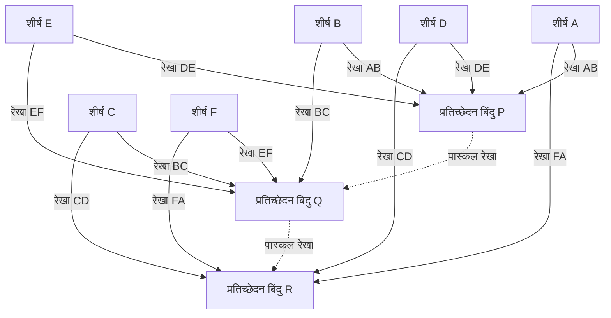

## 1. परिचय: वह जीनियस जिसने मात्र 39 वर्ष के जीवन में दुनिया बदल दी

"मनुष्य प्रकृति की सबसे कमज़ोर चीज़, एक नरकट (reed) के सिवा और कुछ नहीं है; लेकिन वह एक विचारशील नरकट है।"
यह प्रसिद्ध उद्धरण छोड़ने वाले [ब्लेज़ पास्कल](https://kenji.blog/hi/p/pascal/) (19 जून, 1623 - 19 अगस्त, 1662), 17वीं सदी के फ्रांस का प्रतिनिधित्व करने वाले बुद्धि के एक विशाल स्तंभ हैं। एक गणितज्ञ, भौतिक विज्ञानी, दार्शनिक और ईसाई धर्मशास्त्री के रूप में, उन्होंने विभिन्न क्षेत्रों में मानव इतिहास में गहराई से उकेरी गई स्मारकीय उपलब्धियाँ छोड़ीं।

उनका जीवन बीमारी के साथ एक निरंतर लड़ाई था, और 39 वर्ष की कम उम्र में ही उनका निधन हो गया। हालाँकि, इस छोटे से जीवन के दौरान, उन्होंने प्रक्षेप्य ज्यामिति (projective geometry) की नींव रखी, दुनिया के पहले व्यावहारिक यांत्रिक कैलकुलेटर का आविष्कार किया, प्रायिकता सिद्धांत (probability theory) के नए गणितीय क्षेत्र का बीड़ा उठाया, और द्रव यांत्रिकी और वायुमंडलीय दबाव के संबंध में भौतिकी के मूलभूत सिद्धांत स्थापित किए। यह लेख इस कम उम्र में दुनिया से विदा लेने वाले जीनियस के जीवन का विवरण देता है, कि कैसे वे इन अभूतपूर्व खोजों तक पहुँचे, और आने वाली पीढ़ियों पर उनका क्या गहरा प्रभाव पड़ा।

## 2. एक कौतुक (Prodigy) का जन्म और एक अनूठा शैक्षिक वातावरण (1623 - 1639)

### 2.1. औवेर्न (Auvergne) में जन्म और उनकी माँ की मृत्यु
[ब्लेज़ पास्कल](https://kenji.blog/hi/p/pascal/) का जन्म 1623 में मध्य-दक्षिण फ्रांस के औवेर्न क्षेत्र के क्लेरमोंट-फेरैंड में हुआ था। उनके पिता, एटीन पास्कल, एक प्रमुख व्यक्ति थे, जो स्थानीय कर न्यायालय (Court of Aids) के अध्यक्ष के रूप में कार्य करते थे और एक उत्कृष्ट गणितज्ञ भी थे। पास्कल परिवार एक अत्यधिक विशेषाधिकार प्राप्त बौद्धिक वातावरण में था, लेकिन जब ब्लेज़ केवल तीन वर्ष के थे, तब उनकी माँ एंटोनेट का निधन हो गया। उनके पिता एटीन ने दोबारा शादी नहीं करने का फैसला किया और खुद को पूरी तरह से अपने तीन बच्चों: ब्लेज़, उनकी बड़ी बहन गिल्बर्ट और उनकी छोटी बहन जैकलीन की शिक्षा के लिए समर्पित कर दिया।

### 2.2. पेरिस जाना और एटीन की शैक्षिक नीति
1631 में, अपने बच्चों को सर्वोत्तम संभव शिक्षा प्रदान करने के लिए, एटीन परिवार को पेरिस ले गए। उस समय की स्कूली शिक्षा से असंतुष्ट, एटीन ने स्वयं अपने बच्चों का निजी ट्यूटर बनना चुना। उनकी शैक्षिक नीति बहुत अनूठी थी: "गणित न पढ़ाएँ, जो कि बहुत अधिक अमूर्त विषय है, जब तक कि बच्चे का तर्क पर्याप्त रूप से विकसित न हो जाए।" उन्होंने भाषाओं और इतिहास को प्राथमिकता दी, और घर से गणित की सभी किताबें हटा दीं।

हालाँकि, इस "प्रतिबंध" ने विडंबना रूप से युवा ब्लेज़ की जिज्ञासा को तीव्रता से बढ़ा दिया। 12 वर्ष की आयु में, ब्लेज़ ने अपने खेलने के समय में अपने दम पर ज्यामिति की खोज शुरू कर दी। फर्श पर चारकोल से आकृतियाँ बनाते हुए, उन्होंने स्वतंत्र रूप से [यूक्लिड](https://kenji.blog/hi/p/euclid/) के *एलिमेंट्स* में 32वें प्रस्ताव को सिद्ध कर दिया: "एक त्रिभुज के आंतरिक कोणों का योग दो समकोणों (180 डिग्री) के बराबर होता है।" प्रतिभा की इस भारी झलक को देखकर, उनके पिता ने अपनी नीति बदल दी, उन्हें गणित का अध्ययन करने की अनुमति दी, और उन्हें फादर मेर्सन (फ्रांसीसी विज्ञान अकादमी के पूर्ववर्ती) द्वारा आयोजित यूरोप के महानतम बुद्धिजीवियों की सभाओं में ले जाना शुरू कर दिया।

## 3. गणित में अभिनव उपलब्धियाँ

पास्कल की गणितीय प्रतिभा उनकी किशोरावस्था में ही खिल उठी थी। उनका शोध शुद्ध गणित से लेकर अनुप्रयुक्त गणित तक एक विस्तृत श्रृंखला में फैला था।

### 3.1. प्रक्षेप्य ज्यामिति की शुरुआत: पास्कल की प्रमेय (रहस्यवादी हेक्साग्राम)

1639 में, 16 वर्षीय पास्कल को मेर्सन अकादमी में गिरार्ड डेसार्गस (Girard Desargues) के प्रक्षेप्य ज्यामिति कार्यों का सामना करना पड़ा। डेसार्गस के विचारों को गहराई से समझते हुए, पास्कल ने शंक्वाकार खंडों (conic sections) के संबंध में एक अभूतपूर्व प्रमेय की खोज की और इसे एक ही पन्ने (निबंध) पर प्रकाशित किया। इसे आज **पास्कल की प्रमेय** ([Pascal](https://kenji.blog/hi/p/pascal/)'s theorem) के रूप में जाना जाता है।

पास्कल की प्रमेय किसी भी शंक्वाकार खंड (अंडाकार, परवलय, अतिपरवलय, और वृत्त) में अंकित षट्भुज के लिए लागू होती है।

> प्रमेय: यदि कोई षट्भुज (hexagon) एक शंक्वाकार खंड में अंकित है, तो विपरीत पक्षों के तीन प्रतिच्छेदन बिंदु एक ही सीधी रेखा (पास्कल रेखा) पर स्थित होते हैं।

गणितीय सूत्रों का उपयोग करके प्रतिच्छेदन बिंदुओं को परिभाषित करना:

$$
\text{प्रतिच्छेदन बिंदु } P = AB \cap DE, \quad Q = BC \cap EF, \quad R = CD \cap FA \implies P, Q, R \text{ संरेख (collinear) हैं}
$$

इस प्रमेय को आरेखित करने पर निम्नलिखित आरेख प्राप्त होता है:

इस खोज ने उस समय के गणितीय समुदाय में एक बड़ा झटका भेजा। एक किस्सा यह भी है कि महान गणितज्ञ [रेने डेसकार्टेस](https://kenji.blog/hi/p/descartes/) ने भी यह मानने से इनकार कर दिया कि एक 16 वर्षीय लड़के ने इतना उन्नत प्रमाण प्रस्तुत किया है, उन्हें संदेह था कि "इसे पिता द्वारा लिखा गया होगा।" पास्कल ने इस प्रमेय से 400 से अधिक उपप्रमेय (corollaries) प्राप्त किए, जिससे उनके समय की ज्यामिति काफी उन्नत हुई।

### 3.2. दुनिया का पहला यांत्रिक कैलकुलेटर: "पास्कलाइन"

1639 में, उनके पिता एटीन को रूऑन में कर आयुक्त नियुक्त किया गया, और परिवार वहां स्थानांतरित हो गया। अपने पिता को देर रात तक भारी कर गणनाओं से अभिभूत देखकर, पास्कल ने गणनाओं को स्वचालित करने और अपने पिता के बोझ को कम करने के लिए एक मशीन विकसित करने का बीड़ा उठाया।

1642 में, कई परीक्षणों और त्रुटियों के बाद, 19 वर्षीय पास्कल ने गियर का उपयोग करके एक यांत्रिक कैलकुलेटर पूरा किया, जिसे "पास्कलाइन" ([Pascal](https://kenji.blog/hi/p/pascal/)ine) कहा गया। इस उपकरण ने पूर्व-निर्धारित गियर के घूमने पर स्वचालित रूप से जोड़ और घटाव का प्रदर्शन किया, और विशेष रूप से, यह एक व्यावहारिक "कैरी मैकेनिज्म" को लागू करने वाले दुनिया के पहले कैलकुलेटरों में से एक था। इसके बाद दर्जनों पास्कलाइन निर्मित किए गए, और उन्होंने फ्रांसीसी राजघराने से पेटेंट भी प्राप्त किया। पास्कल को सॉफ्टवेयर इंजीनियरिंग और हार्डवेयर डिज़ाइन के इतिहास में सबसे शुरुआती अग्रदूतों में से एक माना जाता है।

### 3.3. पास्कल का त्रिभुज और द्विपद प्रमेय

गणितीय अवधारणा जिसके लिए पास्कल का नाम सबसे व्यापक रूप से जाना जाता है वह है **पास्कल का त्रिभुज**। यह एक द्विपद विस्तार (binomial expansion) के गुणांकों की एक त्रिभुजाकार रूप में ज्यामितीय व्यवस्था है। यद्यपि यह पास्कल से पहले चीन में जिया जियान और यांग हुई और फारस में उमर खय्याम जैसे गणितज्ञों द्वारा जाना जाता था, पास्कल ने 1653 के अपने *अंकगणितीय त्रिभुज पर ग्रंथ* (Treatise on the Arithmetical Triangle) में इस त्रिभुज के गुणों का व्यवस्थित और गहन अध्ययन किया।

पास्कल का त्रिभुज इस प्रकार बनाया गया है कि ऊपर से $n$-वीं पंक्ति और बाएँ से $k$-वें स्थान पर स्थित संख्या द्विपद गुणांक $\binom{n}{k}$ है। द्विपद प्रमेय को इस प्रकार व्यक्त किया जाता है:

$$
(x + y)^n = \sum_{k=0}^{n} \binom{n}{k} x^{n-k} y^k = \sum_{k=0}^{n} \frac{n!}{k!(n-k)!} x^{n-k} y^k
$$

पास्कल ने संयोजिकी (combinatorics) और प्रायिकता गणनाओं में इस त्रिभुज को लागू करने के लिए कई प्रमेयों को सिद्ध किया, जिसकी शुरुआत इस मौलिक गुण से होती है कि त्रिभुज में प्रत्येक तत्व उसके ठीक ऊपर के दो तत्वों का योग है (पास्कल का नियम: $\binom{n}{k} = \binom{n-1}{k-1} + \binom{n-1}{k}$)। इस शोध में, उन्होंने गणितीय आगमन (mathematical induction) के सिद्धांत को भी स्पष्ट रूप से तैयार किया, जिससे निगमनात्मक गणित के तरीकों को और परिष्कृत किया गया।

### 3.4. प्रायिकता सिद्धांत की नींव: फर्मेट के साथ पत्राचार

गणित के इतिहास में पास्कल की सबसे महत्वपूर्ण भूमिकाओं में से एक प्रायिकता सिद्धांत (Probability Theory) की स्थापना थी। इसकी शुरुआत 1654 में हुई जब जुए के शौकीन रईस एंटोनी गोम्बाउड, शेवेलियर डी मेरे (Chevalier de Méré) ने पास्कल के सामने "अंकों की समस्या" (Problem of points) प्रस्तुत की।

**अंकों की समस्या**:
> समान कौशल के दो खिलाड़ी एक खेल खेल रहे हैं जहाँ एक निश्चित संख्या में जीत (उदा. 3 जीत) तक पहुँचने वाला पहला खिलाड़ी पूरा पुरस्कार पूल ले लेता है। हालाँकि, खेल को रुकने के लिए मजबूर किया जाता है जब एक खिलाड़ी की 2 जीत होती है और दूसरे की 1 जीत होती है। इस बिंदु पर पुरस्कार पूल को सबसे निष्पक्ष रूप से कैसे वितरित किया जाना चाहिए?

इस कठिन समस्या से निपटने के लिए, पास्कल ने टूलूज़ में रहने वाले एक अन्य प्रतिभाशाली गणितज्ञ पियरे डी फर्मेट ([Pierre de Fermat](https://kenji.blog/hi/p/fermat/)) को पत्र लिखा। दोनों पूरी तरह से अलग दृष्टिकोण के माध्यम से समाधान पर पहुँचे।

- **फर्मेट का दृष्टिकोण**: एक संयोजनात्मक विधि जो सभी संभावित भविष्य के परिदृश्यों (वृक्ष आरेख) को सूचीबद्ध करती है और वितरण अनुपात निर्धारित करने के लिए प्रत्येक के होने की प्रायिकता की गणना करती है।
- **पास्कल का दृष्टिकोण**: एक पुनरावर्ती विधि जो वर्तमान अवस्था से अगला एकल खेल खेलने के "अपेक्षित मूल्य" (Expected value) की गणना करती है और इसे पुनरावर्ती रूप से हल करती है।

पास्कल की गणना में, यदि अगला खेल जीतने या हारने से अपेक्षित कमाई क्रमशः $E_{\text{जीत}}$ और $E_{\text{हार}}$ है, तो वर्तमान अपेक्षित मूल्य $E$ को इस प्रकार व्यक्त किया जाता है:

$$
E = \frac{1}{2} E_{\text{जीत}} + \frac{1}{2} E_{\text{हार}}
$$

दोनों द्वारा उनके पत्राचार के माध्यम से निकाले गए निष्कर्ष पूरी तरह से मेल खाते हैं, और इन आदान-प्रदान किए गए पत्रों ने आधुनिक प्रायिकता सिद्धांत की शुरुआत को चिह्नित किया। उन्होंने साबित किया कि संयोग और अनिश्चितता, जिसे पहले ईश्वरीय इच्छा या भाग्य के लिए जिम्मेदार ठहराया जाता था, को कठोर गणितीय गणना द्वारा परिमाणित किया जा सकता है।

## 4. भौतिकी में योगदान: निर्वात का प्रमाण और द्रव यांत्रिकी

पास्कल का जिज्ञासु दिमाग केवल अमूर्त गणित तक सीमित नहीं था; यह प्राकृतिक दुनिया में भौतिक घटनाओं को स्पष्ट करने की ओर भी निर्देशित था।

### 4.1. निर्वात के अस्तित्व का प्रमाण (प्यू डे डोम प्रयोग)

उस समय के भौतिकी समुदाय में, प्राचीन ग्रीक अरस्तू द्वारा प्रस्तावित सिद्धांत कि "प्रकृति निर्वात से घृणा करती है (Horror vacui)" को एक परम सत्य के रूप में माना जाता था, और यह माना जाता था कि अंतरिक्ष में कुछ भी न होने के साथ "निर्वात" (vacuum) का अस्तित्व असंभव है।

हालाँकि, 1643 में, इतालवी इवेंजेलिस्टा टोरिसेली ने पारे से भरी कांच की नली का उपयोग करके एक प्रयोग किया और पाया कि नली के शीर्ष पर एक निर्वात (टोरिसेलियन निर्वात) बनता है। यह जानने पर, पास्कल ने टोरिसेली के प्रयोग को सख्ती से दोहराया। उन्होंने परिकल्पना की कि यदि नली के शीर्ष पर बना स्थान वास्तव में एक निर्वात था, तो जो इसे सहारा दे रहा था वह वायुमंडल का भार (वायुमंडलीय दबाव) होना चाहिए।

1648 में, पास्कल ने अपने बहनोई, फ्लोरिन पेरियर से एक बड़े पैमाने पर प्रयोग करने के लिए कहा, जिसमें यह मापा गया कि औवेर्न क्षेत्र में प्यू डे डोम पहाड़ (ऊंचाई 1465 मीटर) के शिखर और आधार के बीच पारा बैरोमीटर की ऊंचाई कैसे बदलती है। परिणाम, बिल्कुल वैसा ही जैसा पास्कल ने भविष्यवाणी की थी, यह था कि पारा स्तंभ आधार की तुलना में शिखर पर कम था। ऐसा इसलिए है क्योंकि अधिक ऊंचाई पर, ऊपर कम वायुमंडल आराम कर रहा है, जिसके परिणामस्वरूप वायुमंडलीय दबाव कम होता है।

इस नाटकीय प्रयोगात्मक परिणाम ने वायुमंडलीय दबाव के अस्तित्व को निश्चित रूप से साबित कर दिया और साथ ही साथ अरिस्टोटेलियन हठधर्मिता को चकनाचूर कर दिया कि "प्रकृति निर्वात से घृणा करती है।" वायुमंडलीय दबाव की इकाई, "हेक्टोपास्कल (hPa)", का नाम उनकी महान उपलब्धि के सम्मान में रखा गया था।

### 4.2. पास्कल का सिद्धांत

जैसे-जैसे उन्होंने द्रव दबाव पर अपने शोध को आगे बढ़ाया, उन्होंने सीमित तरल पदार्थों के संबंध में एक मौलिक नियम की खोज की। यह **पास्कल का सिद्धांत** है।

> सिद्धांत: किसी सीमित स्थिर द्रव (confined static fluid) पर लगाया गया दबाव द्रव के सभी भागों और युक्त बर्तन की दीवारों पर बिना किसी कमी के समान रूप से प्रेषित होता है, चाहे दिशा कोई भी हो।

गणितीय रूप से व्यक्त किया गया, यदि दो पिस्टन के क्षेत्रफल $A_1$ और $A_2$ हैं, और लगाए गए बल $F_1$ और $F_2$ हैं, क्योंकि दबाव $P$ स्थिर है:

$$
P = \frac{F_1}{A_1} = \frac{F_2}{A_2} \implies F_2 = F_1 \frac{A_2}{A_1}
$$

यह सिद्धांत, जो एक छोटे क्रॉस-अनुभागीय क्षेत्र वाले पिस्टन पर एक छोटा बल लगाकर एक बड़े क्रॉस-अनुभागीय क्षेत्र वाले पिस्टन पर बड़े पैमाने पर बल उत्पन्न करने की अनुमति देता है, सभी आधुनिक द्रव मशीनरी, जैसे हाइड्रोलिक जैक और ऑटोमोबाइल हाइड्रोलिक ब्रेक के लिए मूलभूत तकनीक है।

## 5. दर्शन और धार्मिक विचारों के प्रति समर्पण, और 'पेंसीज़' (Pensées)

जबकि पास्कल वैज्ञानिक सत्य की खोज में गहराई से डूबे हुए थे, उन्हें हमेशा विश्वास की आंतरिक प्यास थी। उनके जीवन का उत्तरार्ध विज्ञान से दूर गहन दार्शनिक और धार्मिक चिंतन को समर्पित था।

### 5.1. आग की रात (Night of Fire) और जेनसेनिज़्म (Jansenism)

23 नवंबर, 1654 की रात को, 31 वर्षीय पास्कल एक गंभीर दुर्घटना में शामिल थे, जब उनकी गाड़ी के घोड़े सीन नदी पर एक पुल पर बेकाबू हो गए थे, और वे लगभग मौत के घाट उतर गए थे। चमत्कारी रूप से मौत से बचने के बाद, उस रात उन्होंने एक रहस्यमय मुठभेड़ का अनुभव किया (जिसे बाद में "आग की रात" कहा गया) जहां उन्होंने भगवान की भारी उपस्थिति महसूस की। उन्होंने अपनी गहरी भावनाओं को चर्मपत्र के एक टुकड़े पर लिख लिया और उसे अपने कोट के अस्तर में सिल लिया, और जीवन भर उसे हमेशा अपने साथ रखा।

इस अनुभव के बाद, वे धर्मनिरपेक्ष वैज्ञानिक अनुसंधान से पीछे हट गए और पोर्ट-रॉयल अभय के संन्यासियों के साथ गहरे संबंध विकसित किए, जो "जेनसेनिज़्म" का केंद्र था, कैथोलिक चर्च के भीतर एक कठोर सुधार आंदोलन।

### 5.2. साइक्लोइड का गणित (देर के जीवन में एक असाधारण अध्ययन)

धर्म के प्रति समर्पित होने के बावजूद, पास्कल केवल एक बार गणितीय शोध में लौटे। 1658 में, गंभीर दांत दर्द से पीड़ित, पास्कल ने अपना ध्यान भटकाने के लिए "साइक्लोइड (एक सीधी रेखा के साथ लुढ़कते हुए वृत्त की परिधि पर एक बिंदु द्वारा खींची गई प्रक्षेपवक्र)" से संबंधित गणितीय समस्याओं के बारे में सोचना शुरू किया। रहस्यमय तरीके से, दर्द गायब हो गया, जिसे पास्कल ने एक ईश्वरीय रहस्योद्घाटन के रूप में लिया। केवल आठ दिनों के भीतर, उन्होंने साइक्लोइड की क्रांति के ठोस (solids of revolution) के क्षेत्रफल, गुरुत्वाकर्षण के केंद्र और आयतन को खोजने के लिए नवीन विधियों की खोज की।

उन्होंने अमोस डेटनविले (Amos Dettonville) उपनाम के तहत इस समस्या से संबंधित एक पुरस्कार प्रतियोगिता की घोषणा की, और स्वयं सही समाधान प्रकाशित किए। उन्होंने यहां जिस "अविभाज्यों की विधि" (method of indivisibles) को नियोजित किया, उसने बाद में [आइजैक न्यूटन](https://kenji.blog/hi/p/newton/) और गॉटफ्रीड विल्हेम लाइबनिज़ द्वारा कैलकुलस की खोज के लिए एक आवश्यक पुल के रूप में काम किया।

### 5.3. पास्कल की बाजी ([Pascal](https://kenji.blog/hi/p/pascal/)'s Wager) और निर्णय सिद्धांत

पास्कल का मानना ​​था कि तर्क या बुद्धि के माध्यम से भगवान के अस्तित्व को पूरी तरह से साबित करना असंभव था। हालाँकि, उन्होंने प्रायिकता सिद्धांत के संस्थापक की एक विशिष्ट विशेषता के साथ विश्वास की तर्कसंगतता के लिए तर्क दिया। यह **पास्कल की बाजी** ([Pascal](https://kenji.blog/hi/p/pascal/)'s Wager) है।

उन्होंने विश्लेषण किया कि उन इंसानों के लिए "भगवान में विश्वास करना" या "भगवान में विश्वास नहीं करना" उच्च अपेक्षित मूल्य (expected value) का है या नहीं जो अनिश्चित हैं कि भगवान मौजूद हैं या नहीं।

- यदि भगवान मौजूद हैं और आप उन पर विश्वास करते हैं: आप अनंत खुशी (स्वर्ग) प्राप्त करते हैं।
- यदि भगवान मौजूद हैं और आप उन पर विश्वास नहीं करते हैं: आपको अनंत सजा (नरक) मिलती है।
- यदि भगवान मौजूद नहीं हैं और आप उन पर विश्वास करते हैं: आप केवल कुछ सीमित सांसारिक सुखों को खोते हैं।
- यदि भगवान मौजूद नहीं हैं और आप उन पर विश्वास नहीं करते हैं: आप सीमित सांसारिक सुख प्राप्त करते हैं।

इसकी अपेक्षित मूल्यों के साथ गणना करने पर, भगवान के अस्तित्व की प्रायिकता चाहे कितनी भी कम क्यों न हो (जब तक कि वह शून्य न हो), भगवान में विश्वास करने का अपेक्षित मूल्य "अनंत" हो जाता है। इसलिए, उन्होंने तर्क दिया कि एक तर्कसंगत व्यक्ति को यह दांव लगाना (विश्वास करना) चाहिए कि भगवान मौजूद हैं। यह तर्क आधुनिक गेम थ्योरी और निर्णय सिद्धांत के अग्रदूत के रूप में अत्यधिक माना जाता है।

### 5.4. 'पेंसीज़' (Pensées) और "विचारशील नरकट"

अपने बाद के वर्षों में, पास्कल ने नास्तिकों और संशयवादियों को ईसाई धर्म में मार्गदर्शन करने के लिए एक भव्य 'ईसाई धर्म के लिए क्षमायाचना' (Apology for the Christian Religion) लिखना शुरू किया। हालाँकि, बचपन से ही उनके कमजोर संविधान और अधिक काम ने अपना असर दिखाया, और उनका स्वास्थ्य तेजी से बिगड़ गया। गंभीर सिरदर्द और पेट दर्द सहते हुए, उन्होंने विचारों के आते ही उन्हें क्रमिक रूप से कागज़ के टुकड़ों पर खंडित विचारों को लिखना शुरू कर दिया।

19 अगस्त, 1662 को 39 वर्ष की आयु में पास्कल का निधन हो गया। उनके द्वारा छोड़े गए लगभग 1,000 खंडित नोटों को संकलित किया गया और उनकी मृत्यु के बाद उनके पोर्ट-रॉयल दोस्तों द्वारा *पेंसीज़* (*Pensées*, अर्थ: विचार) के रूप में प्रकाशित किया गया।

*पेंसीज़* में एकत्र किए गए कई अंशों में से, निम्नलिखित उद्धरण विशेष रूप से प्रसिद्ध है:

> मनुष्य प्रकृति की सबसे कमज़ोर चीज़, एक नरकट के सिवा और कुछ नहीं है; लेकिन वह एक विचारशील नरकट है। उसे कुचलने के लिए पूरे ब्रह्मांड को खुद को हथियारों से लैस करने की आवश्यकता नहीं है। उसे मारने के लिए एक वाष्प, पानी की एक बूंद ही काफी है। लेकिन, अगर ब्रह्मांड उसे कुचल भी दे, तो भी मनुष्य उसे मारने वाली चीज़ से ज्यादा महान होगा, क्योंकि वह जानता है कि वह मरता है और ब्रह्मांड को उस पर जो फायदा है; ब्रह्मांड इस बारे में कुछ नहीं जानता।
>
> अतः हमारी पूरी गरिमा विचार में निहित है। (*पेंसीज़* से, अंश 347)

पास्कल ने इस तथ्य का सामना किया कि मैक्रोकॉज़म की भारी विशालता और शक्ति की तुलना में, मानव शरीर एक नरकट के समान नाजुक और क्षणभंगुर है। हालाँकि, साथ ही, उन्होंने गर्व से घोषणा की कि मानवता की पूर्ण गरिमा और महानता "सोचने" और अपनी सीमाओं और दुख के प्रति सचेत होने की क्षमता में ही निहित है।

## 6. निष्कर्ष: पास्कल की विरासत आज भी जीवित है

[ब्लेज़ पास्कल](https://kenji.blog/hi/p/pascal/) ने जो 39 साल बिताए, वे कुल मिलाकर बहुत छोटे थे और बीमारी की पीड़ा से भरे हुए थे। हालाँकि, उनकी तीक्ष्ण अंतर्ज्ञान और गहन सोच ने मानव ज्ञान के क्षितिज को व्यापक रूप से बढ़ाते हुए गणित, भौतिकी, इंजीनियरिंग और दर्शन की सीमाओं को आसानी से पार कर लिया।

उन्होंने जो बीज बोए, वे मौसम के पूर्वानुमान में हमारे द्वारा उपयोग किए जाने वाले वायुमंडलीय दबाव डेटा (हेक्टोपास्कल), ऑटोमोबाइल ब्रेक (पास्कल का सिद्धांत), बीमा और वित्त में जोखिम मूल्यांकन (प्रायिकता सिद्धांत), और यहां तक कि कंप्यूटर आर्किटेक्चर की नींव में भी जान फूंकते हैं। 1970 में निकलॉस विर्थ द्वारा विकसित प्रोग्रामिंग भाषा "[Pascal](https://kenji.blog/hi/p/pascal/)", दुनिया के पहले कैलकुलेटर के निर्माता, उनके सम्मान में नामित की गई थी।

"मनुष्य एक विचारशील नरकट है।" हमारे आधुनिक युग में, जहाँ AI (कृत्रिम बुद्धिमत्ता) विकसित हो रही है और मानव "विचार" के मूल्य पर फिर से सवाल उठाया जा रहा है, ये शब्द हमारे साथ और भी गहरी गूंज के साथ बात करते हैं। चाहे तकनीक कितनी भी आगे बढ़ जाए, पास्कल का जीवन और दर्शन हमसे लगातार पूछते रहते हैं कि मानवता का सार और उसकी गरिमा वास्तव में कहाँ निहित है।
