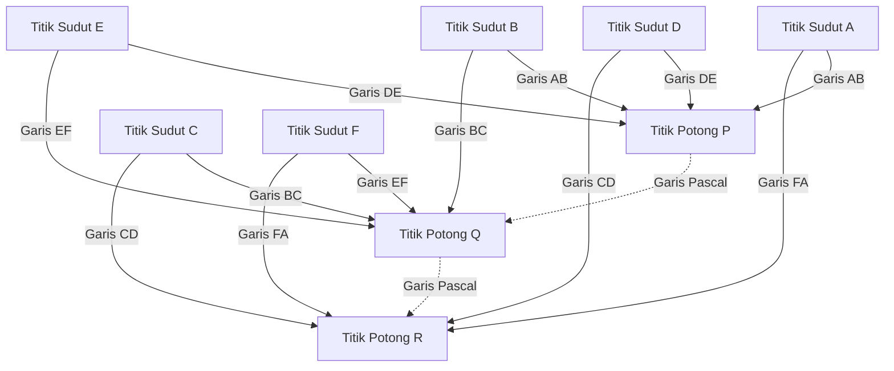

## 1. Pengantar: Sang Jenius yang Mengubah Dunia Hanya dalam 39 Tahun Kehidupannya

"Manusia hanyalah sebatang alang-alang, hal yang paling rapuh di alam; tetapi ia adalah alang-alang yang berpikir."
[Blaise Pascal](https://kenji.blog/id/p/pascal/) (19 Juni 1623 - 19 Agustus 1662), yang meninggalkan kutipan terkenal ini, adalah raksasa intelektual yang mewakili Prancis pada abad ke-17. Sebagai seorang matematikawan, fisikawan, filsuf, dan teolog Kristen, ia meninggalkan pencapaian monumental yang terukir dalam sejarah manusia di berbagai bidang.

Kehidupannya adalah pertempuran konstan melawan penyakit, dan ia meninggal pada usia muda, 39 tahun. Namun, selama hidupnya yang singkat ini, ia meletakkan dasar-dasar geometri proyektif, menemukan kalkulator mekanis praktis pertama di dunia, merintis bidang matematika baru yaitu teori probabilitas, dan menetapkan prinsip-prinsip dasar fisika mengenai mekanika fluida dan tekanan atmosfer. Artikel ini merinci kehidupan jenius yang wafat di usia muda ini, bagaimana ia sampai pada penemuan-penemuan inovatif ini, dan dampak mendalam yang ia berikan pada generasi-generasi berikutnya.

## 2. Kelahiran Sang Anak Ajaib dan Lingkungan Pendidikan yang Unik (1623 - 1639)

### 2.1. Kelahiran di Auvergne dan Kematian Ibunya
[Blaise Pascal](https://kenji.blog/id/p/pascal/) lahir pada tahun 1623 di Clermont-Ferrand, Auvergne, di bagian tengah-selatan Prancis. Ayahnya, Étienne [Pascal](https://kenji.blog/id/p/pascal/), adalah tokoh terkemuka yang menjabat sebagai presiden Pengadilan Pajak (Court of Aids) setempat dan juga seorang matematikawan yang ulung. Keluarga [Pascal](https://kenji.blog/id/p/pascal/) berada di lingkungan intelektual yang sangat istimewa, tetapi ketika Blaise baru berusia tiga tahun, ibunya, Antoinette, meninggal dunia. Ayahnya Étienne memutuskan untuk tidak menikah lagi dan mengabdikan dirinya sepenuhnya untuk pendidikan ketiga anaknya: Blaise, kakak perempuannya Gilberte, dan adik perempuannya Jacqueline.

### 2.2. Pindah ke Paris dan Kebijakan Pendidikan Étienne
Pada tahun 1631, untuk memberikan pendidikan terbaik bagi anak-anaknya, Étienne memindahkan keluarganya ke Paris. Karena tidak puas dengan pendidikan sekolah pada saat itu, Étienne memilih untuk menjadi guru privat bagi anak-anaknya sendiri. Kebijakan pendidikannya sangat unik: "Jangan ajarkan matematika, yang merupakan mata pelajaran yang terlalu abstrak, sampai nalar anak cukup berkembang." Ia memprioritaskan bahasa dan sejarah, dan menyingkirkan semua buku matematika dari rumah.

Namun, "larangan" ini secara paradoks sangat merangsang rasa ingin tahu Blaise muda. Pada usia 12 tahun, Blaise mulai mengeksplorasi geometri sendiri selama waktu bermainnya. Dengan menggambar bangun datar di lantai menggunakan arang, ia secara mandiri membuktikan dalil ke-32 dalam *Elemen* [[Euklid](https://kenji.blog/id/p/euclid/)es](https://kenji.blog/p/euclid/): "Jumlah sudut dalam sebuah segitiga sama dengan dua sudut siku-siku (180 derajat)." Menyaksikan kilasan bakat yang luar biasa ini, ayahnya mengubah kebijakannya, mengizinkannya untuk belajar matematika, dan mulai membawanya ke pertemuan para intelektual terbesar Eropa yang dipandu oleh Pastor [Mersenne](https://kenji.blog/id/p/mersenne/) (pendahulu Akademi Sains Prancis).

## 3. Pencapaian Inovatif dalam Matematika

Bakat matematika [Pascal](https://kenji.blog/id/p/pascal/) berkembang lebih awal di usia remajanya. Penelitiannya mencakup berbagai bidang, dari matematika murni hingga matematika terapan.

### 3.1. Merintis Geometri Proyektif: Teorema [Pascal](https://kenji.blog/id/p/pascal/) (Heksagram Mistik)

Pada tahun 1639, [Pascal](https://kenji.blog/id/p/pascal/) yang berusia 16 tahun menemukan karya-karya geometri proyektif Girard Desargues di Akademi [Mersenne](https://kenji.blog/id/p/mersenne/). Memahami ide-ide Desargues secara mendalam, [Pascal](https://kenji.blog/id/p/pascal/) menemukan teorema inovatif mengenai irisan kerucut dan menerbitkannya pada selembar kertas tunggal (esai). Hal ini dikenal hari ini sebagai **teorema [Pascal](https://kenji.blog/id/p/pascal/)**.

Teorema [Pascal](https://kenji.blog/id/p/pascal/) berlaku untuk heksagon (segi enam) sembarang yang digambar di dalam irisan kerucut (elips, parabola, hiperbola, dan lingkaran).

> Teorema: Jika sebuah heksagon digambar di dalam sebuah irisan kerucut, maka ketiga titik potong dari sisi-sisi yang berlawanan terletak pada satu garis lurus tunggal (garis [Pascal](https://kenji.blog/id/p/pascal/)).

Mendefinisikan titik potong menggunakan rumus matematika:

$$
\text{Titik potong } P = AB \cap DE, \quad Q = BC \cap EF, \quad R = CD \cap FA \implies P, Q, R \text{ adalah kolinier}
$$

Menskematikakan teorema ini menghasilkan diagram berikut:

Penemuan ini mengirimkan gelombang kejutan besar-besaran melalui komunitas matematika pada masa itu. Terdapat sebuah anekdot bahwa bahkan matematikawan besar [René Descartes](https://kenji.blog/id/p/descartes/) menolak untuk percaya bahwa seorang anak laki-laki berusia 16 tahun telah menghasilkan pembuktian tingkat lanjut seperti itu, dan curiga bahwa hal tersebut "pasti ditulis oleh sang ayah." [Pascal](https://kenji.blog/id/p/pascal/) menurunkan lebih dari 400 akibat wajar dari teorema ini, dan secara signifikan memajukan geometri di masanya.

### 3.2. Kalkulator Mekanis Pertama di Dunia: "[Pascal](https://kenji.blog/id/p/pascal/)ine"

Pada tahun 1639, ayahnya Étienne ditunjuk sebagai komisaris pajak di Rouen, dan keluarganya pindah ke sana. Melihat ayahnya kewalahan oleh perhitungan pajak yang sangat banyak hingga larut malam, [Pascal](https://kenji.blog/id/p/pascal/) berinisiatif untuk mengembangkan sebuah mesin untuk mengotomatisasi perhitungan dan meringankan beban ayahnya.

Pada tahun 1642, setelah melalui banyak uji coba, [Pascal](https://kenji.blog/id/p/pascal/) yang berusia 19 tahun menyelesaikan sebuah kalkulator mekanis menggunakan roda gigi, yang disebut "[Pascal](https://kenji.blog/id/p/pascal/)ine". Perangkat ini secara otomatis melakukan penjumlahan dan pengurangan saat roda gigi yang telah diatur sebelumnya berputar, dan terutama, ini adalah salah satu kalkulator pertama di dunia yang menerapkan "mekanisme pembawa" (carry mechanism) yang praktis. Puluhan [Pascal](https://kenji.blog/id/p/pascal/)ine diproduksi setelahnya, dan ia bahkan memperoleh paten dari kerajaan Prancis. [Pascal](https://kenji.blog/id/p/pascal/) dianggap sebagai salah satu pelopor paling awal dalam sejarah rekayasa perangkat lunak dan desain perangkat keras.

### 3.3. Segitiga [Pascal](https://kenji.blog/id/p/pascal/) dan Teorema Binomial

Konsep matematika yang membuat nama [Pascal](https://kenji.blog/id/p/pascal/) paling dikenal luas adalah **Segitiga [Pascal](https://kenji.blog/id/p/pascal/)**. Segitiga [Pascal](https://kenji.blog/id/p/pascal/) adalah susunan geometris dari koefisien ekspansi binomial menjadi bentuk segitiga. Meskipun hal ini telah diketahui sebelum masa [Pascal](https://kenji.blog/id/p/pascal/) oleh matematikawan seperti Jia Xian dan Yang Hui di Tiongkok, serta Omar Khayyam di Persia, [Pascal](https://kenji.blog/id/p/pascal/) secara sistematis dan menyeluruh mempelajari sifat-sifat segitiga ini dalam karyanya pada tahun 1653, *Risalah tentang Segitiga Aritmatika*.

Segitiga [Pascal](https://kenji.blog/id/p/pascal/) dikonstruksikan sedemikian rupa sehingga angka pada baris ke-$n$ dari atas dan posisi ke-$k$ dari kiri adalah koefisien binomial $\binom{n}{k}$. Teorema binomial diekspresikan sebagai berikut:

$$
(x + y)^n = \sum_{k=0}^{n} \binom{n}{k} x^{n-k} y^k = \sum_{k=0}^{n} \frac{n!}{k!(n-k)!} x^{n-k} y^k
$$

[Pascal](https://kenji.blog/id/p/pascal/) membuktikan banyak teorema untuk menerapkan segitiga ini pada kombinatorika dan perhitungan probabilitas, dimulai dengan sifat fundamental bahwa setiap elemen di dalam segitiga adalah jumlah dari dua elemen yang berada tepat di atasnya (aturan [Pascal](https://kenji.blog/id/p/pascal/): $\binom{n}{k} = \binom{n-1}{k-1} + \binom{n-1}{k}$). Dalam penelitian ini, ia juga merumuskan dengan jelas prinsip induksi matematika, lebih jauh menyempurnakan metode matematika deduktif.

### 3.4. Pendirian Teori Probabilitas: Korespondensi dengan [Fermat](https://kenji.blog/id/p/fermat/)

Salah satu peran [Pascal](https://kenji.blog/id/p/pascal/) yang paling krusial dalam sejarah matematika adalah pendirian teori probabilitas. Hal ini dimulai pada tahun 1654 ketika Antoine Gombaud, Chevalier de Méré, seorang bangsawan yang gemar berjudi, memberikan masalah "Pembagian Taruhan" (Problem of points) kepada [Pascal](https://kenji.blog/id/p/pascal/).

**Masalah Pembagian Taruhan**:
> Dua pemain dengan keterampilan yang sama sedang memainkan sebuah permainan di mana yang pertama mencapai jumlah kemenangan tertentu (misalnya, 3 kemenangan) mengambil seluruh total hadiah. Namun, permainan terpaksa dihentikan ketika salah satu pemain meraih 2 kemenangan dan yang lainnya meraih 1 kemenangan. Bagaimana total hadiah harus didistribusikan secara paling adil pada titik ini?

Untuk mengatasi masalah sulit ini, [Pascal](https://kenji.blog/id/p/pascal/) menulis surat kepada [Pierre de Fermat](https://kenji.blog/id/p/fermat/), ahli matematika jenius lainnya yang tinggal di Toulouse. Keduanya sampai pada solusi tersebut melalui pendekatan yang sama sekali berbeda.

- **Pendekatan [Fermat](https://kenji.blog/id/p/fermat/)**: Sebuah metode kombinatorial yang mencantumkan semua kemungkinan skenario masa depan (diagram pohon) dan menghitung probabilitas terjadinya masing-masing skenario untuk menentukan rasio distribusi.
- **Pendekatan [Pascal](https://kenji.blog/id/p/pascal/)**: Sebuah metode rekursif yang menghitung "Nilai harapan" (Expected value) dari memainkan permainan tunggal berikutnya dari keadaan saat ini dan menyelesaikannya secara rekursif.

Dalam perhitungan [Pascal](https://kenji.blog/id/p/pascal/), jika perkiraan pendapatan dari memenangkan atau kalah dalam permainan berikutnya masing-masing adalah $E_{\text{menang}}$ dan $E_{\text{kalah}}$, maka nilai harapan saat ini $E$ diekspresikan sebagai berikut:

$$
E = \frac{1}{2} E_{\text{menang}} + \frac{1}{2} E_{\text{kalah}}
$$

Kesimpulan yang dicapai oleh keduanya melalui korespondensi mereka cocok dengan sempurna, dan surat-surat yang dipertukarkan ini menandai awal teori probabilitas modern. Mereka membuktikan bahwa kebetulan dan ketidakpastian, yang sebelumnya dikaitkan dengan kehendak ilahi atau keberuntungan, dapat dikuantifikasi melalui perhitungan matematika yang cermat.

## 4. Kontribusi pada Fisika: Pembuktian Ruang Hampa dan Mekanika Fluida

Pikiran [Pascal](https://kenji.blog/id/p/pascal/) yang selalu ingin tahu tidak terbatas pada matematika abstrak; ia juga diarahkan untuk menjelaskan fenomena fisik di alam.

### 4.1. Bukti Keberadaan Ruang Hampa (Eksperimen Puy de Dôme)

Dalam komunitas fisika pada masa itu, teori yang diajukan oleh Aristoteles dari Yunani kuno bahwa "alam membenci ruang hampa (Horror vacui)" dipercaya sebagai kebenaran mutlak, dan dianggap tidak mungkin "ruang hampa" tanpa apa-apa di dalamnya dapat ada.

Namun, pada tahun 1643, ilmuwan Italia Evangelista Torricelli melakukan eksperimen menggunakan tabung kaca berisi raksa (merkuri) dan menemukan bahwa ruang hampa (ruang hampa Torricelli) terbentuk di bagian atas tabung. Setelah mengetahui hal ini, [Pascal](https://kenji.blog/id/p/pascal/) mereplikasi eksperimen Torricelli dengan cermat. Ia berhipotesis bahwa jika ruang yang terbentuk di bagian atas tabung itu benar-benar ruang hampa, maka yang menopangnya pastilah berat atmosfer (tekanan atmosfer).

Pada tahun 1648, [Pascal](https://kenji.blog/id/p/pascal/) meminta saudara iparnya, Florin Périer, untuk melakukan eksperimen berskala besar yang mengukur bagaimana ketinggian barometer raksa berubah di antara puncak dan kaki gunung Puy de Dôme (ketinggian 1465 m) di wilayah Auvergne. Hasilnya, persis seperti yang diprediksi [Pascal](https://kenji.blog/id/p/pascal/), kolom raksa lebih rendah di puncak daripada di kaki gunung. Hal ini dikarenakan pada ketinggian yang lebih tinggi, jumlah atmosfer yang berada di atasnya lebih sedikit, sehingga menghasilkan tekanan atmosfer yang lebih rendah.

Hasil eksperimental dramatis ini membuktikan secara definitif keberadaan tekanan atmosfer dan secara bersamaan mematahkan dogma Aristoteles bahwa "alam membenci ruang hampa." Satuan tekanan atmosfer, "hektopascal (hPa)", dinamai untuk menghormati pencapaiannya yang besar ini.

### 4.2. Prinsip [Pascal](https://kenji.blog/id/p/pascal/)

Saat ia memajukan penelitiannya mengenai tekanan fluida, ia menemukan hukum fundamental mengenai fluida yang terkurung. Ini disebut **Prinsip [Pascal](https://kenji.blog/id/p/pascal/)**.

> Prinsip: Tekanan yang diberikan pada fluida statis yang tertutup diteruskan secara seragam dan tanpa berkurang ke seluruh bagian fluida dan ke dinding bejana penampungnya, terlepas dari arahnya.

Diekspresikan secara matematis, jika luas dua piston masing-masing adalah $A_1$ dan $A_2$, dan gaya yang diberikan adalah $F_1$ dan $F_2$, karena tekanan $P$ adalah konstan:

$$
P = \frac{F_1}{A_1} = \frac{F_2}{A_2} \implies F_2 = F_1 \frac{A_2}{A_1}
$$

Prinsip ini, yang memungkinkan dihasilkannya gaya masif pada piston dengan luas penampang yang besar dengan memberikan gaya kecil pada piston dengan luas penampang kecil, merupakan teknologi dasar untuk semua mesin fluida modern, seperti dongkrak hidrolik dan rem hidrolik mobil.

## 5. Pengabdian pada Filsafat dan Pemikiran Religius, serta 'Pensées'

Meskipun [Pascal](https://kenji.blog/id/p/pascal/) sangat tenggelam dalam pencarian kebenaran ilmiah, ia selalu memiliki kehausan batin akan iman. Paruh kedua kehidupannya didedikasikan untuk perenungan filosofis dan teologis yang mendalam, jauh dari ilmu pengetahuan.

### 5.1. Malam Api dan Jansenisme

Pada malam tanggal 23 November 1654, [Pascal](https://kenji.blog/id/p/pascal/) yang berusia 31 tahun terlibat dalam kecelakaan parah ketika kuda-kuda keretanya lepas kendali di sebuah jembatan di atas sungai Seine, nyaris membuatnya jatuh dan mati. Lolos dari maut secara ajaib, pada malam itu ia mengalami pertemuan mistis (yang kemudian disebut "Malam Api" atau "Night of Fire") di mana ia merasakan kehadiran Tuhan yang luar biasa. Ia menuliskan emosinya yang mendalam di selembar perkamen dan menjahitnya ke dalam lapisan mantelnya, selalu membawanya ke mana pun ia pergi selama sisa hidupnya.

Menyusul pengalaman ini, ia menarik diri dari penelitian ilmiah sekuler dan mengembangkan ikatan yang mendalam dengan para pertapa dari biara Port-Royal, pusat "Jansenisme," sebuah gerakan reformasi yang ketat di dalam Gereja Katolik.

### 5.2. Matematika Sikloid (Sebuah Studi Pengecualian di Akhir Hayat)

Meskipun mengabdikan diri pada agama, [Pascal](https://kenji.blog/id/p/pascal/) pernah satu kali kembali ke penelitian matematika. Pada tahun 1658, karena menderita sakit gigi yang parah, [Pascal](https://kenji.blog/id/p/pascal/) mulai memikirkan masalah matematika mengenai "Sikloid (lintasan yang digambar oleh suatu titik pada keliling lingkaran saat ia bergulir di sepanjang garis lurus)" untuk mengalihkan perhatiannya. Secara misterius, rasa sakit itu hilang, yang dianggap [Pascal](https://kenji.blog/id/p/pascal/) sebagai wahyu ilahi. Hanya dalam waktu delapan hari, ia menemukan metode inovatif untuk menemukan luas, titik berat, dan volume benda putar dari sikloid.

Ia mengumumkan sayembara berhadiah mengenai masalah ini dengan nama samaran Amos Dettonville, dan menerbitkan sendiri solusi yang sempurna. "Metode tak terpisahkan" yang ia gunakan di sini berfungsi sebagai jembatan penting menuju penemuan kalkulus oleh [Isaac Newton](https://kenji.blog/id/p/newton/) dan Gottfried Wilhelm Leibniz di kemudian hari.

### 5.3. Taruhan [Pascal](https://kenji.blog/id/p/pascal/) dan Teori Keputusan

[Pascal](https://kenji.blog/id/p/pascal/) percaya bahwa tidak mungkin membuktikan keberadaan Tuhan secara utuh melalui logika atau nalar. Namun, ia berargumen mengenai rasionalitas keimanan dengan pendekatan yang menjadi ciri khas pendiri teori probabilitas. Ini disebut **Taruhan [Pascal](https://kenji.blog/id/p/pascal/)**.

Ia menganalisis apakah memiliki nilai harapan (expected value) yang lebih tinggi untuk "percaya kepada Tuhan" atau "tidak percaya kepada Tuhan" bagi manusia yang tidak yakin apakah Tuhan ada.

- Jika Tuhan ada dan Anda percaya kepada-Nya: Anda memperoleh kebahagiaan tak terbatas (Surga).
- Jika Tuhan ada dan Anda tidak percaya kepada-Nya: Anda menerima hukuman tak terbatas (Neraka).
- Jika Tuhan tidak ada dan Anda percaya kepada-Nya: Anda hanya kehilangan sedikit kesenangan duniawi yang terbatas.
- Jika Tuhan tidak ada dan Anda tidak percaya kepada-Nya: Anda memperoleh kesenangan duniawi yang terbatas.

Dengan menghitung ini menggunakan nilai harapan, seberapa pun rendahnya probabilitas keberadaan Tuhan (selama probabilitas itu tidak nol), nilai harapan untuk percaya kepada Tuhan akan menjadi "tak terhingga". Karena itu, ia berargumen bahwa orang yang rasional harus bertaruh (percaya) di pihak bahwa Tuhan itu ada. Argumen ini sangat dihargai sebagai cikal bakal dari teori permainan dan teori keputusan modern.

### 5.4. 'Pensées' dan "Alang-alang yang Berpikir"

Di tahun-tahun terakhirnya, [Pascal](https://kenji.blog/id/p/pascal/) mulai menulis sebuah karya besar 'Apologi untuk Agama Kristen' untuk menuntun para ateis dan orang yang skeptis kepada iman Kristen. Namun, kondisi fisiknya yang rapuh sejak masa kanak-kanak dan terlalu banyak bekerja berdampak buruk pada dirinya, dan kesehatannya memburuk dengan cepat. Sambil menahan sakit kepala dan sakit perut yang parah, ia secara berurutan mencatat pemikiran-pemikiran yang terfragmentasi pada secarik-secarik kertas saat ide tersebut muncul di benaknya.

Pada 19 Agustus 1662, [Pascal](https://kenji.blog/id/p/pascal/) wafat pada usia 39 tahun. Sekitar 1.000 catatan yang terfragmentasi yang ditinggalkannya dikompilasi dan diterbitkan oleh teman-temannya dari Port-Royal setelah kematiannya sebagai *Pensées* (berarti "Pemikiran").

Di antara sekian banyak fragmen yang dikumpulkan di dalam *Pensées*, kutipan berikut sangat terkenal:

> Manusia hanyalah sebatang alang-alang, hal yang paling rapuh di alam; tetapi ia adalah alang-alang yang berpikir. Seluruh alam semesta tidak perlu mempersenjatai diri untuk menghancurkannya. Uap, atau setetes air sudah cukup untuk membunuhnya. Tetapi, seandainya alam semesta menghancurkannya, manusia akan tetap lebih mulia daripada hal yang membunuhnya, karena ia sadar bahwa ia mati dan keuntungan apa yang alam semesta miliki atas dirinya; alam semesta tidak mengetahui apa-apa tentang semua itu.
>
> Semua martabat kita dengan demikian terdiri dari pikiran. (Dari *Pensées*, Fragmen 347)

[Pascal](https://kenji.blog/id/p/pascal/) menghadapi fakta bahwa dibandingkan dengan keluasan dan kekuatan makrokosmos yang luar biasa, tubuh manusia sama rapuh dan fana-nya dengan sebatang alang-alang. Namun, pada saat yang sama, ia dengan bangga mendeklarasikan bahwa martabat dan kebesaran absolut umat manusia justru terletak pada kemampuan untuk "berpikir" dan menyadari keterbatasan dan penderitaannya sendiri.

## 6. Kesimpulan: Warisan [Pascal](https://kenji.blog/id/p/pascal/) yang Terus Hidup Hari Ini

Masa 39 tahun yang dilalui [Blaise Pascal](https://kenji.blog/id/p/pascal/) secara keseluruhan terlalu singkat dan dipenuhi dengan penderitaan akibat penyakit. Namun, intuisi dan pemikiran mendalamnya yang tajam melampaui batas-batas matematika, fisika, teknik, dan filsafat dengan mudah, memperluas cakrawala pengetahuan manusia secara signifikan.

Benih-benih yang ia tabur memberi napas pada data tekanan atmosfer (hektopascal) yang kita gunakan sehari-hari dalam prakiraan cuaca, rem mobil (prinsip [Pascal](https://kenji.blog/id/p/pascal/)), penilaian risiko dalam asuransi dan keuangan (teori probabilitas), dan bahkan dalam fondasi dari arsitektur komputer. Bahasa pemrograman "[Pascal](https://kenji.blog/id/p/pascal/)," yang dikembangkan oleh Niklaus Wirth pada tahun 1970, diberi nama untuk menghormatinya, sang pencipta kalkulator pertama di dunia.

"Manusia adalah alang-alang yang berpikir". Di era modern kita, di mana AI (Kecerdasan Buatan) sedang berkembang dan nilai dari "pemikiran" manusia sedang dipertanyakan kembali, kata-kata ini berbicara kepada kita dengan gema yang lebih dalam. Sejauh apa pun teknologi maju, kehidupan dan filosofi [Pascal](https://kenji.blog/id/p/pascal/) terus-menerus bertanya kepada kita tentang di mana sesungguhnya esensi umat manusia dan martabatnya berada.
