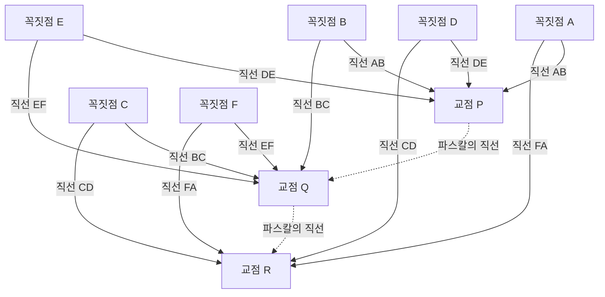

## 1. 서론: 불과 39년의 생애로 세상을 바꾼 천재

"인간은 자연에서 가장 연약한 한 줄기 갈대에 불과하다. 그러나 그는 생각하는 갈대다."
이 너무나도 유명한 명언을 남긴 [블레즈 파스칼](https://kenji.blog/ko/p/pascal/)([Blaise Pascal](https://kenji.blog/ko/p/pascal/), 1623년 6월 19일 - 1662년 8월 19일)은 17세기 프랑스를 대표하는 지성의 거인입니다. 수학자, 물리학자, 철학자이자 기독교 신학자로서 그는 다방면에 걸쳐 인류 역사에 깊이 각인될 위대한 업적을 남겼습니다.

그의 생애는 병마와의 끊임없는 투쟁이었으며, 향년 39세라는 짧은 나이로 세상을 떠났습니다. 그러나 그 짧은 인생 동안 그는 사영기하학의 기초를 다졌고, 세계 최초의 실용적인 기계식 계산기를 발명했으며, 확률론이라는 새로운 수학 분야를 개척했고, 나아가 유체역학과 기압에 관한 물리학의 근본 원리를 확립했습니다. 본 기사에서는 이 요절한 천재의 파란만장한 생애를 되짚어보며, 그가 어떻게 이러한 획기적인 발견에 이르렀는지, 그리고 후세에 어떤 깊은 영향을 미쳤는지 상세히 파헤쳐 봅니다.

## 2. 신동의 탄생과 특이한 교육 환경 (1623년 - 1639년)

### 2.1. 오베르뉴에서의 탄생과 어머니의 죽음
[블레즈 파스칼](https://kenji.blog/ko/p/pascal/)은 1623년 프랑스 중남부의 오베르뉴 지방 클레르몽페랑에서 태어났습니다. 그의 아버지 에티엔 파스칼은 지역의 조세재판소장을 지낸 유력자이자 동시에 뛰어난 수학자이기도 했습니다. 파스칼 일가는 지적으로 매우 혜택받은 환경에 있었으나, 블레즈가 불과 3살 때 어머니 앙투아네트가 세상을 떠납니다. 아버지 에티엔은 재혼하지 않고, 블레즈와 그의 누나 질베르트, 여동생 자클린 세 남매의 교육에 전념하기로 결심합니다.

### 2.2. 파리로의 이주와 에티엔의 교육 방침
1631년, 아이들에게 최고의 교육을 받게 하기 위해 에티엔은 가족을 이끌고 파리로 이주합니다. 에티엔은 당시의 학교 교육에 불만을 품고 있었기에, 스스로가 가정교사가 되어 아이들을 가르치는 길을 택했습니다. 그의 교육 방침은 매우 독특하여, "아이의 이성이 충분히 발달하기 전까지는 지나치게 추상적인 학문인 수학을 가르치지 않는다"는 것이었습니다. 어학과 역사를 우선시하고, 집 안에서 수학과 관련된 책을 일절 배제했습니다.

그러나 이러한 "금지"가 역설적으로 어린 블레즈의 호기심을 강하게 자극하게 됩니다. 12살 때 블레즈는 놀이를 하던 중 독자적으로 기하학 탐구를 시작했습니다. 바닥에 숯으로 도형을 그리며, [유클리드](https://kenji.blog/ko/p/euclid/) 『원론』의 제32명제인 "삼각형의 내각의 합은 2직각(180도)과 같다"를 스스로의 힘으로 증명해낸 것입니다. 이 압도적인 천재성의 편린을 목격한 아버지는 방침을 바꾸어 그가 수학을 배우는 것을 허용하고, 메르센 신부가 주재하는 당시 유럽 최고 지식인들의 모임(이후 프랑스 과학 아카데미의 전신)에 그를 데리고 가기 시작했습니다.

## 3. 수학에서의 혁신적인 업적

파스칼의 수학적 재능은 10대에 일찌감치 만개합니다. 그의 연구는 순수수학에서 응용수학에 이르기까지 폭넓은 영역에 걸쳐 있었습니다.

### 3.1. 사영기하학의 개척: 파스칼의 정리 (신비의 육각형)

1639년, 16세의 파스칼은 메르센 아카데미에서 지라르 데자르그의 사영기하학 저서를 접하게 됩니다. 데자르그의 아이디어를 깊이 이해한 파스칼은 원뿔곡선에 관한 획기적인 정리를 발견하고, 이를 한 장의 종이(에세)에 정리하여 발표했습니다. 이것이 오늘날 「 **파스칼의 정리** (Pascal's theorem)」로 알려진 것입니다.

파스칼의 정리는 원뿔곡선(타원, 포물선, 쌍곡선 및 원)에 내접하는 임의의 육각형에 대해 성립합니다.

> 정리: 원뿔곡선에 내접하는 육각형의 세 쌍의 대변의 연장선들의 교점은 모두 한 직선(파스칼의 직선) 위에 있다.

수식을 사용하여 교점을 정의하면 다음과 같습니다.

$$
\text{교점 } P = AB \cap DE, \quad Q = BC \cap EF, \quad R = CD \cap FA \implies P, Q, R \text{ 은 동일 직선 상에 있다}
$$

이 정리를 도식화하면 다음과 같습니다.

이 발견은 당시 수학계에 큰 충격을 안겨주었습니다. 대수학자 [르네 데카르트](https://kenji.blog/ko/p/descartes/)조차 16세 소년이 이렇게 고도화된 증명을 해냈다는 것을 믿지 못하고, "아버지가 쓴 것임에 틀림없다"고 의심했다는 일화가 남아 있습니다. 파스칼은 이 정리로부터 400개 이상의 따름정리를 도출해내어 당시의 기하학을 크게 발전시켰습니다.

### 3.2. 세계 최초의 기계식 계산기 「파스칼린」

1639년, 아버지 에티엔이 루앙의 세무 관료로 임명되어 일가는 루앙으로 이주합니다. 아버지가 밤늦게까지 방대한 세금 계산에 쫓기는 모습을 본 파스칼은, 아버지의 부담을 덜어주기 위해 계산을 자동화하는 기계 개발에 착수했습니다.

1642년, 19세의 파스칼은 시행착오 끝에 톱니바퀴를 이용한 기계식 계산기 「파스칼린(Pascaline)」을 완성시킵니다. 이것은 미리 설정된 톱니바퀴가 회전함으로써 덧셈과 뺄셈을 자동으로 수행하는 장치로, 특히 '올림 기구'를 실용적인 수준에서 구현한 세계 최초의 계산기 중 하나였습니다. 파스칼린은 이후 수십 대가 제작되었고, 프랑스 왕실로부터 특허를 받기도 했습니다. 파스칼은 소프트웨어 공학 및 하드웨어 설계의 역사에 있어서도 가장 초기의 선구자 중 한 명으로 간주됩니다.

### 3.3. 파스칼의 삼각형과 이항정리

수학에 있어서 파스칼의 이름이 가장 널리 알려진 개념이 바로 「 **파스칼의 삼각형** 」입니다. 이것은 이항 전개에서의 계수를 기하학적으로 삼각형 모양으로 배치한 것입니다. 중국의 수학자 가헌(賈憲)이나 양휘(楊輝), 페르시아의 오마르 하이얌 등에 의해 파스칼 이전부터 알려져 있었으나, 파스칼은 1653년에 저술한 『산술 삼각형 논고』에서 이 삼각형의 성질을 체계적이고 상세하게 연구했습니다.

파스칼의 삼각형은 위에서부터 $n$ 번째 단, 왼쪽에서부터 $k$ 번째 숫자가 이항계수 $\binom{n}{k}$ 가 되도록 구성됩니다. 이항정리는 다음과 같이 표현됩니다.

$$
(x + y)^n = \sum_{k=0}^{n} \binom{n}{k} x^{n-k} y^k = \sum_{k=0}^{n} \frac{n!}{k!(n-k)!} x^{n-k} y^k
$$

파스칼은 이 삼각형의 각 요소가 바로 위에 있는 두 요소의 합이 된다는 기본적인 성질(파스칼의 법칙: $\binom{n}{k} = \binom{n-1}{k-1} + \binom{n-1}{k}$)을 비롯하여, 조합론이나 확률 계산에 응용하기 위한 많은 정리들을 증명했습니다. 또한 이 연구 속에서 그는 수학적 귀납법의 원리를 명확한 형태로 정식화하여 논증 수학의 수법을 한층 더 세련되게 만들었습니다.

### 3.4. 확률론의 창설: 페르마와의 서한 교환

수학사에서 파스칼이 이룩한 가장 중요한 역할 중 하나가 바로 '확률론(Probability Theory)'의 창설입니다. 사건의 발단은 1654년, 도박을 좋아하던 귀족 슈발리에 드 메레(Chevalier de Méré)가 파스칼에게 제안한 「점수의 문제(Problem of points)」였습니다.

**점수의 문제**:
> 실력이 동등한 두 플레이어가 게임을 하여, 먼저 일정 승수(예: 3승)에 도달한 사람이 판돈을 독식한다. 그러나 한 플레이어가 2승, 다른 플레이어가 1승을 한 시점에서 부득이하게 게임이 중단되었다. 이때, 판돈은 어떻게 분배하는 것이 가장 공평한가?

파스칼은 이 난제에 도전하기 위해, 당시 툴루즈에 살고 있던 또 다른 천재 수학자 [피에르 드 페르마](https://kenji.blog/ko/p/fermat/)([Pierre de Fermat](https://kenji.blog/ko/p/fermat/))에게 편지를 보냅니다. 두 사람은 전혀 다른 접근 방식으로 이 문제의 해법에 도달했습니다.

- **페르마의 접근 방식**: 생각할 수 있는 모든 미래의 시나리오(수형도)를 나열하고, 각각이 일어날 확률을 계산하여 분배 비율을 결정하는 조합론적 수법.
- **파스칼의 접근 방식**: 현재 상태에서 다음 1게임을 진행했을 때의 「기댓값(Expected value)」을 계산하고, 이를 점화식으로 재귀적으로 풀어나가는 수법.

파스칼의 계산에서는 다음 게임에서 이겼을 경우와 졌을 경우에 각각 기대되는 획득액을 $E_{\text{win}}$, $E_{\text{lose}}$ 라고 할 때, 현재의 기댓값 $E$ 는 다음과 같이 표현됩니다.

$$
E = \frac{1}{2} E_{\text{win}} + \frac{1}{2} E_{\text{lose}}
$$

두 사람이 편지 교환을 통해 도출해낸 결론은 완전히 일치했으며, 이 왕복 서한이야말로 근대 확률론의 서막이 되었습니다. 우연이나 불확실성이라는, 그전까지는 신의 뜻이나 운으로 돌려졌던 현상들을 수학의 엄밀한 계산을 통해 정량화할 수 있음을 증명한 것입니다.

## 4. 물리학에의 공헌: 진공의 증명과 유체역학

파스칼의 탐구심은 추상적인 수학에 머물지 않고, 자연계의 물리 현상을 해명하는 데에도 향했습니다.

### 4.1. 진공의 존재 증명 (퓌드돔 실험)

당시의 물리학계에서는 고대 그리스의 아리스토텔레스가 제창한 "자연은 진공을 싫어한다(Horror vacui)"는 학설이 절대적인 진리로 믿어지고 있었으며, 공간에 아무것도 존재하지 않는 '진공'이 존재하는 것은 있을 수 없는 일이라고 여겨졌습니다.

그러나 1643년, 이탈리아의 에반젤리스타 토리첼리가 수은을 가득 채운 유리관을 이용한 실험을 수행하여, 관의 상부에 진공(토리첼리의 진공)이 생긴다는 것을 발견합니다. 이를 알게 된 파스칼은 토리첼리의 실험을 정밀하게 추시(追試)했습니다. 그는 관의 상부에 생기는 공간이 정말로 진공이라면, 그것을 지탱하고 있는 것은 대기의 무게(기압)일 것이라는 가설을 세웠습니다.

1648년, 파스칼은 매형인 플로랑 페리에에게 의뢰하여, 오베르뉴 지방의 퓌드돔 산(해발 1465m)의 정상과 산기슭에서 수은 기압계의 높이가 어떻게 변하는지를 측정하는 대규모 실험을 진행했습니다. 결과는 파스칼의 예상대로 정상 쪽이 산기슭보다 수은주의 높이가 낮아졌습니다. 이는 높은 곳일수록 위에 얹혀 있는 대기의 양이 적어 기압이 낮아지기 때문입니다.

이 극적인 실험 결과에 의해 기압의 존재가 결정적으로 증명되었으며, 동시에 아리스토텔레스의 "자연은 진공을 싫어한다"는 교리는 타파되었습니다. 대기압의 단위인 '헥토파스칼(hPa)'은 그의 이 위대한 업적을 기려 이름 붙여진 것입니다.

### 4.2. 파스칼의 원리

유체의 압력에 관한 연구를 진행하던 중, 그는 밀폐된 유체에 관한 기본적인 법칙을 발견했습니다. 이것이 「 **파스칼의 원리** (Pascal's principle)」입니다.

> 원리: 밀폐된 용기 속에 담겨 있는 정지 유체의 일부에 가해진 압력은, 유체의 모든 부분과 용기의 벽면에 방향에 관계없이 같은 크기로 전달된다.

수식으로 나타내면, 두 피스톤의 단면적을 $A_1, A_2$, 가해지는 힘을 $F_1, F_2$ 라고 할 때, 압력 $P$ 는 일정하므로,

$$
P = \frac{F_1}{A_1} = \frac{F_2}{A_2} \implies F_2 = F_1 \frac{A_2}{A_1}
$$

가 됩니다. 단면적이 작은 피스톤에 작은 힘을 가함으로써 단면적이 큰 피스톤에 거대한 힘을 만들어낼 수 있는 이 원리는, 현대의 유압 작키나 자동차의 유압 브레이크 등 모든 유체 기계의 기반 기술이 되었습니다.

## 5. 철학과 종교 사상에의 심취와 『팡세』

과학적 진리 탐구에 몰두했던 파스칼이지만, 그의 내면에는 항상 신앙에 대한 갈망이 있었습니다. 그의 생애 후반은 과학에서 벗어나 철학과 신학의 깊은 사색에 바쳐졌습니다.

### 5.1. 불의 밤과 얀센주의

1654년 11월 23일, 31세의 파스칼은 마차를 타고 가던 중 센 강 다리에서 말이 폭주하여 자칫 추락하여 목숨을 잃을 뻔한 중대한 사고를 당합니다. 기적적으로 죽음을 면한 이 날 밤, 그는 신의 압도적인 임재를 느끼는 신비 체험(후에 '불의 밤'이라 불림)을 했습니다. 그는 그때의 감동을 양피지에 적어 평생 동안 자신의 겉옷 안감에 꿰매어 몸에 지니고 다녔습니다.

이 체험을 계기로 그는 세속적인 과학 연구에서 물러나, 가톨릭 교회 내부의 엄격한 개혁 운동인 '얀센주의(Jansenism)'의 중심지, 포르루아얄 수도원의 은둔자들과 깊은 교류를 갖게 됩니다.

### 5.2. 사이클로이드의 수학 (말년의 이례적인 연구)

종교에 몰두해 있던 파스칼이지만, 단 한 번 수학 연구로 복귀한 적이 있습니다. 1658년, 극심한 치통에 시달리던 파스칼은 고통을 잊기 위해 「사이클로이드(Cycloid: 원이 직선 위를 구를 때 원주 상의 한 점이 그리는 궤적)」에 관한 수학적 문제를 생각하기 시작했습니다. 그러자 신기하게도 통증이 사라졌고, 이를 신의 계시로 받아들인 파스칼은 불과 8일 만에 사이클로이드의 면적, 무게중심, 회전체의 부피 등을 구하기 위한 혁신적인 해법을 발견했습니다.

그는 아모스 데통빌(Amos Dettonville)이라는 가명으로 이 문제에 관한 현상 논문을 내고, 스스로 완벽한 해답을 출판했습니다. 그가 여기서 사용한 「불가분량의 수법」은 이후 [아이작 뉴턴](https://kenji.blog/ko/p/newton/)이나 [고트프리트 라이프니츠](https://kenji.blog/ko/p/leibniz/)에 의한 미적분학 발견에 이르는 중요한 가교 역할을 했습니다.

### 5.3. 파스칼의 내기와 의사결정 이론

파스칼은 신의 존재를 이치나 이성으로 완전히 증명하는 것은 불가능하다고 생각했습니다. 그러나 그는 확률론의 창설자다운 접근 방식으로 신앙의 합리성을 논했습니다. 이것이 유명한 「 **파스칼의 내기** (Pascal's Wager)」입니다.

그는 신이 존재하는지 확신을 갖지 못하는 인간에게 있어, "신을 믿는 것"과 "신을 믿지 않는 것" 중 어느 쪽이 기댓값이 더 높은지를 분석했습니다.

- 신이 존재하고, 신을 믿었을 경우: 무한한 행복(천국)을 얻는다.
- 신이 존재하고, 신을 믿지 않았을 경우: 무한한 벌(지옥)을 받는다.
- 신이 존재하지 않고, 신을 믿었을 경우: 제한된 현세의 즐거움을 조금 잃을 뿐이다.
- 신이 존재하지 않고, 신을 믿지 않았을 경우: 제한된 현세의 즐거움을 얻는다.

이를 기댓값으로 계산하면, 신이 존재할 확률이 아무리 낮더라도(제로가 아닌 한), 신을 믿었을 때의 기댓값은 "무한대"가 됩니다. 따라서 합리적인 인간이라면 신이 존재하는 쪽에 내기를 거는(믿는) 것이 마땅하다고 논했습니다. 이 논증은 현대의 게임 이론이나 의사결정 이론의 선구적인 업적으로 평가받고 있습니다.

### 5.4. 『팡세』와 "생각하는 갈대"

파스칼은 말년에 무신론자나 회의주의자들을 기독교 신앙으로 인도하기 위한 장대한 『기독교 변증론』의 집필에 착수했습니다. 그러나 어릴 적부터의 허약한 체질과 과로가 겹쳐 건강 상태는 급격히 악화됩니다. 극심한 두통과 위통에 시달리면서도, 그는 머릿속에 떠오른 단편적인 사색들을 차례차례 종이 조각에 적어나갔습니다.

1662년 8월 19일, 파스칼은 39세를 일기로 세상을 떠났습니다. 그가 남긴 1000장 남짓한 단편적인 메모들은 사후에 포르루아얄의 친구들에 의해 편찬되어 『팡세(Pensées: '생각', '사상'이라는 뜻)』로 출판되었습니다.

『팡세』에 수록된 수많은 단장들 중에서도 특히 유명한 것이 다음 구절입니다.

> 인간은 자연에서 가장 연약한 한 줄기 갈대에 불과하다. 그러나 그는 생각하는 갈대다. 그를 짓뭉개기 위해 우주 전체가 무장할 필요는 없다. 증기 한 줌, 물 한 방울만으로도 그를 죽이기에 충분하다. 그러나 우주가 그를 짓뭉갤 때조차 인간은 자신을 죽이는 것보다 더 고귀할 것이다. 왜냐하면 인간은 자신이 죽는다는 것과 우주가 자신에 대해 우위에 있다는 것을 알고 있기 때문이다. 우주는 아무것도 모른다.
>
> 그러므로 우리의 모든 존엄성은 사고(思考) 속에 있다. (『팡세』 단장 347에서)

파스칼은 대우주의 압도적인 광대함과 힘에 비하면 인간의 육체는 한 줄기 갈대처럼 연약하고 덧없는 존재라는 현실을 직시했습니다. 하지만 동시에 자신의 한계와 비참함을 "사고(생각)"하고 자각할 수 있다는 점에 바로 인간의 절대적인 존엄성과 위대함이 있다고 소리 높여 선언한 것입니다.

## 6. 결론: 오늘날에도 살아 숨 쉬는 파스칼의 유산

[블레즈 파스칼](https://kenji.blog/ko/p/pascal/)이 달려온 39년이라는 세월은 너무나도 짧았고 질병에 의한 고통으로 가득 차 있었습니다. 그러나 그의 날카로운 직관과 심오한 사고는 수학, 물리학, 공학 그리고 철학이라는 틀을 가볍게 뛰어넘어 인류 지식의 지평을 크게 넓혔습니다.

현대의 우리가 일상적으로 이용하고 있는 일기예보의 기압 데이터(헥토파스칼), 자동차의 브레이크(파스칼의 원리), 보험이나 금융의 리스크 평가(확률론), 나아가 컴퓨터 아키텍처의 근저에도 그가 뿌린 씨앗이 살아 숨 쉬고 있습니다. 1970년 니클라우스 비르트(Niklaus Wirth)가 개발한 프로그래밍 언어 'Pascal'은 세계 최초의 계산기를 만든 그에게 경의를 표하기 위해 명명된 것입니다.

"인간은 생각하는 갈대다". AI(인공지능)가 발달하고 인간의 '사고'의 가치가 새삼스레 다시 묻고 있는 현대에, 이 말은 한층 더 깊은 울림을 가지고 우리에게 다가옵니다. 기술이 아무리 진보하더라도, 파스칼의 생애와 사상은 인간의 본질과 그 존엄성이 어디에 있는지를 항상 우리에게 계속 묻고 있습니다.
