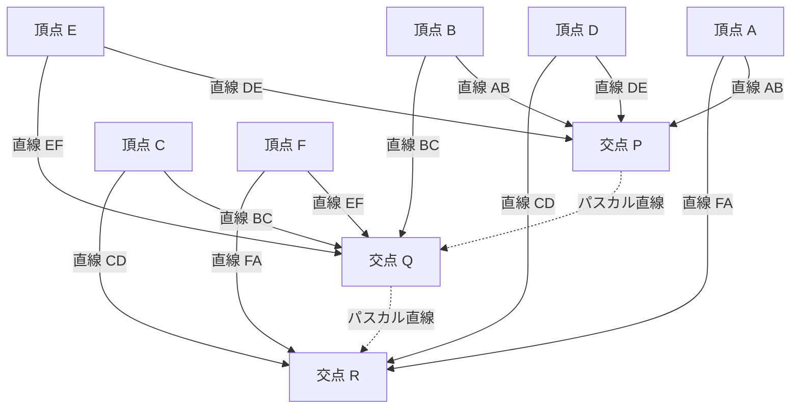

## 1. はじめに：わずか39年の生涯で世界を変えた天才

「人間は一茎の葦にすぎない。自然の中で最も弱いものである。だが、それは考える葦である。」
このあまりにも有名な言葉を残した[ブレーズ・パスカル](https://kenji.blog/p/pascal/)（[Blaise Pascal](https://kenji.blog/p/pascal/), 1623年6月19日 - 1662年8月19日）は、17世紀フランスを代表する知の巨人です。数学者、物理学者、哲学者、そしてキリスト教神学者として、多岐にわたる分野において人類の歴史に深く刻まれる偉大な業績を残しました。

彼の生涯は病魔との絶え間ない闘いであり、享年39歳という短さでした。しかし、その短い人生の間に、射影幾何学の基礎を築き、世界初の実用的な機械式計算機を発明し、確率論という新たな数学の分野を切り開き、さらには流体力学や気圧に関する物理学の根本原理を打ち立てました。本記事では、この早世の天才[パスカル](https://kenji.blog/p/pascal/)の生涯をたどりながら、彼がいかにしてこれらの画期的な発見に至ったのか、そして後世にどのような影響を与えたのかを詳細に掘り下げていきます。

## 2. 神童の誕生と特異な教育環境（1623年 - 1639年）

### 2.1. オーヴェルニュでの誕生と母の死
[ブレーズ・パスカル](https://kenji.blog/p/pascal/)は1623年、フランス中南部のオーヴェルニュ地方、クレルモン＝フェランで生まれました。父親のエティエンヌ・[パスカル](https://kenji.blog/p/pascal/)は、地域の徴税院長を務める有力者であり、同時に優れた数学者でもありました。[パスカル](https://kenji.blog/p/pascal/)一家は知的に非常に恵まれた環境にありましたが、ブレーズがわずか3歳の時、母親のアントワネットが亡くなります。父親のエティエンヌは再婚せず、ブレーズとその姉ジルベルト、妹ジャクリーヌの3人の子供たちの教育に専念することを決意しました。

### 2.2. パリへの移住とエティエンヌの教育方針
1631年、子供たちに最高の教育を受けさせるため、エティエンヌは一家を挙げてパリへ移住します。エティエンヌは当時の学校教育に不満を抱いており、自らが家庭教師となって子供たちを教える道を選びました。彼の教育方針は非常に独特で、「子供の理性が十分に発達するまでは、過度に抽象的な学問である数学を教えない」というものでした。語学や歴史を優先し、家の中から数学に関する書物を一切排除したのです。

しかし、この「禁止」が逆に若きブレーズの好奇心を強く刺激することになります。12歳の時、ブレーズは遊びの中で独力で幾何学の探求を始めました。床に炭で図形を描きながら、「三角形の内角の和は2直角（180度）に等しい」というエウクレイデス（[ユークリッド](https://kenji.blog/p/euclid/)）の『原論』における第32命題を自力で証明してしまったのです。この圧倒的な才能の片鱗を目の当たりにした父親は方針を転換し、彼に数学を学ぶことを許容し、[メルセンヌ](https://kenji.blog/p/mersenne/)神父が主催する当時のヨーロッパ最高の知識人たちの集まり（後のフランス科学アカデミーの前身）に彼を連れて行くようになりました。

## 3. 数学における革新的な業績

[パスカル](https://kenji.blog/p/pascal/)の数学的才能は、10代にして早くも開花します。彼の研究は、純粋数学から応用数学に至るまで幅広い領域に及びました。

### 3.1. 射影幾何学の開拓：[パスカル](https://kenji.blog/p/pascal/)の定理（神秘の六角形）

1639年、16歳の[パスカル](https://kenji.blog/p/pascal/)は、[メルセンヌ](https://kenji.blog/p/mersenne/)・アカデミーでジラール・デザルグの射影幾何学の著作に出会います。デザルグのアイデアを深く理解した[パスカル](https://kenji.blog/p/pascal/)は、円錐曲線に関する画期的な定理を発見し、それを一枚の紙面（エセー）にまとめて発表しました。これが今日「 **[パスカル](https://kenji.blog/p/pascal/)の定理** （[Pascal](https://kenji.blog/p/pascal/)'s theorem）」として知られるものです。

[パスカル](https://kenji.blog/p/pascal/)の定理は、円錐曲線（楕円、放物線、双曲線、および円）に内接する任意の六角形について成り立ちます。

> 定理：円錐曲線に内接する六角形の3組の対辺の延長線の交点は、すべて同一直線上（[パスカル](https://kenji.blog/p/pascal/)直線）にある。

数式を用いて交点を定義すると、以下のようになります。

$$
\text{交点 } P = AB \cap DE, \quad Q = BC \cap EF, \quad R = CD \cap FA \implies P, Q, R \text{ は同一直線上にある}
$$

この定理を図式化すると以下のようになります。

この発見は当時の数学界に大きな衝撃を与えました。大数学者[ルネ・デカルト](https://kenji.blog/p/descartes/)でさえ、16歳の少年がこれほど高度な証明を行ったことを信じず、「父親が書いたものに違いない」と疑ったという逸話が残されています。[パスカル](https://kenji.blog/p/pascal/)はこの定理から400以上の系を導き出し、当時の幾何学を大きく前進させました。

### 3.2. 世界初の機械式計算機「パスカリーヌ」

1639年、父親のエティエンヌはルーアンの徴税官に任命され、一家はルーアンへ移住します。父親は夜遅くまで膨大な税の計算に追われており、その姿を見た[パスカル](https://kenji.blog/p/pascal/)は、父親の負担を軽減するために計算を自動化する機械の開発に取り組みました。

1642年、19歳の[パスカル](https://kenji.blog/p/pascal/)は試行錯誤の末に、歯車を用いた機械式計算機「パスカリーヌ（[Pascal](https://kenji.blog/p/pascal/)ine）」を完成させます。これは、あらかじめ設定された歯車が回転することで加算と減算を自動で行う装置であり、特に「繰り上がり機構」を実用的なレベルで実装した世界初の計算機でした。パスカリーヌはその後数十台が製造され、フランス王室から特許も得ました。[パスカル](https://kenji.blog/p/pascal/)はソフトウェアエンジニアリングやハードウェア設計の歴史においても、最も初期のパイオニアの一人と見なされています。

### 3.3. [パスカル](https://kenji.blog/p/pascal/)の三角形と二項定理

[パスカル](https://kenji.blog/p/pascal/)の名前が最も広く知られている数学の概念が「 **[パスカル](https://kenji.blog/p/pascal/)の三角形** 」です。これは、二項展開における係数を幾何学的に三角形の形に配置したものです。中国の数学者である賈憲や楊輝、ペルシャのウマル・ハイヤームなどによって[パスカル](https://kenji.blog/p/pascal/)以前から知られていましたが、[パスカル](https://kenji.blog/p/pascal/)は1653年に著した『算術三角形論』において、この三角形の性質を体系的かつ詳細に研究しました。

[パスカル](https://kenji.blog/p/pascal/)の三角形は、上から $n$ 段目、左から $k$ 番目の数字が、二項係数 $\binom{n}{k}$ となるように構成されます。二項定理は以下のように表されます。

$$
(x + y)^n = \sum_{k=0}^{n} \binom{n}{k} x^{n-k} y^k = \sum_{k=0}^{n} \frac{n!}{k!(n-k)!} x^{n-k} y^k
$$

[パスカル](https://kenji.blog/p/pascal/)はこの三角形の各要素が、その真上にある2つの要素の和になるという基本的な性質（[パスカル](https://kenji.blog/p/pascal/)の法則： $\binom{n}{k} = \binom{n-1}{k-1} + \binom{n-1}{k}$ ）をはじめ、組み合わせ論や確率計算に応用するための多くの定理を証明しました。また、この研究の中で彼は数学的帰納法の原理を明確な形で定式化し、論証数学の手法を一層洗練させました。

### 3.4. 確率論の創設：[フェルマー](https://kenji.blog/p/fermat/)との書簡交歓

数学史において[パスカル](https://kenji.blog/p/pascal/)が果たした最も重要な役割の一つが、「確率論（Probability Theory）」の創設です。事の発端は1654年、ギャンブル好きの貴族であったシュヴァリエ・ド・メレ（Chevalier de Méré）が[パスカル](https://kenji.blog/p/pascal/)に持ちかけた「点数の問題（Problem of points）」でした。

**点数の問題** ：
> 実力が等しい2人のプレイヤーがゲームを行い、先に一定の勝数（例えば3勝）に達した者が掛け金を総取りする。しかし、一方のプレイヤーが2勝、もう一方が1勝した時点でゲームがやむを得ず中断されてしまった。この時、掛け金はどのように分配するのが最も公平か？

[パスカル](https://kenji.blog/p/pascal/)はこの難問に取り組むため、トゥールーズに住んでいたもう一人の天才数学者、[ピエール・ド・フェルマー](https://kenji.blog/p/fermat/)（[Pierre de Fermat](https://kenji.blog/p/fermat/)）に手紙を書き送ります。二人は全く異なるアプローチでこの問題の解法に到達しました。

- **[フェルマー](https://kenji.blog/p/fermat/)のアプローチ** ：考えうるすべての未来のシナリオ（樹形図）を列挙し、それぞれが起こる確率を計算して分配比率を決定する組み合わせ論的手法。
- **[パスカル](https://kenji.blog/p/pascal/)のアプローチ** ：現在の状態から次の1ゲームを行った際の「期待値（Expected value）」を計算し、それを再帰的に解いていく漸化式の手法。

[パスカル](https://kenji.blog/p/pascal/)の計算では、次のゲームで勝った場合と負けた場合のそれぞれの期待される獲得額を $E_{\text{win}}$ , $E_{\text{lose}}$ とすると、現在の期待値 $E$ は次のように表されます。

$$
E = \frac{1}{2} E_{\text{win}} + \frac{1}{2} E_{\text{lose}}
$$

二人が文通を通して導き出した結論は完全に一致し、この往復書簡こそが近代確率論の幕開けとなりました。偶然や不確実性という、それまで神の意志や運に帰せられていた事象を、数学の厳密な計算によって定量化できることを証明したのです。

## 4. 物理学への貢献：真空の証明と流体力学

[パスカル](https://kenji.blog/p/pascal/)の探求心は抽象的な数学にとどまらず、自然界の物理現象の解明にも向けられました。

### 4.1. 真空の存在証明（ピュイ＝ド＝ドームの実験）

当時の物理学界では、古代ギリシャのアリストテレスが提唱した「自然は真空を嫌う（Horror vacui）」という学説が絶対的な真理として信じられており、空間に何も存在しない「真空」が存在することはあり得ないと考えられていました。

しかし1643年、イタリアのエヴァンジェリスタ・トリチェリが水銀を満たしたガラス管を用いた実験を行い、管の上部に真空（トリチェリの真空）ができることを発見します。これを知った[パスカル](https://kenji.blog/p/pascal/)は、トリチェリの実験を精密に追試しました。彼は、管の上部にできる空間が本当に真空であるならば、それを支えているのは大気の重さ（気圧）であるはずだと仮説を立てました。

1648年、[パスカル](https://kenji.blog/p/pascal/)は義兄のフロラン・ペリエに依頼し、オーヴェルニュ地方のピュイ＝ド＝ドーム山（標高1465m）の山頂と麓で、水銀気圧計の高さがどのように変化するかを測定する大規模な実験を行いました。結果は[パスカル](https://kenji.blog/p/pascal/)の予想通り、山頂の方が麓よりも水銀柱の高さが低くなりました。これは、高い場所ほど上に乗っている大気の量が少なく、気圧が低くなるためです。

この劇的な実験結果により、気圧の存在が決定的に証明され、同時にアリストテレスの「自然は真空を嫌う」という教義は打ち破られました。大気圧の単位「ヘクト[パスカル](https://kenji.blog/p/pascal/)（hPa）」は、彼のこの偉大な業績を称えて名付けられたものです。

### 4.2. [パスカル](https://kenji.blog/p/pascal/)の原理

流体の圧力に関する研究を進める中で、彼は密閉された流体に関する基本的な法則を発見しました。これが「 **[パスカル](https://kenji.blog/p/pascal/)の原理** （[Pascal](https://kenji.blog/p/pascal/)'s principle）」です。

> 原理：密閉された静止流体の一部に加えられた圧力は、流体のすべての部分に、方向に関係なく同じ大きさで伝達される。

数式で表すと、2つのピストンの面積を $A_1, A_2$ 、加えられる力を $F_1, F_2$ とすると、圧力 $P$ は一定であるため、

$$
P = \frac{F_1}{A_1} = \frac{F_2}{A_2} \implies F_2 = F_1 \frac{A_2}{A_1}
$$

となります。断面積の小さなピストンに小さな力を加えることで、断面積の大きなピストンに巨大な力を生み出すことができるこの原理は、現代の油圧ジャッキや自動車の油圧ブレーキなど、あらゆる流体機械の基盤技術となっています。

## 5. 哲学・宗教思想への傾倒と『パンセ』

科学的真理の探求に没頭していた[パスカル](https://kenji.blog/p/pascal/)ですが、彼の内面では常に信仰への渇望がありました。彼の生涯の後半は、科学から離れ、哲学と神学の深い思索に捧げられました。

### 5.1. 火の夜とジャンセニスム

1654年11月23日、31歳の[パスカル](https://kenji.blog/p/pascal/)は馬車に乗っている際に、セーヌ川の橋で馬が暴走し、あわや転落して命を落としかけるという重大な事故に遭遇します。奇跡的に死を免れたこの夜、彼は神の圧倒的な臨在を感じる神秘体験（後に「火の夜」と呼ばれる）をしました。彼はその時の感動を一枚の羊皮紙に書き記し、生涯にわたって自身の衣服の裏地に縫い付けて肌身離さず持ち歩きました。

この体験を機に、彼は世俗的な科学研究から身を引き、カトリック教会内部の厳格な改革運動である「ジャンセニスム（Jansenism）」の中心地、ポール・ロワヤル修道院の隠遁者たちと深い交わりを持つようになります。

### 5.2. サイクロイドの数学（晩年の例外的な研究）

宗教に没頭していた[パスカル](https://kenji.blog/p/pascal/)ですが、一度だけ数学の研究に復帰したことがあります。1658年、激しい歯痛に悩まされていた[パスカル](https://kenji.blog/p/pascal/)は、気を紛らわせるために「サイクロイド（Cycloid：円が直線上を転がるときに円周上の点が描く軌跡）」に関する数学的問題を考え始めました。すると不思議なことに痛みが消え去り、これを神からの啓示と受け取った[パスカル](https://kenji.blog/p/pascal/)は、わずか8日間のうちにサイクロイドの面積、重心、回転体の体積などを求めるための革新的な解法を発見しました。

彼はアモス・デトンヴィル（Amos Dettonville）という偽名でこの問題に関する懸賞論文を出し、自らも完璧な解答を出版しました。彼がここで用いた「不可分量の手法」は、後のアイザック・[ニュートン](https://kenji.blog/p/newton/)やゴットフリート・[ライプニッツ](https://kenji.blog/p/leibniz/)による微分積分学の発見への重要な架け橋となりました。

### 5.3. [パスカル](https://kenji.blog/p/pascal/)の賭けと意思決定理論

[パスカル](https://kenji.blog/p/pascal/)は、神の存在を理屈や理性で完全に証明することは不可能であると考えました。しかし、彼は確率論の創設者らしいアプローチで、信仰の合理性を論じました。これが「 **[パスカル](https://kenji.blog/p/pascal/)の賭け** （[Pascal](https://kenji.blog/p/pascal/)'s Wager）」です。

彼は、神が存在するかどうか確信が持てない人間にとって、「神を信じる」ことと「神を信じない」ことのどちらが期待値が高いかを分析しました。

- 神が存在し、神を信じた場合：無限の幸福（天国）を得る。
- 神が存在し、神を信じなかった場合：無限の罰（地獄）を受ける。
- 神が存在せず、神を信じた場合：限られた現世の楽しみを少し失うだけ。
- 神が存在せず、神を信じなかった場合：限られた現世の楽しみを得る。

これを期待値で計算すると、神が存在する確率がどれほど低くても（ゼロでない限り）、神を信じた場合の期待値は「無限大」になります。したがって、合理的な人間であれば、神が存在する方に賭ける（信じる）べきである、と論じました。この議論は、現代のゲーム理論や意思決定理論の先駆けとして評価されています。

### 5.4. 『パンセ』と「考える葦」

[パスカル](https://kenji.blog/p/pascal/)は晩年、無神論者や懐疑主義者をキリスト教信仰に導くための壮大な『キリスト教弁証論』の執筆に取り掛かりました。しかし、幼い頃からの虚弱体質と過労が祟り、体調は急激に悪化します。激しい頭痛と胃の痛みに苦しみながらも、彼は思い浮かんだ断片的な思索を次々と紙片に書き留めていきました。

1662年8月19日、[パスカル](https://kenji.blog/p/pascal/)は39歳でこの世を去りました。彼が遺した約1000枚にも及ぶ断片的なメモは、死後、ポール・ロワヤルの友人たちによって編纂され、『パンセ（Pensées：「思考」「思想」の意）』として出版されました。

『パンセ』に収められた数々の断章の中でも、とりわけ有名なのが以下の言葉です。

> 人間は一茎の葦にすぎない。自然の中で最も弱いものである。だが、それは考える葦である。彼を押しつぶすために、宇宙全体が武装する必要はない。蒸気の一吹き、水の一滴だけで彼を殺すのに十分である。しかし、宇宙が彼を押しつぶす時でさえ、人間は彼を殺すものよりも尊いだろう。なぜなら、人間は自分が死ぬこと、そして宇宙が自分に対して優位にあることを知っているからだ。宇宙は何も知らない。
>
> したがって、我々のすべての尊厳は、思考の中にある。（『パンセ』断章347より）

[パスカル](https://kenji.blog/p/pascal/)は、大宇宙の圧倒的な広大さと力に比べれば、人間の肉体は一本の葦のように脆く儚い存在であると直視しました。しかし同時に、自らの限界や悲惨さを「思考」し、自覚することができる点にこそ、人間の絶対的な尊厳と偉大さがあるのだと高らかに宣言したのです。

## 6. おわりに：現代に生き続ける[パスカル](https://kenji.blog/p/pascal/)の遺産

[ブレーズ・パスカル](https://kenji.blog/p/pascal/)が駆け抜けた39年という歳月は、あまりにも短く、そして病による苦痛に満ちたものでした。しかし、彼の研ぎ澄まされた直観と深遠な思考は、数学、物理学、工学、そして哲学という枠組みを軽々と飛び越え、人類の知の地平を大きく押し広げました。

現代の私たちが日常的に利用している天気予報の気圧データ（ヘクト[パスカル](https://kenji.blog/p/pascal/)）、自動車のブレーキ（[パスカル](https://kenji.blog/p/pascal/)の原理）、保険や金融のリスク評価（確率論）、さらにはコンピュータのアーキテクチャの根底にも、彼が蒔いた種が息づいています。1970年にニクラウス・ヴィルトによって開発されたプログラミング言語「[Pascal](https://kenji.blog/p/pascal/)」は、世界初の計算機を作った彼に敬意を表して名付けられました。

「人間は考える葦である」。この言葉は、AI（人工知能）が発達し、人間の「思考」の価値が改めて問われ直している現代において、より一層深い響きを持って私たちに語りかけてきます。[パスカル](https://kenji.blog/p/pascal/)の生涯と思想は、技術がどれほど進歩しようとも、人間の本質とその尊厳がどこにあるのかを、常に私たちに問いかけ続けているのです。
