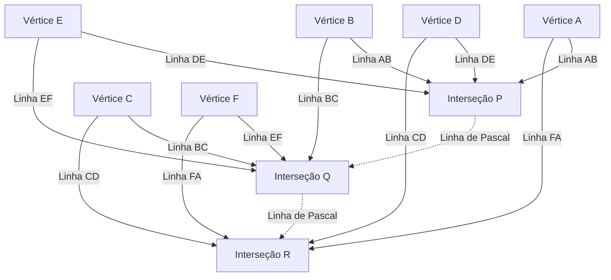

## 1. Introdução: O gênio que mudou o mundo em apenas 39 anos de vida

"O homem não é senão um caniço, o mais fraco da natureza; mas é um caniço pensante."
[Blaise Pascal](https://kenji.blog/pt/p/pascal/) (19 de junho de 1623 - 19 de agosto de 1662), que deixou esta famosa citação, é um gigante do intelecto representando a França do século XVII. Como matemático, físico, filósofo e teólogo cristão, deixou realizações monumentais profundamente gravadas na história humana em vários campos.

Sua vida foi uma batalha constante contra a doença, e ele faleceu precocemente aos 39 anos. No entanto, durante esta curta vida, ele lançou as bases da geometria projetiva, inventou a primeira calculadora mecânica prática do mundo, foi pioneiro no novo campo matemático da teoria da probabilidade e estabeleceu princípios fundamentais da física a respeito da mecânica dos fluidos e da pressão atmosférica. Este artigo detalha a vida deste gênio que partiu cedo, como ele chegou a essas descobertas inovadoras e o profundo impacto que teve nas gerações subsequentes.

## 2. Nascimento de um prodígio e um ambiente educacional único (1623 - 1639)

### 2.1. Nascimento em Auvergne e a morte de sua mãe
[Blaise Pascal](https://kenji.blog/pt/p/pascal/) nasceu em 1623 em Clermont-Ferrand, Auvergne, no centro-sul da França. Seu pai, Étienne Pascal, era uma figura proeminente servindo como presidente do Tribunal das Ajudas (tribunal de impostos) local e também era um excelente matemático. A família [Pascal](https://kenji.blog/pt/p/pascal/) estava em um ambiente intelectual altamente privilegiado, mas quando Blaise tinha apenas três anos, sua mãe, Antoinette, faleceu. Seu pai Étienne decidiu não se casar novamente e dedicou-se inteiramente à educação de seus três filhos: Blaise, sua irmã mais velha Gilberte, e sua irmã mais nova Jacqueline.

### 2.2. Mudança para Paris e a política educacional de Étienne
Em 1631, para proporcionar aos seus filhos a melhor educação possível, Étienne mudou-se com a família para Paris. Insatisfeito com a educação escolar da época, Étienne escolheu tornar-se ele mesmo um tutor particular de seus filhos. Sua política educacional era muito singular: "Não ensinar matemática, que é uma matéria muito abstrata, até que a razão da criança esteja suficientemente desenvolvida". Ele priorizou idiomas e história, e eliminou todos os livros de matemática da casa.

No entanto, essa "proibição" paradoxalmente estimulou intensamente a curiosidade do jovem Blaise. Aos 12 anos, Blaise começou a explorar a geometria por conta própria durante suas brincadeiras. Desenhando figuras no chão com carvão, ele provou de forma independente a 32ª proposição dos *Elementos* de [Euclides](https://kenji.blog/p/euclid/): "A soma dos ângulos internos de um triângulo é igual a dois ângulos retos (180 graus)". Testemunhando este vislumbre avassalador de talento, seu pai mudou de política, permitiu que ele estudasse matemática e começou a levá-lo às reuniões dos maiores intelectuais da Europa organizadas pelo Padre [Mersenne](https://kenji.blog/pt/p/mersenne/) (o predecessor da Academia de Ciências da França).

## 3. Realizações inovadoras na matemática

O talento matemático de [Pascal](https://kenji.blog/pt/p/pascal/) floresceu no início de sua adolescência. Sua pesquisa abrangeu uma ampla gama de áreas, desde a matemática pura até a matemática aplicada.

### 3.1. Pioneiro da geometria projetiva: O teorema de [Pascal](https://kenji.blog/pt/p/pascal/) (Hexagrama Místico)

Em 1639, [Pascal](https://kenji.blog/pt/p/pascal/), de 16 anos, deparou-se com os trabalhos de geometria projetiva de Girard Desargues na Academia Mersenne. Compreendendo profundamente as ideias de Desargues, Pascal descobriu um teorema inovador a respeito das seções cônicas e publicou-o em uma única folha de papel (ensaio). Isto é conhecido hoje como o **teorema de [Pascal](https://kenji.blog/pt/p/pascal/)**.

O teorema de [Pascal](https://kenji.blog/pt/p/pascal/) é válido para qualquer hexágono inscrito em uma seção cônica (elipse, parábola, hipérbole e círculo).

> Teorema: Se um hexágono está inscrito em uma seção cônica, os três pontos de interseção dos lados opostos estão em uma única linha reta (linha de [Pascal](https://kenji.blog/pt/p/pascal/)).

Definindo os pontos de interseção usando fórmulas matemáticas:

$$
\text{Interseção } P = AB \cap DE, \quad Q = BC \cap EF, \quad R = CD \cap FA \implies P, Q, R \text{ são colineares}
$$

A esquematização deste teorema produz o seguinte diagrama:

Esta descoberta enviou uma onda de choque massiva através da comunidade matemática da época. Existe uma anedota de que mesmo o grande matemático [René Descartes](https://kenji.blog/pt/p/descartes/) se recusou a acreditar que um garoto de 16 anos tivesse produzido uma prova tão avançada, suspeitando que "deveria ter sido escrita pelo pai". [Pascal](https://kenji.blog/pt/p/pascal/) derivou mais de 400 corolários deste teorema, avançando significativamente a geometria de seu tempo.

### 3.2. A primeira calculadora mecânica do mundo: "[Pascal](https://kenji.blog/pt/p/pascal/)ine"

Em 1639, seu pai Étienne foi nomeado comissário de impostos em Rouen, e a família mudou-se para lá. Vendo seu pai sobrecarregado por imensos cálculos de impostos tarde da noite, [Pascal](https://kenji.blog/pt/p/pascal/) propôs-se a desenvolver uma máquina para automatizar cálculos e aliviar o fardo de seu pai.

Em 1642, após muitas tentativas e erros, [Pascal](https://kenji.blog/pt/p/pascal/), aos 19 anos, completou uma calculadora mecânica usando engrenagens, chamada "Pascaline". Este dispositivo realizava automaticamente adições e subtrações à medida que as engrenagens pré-definidas giravam, e notavelmente, foi uma das primeiras calculadoras do mundo a implementar um "mecanismo de transporte" prático. Dezenas de Pascalines foram fabricadas subsequentemente, e ele chegou a obter uma patente da realeza francesa. [Pascal](https://kenji.blog/pt/p/pascal/) é considerado um dos primeiros pioneiros na história da engenharia de software e projeto de hardware.

### 3.3. O triângulo de [Pascal](https://kenji.blog/pt/p/pascal/) e o teorema binomial

O conceito matemático pelo qual o nome de [Pascal](https://kenji.blog/pt/p/pascal/) é mais amplamente conhecido é o **triângulo de Pascal**. Trata-se de um arranjo geométrico dos coeficientes de uma expansão binomial em forma de triângulo. Embora fosse conhecido antes de Pascal por matemáticos como Jia Xian e Yang Hui na China, e Omar Khayyam na Pérsia, Pascal estudou sistemática e minuciosamente as propriedades deste triângulo em seu *Tratado sobre o [Tri](https://kenji.blog/pt/p/sorting-algorithms/)ângulo Aritmético* de 1653.

O triângulo de [Pascal](https://kenji.blog/pt/p/pascal/) é construído de tal forma que o número na $n$-ésima linha a partir do topo e na $k$-ésima posição a partir da esquerda é o coeficiente binomial $\binom{n}{k}$. O teorema binomial é expresso da seguinte forma:

$$
(x + y)^n = \sum_{k=0}^{n} \binom{n}{k} x^{n-k} y^k = \sum_{k=0}^{n} \frac{n!}{k!(n-k)!} x^{n-k} y^k
$$

[Pascal](https://kenji.blog/pt/p/pascal/) provou muitos teoremas para aplicar este triângulo à combinatória e cálculos de probabilidade, começando pela propriedade fundamental de que cada elemento no triângulo é a soma dos dois elementos diretamente acima dele (regra de [Pascal](https://kenji.blog/pt/p/pascal/): $\binom{n}{k} = \binom{n-1}{k-1} + \binom{n-1}{k}$). Nesta pesquisa, ele também formulou claramente o princípio da indução matemática, refinando ainda mais os métodos da matemática dedutiva.

### 3.4. Fundação da teoria da probabilidade: Correspondência com [Fermat](https://kenji.blog/pt/p/fermat/)

Um dos papéis mais cruciais de [Pascal](https://kenji.blog/pt/p/pascal/) na história da matemática foi a fundação da teoria da probabilidade. Começou em 1654, quando Antoine Gombaud, Chevalier de Méré, um nobre que gostava de jogar, apresentou a [Pascal](https://kenji.blog/pt/p/pascal/) o "Problema dos pontos".

**O Problema dos Pontos**:
> Dois jogadores de habilidade igual jogam um jogo onde o primeiro a alcançar um certo número de vitórias (por exemplo, 3 vitórias) leva todo o prêmio. No entanto, o jogo é forçado a parar quando um jogador tem 2 vitórias e o outro tem 1 vitória. Como o prêmio deve ser distribuído da forma mais justa neste ponto?

Para resolver este problema difícil, [Pascal](https://kenji.blog/pt/p/pascal/) escreveu cartas a [Pierre de Fermat](https://kenji.blog/pt/p/fermat/), outro gênio da matemática que vivia em Toulouse. Os dois chegaram à solução através de abordagens totalmente diferentes.

- **A Abordagem de [Fermat](https://kenji.blog/pt/p/fermat/)**: Um método combinatório que lista todos os cenários futuros possíveis (diagrama de árvore) e calcula a probabilidade de cada um ocorrer para determinar a proporção de distribuição.
- **A Abordagem de [Pascal](https://kenji.blog/pt/p/pascal/)**: Um método recursivo que calcula o "Valor esperado" de jogar o próximo jogo individual a partir do estado atual e o resolve recursivamente.

No cálculo de [Pascal](https://kenji.blog/pt/p/pascal/), se os ganhos esperados por ganhar ou perder o próximo jogo são $E_{\text{ganhar}}$ e $E_{\text{perder}}$ respectivamente, o valor esperado atual $E$ é expresso da seguinte forma:

$$
E = \frac{1}{2} E_{\text{ganar}} + \frac{1}{2} E_{\text{perder}}
$$

As conclusões a que os dois chegaram através de sua correspondência coincidiram perfeitamente, e essas cartas trocadas marcaram o alvorecer da teoria da probabilidade moderna. Eles provaram que o acaso e a incerteza, anteriormente atribuídos à vontade divina ou à sorte, poderiam ser quantificados por rigorosos cálculos matemáticos.

## 4. Contribuições à física: Prova do vácuo e mecânica dos fluidos

A mente inquisitiva de [Pascal](https://kenji.blog/pt/p/pascal/) não se limitou à matemática abstrata; também foi direcionada para elucidar fenômenos físicos no mundo natural.

### 4.1. Prova da Existência do Vácuo (O Experimento Puy de Dôme)

Na comunidade física da época, a teoria proposta pelo grego antigo Aristóteles de que "a natureza abomina o vácuo (Horror vacui)" era acreditada como uma verdade absoluta, e considerava-se impossível que um "vácuo" sem nada no espaço pudesse existir.

No entanto, em 1643, o italiano Evangelista Torricelli conduziu um experimento usando um tubo de vidro cheio de mercúrio e descobriu que um vácuo (vácuo torricelliano) se formou no topo do tubo. Ao saber disso, [Pascal](https://kenji.blog/pt/p/pascal/) replicou rigorosamente o experimento de Torricelli. Ele formulou a hipótese de que, se o espaço formado no topo do tubo fosse verdadeiramente um vácuo, então o que o sustentava devia ser o peso da atmosfera (pressão atmosférica).

Em 1648, [Pascal](https://kenji.blog/pt/p/pascal/) pediu ao seu cunhado, Florin Périer, que conduzisse um experimento em grande escala medindo como a altura de um barômetro de mercúrio mudava entre o cume e a base da montanha Puy de Dôme (altitude de 1465 m) na região de Auvergne. O resultado, exatamente como [Pascal](https://kenji.blog/pt/p/pascal/) previu, foi que a coluna de mercúrio era mais baixa no cume do que na base. Isso ocorre porque em altitudes mais elevadas, há menos atmosfera descansando acima, resultando em menor pressão atmosférica.

Este dramático resultado experimental provou definitivamente a existência da pressão atmosférica e, simultaneamente, destruiu o dogma aristotélico de que "a natureza abomina o vácuo". A unidade de pressão atmosférica, "hectopascal (hPa)", foi nomeada em homenagem à sua grande realização.

### 4.2. O princípio de [Pascal](https://kenji.blog/pt/p/pascal/)

À medida que avançava em sua pesquisa sobre a pressão dos fluidos, ele descobriu uma lei fundamental sobre os fluidos confinados. Este é o **princípio de [Pascal](https://kenji.blog/pt/p/pascal/)**.

> Princípio: A pressão exercida sobre um fluido estático confinado é transmitida uniformemente e sem diminuição para todas as partes do fluido e para as paredes do recipiente que o contém, independentemente da direção.

Expresso matematicamente, se as áreas de dois pistões são $A_1$ e $A_2$, e as forças aplicadas são $F_1$ e $F_2$, visto que a pressão $P$ é constante:

$$
P = \frac{F_1}{A_1} = \frac{F_2}{A_2} \implies F_2 = F_1 \frac{A_2}{A_1}
$$

Este princípio, que permite gerar uma força massiva em um pistão com uma área de seção transversal grande pela aplicação de uma pequena força em um pistão com uma área de seção transversal pequena, é a tecnologia fundamental para todas as máquinas de fluidos modernas, como macacos hidráulicos e freios hidráulicos de automóveis.

## 5. Devoção à filosofia e pensamento religioso, e os 'Pensamentos'

Embora [Pascal](https://kenji.blog/pt/p/pascal/) estivesse profundamente imerso na busca da verdade científica, ele sempre teve uma sede interior de fé. A última metade de sua vida foi dedicada à profunda contemplação filosófica e teológica, longe da ciência.

### 5.1. A Noite de Fogo e o Jansenismo

Na noite de 23 de novembro de 1654, [Pascal](https://kenji.blog/pt/p/pascal/), de 31 anos, envolveu-se em um grave acidente quando os cavalos de sua carruagem dispararam sobre uma ponte no Sena, quase o precipitando para a morte. Escapando milagrosamente da morte, naquela noite ele experimentou um encontro místico (mais tarde chamado de a "Noite de Fogo") onde ele sentiu a presença avassaladora de Deus. Ele escreveu sua profunda emoção em um pedaço de pergaminho e o costurou no forro de seu casaco, carregando-o sempre consigo pelo resto de sua vida.

Após essa experiência, ele retirou-se da pesquisa científica secular e desenvolveu laços profundos com os eremitas da abadia de Port-Royal, o centro do "Jansenismo", um rigoroso movimento de reforma dentro da Igreja Católica.

### 5.2. A Matemática da Cicloide (Um estudo excepcional na vida tardia)

Apesar de devotado à religião, [Pascal](https://kenji.blog/pt/p/pascal/) retornou à pesquisa matemática apenas uma vez. Em 1658, sofrendo de fortes dores de dente, Pascal começou a pensar sobre problemas matemáticos relativos à "Cicloide (a trajetória desenhada por um ponto na circunferência de um círculo enquanto ele rola ao longo de uma linha reta)" para se distrair. Misteriosamente, a dor desapareceu, o que [Pascal](https://kenji.blog/pt/p/pascal/) tomou como uma revelação divina. Em apenas oito dias, ele descobriu métodos inovadores para encontrar a área, o centro de gravidade e o volume de sólidos de revolução da cicloide.

Ele anunciou um concurso de prêmios em relação a este problema sob o pseudônimo de Amos Dettonville, e publicou soluções perfeitas ele mesmo. O "método dos indivisíveis" que ele empregou aqui serviu como uma ponte essencial para a descoberta do cálculo por [Isaac Newton](https://kenji.blog/pt/p/newton/) e Gottfried Wilhelm Leibniz mais tarde.

### 5.3. A Aposta de [Pascal](https://kenji.blog/pt/p/pascal/) e a Teoria da Decisão

[Pascal](https://kenji.blog/pt/p/pascal/) acreditava que era impossível provar completamente a existência de Deus através da lógica ou da razão. No entanto, ele argumentou a favor da racionalidade da fé com uma abordagem característica do fundador da teoria da probabilidade. Esta é a **Aposta de [Pascal](https://kenji.blog/pt/p/pascal/)**.

Ele analisou se é de um valor esperado mais alto "acreditar em Deus" ou "não acreditar em Deus" para os humanos que não têm certeza se Deus existe.

- Se Deus existe e você acredita n'Ele: Você ganha felicidade infinita (Paraíso).
- Se Deus existe e você não acredita n'Ele: Você recebe punição infinita (Inferno).
- Se Deus não existe e você acredita n'Ele: Você só perde alguns limitados prazeres mundanos.
- Se Deus não existe e você não acredita n'Ele: Você ganha limitados prazeres mundanos.

Calculando isso com valores esperados, não importa quão baixa a probabilidade da existência de Deus possa ser (desde que não seja zero), o valor esperado de acreditar em Deus torna-se "infinito". Portanto, ele argumentou que uma pessoa racional deveria apostar (acreditar) que Deus existe. Este argumento é muito conceituado como um precursor da moderna teoria dos jogos e da teoria da decisão.

### 5.4. Os 'Pensamentos' e o "caniço pensante"

Em seus últimos anos, [Pascal](https://kenji.blog/pt/p/pascal/) começou a escrever uma grandiosa 'Apologia da Religião Cristã' para guiar ateus e céticos à fé cristã. No entanto, sua constituição, frágil desde a infância, e o excesso de trabalho cobraram seu preço, e sua saúde se deteriorou rapidamente. Suportando fortes dores de cabeça e de estômago, ele foi anotando sequencialmente pensamentos fragmentados em pedaços de papel à medida que lhe vinham à mente.

Em 19 de agosto de 1662, [Pascal](https://kenji.blog/pt/p/pascal/) faleceu aos 39 anos. As aproximadamente 1.000 notas fragmentadas que ele deixou para trás foram compiladas e publicadas por seus amigos em Port-Royal após sua morte como *Pensamentos* (*Pensées*).

Entre os numerosos fragmentos coletados nos *Pensamentos*, a seguinte citação é particularmente famosa:

> O homem não é senão um caniço, o mais fraco da natureza; mas é um caniço pensante. Não é preciso que o universo inteiro se arme para esmagá-lo. Um vapor, uma gota de água basta para matá-lo. Mas, mesmo que o universo o esmagasse, o homem seria ainda mais nobre do que aquilo que o mata, porque sabe que morre e a vantagem que o universo tem sobre ele; o universo nada sabe disso.
>
> Toda a nossa dignidade consiste, pois, no pensamento. (Dos *Pensamentos*, Fragmento 347)

[Pascal](https://kenji.blog/pt/p/pascal/) enfrentou o fato de que, em comparação com a esmagadora vastidão e o poder do macrocosmo, o corpo humano é tão frágil e fugaz quanto um único caniço. No entanto, ao mesmo tempo, ele declarou orgulhosamente que a dignidade absoluta e a grandeza da humanidade residem precisamente na capacidade de "pensar" e estar consciente de suas próprias limitações e misérias.

## 6. Conclusão: O Legado de [Pascal](https://kenji.blog/pt/p/pascal/) Vivo Hoje

Os 39 anos por que passou [Blaise Pascal](https://kenji.blog/pt/p/pascal/) foram no todo demasiado curtos e cheios da agonia da doença. No entanto, a sua intuição afiada e o pensamento profundo saltaram sem esforço os limites da matemática, física, engenharia e filosofia, expandindo enormemente os horizontes do conhecimento humano.

As sementes que semeou dão vida aos dados da pressão atmosférica (hectopascal) que usamos diariamente nas previsões meteorológicas, nos travões dos automóveis (princípio de [Pascal](https://kenji.blog/pt/p/pascal/)), na avaliação de riscos em seguros e finanças (teoria da probabilidade), e até nas próprias fundações da arquitetura informática. A linguagem de programação "[Pascal](https://kenji.blog/pt/p/pascal/)", desenvolvida por Niklaus Wirth em 1970, foi nomeada em homenagem a ele, o criador da primeira calculadora do mundo.

"O homem é um caniço pensante". Na nossa era moderna, onde a IA (Inteligência Artificial) está a desenvolver-se e o valor do "pensamento" humano está a ser questionado novamente, estas palavras falam para nós com uma ressonância ainda mais profunda. Não importa o quanto a tecnologia avance, a vida e a filosofia de [Pascal](https://kenji.blog/pt/p/pascal/) continuam a perguntar-nos constantemente onde residem verdadeiramente a essência da humanidade e a sua dignidade.
