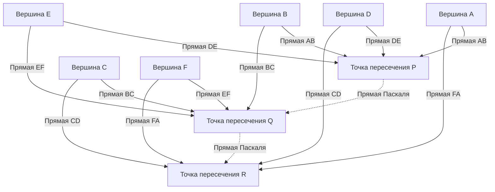

## 1. Введение: Гений, изменивший мир всего за 39 лет жизни

«Человек — всего лишь тростник, самый слабый в природе, но это мыслящий тростник».
[Блез Паскаль](https://kenji.blog/ru/p/pascal/) (19 июня 1623 г. – 19 августа 1662 г.), оставивший это знаменитое высказывание, является гигантом мысли, представляющим Францию 17 века. Как математик, физик, философ и христианский богослов, он оставил монументальные достижения, глубоко вписанные в историю человечества в различных областях.

Его жизнь была постоянной борьбой с болезнями, и он скончался в раннем возрасте 39 лет. Однако за эту короткую жизнь он заложил основы проективной геометрии, изобрел первый в мире практичный механический калькулятор, стал пионером в новой математической области — теории вероятностей, а также установил фундаментальные принципы физики, касающиеся гидромеханики и атмосферного давления. В этой статье подробно рассказывается о жизни этого рано ушедшего гения, о том, как он пришел к этим новаторским открытиям, и о глубоком влиянии, которое он оказал на последующие поколения.

## 2. Рождение вундеркинда и уникальная образовательная среда (1623 – 1639)

### 2.1. Рождение в Оверни и смерть матери
[Блез Паскаль](https://kenji.blog/ru/p/pascal/) родился в 1623 году в Клермон-Ферране, регион Овернь на юге центральной Франции. Его отец, Этьен Паскаль, был видным деятелем, занимавшим пост председателя местного налогового управления, а также отличным математиком. Семья Паскалей находилась в очень привилегированной интеллектуальной среде, но когда Блезу было всего три года, его мать Антуанетта умерла. Этьен решил больше не жениться и полностью посвятил себя образованию троих детей: Блеза, его старшей сестры Жильберты и младшей сестры Жаклин.

### 2.2. Переезд в Париж и образовательная политика Этьена
В 1631 году, чтобы дать своим детям лучшее из возможных образований, Этьен перевез семью в Париж. Неудовлетворенный школьным образованием того времени, Этьен решил сам стать частным репетитором для своих детей. Его образовательная политика была весьма уникальной: «Не обучать математике, которая является слишком абстрактным предметом, пока разум ребенка не будет достаточно развит». Он отдавал приоритет языкам и истории, и убрал из дома все математические книги.

Однако этот «запрет» парадоксальным образом сильно стимулировал любопытство юного Блеза. В возрасте 12 лет Блез начал самостоятельно изучать геометрию во время игр. Рисуя фигуры на полу углем, он самостоятельно доказал 32-е предложение в *Началах* [Евклид](https://kenji.blog/ru/p/euclid/)а: «Сумма внутренних углов треугольника равна двум прямым углам (180 градусов)». Став свидетелем этого ошеломляющего проявления таланта, отец изменил свою политику, разрешил ему изучать математику и начал брать его на собрания величайших интеллектуалов Европы, устраиваемые отцом Мерсенном (предшественник Французской академии наук).

## 3. Новаторские достижения в математике

Математический талант Паскаля расцвел рано, еще в подростковом возрасте. Его исследования охватывали широкий спектр областей, от чистой до прикладной математики.

### 3.1. Пионер проективной геометрии: Теорема Паскаля (Мистический гексаграмма)

В 1639 году 16-летний Паскаль познакомился с работами Жирара Дезарга по проективной геометрии в академии Мерсенна. Глубоко поняв идеи Дезарга, Паскаль открыл новаторскую теорему о конических сечениях и опубликовал ее на одном листе бумаги (эссе). Сегодня это известно как **теорема Паскаля**.

Теорема Паскаля справедлива для любого шестиугольника, вписанного в коническое сечение (эллипс, парабола, гипербола и окружность).

> Теорема: Если шестиугольник вписан в коническое сечение, то три точки пересечения противоположных сторон лежат на одной прямой (прямая Паскаля).

Определение точек пересечения с использованием математических формул:

$$
\text{Точка пересечения } P = AB \cap DE, \quad Q = BC \cap EF, \quad R = CD \cap FA \implies P, Q, R \text{ коллинеарны}
$$

Схематизация этой теоремы дает следующую диаграмму:

Это открытие вызвало огромный шок в математическом сообществе того времени. Существует анекдот, что даже великий математик [Рене Декарт](https://kenji.blog/ru/p/descartes/) отказался поверить, что 16-летний юноша мог привести столь сложное доказательство, подозревая, что «оно, должно быть, было написано отцом». Из этой теоремы Паскаль вывел более 400 следствий, значительно продвинув геометрию своего времени.

### 3.2. Первый в мире механический калькулятор: «Паскалина»

В 1639 году его отец Этьен был назначен сборщиком налогов в Руане, и семья переехала туда. Видя, как отец до глубокой ночи обременен огромными налоговыми расчетами, Паскаль взялся за разработку машины для автоматизации расчетов и облегчения бремени отца.

В 1642 году, после множества проб и ошибок, 19-летний Паскаль завершил создание механического калькулятора на зубчатых колесах, названного «Паскалина». Это устройство автоматически выполняло сложение и вычитание по мере вращения заданных зубчатых колес, и, что примечательно, это был один из первых калькуляров в мире, в котором был реализован практичный «механизм переноса». Впоследствии были изготовлены десятки Паскалин, и он даже получил патент от французской королевской семьи. Паскаль считается одним из самых ранних пионеров в истории разработки программного обеспечения и проектирования аппаратного обеспечения.

### 3.3. Треугольник Паскаля и бином Ньютона

Математическая концепция, благодаря которой имя Паскаля известно наиболее широко, — это **треугольник Паскаля**. Это геометрическое расположение коэффициентов биномиального разложения в форме треугольника. Хотя оно было известно до Паскаля таким математикам, как Цзя Сянь и Ян Хуэй в Китае, и Омару Хайяму в Персии, Паскаль систематически и тщательно изучил свойства этого треугольника в своем *Трактате об арифметическом треугольнике* 1653 года.

Треугольник Паскаля строится таким образом, что число в $n$-й строке сверху и на $k$-й позиции слева является биномиальным коэффициентом $\binom{n}{k}$. Бином Ньютона (биномиальная теорема) выражается следующим образом:

$$
(x + y)^n = \sum_{k=0}^{n} \binom{n}{k} x^{n-k} y^k = \sum_{k=0}^{n} \frac{n!}{k!(n-k)!} x^{n-k} y^k
$$

Паскаль доказал множество теорем для применения этого треугольника к комбинаторике и расчетам вероятностей, начиная с фундаментального свойства, согласно которому каждый элемент в треугольнике является суммой двух элементов, находящихся непосредственно над ним (правило Паскаля: $\binom{n}{k} = \binom{n-1}{k-1} + \binom{n-1}{k}$). В этом исследовании он также четко сформулировал принцип математической индукции, еще больше усовершенствовав методы дедуктивной математики.

### 3.4. Основание теории вероятностей: Переписка с Ферма

Одной из наиболее важных ролей Паскаля в истории математики было основание теории вероятностей. Все началось в 1654 году, когда Антуан Гомбо, шевалье де Мере, дворянин, любивший азартные игры, предложил Паскалю «Задачу о разделении ставки».

**Задача о разделении ставки**:
> Два игрока равного мастерства играют в игру, в которой тот, кто первым одержит определенное количество побед (например, 3 победы), забирает весь призовой фонд. Однако игра вынужденно останавливается, когда у одного игрока 2 победы, а у другого 1 победа. Как следует распределить призовой фонд наиболее справедливым образом в этот момент?

Чтобы решить эту сложную проблему, Паскаль написал письма Пьеру де Ферма, еще одному гениальному математику, жившему в Тулузе. Эти двое пришли к решению совершенно разными путями.

- **Подход Ферма**: Комбинаторный метод, в котором перечисляются все возможные будущие сценарии (древовидная диаграмма) и рассчитывается вероятность возникновения каждого из них для определения коэффициента распределения.
- **Подход Паскаля**: Рекурсивный метод, который вычисляет «Ожидаемое значение» (Математическое ожидание) розыгрыша следующей одиночной игры из текущего состояния и решает его рекурсивно.

В расчетах Паскаля, если ожидаемый выигрыш от победы или поражения в следующей игре составляет $E_{\text{победа}}$ и $E_{\text{поражение}}$ соответственно, текущее ожидаемое значение $E$ выражается следующим образом:

$$
E = \frac{1}{2} E_{\text{победа}} + \frac{1}{2} E_{\text{поражение}}
$$

Выводы, к которым они оба пришли благодаря своей переписке, идеально совпали, и эти письма ознаменовали рассвет современной теории вероятностей. Они доказали, что случайность и неопределенность, ранее приписываемые божественной воле или удаче, могут быть количественно оценены путем строгих математических расчетов.

## 4. Вклад в физику: Доказательство существования вакуума и гидромеханика

Пытливый ум Паскаля не ограничивался абстрактной математикой; он также был направлен на выяснение физических явлений в мире природы.

### 4.1. Доказательство существования вакуума (Эксперимент Пюи-де-Дом)

В физическом сообществе того времени теория, предложенная древним греком Аристотелем, о том, что «природа не терпит пустоты» (Horror vacui), считалась абсолютной истиной, и считалось невозможным существование «вакуума», в котором ничего нет.

Однако в 1643 году итальянец Эванджелиста Торричелли провел эксперимент с использованием стеклянной трубки, наполненной ртутью, и обнаружил, что в верхней части трубки образуется вакуум (торричеллиева пустота). Узнав об этом, Паскаль со всей тщательностью повторил эксперимент Торричелли. Он выдвинул гипотезу, что если пространство, образовавшееся в верхней части трубки, действительно является вакуумом, то то, что его поддерживает, должно быть весом атмосферы (атмосферным давлением).

В 1648 году Паскаль попросил своего зятя Флорена Перье провести крупномасштабный эксперимент по измерению того, как изменяется высота ртутного барометра между вершиной и подножием горы Пюи-де-Дом (высота 1465 м) в регионе Овернь. Результат, как и предсказывал Паскаль, заключался в том, что столб ртути на вершине был ниже, чем у подножия. Это связано с тем, что на больших высотах сверху находится меньше атмосферы, что приводит к более низкому атмосферному давлению.

Этот драматический результат эксперимента окончательно доказал существование атмосферного давления и одновременно разрушил аристотелевскую догму о том, что «природа не терпит пустоты». Единица измерения атмосферного давления «гектопаскаль (гПа)» была названа в честь его великого достижения.

### 4.2. Закон Паскаля

По мере продвижения своих исследований давления жидкостей он открыл фундаментальный закон, касающийся замкнутых жидкостей. Это **закон Паскаля**.

> Закон: Давление, производимое на покоящуюся жидкость, заключенную в сосуд, передается в любую точку жидкости во всех направлениях без изменений.

Выражаясь математически, если площади двух поршней равны $A_1$ и $A_2$, а приложенные силы равны $F_1$ и $F_2$, то, поскольку давление $P$ постоянно:

$$
P = \frac{F_1}{A_1} = \frac{F_2}{A_2} \implies F_2 = F_1 \frac{A_2}{A_1}
$$

Этот принцип, который позволяет генерировать огромную силу на поршне с большой площадью поперечного сечения путем приложения небольшой силы к поршню с небольшой площадью поперечного сечения, является фундаментальной технологией для всех современных гидравлических машин, таких как гидравлические домкраты и гидравлические тормоза автомобилей.

## 5. Преданность философии и религиозной мысли, и «Мысли»

Хотя Паскаль был глубоко погружен в поиск научной истины, он всегда испытывал внутреннюю жажду веры. Вторая половина его жизни была посвящена глубоким философским и теологическим размышлениям вдали от науки.

### 5.1. Ночь огня и янсенизм

В ночь на 23 ноября 1654 года 31-летний Паскаль попал в серьезную аварию, когда лошади его кареты понесли на мосту через Сену, едва не сбросив его насмерть. Чудом избежав смерти, той ночью он пережил мистический опыт (позже названный «Ночью огня» или «Мемориалом»), когда почувствовал подавляющее присутствие Бога. Он записал свои глубокие эмоции на куске пергамента и зашил его в подкладку своего пальто, нося его с собой всегда до конца жизни.

После этого опыта он отошел от светских научных исследований и установил тесные связи с отшельниками аббатства Пор-Рояль, центра «янсенизма» — строгого реформаторского движения в Католической церкви.

### 5.2. Математика циклоиды (Исключительное исследование в поздние годы)

Несмотря на преданность религии, Паскаль лишь однажды вернулся к математическим исследованиям. В 1658 году, страдая от сильной зубной боли, Паскаль начал думать о математических проблемах, касающихся «Циклоиды» (траектории, описываемой точкой на окружности, катящейся по прямой линии), чтобы отвлечься. Мистическим образом боль исчезла, что Паскаль воспринял как божественное откровение. Всего за восемь дней он открыл новаторские методы нахождения площади, центра тяжести и объема тел вращения циклоиды.

Он объявил конкурс на решение этой проблемы под псевдонимом Амос Деттонвиль и сам опубликовал идеальные решения. Примененный им здесь «метод неделимых» послужил важным мостом к открытию исчисления Исааком Ньютоном и Готфридом Вильгельмом Лейбницем позднее.

### 5.3. Пари Паскаля и теория принятия решений

Паскаль верил, что доказать существование Бога исключительно с помощью логики или разума невозможно. Однако он аргументировал рациональность веры с помощью подхода, характерного для основателя теории вероятностей. Это **Пари Паскаля**.

Он проанализировал, что имеет более высокую ожидаемую ценность: «верить в Бога» или «не верить в Бога» для людей, которые не уверены, существует ли Бог.

- Если Бог существует и вы верите в Него: Вы обретаете бесконечное счастье (Рай).
- Если Бог существует и вы не верите в Него: Вы получаете бесконечное наказание (Ад).
- Если Бог не существует и вы верите в Него: Вы теряете лишь некоторые ограниченные мирские удовольствия.
- Если Бог не существует и вы не верите в Него: Вы получаете ограниченные мирские удовольствия.

Если рассчитать это с помощью ожидаемых значений, то независимо от того, насколько низкой может быть вероятность существования Бога (до тех пор, пока она не равна нулю), ожидаемая ценность веры в Бога становится «бесконечной». Поэтому он утверждал, что рациональный человек должен сделать ставку (поверить) на то, что Бог существует. Этот аргумент высоко ценится как предшественник современной теории игр и теории принятия решений.

### 5.4. «Мысли» и «мыслящий тростник»

В свои последние годы Паскаль начал писать масштабную «Апологию христианской религии», чтобы направить атеистов и скептиков к христианской вере. Однако слабое с детства телосложение и переутомление взяли свое, и его здоровье быстро ухудшилось. Страдая от сильных головных болей и болей в животе, он записывал обрывки мыслей на клочках бумаги по мере того, как они приходили ему в голову.

19 августа 1662 года Паскаль скончался в возрасте 39 лет. Примерно 1000 фрагментарных заметок, которые он оставил после себя, были собраны и опубликованы его друзьями из Пор-Рояля после его смерти под названием *Мысли* (*Pensées*).

Среди многочисленных фрагментов, собранных в *Мыслях*, особенно знаменита следующая цитата:

> Человек — всего лишь тростник, самый слабый в природе, но это мыслящий тростник. Не нужно всей Вселенной ополчаться, чтобы раздавить его. Достаточно пара или капли воды, чтобы убить его. Но даже если бы Вселенная раздавила его, человек все равно был бы благороднее того, что его убивает, потому что он знает, что умирает, и знает преимущество Вселенной над ним; Вселенная же об этом ничего не знает.
>
> Таким образом, все наше достоинство заключается в мысли. (Из *Мыслей*, фрагмент 347)

Паскаль столкнулся с тем фактом, что по сравнению с подавляющей необъятностью и силой макрокосма человеческое тело так же хрупко и мимолетно, как одинокий тростник. Однако в то же время он гордо заявлял, что абсолютное достоинство и величие человечества кроются именно в способности «мыслить» и осознавать собственные ограничения и ничтожество.

## 6. Заключение: Наследие Паскаля, живущее сегодня

39 лет, прожитые Блезом Паскалем, были в целом слишком короткими и полными мучений от болезней. Однако его острая интуиция и глубокое мышление без усилий перешагнули границы математики, физики, инженерии и философии, значительно расширив горизонты человеческих знаний.

Семена, которые он посеял, вдыхают жизнь в данные об атмосферном давлении (гектопаскали), которые мы ежедневно используем в прогнозах погоды, в автомобильные тормоза (закон Паскаля), в оценку рисков в страховании и финансах (теория вероятностей) и даже в самые основы компьютерной архитектуры. Язык программирования «[Pascal](https://kenji.blog/ru/p/pascal/)», разработанный Никлаусом Виртом в 1970 году, был назван в честь него — создателя первого в мире калькулятора.

«Человек — это мыслящий тростник». В нашу современную эпоху, когда развивается ИИ (Искусственный Интеллект) и ценность человеческого «мышления» вновь ставится под вопрос, эти слова звучат для нас с еще более глубоким резонансом. Независимо от того, насколько далеко зайдут технологии, жизнь и философия Паскаля продолжают постоянно спрашивать нас о том, в чем истинно заключается сущность человечества и его достоинство.
