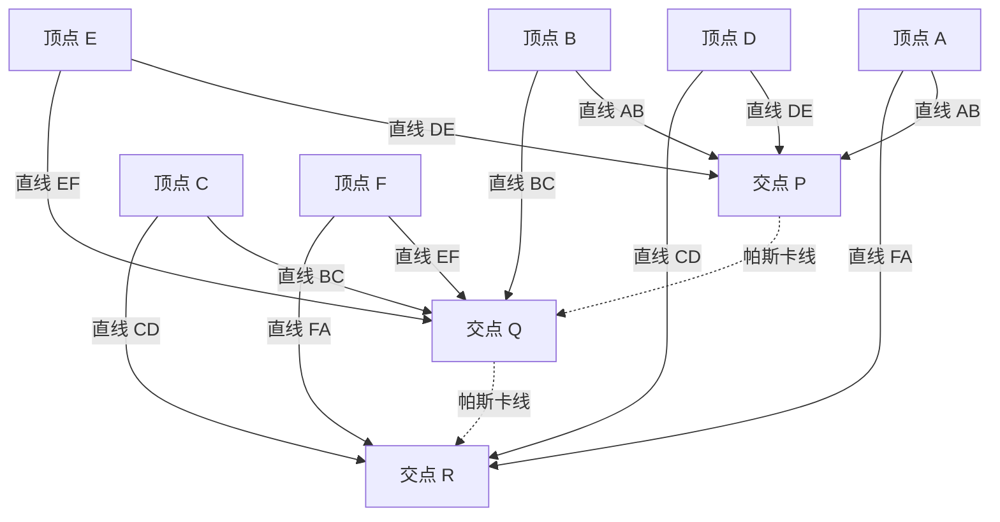

## 1. 引言：仅仅39岁人生便改变世界的天才

“人只不过是一根芦苇，是自然界最脆弱的东西；但他是一根能思想的芦苇。”
留下这句传世名言的[布莱兹·帕斯卡](https://kenji.blog/zh-cn/p/pascal/)（[Blaise Pascal](https://kenji.blog/zh-cn/p/pascal/)，1623年6月19日 - 1662年8月19日），是代表17世纪法国的智慧巨人。作为数学家、物理学家、哲学家以及基督教神学家，他在众多领域留下了深刻铭刻在人类历史上的伟大成就。

他的一生是与病魔不断抗争的一生，享年仅39岁。然而，在这短暂的人生中，他奠定了射影几何学的基础，发明了世界上第一台实用的机械计算器，开创了概率论这一新的数学分支，甚至确立了流体力学和气压等物理学的根本原理。本文将追溯这位早逝天才的波澜壮阔的一生，详细探讨他是如何得出这些突破性发现，以及对后世产生了怎样深远的影响。

## 2. 神童的诞生与独特的教育环境（1623年 - 1639年）

### 2.1. 诞生于奥弗涅与母亲的离世
[布莱兹·帕斯卡](https://kenji.blog/zh-cn/p/pascal/)于1623年出生在法国中南部奥弗涅地区的克莱蒙费朗。他的父亲埃蒂安·帕斯卡是当地税务局长，一位有权势的人物，同时也是一位出色的数学家。帕斯卡一家拥有极其优越的知识环境，但在布莱兹仅仅3岁时，母亲安托瓦内特去世了。父亲埃蒂安决定不再续弦，而是将全部精力倾注在布莱兹及其姐姐吉尔贝特、妹妹雅克琳三个孩子的教育上。

### 2.2. 移居巴黎与埃蒂安的教育方针
1631年，为了让孩子们接受最好的教育，埃蒂安举家迁往巴黎。由于对当时的学校教育感到不满，埃蒂安选择亲自担任孩子们的家庭教师。他的教育方针非常独特：“在孩子的理智充分发育之前，不教给他们过于抽象的数学。”他优先教授语言和历史，并将家里所有与数学相关的书籍统统藏了起来。

然而，这种“禁令”反而极大地刺激了年轻的布莱兹的好奇心。12岁时，布莱兹在玩耍中开始独自探索几何学。他在地板上用木炭画着图形，竟然靠自己的力量证明了[欧几里得](https://kenji.blog/zh-cn/p/euclid/)《几何原本》中的第32个命题：“三角形的内角和等于两个直角（180度）”。目睹了这压倒性的天才初现，父亲改变了方针，允许他学习数学，并开始带他去参加由梅森神父主持的当时欧洲最顶尖知识分子的聚会（后来法国科学院的前身）。

## 3. 数学领域的革新性成就

帕斯卡的数学才华在十几岁时便早早绽放。他的研究涵盖了从纯粹数学到应用数学的广泛领域。

### 3.1. 射影几何的开拓：帕斯卡定理（神秘六线形）

1639年，16岁的帕斯卡在梅森学院接触到了吉拉尔·德扎尔格关于射影几何的著作。深刻理解了德扎尔格思想的帕斯卡，发现了一个关于圆锥曲线的突破性定理，并将其总结在一张纸（论文）上发表。这就是今天被称为「 **帕斯卡定理** 」（Pascal's theorem）的著名定理。

帕斯卡定理适用于内接于圆锥曲线（椭圆、抛物线、双曲线以及圆）的任意六边形。

> 定理：内接于圆锥曲线的六边形的三对对边的延长线交点，必定共线（这条线被称为帕斯卡线）。

用数学公式定义交点如下：

$$
\text{交点 } P = AB \cap DE, \quad Q = BC \cap EF, \quad R = CD \cap FA \implies P, Q, R \text{ 三点共线}
$$

将该定理图解如下：

这一发现在当时的数学界引起了巨大的震动。甚至连大数学家[勒内·笛卡尔](https://kenji.blog/zh-cn/p/descartes/)最初也不相信一个16岁的少年能完成如此高深的证明，甚至怀疑“这一定是出自他父亲之手”。帕斯卡从这一定理中推导出了400多个推论，极大地推动了当时几何学的发展。

### 3.2. 世界首台机械计算器“帕斯卡林”

1639年，父亲埃蒂安被任命为鲁昂的税务官，一家人移居鲁昂。父亲为了计算庞大的税务，常常工作到深夜。看到父亲如此辛苦，帕斯卡决定开发一种能够自动计算的机器来减轻父亲的负担。

1642年，19岁的帕斯卡经过反复试验，终于完成了一台使用齿轮的机械计算器，命名为“帕斯卡林”（Pascaline）。这是一种通过预设齿轮的转动来自动进行加减运算的装置，尤其是它在实用层面上实现了“进位机制”，是世界上最早的计算器之一。帕斯卡林随后被制造了几十台，甚至获得了法国皇室的专利。帕斯卡也被认为是软件工程和硬件设计历史上最早的先驱之一。

### 3.3. 帕斯卡三角形与二项式定理

在数学领域，让帕斯卡的名字最广为人知的是「 **帕斯卡三角形** 」。这是将二项式展开的系数以几何形式排列成的三角形。虽然在帕斯卡之前，中国的数学家贾宪和杨辉、波斯的奥马尔·海亚姆等人就已经知道了这种排列，但帕斯卡在1653年撰写的《算术三角形论》中，对该三角形的性质进行了系统且详细的研究。

帕斯卡三角形的构成方式是：从上往下数第 $n$ 行、从左往右数第 $k$ 个数字，即为二项式系数 $\binom{n}{k}$ 。二项式定理表示如下：

$$
(x + y)^n = \sum_{k=0}^{n} \binom{n}{k} x^{n-k} y^k = \sum_{k=0}^{n} \frac{n!}{k!(n-k)!} x^{n-k} y^k
$$

帕斯卡证明了应用于组合数学和概率计算的许多定理，其中最基本的性质是三角形中的每个元素都等于它正上方的两个元素之和（帕斯卡法则： $\binom{n}{k} = \binom{n-1}{k-1} + \binom{n-1}{k}$ ）。在这项研究中，他还明确阐述了数学归纳法的原理，进一步完善了演绎数学的方法。

### 3.4. 概率论的创立：与费马的书信往来

帕斯卡在数学史上发挥的最重要作用之一，便是创立了“概率论”（Probability Theory）。事情的起因是1654年，一位喜欢赌博的贵族舍瓦利耶·德·梅雷向帕斯卡提出了一个著名的“点数问题”（Problem of points）。

**点数问题** ：
> 实力相当的两名玩家进行游戏，先达到一定胜数（比如3胜）的人赢得全部赌金。但是，当一名玩家获得2胜，另一名玩家获得1胜时，游戏因故被迫中断。此时，应该如何最公平地分配赌金？

为了解决这个难题，帕斯卡给住在图卢兹的另一位天才数学家[皮埃尔·德·费马](https://kenji.blog/zh-cn/p/fermat/)写了信。两人通过截然不同的方法得出了这个问题的解。

- **费马的方法** ：列举出所有可能的未来情况（树状图），计算每种情况发生的概率来决定分配比例，这是一种组合数学的方法。
- **帕斯卡的方法** ：计算从当前状态进行下一局游戏的“期望值”（Expected value），并通过递推公式进行递归求解。

在帕斯卡的计算中，假设下一局赢或输所预期的收益分别为 $E_{\text{win}}$ 和 $E_{\text{lose}}$ ，则当前的期望值 $E$ 可以表示为：

$$
E = \frac{1}{2} E_{\text{win}} + \frac{1}{2} E_{\text{lose}}
$$

两人通过通信得出的结论完全一致，这些往来书信正是近代概率论的开端。他们证明了以前被归结为神的意志或运气的偶然性和不确定性，可以通过严格的数学计算进行量化。

## 4. 物理学的贡献：真空的证明与流体力学

帕斯卡的探索精神不仅局限于抽象的数学，也转向了解开自然界的物理现象。

### 4.1. 真空存在的证明（多姆山实验）

在当时的物理学界，古希腊亚里士多德提出的“自然界厌恶真空”（Horror vacui）学说被奉为绝对真理，人们认为空间中什么都没有的“真空”是不可能存在的。

然而在1643年，意大利的埃万杰利斯塔·托里拆利进行了一项使用装满水银的玻璃管的实验，发现在管的上方会形成真空（托里拆利真空）。得知此事的帕斯卡对托里拆利的实验进行了精密的复现和深入研究。他提出假说：如果玻璃管上方形成的空间真的是真空，那么支撑水银柱的就应该是大气的重量（气压）。

1648年，帕斯卡委托他的姐夫弗洛兰·佩里埃在奥弗涅地区的多姆山（海拔1465米）的山顶和山脚进行了大规模实验，测量水银气压计的高度如何变化。结果正如帕斯卡所料，山顶的水银柱高度比山脚低。这是因为海拔越高，上方覆盖的大气越少，导致气压更低。

这一戏剧性的实验结果决定性地证明了气压的存在，同时也打破了亚里士多德“自然界厌恶真空”的教条。大气压力的单位“百帕”（hPa），正是为了纪念他的这一伟大成就而命名的。

### 4.2. 帕斯卡原理

在对流体压力进行研究的过程中，他发现了关于密闭流体的一项基本定律。这就是「 **帕斯卡原理** 」（Pascal's principle）。

> 原理：施加在密闭静止流体某一部分的压力，会大小不变地向流体的各个方向和容器壁传递。

用数学公式表示，假设两个活塞的面积分别为 $A_1, A_2$ ，施加的力分别为 $F_1, F_2$ ，由于压力 $P$ 恒定，则：

$$
P = \frac{F_1}{A_1} = \frac{F_2}{A_2} \implies F_2 = F_1 \frac{A_2}{A_1}
$$

这一原理表明，通过在小截面积的活塞上施加较小的力，可以在大截面积的活塞上产生巨大的力。它成为了现代液压千斤顶、汽车液压刹车等所有流体机械的核心基础技术。

## 5. 转向哲学与宗教思想，以及《思想录》

虽然曾沉迷于追求科学真理，但帕斯卡的内心深处始终有着对信仰的渴望。他后半生的岁月，远离了科学，献给了哲学和神学深邃的思考。

### 5.1. 火之夜与詹森主义

1654年11月23日，31岁的帕斯卡在乘坐马车时，马匹在塞纳河的桥上受惊失控，险些坠河丧命，这起严重的事故让他与死神擦肩而过。奇迹般生还的这个夜晚，他感受到了一种强烈的、神降临的神秘体验（后来被称为“火之夜”）。他将当时的激动心情写在了一张羊皮纸上，缝在衣服的内衬里，终生贴身携带。

以此为契机，他退出了世俗的科学研究，开始与天主教会内部严格的改革运动“詹森主义”（Jansenism）的中心——波尔罗亚尔修道院的隐修士们建立深厚的交情。

### 5.2. 摆线数学（晚年的例外研究）

虽然沉浸在宗教中，但帕斯卡曾有一次短暂回归了数学研究。1658年，饱受严重牙痛折磨的帕斯卡，为了分散注意力，开始思考关于“摆线”（Cycloid：圆在直线上滚动时，圆周上一点画出的轨迹）的数学问题。不可思议的是，疼痛竟然消失了。帕斯卡将其视为上帝的启示，在短短的8天内，他发现了计算摆线面积、重心、旋转体体积等的创新解法。

他以阿莫斯·德顿维尔（Amos Dettonville）的化名就这个问题发布了悬赏论文，并自己出版了完美的解答。他在这里使用的“不可分量法”，成为了后来[艾萨克·牛顿](https://kenji.blog/zh-cn/p/newton/)和[戈特弗里德·莱布尼茨](https://kenji.blog/zh-cn/p/leibniz/)发现微积分学的重要桥梁。

### 5.3. 帕斯卡的赌注与决策理论

帕斯卡认为，试图通过逻辑和理性完全证明上帝的存在是不可能的。但是，他以一种极具概率论创始人特色的方法，论证了信仰的合理性。这就是著名的「 **帕斯卡的赌注** 」（Pascal's Wager）。

他分析了对于不确定上帝是否存在的普通人来说，“相信上帝”和“不相信上帝”哪一个期望值更高。

- 上帝存在，且你相信上帝：获得无限的幸福（天堂）。
- 上帝存在，且你不相信上帝：遭受无限的惩罚（地狱）。
- 上帝不存在，且你相信上帝：仅仅失去了一点有限的尘世乐趣。
- 上帝不存在，且你不相信上帝：获得了有限的尘世乐趣。

用期望值来计算的话，无论上帝存在的概率有多低（只要不为零），相信上帝的期望值都是“无限大”。因此他论证道，作为一个理性的人，应该把赌注押在上帝存在的一方（去相信）。这一论证被誉为现代博弈论和决策理论的先驱。

### 5.4. 《思想录》与“会思考的芦苇”

晚年的帕斯卡开始着手撰写一部宏大的《基督教辩护论》，旨在引导无神论者和怀疑论者走向基督教信仰。然而，他从小虚弱的体质加上过度劳累，导致健康状况急剧恶化。在忍受着剧烈头痛和胃痛的折磨下，他只能将脑海中浮现的片段思绪，陆续写在纸片上。

1662年8月19日，帕斯卡与世长辞，年仅39岁。他留下的多达约1000张的残篇断简，在他死后由波尔罗亚尔的朋友们整理汇编，以《思想录》（Pensées，意为“思考”、“思想”）为名出版。

在《思想录》收录的众多断章中，最著名的莫过于下面这段话：

> 人只不过是一根芦苇，是自然界最脆弱的东西；但他是一根能思想的芦苇。用不着整个宇宙都拿起武器来毁灭他；一口气、一滴水就足以致他死命了。然而，纵使宇宙毁灭了他，人依然比致他于死命的东西更高贵；因为他知道自己要死亡，以及宇宙对他所具有的优势，而宇宙对此一无所知。
>
> 因而，我们全部的尊严就在于思想。（摘自《思想录》第347条）

帕斯卡直面了一个现实：与宏大无比且充满力量的浩瀚宇宙相比，人的肉体就像一根芦苇般脆弱而短暂。但同时他也高声宣言，正是因为人类能够去“思考”，能够清醒地认识到自身的局限和悲惨，这才是人类绝对尊严和伟大之处所在。

## 6. 结语：至今仍活在现代的帕斯卡遗产

[布莱兹·帕斯卡](https://kenji.blog/zh-cn/p/pascal/)度过的39年岁月，实在是太短暂，且充满了疾病的痛苦。然而，他敏锐的直觉和深邃的思考，轻松跨越了数学、物理学、工程学和哲学的边界，极大地拓宽了人类认知的地平线。

在现代，我们日常使用的天气预报气压数据（百帕）、汽车的刹车系统（帕斯卡原理）、保险和金融的风险评估（概率论），甚至计算机架构的底层，都活跃着他播下的种子。1970年尼克劳斯·维尔特开发的编程语言“Pascal”，正是为了向这位制造出世界首台计算器的人致敬而命名的。

“人是一根能思想的芦苇”。在人工智能（AI）飞速发展、人类“思考”的价值被重新审视的今天，这句话带着更深层的共鸣，向我们诉说着。无论技术如何进步，帕斯卡的一生和思想，始终在不断拷问着我们：人类的本质及其尊严，究竟在于何处。
