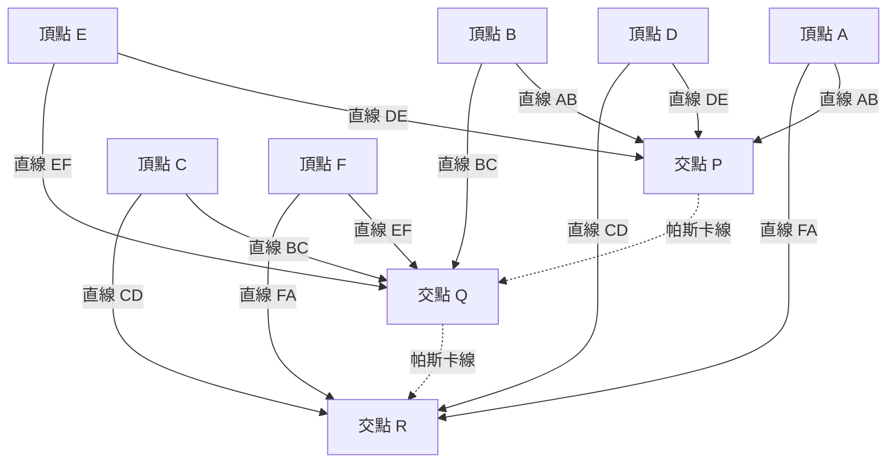

## 1. 引言：僅僅39歲人生便改變世界的天才

「人只不過是一根蘆葦，是自然界最脆弱的東西；但他是一根能思想的蘆葦。」
留下這句傳世名言的布萊茲·帕斯卡（Blaise Pascal，1623年6月19日 - 1662年8月19日），是代表17世紀法國的智慧巨人。作為數學家、物理學家、哲學家以及基督教神學家，他在眾多領域留下了深刻銘刻在人類歷史上的偉大成就。

他的一生是與病魔不斷抗爭的一生，享年僅39歲。然而，在這短暫的人生中，他奠定了射影幾何學的基礎，發明了世界上第一台實用的機械計算機，開創了機率論這一新的數學分支，甚至確立了流體力學和氣壓等物理學的根本原理。本文將追溯這位早逝天才的波瀾壯闊的一生，詳細探討他是如何得出這些突破性發現，以及對後世產生了怎樣深遠的影響。

## 2. 神童的誕生與獨特的教育環境（1623年 - 1639年）

### 2.1. 誕生於奧弗涅與母親的離世
布萊茲·帕斯卡於1623年出生在法國中南部奧弗涅地區的克萊蒙費朗。他的父親埃蒂安·帕斯卡是當地稅務局長，一位有權勢的人物，同時也是一位出色的數學家。帕斯卡一家擁有極其優越的知識環境，但在布萊茲僅僅3歲時，母親安托瓦內特去世了。父親埃蒂安決定不再續絃，而是將全部精力傾注在布萊茲及其姐姐吉爾貝特、妹妹雅克琳三個孩子的教育上。

### 2.2. 移居巴黎與埃蒂安的教育方針
1631年，為了讓孩子們接受最好的教育，埃蒂安舉家遷往巴黎。由於對當時的學校教育感到不滿，埃蒂安選擇親自擔任孩子們的家庭教師。他的教育方針非常獨特：「在孩子的理智充分發育之前，不教給他們過於抽象的數學。」他優先教授語言和歷史，並將家裡所有與數學相關的書籍統統藏了起來。

然而，這種「禁令」反而極大地刺激了年輕的布萊茲的好奇心。12歲時，布萊茲在玩耍中開始獨自探索幾何學。他在地板上用木炭畫著圖形，竟然靠自己的力量證明了歐幾里得《幾何原本》中的第32個命題：「三角形的內角和等於兩個直角（180度）」。目睹了這壓倒性的天才初現，父親改變了方針，允許他學習數學，並開始帶他去參加由梅森神父主持的當時歐洲最頂尖知識分子的聚會（後來法國科學院的前身）。

## 3. 數學領域的革新性成就

帕斯卡的數學才華在十幾歲時便早早綻放。他的研究涵蓋了從純粹數學到應用數學的廣泛領域。

### 3.1. 射影幾何的開拓：帕斯卡定理（神秘六線形）

1639年，16歲的帕斯卡在梅森學院接觸到了吉拉爾·德札爾格關於射影幾何的著作。深刻理解了德札爾格思想的帕斯卡，發現了一個關於圓錐曲線的突破性定理，並將其總結在一張紙（論文）上發表。這就是今天被稱為「 **帕斯卡定理** 」（Pascal's theorem）的著名定理。

帕斯卡定理適用於內接於圓錐曲線（橢圓、拋物線、雙曲線以及圓）的任意六邊形。

> 定理：內接於圓錐曲線的六邊形的三對對邊的延長線交點，必定共線（這條線被稱為帕斯卡線）。

用數學公式定義交點如下：

$$
\text{交點 } P = AB \cap DE, \quad Q = BC \cap EF, \quad R = CD \cap FA \implies P, Q, R \text{ 三點共線}
$$

將該定理圖解如下：

這一發現在當時的數學界引起了巨大的震動。甚至連大數學家勒內·笛卡兒最初也不相信一個16歲的少年能完成如此高深的證明，甚至懷疑「這一定是出自他父親之手」。帕斯卡從這一定理中推導出了400多個推論，極大地推動了當時幾何學的發展。

### 3.2. 世界首台機械計算機「帕斯卡林」

1639年，父親埃蒂安被任命為魯昂的稅務官，一家人移居魯昂。父親為了計算龐大的稅務，常常工作到深夜。看到父親如此辛苦，帕斯卡決定開發一種能夠自動計算的機器來減輕父親的負擔。

1642年，19歲的帕斯卡經過反覆試驗，終於完成了一台使用齒輪的機械計算機，命名為「帕斯卡林」（Pascaline）。這是一種透過預設齒輪的轉動來自動進行加減運算的裝置，尤其是它在實用層面上實現了「進位機制」，是世界上最早的計算機之一。帕斯卡林隨後被製造了幾十台，甚至獲得了法國皇室的專利。帕斯卡也被認為是軟體工程和硬體設計歷史上最早的先驅之一。

### 3.3. 帕斯卡三角形與二項式定理

在數學領域，讓帕斯卡的名字最廣為人知的是「 **帕斯卡三角形** 」。這是將二項式展開的係數以幾何形式排列成的三角形。雖然在帕斯卡之前，中國的數學家賈憲和楊輝、波斯的奧馬爾·海亞姆等人就已經知道了這種排列，但帕斯卡在1653年撰寫的《算術三角形論》中，對該三角形的性質進行了系統且詳細的研究。

帕斯卡三角形的構成方式是：從上往下數第 $n$ 行、從左往右數第 $k$ 個數字，即為二項式係數 $\binom{n}{k}$ 。二項式定理表示如下：

$$
(x + y)^n = \sum_{k=0}^{n} \binom{n}{k} x^{n-k} y^k = \sum_{k=0}^{n} \frac{n!}{k!(n-k)!} x^{n-k} y^k
$$

帕斯卡證明了應用於組合數學和機率計算的許多定理，其中最基本的性質是三角形中的每個元素都等於它正上方的兩個元素之和（帕斯卡法則： $\binom{n}{k} = \binom{n-1}{k-1} + \binom{n-1}{k}$ ）。在這項研究中，他還明確闡述了數學歸納法的原理，進一步完善了演繹數學的方法。

### 3.4. 機率論的創立：與費馬的書信往來

帕斯卡在數學史上發揮的最重要作用之一，便是創立了「機率論」（Probability Theory）。事情的起因是1654年，一位喜歡賭博的貴族舍瓦利耶·德·梅雷向帕斯卡提出了一個著名的「點數問題」（Problem of points）。

**點數問題** ：
> 實力相當的兩名玩家進行遊戲，先達到一定勝數（比如3勝）的人贏得全部賭金。但是，當一名玩家獲得2勝，另一名玩家獲得1勝時，遊戲因故被迫中斷。此時，應該如何最公平地分配賭金？

為了解決這個難題，帕斯卡給住在土魯斯的另一位天才數學家皮埃爾·德·費馬寫了信。兩人透過截然不同的方法得出了這個問題的解。

- **費馬的方法** ：列舉出所有可能的未來情況（樹狀圖），計算每種情況發生的機率來決定分配比例，這是一種組合數學的方法。
- **帕斯卡的方法** ：計算從當前狀態進行下一局遊戲的「期望值」（Expected value），並透過遞迴公式進行遞迴求解。

在帕斯卡的計算中，假設下一局贏或輸所預期的收益分別為 $E_{\text{win}}$ 和 $E_{\text{lose}}$ ，則當前的期望值 $E$ 可以表示為：

$$
E = \frac{1}{2} E_{\text{win}} + \frac{1}{2} E_{\text{lose}}
$$

兩人透過通信得出的結論完全一致，這些往來書信正是近代機率論的開端。他們證明了以前被歸結為神的意志或運氣的偶然性和不確定性，可以透過嚴格的數學計算進行量化。

## 4. 物理學的貢獻：真空的證明與流體力學

帕斯卡的探索精神不僅侷限於抽象的數學，也轉向了解開自然界的物理現象。

### 4.1. 真空存在的證明（多姆山實驗）

在當時的物理學界，古希臘亞里斯多德提出的「自然界厭惡真空」（Horror vacui）學說被奉為絕對真理，人們認為空間中什麼都沒有的「真空」是不可能存在的。

然而在1643年，義大利的埃萬傑利斯塔·托里切利進行了一項使用裝滿水銀的玻璃管的實驗，發現在管的上方會形成真空（托里切利真空）。得知此事的帕斯卡對托里切利的實驗進行了精密的重現和深入研究。他提出假說：如果玻璃管上方形成的空間真的是真空，那麼支撐水銀柱的就應該是大氣的重量（氣壓）。

1648年，帕斯卡委託他的姐夫弗洛蘭·佩里埃在奧弗涅地區的多姆山（海拔1465公尺）的山頂和山腳進行了大規模實驗，測量水銀氣壓計的高度如何變化。結果正如帕斯卡所料，山頂的水銀柱高度比山腳低。這是因為海拔越高，上方覆蓋的大氣越少，導致氣壓更低。

這一戲劇性的實驗結果決定性地證明了氣壓的存在，同時也打破了亞里斯多德「自然界厭惡真空」的教條。大氣壓力的單位「百帕」（hPa），正是為了紀念他的這一偉大成就而命名的。

### 4.2. 帕斯卡原理

在對流體壓力進行研究的過程中，他發現了關於密閉流體的一項基本定律。這就是「 **帕斯卡原理** 」（Pascal's principle）。

> 原理：施加在密閉靜止流體某一部分的壓力，會大小不變地向流體的各個方向和容器壁傳遞。

用數學公式表示，假設兩個活塞的面積分別為 $A_1, A_2$ ，施加的力分別為 $F_1, F_2$ ，由於壓力 $P$ 恆定，則：

$$
P = \frac{F_1}{A_1} = \frac{F_2}{A_2} \implies F_2 = F_1 \frac{A_2}{A_1}
$$

這一原理表明，透過在小截面積的活塞上施加較小的力，可以在大截面積的活塞上產生巨大的力。它成為了現代液壓千斤頂、汽車液壓煞車等所有流體機械的核心基礎技術。

## 5. 轉向哲學與宗教思想，以及《思想錄》

雖然曾沉迷於追求科學真理，但帕斯卡的內心深處始終有著對信仰的渴望。他後半生的歲月，遠離了科學，獻給了哲學和神學深邃的思考。

### 5.1. 火之夜與詹森主義

1654年11月23日，31歲的帕斯卡在乘坐馬車時，馬匹在塞納河的橋上受驚失控，險些墜河喪命，這起嚴重的事故讓他與死神擦肩而過。奇蹟般生還的這個夜晚，他感受到了一種強烈的、神降臨的神秘體驗（後來被稱為「火之夜」）。他將當時的激動心情寫在了一張羊皮紙上，縫在衣服的內襯裡，終生貼身攜帶。

以此為契機，他退出了世俗的科學研究，開始與天主教會內部嚴格的改革運動「詹森主義」（Jansenism）的中心——波爾羅亞爾修道院的隱修士們建立深厚的交情。

### 5.2. 擺線數學（晚年的例外研究）

雖然沉浸在宗教中，但帕斯卡曾有一次短暫回歸了數學研究。1658年，飽受嚴重牙痛折磨的帕斯卡，為了分散注意力，開始思考關於「擺線」（Cycloid：圓在直線上滾動時，圓周上一點畫出的軌跡）的數學問題。不可思議的是，疼痛竟然消失了。帕斯卡將其視為上帝的啟示，在短短的8天內，他發現了計算擺線面積、重心、旋轉體體積等的創新解法。

他以阿莫斯·德頓維爾（Amos Dettonville）的化名就這個問題發布了懸賞論文，並自己出版了完美的解答。他在這裡使用的「不可分量法」，成為了後來艾薩克·牛頓和戈特弗里德·萊布尼茲發現微積分學的重要橋梁。

### 5.3. 帕斯卡的賭注與決策理論

帕斯卡認為，試圖透過邏輯和理性完全證明上帝的存在是不可能的。但是，他以一種極具機率論創始人特色的方法，論證了信仰的合理性。這就是著名的「 **帕斯卡的賭注** 」（Pascal's Wager）。

他分析了對於不確定上帝是否存在的普通人來說，「相信上帝」和「不相信上帝」哪一個期望值更高。

- 上帝存在，且你相信上帝：獲得無限的幸福（天堂）。
- 上帝存在，且你不相信上帝：遭受無限的懲罰（地獄）。
- 上帝不存在，且你相信上帝：僅僅失去了一點有限的塵世樂趣。
- 上帝不存在，且你不相信上帝：獲得了有限的塵世樂趣。

用期望值來計算的話，無論上帝存在的機率有多低（只要不為零），相信上帝的期望值都是「無限大」。因此他論證道，作為一個理性的人，應該把賭注押在上帝存在的一方（去相信）。這一論證被譽為現代賽局理論和決策理論的先驅。

### 5.4. 《思想錄》與「會思考的蘆葦」

晚年的帕斯卡開始著手撰寫一部宏大的《基督教辯護論》，旨在引導無神論者和懷疑論者走向基督教信仰。然而，他從小虛弱的體質加上過度勞累，導致健康狀況急劇惡化。在忍受著劇烈頭痛和胃痛的折磨下，他只能將腦海中浮現的片段思緒，陸續寫在紙片上。

1662年8月19日，帕斯卡與世長辭，年僅39歲。他留下的多達約1000張的殘篇斷簡，在他死後由波爾羅亞爾的朋友們整理彙編，以《思想錄》（Pensées，意為「思考」、「思想」）為名出版。

在《思想錄》收錄的眾多斷章中，最著名的莫過於下面這段話：

> 人只不過是一根蘆葦，是自然界最脆弱的東西；但他是一根能思想的蘆葦。用不著整個宇宙都拿起武器來毀滅他；一口氣、一滴水就足以致他死命了。然而，縱使宇宙毀滅了他，人依然比致他於死命的東西更高貴；因為他知道自己要死亡，以及宇宙對他所具有的優勢，而宇宙對此一無所知。
>
> 因而，我們全部的尊嚴就在於思想。（摘自《思想錄》第347條）

帕斯卡直面了一個現實：與宏大無比且充滿力量的浩瀚宇宙相比，人的肉體就像一根蘆葦般脆弱而短暫。但同時他也高聲宣言，正是因為人類能夠去「思考」，能夠清醒地認識到自身的侷限和悲慘，這才是人類絕對尊嚴和偉大之處所在。

## 6. 結語：至今仍活在現代的帕斯卡遺產

布萊茲·帕斯卡度過的39年歲月，實在是太短暫，且充滿了疾病的痛苦。然而，他敏銳的直覺和深邃的思考，輕鬆跨越了數學、物理學、工程學和哲學的邊界，極大地拓寬了人類認知的地平線。

在現代，我們日常使用的天氣預報氣壓數據（百帕）、汽車的煞車系統（帕斯卡原理）、保險和金融的風險評估（機率論），甚至電腦架構的底層，都活躍著他播下的種子。1970年尼克勞斯·維爾特開發的程式語言「Pascal」，正是為了向這位製造出世界首台計算機的人致敬而命名的。

「人是一根能思想的蘆葦」。在人工智慧（AI）飛速發展、人類「思考」的價值被重新審視的今天，這句話帶著更深層的共鳴，向我們訴說著。無論技術如何進步，帕斯卡的一生和思想，始終在不斷拷問著我們：人類的本質及其尊嚴，究竟在於何處。
