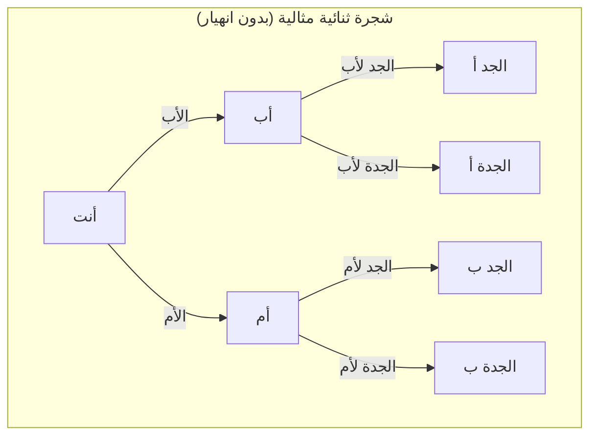
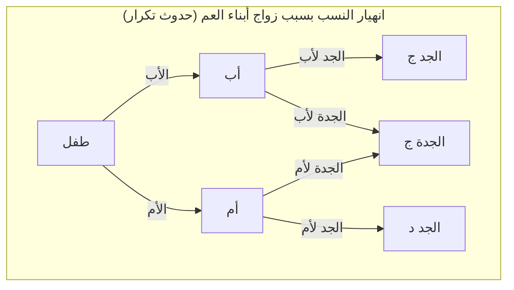
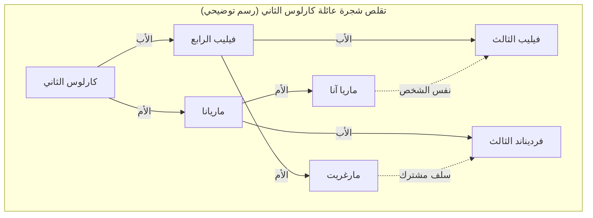

# 1. مقدمة: لغز الأجداد الذين يتكاثرون بلا نهاية

عندما نفكر في جذورنا، أي "شجرة العائلة"، نواجه حتماً تناقضاً رياضياً غريباً. هذا ما يُعرف بـ **مفارقة الأجداد** (Ancestor Paradox).

يمكن نمذجة شجرة عائلة الإنسان أساساً كشجرة ثنائية بسيطة (Binary Tree). لديك والدان (أب وأم)، ولكل منهما والدان (أجداد). ولكل من هؤلاء والدان (أجداد الأجداد). بعبارة أخرى، إذا كان الجيل هو $g$ (حيث أنت الجيل 0)، فإن عدد الأجداد قبل $g$ جيل يجب أن يكون $2^g$.

إذا قمنا بحساب هذا، سنصل إلى نتيجة مثيرة للاهتمام للغاية وتتعارض مع الحدس:

- قبل جيل واحد (الوالدان): $2^1 = 2$
- قبل جيلين (الأجداد): $2^2 = 4$
- قبل 3 أجيال (أجداد الأجداد): $2^3 = 8$
- قبل 10 أجيال: $2^{10} = 1,024$
- قبل 20 جيلًا: $2^{20} = 1,048,576$ (حوالي مليون)

حتى الآن، لا يوجد شيء غريب بشكل خاص. مليون هو رقم كبير، ولكنه واقعي تمامًا بالنظر إلى عدد سكان الأرض. ومع ذلك، دعونا نعود بالزمن إلى 30 جيلاً مضت (بافتراض أن الجيل حوالي 25 عامًا، فهذا يعني حوالي 750 عامًا مضت، أي في القرن الثالث عشر).

$$ N(30) = 2^{30} \approx 1,073,741,824 $$

بشكل مفاجئ، فإن عدد أجدادك قبل 30 جيلاً هو **حوالي 1.07 مليار شخص**. ولكن، وفقًا لتقديرات الديموغرافيا التاريخية، كان عدد سكان العالم في القرن الثالث عشر **حوالي 400 مليون شخص** فقط.

بمعنى آخر، يتجاوز "العدد المحسوب لأجدادك" بشكل كبير "إجمالي عدد السكان على الأرض في ذلك الوقت".

إذا عدنا إلى 40 جيلًا مضت (حوالي 1000 عام مضت)، فإن عدد الأجداد سيتجاوز **تريليون شخص** (بالتحديد $1,099,511,627,776$ شخصًا)، وهذا يتجاوز بكثير إجمالي عدد الأشخاص الذين عاشوا على الأرض منذ فجر الإنسانية (والذي يُقدر بحوالي 100 إلى 110 مليار شخص).

هذا هو جوهر **مفارقة الأجداد**. لماذا يحدث هذا التناقض؟ هل هناك خطأ رياضي؟ الإجابة تكمن في مفهوم **انهيار النسب** (Pedigree Collapse). في هذه المقالة، سنتعمق في **انهيار النسب**، ونستعرض النماذج الرياضية، والأمثلة التاريخية، وأحدث الاكتشافات في علم الوراثة السكانية.

# 2. ما هو انهيار النسب (Pedigree Collapse)؟

يشير **انهيار النسب** إلى ظاهرة ظهور نفس الشخص في أماكن متعددة في شجرة العائلة عند العودة بالزمن. بعبارة بسيطة، إنها نتيجة تكرار "الزواج بين الأقارب البعيدين" مرات لا تحصى عبر التاريخ.

إذا تزوج أبناء العم، فإن عدد أجداد الأجداد لطفلهم سيكون 6 بدلاً من 8 كما هو معتاد. وذلك لأن الوالدين يتشاركان نفس الأجداد. مع ظهور أشخاص متكررين في شجرة الأجداد، تنهار الشجرة الثنائية المثالية وتندمج أجزاء معينة لتشكل "معيناً".

يقارن مخطط Mermaid التالي بين شجرة ثنائية مثالية و**انهيار النسب** الناتج عن زواج أبناء العم.

في المخطط الأيمن أعلاه، نلاحظ أن الجدة لأم للأم، والجدة لأب للأب هي نفس الشخص (الجدة ج). نتيجة لذلك، عند العودة إلى جيل أجداد الأجداد، فإن الفروع التي كان من المفترض أن تكون 8 مستقلة تتقلص إلى عدد أقل.

كلما عدنا في التاريخ، كان البشر يميلون إلى العثور على شركاء داخل مجتمعات صغيرة معزولة (قرى، وديان، جزر، إلخ) حيث كانت وسائل النقل محدودة. لذلك، حتى دون وعي منهم، كان الزواج بين الأقارب البعيدين شائعاً جداً. نتيجة لذلك، حدثت تكرارات لا حصر لها للأجداد، بدلاً من أن تتسع فروع شجرة العائلة إلى ما لا نهاية، انطوت على نفسها وتداخلت.

# 3. نهج رياضي لفهم الظاهرة

دعونا نقوم بنمذجة **انهيار النسب** باستخدام المعادلات. لنجعل الحد الأقصى النظري لعدد الأجداد في الجيل $g$ هو $N(g) = 2^g$، والعدد الفعلي للأجداد الفريدين هو $A(g)$. ولنجعل إجمالي عدد السكان في ذلك العصر هو $P(g)$.

منطقياً، تتحقق العلاقة التالية دائماً:

$$ A(g) \le \min(2^g, P(g)) $$

عندما تكون الأجيال قريبة (عندما يكون $g$ صغيراً)، فإن $A(g) \approx 2^g$ يتحقق بشكل شبه مثالي. ومع ذلك، عندما يكبر $g$ ويقترب $2^g$ من $P(g)$، يزداد احتمال زواج الأقارب، وينحرف $A(g)$ بشكل كبير عن $2^g$ ليقترب من $P(g)$.

إذا افترضنا نموذج التزاوج العشوائي، يمكننا التفكير في احتمال أن يتشارك شخصان بالصدفة في نفس السلف. دعونا نطبق نموذج رايت-فيشر الشهير.

بافتراض أن عدد السكان في الجيل $g$ ثابت وهو $N$. احتمال أن يختار شخص ما في جيل معين شخصاً معيناً من الجيل السابق كأحد الوالدين هو $\frac{1}{N}$. والعكس صحيح، احتمال عدم اختياره هو $1 - \frac{1}{N}$.

يمكن تقريب احتمال $P_{diff}$ بأن يكون لفردين في جيل معين **والدان مختلفان** في الجيل السابق كما يلي (بافتراض أن عدد السكان $N$ كبير بما يكفي):

$$ P_{diff} = 1 - \frac{1}{N} $$

مع مرور الأجيال، يتناقص احتمال عدم وجود سلف مشترك بشكل أُسي. بشكل أكثر دقة، يمكننا قياس درجة هذا الانهيار باستخدام معامل التربية الداخلية $F$. يمثل معامل $F$ الاحتمال بأن يكون أليلا الجين لدى فرد معين متطابقين ومنحدرين من سلف مشترك.

$$ F = \sum \left( \frac{1}{2} \right)^{n+1} (1 + F_A) $$

هنا، $n$ هو عدد الخطوات في المسار بين الوالدين عبر السلف المشترك، و $F_A$ هو معامل التربية الداخلية للسلف المشترك نفسه. يمكن اعتبار **انهيار النسب** التاريخي بمثابة عملية يتراكم فيها عدد لا يحصى من قيم $F$ هذه مع كل جيل نعود إليه. حتى لو كانت المساهمة الفردية في $F$ صغيرة للغاية، فإن التراكم الهائل لهذه المساهمات يضغط بشكل كبير عدد الأجداد الكلي.

# 4. مثال تاريخي متطرف: انهيار عائلة هابسبورغ

أبرز مثال تاريخي على **انهيار النسب** المتعمد حدث في العائلة المالكة الأوروبية، آل هابسبورغ. لأسباب سياسية وطبقية، مارسوا الزواج بين الأقارب لعدة أجيال.

المثال الأكثر شهرة هو كارلوس الثاني، آخر ملوك هابسبورغ في إسبانيا. عند تحليل شجرة عائلته، يجب أن يكون لدى الشخص العادي قبل 5 أجيال $2^5 = 32$ جداً مختلفاً. ولكن في حالة كارلوس الثاني، كان لديه **10 أجداد فقط** فريدين.

بلغ معامل التربية الداخلية $F$ الخاص به $0.254$، وهو رقم غير طبيعي يتجاوز حتى المعامل الناتج عن تزاوج أخ وأخت أو والد وطفله ($F = 0.25$). نتيجة **انهيار النسب** المتكرر، تقلصت شجرة عائلته بشكل متطرف لتشبه "شبكة معينية".

(※ شجرة العائلة الفعلية أكثر تعقيدًا وتشابكًا، لكن ما سبق هو رسم توضيحي يُظهر التكرار غير الطبيعي)

أدى هذا **الانهيار في النسب** المتطرف إلى إصابته بأمراض وراثية خطيرة، مما أدى في النهاية إلى انقراض فرع هابسبورغ الإسباني بوفاته. هذا يمثل درساً تاريخياً يوضح كيف أن فقدان التنوع البيولوجي يمكن أن يكون مميتاً.

# 5. علم الوراثة و"السلف المشترك لكل البشر"

يقودنا مفهوم **انهيار النسب** في النهاية إلى السؤال الكبير: "كيف يرتبط كل البشر؟"

تُظهر أبحاث علم الوراثة السكانية أنه إذا تتبعنا شجرة عائلة جميع البشر الذين يعيشون اليوم على الأرض، فسنصل في نقطة ما إلى "السلف المشترك لجميع البشر الأحياء حالياً". ويسمى هذا **السلف المشترك الأحدث** (Most Recent Common Ancestor - MRCA).

ما يجب الانتباه إليه هنا هو الاختلاف عن "حواء الميتوكوندريا" أو "آدم كروموسوم واي". هذان يمثلان السلف المشترك عند تتبع "خط الأمومة الخالص فقط" أو "خط الأبوة الخالص فقط" على التوالي، وتعود أعمارهم إلى عشرات أو مئات الآلاف من السنين.

لكن السلف المشترك الأحدث (MRCA) العام في شجرة العائلة، والذي يسمح بأي مسار، موجود في الماضي القريب بشكل مذهل.

وفقاً للمحاكاة الحاسوبية، يُقدر بشكل مذهل أن السلف المشترك الأحدث لجميع البشر الأحياء يعود إلى آلاف السنين فقط (حوالي 2000 إلى 3000 عام مضت).

الأمر الأكثر إثارة للدهشة هو وجود ما يُسمى **نقطة الأجداد المتطابقين** (Identical Ancestors Point - IAP). تُقدر هذه النقطة بحوالي 5000 إلى 7000 سنة مضت. أي إنسان كان يعيش في تلك النقطة هو إما "سلف مشترك لجميع البشر الذين يعيشون اليوم" أو "لم يترك أي أحفاد في العصر الحديث".

للتعبير عن ذلك رياضياً، عندما نتحرك بالزمن $t$ نحو الماضي، لنجعل مجموعة أسلاف أي فرد حديث $i$ هي $S_i(t)$. ولنجعل مجموعة جميع البشر هي $H$. الزمن $t_{MRCA}$ الذي يوجد فيه السلف المشترك الأحدث هو أول نقطة زمنية تحقق الشرط التالي:

$$ \exists x, \forall i \in H : x \in S_i(t_{MRCA}) $$

من ناحية أخرى، الزمن $t_{IAP}$ ($t_{IAP} > t_{MRCA}$) الذي توجد فيه **نقطة الأجداد المتطابقين**، هو النقطة الزمنية التي يُستوفى فيها الشرط التالي بالنسبة للمجموعة الفرعية $P_{survive}(t_{IAP})$ التي تركت أحفاداً في العصر الحديث من مجموعة السكان في ذلك الوقت $P(t_{IAP})$:

$$ \forall x \in P_{survive}(t_{IAP}), \forall i \in H : x \in S_i(t_{IAP}) $$

بعبارة أخرى، أي شخص عاش قبل آلاف السنين وله على الأقل حفيد واحد يعيش اليوم، هو **بلا استثناء** جد لك، وجد لي، وجد لكل إنسان على وجه الأرض.

# 6. الخاتمة: نحن جميعاً أبناء عمومة من الدرجة الخمسين

للوهلة الأولى، تبدو **مفارقة الأجداد** وكأنها مجرد لغز رياضي أو خدعة حسابية. ولكن، من خلال فهم آلية **انهيار النسب** الكامنة وراءها، يمكننا رؤية الصورة الحقيقية للزواج والتواصل في تاريخ البشرية.

نحن نميل إلى التفكير في أنفسنا كأعراق أو شعوب مختلفة ومقسمة. نعتقد أننا "آخرون" لا علاقة لنا ببعضنا البعض. ولكن، إذا عدنا قليلاً عبر فروع شجرة العائلة، تتشابك هذه الفروع بسرعة، وتندمج في النهاية في شبكة واحدة ضخمة.

أعظم درس يعلمنا إياه الرياضيات وعلم الوراثة هو أنه في أقصى درجاته، **جميع البشر هم حرفياً عائلة واحدة كبيرة**. يتوقع بعض علماء الأنثروبولوجيا أنه "بغض النظر عن مدى تباعد شخصين على الأرض، فإنهما في أسوأ الأحوال أبناء عمومة من الدرجة الخمسين".

**انهيار النسب** يُثبت علمياً أن روابطنا أعمق وأقوى بكثير مما نتخيل. في المرة القادمة التي تفكر فيها في جذورك، لماذا لا تتأمل الروابط غير المرئية التي تشاركها مع الناس في جميع أنحاء العالم، عبر مئات وآلاف السنين؟
