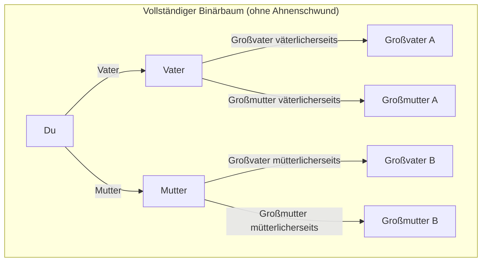
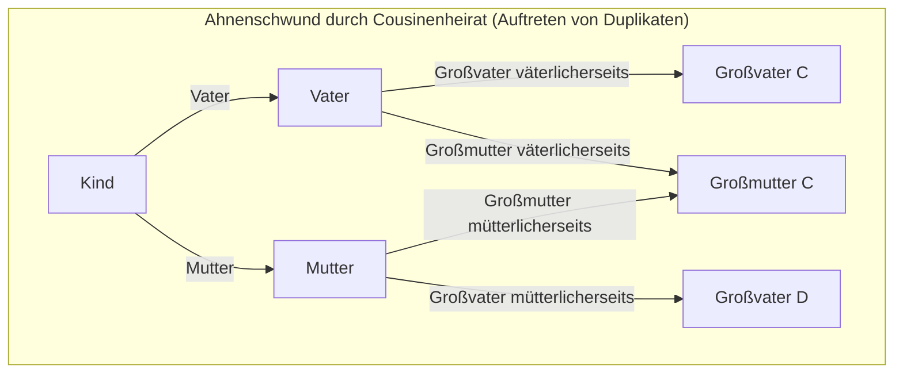
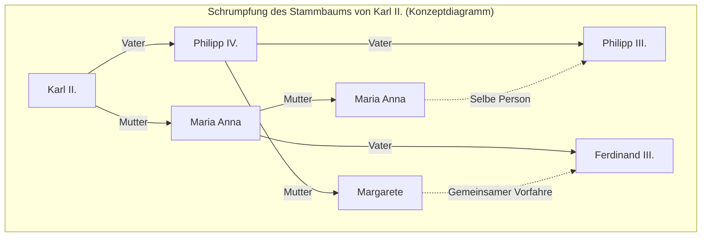

# 1. Einleitung: Das Rätsel der sich unendlich vermehrenden Vorfahren

Wenn wir über unsere eigenen Wurzeln, also unseren „Stammbaum“, nachdenken, stoßen wir unweigerlich auf einen seltsamen mathematischen Widerspruch. Dies ist das **Vorfahren-Paradoxon** ([Ancestor Paradox](https://kenji.blog/de/p/pedigree-collapse/)).

Der menschliche Stammbaum lässt sich im Grunde als einfacher Binärbaum modellieren. Sie haben 2 Eltern (Vater und Mutter), und jeder von ihnen hat 2 Eltern (Großeltern). Deren Eltern haben wiederum jeweils 2 Eltern (Urgroßeltern). Das heißt, wenn die Generation $g$ ist (wobei Sie selbst die 0. Generation sind), sollte die Anzahl der Vorfahren vor $g$ Generationen $2^g$ Personen betragen.

Wenn man dies durchrechnet, gelangt man zu einem sehr interessanten und kontraintuitiven, rätselhaften Ergebnis.

- 1 Generation zurück (Eltern): $2^1 = 2$ Personen
- 2 Generationen zurück (Großeltern): $2^2 = 4$ Personen
- 3 Generationen zurück (Urgroßeltern): $2^3 = 8$ Personen
- 10 Generationen zurück: $2^{10} = 1.024$ Personen
- 20 Generationen zurück: $2^{20} = 1.048.576$ Personen (ca. 1 Million)

Bis hierhin gibt es nichts besonders Seltsames. Die Zahl von 1 Million ist zwar groß, aber im Verhältnis zur Erdbevölkerung durchaus realistisch. Gehen wir jedoch noch weiter zurück in die Zeit und betrachten 30 Generationen zuvor (unter der Annahme, dass 1 Generation etwa 25 Jahre dauert, wäre das vor etwa 750 Jahren im 13. Jahrhundert).

$$ N(30) = 2^{30} \approx 1,073,741,824 $$

Überraschenderweise beläuft sich die berechnete Anzahl Ihrer Vorfahren vor 30 Generationen auf **etwa 1,07 Milliarden** Personen. Schätzungen der historischen Demografie zufolge betrug die Weltbevölkerung im 13. Jahrhundert jedoch nur **etwa 400 Millionen**.

Das bedeutet, dass die „berechnete Anzahl Ihrer Vorfahren“ die „gesamte damalige Erdbevölkerung“ bei Weitem übersteigt.

Geht man noch weiter auf 40 Generationen (vor etwa 1000 Jahren) zurück, überschreitet die Anzahl der Vorfahren **etwa 1 Billion** (genau $1.099.511.627.776$) Personen. Dies übersteigt sogar die gesamte Anzahl von Menschen, die jemals seit Anbeginn der Menschheit auf der Erde gelebt haben (geschätzt auf etwa 100 bis 110 Milliarden).

Dies ist das wahre Gesicht des **Vorfahren-Paradoxons**. Warum entsteht ein solcher Widerspruch? Ist es mathematisch fehlerhaft? Die Antwort liegt in dem Konzept des **Ahnenschwunds** (Pedigree Collapse). In diesem Artikel werden wir tiefer in diesen **Ahnenschwund** eintauchen, anhand mathematischer Modelle, historischer Beispiele und neuester Erkenntnisse der Populationsgenetik.

# 2. Was ist Ahnenschwund (Pedigree Collapse)?

Der **Ahnenschwund** (Pedigree Collapse) bezeichnet das Phänomen, dass dieselbe Person an mehreren Stellen im Stammbaum auftaucht, wenn man ihn zurückverfolgt. Einfach ausgedrückt ist dies das Ergebnis der zahllosen Male in der Geschichte, in denen „Ehen zwischen entfernten Verwandten“ geschlossen wurden.

Wenn Cousins heiraten, hat ihr Kind nicht die üblichen 8 Urgroßeltern, sondern nur 6. Das liegt daran, dass sich die Eltern dieselben Großeltern teilen. Durch das Auftreten doppelter Personen unter den Vorfahren bricht der ideale Binärbaum zusammen und bestimmte Stellen verbinden sich zu Rauten („Diamanten“).

Das folgende Mermaid-Diagramm vergleicht einen vollständigen Binärbaum mit dem **Ahnenschwund** durch eine Cousinenheirat.

Im rechten Diagramm oben wird gezeigt, dass die Großmutter mütterlicherseits und die Großmutter väterlicherseits dieselbe Person (Großmutter C) sind. Wenn man also zur Generation der Urgroßeltern zurückgeht, konvergieren die Zweige, die eigentlich 8 unabhängige Personen sein sollten, auf eine geringere Zahl.

Je weiter man in der Geschichte zurückgeht, desto mehr fanden die Menschen ihre Ehepartner innerhalb enger Gemeinschaften (Dörfer, Täler, Inseln usw.) mit begrenzten Fortbewegungsmitteln. Daher waren Ehen zwischen entfernten Verwandten, wie z. B. Cousins dritten oder vierten Grades, sehr verbreitet, selbst wenn den Betroffenen dies gar nicht bewusst war. Als Ergebnis traten zahllose Überschneidungen von Vorfahren auf, und die Zweige des Stammbaums breiteten sich nicht unendlich aus, sondern konvergierten und falteten sich ineinander.

# 3. Betrachtung durch einen mathematischen Ansatz

Modellieren wir diesen **Ahnenschwund** mathematisch. Sei $N(g) = 2^g$ die theoretische maximale Anzahl an Vorfahren in der Generation $g$, $A(g)$ die tatsächliche Anzahl eindeutiger Vorfahren und $P(g)$ die damalige Gesamtbevölkerung.

Logischerweise gilt immer die folgende Beziehung:

$$ A(g) \le \min(2^g, P(g)) $$

Solange die Generationenanzahl niedrig ist (bei kleinem $g$), gilt fast perfekt $A(g) \approx 2^g$. Wenn jedoch $g$ größer wird und sich $2^g$ an $P(g)$ annähert, steigt die Wahrscheinlichkeit von Ehen unter Verwandten, sodass $A(g)$ stark von $2^g$ abweicht und sich an $P(g)$ annähert.

Unter der Annahme eines Panmixie-Modells (bei dem sich alle Individuen einer Population zufällig paaren), können wir die Wahrscheinlichkeit betrachten, dass zwei Personen zufällig denselben Vorfahren teilen. Wenden wir dazu das berühmte Wright-Fisher-Modell an.

Nehmen wir an, die Bevölkerung in Generation $g$ ist konstant $N$. Die Wahrscheinlichkeit, dass ein Individuum aus einer bestimmten Generation eine bestimmte Person aus der vorherigen Generation als Elternteil wählt, ist $\frac{1}{N}$. Umgekehrt ist die Wahrscheinlichkeit, dass es sie nicht wählt, $1 - \frac{1}{N}$.

Die Wahrscheinlichkeit $P_{diff}$, dass zwei Individuen in einer Generation **unterschiedliche Eltern** in der vorherigen Generation haben, kann (bei ausreichend großem $N$) wie folgt angenähert werden:

$$ P_{diff} = 1 - \frac{1}{N} $$

Wenn sich dies über Generationen hinweg fortsetzt, nimmt die Wahrscheinlichkeit, keinen gemeinsamen Vorfahren zu haben, exponentiell ab. Genauer gesagt kann der Grad dieses Schwunds anhand des Inzuchtkoeffizienten (Inbreeding Coefficient) $F$ gemessen werden. Der Inzuchtkoeffizient $F$ gibt die Wahrscheinlichkeit an, dass ein Paar Allele eines Individuums „identisch durch Abstammung“ (Identical by descent) von einem gemeinsamen Vorfahren stammt.

$$ F = \sum \left( \frac{1}{2} \right)^{n+1} (1 + F_A) $$

Hierbei ist $n$ die Anzahl der Schritte im Pfad zwischen den Eltern über den gemeinsamen Vorfahren, und $F_A$ ist der Inzuchtkoeffizient des gemeinsamen Vorfahren selbst. Der historische **Ahnenschwund** kann als ein Prozess verstanden werden, bei dem sich der Wert von $F$ mit jeder zurückgehenden Generation zahllos akkumuliert. Selbst wenn der individuelle Beitrag zu $F$ extrem klein ist (z. B. bei einer Heirat von Verwandten 10. Grades), führt die gewaltige Anhäufung dazu, dass die Gesamtzahl der Vorfahren drastisch komprimiert wird.

# 4. Ein extremes historisches Beispiel: Der Untergang der Habsburger

Ein historisches Beispiel, bei dem der **Ahnenschwund** am deutlichsten und absichtlichsten stattfand, ist die europäische Königsfamilie der Habsburger. Aus politischen und standesbezogenen Gründen – „um zu verhindern, dass Territorien an andere Länder verloren gehen“ und „um die Reinheit des königlichen Blutes zu bewahren“ – wiederholten sie Eheschließungen unter Verwandten (Onkel und Nichte, Cousins usw.) über viele Generationen hinweg.

Besonders berühmt ist das Beispiel von Karl II. (Charles II of Spain), dem letzten König der spanischen Habsburger. Analysiert man seinen Stammbaum, so sollte ein normaler Mensch 5 Generationen zurück (die Generation der Eltern der Ururgroßeltern) $2^5 = 32$ verschiedene Vorfahren haben. Bei Karl II. gab es jedoch überraschenderweise **nur 10** eindeutige Vorfahren.

Sein Inzuchtkoeffizient $F$ erreichte $0,254$, was ein abnormal hoher Wert ist, der sogar den Koeffizienten eines Kindes aus einer Geschwister- oder Eltern-Kind-Beziehung ($F = 0,25$) übersteigt. Durch den wiederholten **Ahnenschwund** war sein Stammbaum zu einem extrem geschrumpften „rautenförmigen Netz“ geworden.

(* Der tatsächliche Stammbaum ist noch komplexer miteinander verflochten, aber das Obige ist ein konzeptionelles Diagramm, das diese ungewöhnliche Überschneidung zeigt *)

Dieser extreme **Ahnenschwund** bescherte ihm schwere Erbkrankheiten, und letztendlich starb die Linie der spanischen Habsburger mit ihm aus. Dies ist auch eine historische Lehre darüber, wie fatal der Verlust der biologischen Vielfalt sein kann.

# 5. Genetik und der „Gemeinsame Vorfahre der gesamten Menschheit“

Das Konzept des **Ahnenschwunds** führt letztlich zu der gewaltigen Frage: „Wie ist die gesamte Menschheit miteinander verbunden?“.

Forschungen in der Populationsgenetik haben gezeigt, dass man, wenn man den Stammbaum aller heute lebenden Menschen auf der Erde zurückverfolgt, an einen bestimmten Punkt gelangt, an dem ein „gemeinsamer Vorfahre aller heute lebenden Menschen“ existiert. Dies nennt man den **Most Recent Common Ancestor** (Jüngster gemeinsamer Vorfahre, MRCA).

Hierbei ist auf den Unterschied zu „Mitochondrialer Eva“ und „Y-chromosomalem Adam“ zu achten. Diese sind gemeinsame Vorfahren, wenn man „ausschließlich der rein mütterlichen Linie“ bzw. „ausschließlich der rein väterlichen Linie“ folgt, was Zehntausende bis über Hunderttausend Jahre zurückreicht.

Der allgemeine genealogische MRCA jedoch, der beliebige Pfade über väterliche und mütterliche Linien hinweg zulässt, existiert in einer erstaunlich nahen Vergangenheit.

Computersimulationen von Douglas Rohde und anderen Forschern am Massachusetts Institute of Technology (MIT) (z. B. in einer Publikation in Nature, 2004) legen erstaunlicherweise nahe, dass der MRCA aller heute lebenden Menschen nur wenige Jahrtausende (etwa 2000 bis 3000 Jahre) in der Vergangenheit liegt.

Noch erstaunlicher ist die Existenz eines Zeitpunkts, der **Identical Ancestors Point** (IAP) genannt wird. Dieser wird auf etwa 5000 bis 7000 Jahre in der Vergangenheit geschätzt, und die zu diesem Zeitpunkt lebenden Menschen sind **entweder** „gemeinsame Vorfahren“ aller heute lebenden Menschen, oder sie haben „überhaupt keine Nachkommen in der heutigen Zeit hinterlassen (ihre Linie ist ausgestorben)“.

Mathematisch ausgedrückt: Wenn wir die Zeit $t$ in die Vergangenheit bewegen, sei $S_i(t)$ die Menge der Vorfahren eines beliebigen modernen Individuums $i$. Wenn $H$ die Menge der gesamten Menschheit ist, so ist der Zeitpunkt $t_{MRCA}$, an dem der MRCA existiert, der erste Moment, der die folgende Bedingung erfüllt:

$$ \exists x, \forall i \in H : x \in S_i(t_{MRCA}) $$

Andererseits ist der Zeitpunkt $t_{IAP}$ ($t_{IAP} > t_{MRCA}$), an dem der **Identical Ancestors Point** existiert, der Moment, in dem für die Teilmenge $P_{survive}(t_{IAP})$ der damaligen Bevölkerungsmenge $P(t_{IAP})$, die in der heutigen Zeit Nachkommen hinterlassen hat, die folgende Bedingung erfüllt ist:

$$ \forall x \in P_{survive}(t_{IAP}), \forall i \in H : x \in S_i(t_{IAP}) $$

Das bedeutet: Jeder, der vor Jahrtausenden im alten Ägypten, in Mesopotamien oder im alten China lebte und bis heute auch nur einen einzigen Nachkommen hinterlassen hat, ist **ausnahmslos** Ihr Vorfahre, mein Vorfahre und der Vorfahre aller Menschen auf der Erde.

# 6. Fazit: Wir sind alle Cousins und Cousinen 50. Grades

Das **Vorfahren-Paradoxon** erscheint auf den ersten Blick wie ein einfaches mathematisches Rätsel oder ein Rechentrick. Wenn man jedoch den dahinterstehenden Mechanismus des **Ahnenschwunds** versteht, offenbart sich das wahre Bild von Eheschließungen und Verbindungen in der Geschichte der Menschheit.

Wir neigen dazu, uns als voneinander getrennte Rassen und Völker zu betrachten. Durch Unterschiede in Grenzen, Sprachen und Kulturen glauben wir oft, dass wir völlig unzusammenhängende „Andere“ sind. Aber wenn man die Zweige des Stammbaums nur ein wenig zurückverfolgt, verflechten sie sich schnell und verschmelzen schließlich zu einem einzigen, riesigen Netz.

Die größte Lehre, die uns Mathematik und Genetik vermitteln, ist letztendlich die Tatsache, dass **die gesamte Menschheit buchstäblich eine einzige riesige Familie (Verwandtschaft) ist**. Einige Anthropologen schätzen, dass „jeweils zwei noch so weit voneinander entfernte Menschen auf der Erde im Höchstfall Cousins 50. Grades (50th cousins) sind“.

Der **Ahnenschwund** beweist wissenschaftlich, dass unsere Verbindungen viel tiefer und enger sind, als wir uns vorstellen können. Wenn Sie das nächste Mal über Ihre Wurzeln nachdenken, warum denken Sie dann nicht auch an das unsichtbare Band, das Sie über Hunderte oder Tausende von Jahren hinweg mit den Menschen auf der ganzen Welt teilen?
