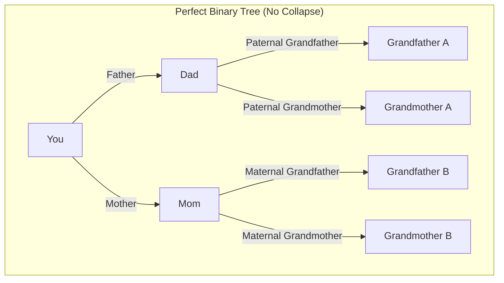
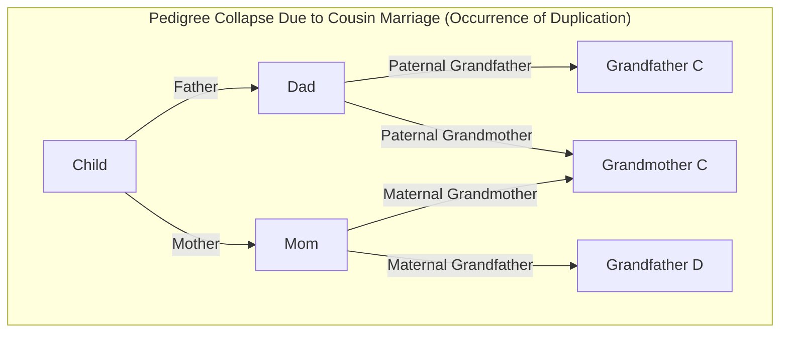
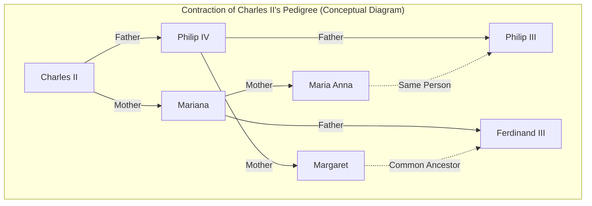

# 1. Introduction: The Mystery of Infinitely Multiplying Ancestors

When we think about our own roots, or our "family tree," we inevitably face a strange mathematical contradiction. This is the **[Ancestor Paradox](https://kenji.blog/p/pedigree-collapse/)**.

A human family tree can basically be modeled as a simple binary tree. You have 2 parents (a father and a mother), and each of them has 2 parents (grandparents). Furthermore, those parents each have 2 parents (great-grandparents). In other words, if we let the generation be $g$ (with yourself as the 0th generation), the number of ancestors $g$ generations ago should be $2^g$.

If we calculate this out, we arrive at a very interesting and counterintuitive result.

- 1 generation ago (parents): $2^1 = 2$ people
- 2 generations ago (grandparents): $2^2 = 4$ people
- 3 generations ago (great-grandparents): $2^3 = 8$ people
- 10 generations ago: $2^{10} = 1,024$ people
- 20 generations ago: $2^{20} = 1,048,576$ people (about 1 million)

Up to this point, there is nothing particularly strange. A figure of 1 million is large, but it is realistic enough when looking at the global population. However, let's go further back in time to 30 generations ago (assuming one generation is about 25 years, this would be around the 13th century, 750 years ago).

$$ N(30) = 2^{30} \approx 1,073,741,824 $$

Astonishingly, the calculation shows that you had **about 1.07 billion** ancestors 30 generations ago. However, according to estimates in historical demography, the world population in the 13th century was only **about 400 million**.

In other words, the "calculated number of your ancestors" vastly exceeds the "total population on Earth at the time".

If we go even further back to 40 generations ago (about 1,000 years ago), the number of ancestors exceeds **about 1 trillion** (exactly $1,099,511,627,776$), which far surpasses the total number of people who have ever lived on Earth since the dawn of humanity (estimated to be about 100 to 110 billion).

This is the true nature of the **[Ancestor Paradox](https://kenji.blog/p/pedigree-collapse/)**. Why does such a contradiction arise? Is the mathematics broken? The answer lies in the concept of **Pedigree Collapse**. In this article, we will delve deeply into **Pedigree Collapse**, incorporating mathematical models, historical examples, and the latest findings in population genetics.

# 2. What is Pedigree Collapse?

**Pedigree Collapse** refers to the phenomenon where the same individual appears in multiple places on a family tree as you go back in time. Simply put, it is the result of "marriages between distant relatives" being repeated countless times throughout history.

If cousins marry, the number of great-grandparents for their child is 6 instead of the usual 8. This is because the parents share the same grandparents. Because duplicating individuals appear among the ancestors in this way, the ideal binary tree collapses, and certain nodes join together in a "diamond" shape.

The Mermaid diagrams below compare a perfect binary tree with **Pedigree Collapse** caused by a cousin marriage.

In the right diagram above, it shows that the mother's maternal grandmother and the father's paternal grandmother are the same person (Grandmother C). Consequently, when going back to the great-grandparent generation, the branches that should originally have been 8 independent individuals converge into a smaller number.

The further back in history we go, the more people found their spouses within small communities (villages, valleys, islands, etc.) where transportation was limited. Therefore, marriages between distant relatives, such as third or fourth cousins, were extremely common, even if the individuals themselves were completely unaware of it. As a result, ancestor duplications occurred innumerably, and the branches of the family tree folded and converged rather than expanding infinitely.

# 3. Consideration through a Mathematical Approach

Let's model this **Pedigree Collapse** with a mathematical formula. Let the theoretical maximum number of ancestors at generation $g$ be $N(g) = 2^g$, and the actual number of unique ancestors be $A(g)$. Additionally, let the total population at that time be $P(g)$.

Logically, the following relationship always holds:

$$ A(g) \le \min(2^g, P(g)) $$

When the generations are shallow (when $g$ is small), $A(g) \approx 2^g$ holds almost perfectly. However, as $g$ becomes larger and $2^g$ approaches $P(g)$, the probability of marriages between relatives increases, and $A(g)$ deviates significantly from $2^g$, asymptotically approaching $P(g)$.

If we assume a Panmictic model (a model where all individuals in a population mate randomly), we can consider the probability that two random people happen to share the same ancestor. Let's apply the famous Wright-Fisher model.

Assume the population at generation $g$ is a constant $N$. The probability that a person in a certain generation chooses a specific person in the previous generation as a parent is $\frac{1}{N}$. Conversely, the probability of not choosing them is $1 - \frac{1}{N}$.

The probability $P_{diff}$ that two individuals in a certain generation have **different parents** one generation ago can be approximated as follows (when the population $N$ is sufficiently large):

$$ P_{diff} = 1 - \frac{1}{N} $$

As generations stack up, the probability of not sharing a common ancestor decreases exponentially. More strictly, we can measure the degree of this collapse using the Inbreeding Coefficient $F$. The inbreeding coefficient $F$ represents the probability that a pair of alleles possessed by an individual are "identical by descent," originating from a common ancestor.

$$ F = \sum \left( \frac{1}{2} \right)^{n+1} (1 + F_A) $$

Here, $n$ is the number of steps in the path between the parents via the common ancestor, and $F_A$ is the inbreeding coefficient of the common ancestor themselves. Historical **Pedigree Collapse** can be thought of as a process where the value of this $F$ accumulates countless times as we go back in generations. Even if each individual contribution to $F$ is extremely small (for example, a marriage between 10th cousins), the sheer volume of such accumulations drastically compresses the total number of ancestors.

# 4. An Extreme Historical Example: The Collapse of the House of Habsburg

The most prominent and intentional historical example of **Pedigree Collapse** is the House of Habsburg, European royalty. For political and class reasons, such as "preventing territories from being taken by other countries" and "protecting the purity of the royal blood," they repeatedly engaged in consanguineous marriages (between uncles and nieces, cousins, etc.) over many generations.

A particularly famous example is Charles II of Spain, the last king of the Spanish Habsburgs. Analyzing his pedigree, a normal human would have $2^5 = 32$ different ancestors five generations back (the generation of the parents of great-great-grandparents). However, in Charles II's case, there were **only 10** unique ancestors.

His inbreeding coefficient $F$ reached $0.254$, an abnormally high figure that even exceeded the coefficient of children born between siblings or parent and child ($F = 0.25$). Due to repeated **Pedigree Collapse**, his family tree had shrunk into an extremely collapsed "diamond mesh."

(* While the actual family tree is even more complexly intertwined, the above is a conceptual diagram illustrating that abnormal duplication.)

This extreme **Pedigree Collapse** caused him severe genetic diseases, ultimately leading to the extinction of the Spanish Habsburg line with his generation. This serves as a historical lesson demonstrating how fatal the loss of biological diversity can be.

# 5. Genetics and the "Common Ancestor of All Humanity"

The concept of **Pedigree Collapse** ultimately leads to the grand question: "How is all of humanity connected?"

According to research in population genetics, tracing back the family trees of all humans alive on Earth today shows that at a certain point, we reach a "common ancestor of all humans currently alive." This is called the **Most Recent Common Ancestor** (MRCA).

It is important to note the difference between this and "Mitochondrial Eve" or "Y-chromosomal Adam." These are common ancestors when tracing "purely maternal lines" or "purely paternal lines," respectively, which go back tens of thousands to over a hundred thousand years.

However, a general genealogical MRCA that allows any path, regardless of paternal or maternal lines, existed surprisingly recently in the past.

According to computer simulations by Douglas Rohde and others at the Massachusetts Institute of Technology (MIT) (such as a 2004 paper in the journal Nature), surprisingly, the MRCA for all humans alive today is estimated to date back only a few thousand years (about 2,000 to 3,000 years ago).

Even more surprising is the existence of a point in time called the **Identical Ancestors Point** (IAP). This is estimated to be about 5,000 to 7,000 years ago, and anyone living at this point was **either** "a common ancestor to all humans living today" or "left absolutely no descendants in the modern era (their lineage died out)."

To express this mathematically, as we move time $t$ backwards, let the set of ancestors for any modern individual $i$ be $S_i(t)$. Let the set of all humanity be $H$. The time $t_{MRCA}$ when the MRCA existed is the first point in time that satisfies the following condition:

$$ \exists x, \forall i \in H : x \in S_i(t_{MRCA}) $$

On the other hand, the time $t_{IAP}$ when the **Identical Ancestors Point** existed ($t_{IAP} > t_{MRCA}$) is the point where the following condition is satisfied within the subset $P_{survive}(t_{IAP})$ of the population set $P(t_{IAP})$ at that time that has left descendants in the modern era:

$$ \forall x \in P_{survive}(t_{IAP}), \forall i \in H : x \in S_i(t_{IAP}) $$

In other words, a person living in ancient Egypt, Mesopotamia, or ancient China thousands of years ago who has even one descendant alive today is, **without exception**, your ancestor, my ancestor, and the ancestor of all human beings on Earth.

# 6. Conclusion: We Are All 50th Cousins

At first glance, the **[Ancestor Paradox](https://kenji.blog/p/pedigree-collapse/)** seems like merely a mathematical puzzle or calculation trick. However, by understanding the mechanism of **Pedigree Collapse** behind it, the true nature of marriages and interactions in human history is revealed.

We tend to think of ourselves as divided into different races and ethnicities. Because of differences in borders, languages, and cultures, we believe we are "others" with no relation to one another. However, by tracing back the branches of our family trees just a little, those branches rapidly intertwine and ultimately consolidate into a single giant web.

The greatest lesson taught by mathematics and genetics is the fact that, taking it to the extreme, **all humanity is literally one giant family (relatives)**. Some anthropologists estimate that "even the two most distant people on Earth are at most 50th cousins."

**Pedigree Collapse** scientifically proves that our connections to one another are deeper and closer than we imagine. The next time you think about your roots, why not reflect on the invisible bonds you share with people all over the world, transcending hundreds and thousands of years?
