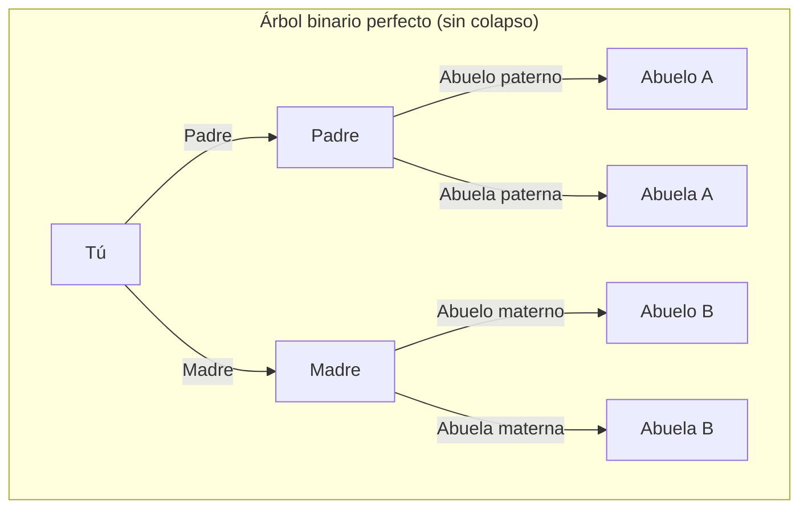
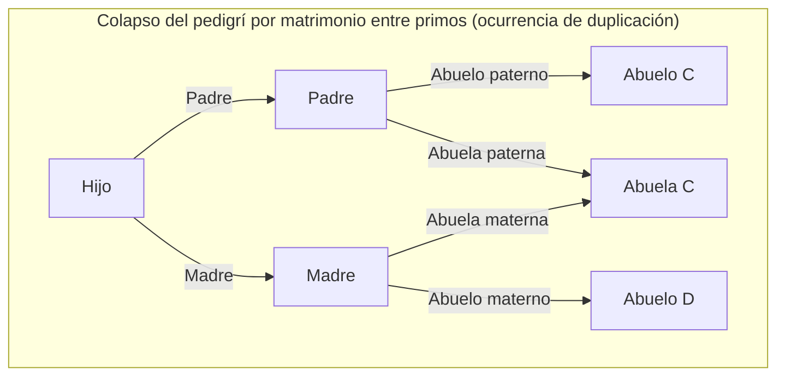
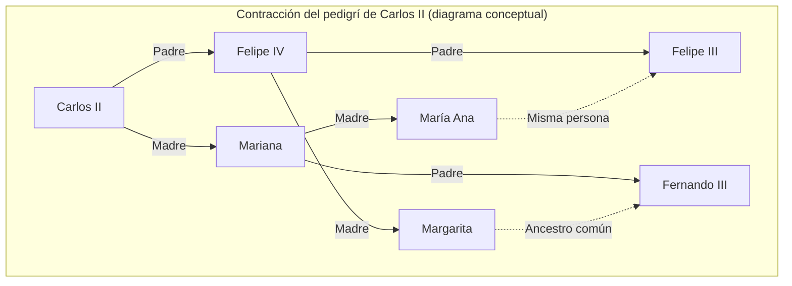

# 1. Introducción: El misterio de los ancestros que se multiplican infinitamente

Cuando pensamos en nuestras propias raíces, es decir, en nuestro "árbol genealógico", inevitablemente nos enfrentamos a una extraña contradicción matemática. Esta es la **paradoja de los ancestros** ([Ancestor Paradox](https://kenji.blog/p/pedigree-collapse/)).

La genealogía humana puede modelarse básicamente como un simple árbol binario. Tienes 2 padres (padre y madre), y cada uno de ellos tiene 2 padres (abuelos). A su vez, esos padres tienen 2 padres cada uno (bisabuelos). Es decir, si consideramos la generación $g$ (siendo nosotros la generación 0), el número de ancestros de hace $g$ generaciones debería ser $2^g$ personas.

Si calculamos esto, llegamos a un resultado fascinante y contraintuitivo.

- 1 generación atrás (padres): $2^1 = 2$ personas
- 2 generaciones atrás (abuelos): $2^2 = 4$ personas
- 3 generaciones atrás (bisabuelos): $2^3 = 8$ personas
- 10 generaciones atrás: $2^{10} = 1,024$ personas
- 20 generaciones atrás: $2^{20} = 1,048,576$ personas (aproximadamente 1 millón)

Hasta aquí, no hay nada especialmente extraño. Un millón es un número grande, pero bastante realista en comparación con la población de la Tierra. Sin embargo, retrocedamos aún más en el tiempo, a 30 generaciones atrás (asumiendo que una generación son unos 25 años, estaríamos en el siglo XIII, hace unos 750 años).

$$ N(30) = 2^{30} \approx 1,073,741,824 $$

Sorprendentemente, el cálculo indica que hace 30 generaciones tenías **aproximadamente 1.070 millones** de ancestros. Sin embargo, según las estimaciones de la demografía histórica, la población mundial en el siglo XIII era de **solo unos 400 millones** de personas.

En otras palabras, el "número calculado de tus ancestros" supera con creces la "población total de la Tierra en esa época".

Si retrocedemos aún más, a 40 generaciones atrás (hace unos 1000 años), el número de ancestros superaría **el billón de personas** (exactamente $1,099,511,627,776$ personas), lo que supera con creces la población total de todos los seres humanos que han existido en la Tierra desde el origen de la humanidad (que se estima entre 100.000 y 110.000 millones de personas).

Esta es la verdadera naturaleza de la **paradoja de los ancestros**. ¿Por qué se produce esta contradicción? ¿Hay un fallo matemático? La respuesta reside en el concepto del **colapso del pedigrí** (Pedigree Collapse). En este artículo, profundizaremos en este **colapso del pedigrí**, combinando modelos matemáticos, ejemplos históricos y los últimos descubrimientos de la genética de poblaciones.

# 2. ¿Qué es el colapso del pedigrí (Pedigree Collapse)?

El **colapso del pedigrí** se refiere al fenómeno en el que una misma persona aparece en múltiples lugares del árbol genealógico al retroceder en el tiempo. En pocas palabras, es el resultado de que los "matrimonios entre parientes lejanos" se hayan repetido innumerables veces a lo largo de la historia.

Si dos primos se casan, sus hijos tendrán 6 bisabuelos en lugar de los 8 habituales. Esto se debe a que los padres comparten los mismos abuelos. A medida que aparecen personas duplicadas entre los ancestros, el árbol binario ideal colapsa y ciertas partes se unen formando una forma de "diamante".

El siguiente diagrama de Mermaid compara un árbol binario perfecto con el **colapso del pedigrí** causado por el matrimonio entre primos.

En el diagrama de la derecha, se muestra que la abuela materna de la madre y la abuela paterna del padre son la misma persona (Abuela C). Debido a esto, al retroceder a la generación de los bisabuelos, las ramas que originalmente serían 8 personas independientes convergen en un número menor.

Al retroceder en la historia, los seres humanos encontraban a sus parejas dentro de comunidades pequeñas y aisladas (pueblos, valles, islas, etc.) donde los medios de transporte eran limitados. Por lo tanto, aunque no fueran conscientes de ello, los matrimonios entre parientes lejanos, como primos terceros o cuartos, eran muy comunes. Como resultado, ocurrieron innumerables duplicaciones de ancestros, y las ramas del árbol genealógico, en lugar de expandirse infinitamente, convergen superponiéndose.

# 3. Consideraciones mediante un enfoque matemático

Modelemos matemáticamente este **colapso del pedigrí**. Sea $N(g) = 2^g$ el número máximo teórico de ancestros en la generación $g$, y $A(g)$ el número real de ancestros únicos. Además, sea $P(g)$ la población total en esa época.

Lógicamente, siempre se cumple la siguiente relación:

$$ A(g) \le \min(2^g, P(g)) $$

En las generaciones recientes (cuando $g$ es pequeño), $A(g) \approx 2^g$ se cumple casi a la perfección. Sin embargo, a medida que $g$ aumenta y $2^g$ se acerca a $P(g)$, la probabilidad de matrimonios entre parientes aumenta, y $A(g)$ se desvía significativamente de $2^g$ acercándose asintóticamente a $P(g)$.

Si asumimos un modelo de apareamiento aleatorio (modelo panmíctico: un modelo en el que todos los individuos de una población se aparean al azar), podemos considerar la probabilidad de que dos personas compartan por casualidad el mismo ancestro. Apliquemos el famoso modelo de Wright-Fisher.

Supongamos que la población en la generación $g$ es constante $N$. La probabilidad de que una persona de una generación elija a una persona específica de la generación anterior como padre es $\frac{1}{N}$. Por el contrario, la probabilidad de no elegirla es $1 - \frac{1}{N}$.

La probabilidad $P_{diff}$ de que dos individuos en una generación determinada tengan **padres diferentes** en la generación anterior se puede aproximar de la siguiente manera (cuando la población $N$ es lo suficientemente grande).

$$ P_{diff} = 1 - \frac{1}{N} $$

A medida que avanzan las generaciones, la probabilidad de no tener un ancestro común disminuye exponencialmente. Más estrictamente, podemos medir el grado de este colapso utilizando el coeficiente de consanguinidad (Inbreeding Coefficient) $F$. El coeficiente de consanguinidad $F$ representa la probabilidad de que un par de alelos que posee un individuo sean "idénticos por descendencia" (Identical by descent), provenientes de un ancestro común.

$$ F = \sum \left( \frac{1}{2} \right)^{n+1} (1 + F_A) $$

Donde $n$ es el número de pasos en la ruta (path) entre los padres a través del ancestro común, y $F_A$ es el coeficiente de consanguinidad de ese mismo ancestro común. El **colapso del pedigrí** histórico se puede entender como el proceso en el que este valor $F$ se acumula innumerables veces al retroceder en las generaciones. Incluso si cada contribución a $F$ es extremadamente pequeña (por ejemplo, el matrimonio entre parientes separados por 10 grados de parentesco), la acumulación masiva de estas pequeñas contribuciones comprime drásticamente el número total de ancestros.

# 4. Un ejemplo histórico extremo: El colapso de la Casa de Habsburgo

Un ejemplo histórico donde el **colapso del pedigrí** se produjo de manera muy pronunciada e intencionada es el de la Casa de Habsburgo, una familia real europea. Por motivos políticos y de clase, como "evitar perder territorios ante otros países" y "mantener la pureza de la sangre real", practicaron matrimonios endogámicos (entre tíos y sobrinas, entre primos, etc.) durante muchas generaciones.

Un caso particularmente famoso es el de Carlos II de España (Charles II of Spain), el último rey de la Casa de Habsburgo española. Si analizamos su árbol genealógico, una persona normal tendría $2^5 = 32$ ancestros diferentes 5 generaciones atrás (la generación de los padres de los tatarabuelos). Sin embargo, en el caso de Carlos II, ¡solo había **10 ancestros** únicos!

Su coeficiente de consanguinidad $F$ alcanzó el $0.254$, un valor anormal que incluso superaba el coeficiente de tener un hijo entre hermanos o entre un padre y su hija ($F = 0.25$). Debido a los repetidos **colapsos del pedigrí**, su árbol genealógico se había encogido drásticamente hasta parecer una "red en forma de diamante".

(*El árbol genealógico real es aún más complejo, pero este es un diagrama conceptual para ilustrar la duplicación anormal.)

Este **colapso del pedigrí** extremo le provocó graves enfermedades genéticas, y finalmente la Casa de Habsburgo española se extinguió con él. Esta es una lección histórica sobre lo fatal que puede ser la pérdida de diversidad biológica.

# 5. Genética y el "ancestro común de toda la humanidad"

El concepto de **colapso del pedigrí** nos lleva en última instancia a la gran pregunta: "¿Cómo estamos conectados todos los seres humanos?".

Según las investigaciones en genética de poblaciones, si retrocedemos en los árboles genealógicos de todos los seres humanos que viven en la Tierra en la actualidad, en algún momento llegaremos a un "ancestro común a toda la humanidad viva". Esto se denomina el **Most Recent Common Ancestor** (Ancestro Común Más Reciente, MRCA).

Es importante tener cuidado de no confundirlo con la "Eva mitocondrial" o el "Adán cromosómico Y". Estos son los ancestros comunes si se rastrea "solo la línea materna pura" y "solo la línea paterna pura", respectivamente, y se remontan a decenas o cientos de miles de años atrás.

Sin embargo, el MRCA en un árbol genealógico general, que permite cualquier ruta (tanto paterna como materna), se encuentra en un pasado sorprendentemente reciente.

Según simulaciones por computadora realizadas por investigadores del Instituto Tecnológico de Massachusetts (MIT), como Douglas Rohde (en un artículo de la revista Nature de 2004), sorprendentemente se estima que el MRCA de todos los seres humanos vivos en la actualidad se remonta solo a unos pocos miles de años atrás (hace unos 2000 a 3000 años).

Aún más sorprendente es la existencia del llamado **Identical Ancestors Point** (Punto de ancestros idénticos, IAP). Se estima que este punto se encuentra hace entre 5000 y 7000 años. Las personas que vivían en este momento se dividen en dos categorías: **o bien** son "ancestros comunes de toda la humanidad actual", **o bien** "no han dejado ningún descendiente en la actualidad (su linaje se extinguió)".

Expresado matemáticamente, si retrocedemos en el tiempo $t$, sea $S_i(t)$ el conjunto de ancestros del individuo contemporáneo $i$. Siendo $H$ el conjunto de toda la humanidad, el tiempo $t_{MRCA}$ en el que existe el MRCA es el primer momento que satisface la siguiente condición:

$$ \exists x, \forall i \in H : x \in S_i(t_{MRCA}) $$

Por otro lado, el momento $t_{IAP}$ ($t_{IAP} > t_{MRCA}$) en el que existe el **Identical Ancestors Point** es el momento en que se cumple la siguiente condición dentro del subconjunto $P_{survive}(t_{IAP})$, que es la parte de la población de la época $P(t_{IAP})$ que ha dejado descendientes en la actualidad:

$$ \forall x \in P_{survive}(t_{IAP}), \forall i \in H : x \in S_i(t_{IAP}) $$

En resumen, cualquiera que haya vivido en el antiguo Egipto, Mesopotamia o la antigua China hace miles de años y tenga al menos un descendiente en la actualidad, es, **sin excepción**, tu ancestro, mi ancestro y el ancestro de todos los seres humanos en la Tierra.

# 6. Conclusión: Todos somos primos en el grado 50

La **paradoja de los ancestros** puede parecer a primera vista un simple rompecabezas matemático o un truco de cálculo. Sin embargo, al comprender el mecanismo del **colapso del pedigrí** que subyace en ella, podemos ver la verdadera naturaleza de los matrimonios y las interacciones en la historia humana.

A menudo tendemos a pensar en nosotros mismos como razas o etnias separadas y diferentes. Creemos que somos "otros" completamente ajenos debido a las diferencias de fronteras, idiomas y culturas. Sin embargo, al retroceder un poco en las ramas de nuestro árbol genealógico, estas ramas se entrelazan rápidamente y finalmente se integran en una única y gigantesca red.

La mayor lección que nos enseñan las matemáticas y la genética es que, llevado al extremo, **toda la humanidad es literalmente una inmensa familia (parientes)**. Algunos antropólogos estiman que "cualquier par de personas en la Tierra, por muy alejadas que estén, son a lo sumo primos de grado 50 (50th cousins)".

El **colapso del pedigrí** demuestra científicamente que nuestras conexiones son mucho más profundas y estrechas de lo que imaginamos. La próxima vez que pienses en tus raíces, ¿por qué no reflexionas sobre los lazos invisibles que te unen a personas de todo el mundo a través de cientos y miles de años?
