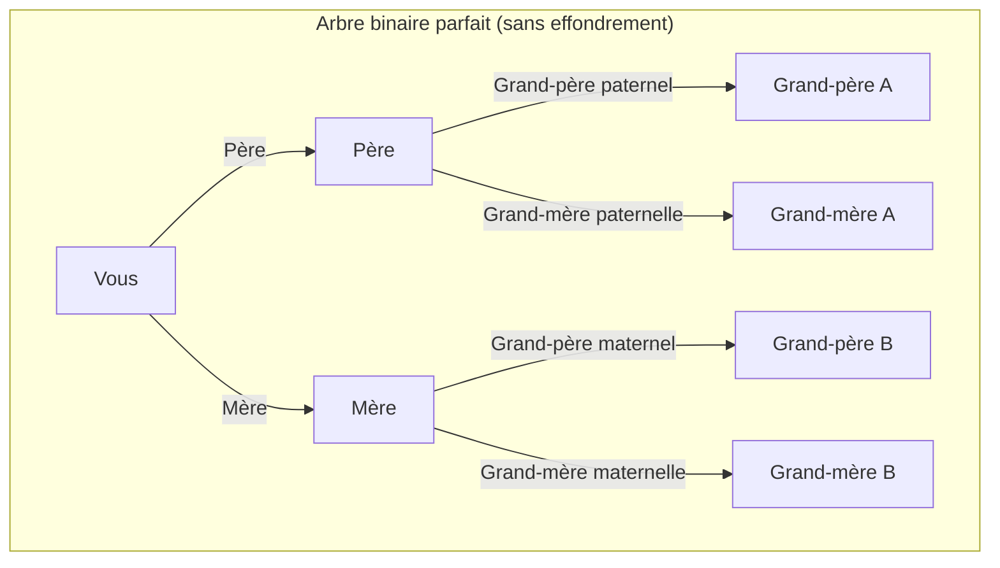
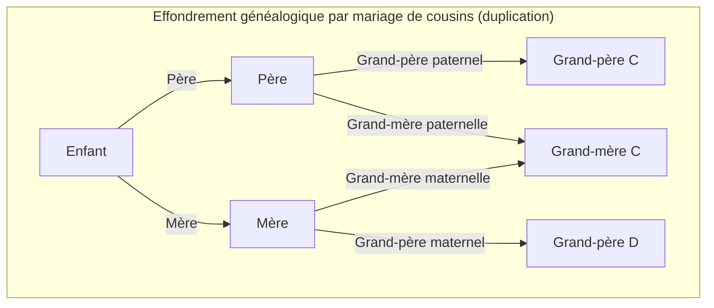
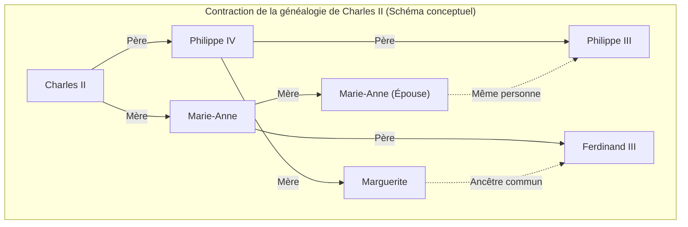

# 1. Introduction : Le mystère de la multiplication infinie des ancêtres

Lorsque nous réfléchissons à nos propres racines, c'est-à-dire à notre « arbre généalogique », nous sommes inévitablement confrontés à une étrange contradiction mathématique. Il s'agit du **paradoxe des ancêtres** ([Ancestor Paradox](https://kenji.blog/fr/p/pedigree-collapse/)).

La généalogie humaine peut être fondamentalement modélisée comme un simple arbre binaire (binary tree). Vous avez 2 parents (un père et une mère), et chacun d'eux a 2 parents (vos grands-parents). De plus, ces parents ont chacun 2 parents (vos arrière-grands-parents). En d'autres termes, si nous considérons la génération $g$ (où vous êtes la génération 0), le nombre d'ancêtres il y a $g$ générations devrait être de $2^g$ personnes.

Si l'on calcule cela, on arrive à un résultat fascinant, contre-intuitif et incompréhensible.

- Il y a 1 génération (parents) : $2^1 = 2$ personnes
- Il y a 2 générations (grands-parents) : $2^2 = 4$ personnes
- Il y a 3 générations (arrière-grands-parents) : $2^3 = 8$ personnes
- Il y a 10 générations : $2^{10} = 1,024$ personnes
- Il y a 20 générations : $2^{20} = 1,048,576$ personnes (environ 1 million)

Jusqu'ici, il n'y a rien de particulièrement étrange. Bien que 1 million soit un nombre important, il est tout à fait réaliste par rapport à la population de la Terre. Cependant, remontons encore plus loin dans le temps jusqu'à 30 générations en arrière (en supposant qu'une génération représente environ 25 ans, cela correspondrait à peu près au 13ème siècle, soit il y a 750 ans).

$$ N(30) = 2^{30} \approx 1,073,741,824 $$

Étonnamment, le nombre de vos ancêtres il y a 30 générations s'élèverait à **environ 1,07 milliard** de personnes. Or, selon les estimations de la démographie historique, la population mondiale au 13ème siècle n'était que d'**environ 400 millions** de personnes.

En d'autres termes, « le nombre théorique de vos ancêtres calculé » dépasse de loin « la population totale sur Terre à cette époque ».

Si nous remontons encore à 40 générations (il y a environ 1000 ans), le nombre d'ancêtres dépasse **environ 1 billion** de personnes (plus précisément $1,099,511,627,776$ personnes), ce qui dépasse même de loin la population totale cumulée de tous les humains ayant existé sur Terre depuis l'apparition de l'humanité (estimée à environ 100 à 110 milliards de personnes).

C'est là la véritable nature du **paradoxe des ancêtres**. Pourquoi une telle contradiction se produit-elle ? Les mathématiques sont-elles en échec ? La réponse réside dans le concept d'**effondrement des généalogies** (Pedigree Collapse). Dans cet article, nous allons explorer en profondeur cet **effondrement des généalogies**, en combinant des modèles mathématiques, des exemples historiques et les dernières découvertes de la génétique des populations.

# 2. Qu'est-ce que l'effondrement des généalogies (Pedigree Collapse) ?

L'**effondrement des généalogies** fait référence au phénomène par lequel, lorsqu'on remonte un arbre généalogique, une même personne apparaît à plusieurs endroits sur l'arbre. Pour faire simple, c'est le résultat des innombrables « mariages entre parents éloignés » qui se sont répétés au cours de l'histoire.

Si des cousins se marient, le nombre d'arrière-grands-parents pour leur enfant sera de 6, et non de 8 comme c'est habituellement le cas. En effet, les deux parents partagent les mêmes grands-parents. Ainsi, l'apparition de personnes dupliquées parmi les ancêtres brise l'arbre binaire idéal, provoquant la fusion de certaines branches pour former un « losange ».

Le diagramme Mermaid ci-dessous compare un arbre binaire parfait avec l'**effondrement des généalogies** dû au mariage entre cousins.

Le diagramme de droite ci-dessus montre que la grand-mère maternelle de la mère et la grand-mère paternelle du père sont la même personne (Grand-mère C). Par conséquent, lorsque l'on remonte à la génération des arrière-grands-parents, les branches qui auraient dû aboutir à 8 individus distincts convergent vers un nombre inférieur de personnes.

Plus on remonte dans l'histoire, plus les humains trouvaient leurs partenaires au sein de communautés restreintes avec des moyens de transport limités (villages, vallées, îles, etc.). C'est pourquoi, même sans que les personnes n'en soient conscientes, les mariages entre parents éloignés, tels que des cousins au troisième ou quatrième degré, étaient extrêmement courants. En conséquence, d'innombrables duplications d'ancêtres se sont produites, et les branches de l'arbre généalogique ne s'étendent pas à l'infini, mais convergent et se replient sur elles-mêmes.

# 3. Réflexion par approche mathématique

Modélisons mathématiquement cet **effondrement des généalogies**. Soit $N(g) = 2^g$ le nombre maximum d'ancêtres théoriques à la génération $g$, et $A(g)$ le nombre réel d'ancêtres uniques. Soit également $P(g)$ la population totale à cette époque.

Logiquement, la relation suivante est toujours vraie :

$$ A(g) \le \min(2^g, P(g)) $$

Tant que le nombre de générations est faible (lorsque $g$ est petit), $A(g) \approx 2^g$ est presque parfaitement respecté. Cependant, à mesure que $g$ augmente et que $2^g$ se rapproche de $P(g)$, la probabilité de mariage entre proches parents augmente, et $A(g)$ s'écarte grandement de $2^g$ pour converger asymptotiquement vers $P(g)$.

Si nous supposons un modèle panmictique (Panmictic model : un modèle dans lequel tous les individus d'une population s'accouplent de manière aléatoire), nous pouvons considérer la probabilité que deux personnes partagent accidentellement le même ancêtre. Pensons-y en appliquant le célèbre modèle de Wright-Fisher.

Supposons que la population à la génération $g$ soit constante et égale à $N$. La probabilité qu'une personne d'une certaine génération choisisse une personne spécifique de la génération précédente comme parent est de $\frac{1}{N}$. À l'inverse, la probabilité de ne pas la choisir est de $1 - \frac{1}{N}$.

La probabilité $P_{diff}$ que deux individus d'une génération donnée aient des **parents différents** à la génération précédente peut être approximée comme suit (si la population $N$ est suffisamment grande).

$$ P_{diff} = 1 - \frac{1}{N} $$

À mesure que les générations s'accumulent, la probabilité de ne pas avoir d'ancêtre commun diminue de manière exponentielle. Plus rigoureusement, le degré de cet effondrement peut être mesuré à l'aide du coefficient de consanguinité (Inbreeding Coefficient) $F$. Le coefficient de consanguinité $F$ représente la probabilité qu'une paire d'allèles possédés par un individu soient des « gènes identiques (Identical by descent) » hérités d'un ancêtre commun.

$$ F = \sum \left( \frac{1}{2} \right)^{n+1} (1 + F_A) $$

Ici, $n$ est le nombre d'étapes dans le chemin (path) entre les deux parents via l'ancêtre commun, et $F_A$ est le coefficient de consanguinité de cet ancêtre commun lui-même. L'**effondrement des généalogies** historique peut être considéré comme le processus par lequel la valeur de ce $F$ s'accumule indéfiniment à chaque génération remontée. Même si la contribution de chaque composant à $F$ est extrêmement faible (comme le mariage entre parents éloignés de 10 degrés), la vaste accumulation de ces contributions compresse de manière spectaculaire le nombre total d'ancêtres.

# 4. Un exemple historique extrême : l'effondrement de la maison des Habsbourg

L'un des exemples historiques les plus notables et intentionnels de l'**effondrement des généalogies** est celui de la famille royale européenne des Habsbourg. Pour des raisons politiques et de classe (« pour empêcher d'autres pays de s'emparer de leurs territoires » et « pour préserver la pureté du sang royal »), ils ont pratiqué des mariages consanguins (entre oncle et nièce, entre cousins, etc.) pendant plusieurs générations.

L'exemple le plus célèbre est celui de Charles II d'Espagne, le dernier roi des Habsbourg d'Espagne. Si l'on analyse sa généalogie, un humain normal devrait avoir $2^5 = 32$ ancêtres distincts il y a 5 générations (la génération des parents des trisaïeux). Cependant, dans le cas de Charles II, il n'y avait **que 10** ancêtres uniques.

Son coefficient de consanguinité $F$ atteignait $0.254$, un chiffre anormal qui dépasse même le coefficient en cas de reproduction entre un frère et une sœur ou entre un parent et son enfant ($F = 0.25$). En raison d'un **effondrement généalogique** répété, son arbre généalogique s'était extrêmement contracté pour ressembler à un « filet en forme de losanges ».

(* L'arbre généalogique réel est encore plus complexe, mais le schéma ci-dessus est une représentation conceptuelle montrant cette duplication anormale.)

Cet **effondrement généalogique** extrême lui a causé de graves maladies génétiques, et finalement la lignée des Habsbourg d'Espagne s'est éteinte avec lui. C'est également une leçon historique montrant à quel point la perte de diversité biologique peut être fatale.

# 5. La génétique et l'« ancêtre commun de toute l'humanité »

Le concept de l'**effondrement des généalogies** conduit finalement à la grande question de savoir « comment toute l'humanité est connectée ».

Selon les recherches en génétique des populations, si l'on remonte l'arbre généalogique de tous les êtres humains vivant sur Terre aujourd'hui, on finit par atteindre à un moment donné un « ancêtre commun à toute l'humanité vivante ». C'est ce qu'on appelle le **Most Recent Common Ancestor** (le plus récent ancêtre commun, MRCA).

Il faut faire attention à la différence avec l'« Ève mitochondriale » et l'« Adam Chromosome Y ». Ce sont les ancêtres communs lorsque l'on retrace respectivement « uniquement la lignée purement maternelle » et « uniquement la lignée purement paternelle », remontant à des dizaines ou des centaines de milliers d'années.

Cependant, le MRCA dans un arbre généalogique général, qui autorise toutes les voies, indépendamment des lignées paternelles ou maternelles, se trouve dans un passé étonnamment récent.

Selon des simulations informatiques réalisées par Douglas Rohde et ses collègues du Massachusetts Institute of Technology (MIT) (par exemple, dans un article de la revue Nature en 2004), il est estimé de façon surprenante que le MRCA de toute l'humanité vivante d'aujourd'hui ne remonte qu'à quelques milliers d'années (environ 2000 à 3000 ans).

Ce qui est encore plus étonnant, c'est l'existence du moment appelé **Identical Ancestors Point** (Point des ancêtres identiques, IAP). Estimé à environ 5000 à 7000 ans dans le passé, tous les humains vivant à ce moment-là sont **soit** « les ancêtres communs de tous les humains vivant aujourd'hui », **soit** « n'ont laissé absolument aucun descendant à l'époque moderne (leur lignée s'est éteinte) ».

Si nous exprimons cela mathématiquement, en faisant reculer le temps $t$ vers le passé, soit $S_i(t)$ l'ensemble des ancêtres d'un individu arbitraire $i$ de notre époque. Si l'ensemble de toute l'humanité est $H$, le moment $t_{MRCA}$ où le MRCA existe est le premier moment satisfaisant à la condition suivante :

$$ \exists x, \forall i \in H : x \in S_i(t_{MRCA}) $$

D'autre part, le moment $t_{IAP}$ ($t_{IAP} > t_{MRCA}$) où l'**Identical Ancestors Point** existe est le moment où, dans le sous-ensemble $P_{survive}(t_{IAP})$ de la population $P(t_{IAP})$ de l'époque qui a laissé des descendants aujourd'hui, la condition suivante est satisfaite :

$$ \forall x \in P_{survive}(t_{IAP}), \forall i \in H : x \in S_i(t_{IAP}) $$

En résumé, toute personne vivant dans l'Égypte ancienne, en Mésopotamie ou dans la Chine antique il y a quelques milliers d'années, et qui a laissé au moins un descendant à l'époque moderne, est **sans exception** votre ancêtre, mon ancêtre et l'ancêtre de tous les humains sur Terre.

# 6. Conclusion : Nous sommes tous des cousins au 50ème degré

À première vue, le **paradoxe des ancêtres** ressemble à un simple casse-tête mathématique ou à une astuce de calcul. Cependant, en comprenant le mécanisme de l'**effondrement des généalogies** qui l'accompagne, la véritable nature des mariages et des relations dans l'histoire humaine apparaît clairement.

Nous avons tendance à penser que nous sommes divisés en différentes races et ethnies. Nous sommes persuadés d'être des « autres » totalement déconnectés les uns des autres en raison des frontières, des langues et des différences culturelles. Cependant, en remontant un peu les branches de notre arbre généalogique, ces branches s'entremêlent rapidement pour finalement s'intégrer dans un gigantesque et unique réseau.

La plus grande leçon que les mathématiques et la génétique nous enseignent est, à l'extrême, que **l'humanité tout entière est littéralement une seule grande famille (de parents)**. Certains anthropologues supposent que « même deux personnes les plus éloignées sur Terre ne sont au plus que des cousins au 50ème degré (50th cousins) ».

L'**effondrement des généalogies** prouve scientifiquement que nos liens sont plus profonds et plus intimes que nous ne l'imaginons. La prochaine fois que vous penserez à vos propres racines, pourquoi ne pas méditer sur les liens invisibles que nous partageons avec des personnes du monde entier, par-delà des centaines et des milliers d'années ?
