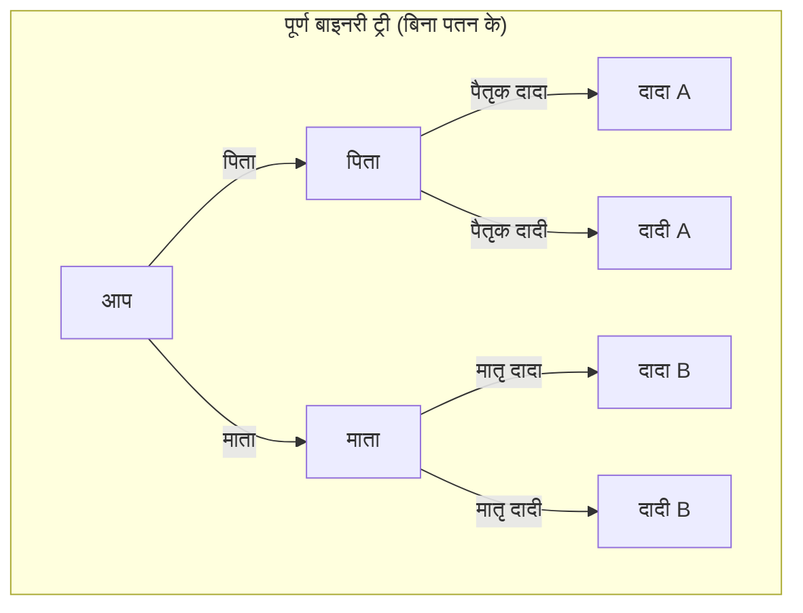
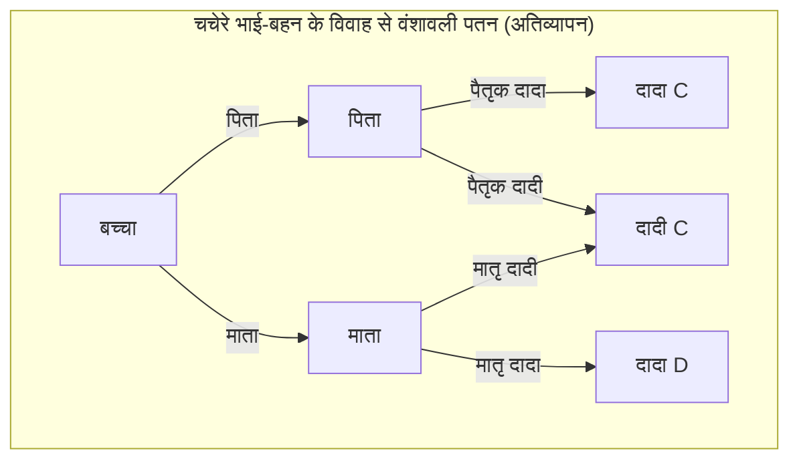
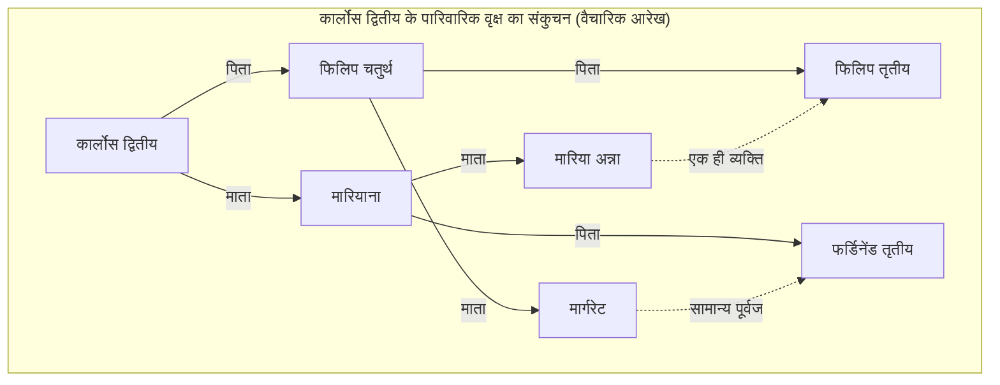

# 1. परिचय: असीमित रूप से बढ़ते पूर्वजों का रहस्य

जब हम अपनी जड़ों, यानी अपने "पारिवारिक वृक्ष" के बारे में सोचते हैं, तो हम अनिवार्य रूप से एक अजीब गणितीय विरोधाभास का सामना करते हैं। यह **पूर्वजों का विरोधाभास** (Ancestor Paradox) है।

मानव वंशावली को मूल रूप से एक सरल बाइनरी ट्री (द्विआधारी वृक्ष) के रूप में तैयार किया जा सकता है। आपके 2 माता-पिता (पिता और माता) हैं, और उनमें से प्रत्येक के 2 माता-पिता (दादा-दादी) हैं। और उनके माता-पिता के भी 2 माता-पिता (परदादा-परदादी) हैं। यानी, यदि पीढ़ी को $g$ (स्वयं को 0 पीढ़ी) माना जाए, तो $g$ पीढ़ियों पहले पूर्वजों की संख्या $2^g$ होनी चाहिए।

जब आप इसकी गणना करते हैं, तो आप एक बहुत ही दिलचस्प और सहज ज्ञान के विपरीत, हैरान करने वाले परिणाम पर पहुँचते हैं।

- 1 पीढ़ी पहले (माता-पिता): $2^1 = 2$ लोग
- 2 पीढ़ियाँ पहले (दादा-दादी): $2^2 = 4$ लोग
- 3 पीढ़ियाँ पहले (परदादा-परदादी): $2^3 = 8$ लोग
- 10 पीढ़ियाँ पहले: $2^{10} = 1,024$ लोग
- 20 पीढ़ियाँ पहले: $2^{20} = 1,048,576$ लोग (लगभग 10 लाख)

यहाँ तक कुछ भी खास अजीब नहीं है। 10 लाख एक बड़ी संख्या है, लेकिन पृथ्वी की जनसंख्या को देखते हुए यह काफी यथार्थवादी संख्या है। हालांकि, चलिए समय में और पीछे चलते हैं और 30 पीढ़ियों पहले (यदि हम मान लें कि एक पीढ़ी लगभग 25 वर्ष की होती है, तो यह आज से लगभग 750 वर्ष पहले 13वीं सदी के आसपास होगा) के बारे में सोचते हैं।

$$ N(30) = 2^{30} \approx 1,073,741,824 $$

आश्चर्यजनक रूप से, 30 पीढ़ियों पहले आपके पूर्वजों की संख्या **लगभग 1 अरब 7 करोड़ 30 लाख** आंकी जाती है। लेकिन ऐतिहासिक जनसांख्यिकी के अनुमानों के अनुसार, 13वीं सदी में विश्व की जनसंख्या **लगभग 40 करोड़** ही थी।

अर्थात, "गणना के अनुसार आपके पूर्वजों की संख्या" "उस समय की पृथ्वी की कुल जनसंख्या" से कहीं अधिक हो जाती है।

यदि हम 40 पीढ़ियों पहले (लगभग 1000 वर्ष पहले) तक पीछे जाएँ, तो पूर्वजों की संख्या **लगभग 1 ट्रिलियन** (सटीक रूप से $1,099,511,627,776$) से अधिक हो जाती है, जो कि मानव जाति के जन्म के बाद से पृथ्वी पर रहने वाले सभी लोगों की कुल संख्या (लगभग 100-110 अरब मानी जाती है) से भी कहीं अधिक है।

यही **पूर्वजों का विरोधाभास** की असलियत है। ऐसा विरोधाभास क्यों उत्पन्न होता है? क्या यह गणितीय रूप से विफल है? इसका उत्तर **वंशावली पतन** (Pedigree Collapse) की अवधारणा में निहित है। इस लेख में, हम गणितीय मॉडल, ऐतिहासिक उदाहरणों और नवीनतम जनसंख्या आनुवंशिकी निष्कर्षों का उपयोग करके इस **वंशावली पतन** की गहराई से पड़ताल करेंगे।

# 2. वंशावली पतन (Pedigree Collapse) क्या है?

**वंशावली पतन** (Pedigree Collapse) एक ऐसी घटना है, जहां परिवार के पेड़ (वंशावली) में पीछे जाने पर, एक ही व्यक्ति वंशावली पर कई स्थानों पर दिखाई देता है। सीधे शब्दों में कहें तो, यह इतिहास में अनगिनत बार दोहराए गए "दूर के रिश्तेदारों के बीच विवाह" का परिणाम है।

यदि चचेरे भाई-बहन आपस में शादी करते हैं, तो उनके बच्चे के लिए परदादा-परदादी आमतौर पर निर्धारित 8 के बजाय 6 होंगे। ऐसा इसलिए है क्योंकि माता-पिता एक ही दादा-दादी साझा करते हैं। इस प्रकार, पूर्वजों में अतिव्यापी (overlapping) व्यक्तियों के प्रकट होने से, आदर्श बाइनरी ट्री ढह जाता है, और कुछ हिस्से "हीरे (diamond)" के आकार में जुड़ जाते हैं।

नीचे दिया गया Mermaid आरेख एक पूर्ण बाइनरी ट्री और चचेरे भाई-बहन के विवाह के कारण होने वाले **वंशावली पतन** की तुलना करता है।

ऊपर दिए गए दाईं ओर के आरेख में, यह दर्शाता है कि माता की नानी (मातृ दादी) और पिता की दादी (पैतृक दादी) एक ही व्यक्ति (दादी C) हैं। इसके परिणामस्वरूप, जब हम परदादा-परदादी की पीढ़ी में वापस जाते हैं, तो मूल रूप से 8 स्वतंत्र लोगों की शाखाएं उससे कम लोगों की संख्या में सिमट जाती हैं।

जैसे-जैसे हम इतिहास में पीछे जाते हैं, लोगों को संकीर्ण समुदायों (गाँवों, घाटियों, द्वीपों आदि) में अपने जीवनसाथी मिलते थे जहाँ यातायात के साधन सीमित थे। इसलिए, भले ही व्यक्ति को इसके बारे में बिल्कुल भी जानकारी न हो, तीसरे या चौथे चचेरे भाई-बहन जैसे दूर के रिश्तेदारों के बीच विवाह बहुत आम था। परिणामस्वरूप, पूर्वजों का अतिव्यापन अनगिनत बार होता है, और परिवार के पेड़ की शाखाएं असीमित रूप से फैलने के बजाय, एक-दूसरे पर मुड़कर अभिसरित (converge) हो जाती हैं।

# 3. गणितीय दृष्टिकोण से विश्लेषण

आइए इस **वंशावली पतन** को एक गणितीय सूत्र के साथ मॉडल करें। मान लें कि पीढ़ी $g$ में सैद्धांतिक रूप से पूर्वजों की अधिकतम संख्या $N(g) = 2^g$ है, और वास्तविक विशिष्ट पूर्वजों की संख्या $A(g)$ है। साथ ही, उस समय की कुल जनसंख्या को $P(g)$ मान लें।

तार्किक रूप से, निम्नलिखित संबंध हमेशा सही होता है।

$$ A(g) \le \min(2^g, P(g)) $$

जब पीढ़ियां कम होती हैं (जब $g$ छोटा होता है), तो $A(g) \approx 2^g$ लगभग पूरी तरह से सही होता है। हालांकि, जैसे-जैसे $g$ बड़ा होता है और $2^g$, $P(g)$ के करीब पहुंचता है, रिश्तेदारों के बीच विवाह की संभावना बढ़ जाती है, और $A(g)$, $2^g$ से काफी विचलित हो जाता है और $P(g)$ की ओर अग्रसर होने लगता है।

यदि हम यादृच्छिक संभोग मॉडल (Panmictic model: एक ऐसा मॉडल जिसमें आबादी के सभी व्यक्ति बेतरतीब ढंग से संभोग करते हैं) मान लें, तो हम इस संभावना पर विचार कर सकते हैं कि दो लोग संयोग से एक ही पूर्वज साझा करते हैं। आइए प्रसिद्ध राइट-फिशर (Wright-Fisher) मॉडल को लागू करके इसके बारे में सोचें।

मान लें कि पीढ़ी $g$ में जनसंख्या स्थिर $N$ है। इस बात की संभावना $\frac{1}{N}$ है कि एक पीढ़ी का कोई व्यक्ति पिछली पीढ़ी के किसी विशिष्ट व्यक्ति को माता-पिता के रूप में चुनेगा। इसके विपरीत, इसे न चुनने की संभावना $1 - \frac{1}{N}$ है।

संभावना $P_{diff}$ कि किसी निश्चित पीढ़ी में दो व्यक्तियों के एक पीढ़ी पहले **अलग-अलग माता-पिता** हों, को निम्नानुसार अनुमानित किया जा सकता है (यदि जनसंख्या $N$ काफी बड़ी है)।

$$ P_{diff} = 1 - \frac{1}{N} $$

जैसे-जैसे पीढ़ियां बीतती हैं, कोई सामान्य पूर्वज न होने की संभावना घातीय रूप से (exponentially) घटती जाती है। अधिक सख्ती से कहें तो, पतन की इस डिग्री को अंतःप्रजनन गुणांक (Inbreeding Coefficient) $F$ का उपयोग करके मापा जा सकता है। अंतःप्रजनन गुणांक $F$ इस संभावना को दर्शाता है कि किसी व्यक्ति के पास एलील की एक जोड़ी है जो एक ही पूर्वज से प्राप्त "समान जीन (Identical by descent)" हैं।

$$ F = \sum \left( \frac{1}{2} \right)^{n+1} (1 + F_A) $$

यहां, $n$ आम पूर्वज के माध्यम से माता-पिता के बीच पथ (path) में चरणों की संख्या है, और $F_A$ स्वयं उस आम पूर्वज का अंतःप्रजनन गुणांक है। ऐतिहासिक **वंशावली पतन** को एक ऐसी प्रक्रिया के रूप में देखा जा सकता है जिसमें इस $F$ का मूल्य प्रत्येक पीढ़ी के पीछे जाने पर अनगिनत बार जमा होता है। भले ही $F$ में प्रत्येक व्यक्तिगत योगदान अत्यंत छोटा हो (उदाहरण के लिए, 10 डिग्री दूर के रिश्तेदारों के बीच विवाह), उन बड़ी संख्याओं का संचय पूर्वजों की कुल संख्या को नाटकीय रूप से संकुचित कर देता है।

# 4. इतिहास में एक चरम उदाहरण: हैब्सबर्ग राजवंश का पतन

यूरोपीय शाही परिवार हैब्सबर्ग राजवंश, **वंशावली पतन** का सबसे प्रमुख और जानबूझकर किया गया ऐतिहासिक उदाहरण है। उन्होंने राजनीतिक और वर्ग संबंधी कारणों से, जैसे "अन्य देशों से अपने क्षेत्र की रक्षा करना" और "शाही परिवार के खून की शुद्धता बनाए रखना", पीढ़ियों तक रिश्तेदारों (जैसे चाचा और भतीजी, या चचेरे भाई-बहनों) के बीच शादी करना जारी रखा।

एक विशेष रूप से प्रसिद्ध उदाहरण स्पैनिश हैब्सबर्ग के अंतिम राजा कार्लोस द्वितीय (Charles II of Spain) का है। जब उनकी वंशावली का विश्लेषण किया जाता है, तो एक सामान्य व्यक्ति के 5 पीढ़ियों पहले (परदादा-परदादी के माता-पिता की पीढ़ी) $2^5 = 32$ अलग-अलग पूर्वज होते। लेकिन कार्लोस द्वितीय के मामले में, आश्चर्यजनक रूप से केवल **10** विशिष्ट पूर्वज थे।

उनका अंतःप्रजनन गुणांक $F$, $0.254$ तक पहुँच गया था, जो कि एक असामान्य आंकड़ा था और भाई-बहन या माता-पिता और बच्चे के बीच बच्चे पैदा करने के गुणांक ($F = 0.25$) से भी अधिक था। बार-बार होने वाले **वंशावली पतन** के कारण, उनका परिवार का पेड़ एक बेहद सिकुड़े हुए "हीरे के जाले (diamond mesh)" जैसा बन गया था।

(*वास्तविक वंशावली और भी जटिल रूप से आपस में जुड़ी हुई है, लेकिन ऊपर दिया गया वैचारिक आरेख उस असामान्य अतिव्यापन को दर्शाता है)

इस चरम **वंशावली पतन** ने उन्हें गंभीर आनुवंशिक बीमारियों से पीड़ित कर दिया, और अंततः उनके साथ स्पेनिश हैब्सबर्ग का वंश समाप्त हो गया। यह एक ऐतिहासिक सबक भी है कि जैविक विविधता का नुकसान कितना घातक हो सकता है।

# 5. आनुवंशिकी और "सभी मानव जाति के सामान्य पूर्वज"

**वंशावली पतन** की अवधारणा अंततः इस भव्य प्रश्न की ओर ले जाती है: "सभी इंसान आपस में कैसे जुड़े हुए हैं?"

जनसंख्या आनुवंशिकी अनुसंधान से पता चलता है कि यदि हम आज पृथ्वी पर जीवित सभी मनुष्यों के पारिवारिक वृक्ष में पीछे जाते हैं, तो एक बिंदु पर हम "आज जीवित सभी मनुष्यों के एक सामान्य पूर्वज" तक पहुँच जाते हैं। इसे **Most Recent Common Ancestor** (सबसे हालिया सामान्य पूर्वज, MRCA) कहा जाता है।

यहां यह ध्यान रखना महत्वपूर्ण है कि यह "माइटोकॉन्ड्रियल ईव" या "वाई-क्रोमोसोम एडम" से कैसे भिन्न है। ये क्रमशः "केवल शुद्ध मातृ रेखा" और "केवल शुद्ध पैतृक रेखा" का पता लगाने के मामले में सामान्य पूर्वज हैं, और वे दसियों हज़ार से सैकड़ों हज़ार साल पहले के हैं।

हालांकि, वंशावली पर एक सामान्य MRCA, जो पितृसत्तात्मक/मातृसत्तात्मक रेखाओं की परवाह किए बिना सभी रास्तों की अनुमति देता है, आश्चर्यजनक रूप से हाल के अतीत में मौजूद है।

मैसाचुसेट्स इंस्टीट्यूट ऑफ टेक्नोलॉजी (MIT) के शोधकर्ता डगलस रोहडे और अन्य (2004 में नेचर पत्रिका के एक पेपर सहित) द्वारा कंप्यूटर सिमुलेशन के अनुसार, आश्चर्यजनक रूप से, आज जीवित सभी मनुष्यों के MRCA के केवल कुछ हज़ार साल (लगभग 2000-3000 साल पहले) पीछे होने का अनुमान है।

और भी अधिक आश्चर्यजनक **Identical Ancestors Point** (सभी मनुष्यों का सामान्य पूर्वज बिंदु, IAP) नामक बिंदु का अस्तित्व है। इसके बारे में अनुमान है कि यह लगभग 5000 से 7000 वर्ष पहले का है, और इस समय रहने वाले मनुष्य या तो आज जीवित सभी मनुष्यों के "सामान्य पूर्वज हैं" या "आधुनिक समय में उनका कोई वंशज नहीं बचा है (वंश विलुप्त हो गया)"।

गणितीय रूप से, यदि हम समय $t$ में पीछे जाते हैं, तो मान लें कि आधुनिक व्यक्ति $i$ के पूर्वजों का समूह $S_i(t)$ है। यदि सभी मनुष्यों के समूह को $H$ माना जाए, तो वह समय $t_{MRCA}$ जब MRCA मौजूद होता है, वह पहला बिंदु है जो निम्नलिखित शर्त को पूरा करता है।

$$ \exists x, \forall i \in H : x \in S_i(t_{MRCA}) $$

दूसरी ओर, वह समय $t_{IAP}$ ($t_{IAP} > t_{MRCA}$) जब **Identical Ancestors Point** मौजूद होता है, वह बिंदु है जिस पर उस समय की जनसंख्या के उपसमूह $P(t_{IAP})$ में से, आधुनिक समय में वंशज छोड़ने वाले उपसमूह $P_{survive}(t_{IAP})$ में निम्नलिखित शर्त पूरी होती है।

$$ \forall x \in P_{survive}(t_{IAP}), \forall i \in H : x \in S_i(t_{IAP}) $$

यानी, कोई भी व्यक्ति जो हज़ारों साल पहले प्राचीन मिस्र, मेसोपोटामिया या प्राचीन चीन में रहता था, और आज उसका कम से कम एक वंशज जीवित है, वह **बिना किसी अपवाद के** आपका पूर्वज है, मेरा पूर्वज है, और पृथ्वी पर हर इंसान का पूर्वज है।

# 6. निष्कर्ष: हम सभी 50वें चचेरे भाई-बहन हैं

**पूर्वजों का विरोधाभास** पहली नज़र में एक गणितीय पहेली या गणना चाल की तरह लग सकता है। हालांकि, इसके पीछे **वंशावली पतन** के तंत्र को समझने से मानव इतिहास में विवाह और संभोग की सही तस्वीर सामने आती है।

हम अक्सर खुद को विभाजित, विभिन्न जातियों और जातीय समूहों के रूप में सोचते हैं। राष्ट्रीय सीमाओं, भाषाओं और संस्कृतियों में अंतर के कारण, हम मानते हैं कि हम एक-दूसरे से पूरी तरह से असंबंधित "अन्य" हैं। लेकिन यदि आप परिवार के पेड़ की शाखाओं को थोड़ा पीछे ले जाते हैं, तो शाखाएं तेजी से आपस में जुड़ जाती हैं और अंततः एक विशाल जाल में विलीन हो जाती हैं।

सबसे बड़ा सबक जो गणित और आनुवंशिकी हमें सिखाते हैं, वह यह तथ्य है कि चरम मामलों में, **सभी मानवता वस्तुतः एक विशाल परिवार (रिश्तेदार) है**। कुछ मानवविज्ञानी अनुमान लगाते हैं कि "पृथ्वी पर सबसे दूर के दो लोग भी अधिक से अधिक केवल 50वें चचेरे भाई-बहन (50th cousins) हैं।"

**वंशावली पतन** वैज्ञानिक रूप से साबित करता है कि हमारे रिश्ते हमारी कल्पना से कहीं अधिक गहरे और घनिष्ठ हैं। अगली बार जब आप अपनी जड़ों के बारे में सोचें, तो उन अदृश्य बंधनों के बारे में क्यों न सोचें जो हम दुनिया भर के लोगों के साथ सैकड़ों और हजारों वर्षों में साझा करते हैं।
