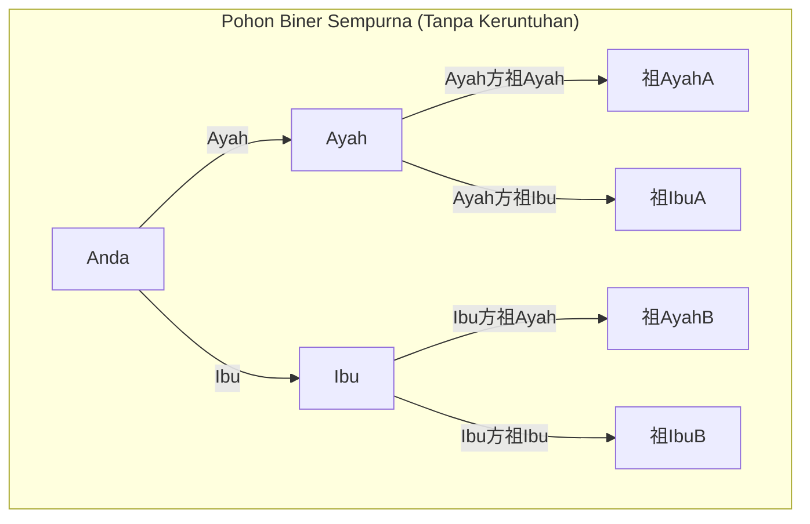
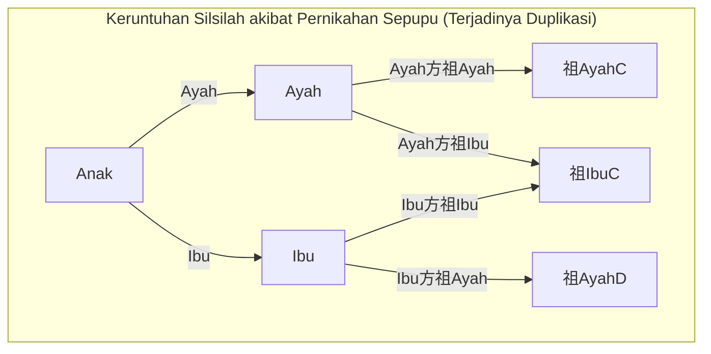
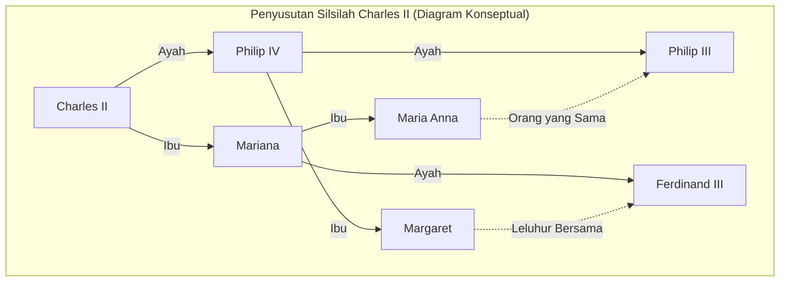

# 1. Pendahuluan: Misteri Leluhur yang Berkembang Biak Tanpa Batas

Ketika kita memikirkan akar kita sendiri, yaitu "pohon keluarga", kita pasti akan menghadapi kontradiksi matematis aneh yang tak terelakkan. Itulah **Paradoks Leluhur** (Ancestor Paradox).

Silsilah manusia pada dasarnya dapat dimodelkan sebagai pohon biner (binary tree) sederhana. Anda memiliki 2 orang tua (ayah dan ibu), dan masing-masing memiliki 2 orang tua (kakek-nenek). Selanjutnya, orang tua mereka masing-masing memiliki 2 orang tua (buyut). Dengan kata lain, jika kita menganggap generasi sebagai $g$ (diri sendiri adalah generasi ke-0), jumlah leluhur $g$ generasi sebelumnya seharusnya adalah $2^g$ orang.

Jika kita menghitung ini, kita akan sampai pada hasil yang sangat menarik, namun berlawanan dengan intuisi dan sulit dipahami.

- 1 generasi sebelumnya (orang tua): $2^1 = 2$ orang
- 2 generasi sebelumnya (kakek-nenek): $2^2 = 4$ orang
- 3 generasi sebelumnya (buyut): $2^3 = 8$ orang
- 10 generasi sebelumnya: $2^{10} = 1,024$ orang
- 20 generasi sebelumnya: $2^{20} = 1,048,576$ orang (sekitar 1 juta)

Sampai di sini, tidak ada yang aneh. Angka 1 juta memang besar, tetapi cukup realistis jika dibandingkan dengan populasi bumi. Namun, mari kita telusuri lebih jauh ke masa lalu, 30 generasi sebelumnya (asumsikan 1 generasi sekitar 25 tahun, maka sekitar 750 tahun yang lalu atau sekitar abad ke-13).

$$ N(30) = 2^{30} \approx 1,073,741,824 $$

Hebatnya, perhitungan menunjukkan bahwa jumlah leluhur Anda 30 generasi yang lalu adalah **sekitar 1,07 miliar orang**. Namun, menurut perkiraan demografi historis, populasi dunia pada abad ke-13 hanya sekitar **400 juta orang**.

Artinya, "jumlah leluhur Anda secara perhitungan" jauh melebihi "total populasi di seluruh bumi pada saat itu".

Jika kita telusuri lebih jauh ke 40 generasi sebelumnya (sekitar 1000 tahun yang lalu), jumlah leluhur melampaui **1 triliun orang** (tepatnya $1,099,511,627,776$ orang). Angka ini bahkan jauh melebihi total populasi semua manusia yang pernah hidup di bumi sejak manusia pertama kali muncul (diperkirakan sekitar 100 miliar hingga 110 miliar orang).

Inilah identitas asli dari **Paradoks Leluhur**. Mengapa kontradiksi seperti ini bisa terjadi? Apakah ada kegagalan secara matematis? Jawabannya terletak pada konsep **Keruntuhan Silsilah** (Pedigree Collapse). Dalam artikel ini, kita akan menggali lebih dalam tentang **Keruntuhan Silsilah** ini, memadukan model matematis, contoh nyata dalam sejarah, dan temuan terbaru dalam genetika populasi.

# 2. Apa itu Keruntuhan Silsilah (Pedigree Collapse)?

**Keruntuhan Silsilah** merujuk pada fenomena di mana orang yang sama muncul di beberapa tempat di pohon keluarga ketika kita menelusuri silsilah ke belakang. Sederhananya, ini adalah hasil dari "pernikahan antar kerabat jauh" yang telah berulang kali terjadi tanpa batas dalam sejarah.

Jika sepupu menikah, kakek-nenek buyut dari anak mereka biasanya berjumlah 6 orang, bukan 8 seperti yang biasa diasumsikan. Ini karena kedua orang tua berbagi kakek-nenek yang sama. Dengan munculnya duplikasi orang dalam leluhur dengan cara ini, pohon biner yang ideal runtuh dan bagian tertentu akan bergabung membentuk bentuk "belah ketupat" (diamond).

Diagram Mermaid berikut membandingkan pohon biner sempurna dengan **Keruntuhan Silsilah** akibat pernikahan sepupu.

Pada gambar sebelah kanan di atas, ditunjukkan bahwa nenek dari pihak ibu dan nenek dari pihak ayah adalah orang yang sama (Nenek C). Akibatnya, ketika kita menelusuri kembali ke generasi kakek-nenek buyut, cabang yang seharusnya berisi 8 orang secara independen justru akan menyusut ke jumlah orang yang lebih sedikit.

Semakin jauh kita menelusuri sejarah, manusia menemukan pasangan dalam komunitas yang sempit (desa, lembah, pulau, dll.) di mana sarana transportasi terbatas. Oleh karena itu, bahkan tanpa disadari, pernikahan antara kerabat jauh seperti sepupu derajat ketiga atau sepupu derajat keempat adalah hal yang sangat umum. Akibatnya, duplikasi leluhur terjadi tak terhitung jumlahnya, dan cabang-cabang pohon keluarga tidak meluas tanpa batas, melainkan menyusut dan saling tumpang tindih.

# 3. Pertimbangan melalui Pendekatan Matematis

Mari kita modelkan **Keruntuhan Silsilah** ini menggunakan rumus matematika. Misalkan jumlah leluhur maksimum teoretis pada generasi $g$ adalah $N(g) = 2^g$, dan jumlah leluhur unik yang sebenarnya adalah $A(g)$. Misalkan juga total populasi pada masa itu adalah $P(g)$.

Secara logis, hubungan berikut selalu berlaku:

$$ A(g) \le \min(2^g, P(g)) $$

Selama generasinya masih dekat (ketika $g$ kecil), $A(g) \approx 2^g$ hampir sepenuhnya berlaku. Namun, seiring bertambahnya $g$ dan $2^g$ mendekati $P(g)$, kemungkinan pernikahan antar kerabat meningkat, dan $A(g)$ akan menyimpang secara signifikan dari $2^g$ untuk asimtotik terhadap $P(g)$.

Dengan mengasumsikan model perkawinan acak (Panmictic model: model di mana semua individu dalam populasi kawin secara acak), kita dapat mempertimbangkan probabilitas bahwa 2 orang kebetulan berbagi leluhur yang sama. Mari kita terapkan model Wright-Fisher yang terkenal.

Asumsikan bahwa populasi pada generasi $g$ tetap konstan sebesar $N$. Probabilitas bahwa seseorang dalam suatu generasi memilih individu tertentu dari generasi sebelumnya sebagai orang tua adalah $\frac{1}{N}$. Sebaliknya, probabilitas untuk tidak memilihnya adalah $1 - \frac{1}{N}$.

Probabilitas $P_{diff}$ bahwa 2 individu dalam suatu generasi memiliki **orang tua yang berbeda** pada 1 generasi sebelumnya dapat didekati sebagai berikut (jika populasi $N$ cukup besar).

$$ P_{diff} = 1 - \frac{1}{N} $$

Seiring bertambahnya generasi, probabilitas untuk tidak memiliki leluhur yang sama menurun secara eksponensial. Lebih tepatnya, kita dapat mengukur tingkat keruntuhan ini menggunakan Koefisien Inbreeding (Inbreeding Coefficient) $F$. Koefisien inbreeding $F$ menunjukkan probabilitas bahwa sepasang alel yang dimiliki oleh suatu individu adalah "gen yang identik (Identical by descent)" yang berasal dari leluhur yang sama.

$$ F = \sum \left( \frac{1}{2} \right)^{n+1} (1 + F_A) $$

Di sini, $n$ adalah jumlah langkah (step) dalam jalur (path) antara kedua orang tua melalui leluhur bersama, dan $F_A$ adalah koefisien inbreeding dari leluhur bersama itu sendiri. **Keruntuhan Silsilah** secara historis dapat dipahami sebagai proses di mana nilai $F$ ini terakumulasi tak terhitung jumlahnya seiring berjalannya waktu. Bahkan jika setiap kontribusi individu terhadap $F$ sangat kecil (misalnya, pernikahan antara kerabat yang terpisah 10 derajat), akumulasi dari jumlah yang sangat besar itu secara drastis menekan jumlah leluhur secara keseluruhan.

# 4. Contoh Ekstrem dalam Sejarah: Keruntuhan Wangsa Habsburg

Sebagai contoh historis di mana **Keruntuhan Silsilah** paling menonjol dan terjadi secara sengaja, kita dapat menyebutkan Wangsa Habsburg, keluarga kerajaan Eropa. Demi alasan politik dan hierarki sosial—yaitu "agar wilayah tidak direbut oleh negara lain" dan "untuk menjaga kemurnian darah kerajaan"—mereka berulang kali melakukan pernikahan sedarah (antara paman dan keponakan, antar sepupu, dll.) selama beberapa generasi.

Contoh yang sangat terkenal adalah Raja Charles II dari Spanyol (Carlos II), raja terakhir dari Wangsa Habsburg Spanyol. Jika kita menganalisis silsilahnya, manusia normal pada 5 generasi sebelumnya (generasi orang tua dari kakek-nenek buyut) seharusnya memiliki $2^5 = 32$ leluhur yang berbeda. Namun dalam kasus Charles II, hanya ada **10 orang leluhur unik** yang ada.

Koefisien inbreeding $F$-nya mencapai $0.254$, sebuah angka abnormal yang bahkan melampaui koefisien perkawinan sedarah antara saudara kandung atau antara orang tua dan anak ($F = 0.25$). Karena **Keruntuhan Silsilah** yang terjadi berulang kali, silsilah keluarganya telah menyusut secara ekstrem seperti "jaring berbentuk belah ketupat".

(*Silsilah yang sebenarnya bahkan lebih rumit dan saling terkait, tetapi diagram di atas adalah representasi konseptual yang menunjukkan duplikasi abnormal tersebut)

**Keruntuhan Silsilah** yang ekstrem ini memberinya kelainan genetik yang parah, dan akhirnya Wangsa Habsburg Spanyol terputus garis keturunannya pada generasinya. Ini juga menjadi pelajaran sejarah yang menunjukkan betapa fatalnya hilangnya keragaman biologis.

# 5. Genetika dan "Leluhur Bersama Seluruh Umat Manusia"

Konsep **Keruntuhan Silsilah** pada akhirnya mengarah pada pertanyaan besar: "Bagaimana seluruh umat manusia terhubung?"

Menurut penelitian genetika populasi, ditunjukkan bahwa jika kita menelusuri kembali silsilah semua manusia yang hidup di bumi saat ini, pada suatu titik kita akan sampai pada "leluhur bersama dari semua manusia yang hidup saat ini". Ini disebut **Most Recent Common Ancestor** (Leluhur Bersama Paling Baru, MRCA).

Yang perlu diperhatikan di sini adalah perbedaannya dengan "Hawa Mitokondria (Mitochondrial Eve)" atau "Adam Kromosom-Y (Y-chromosomal Adam)". Keduanya adalah leluhur bersama ketika kita hanya menelusuri "garis ibu murni" atau "garis ayah murni" masing-masing, yang berumur puluhan ribu hingga lebih dari seratus ribu tahun yang lalu.

Namun, terlepas dari garis keturunan ayah atau ibu, MRCA dalam silsilah umum yang memungkinkan jalur mana pun, secara mengejutkan berada di masa lalu yang sangat dekat.

Menurut simulasi komputer oleh Douglas Rohde dan rekan-rekannya dari Massachusetts Institute of Technology (MIT) (termasuk dalam sebuah makalah di jurnal Nature tahun 2004), diperkirakan secara mengejutkan bahwa MRCA dari semua manusia yang hidup saat ini hanya berumur beberapa ribu tahun yang lalu (sekitar 2000 hingga 3000 tahun yang lalu).

Yang lebih mengejutkan lagi adalah keberadaan titik waktu yang disebut **Identical Ancestors Point** (Titik Leluhur Identik, IAP). Titik ini diperkirakan berada sekitar 5000 hingga 7000 tahun yang lalu, dan populasi manusia yang hidup pada titik ini adalah **salah satu dari yang berikut**: mereka adalah "leluhur bersama dari semua umat manusia yang hidup saat ini" atau mereka "tidak meninggalkan keturunan sama sekali di zaman modern (garis keturunan mereka punah)".

Menyatakannya secara matematis, jika kita menggerakkan waktu $t$ ke masa lalu, misalkan himpunan leluhur dari individu modern $i$ adalah $S_i(t)$. Jika himpunan seluruh umat manusia adalah $H$, waktu saat MRCA ada, $t_{MRCA}$, adalah titik pertama yang memenuhi kondisi berikut:

$$ \exists x, \forall i \in H : x \in S_i(t_{MRCA}) $$

Di sisi lain, waktu saat **Identical Ancestors Point** ada, $t_{IAP}$ ($t_{IAP} > t_{MRCA}$), adalah titik saat kondisi berikut dipenuhi pada subhimpunan $P_{survive}(t_{IAP})$ yang telah meninggalkan keturunan modern, dari total himpunan populasi $P(t_{IAP})$ pada waktu itu:

$$ \forall x \in P_{survive}(t_{IAP}), \forall i \in H : x \in S_i(t_{IAP}) $$

Dengan kata lain, siapa pun yang hidup ribuan tahun yang lalu di Mesir kuno, Mesopotamia, atau Tiongkok kuno, dan memiliki setidaknya satu keturunan yang masih hidup di zaman modern, **tanpa terkecuali** adalah leluhur Anda, leluhur saya, dan leluhur dari seluruh umat manusia di bumi.

# 6. Kesimpulan: Kita Semua adalah Sepupu Derajat ke-50

**Paradoks Leluhur** pada pandangan pertama tampak hanya seperti teka-teki matematika atau trik perhitungan. Namun, dengan memahami mekanisme **Keruntuhan Silsilah** di baliknya, kita dapat melihat sifat sebenarnya dari pernikahan dan hubungan interaksi dalam sejarah umat manusia.

Kita cenderung berpikir bahwa diri kita terpisah-pisah sebagai ras atau kelompok etnis yang berbeda. Karena batas negara, bahasa, dan perbedaan budaya, kita percaya bahwa kita adalah "orang lain" yang sama sekali tidak ada hubungannya satu sama lain. Namun, hanya dengan menelusuri kembali cabang-cabang pohon keluarga sedikit saja, cabang-cabang itu akan dengan cepat saling terkait dan akhirnya menyatu menjadi satu jaringan besar.

Pelajaran terbesar yang diajarkan oleh matematika dan genetika adalah fakta bahwa, secara ekstrem, **seluruh umat manusia secara harfiah adalah satu keluarga besar (kerabat)**. Beberapa antropolog menduga bahwa "dua orang dari bagian dunia mana pun, betapa pun jauhnya, paling jauh hanyalah sepupu derajat ke-50 (50th cousins)".

**Keruntuhan Silsilah** membuktikan secara ilmiah bahwa kita saling terhubung secara mendalam dan erat, jauh lebih dari yang kita bayangkan. Saat Anda memikirkan akar Anda sendiri, mengapa tidak meluangkan waktu sejenak untuk merenungkan ikatan tak terlihat yang Anda bagikan dengan orang-orang di seluruh dunia, yang melampaui waktu ratusan atau ribuan tahun?
