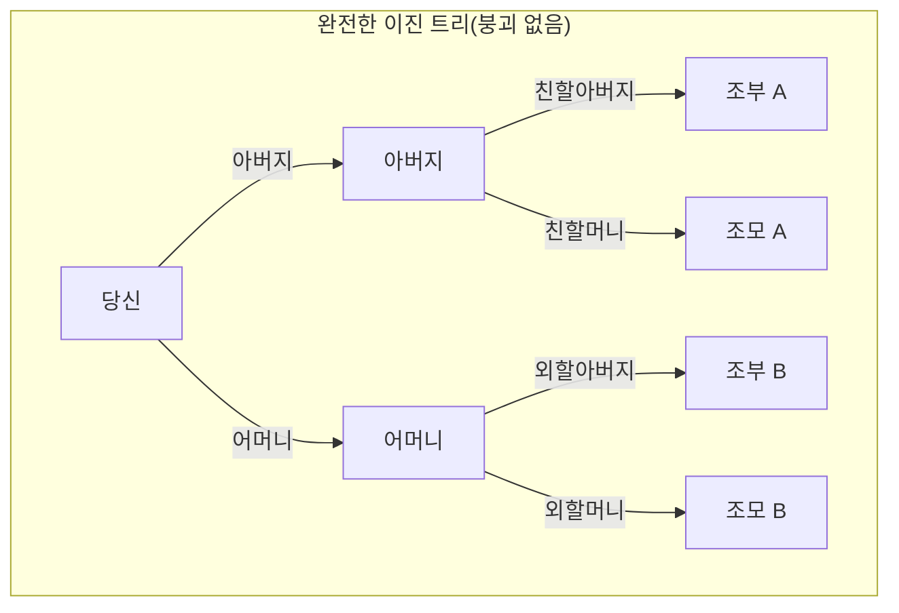
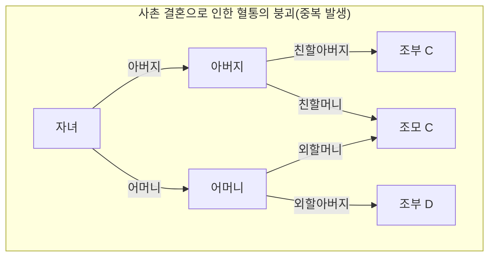
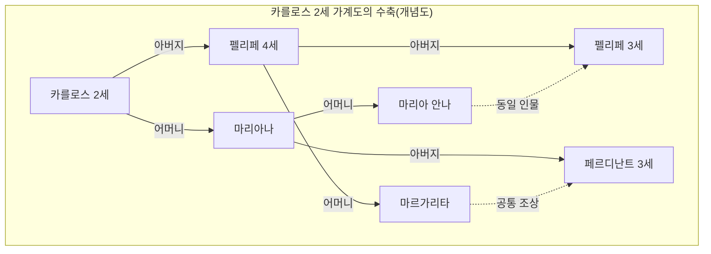

# 1. 시작하며: 무한히 증식하는 조상의 수수께끼

우리가 우리 자신의 뿌리, 즉 '가계도'에 대해 생각할 때, 필연적으로 직면하는 기묘한 수학적 모순이 있습니다. 그것이 ** [조상의 역설](https://kenji.blog/ko/p/pedigree-collapse/) ** ([Ancestor Paradox](https://kenji.blog/ko/p/pedigree-collapse/))입니다.

인간의 계보는 기본적으로 단순한 이진 트리(Binary [Tree](https://kenji.blog/ko/p/tree-graph-data-structures-search-dfs-bfs-dijkstra/))로 모델링할 수 있습니다. 당신에게는 2명의 부모(아버지와 어머니)가 있고, 그 각각에게 2명의 부모(조부모)가 있습니다. 그리고 그 부모에게는 각각 2명의 부모(증조부모)가 있습니다. 즉, 세대를 $g$ (자신을 0세대)라고 하면, $g$ 세대 전의 조상의 수는 $2^g$ 명이 됩니다.

이것을 계산해 나가면, 매우 흥미롭고 직관에 반하는 불가해한 결과에 도달하게 됩니다.

- 1세대 전(부모): $2^1 = 2$ 명
- 2세대 전(조부모): $2^2 = 4$ 명
- 3세대 전(증조부모): $2^3 = 8$ 명
- 10세대 전: $2^{10} = 1,024$ 명
- 20세대 전: $2^{20} = 1,048,576$ 명(약 100만 명)

여기까지는 특별히 이상할 것이 없습니다. 100만 명이라는 숫자는 크지만, 지구의 인구 관점에서 보면 충분히 현실적인 숫자입니다. 하지만 시대 배경을 더 거슬러 올라가 30세대 전(1세대를 약 25년으로 가정하면 현재로부터 약 750년 전인 13세기경)을 생각해 봅시다.

$$ N(30) = 2^{30} \approx 1,073,741,824 $$

놀랍게도, 30세대 전 당신의 조상의 수는 ** 약 10억 7천만 명 ** 이라는 계산이 나옵니다. 그러나 역사 인구학의 추계에 따르면 13세기 당시의 세계 인구는 ** 약 4억 명 ** 정도밖에 되지 않았습니다.

즉, '계산상 당신의 조상 수'가 '당시 지구상의 전체 인구'를 크게 웃도는 것입니다.

더 나아가 40세대 전(약 1000년 전)까지 거슬러 올라가면 조상의 수는 ** 약 1조 명 ** (정확히는 $1,099,511,627,776$ 명)을 넘어서고, 이는 인류가 탄생한 이래 지금까지 지구상에 존재했던 모든 총 인구(약 1000억 명~1100억 명이라고 합니다)조차도 훨씬 넘어섭니다.

이것이 ** [조상의 역설](https://kenji.blog/ko/p/pedigree-collapse/) ** 의 실체입니다. 왜 이런 모순이 생기는 걸까요? 수학적으로 파탄난 걸까요? 그 답은 ** 혈통의 붕괴 ** (Pedigree Collapse)라는 개념에 있습니다. 본 기사에서는 이 ** 혈통의 붕괴 ** 에 대해 수학적인 모델, 역사적인 실제 사례, 그리고 최신 집단 유전학의 지식을 섞어 깊이 파고들어 보겠습니다.

# 2. 혈통의 붕괴(Pedigree Collapse)란 무엇인가?

** 혈통의 붕괴 ** (페디그리 콜랩스)란, 가계도를 거슬러 올라갔을 때 동일 인물이 계보 상의 여러 곳에 나타나는 현상을 말합니다. 간단히 말하면, '먼 친척끼리의 결혼'이 역사상 무수히 반복되어 온 결과입니다.

만약 사촌끼리 결혼했다면, 그 자녀에게 증조부모는 보통 설정되는 8명이 아니라 6명이 됩니다. 왜냐하면 양가 부모가 같은 조부모를 공유하고 있기 때문입니다. 이처럼 조상 중에 중복되는 인물이 나타남으로써 이상적인 이진 트리는 무너지고 특정 부분이 '마름모' 모양으로 결합하게 됩니다.

아래의 Mermaid 다이어그램은 완전한 이진 트리와 사촌 결혼으로 인한 ** 혈통의 붕괴 ** 를 비교한 것입니다.

위의 오른쪽 그림은 어머니의 외할머니와 아버지의 친할머니가 동일 인물(조모 C)임을 나타내고 있습니다. 이로 인해 증조부모 세대까지 거슬러 올라갔을 때, 본래라면 독립된 8명이 되어야 할 가지가 그보다 적은 인원수로 수렴해 나가게 됩니다.

역사를 거슬러 올라가면 갈수록 사람들은 이동 수단이 제한된 좁은 커뮤니티(마을, 계곡, 섬 등) 내에서 배우자를 찾았습니다. 따라서 본인이 전혀 의식하지 못하더라도 육촌이나 팔촌 같은 먼 친척끼리의 결혼이 매우 일반적이었습니다. 그 결과 조상의 중복이 무수히 발생하여 가계도의 가지는 무한히 넓어지는 것이 아니라 겹겹이 포개지듯 수렴해 나가는 것입니다.

# 3. 수식적 접근에 의한 고찰

이 ** 혈통의 붕괴 ** 를 수식으로 모델링해 봅시다. 세대 $g$ 에서의 이론상 최대 조상 수를 $N(g) = 2^g$ 라 하고, 실제 고유한 조상 수를 $A(g)$ 라고 합니다. 또한 그 시대의 총 인구를 $P(g)$ 라고 합시다.

논리적으로 항상 다음의 관계가 성립합니다.

$$ A(g) \le \min(2^g, P(g)) $$

세대가 얕을 때( $g$ 가 작을 경우)는 $A(g) \approx 2^g$ 가 거의 완벽하게 성립합니다. 그러나 $g$ 가 커져 $2^g$ 가 $P(g)$ 에 가까워짐에 따라 친척끼리 결혼할 확률이 높아지고, $A(g)$ 는 $2^g$ 와 크게 괴리되어 $P(g)$ 쪽으로 점근하게 됩니다.

무작위 교배 모델(Panmictic model: 집단 내의 모든 개체가 무작위로 교배하는 모델)을 가정했을 때, 어떤 2명이 우연히 같은 조상을 공유할 확률을 생각할 수 있습니다. 유명한 Wright-Fisher 모델을 응용하여 생각해 봅시다.

세대 $g$ 에서의 인구가 일정하게 $N$ 이라고 가정합니다. 어떤 세대의 1명이 이전 세대의 특정 인물을 부모로 선택할 확률은 $\frac{1}{N}$ 입니다. 반대로 말하면, 선택하지 않을 확률은 $1 - \frac{1}{N}$ 이 됩니다.

어떤 세대에서 두 개체가 1세대 전에 ** 다른 부모 ** 를 가질 확률 $P_{diff}$ 는 다음과 같이 근사할 수 있습니다(인구 $N$ 이 충분히 큰 경우).

$$ P_{diff} = 1 - \frac{1}{N} $$

이것이 세대를 거듭해 나가면 공통 조상을 갖지 않을 확률은 지수 함수적으로 감소합니다. 더 엄밀하게는 근교계수(Inbreeding Coefficient) $F$ 를 사용하여 이 붕괴의 정도를 측정할 수 있습니다. 근교계수 $F$ 는 어떤 개체가 갖는 한 쌍의 대립유전자가 공통 조상으로부터 유래한 '동일 유전자(Identical by descent)'일 확률을 나타냅니다.

$$ F = \sum \left( \frac{1}{2} \right)^{n+1} (1 + F_A) $$

여기서 $n$ 은 공통 조상을 경유한 양친 간의 경로(패스)에서의 단계 수, $F_A$ 는 그 공통 조상 자신의 근교계수입니다. 역사적인 ** 혈통의 붕괴 ** 는 이 $F$ 의 값이 세대를 거슬러 올라갈 때마다 무수히 축적되어 가는 과정으로 파악할 수 있습니다. 비록 각각의 $F$ 에 대한 기여가 극히 작더라도(예를 들어 10촌 정도 떨어진 친척끼리의 결혼 등), 그 방대한 수의 누적에 의해 전체 조상 수는 극적으로 압축되는 것입니다.

# 4. 역사상 극단적인 예: 합스부르크가의 붕괴

** 혈통의 붕괴 ** 가 가장 뚜렷하게, 의도적으로 행해진 역사적인 예로 유럽 왕족인 합스부르크가를 들 수 있습니다. 이들은 '타국에 영토를 빼앗기지 않기 위해', '왕가의 피의 순결을 지키기 위해'라는 정치적·계급적 이유로 몇 세대에 걸쳐 친족 간의 혼인(삼촌과 조카, 사촌 등)을 반복했습니다.

특히 유명한 것이 스페인 합스부르크가의 마지막 왕인 카를로스 2세(Charles II of Spain)의 예입니다. 그의 가계도를 분석하면 일반적인 사람이라면 5세대 전(고조부모의 부모 세대)에는 $2^5 = 32$ 명의 서로 다른 조상이 있어야 합니다. 하지만 카를로스 2세의 경우 놀랍게도 ** 단 10명 ** 만이 고유한 조상으로 존재했습니다.

그의 근교계수 $F$ 는 $0.254$ 에 달했으며, 이는 남매 간이나 부모 자식 간에 자녀를 낳았을 때의 계수( $F = 0.25$ )조차 웃도는 비정상적인 수치였습니다. 거듭된 ** 혈통의 붕괴 ** 로 인해 그의 가계도는 극단적으로 수축된 '마름모꼴 그물'처럼 되어 있었던 것입니다.

(※ 실제 가계도는 훨씬 더 복잡하게 얽혀 있지만, 위는 그 비정상적인 중복을 보여주는 개념도입니다)

이 극단적인 ** 혈통의 붕괴 ** 는 그에게 심각한 유전적 질환을 가져왔고, 결국 스페인 합스부르크가는 그의 대에서 단절되고 말았습니다. 이는 생물학적 다양성의 상실이 얼마나 치명적인지를 보여주는 역사적인 교훈이기도 합니다.

# 5. 유전학과 '전 인류의 공통 조상'

** 혈통의 붕괴 ** 라는 개념은 궁극적으로 '전 인류는 어떻게 연결되어 있는가'라는 장대한 질문에 이르게 됩니다.

집단 유전학 연구에 따르면, 현재 살아있는 모든 지구상 인류의 계보를 거슬러 올라가면 어느 시점에서 '현재 살아있는 전 인류의 공통 조상'에 다다르는 것으로 나타납니다. 이를 ** Most Recent Common Ancestor ** (가장 최근의 공통 조상, MRCA)라고 부릅니다.

여기서 주의해야 할 것은 '미토콘드리아 이브'나 'Y염색체 아담'과의 차이입니다. 이들은 각각 '순수한 모계만', '순수한 부계만'을 추적했을 때의 공통 조상이며, 수만 년에서 십몇만 년 전까지 거슬러 올라갑니다.

하지만 부계·모계를 불문하고 모든 경로를 허용하는 일반적인 계보 상의 MRCA는 놀랍게도 최근의 과거에 존재합니다.

매사추세츠 공과대학교(MIT)의 연구자인 Douglas Rohde 등의 컴퓨터 시뮬레이션(2004년 Nature지 논문 등)에 따르면, 놀랍게도 현재 살아있는 모든 인류의 MRCA는 불과 수천 년(약 2000년~3000년 전)밖에 거슬러 올라가지 않는다고 추정됩니다.

더욱 놀라운 것은 ** Identical Ancestors Point ** (전 인류 공통 조상점, IAP)라고 불리는 시점의 존재입니다. 이는 약 5000년에서 7000년 전으로 추정되며, 이 시점에 살았던 인류는 현재 살아있는 모든 인류의 '공통 조상이거나', 혹은 '현대에 자손을 전혀 남기지 못한(계통이 끊긴)' 것 ** 둘 중 하나 ** 가 됩니다.

이를 수식적으로 표현하면, 시간 $t$ 를 과거로 거슬러 올라갈 때 현대의 임의의 개체 $i$ 의 조상 집합을 $S_i(t)$ 라고 합니다. 전 인류의 집합을 $H$ 라고 하면, MRCA가 존재하는 시간 $t_{MRCA}$ 는 다음의 조건을 만족하는 최초의 시점입니다.

$$ \exists x, \forall i \in H : x \in S_i(t_{MRCA}) $$

한편, ** Identical Ancestors Point ** 가 존재하는 시간 $t_{IAP}$ ( $t_{IAP} > t_{MRCA}$ )는 당시의 인구 집합 $P(t_{IAP})$ 중에서 현대에 자손을 남긴 부분 집합 $P_{survive}(t_{IAP})$ 에 대해 다음의 조건이 만족되는 시점입니다.

$$ \forall x \in P_{survive}(t_{IAP}), \forall i \in H : x \in S_i(t_{IAP}) $$

즉, 수천 년 전 고대 이집트나 메소포타미아, 혹은 고대 중국에 살았고 현재 현대에 단 한 명이라도 자손이 남아있는 사람은 ** 예외 없이 ** 당신의 조상이며, 저의 조상이기도 하고, 지구상의 모든 인류의 조상인 것입니다.

# 6. 결론: 우리는 모두 50촌 친척이다

** [조상의 역설](https://kenji.blog/ko/p/pedigree-collapse/) ** 은 언뜻 보면 단순한 수학적인 퍼즐이나 계산의 속임수처럼 생각됩니다. 그러나 그 이면에 있는 ** 혈통의 붕괴 ** 라는 메커니즘을 이해함으로써 인류 역사에 있어서 혼인과 교류의 진정한 모습을 볼 수 있습니다.

우리는 우리 자신을 분단된 서로 다른 인종이나 민족이라고 생각하기 쉽습니다. 국경이나 언어, 문화의 차이에 의해 서로 전혀 관계없는 '타자'라고 굳게 믿고 있습니다. 그러나 가계도의 가지를 조금만 거슬러 올라가면 그 가지는 빠르게 얽혀 들어가 결국 하나의 거대한 그물망으로 통합됩니다.

수학과 유전학이 가르쳐주는 가장 큰 교훈은 극단적으로 말하면 ** 모든 인류는 글자 그대로 거대한 하나의 가족(친척)이다 ** 라는 사실입니다. 인류학자 중에는 "지구상 아무리 멀리 떨어진 두 사람이라도 기껏해야 50촌(50th cousins) 정도의 관계에 불과하다"고 추측하는 사람도 있습니다.

** 혈통의 붕괴 ** 는 우리가 상상하는 이상으로 서로의 연결이 깊고 밀접하다는 것을 과학적으로 증명하고 있는 것입니다. 다음에 자신의 뿌리에 대해 생각할 때는 수백 년, 수천 년이라는 시간을 넘어 전 세계의 사람들과 공유하고 있는 보이지 않는 끈에 대해 생각해 보는 것은 어떨까요?
