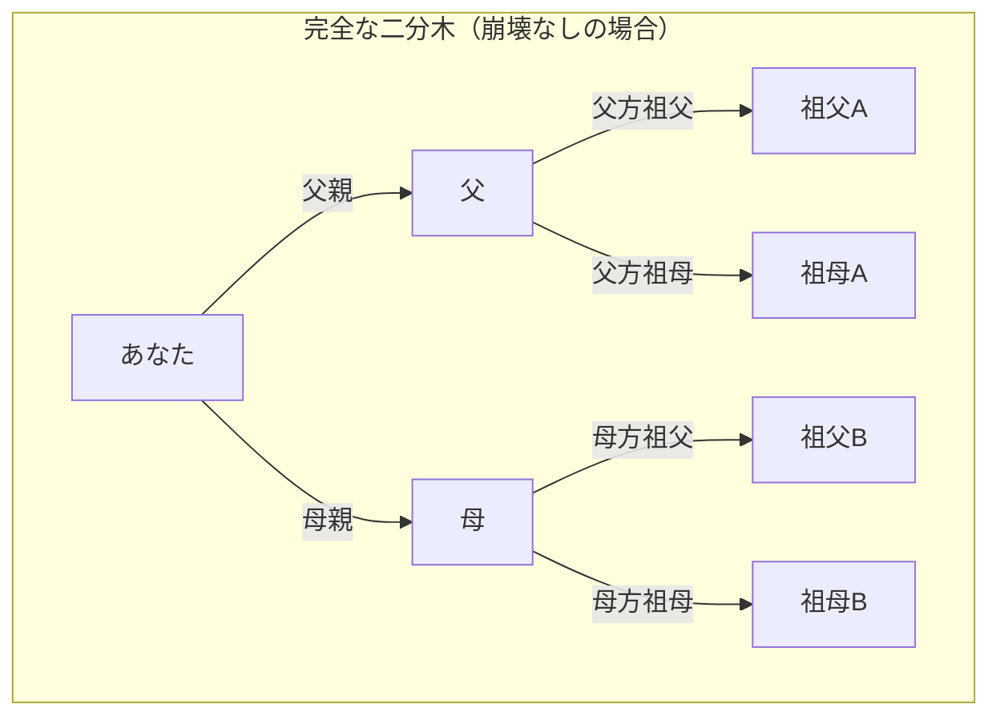
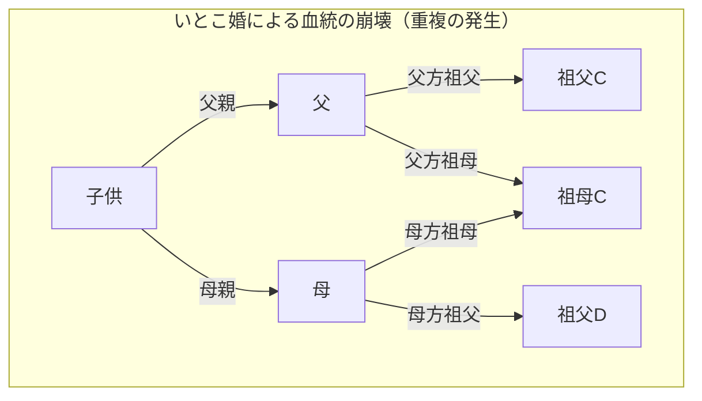
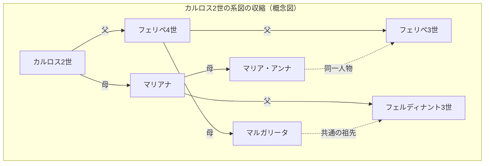

# 1. はじめに：無限に増殖する先祖の謎

私たちが自分自身のルーツ、つまり「家系図」について考えるとき、必然的に直面する奇妙な数学的矛盾があります。それが **[先祖のパラドックス](https://kenji.blog/p/pedigree-collapse/)** （[Ancestor Paradox](https://kenji.blog/p/pedigree-collapse/)）です。

人間の系図は、基本的には単純な二分木（バイナリツリー）としてモデル化できます。あなたには2人の親（父と母）がおり、そのそれぞれに2人の親（祖父母）がいます。さらにその親にはそれぞれ2人の親（曾祖父母）がいます。つまり、世代を $g$ （自分を0世代目）とすると、 $g$ 世代前の先祖の数は $2^g$ 人となるはずです。

これを計算していくと、非常に興味深い、そして直感に反する不可解な結果に行き着きます。

- 1世代前（親）： $2^1 = 2$ 人
- 2世代前（祖父母）： $2^2 = 4$ 人
- 3世代前（曾祖父母）： $2^3 = 8$ 人
- 10世代前： $2^{10} = 1,024$ 人
- 20世代前： $2^{20} = 1,048,576$ 人（約100万人）

ここまでは、特に不思議なことはありません。100万人という数字は大きいですが、地球の人口から見れば十分に現実的な数字です。しかし、さらに時代を遡って30世代前（1世代を約25年と仮定すると、現在から約750年前の13世紀ごろ）を考えてみましょう。

$$ N(30) = 2^{30} \approx 1,073,741,824 $$

なんと、30世代前のあなたの先祖の数は **約10億7千万人** という計算になります。しかし、歴史人口学の推計によれば、13世紀当時の世界人口は **約4億人** 程度しかいませんでした。

つまり、「計算上のあなたの先祖の数」が「当時の地球上の全人口」を大幅に上回ってしまうのです。

さらに40世代前（約1000年前）まで遡ると、先祖の数は **約1兆人** （正確には $1,099,511,627,776$ 人）を超え、これは人類が誕生して以来これまでに地球上に存在したすべての総人口（約1000億人〜1100億人と言われています）すらも遥かに超えてしまいます。

これが **[先祖のパラドックス](https://kenji.blog/p/pedigree-collapse/)** の正体です。なぜこのような矛盾が生じるのでしょうか？数学的に破綻しているのでしょうか？その答えが **血統の崩壊** （Pedigree Collapse）という概念にあります。本記事では、この **血統の崩壊** について、数学的なモデル、歴史的な実例、そして最新の集団遺伝学の知見を交えて、深く掘り下げていきます。

# 2. 血統の崩壊（Pedigree Collapse）とは何か？

**血統の崩壊** （ペディグリー・コラプス）とは、家系図を遡った際に、同一人物が系図上の複数の場所に現れる現象のことを指します。簡単に言えば、「遠い親戚同士の結婚」が歴史上で無数に繰り返されてきたことによる結果です。

もし、いとこ同士が結婚した場合、その子供にとっての曾祖父母は通常設定される8人ではなく、6人になります。なぜなら、両親が同じ祖父母を共有しているからです。このように、先祖の中に重複する人物が現れることで、理想的な二分木は崩れ、特定の箇所が「ひし形」に結合することになります。

以下の Mermaid 図は、完全な二分木と、いとこ婚による **血統の崩壊** を比較したものです。

上記の右側の図では、母親の母方祖母と、父親の父方祖母が同一人物（祖母C）であることを示しています。これにより、曾祖父母の世代にまで遡った時、本来なら独立した8人になるはずの枝が、それより少ない人数に収束していくことになります。

歴史を遡れば遡るほど、人間は移動手段が限られた狭いコミュニティ（村や谷、島など）内で配偶者を見つけていました。そのため、本人が全く意識していなくても、第3従兄弟や第4従兄弟といった遠縁の親戚同士での結婚が非常に一般的なものでした。その結果、先祖の重複が無数に発生し、家系図の枝は無限に広がるのではなく、折り重なるように収束していくのです。

# 3. 数式的アプローチによる考察

この **血統の崩壊** を数式でモデル化してみましょう。世代 $g$ における理論上の最大先祖数を $N(g) = 2^g$ とし、実際の固有の先祖数を $A(g)$ とします。また、その時代の総人口を $P(g)$ とします。

論理的に、常に以下の関係が成り立ちます。

$$ A(g) \le \min(2^g, P(g)) $$

世代が浅いうち（ $g$ が小さい場合）は、 $A(g) \approx 2^g$ がほぼ完璧に成り立ちます。しかし、 $g$ が大きくなり $2^g$ が $P(g)$ に近づくにつれて、親戚同士の結婚の確率が高まり、 $A(g)$ は $2^g$ から大きく乖離して $P(g)$ の方に漸近していきます。

ランダム交配モデル（Panmictic model：集団内のすべての個体がランダムに交配するモデル）を仮定した場合、ある2人が偶然同じ祖先を共有する確率を考えることができます。有名な Wright-Fisher モデルを応用して考えてみましょう。

世代 $g$ における人口が一定 $N$ であると仮定します。ある世代の1人が、前の世代の特定の人物を親として選ぶ確率は $\frac{1}{N}$ です。逆に言えば、選ばない確率は $1 - \frac{1}{N}$ となります。

ある世代における2人の個体が、1世代前で **異なる親** を持つ確率 $P_{diff}$ は、以下のように近似できます（人口 $N$ が十分に大きい場合）。

$$ P_{diff} = 1 - \frac{1}{N} $$

これが世代を重ねていくと、共通の祖先を持たない確率は指数関数的に減少していきます。より厳密には、近交係数（Inbreeding Coefficient） $F$ を用いてこの崩壊の度合いを測ることができます。近交係数 $F$ は、ある個体が持つ1対の対立遺伝子が、共通祖先から由来した「同一遺伝子（Identical by descent）」である確率を表します。

$$ F = \sum \left( \frac{1}{2} \right)^{n+1} (1 + F_A) $$

ここで、 $n$ は共通祖先を介した両親間の経路（パス）におけるステップ数、 $F_A$ はその共通祖先自身の近交係数です。歴史的な **血統の崩壊** は、この $F$ の値が世代を遡るごとに無数に蓄積していく過程と捉えることができます。たとえ一つ一つの $F$ への寄与が極めて小さくとも（例えば10親等離れた親戚同士の結婚など）、その膨大な数の積み重ねによって、全体の先祖の数は劇的に圧縮されるのです。

# 4. 歴史上の極端な例：ハプスブルク家の崩壊

**血統の崩壊** が最も顕著に、かつ意図的に行われた歴史的な例として、ヨーロッパの王族であるハプスブルク家が挙げられます。彼らは「他国に領土を奪われないため」「王家の血の純潔を守るため」という政治的・階級的な理由から、何世代にもわたって親族間での婚姻（叔父と姪、いとこ同士など）を繰り返しました。

特に有名なのが、スペイン・ハプスブルク家最後の王であるカルロス2世（Charles II of Spain）の例です。彼の系図を分析すると、通常の人間であれば5世代前（高祖父母の親の世代）には $2^5 = 32$ 人の異なる先祖がいるはずです。しかしカルロス2世の場合、なんと **わずか10人** しか固有の先祖が存在しませんでした。

彼の近交係数 $F$ は $0.254$ に達しており、これは兄妹間や親子間で子供を作った場合の係数（ $F = 0.25$ ）をすら上回る異常な数値でした。度重なる **血統の崩壊** によって、彼の家系図は極端に収縮した「ひし形の網目」のようになっていたのです。

（※実際の系図はさらに複雑に絡み合っていますが、上記はその異常な重複を示す概念図です）

この極端な **血統の崩壊** は、彼に深刻な遺伝的疾患をもたらし、最終的にスペイン・ハプスブルク家は彼の代で断絶することになりました。これは、生物学的な多様性の喪失がいかに致命的であるかを示す歴史的な教訓でもあります。

# 5. 遺伝学と「全人類の共通祖先」

**血統の崩壊** という概念は、最終的に「全人類はどのように繋がっているのか」という壮大な問いに行き着きます。

集団遺伝学の研究によれば、現在生きているすべての地球上の人類の系図を遡っていくと、ある時点で「現在生きている全人類の共通の先祖」にたどり着くことが示されています。これを **Most Recent Common Ancestor** （最近の共通祖先、MRCA）と呼びます。

ここで注意しなければならないのは、「ミトコンドリア・イヴ」や「Y染色体アダム」との違いです。これらはそれぞれ「純粋な母系のみ」「純粋な父系のみ」を辿った場合の共通祖先であり、数万年から十数万年前まで遡ります。

しかし、父系・母系を問わず、あらゆる経路を許容する一般的な系図上の MRCA は、驚くほど最近の過去に存在します。

マサチューセッツ工科大学（MIT）の研究者である Douglas Rohde らによるコンピュータシミュレーション（2004年のNature誌の論文など）によれば、驚くべきことに、現在生きているすべての人類の MRCA は、わずか数千年（約2000年〜3000年前）しか遡らないと推定されています。

さらに驚くべきは **Identical Ancestors Point** （全人類の共通祖先点、IAP）と呼ばれる時点の存在です。これは約5000年から7000年前と推定されており、この時点に生きていた人類は、現在生きているすべての人類の「共通の先祖である」か、あるいは「現代に子孫を全く残していない（系統が絶えた）」かの **どちらか** になります。

これを数式的に表現すると、時刻 $t$ を過去に向かって進めたとき、現代の任意の個体 $i$ の祖先の集合を $S_i(t)$ とします。全人類の集合を $H$ とすると、MRCA が存在する時刻 $t_{MRCA}$ は、以下の条件を満たす最初の時点です。

$$ \exists x, \forall i \in H : x \in S_i(t_{MRCA}) $$

一方、 **Identical Ancestors Point** が存在する時刻 $t_{IAP}$ （ $t_{IAP} > t_{MRCA}$ ）は、当時の人口集合 $P(t_{IAP})$ のうち、現代に子孫を残している部分集合 $P_{survive}(t_{IAP})$ において、以下の条件が満たされる時点です。

$$ \forall x \in P_{survive}(t_{IAP}), \forall i \in H : x \in S_i(t_{IAP}) $$

つまり、数千年前の古代エジプトやメソポタミア、あるいは古代中国に生きていて、かつ現代に一人でも子孫が残っている人は、 **例外なく** あなたの先祖であり、私の先祖でもあり、地球上の全ての人類の先祖なのです。

# 6. 結論：私たちは皆、第50種いとこである

**[先祖のパラドックス](https://kenji.blog/p/pedigree-collapse/)** は、一見すると単なる数学的なパズルや計算のトリックのように思えます。しかし、その背景にある **血統の崩壊** というメカニズムを理解することで、人類の歴史における婚姻と交わりの真の姿が見えてきます。

私たちは、自分たちを分断された異なる人種や民族であると考えがちです。国境や言語、文化の違いによって、互いに全く関係のない「他者」であると信じ込んでいます。しかし、家系図の枝を少し遡るだけで、その枝は急速に絡み合い、最終的には一つの巨大な網の目へと統合されます。

数学と遺伝学が教えてくれる最大の教訓は、極論すれば **すべての人類は文字通り、巨大な一つの家族（親戚）である** という事実です。人類学者の中には、「地球上のどんなに離れた2人であっても、せいぜい第50種いとこ（50th cousins）程度の関係に過ぎない」と推測する人もいます。

**血統の崩壊** は、私たちが想像する以上に、互いの繋がりが深く、密接であることを科学的に証明しているのです。次に自分のルーツについて考えるときは、何百年、何千年という時間を超えて、世界中の人々と共有している見えない絆に思いを馳せてみてはいかがでしょうか。

