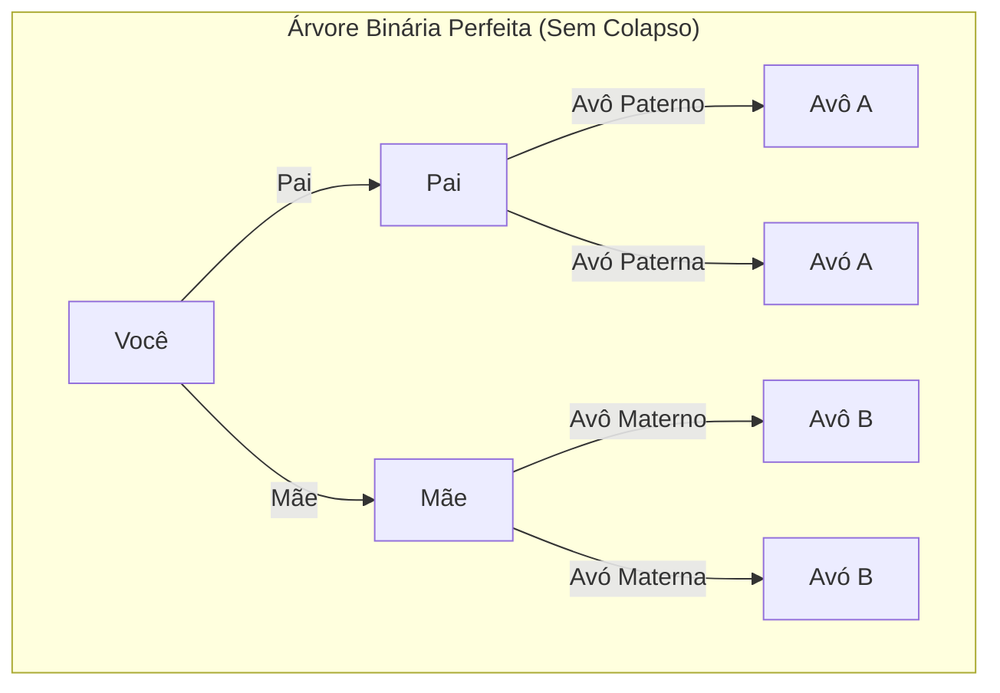
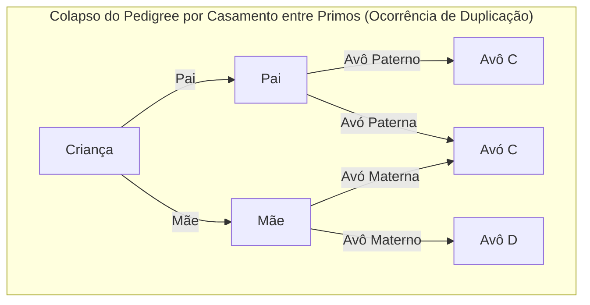
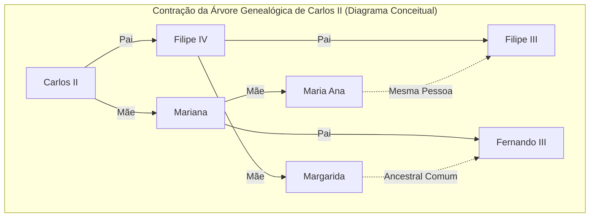

# 1. Introdução: O mistério dos ancestrais que se multiplicam infinitamente

Quando pensamos sobre as nossas próprias raízes, ou seja, a nossa "árvore genealógica", inevitavelmente deparamo-nos com uma estranha contradição matemática. Este é o **Paradoxo do Ancestral** (Ancestor Paradox).

A genealogia humana pode ser modelada basicamente como uma árvore binária simples. Você tem 2 pais (pai e mãe), e cada um deles tem 2 pais (avós). Além disso, cada um desses pais tem 2 pais (bisavós). Em outras palavras, se considerarmos a geração como $g$ (sendo você a geração 0), o número de ancestrais $g$ gerações atrás deveria ser de $2^g$ pessoas.

Se calcularmos isso, chegaremos a um resultado muito interessante e contraintuitivo.

- 1 geração atrás (pais): $2^1 = 2$ pessoas
- 2 gerações atrás (avós): $2^2 = 4$ pessoas
- 3 gerações atrás (bisavós): $2^3 = 8$ pessoas
- 10 gerações atrás: $2^{10} = 1.024$ pessoas
- 20 gerações atrás: $2^{20} = 1.048.576$ pessoas (cerca de 1 milhão)

Até aqui, não há nada de particularmente estranho. Um milhão é um número grande, mas é um número realista quando consideramos a população da Terra. No entanto, vamos recuar ainda mais e considerar 30 gerações atrás (assumindo que uma geração tem cerca de 25 anos, isso seria há cerca de 750 anos, por volta do século XIII).

$$ N(30) = 2^{30} \approx 1,073,741,824 $$

Surpreendentemente, o cálculo indica que o número de seus ancestrais 30 gerações atrás era de **cerca de 1,07 bilhão** de pessoas. No entanto, de acordo com estimativas da demografia histórica, a população mundial na época do século XIII era de apenas **cerca de 400 milhões** de pessoas.

Ou seja, "o número calculado de seus ancestrais" excede em muito "a população total da Terra naquela época".

Se recuarmos ainda mais, até 40 gerações atrás (cerca de 1000 anos atrás), o número de ancestrais ultrapassa **cerca de 1 trilhão de pessoas** (exatamente $1,099,511,627,776$ pessoas), o que supera de longe a população total de todos os seres humanos que já existiram na Terra desde o surgimento da humanidade (estimada em cerca de 100 a 110 bilhões de pessoas).

Esta é a verdadeira natureza do **Paradoxo do Ancestral**. Por que ocorre tal contradição? Será uma falha matemática? A resposta reside no conceito de **Colapso do Pedigree** (Pedigree Collapse). Neste artigo, exploraremos aprofundadamente este **Colapso do Pedigree**, combinando modelos matemáticos, exemplos históricos e as mais recentes descobertas da genética populacional.

# 2. O que é o Colapso do Pedigree (Pedigree Collapse)?

O **Colapso do Pedigree** refere-se ao fenômeno em que, ao recuarmos na árvore genealógica, a mesma pessoa aparece em vários lugares diferentes da árvore. De forma simples, é o resultado de "casamentos entre parentes distantes" que se repetiram inúmeras vezes ao longo da história.

Se primos se casarem, os bisavós dos seus filhos não serão as 8 pessoas normalmente assumidas, mas sim 6 pessoas. Isso ocorre porque os pais partilham os mesmos avós. Dessa forma, com o aparecimento de indivíduos duplicados entre os ancestrais, a árvore binária ideal entra em colapso e certas partes fundem-se num formato de "losango".

O diagrama Mermaid abaixo compara uma árvore binária perfeita com o **Colapso do Pedigree** causado pelo casamento entre primos.

O diagrama à direita acima mostra que a avó materna da mãe e a avó paterna do pai são a mesma pessoa (Avó C). Devido a isso, quando recuamos à geração dos bisavós, os ramos que normalmente seriam 8 indivíduos independentes convergem para um número menor de pessoas.

Quanto mais recuamos na história, mais os humanos encontravam os seus parceiros dentro de comunidades fechadas (aldeias, vales, ilhas, etc.) com meios de transporte limitados. Por isso, mesmo que os indivíduos não tivessem consciência disso, casamentos entre parentes distantes, como primos de terceiro ou quarto grau, eram extremamente comuns. Como resultado, ocorriam inúmeras duplicações de ancestrais, e os ramos da árvore genealógica não se expandem infinitamente, mas convergem dobrando-se sobre si mesmos.

# 3. Consideração através de uma abordagem matemática

Vamos modelar este **Colapso do Pedigree** com uma fórmula matemática. Seja $N(g) = 2^g$ o número máximo teórico de ancestrais na geração $g$, e seja $A(g)$ o número real de ancestrais únicos. Além disso, seja $P(g)$ a população total dessa época.

Logicamente, a seguinte relação é sempre verdadeira:

$$ A(g) \le \min(2^g, P(g)) $$

Enquanto a geração é recente (quando $g$ é pequeno), $A(g) \approx 2^g$ mantém-se quase perfeitamente. No entanto, à medida que $g$ aumenta e $2^g$ se aproxima de $P(g)$, a probabilidade de casamento entre parentes aumenta, e $A(g)$ desvia-se significativamente de $2^g$, aproximando-se de $P(g)$ de forma assintótica.

Assumindo um modelo de acasalamento aleatório (Panmictic model: um modelo em que todos os indivíduos de uma população acasalam aleatoriamente), podemos considerar a probabilidade de duas pessoas partilharem o mesmo ancestral por acaso. Vamos aplicar o famoso modelo de Wright-Fisher para entender isso.

Assumimos que a população na geração $g$ é constante e igual a $N$. A probabilidade de um indivíduo numa determinada geração escolher uma pessoa específica da geração anterior como progenitor é $\frac{1}{N}$. Em contrapartida, a probabilidade de não o escolher é $1 - \frac{1}{N}$.

A probabilidade $P_{diff}$ de dois indivíduos numa determinada geração terem **progenitores diferentes** uma geração atrás pode ser aproximada da seguinte forma (se a população $N$ for suficientemente grande):

$$ P_{diff} = 1 - \frac{1}{N} $$

À medida que as gerações avançam, a probabilidade de não ter um ancestral comum diminui exponencialmente. Mais rigorosamente, o grau desse colapso pode ser medido usando o Coeficiente de Endogamia (Inbreeding Coefficient) $F$. O coeficiente de endogamia $F$ representa a probabilidade de que um par de alelos que um indivíduo possui seja "idêntico por descendência" (Identical by descent), derivado de um ancestral comum.

$$ F = \sum \left( \frac{1}{2} \right)^{n+1} (1 + F_A) $$

Aqui, $n$ é o número de passos (passos de geração) no caminho entre os pais através do ancestral comum, e $F_A$ é o coeficiente de endogamia do próprio ancestral comum. O **Colapso do Pedigree** histórico pode ser entendido como o processo através do qual o valor deste $F$ se acumula inúmeras vezes à medida que recuamos nas gerações. Mesmo que cada contribuição individual para $F$ seja extremamente pequena (por exemplo, casamento entre parentes afastados por 10 graus de parentesco), a vasta acumulação dessas contribuições comprime drasticamente o número total de ancestrais.

# 4. Um exemplo extremo na história: O colapso da Casa de Habsburgo

Um dos exemplos históricos mais notórios e intencionais em que o **Colapso do Pedigree** ocorreu é o da Casa de Habsburgo, uma família real europeia. Por razões políticas e de classe, como "evitar que outros países roubassem os seus territórios" e "proteger a pureza do sangue da família real", eles repetiram casamentos consanguíneos (entre tios e sobrinhas, entre primos, etc.) ao longo de várias gerações.

Um exemplo particularmente famoso é o de Carlos II da Espanha (Charles II of Spain), o último rei da Casa de Habsburgo espanhola. Ao analisar a sua árvore genealógica, uma pessoa normal deveria ter $2^5 = 32$ ancestrais únicos recuando 5 gerações (a geração dos pais dos trisavós). No entanto, no caso de Carlos II, havia **apenas 10** ancestrais únicos.

O seu coeficiente de endogamia $F$ atingiu $0.254$, um valor anormal que até superava o coeficiente de quando crianças nascem de relações entre irmãos ou entre pais e filhos ($F = 0.25$). Devido aos sucessivos **Colapsos do Pedigree**, a sua árvore genealógica assemelhava-se a uma "rede em forma de losango" extremamente contraída.

(*Embora a árvore genealógica real esteja ainda mais intricadamente entrelaçada, o diagrama acima é conceitual para mostrar essa duplicação anormal*)

Este **Colapso do Pedigree** extremo causou-lhe doenças genéticas graves e, em última instância, a Casa de Habsburgo espanhola foi extinta na sua geração. Esta é uma lição histórica sobre o quão fatal pode ser a perda da diversidade biológica.

# 5. A Genética e o "Ancestral Comum de Toda a Humanidade"

O conceito de **Colapso do Pedigree** acaba por conduzir à grande questão: "Como toda a humanidade está conectada?".

Estudos em genética populacional mostram que, se rastrearmos a árvore genealógica de todos os humanos atualmente vivos na Terra, chegaremos a um ponto em que encontramos "um ancestral comum de todos os humanos vivos atualmente". Este indivíduo é chamado de **Most Recent Common Ancestor** (Ancestral Comum Mais Recente, MRCA).

É preciso ter cuidado aqui para notar a diferença em relação à "Eva Mitocondrial" e ao "Adão do Cromossoma Y". Estes são os ancestrais comuns quando rastreamos "apenas a linhagem puramente materna" e "apenas a linhagem puramente paterna", respetivamente, e remontam a dezenas de milhares a mais de cem mil anos atrás.

No entanto, o MRCA na árvore genealógica geral, que permite qualquer caminho, independentemente de ser linhagem paterna ou materna, existiu num passado surpreendentemente recente.

De acordo com simulações de computador realizadas pelo investigador do Instituto de Tecnologia de Massachusetts (MIT) Douglas Rohde e outros (como no artigo da revista Nature de 2004), estima-se surpreendentemente que o MRCA de todos os seres humanos vivos atualmente remonta a apenas alguns milhares de anos (cerca de 2.000 a 3.000 anos atrás).

Ainda mais surpreendente é a existência do chamado **Identical Ancestors Point** (Ponto de Ancestrais Idênticos, IAP). Estima-se que este ponto tenha ocorrido há cerca de 5.000 a 7.000 anos, e todos os humanos vivos nessa altura seriam **ou** os "ancestrais comuns de todos os humanos vivos atualmente", **ou** "não deixaram nenhum descendente nos dias de hoje (a sua linhagem foi extinta)".

Expressando isto matematicamente, quando recuamos o tempo $t$ para o passado, seja $S_i(t)$ o conjunto de ancestrais de qualquer indivíduo moderno $i$. Se o conjunto de toda a humanidade for $H$, o tempo $t_{MRCA}$ em que o MRCA existe é o primeiro ponto no tempo que satisfaz a seguinte condição:

$$ \exists x, \forall i \in H : x \in S_i(t_{MRCA}) $$

Por outro lado, o tempo $t_{IAP}$ ($t_{IAP} > t_{MRCA}$) em que o **Identical Ancestors Point** existe é o ponto em que a seguinte condição é satisfeita no subconjunto $P_{survive}(t_{IAP})$ que deixou descendentes modernos da população $P(t_{IAP})$ daquela época:

$$ \forall x \in P_{survive}(t_{IAP}), \forall i \in H : x \in S_i(t_{IAP}) $$

Em outras palavras, qualquer pessoa que tenha vivido no Antigo Egito, Mesopotâmia ou na Antiga China há alguns milhares de anos e que tenha deixado pelo menos um descendente até aos dias de hoje é, **sem exceção**, seu ancestral, meu ancestral e o ancestral de todos os seres humanos da Terra.

# 6. Conclusão: Somos todos primos de 50º grau

À primeira vista, o **Paradoxo do Ancestral** pode parecer apenas um quebra-cabeças matemático ou um truque de cálculo. No entanto, ao compreendermos o mecanismo do **Colapso do Pedigree** subjacente, podemos ver a verdadeira natureza dos casamentos e relações na história humana.

Temos a tendência de nos considerarmos como raças e etnias separadas e divididas. Acreditamos que somos "outros" completamente não relacionados devido a diferenças de fronteiras, línguas e culturas. No entanto, recuando um pouco nos ramos da árvore genealógica, eles entrelaçam-se rapidamente e, eventualmente, integram-se numa única rede gigantesca.

A maior lição que a matemática e a genética nos ensinam é que, levado ao extremo, o facto de que **toda a humanidade é literalmente uma única família gigante (parentes)**. Alguns antropólogos especulam que "não importa quão distantes duas pessoas na Terra possam estar, elas são, no máximo, primas de 50º grau (50th cousins)".

O **Colapso do Pedigree** prova cientificamente que estamos conectados de forma muito mais profunda e íntima do que imaginamos. Da próxima vez que pensar nas suas próprias raízes, que tal refletir sobre os laços invisíveis que partilha com pessoas em todo o mundo, que transcendem centenas e milhares de anos?
