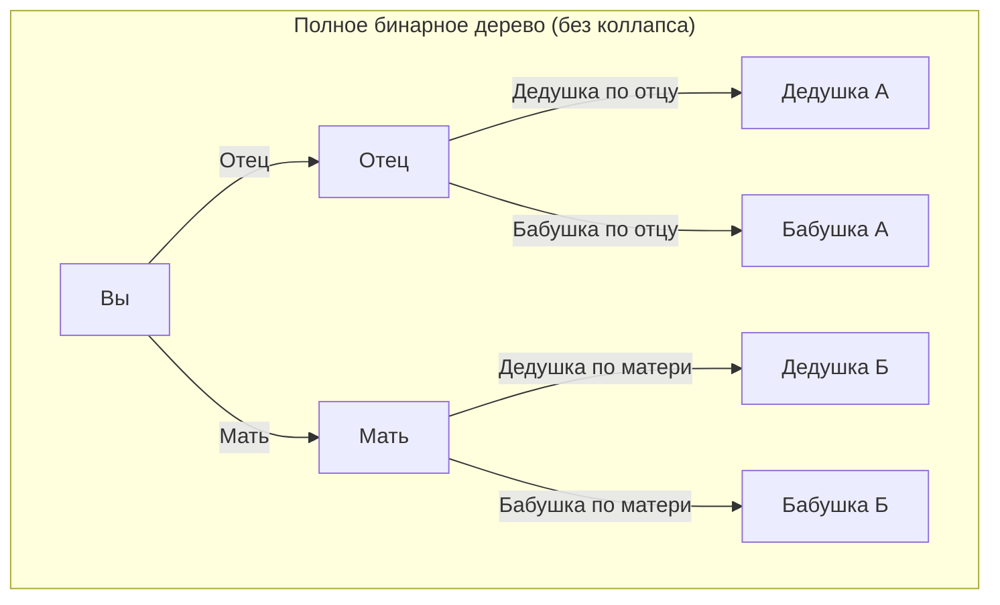
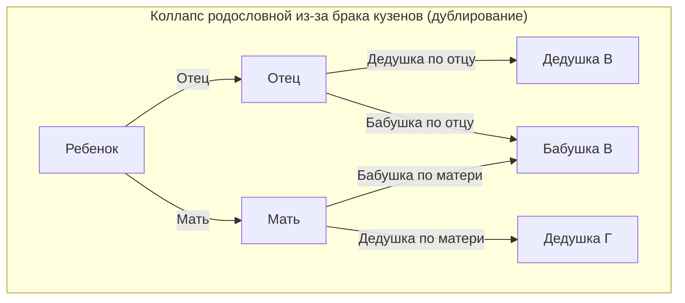
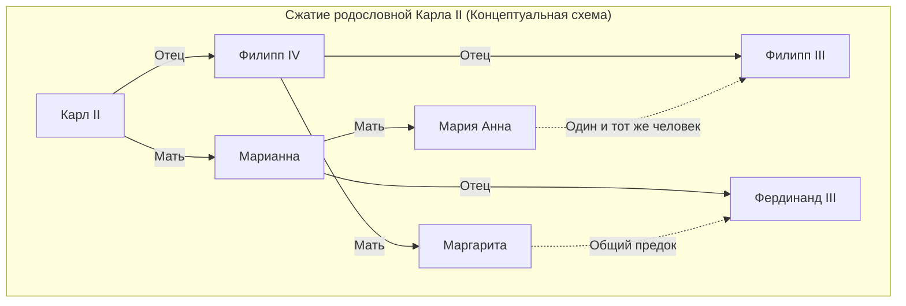

# 1. Введение: Загадка бесконечно размножающихся предков

Когда мы задумываемся о наших собственных корнях, то есть о нашем «генеалогическом древе», мы неизбежно сталкиваемся со странным математическим противоречием. Это **парадокс предков** ([Ancestor Paradox](https://kenji.blog/ru/p/pedigree-collapse/)).

Человеческую родословную в основном можно смоделировать как простое бинарное дерево. У вас есть двое родителей (отец и мать), у каждого из которых тоже есть двое родителей (бабушка и дедушка). У них, в свою очередь, также по двое родителей (прабабушка и прадедушка). То есть, если мы обозначим поколение как $g$ (где вы — нулевое поколение), то количество предков $g$ поколений назад должно составлять $2^g$ человек.

Если мы продолжим эти вычисления, то придем к очень интересному и контринтуитивному, парадоксальному результату.

- 1 поколение назад (родители): $2^1 = 2$ человека
- 2 поколения назад (бабушки и дедушки): $2^2 = 4$ человека
- 3 поколения назад (прабабушки и прадедушки): $2^3 = 8$ человек
- 10 поколений назад: $2^{10} = 1 024$ человека
- 20 поколений назад: $2^{20} = 1 048 576$ человек (около 1 миллиона)

До этого момента нет ничего особенно странного. Один миллион — большое число, но вполне реалистичное по сравнению с населением Земли. Однако давайте отмотаем время еще дальше и посмотрим на ситуацию 30 поколений назад (предполагая, что одно поколение — это около 25 лет, то есть примерно 750 лет назад, около 13 века).

$$ N(30) = 2^{30} \approx 1 073 741 824 $$

Невероятно, но количество ваших предков 30 поколений назад составляет **около 1 миллиарда 73 миллионов человек**. Однако, согласно оценкам исторической демографии, население мира в 13 веке составляло всего **около 400 миллионов человек**.

Другими словами, «расчетное количество ваших предков» значительно превышает «общее население Земли в то время».

Если мы отмотаем еще на 40 поколений назад (около 1000 лет назад), количество предков превысит **1 триллион человек** (точнее, $1 099 511 627 776$ человек), что намного превышает общую численность всех людей, когда-либо существовавших на Земле с момента зарождения человечества (которая оценивается в 100-110 миллиардов человек).

В этом и заключается суть **парадокса предков**. Почему возникает такое противоречие? Есть ли здесь математическая ошибка? Ответ кроется в концепции **коллапса родословной** (Pedigree Collapse). В этой статье мы подробно рассмотрим этот **коллапс родословной**, используя математические модели, исторические примеры и новейшие достижения популяционной генетики.

# 2. Что такое коллапс родословной (Pedigree Collapse)?

**Коллапс родословной** означает явление, когда при отслеживании генеалогического древа один и тот же человек появляется в нескольких местах дерева. Проще говоря, это результат того, что в истории бесчисленное количество раз повторялись «браки между дальними родственниками».

Если, например, двоюродные братья и сестры вступают в брак, то у их детей будет 6 прабабушек и прадедушек, а не 8, как обычно. Это происходит потому, что их родители имеют одних и тех же бабушек и дедушек. Таким образом, появление дублирующихся людей среди предков разрушает идеальное бинарное дерево, и определенные его части сливаются, образуя «ромбовидную» структуру.

Ниже на диаграмме Mermaid показано сравнение идеального бинарного дерева и **коллапса родословной** из-за брака между двоюродными братьями и сестрами.

На диаграмме справа видно, что бабушка матери по материнской линии и бабушка отца по отцовской линии — это один и тот же человек (Бабушка В). В результате, когда мы возвращаемся к поколению прабабушек и прадедушек, ветви, которых должно было быть 8 независимых, сходятся к меньшему числу людей.

Чем дальше мы уходим в историю, тем чаще люди находили супругов в пределах узких сообществ (деревни, долины, острова и т.д.) из-за ограниченных средств передвижения. Поэтому браки между дальними родственниками (например, троюродными или четвероюродными братьями и сестрами) были очень распространены, даже если сами люди об этом не подозревали. В результате возникало бесчисленное множество дублирований предков, и ветви генеалогического древа не расширялись бесконечно, а сворачивались и пересекались.

# 3. Рассмотрение с помощью математического подхода

Давайте смоделируем этот **коллапс родословной** с помощью математики. Обозначим теоретическое максимальное количество предков в поколении $g$ как $N(g) = 2^g$, а фактическое количество уникальных предков как $A(g)$. Также обозначим общую численность населения в ту эпоху как $P(g)$.

Логически, всегда выполняется следующее отношение:

$$ A(g) \le \min(2^g, P(g)) $$

Пока поколение не очень отдаленное (при малых $g$), равенство $A(g) \approx 2^g$ выполняется почти идеально. Однако, по мере того как $g$ увеличивается и $2^g$ приближается к $P(g)$, вероятность браков между родственниками возрастает, и $A(g)$ сильно отклоняется от $2^g$, асимптотически приближаясь к $P(g)$.

Если мы предположим модель панмиксии (модель случайного скрещивания, в которой все особи в популяции скрещиваются случайным образом), мы можем рассмотреть вероятность того, что двое людей случайно имеют общего предка. Давайте используем для этого известную модель Райта-Фишера.

Предположим, что численность населения в поколении $g$ постоянна и равна $N$. Вероятность того, что один человек в текущем поколении выберет конкретного человека из предыдущего поколения в качестве родителя, составляет $\frac{1}{N}$. И наоборот, вероятность не выбрать его составляет $1 - \frac{1}{N}$.

Вероятность $P_{diff}$ того, что две особи в определенном поколении имеют **разных родителей** одно поколение назад, может быть аппроксимирована следующим образом (при достаточно большом населении $N$):

$$ P_{diff} = 1 - \frac{1}{N} $$

По мере смены поколений вероятность не иметь общих предков экспоненциально уменьшается. Строго говоря, степень этого коллапса можно измерить с помощью коэффициента инбридинга (Inbreeding Coefficient) $F$. Коэффициент инбридинга $F$ представляет собой вероятность того, что пара аллелей у особи является «идентичной по происхождению» (Identical by descent), то есть происходит от общего предка.

$$ F = \sum \left( \frac{1}{2} \right)^{n+1} (1 + F_A) $$

Здесь $n$ — это количество шагов в пути между родителями через общего предка, а $F_A$ — коэффициент инбридинга самого этого общего предка. Исторический **коллапс родословной** можно рассматривать как процесс, в котором значение $F$ накапливается бесчисленное количество раз с каждым предыдущим поколением. Даже если вклад каждого отдельного $F$ чрезвычайно мал (например, брак между родственниками 10-й степени родства), огромное количество таких случаев приводит к резкому сокращению общего числа предков.

# 4. Экстремальный пример в истории: коллапс династии Габсбургов

Самым ярким историческим примером **коллапса родословной**, который происходил намеренно, является европейская королевская династия Габсбургов. По политическим и классовым причинам (чтобы «не отдать земли другим странам» и «сохранить чистоту королевской крови») они на протяжении многих поколений вступали в браки между близкими родственниками (дядя и племянница, двоюродные братья и сестры и т.д.).

Особенно известен пример последнего короля Испании из династии Габсбургов Карла II (Charles II of Spain). Если проанализировать его родословную, то у обычного человека 5 поколений назад (поколение родителей прапрадедушек и прапрабабушек) должно быть $2^5 = 32$ разных предка. Однако в случае Карла II их было **всего 10**.

Его коэффициент инбридинга $F$ достигал $0,254$, что является аномальным значением, превышающим даже коэффициент при кровосмешении между братом и сестрой или родителем и ребенком ($F = 0,25$). Из-за постоянного **коллапса родословной** его генеалогическое древо сжалось до состояния «ромбовидной сетки».

(*Примечание: фактическая родословная переплетена еще сложнее, выше представлена лишь концептуальная схема, демонстрирующая аномальное дублирование*)

Этот экстремальный **коллапс родословной** привел к серьезным генетическим заболеваниям, и в итоге испанская ветвь династии Габсбургов пресеклась на его поколении. Это исторический урок о том, насколько фатальной может быть потеря биологического разнообразия.

# 5. Генетика и «Общий предок всего человечества»

Концепция **коллапса родословной** в конечном итоге приводит к грандиозному вопросу: «Как связаны все люди?».

Согласно исследованиям в области популяционной генетики, если проследить родословную всех ныне живущих людей на Земле, то в определенный момент времени мы найдем «общего предка всех ныне живущих людей». Этот человек называется **Most Recent Common Ancestor** (Последний общий предок, MRCA).

Здесь важно понимать разницу с понятиями «Митохондриальная Ева» или «Y-хромосомный Адам». Это общие предки, прослеживаемые соответственно «только по чисто материнской линии» и «только по чисто отцовской линии», и они жили от десятков до сотен тысяч лет назад.

Однако MRCA общего генеалогического древа, который допускает любые пути независимо от отцовской или материнской линии, существовал в удивительно недавнем прошлом.

Согласно компьютерному моделированию, проведенному исследователями Массачусетского технологического института (MIT) Дугласом Роудом и его коллегами (опубликованному в журнале Nature в 2004 году), MRCA всех ныне живущих людей, как это ни удивительно, жил всего несколько тысяч лет назад (около 2000–3000 лет назад).

Еще более удивительным является наличие момента, называемого **Identical Ancestors Point** (Точка идентичных предков, IAP). Считается, что она была около 5000–7000 лет назад. В этот момент каждый человек, живший тогда, либо является «общим предком всех ныне живущих людей», либо «вообще не оставил потомков в современном мире» — **одно из двух**.

Если выразить это математически: двигаясь назад во времени $t$, пусть множество предков любого современного индивидуума $i$ будет $S_i(t)$. Пусть $H$ — множество всех людей. Время $t_{MRCA}$, когда существует MRCA, — это первый момент времени, удовлетворяющий следующему условию:

$$ \exists x, \forall i \in H : x \in S_i(t_{MRCA}) $$

С другой стороны, время $t_{IAP}$ ($t_{IAP} > t_{MRCA}$), когда существует **Точка идентичных предков**, — это момент, когда для подмножества населения $P_{survive}(t_{IAP})$ из общей популяции $P(t_{IAP})$ того времени, которое оставило потомков до наших дней, выполняется следующее условие:

$$ \forall x \in P_{survive}(t_{IAP}), \forall i \in H : x \in S_i(t_{IAP}) $$

Другими словами, любой человек, живший в Древнем Египте, Месопотамии или Древнем Китае несколько тысяч лет назад и оставивший хотя бы одного потомка в современном мире, **без исключения** является вашим предком, моим предком и предком каждого человека на Земле.

# 6. Заключение: Мы все пятидесятиюродные братья и сестры

**[Парадокс предков](https://kenji.blog/ru/p/pedigree-collapse/)** на первый взгляд кажется просто математической головоломкой или арифметическим трюком. Однако, поняв стоящий за ним механизм **коллапса родословной**, мы можем увидеть истинную картину браков и связей в истории человечества.

Мы склонны считать себя разделенными на разные расы и национальности. Из-за границ, языков и культурных различий мы верим, что являемся совершенно не связанными друг с другом «чужаками». Но если мы проследим ветви нашего генеалогического древа немного дальше, они начнут стремительно переплетаться и в конечном итоге сольются в одну гигантскую сеть.

Главный урок, который преподают нам математика и генетика, заключается в том, что в конечном счете **все человечество — это буквально одна гигантская семья (родственники)**. Некоторые антропологи предполагают, что «даже самые отдаленные друг от друга два человека на Земле приходятся друг другу максимум пятидесятиюродными братьями и сестрами (50th cousins)».

**Коллапс родословной** научно доказывает, что наши связи намного глубже и теснее, чем мы можем себе представить. В следующий раз, когда вы задумаетесь о своих корнях, попробуйте поразмышлять о невидимых связях, которые вы разделяете с людьми по всему миру через сотни и тысячи лет.
