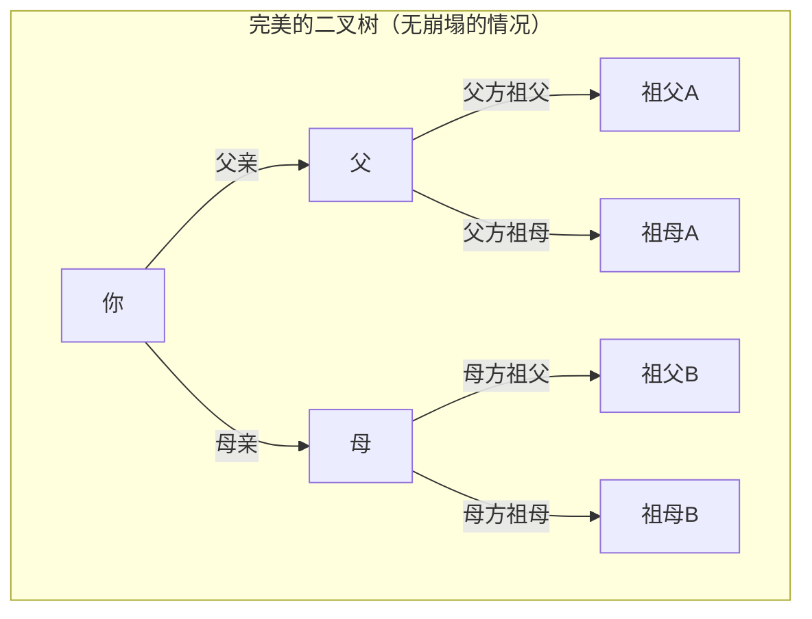
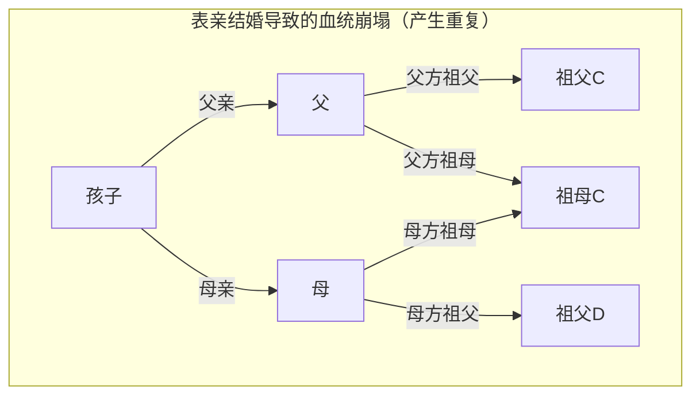
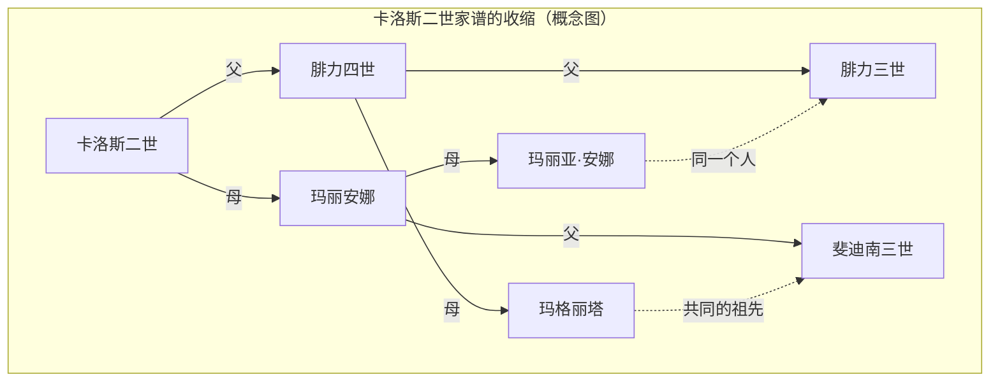

# 1. 引言：无限增殖的祖先之谜

当我们思考自己的根源，即“家谱”时，必然会面临一个奇妙的数学矛盾。那就是 **祖先悖论** （Ancestor Paradox）。

人类的系谱基本上可以建模为简单的二叉树（Binary Tree）。你有两个双亲（父亲和母亲），他们各自有两个双亲（祖父母）。此外，他们的双亲也各自有两个双亲（曾祖父母）。也就是说，假设世代为 $g$ （自己为第0代），那么 $g$ 代前的祖先数量应该是 $2^g$ 人。

计算下去，我们会得出一个非常有趣且违反直觉的不可思议的结果。

- 1代前（双亲）： $2^1 = 2$ 人
- 2代前（祖父母）： $2^2 = 4$ 人
- 3代前（曾祖父母）： $2^3 = 8$ 人
- 10代前： $2^{10} = 1,024$ 人
- 20代前： $2^{20} = 1,048,576$ 人（约100万人）

到目前为止，并没有什么特别不可思议的地方。100万人这个数字虽然很大，但从地球人口来看，是一个非常现实的数字。然而，让我们进一步追溯到30代前（假设1代约为25年，也就是距今约750年前的13世纪左右）。

$$ N(30) = 2^{30} \approx 1,073,741,824 $$

令人惊讶的是，30代前你的祖先数量计算出来 **约10亿7千万人** 。但是，根据历史人口学的推算，13世纪当时的世界人口仅有 **约4亿人** 左右。

也就是说，“计算上的你的祖先数量”大幅超过了“当时地球上的总人口”。

如果再追溯到40代前（约1000年前），祖先的数量将超过 **约1兆人** （准确地说是 $1,099,511,627,776$ 人），这甚至远远超过了自人类诞生以来在地球上存在过的所有总人口（据说约1000亿人～1100亿人）。

这就是 **祖先悖论** 的真相。为什么会产生这样的矛盾呢？是数学上破产了吗？其答案就在于 **血统崩塌** （Pedigree Collapse）这个概念。本文将结合数学模型、历史实例以及最新的群体遗传学知识，对这个 **血统崩塌** 进行深入探讨。

# 2. 什么是血统崩塌（Pedigree Collapse）？

**血统崩塌** （Pedigree Collapse）是指在追溯家谱时，同一个人出现在系谱上多个位置的现象。简单来说，就是历史上无数次重复的“远亲结婚”所造成的结果。

如果是表亲之间结婚，对他们的孩子来说，曾祖父母通常不是设定的8人，而是6人。因为父母共享相同的祖父母。像这样，由于祖先中出现了重复的人物，理想的二叉树就会崩溃，特定的位置会结合成“菱形”。

以下的 Mermaid 图比较了完美的二叉树和因表亲结婚导致的 **血统崩塌** 。

在上方右侧的图中，表示母亲的母方祖母和父亲的父方祖母是同一个人（祖母C）。因此，当追溯到曾祖父母这一代时，原本应该是独立的8个人的分支，就会收敛到更少的人数。

历史越久远，人类就越在交通工具受限的狭小社区（村庄、山谷、岛屿等）内寻找配偶。因此，即使本人完全没有意识到，第三代或第四代表亲等远亲之间的结婚也是非常普遍的。结果，祖先的重复无数次发生，家谱的分支不再是无限扩展，而是像折叠一样收敛起来。

# 3. 通过数学方法的考察

让我们用数学公式来建立这个 **血统崩塌** 的模型。假设第 $g$ 代的理论最大祖先数为 $N(g) = 2^g$ ，实际的唯一祖先数为 $A(g)$ 。另外，假设那个时代的总人口为 $P(g)$ 。

逻辑上，始终成立以下关系：

$$ A(g) \le \min(2^g, P(g)) $$

在世代较浅时（ $g$ 较小的情况）， $A(g) \approx 2^g$ 几乎完美成立。但是，随着 $g$ 的增加，当 $2^g$ 接近 $P(g)$ 时，亲戚之间结婚的概率就会提高， $A(g)$ 会大幅偏离 $2^g$ 并向 $P(g)$ 渐近。

假设随机交配模型（Panmictic model：群体内所有个体随机交配的模型），我们可以考虑某两个人偶然共享同一个祖先的概率。让我们应用著名的 Wright-Fisher 模型来思考。

假设第 $g$ 代的人口保持恒定 $N$ 。某一代的一个人选择上一代特定人物作为双亲的概率是 $\frac{1}{N}$ 。反过来说，不选择的概率就是 $1 - \frac{1}{N}$ 。

某一代中的两个个体在上一代拥有 **不同的双亲** 的概率 $P_{diff}$ ，可以近似如下（当人口 $N$ 足够大时）。

$$ P_{diff} = 1 - \frac{1}{N} $$

如果世代交替，不拥有共同祖先的概率会呈指数下降。更严格地说，可以使用近交系数（Inbreeding Coefficient） $F$ 来衡量这种崩塌的程度。近交系数 $F$ 表示某个个体拥有的一对等位基因，是源自共同祖先的“同源基因（Identical by descent）”的概率。

$$ F = \sum \left( \frac{1}{2} \right)^{n+1} (1 + F_A) $$

这里， $n$ 是通过共同祖先在双亲之间路径（Path）上的步数， $F_A$ 是该共同祖先自身的近交系数。历史上的 **血统崩塌** 可以看作是这个 $F$ 的值在追溯世代时无数次积累的过程。即使每一个对 $F$ 的贡献极小（例如10亲等以外的亲戚之间的结婚），通过其庞大数量的积累，整体的祖先数量就会被急剧压缩。

# 4. 历史上的极端例子：哈布斯堡家族的崩塌

**血统崩塌** 最显著且有意的历史例子，可以举出欧洲王室哈布斯堡家族。他们出于“不让领土被他国夺走”、“保护王室血统纯洁”等政治和阶级的原因，历经数代反复进行亲属间的婚姻（叔叔和侄女、表亲之间等）。

特别著名的例子是西班牙哈布斯堡家族的末代国王卡洛斯二世（Charles II of Spain）。分析他的家谱，如果是普通人，在5代前（高祖父母的双亲世代）应该有 $2^5 = 32$ 个不同的祖先。但是在卡洛斯二世的情况中，竟然 **只有10人** 是唯一的祖先。

他的近交系数 $F$ 达到了 $0.254$ ，这是一个甚至超过了兄妹之间或亲子之间生育孩子的系数（ $F = 0.25$ ）的异常数值。由于反复的 **血统崩塌** ，他的家谱极度收缩，变得像“菱形的网格”一样。

（※实际的家谱更为复杂地交织在一起，但上方是显示其异常重复的概念图）

这种极端的 **血统崩塌** 给他带来了严重的遗传疾病，最终导致西班牙哈布斯堡家族在他这一代绝嗣。这也是一个表明生物多样性丧失是多么致命的历史教训。

# 5. 遗传学与“全人类的共同祖先”

**血统崩塌** 这一概念最终导向了一个宏大的问题：“全人类是如何联系在一起的”。

根据群体遗传学的研究，当我们追溯现在地球上所有幸存人类的系谱时，会在某个时间点追溯到“现在活着的所有人类的共同祖先”。这被称为 **Most Recent Common Ancestor** （最近共同祖先，MRCA）。

这里需要注意的是，它与“线粒体夏娃”和“Y染色体亚当”的区别。它们分别是仅追溯“纯母系”和“纯父系”时的共同祖先，可以追溯到数万到十几万年前。

然而，不分父系、母系，允许所有路径的普通系谱上的 MRCA，存在于令人惊讶的极近的过去。

根据麻省理工学院（MIT）研究人员 Douglas Rohde 等人的计算机模拟（如2004年《自然》杂志上的论文），令人惊讶的是，据推测目前活着的所有人类的 MRCA 仅仅只能追溯到数千年前（约2000年～3000年前）。

更令人惊讶的是 **Identical Ancestors Point** （全人类共同祖先点，IAP）这个时间点的存在。这被推测为约5000年到7000年前，存在于这个时间点的人类， **要么** 是“现在活着的所有人类的共同祖先”， **要么** 是“在现代完全没有留下后代（系统绝嗣）”。

用数学公式来表达这个概念，当我们把时间 $t$ 推向过去时，现代任意个体 $i$ 的祖先集合设为 $S_i(t)$ 。如果将全人类的集合设为 $H$ ，那么存在 MRCA 的时间 $t_{MRCA}$ 是满足以下条件的第一个时间点。

$$ \exists x, \forall i \in H : x \in S_i(t_{MRCA}) $$

另一方面，存在 **Identical Ancestors Point** 的时间 $t_{IAP}$ （ $t_{IAP} > t_{MRCA}$ ），是在当时的群体集合 $P(t_{IAP})$ 中，在现代留下后代的子集 $P_{survive}(t_{IAP})$ 里，满足以下条件的时间点。

$$ \forall x \in P_{survive}(t_{IAP}), \forall i \in H : x \in S_i(t_{IAP}) $$

也就是说，生活在数千年前的古埃及、美索不达米亚或古代中国，并且在现代哪怕留下了一个后代的人， **无一例外** 都是你的祖先，也是我的祖先，是地球上所有人类的祖先。

# 6. 结论：我们都是第五十代表亲

**祖先悖论** 乍看之下就像是一个单纯的数学谜题或计算把戏。但是，通过理解其背后的 **血统崩塌** 机制，我们就能看到人类历史上婚姻与交融的真实样貌。

我们往往认为自己是分离的不同人种或民族。由于国界、语言、文化的差异，我们坚信彼此是完全没有关系的“他者”。然而，只要稍微追溯一下家谱的分支，那些分支就会迅速交织，最终整合为一个巨大的网络。

数学和遗传学教给我们的最大教训，极端地说，就是 **所有人类字面上都是一个巨大的家族（亲戚）** 这个事实。在人类学家中，也有人推测“即使是地球上相隔再远的两个人，充其量也不过是第五十代表亲（50th cousins）左右的关系”。

**血统崩塌** 在科学上证明了，我们彼此的联系比我们想象的更深、更密切。下次当你思考自己的根源时，不妨去想象一下跨越数百年、数千年的时间，与世界上所有人共享的那条看不见的纽带。
