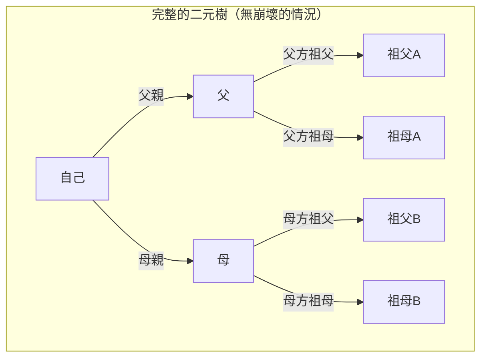
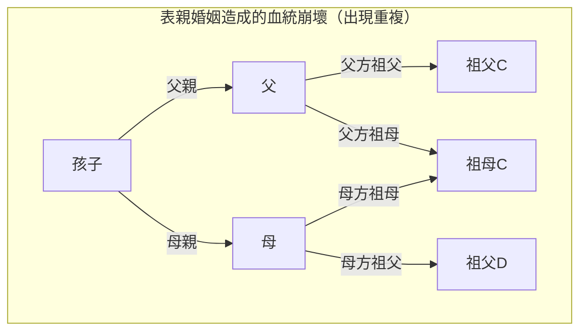
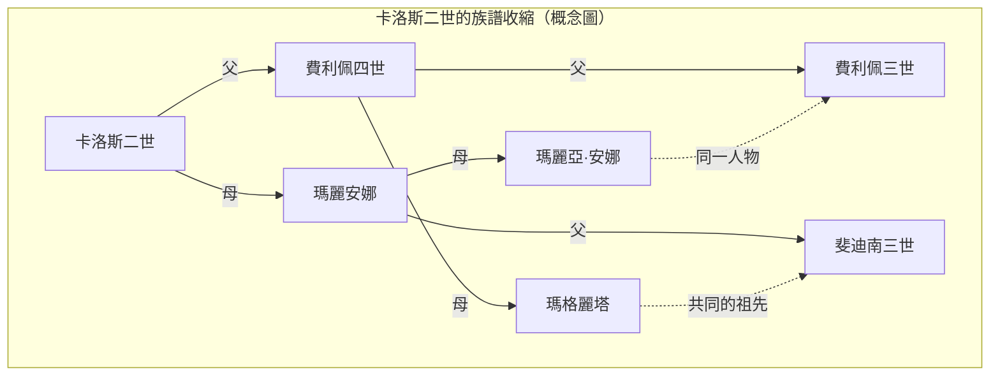

# 1. 前言：無限繁殖的祖先之謎

當我們思考自己的根源，也就是「族譜」時，必然會面臨一個奇妙的數學矛盾。這就是 **祖先悖論** （Ancestor Paradox）。

人類的系譜基本上可以建模為單純的二元樹（Binary Tree）。您有 2 位雙親（父親與母親），他們各自又有 2 位雙親（祖父母）。更進一步，他們的雙親也各自有 2 位雙親（曾祖父母）。也就是說，如果將世代設為 $g$ （自己是第 0 代），那麼 $g$ 代之前的祖先數量應該是 $2^g$ 人。

將這個公式計算下去，會得出一個非常有趣且違反直覺、難以理解的結果。

- 1 代之前（雙親）： $2^1 = 2$ 人
- 2 代之前（祖父母）： $2^2 = 4$ 人
- 3 代之前（曾祖父母）： $2^3 = 8$ 人
- 10 代之前： $2^{10} = 1,024$ 人
- 20 代之前： $2^{20} = 1,048,576$ 人（約 100 萬人）

到這裡為止，並沒有什麼特別奇怪的地方。100 萬人雖然是個龐大的數字，但從地球人口來看，仍是相當符合現實的數字。不過，讓我們進一步回溯到 30 代之前（假設 1 代約 25 年，也就是距離現在約 750 年前的 13 世紀左右）來看看。

$$ N(30) = 2^{30} \approx 1,073,741,824 $$

令人驚訝的是，計算結果顯示，您在 30 代之前的祖先數量竟高達 **約 10 億 7 千萬人** 。然而，根據歷史人口學的推估，13 世紀當時的世界人口其實只有 **約 4 億人** 左右。

也就是說，「計算上您的祖先數量」會大幅超過「當時地球上的總人口」。

若再回溯至 40 代之前（約 1000 年前），祖先的數量甚至會超過 **約 1 兆人** （準確來說是 $1,099,511,627,776$ 人），這不僅遠遠超過人類誕生以來曾在地球上存在過的總人口（據說約為 1000 億至 1100 億人）。

這就是 **祖先悖論** 的真面目。為什麼會產生這樣的矛盾呢？是數學上出現了破綻嗎？答案就在於 **血統崩壞** （Pedigree Collapse）這個概念中。本文將針對 **血統崩壞** ，結合數學模型、歷史實例以及最新的族群遺傳學見解，進行深入的探討。

# 2. 什麼是血統崩壞（Pedigree Collapse）？

**血統崩壞** 是指在回溯族譜時，同一個人在族譜上的多個位置重複出現的現象。簡單來說，就是歷史上無數次重複發生「遠親之間的婚姻」所造成的結果。

如果表兄妹（或堂兄妹）結婚，那麼對他們的孩子來說，曾祖父母通常就不會是標準的 8 人，而是 6 人。因為雙親共享了相同的祖父母。像這樣，當祖先中出現重複的人物時，理想的二元樹就會崩壞，在特定位置結合成「菱形」。

以下的 Mermaid 圖比較了完整的二元樹，以及因表親婚姻而造成的 **血統崩壞** 。

在上述右側的圖中，顯示了母親的母方祖母與父親的父方祖母是同一人（祖母C）。因此，當回溯到曾祖父母世代時，原本應該是獨立的 8 個人分支，就會收斂成較少的人數。

歷史越是往前回溯，人類就越是在交通工具受限的狹小社群（如村莊、山谷、島嶼等）內尋找配偶。因此，即使當事人完全沒有意識到，與第三代或第四代堂表親等遠房親戚結婚的情況也非常普遍。其結果就是，祖先中出現了無數次的重複，族譜的分支不再是無限擴展，而是像摺疊般不斷收斂。

# 3. 透過數學方法的探討

讓我們嘗試將這種 **血統崩壞** 以數學公式建立模型。假設在世代 $g$ 時，理論上的最大祖先數量為 $N(g) = 2^g$ ，而實際獨立的祖先數量為 $A(g)$ 。同時，假設該時代的總人口為 $P(g)$ 。

在邏輯上，下列關係始終成立：

$$ A(g) \le \min(2^g, P(g)) $$

在世代尚淺時（當 $g$ 較小）， $A(g) \approx 2^g$ 幾乎可以完美成立。但是，隨著 $g$ 變大，當 $2^g$ 逐漸接近 $P(g)$ 時，親戚間結婚的機率就會升高，此時 $A(g)$ 將大幅偏離 $2^g$ ，並向 $P(g)$ 漸近。

如果假設在隨機交配模型（Panmictic model：群體內所有個體隨機交配的模型）下，我們可以探討某兩個人碰巧共享相同祖先的機率。讓我們應用著名的 Wright-Fisher 模型來思考看看。

假設世代 $g$ 的人口固定為 $N$ 。某個世代的其中一人，將前一個世代特定人物選為雙親的機率為 $\frac{1}{N}$ 。反過來說，不選的機率就是 $1 - \frac{1}{N}$ 。

在某個世代中的 2 個個體，在上一代擁有 **不同雙親** 的機率 $P_{diff}$ ，可以近似如下（當人口 $N$ 足夠大時）：

$$ P_{diff} = 1 - \frac{1}{N} $$

隨著世代的累積，不具有共同祖先的機率會呈指數函數下降。更嚴格來說，可以使用近交係數（Inbreeding Coefficient） $F$ 來衡量這種崩壞的程度。近交係數 $F$ 代表某個體所擁有的一對等位基因，是源自共同祖先的「同源基因（Identical by descent）」之機率。

$$ F = \sum \left( \frac{1}{2} \right)^{n+1} (1 + F_A) $$

在這裡， $n$ 是透過共同祖先連接雙親之路徑（Path）中的步數，而 $F_A$ 則是該共同祖先本身的近交係數。歷史上的 **血統崩壞** 可以被視為這個 $F$ 值隨著世代回溯而不斷累積的過程。即使每一項對 $F$ 的貢獻極為微小（例如相隔 10 等親的親戚之間結婚等），藉由這龐大數量的累積，整體祖先的數量就會被劇烈壓縮。

# 4. 歷史上的極端例子：哈布斯堡家族的崩壞

歷史上 **血統崩壞** 最為顯著且刻意為之的例子，當屬歐洲的王室哈布斯堡家族。為了「不讓他國奪走領土」以及「維持王室血統的純潔」，出於這些政治與階級上的理由，他們世世代代反覆進行近親通婚（如叔姪、表親之間等）。

其中特別有名的，是西班牙哈布斯堡家族最後一任國王卡洛斯二世（Charles II of Spain）的例子。分析他的族譜會發現，如果是普通人，在 5 代之前（高祖父母的雙親世代）應該會有 $2^5 = 32$ 位不同的祖先。然而在卡洛斯二世的情況中，竟然 **僅有 10 位** 獨立的祖先。

他的近交係數 $F$ 高達 $0.254$ ，這個異常的數值甚至超過了兄妹或親代與子代之間生育後代的係數（ $F = 0.25$ ）。由於一再發生的 **血統崩壞** ，導致他的族譜變成了極度收縮、宛如「菱形網格」般的狀態。

（※實際的族譜交錯更加複雜，但上述是顯示其異常重複現象的概念圖）

這種極端的 **血統崩壞** 為他帶來了嚴重的遺傳疾病，最終導致西班牙哈布斯堡家族在他這一代絕嗣。這也是一個歷史教訓，顯示了生物多樣性的喪失有多麼致命。

# 5. 遺傳學與「全人類的共同祖先」

**血統崩壞** 這個概念，最終會通向一個宏大的問題：「全人類是如何連結在一起的？」。

根據族群遺傳學的研究顯示，若回溯現今存在於地球上所有人類的族譜，會在某個時間點追溯到「現存全人類的共同祖先」。這被稱為 **Most Recent Common Ancestor** （最近共同祖先，MRCA）。

在這裡必須注意的是，這與「粒線體夏娃」或「Y染色體亞當」的差別。後兩者分別是只追蹤「純粹母系」或「純粹父系」時的共同祖先，其時間可回溯至數萬到十幾萬年前。

然而，不限於父系或母系、允許任何路徑的一般族譜上的 MRCA，卻存在於令人驚訝的近代過去。

根據麻省理工學院（MIT）研究員 Douglas Rohde 等人的電腦模擬（如 2004 年發表於《Nature》雜誌的論文），令人吃驚的是，現存所有人類的 MRCA 據推估只在短短幾千年前（約 2000 年至 3000 年前）。

更令人驚訝的是，存在著一個被稱為 **Identical Ancestors Point** （全人類共同祖先點，IAP）的時間點。這被推估在約 5000 年到 7000 年前，而在這個時間點存活的人類， **非此即彼** 地，要麼是現存所有人類的「共同祖先」，要麼就是「完全沒有留下後代至現代（絕嗣）」。

若用數學公式來表達，當我們將時間 $t$ 往過去推移時，假設現代任意個體 $i$ 的祖先集合為 $S_i(t)$ 。若將全人類的集合設為 $H$ ，那麼 MRCA 存在的時刻 $t_{MRCA}$ ，就是滿足以下條件的最初時間點：

$$ \exists x, \forall i \in H : x \in S_i(t_{MRCA}) $$

另一方面， **Identical Ancestors Point** 存在的時刻 $t_{IAP}$ （ $t_{IAP} > t_{MRCA}$ ），則是在當時人口集合 $P(t_{IAP})$ 中，有在現代留下後代的部分集合 $P_{survive}(t_{IAP})$ 內，滿足以下條件的時間點：

$$ \forall x \in P_{survive}(t_{IAP}), \forall i \in H : x \in S_i(t_{IAP}) $$

也就是說，數千年前生活在古埃及、美索不達米亞或古代中國，且在現代只要還留有一名後代的人，都 **毫無例外** 地是您的祖先，也是我的祖先，更是地球上所有人類的祖先。

# 6. 結論：我們全都是第 50 代堂表親

**祖先悖論** 乍看之下就像是單純的數學謎題或計算上的把戲。但是，只要理解其背後的 **血統崩壞** 機制，我們就能看見人類歷史中婚姻與交流的真實樣貌。

我們往往會認為自己是被分割開來的不同人種或民族。因為國境、語言、文化的差異，而深信彼此是毫無關係的「他者」。但是，只要稍微回溯族譜的分支，這些分支就會迅速交錯，並在最終整合成一個巨大的網狀結構。

數學與遺傳學所告訴我們的最大教訓，極端一點來說，就是 **所有人類就字面意義而言，都是一個龐大且完整的家族（親戚）** 這個事實。在人類學家之中，也有人推測「無論地球上相隔多遠的 2 個人，充其量也不過是第 50 代堂表親（50th cousins）左右的關係而已」。

**血統崩壞** 透過科學證明了我們彼此之間的連結，比我們想像中還要更加深厚且密切。下次當您思考自己的根源時，不妨試著跨越數百年、數千年的時光，遙想這份與世界上所有人共享著的無形羈絆吧。
