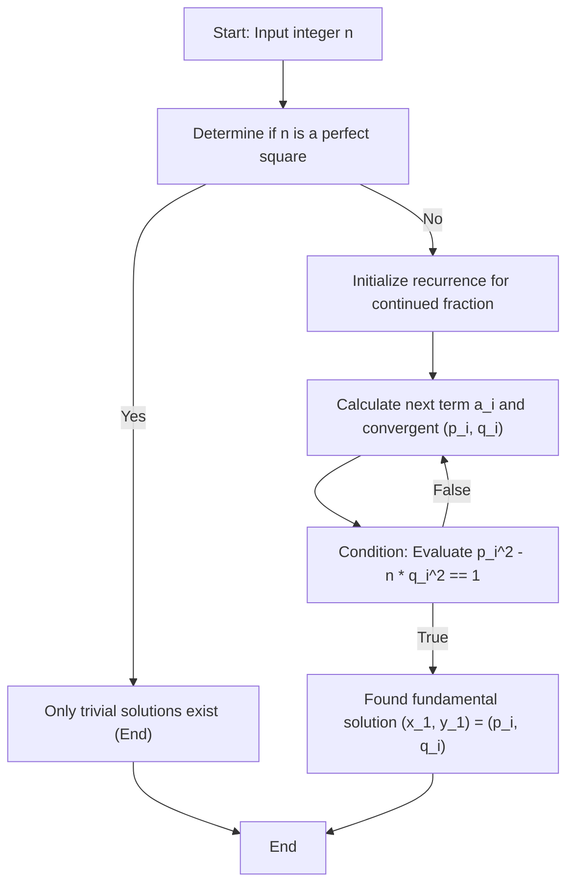

# Introduction

In the field of number theory, **Pell's equation** is known as one of the most beautiful Diophantine equations with a deep theoretical background. In this article, we will provide a very detailed explanation starting from the basic definition and properties of this equation, to an elegant and efficient solution using continued fractions, and the mechanism for generating its infinitely many solutions. For everyone who loves mathematics, we have covered everything from the derivation of formulas to the visualization of algorithms and implementation using a programming language.

## 1. What is [Pell's Equation](https://kenji.blog/en/p/pell-equation/)?

Pell's equation refers to a quadratic Diophantine equation in two variables having the following form:

$$ x^2 - ny^2 = 1 $$

Here, $n$ is a positive integer that is not a square number (square-free or at least not a perfect square). Our goal is to find pairs of unknown integers $x$ and $y$ that satisfy this equation. Suppose for a moment that $n$ is a perfect square, that is, $n = k^2$ (where $k$ is an integer). Then the equation can be transformed as follows:

$$ x^2 - k^2y^2 = 1 $$
$$ (x - ky)(x + ky) = 1 $$

Since $x$, $y$, and $k$ are all integers, $(x - ky)$ and $(x + ky)$ must also be integers. The only combinations of integers whose product is 1 are $(1, 1)$ or $(-1, -1)$. Solving this yields $y = 0$, meaning the only solutions are the very simple ones: $(x, y) = (\pm 1, 0)$. Therefore, in Pell's equation, the condition that $n$ is not a perfect square is an essential premise for finding meaningful solutions.

## 2. Historical Background: Pell, [Fermat](https://kenji.blog/en/p/fermat/), and Ancient Indian Mathematicians

Although this equation bears the name "Pell," exploring the historical facts reveals a somewhat strange background. Actually, the first person in modern Europe to study a general solution for this equation and strongly assert that a solution always exists was the great French mathematician **[Pierre de Fermat](https://kenji.blog/en/p/fermat/)**.

Later, **[Leonhard Euler](https://kenji.blog/en/p/euler/)** mistakenly linked the name of the English mathematician **John Pell** to this equation, and it has been widely known as "Pell's equation" ever since. Pell himself did not play a central role in the method of solving this equation.

Going further back in time, Indian mathematicians **Brahmagupta** and **Bhāskara II** computed solutions to equations of this type using a sophisticated algorithm called the Chakravala method, hundreds of years before [Fermat](https://kenji.blog/en/p/fermat/). The history of exploration by mathematicians from ancient times through the Middle Ages to the modern era is inscribed in this equation.

## 3. The Difference Between Trivial and Non-trivial Solutions

For Pell's equation $x^2 - ny^2 = 1$, regardless of the value of $n$, there is always the solution $(x, y) = (\pm 1, 0)$. Substituting these into the equation gives $1^2 - n \cdot 0^2 = 1$, which obviously holds true. This is called a **trivial solution**.

However, what mathematicians are truly interested in is a **non-trivial solution** where $y \neq 0$. Amazingly, if $n$ is a positive integer that is not a perfect square, it has been mathematically proven that Pell's equation has **infinitely many non-trivial solutions**. Moreover, among these infinite solutions, the smallest solution where both $x$ and $y$ are positive integers is called the **fundamental solution**, and once this is found, all other solutions can be easily generated through algebraic operations.

## 4. The Deep Connection Between Continued Fractions and [Pell's Equation](https://kenji.blog/en/p/pell-equation/)

The most powerful and standard tool for efficiently finding the fundamental solution is the **continued fraction**. Since the irrational number $\sqrt{n}$ cannot be represented by a finite fraction, it can be beautifully expressed as an infinitely continuing periodic regular continued fraction.

$$ \sqrt{n} = [a_0; \overline{a_1, a_2, \dots, a_k, 2a_0}] $$

Here, $a_0$ is the integer part of $\sqrt{n}$ (i.e., $\lfloor \sqrt{n} \rfloor$), and the part under the overline represents the periodic portion of the continued fraction. Let the length of this period be $m$.

The rational number $\frac{p_i}{q_i}$ obtained by truncating the continued fraction at a certain term is called a **convergent**. Convergents provide the best rational approximations for the irrational number $\sqrt{n}$. Astonishingly, the fundamental solution $(x_1, y_1)$ of Pell's equation is directly obtained from the numerator $p$ and denominator $q$ of a specific convergent in the continued fraction expansion of $\sqrt{n}$. Specifically, it is determined by the length of the period $m$ as follows:

- If the period $m$ is even: The fundamental solution is $(p_{m-1}, q_{m-1})$.
- If the period $m$ is odd: The fundamental solution is $(p_{2m-1}, q_{2m-1})$.

## 5. Finding the Fundamental Solution: A Thorough Explanation of the Algorithm

The convergents $\frac{p_i}{q_i}$ can be computed very rapidly on a computer using the following recurrence relations.

$$ p_i = a_i p_{i-1} + p_{i-2} $$
$$ q_i = a_i q_{i-1} + q_{i-2} $$

The initial conditions are set as follows to allow the algorithm to start smoothly:
- $p_{-1} = 1, \quad p_{-2} = 0$
- $q_{-1} = 0, \quad q_{-2} = 1$

Each term $a_i$ of the continued fraction can also be found sequentially using only integer arithmetic operations. This enables accurate integer calculations that completely eliminate floating-point arithmetic errors.

To visualize the series of processes in searching for a solution, we have prepared the following state transition diagram.



## 6. Specific Example: Continued Fraction Expansion and Fundamental Solution for n = 7

Rather than just abstract theory, let's trace the calculations for the specific case of $n = 7$. Pell's equation becomes $x^2 - 7y^2 = 1$.

First, the integer part of $\sqrt{7}$ is $a_0 = 2$. By repeating the operation of taking the reciprocal of the remaining decimal part and extracting the integer part, the continued fraction expansion of $\sqrt{7}$ is found as follows:

$$ \sqrt{7} = [2; \overline{1, 1, 1, 4}] $$

The period is $m = 4$, which is even. Therefore, the fundamental solution should be obtained from the convergent $\frac{p_3}{q_3}$. Let's calculate the convergents in order using the recurrence relations.

- $i=0$: When $a_0=2$, $\frac{p_0}{q_0} = \frac{2}{1}$
- $i=1$: When $a_1=1$, $p_1 = 1 \times 2 + 1 = 3$, $q_1 = 1 \times 1 + 0 = 1$. Thus, $\frac{p_1}{q_1} = \frac{3}{1}$
- $i=2$: When $a_2=1$, $p_2 = 1 \times 3 + 2 = 5$, $q_2 = 1 \times 1 + 1 = 2$. Thus, $\frac{p_2}{q_2} = \frac{5}{2}$
- $i=3$: When $a_3=1$, $p_3 = 1 \times 5 + 3 = 8$, $q_3 = 1 \times 2 + 1 = 3$. Thus, $\frac{p_3}{q_3} = \frac{8}{3}$

Let's check by substituting the obtained $(p_3, q_3) = (8, 3)$ into the equation.
$8^2 - 7 \times 3^2 = 64 - 7 \times 9 = 64 - 63 = 1$.
It perfectly satisfies the condition, so this becomes the fundamental solution $(x_1, y_1) = (8, 3)$ for $n = 7$.

## 7. Generating Infinite Solutions: An Approach Using Matrices and Recurrences

Once even a single fundamental solution $(x_1, y_1)$ is found, all other positive integer solutions $(x_k, y_k)$ can be generated infinitely from the following algebraic relation.

$$ x_k + y_k \sqrt{n} = (x_1 + y_1 \sqrt{n})^k \quad \text{for} \quad k = 1, 2, 3, \dots $$

By expanding this expression and comparing the rational part and the irrational part (the coefficient of $\sqrt{n}$), we obtain a recurrence relation to calculate the next solution $(x_{k+1}, y_{k+1})$ from the previous solution $(x_k, y_k)$. Expressing this in matrix format results in a very neat form.

$$
\begin{pmatrix} x_{k+1} \\ y_{k+1} \end{pmatrix} = \begin{pmatrix} x_1 & n y_1 \\ y_1 & x_1 \end{pmatrix} \begin{pmatrix} x_k \\ y_k \end{pmatrix}
$$

Any $k$-th solution can also be directly calculated using matrix exponentiation as follows:

$$
\begin{pmatrix} x_k \\ y_k \end{pmatrix} = \begin{pmatrix} x_1 & n y_1 \\ y_1 & x_1 \end{pmatrix}^{k-1} \begin{pmatrix} x_1 \\ y_1 \end{pmatrix}
$$

This property strongly suggests that the solutions to Pell's equation are not merely sequences of numbers but possess an algebraic structure (a group structure).

## 8. Brahmagupta's Identity and the Chakravala Method

In ancient Indian mathematics, a central role in solving Pell's equation was played by **Brahmagupta's identity**. This identity takes the following form:

$$ (x_1^2 - ny_1^2)(x_2^2 - ny_2^2) = (x_1 x_2 + n y_1 y_2)^2 - n(x_1 y_2 + x_2 y_1)^2 $$

The brilliant aspect of this identity is that by combining a solution $(x_1, y_1)$ for $x^2 - ny^2 = k_1$ and a solution $(x_2, y_2)$ for $x^2 - ny^2 = k_2$, one can directly synthesize a new solution $(X, Y)$ such that $X^2 - nY^2 = k_1 k_2$.

Indian mathematicians masterfully used this powerful identity to piece together solutions with small errors one after another, ultimately developing the **Chakravala method** to arrive at a solution with an error of $1$, that is, a solution to Pell's equation. This is a monumental achievement in human mathematical history, possessing efficiency equal to or greater than the continued fraction expansion.

## 9. Python Implementation Example and Explanation

Now that we fully understand the theoretical background, let's actually write a program. The following Python script executes the recurrence for the continued fraction for a given $n$ and searches for the fundamental solution of Pell's equation. Because it processes entirely with integer arithmetic without using floating-point numbers, there is no concern for loss of significance.

```python
import math

def is_square(n):
    """
    A function to quickly determine if a given number n is a perfect square.
    """
    s = math.isqrt(n)
    return s * s == n

def solve_pell(n):
    """
    Calculates the fundamental solution of Pell's equation x^2 - n * y^2 = 1 using the continued fraction method.
    Returns: A tuple of the fundamental solution (x, y). Returns None for perfect squares.
    """
    if is_square(n):
        return None  # Has no non-trivial solutions for perfect squares

    # Initialization for continued fraction calculations
    m = 0
    d = 1
    a0 = math.isqrt(n)
    a = a0
    
    # Initial setup for convergents (p_{-1}=1, p_{-2}=0, q_{-1}=0, q_{-2}=1)
    num1, num2 = 1, 0  # p_{i-1}, p_{i-2}
    den1, den2 = 0, 1  # q_{i-1}, q_{i-2}
    
    # First convergent (p_0, q_0)
    num = a0
    den = 1
    
    # Loop until the condition x^2 - n*y^2 == 1 is satisfied
    while num * num - n * den * den != 1:
        # Calculate the next term a_i of the continued fraction
        m = d * a - m
        d = (n - m * m) // d
        a = (a0 + m) // d
        
        # Update convergents p_i, q_i
        num2 = num1
        num1 = num
        den2 = den1
        den1 = den
        
        num = a * num1 + num2
        den = a * den1 + den2

    return num, den

# Usage example: When n = 7
n = 7
solution = solve_pell(n)
if solution:
    x, y = solution
    print(f"Fundamental solution for n={n}: x={x}, y={y}")
    print(f"Verification: {x}^2 - {n}*{y}^2 = {x**2 - n * y**2}")
```

When this code is run, the fundamental solution $(x, y) = (8, 3)$ is output instantly, exactly as we calculated by hand earlier. If you try a larger value for $n$, such as $61$, you can verify that the solution becomes enormous numbers ($x = 1766319049, y = 226153980$), allowing you to truly feel the profound depth of Pell's equation.

## 10. Bridge to Algebraic Number Theory: Relationship with Dirichlet's Unit Theorem

Pell's equation is not merely an integer puzzle. In modern mathematics, it is positioned as a vital gateway to the theory of **real quadratic fields** $\mathbb{Q}(\sqrt{n})$.

The solutions to Pell's equation correspond closely to the **units** (elements whose inverses are also algebraic integers) in the algebraic integer ring of a real quadratic field. The fundamental solution corresponds to the **fundamental unit** that generates this unit group, and the fact that infinitely many solutions exist for Pell's equation can be viewed as a special case of a more advanced theorem, **Dirichlet's unit theorem**. Understanding the properties of the fundamental unit is extremely crucial for deeply researching formulas for the class number of quadratic fields and the structure of ideal classes.

## 11. Conclusion

In this article, we explored in detail one of the most fascinating Diophantine equations, **Pell's equation**, from its foundations to its applications. We explained the surprising fact that there are always infinite non-trivial solutions for any non-square $n$, an efficient algorithm for searching for solutions using continued fraction expansions, and the dynamism of synthesizing new solutions one after another from the generated fundamental solution using matrices.

The fact that classical problems considered by [Fermat](https://kenji.blog/en/p/fermat/) and Brahmagupta hundreds of years ago can be beautifully implemented as modern computer algorithms, and further connect to advanced algebraic number theory, evokes a deep and timeless mathematical romance. We hope you will take this opportunity to use the Python code to explore the world of Pell's equation for various values of $n$ and touch upon the profound properties of numbers.
