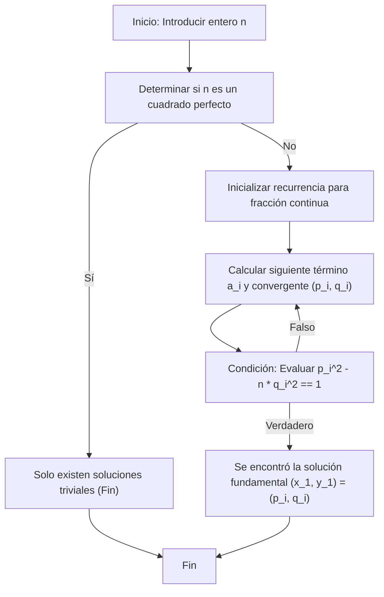

# Introducción

En el campo de la teoría de números, la **ecuación de Pell** (Pell's equation) es conocida como una de las ecuaciones diofánticas más hermosas y con un profundo trasfondo teórico. En este artículo, proporcionaremos una explicación muy detallada comenzando desde la definición básica y las propiedades de esta ecuación, hasta un método de solución elegante y eficiente utilizando fracciones continuas (Continued fractions), y el mecanismo para generar sus infinitas soluciones. Para todos los que aman las matemáticas, hemos cubierto desde la derivación de fórmulas hasta la visualización de algoritmos y la implementación utilizando un lenguaje de programación.

## 1. ¿Qué es la ecuación de Pell?

La ecuación de Pell se refiere a una ecuación diofántica cuadrática en dos variables que tiene la siguiente forma:

$$ x^2 - ny^2 = 1 $$

Aquí, $n$ es un número entero positivo que no es un número cuadrado (libre de cuadrados o al menos no un cuadrado perfecto). Nuestro objetivo es encontrar pares de enteros desconocidos $x$ e $y$ que satisfagan esta ecuación. Supongamos por un momento que $n$ es un cuadrado perfecto, es decir, $n = k^2$ (donde $k$ es un entero). Entonces la ecuación se puede transformar de la siguiente manera:

$$ x^2 - k^2y^2 = 1 $$
$$ (x - ky)(x + ky) = 1 $$

Dado que $x$, $y$ y $k$ son todos enteros, $(x - ky)$ y $(x + ky)$ también deben ser enteros. Las únicas combinaciones de enteros cuyo producto es 1 son $(1, 1)$ o $(-1, -1)$. Resolver esto da como resultado $y = 0$, lo que significa que las únicas soluciones son las muy simples: $(x, y) = (\pm 1, 0)$. Por lo tanto, en la ecuación de Pell, la condición de que $n$ no sea un cuadrado perfecto es una premisa esencial para encontrar soluciones significativas.

## 2. Antecedentes Históricos: Pell, [Fermat](https://kenji.blog/es/p/fermat/) y los Matemáticos Indios Antiguos

Aunque esta ecuación lleva el nombre de "Pell", explorar los hechos históricos revela un trasfondo un tanto extraño. De hecho, la primera persona en la Europa moderna que estudió una solución general para esta ecuación y afirmó firmemente que siempre existe una solución fue el gran matemático francés **[Pierre de Fermat](https://kenji.blog/es/p/fermat/)**.

Más tarde, **[Leonhard Euler](https://kenji.blog/es/p/euler/)** vinculó por error el nombre del matemático inglés **John Pell** a esta ecuación, y desde entonces ha sido ampliamente conocida como la "ecuación de Pell". El propio Pell no desempeñó un papel central en el método de resolución de esta ecuación.

Yendo más atrás en el tiempo, los matemáticos indios **Brahmagupta** y **Bhāskara II** calcularon soluciones a ecuaciones de este tipo utilizando un algoritmo sofisticado llamado el método Chakravala, cientos de años antes que [Fermat](https://kenji.blog/es/p/fermat/). La historia de la exploración por matemáticos desde la antigüedad a través de la Edad Media hasta la era moderna está inscrita en esta ecuación.

## 3. La Diferencia Entre Soluciones Triviales y No Triviales

Para la ecuación de Pell $x^2 - ny^2 = 1$, independientemente del valor de $n$, siempre existe la solución $(x, y) = (\pm 1, 0)$. Sustituir estas en la ecuación da $1^2 - n \cdot 0^2 = 1$, lo que obviamente es cierto. Esto se llama una **solución trivial** (trivial solution).

Sin embargo, lo que realmente interesa a los matemáticos es una **solución no trivial** (non-trivial solution) donde $y \neq 0$. Sorprendentemente, si $n$ es un número entero positivo que no es un cuadrado perfecto, se ha demostrado matemáticamente que la ecuación de Pell tiene **infinitas soluciones no triviales**. Además, entre estas soluciones infinitas, la solución más pequeña donde tanto $x$ como $y$ son enteros positivos se llama la **solución fundamental** (fundamental solution), y una vez que se encuentra, todas las demás soluciones pueden generarse fácilmente mediante operaciones algebraicas.

## 4. La Profunda Conexión Entre Fracciones Continuas y la [Ecuación de Pell](https://kenji.blog/es/p/pell-equation/)

La herramienta más poderosa y estándar para encontrar de manera eficiente la solución fundamental es la **fracción continua** (Continued fraction). Dado que el número irracional $\sqrt{n}$ no puede representarse mediante una fracción finita, puede expresarse maravillosamente como una fracción continua regular periódica que continúa infinitamente.

$$ \sqrt{n} = [a_0; \overline{a_1, a_2, \dots, a_k, 2a_0}] $$

Aquí, $a_0$ es la parte entera de $\sqrt{n}$ (es decir, $\lfloor \sqrt{n} \rfloor$), y la parte bajo la línea superior representa la porción periódica de la fracción continua. Sea $m$ la longitud de este período.

El número racional $\frac{p_i}{q_i}$ obtenido al truncar la fracción continua en un cierto término se llama **convergente** (convergent). Los convergentes proporcionan las mejores aproximaciones racionales para el número irracional $\sqrt{n}$. Sorprendentemente, la solución fundamental $(x_1, y_1)$ de la ecuación de Pell se obtiene directamente del numerador $p$ y el denominador $q$ de un convergente específico en la expansión en fracción continua de $\sqrt{n}$. Específicamente, se determina por la longitud del período $m$ de la siguiente manera:

- Si el período $m$ es par: La solución fundamental es $(p_{m-1}, q_{m-1})$.
- Si el período $m$ es impar: La solución fundamental es $(p_{2m-1}, q_{2m-1})$.

## 5. Encontrar la Solución Fundamental: Una Explicación Exhaustiva del Algoritmo

Los convergentes $\frac{p_i}{q_i}$ se pueden calcular muy rápidamente en una computadora utilizando las siguientes relaciones de recurrencia.

$$ p_i = a_i p_{i-1} + p_{i-2} $$
$$ q_i = a_i q_{i-1} + q_{i-2} $$

Las condiciones iniciales se establecen de la siguiente manera para permitir que el algoritmo comience sin problemas:
- $p_{-1} = 1, \quad p_{-2} = 0$
- $q_{-1} = 0, \quad q_{-2} = 1$

Cada término $a_i$ de la fracción continua también se puede encontrar secuencialmente utilizando solo operaciones aritméticas enteras. Esto permite cálculos enteros precisos que eliminan por completo los errores aritméticos de coma flotante.

Para visualizar la serie de procesos en la búsqueda de una solución, hemos preparado el siguiente diagrama de transición de estados.



## 6. Ejemplo Específico: Expansión en Fracción Continua y Solución Fundamental para n = 7

En lugar de ser solo teoría abstracta, sigamos los cálculos para el caso específico de $n = 7$. La ecuación de Pell se convierte en $x^2 - 7y^2 = 1$.

Primero, la parte entera de $\sqrt{7}$ es $a_0 = 2$. Repitiendo la operación de tomar el recíproco de la parte decimal restante y extraer la parte entera, la expansión en fracción continua de $\sqrt{7}$ se encuentra de la siguiente manera:

$$ \sqrt{7} = [2; \overline{1, 1, 1, 4}] $$

El período es $m = 4$, que es par. Por lo tanto, la solución fundamental debe obtenerse a partir del convergente $\frac{p_3}{q_3}$. Calculemos los convergentes en orden utilizando las relaciones de recurrencia.

- $i=0$: Cuando $a_0=2$, $\frac{p_0}{q_0} = \frac{2}{1}$
- $i=1$: Cuando $a_1=1$, $p_1 = 1 \times 2 + 1 = 3$, $q_1 = 1 \times 1 + 0 = 1$. Por lo tanto, $\frac{p_1}{q_1} = \frac{3}{1}$
- $i=2$: Cuando $a_2=1$, $p_2 = 1 \times 3 + 2 = 5$, $q_2 = 1 \times 1 + 1 = 2$. Por lo tanto, $\frac{p_2}{q_2} = \frac{5}{2}$
- $i=3$: Cuando $a_3=1$, $p_3 = 1 \times 5 + 3 = 8$, $q_3 = 1 \times 2 + 1 = 3$. Por lo tanto, $\frac{p_3}{q_3} = \frac{8}{3}$

Comprobemos sustituyendo el $(p_3, q_3) = (8, 3)$ obtenido en la ecuación.
$8^2 - 7 \times 3^2 = 64 - 7 \times 9 = 64 - 63 = 1$.
Cumple perfectamente la condición, por lo que esta se convierte en la solución fundamental $(x_1, y_1) = (8, 3)$ para $n = 7$.

## 7. Generar Soluciones Infinitas: Un Enfoque Usando Matrices y Recurrencias

Una vez que se encuentra al menos una solución fundamental $(x_1, y_1)$, todas las demás soluciones de enteros positivos $(x_k, y_k)$ pueden generarse infinitamente a partir de la siguiente relación algebraica.

$$ x_k + y_k \sqrt{n} = (x_1 + y_1 \sqrt{n})^k \quad \text{for} \quad k = 1, 2, 3, \dots $$

Al expandir esta expresión y comparar la parte racional y la parte irracional (el coeficiente de $\sqrt{n}$), obtenemos una relación de recurrencia para calcular la siguiente solución $(x_{k+1}, y_{k+1})$ a partir de la solución anterior $(x_k, y_k)$. Expresar esto en formato de matriz resulta en una forma muy ordenada.

$$
\begin{pmatrix} x_{k+1} \\ y_{k+1} \end{pmatrix} = \begin{pmatrix} x_1 & n y_1 \\ y_1 & x_1 \end{pmatrix} \begin{pmatrix} x_k \\ y_k \end{pmatrix}
$$

Cualquier $k$-ésima solución también se puede calcular directamente utilizando la exponenciación de matrices de la siguiente manera:

$$
\begin{pmatrix} x_k \\ y_k \end{pmatrix} = \begin{pmatrix} x_1 & n y_1 \\ y_1 & x_1 \end{pmatrix}^{k-1} \begin{pmatrix} x_1 \\ y_1 \end{pmatrix}
$$

Esta propiedad sugiere fuertemente que las soluciones a la ecuación de Pell no son simplemente secuencias de números, sino que poseen una estructura algebraica (una estructura de grupo).

## 8. La Identidad de Brahmagupta y el Método Chakravala

En la antigua matemática india, un papel central en la resolución de la ecuación de Pell fue desempeñado por la **identidad de Brahmagupta**. Esta identidad toma la siguiente forma:

$$ (x_1^2 - ny_1^2)(x_2^2 - ny_2^2) = (x_1 x_2 + n y_1 y_2)^2 - n(x_1 y_2 + x_2 y_1)^2 $$

El aspecto brillante de esta identidad es que al combinar una solución $(x_1, y_1)$ para $x^2 - ny^2 = k_1$ y una solución $(x_2, y_2)$ para $x^2 - ny^2 = k_2$, uno puede sintetizar directamente una nueva solución $(X, Y)$ tal que $X^2 - nY^2 = k_1 k_2$.

Los matemáticos indios utilizaron de manera magistral esta poderosa identidad para unir soluciones con pequeños errores una tras otra, desarrollando finalmente el **método Chakravala** para llegar a una solución con un error de $1$, es decir, una solución a la ecuación de Pell. Este es un logro monumental en la historia matemática humana, poseyendo una eficiencia igual o mayor a la de la expansión en fracción continua.

## 9. Ejemplo de Implementación en Python y Explicación

Ahora que entendemos completamente el trasfondo teórico, escribamos realmente un programa. El siguiente script de Python ejecuta la recurrencia para la fracción continua para un $n$ dado y busca la solución fundamental de la ecuación de Pell. Debido a que procesa completamente con aritmética entera sin usar números de coma flotante, no hay preocupación por la pérdida de precisión.

```python
import math

def is_square(n):
    """
    Una función para determinar rápidamente si un número n dado es un cuadrado perfecto.
    """
    s = math.isqrt(n)
    return s * s == n

def solve_pell(n):
    """
    Calcula la solución fundamental de la ecuación de Pell x^2 - n * y^2 = 1 utilizando el método de fracciones continuas.
    Devuelve: Una tupla de la solución fundamental (x, y). Devuelve None para cuadrados perfectos.
    """
    if is_square(n):
        return None  # No tiene soluciones no triviales para cuadrados perfectos

    # Inicialización para cálculos de fracciones continuas
    m = 0
    d = 1
    a0 = math.isqrt(n)
    a = a0
    
    # Configuración inicial para convergentes (p_{-1}=1, p_{-2}=0, q_{-1}=0, q_{-2}=1)
    num1, num2 = 1, 0  # p_{i-1}, p_{i-2}
    den1, den2 = 0, 1  # q_{i-1}, q_{i-2}
    
    # Primer convergente (p_0, q_0)
    num = a0
    den = 1
    
    # Bucle hasta que se satisfaga la condición x^2 - n*y^2 == 1
    while num * num - n * den * den != 1:
        # Calcular el siguiente término a_i de la fracción continua
        m = d * a - m
        d = (n - m * m) // d
        a = (a0 + m) // d
        
        # Actualizar convergentes p_i, q_i
        num2 = num1
        num1 = num
        den2 = den1
        den1 = den
        
        num = a * num1 + num2
        den = a * den1 + den2

    return num, den

# Ejemplo de uso: Cuando n = 7
n = 7
solution = solve_pell(n)
if solution:
    x, y = solution
    print(f"Solución fundamental para n={n}: x={x}, y={y}")
    print(f"Verificación: {x}^2 - {n}*{y}^2 = {x**2 - n * y**2}")
```

Cuando se ejecuta este código, la solución fundamental $(x, y) = (8, 3)$ se genera al instante, exactamente como la calculamos a mano anteriormente. Si prueba un valor mayor para $n$, como $61$, puede verificar que la solución se convierte en números enormes ($x = 1766319049, y = 226153980$), permitiéndole sentir verdaderamente la profunda complejidad de la ecuación de Pell.

## 10. Puente a la Teoría Algebraica de Números: Relación con el Teorema de las Unidades de Dirichlet

La ecuación de Pell no es simplemente un rompecabezas de números enteros. En las matemáticas modernas, se posiciona como una puerta de entrada vital a la teoría de los **cuerpos cuadráticos reales** $\mathbb{Q}(\sqrt{n})$.

Las soluciones a la ecuación de Pell corresponden estrechamente a las **unidades** (elementos cuyas inversas también son enteros algebraicos) en el anillo de enteros algebraicos de un cuerpo cuadrático real. La solución fundamental corresponde a la **unidad fundamental** que genera este grupo de unidades, y el hecho de que existan infinitas soluciones para la ecuación de Pell puede verse como un caso especial de un teorema más avanzado, el **teorema de las unidades de Dirichlet**. Comprender las propiedades de la unidad fundamental es extremadamente crucial para investigar profundamente fórmulas para el número de clases de los cuerpos cuadráticos y la estructura de las clases de ideales.

## 11. Conclusión

En este artículo, exploramos en detalle una de las ecuaciones diofánticas más fascinantes, la **ecuación de Pell**, desde sus fundamentos hasta sus aplicaciones. Explicamos el hecho sorprendente de que siempre hay infinitas soluciones no triviales para cualquier $n$ no cuadrado, un algoritmo eficiente para buscar soluciones utilizando expansiones en fracciones continuas y el dinamismo de sintetizar nuevas soluciones una tras otra a partir de la solución fundamental generada usando matrices.

El hecho de que los problemas clásicos considerados por [Fermat](https://kenji.blog/es/p/fermat/) y Brahmagupta hace cientos de años se puedan implementar maravillosamente como algoritmos informáticos modernos, y además se conecten con la teoría algebraica de números avanzada, evoca un romance matemático profundo y atemporal. Esperamos que aproveche esta oportunidad para utilizar el código de Python y explorar el mundo de la ecuación de Pell para varios valores de $n$ y entrar en contacto con las profundas propiedades de los números.
