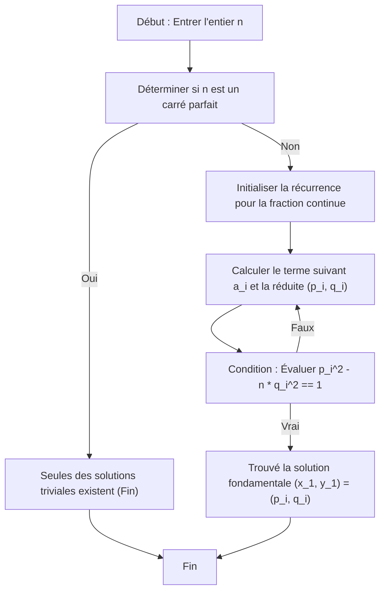

# Introduction

Dans le domaine de la théorie des nombres, **l'équation de Pell** (Pell's equation) est connue comme l'une des équations diophantiennes les plus belles et possédant un contexte théorique profond. Dans cet article, nous fournirons une explication très détaillée allant de la définition de base et des propriétés de cette équation, à une méthode de résolution élégante et efficace utilisant les fractions continues (Continued fractions), ainsi que le mécanisme de génération de ses solutions infinies. Pour tous ceux qui aiment les mathématiques, nous avons couvert de la dérivation des formules à la visualisation des algorithmes et à la mise en œuvre à l'aide d'un langage de programmation.

## 1. Qu'est-ce que l'équation de Pell ?

L'équation de Pell désigne une équation diophantienne quadratique à deux variables ayant la forme suivante :

$$ x^2 - ny^2 = 1 $$

Ici, $n$ est un entier positif qui n'est pas un nombre carré (sans facteur carré ou du moins pas un carré parfait). Notre objectif est de trouver des paires d'entiers inconnus $x$ et $y$ qui satisfont cette équation. Supposons un instant que $n$ soit un carré parfait, c'est-à-dire $n = k^2$ (où $k$ est un entier). L'équation peut alors être transformée comme suit :

$$ x^2 - k^2y^2 = 1 $$
$$ (x - ky)(x + ky) = 1 $$

Puisque $x$, $y$ et $k$ sont tous des entiers, $(x - ky)$ et $(x + ky)$ doivent également être des entiers. Les seules combinaisons d'entiers dont le produit est 1 sont $(1, 1)$ ou $(-1, -1)$. Résoudre ce système donne $y = 0$, ce qui signifie que les solutions se limitent aux très simples $(x, y) = (\pm 1, 0)$. Par conséquent, dans l'équation de Pell, la condition que $n$ ne soit pas un carré parfait est une prémisse essentielle pour trouver des solutions significatives.

## 2. Contexte historique : Pell, [Fermat](https://kenji.blog/fr/p/fermat/) et les mathématiciens indiens de l'Antiquité

Bien que cette équation porte le nom de « Pell », l'exploration des faits historiques révèle un contexte quelque peu étrange. En fait, la première personne dans l'Europe moderne à avoir étudié une solution générale pour cette équation et affirmé fermement qu'une solution existe toujours fut le grand mathématicien français **[Pierre de Fermat](https://kenji.blog/fr/p/fermat/)**.

Plus tard, **[Leonhard Euler](https://kenji.blog/fr/p/euler/)** a lié par erreur le nom du mathématicien anglais **John Pell** à cette équation, et elle est depuis largement connue sous le nom d'« équation de Pell ». Pell lui-même n'a pas joué de rôle central dans la méthode de résolution de cette équation.

En remontant plus loin dans le temps, les mathématiciens indiens **Brahmagupta** et **Bhāskara II** ont calculé des solutions à des équations de ce type à l'aide d'un algorithme sophistiqué appelé méthode Chakravala, des centaines d'années avant [Fermat](https://kenji.blog/fr/p/fermat/). L'histoire de l'exploration par les mathématiciens de l'Antiquité, en passant par le Moyen Âge jusqu'à l'ère moderne, est inscrite dans cette équation.

## 3. La différence entre les solutions triviales et non triviales

Pour l'équation de Pell $x^2 - ny^2 = 1$, quelle que soit la valeur de $n$, il existe toujours la solution $(x, y) = (\pm 1, 0)$. En substituant ces valeurs dans l'équation, on obtient $1^2 - n \cdot 0^2 = 1$, ce qui est évidemment vrai. C'est ce qu'on appelle une **solution triviale** (trivial solution).

Cependant, ce qui intéresse vraiment les mathématiciens, c'est une **solution non triviale** (non-trivial solution) où $y \neq 0$. Étonnamment, si $n$ est un entier positif qui n'est pas un carré parfait, il a été mathématiquement prouvé que l'équation de Pell a **une infinité de solutions non triviales**. De plus, parmi ces solutions infinies, la plus petite solution où $x$ et $y$ sont tous deux des entiers positifs est appelée la **solution fondamentale** (fundamental solution), et une fois trouvée, toutes les autres solutions peuvent être facilement générées par des opérations algébriques.

## 4. Le lien profond entre les fractions continues et l'équation de Pell

L'outil le plus puissant et le plus standard pour trouver efficacement la solution fondamentale est la **fraction continue** (Continued fraction). Puisque le nombre irrationnel $\sqrt{n}$ ne peut pas être représenté par une fraction finie, il peut être magnifiquement exprimé sous la forme d'une fraction continue régulière périodique infinie.

$$ \sqrt{n} = [a_0; \overline{a_1, a_2, \dots, a_k, 2a_0}] $$

Ici, $a_0$ est la partie entière de $\sqrt{n}$ (c'est-à-dire $\lfloor \sqrt{n} \rfloor$), et la partie surmontée d'une barre représente la portion périodique de la fraction continue. Soit $m$ la longueur de cette période.

Le nombre rationnel $\frac{p_i}{q_i}$ obtenu en tronquant la fraction continue à un certain terme est appelé une **réduite** (convergent). Les réduites fournissent les meilleures approximations rationnelles pour le nombre irrationnel $\sqrt{n}$. Étonnamment, la solution fondamentale $(x_1, y_1)$ de l'équation de Pell est directement obtenue à partir du numérateur $p$ et du dénominateur $q$ d'une réduite spécifique dans le développement en fraction continue de $\sqrt{n}$. Plus précisément, elle est déterminée par la longueur de la période $m$ comme suit :

- Si la période $m$ est paire : La solution fondamentale est $(p_{m-1}, q_{m-1})$.
- Si la période $m$ est impaire : La solution fondamentale est $(p_{2m-1}, q_{2m-1})$.

## 5. Trouver la solution fondamentale : Une explication détaillée de l'algorithme

Les réduites $\frac{p_i}{q_i}$ peuvent être calculées très rapidement sur un ordinateur en utilisant les relations de récurrence suivantes.

$$ p_i = a_i p_{i-1} + p_{i-2} $$
$$ q_i = a_i q_{i-1} + q_{i-2} $$

Les conditions initiales sont définies comme suit pour permettre à l'algorithme de démarrer en douceur :
- $p_{-1} = 1, \quad p_{-2} = 0$
- $q_{-1} = 0, \quad q_{-2} = 1$

Chaque terme $a_i$ de la fraction continue peut également être trouvé séquentiellement en utilisant uniquement des opérations arithmétiques sur les entiers. Cela permet des calculs entiers précis qui éliminent complètement les erreurs de l'arithmétique à virgule flottante.

Pour visualiser la série de processus de recherche d'une solution, nous avons préparé le diagramme de transition d'état suivant.



## 6. Exemple spécifique : Développement en fraction continue et solution fondamentale pour n = 7

Plutôt que de rester dans la théorie abstraite, traçons les calculs pour le cas spécifique de $n = 7$. L'équation de Pell devient $x^2 - 7y^2 = 1$.

Tout d'abord, la partie entière de $\sqrt{7}$ est $a_0 = 2$. En répétant l'opération consistant à prendre l'inverse de la partie décimale restante et à extraire la partie entière, le développement en fraction continue de $\sqrt{7}$ est trouvé comme suit :

$$ \sqrt{7} = [2; \overline{1, 1, 1, 4}] $$

La période est $m = 4$, ce qui est pair. Par conséquent, la solution fondamentale doit être obtenue à partir de la réduite $\frac{p_3}{q_3}$. Calculons les réduites dans l'ordre en utilisant les relations de récurrence.

- $i=0$: Lorsque $a_0=2$, $\frac{p_0}{q_0} = \frac{2}{1}$
- $i=1$: Lorsque $a_1=1$, $p_1 = 1 \times 2 + 1 = 3$, $q_1 = 1 \times 1 + 0 = 1$. Ainsi, $\frac{p_1}{q_1} = \frac{3}{1}$
- $i=2$: Lorsque $a_2=1$, $p_2 = 1 \times 3 + 2 = 5$, $q_2 = 1 \times 1 + 1 = 2$. Ainsi, $\frac{p_2}{q_2} = \frac{5}{2}$
- $i=3$: Lorsque $a_3=1$, $p_3 = 1 \times 5 + 3 = 8$, $q_3 = 1 \times 2 + 1 = 3$. Ainsi, $\frac{p_3}{q_3} = \frac{8}{3}$

Vérifions en substituant $(p_3, q_3) = (8, 3)$ obtenu dans l'équation.
$8^2 - 7 \times 3^2 = 64 - 7 \times 9 = 64 - 63 = 1$.
Cela satisfait parfaitement la condition, cela devient donc la solution fondamentale $(x_1, y_1) = (8, 3)$ pour $n = 7$.

## 7. Générer des solutions infinies : Une approche utilisant des matrices et des récurrences

Une fois qu'au moins une solution fondamentale $(x_1, y_1)$ est trouvée, toutes les autres solutions entières positives $(x_k, y_k)$ peuvent être générées à l'infini à partir de la relation algébrique suivante.

$$ x_k + y_k \sqrt{n} = (x_1 + y_1 \sqrt{n})^k \quad \text{for} \quad k = 1, 2, 3, \dots $$

En développant cette expression et en comparant la partie rationnelle et la partie irrationnelle (le coefficient de $\sqrt{n}$), nous obtenons une relation de récurrence pour calculer la solution suivante $(x_{k+1}, y_{k+1})$ à partir de la solution précédente $(x_k, y_k)$. L'expression de ceci sous forme matricielle donne une forme très nette.

$$
\begin{pmatrix} x_{k+1} \\ y_{k+1} \end{pmatrix} = \begin{pmatrix} x_1 & n y_1 \\ y_1 & x_1 \end{pmatrix} \begin{pmatrix} x_k \\ y_k \end{pmatrix}
$$

N'importe quelle $k$-ème solution peut également être calculée directement en utilisant l'exponentiation matricielle comme suit :

$$
\begin{pmatrix} x_k \\ y_k \end{pmatrix} = \begin{pmatrix} x_1 & n y_1 \\ y_1 & x_1 \end{pmatrix}^{k-1} \begin{pmatrix} x_1 \\ y_1 \end{pmatrix}
$$

Cette propriété suggère fortement que les solutions de l'équation de Pell ne sont pas simplement des séquences de nombres, mais possèdent une structure algébrique (une structure de groupe).

## 8. L'identité de Brahmagupta et la méthode Chakravala

Dans les mathématiques indiennes anciennes, un rôle central dans la résolution de l'équation de Pell était joué par **l'identité de Brahmagupta**. Cette identité prend la forme suivante :

$$ (x_1^2 - ny_1^2)(x_2^2 - ny_2^2) = (x_1 x_2 + n y_1 y_2)^2 - n(x_1 y_2 + x_2 y_1)^2 $$

L'aspect brillant de cette identité est qu'en combinant une solution $(x_1, y_1)$ pour $x^2 - ny^2 = k_1$ et une solution $(x_2, y_2)$ pour $x^2 - ny^2 = k_2$, on peut synthétiser directement une nouvelle solution $(X, Y)$ telle que $X^2 - nY^2 = k_1 k_2$.

Les mathématiciens indiens ont utilisé cette puissante identité avec brio pour assembler des solutions avec de petites erreurs les unes après les autres, développant finalement la **méthode Chakravala** pour arriver à une solution avec une erreur de $1$, c'est-à-dire une solution à l'équation de Pell. Il s'agit d'une réalisation monumentale dans l'histoire mathématique humaine, possédant une efficacité égale ou supérieure à celle du développement en fraction continue.

## 9. Exemple d'implémentation en Python et explication

Maintenant que nous comprenons parfaitement le contexte théorique, écrivons réellement un programme. Le script Python suivant exécute la récurrence de la fraction continue pour un $n$ donné et recherche la solution fondamentale de l'équation de Pell. Comme il traite entièrement avec l'arithmétique entière sans utiliser de nombres à virgule flottante, il n'y a pas lieu de s'inquiéter de la perte de précision.

```python
import math

def is_square(n):
    """
    Une fonction pour déterminer rapidement si un nombre n donné est un carré parfait.
    """
    s = math.isqrt(n)
    return s * s == n

def solve_pell(n):
    """
    Calcule la solution fondamentale de l'équation de Pell x^2 - n * y^2 = 1 en utilisant la méthode des fractions continues.
    Retourne : Un tuple de la solution fondamentale (x, y). Retourne None pour les carrés parfaits.
    """
    if is_square(n):
        return None  # N'a pas de solutions non triviales pour les carrés parfaits

    # Initialisation pour les calculs de fractions continues
    m = 0
    d = 1
    a0 = math.isqrt(n)
    a = a0
    
    # Configuration initiale pour les réduites (p_{-1}=1, p_{-2}=0, q_{-1}=0, q_{-2}=1)
    num1, num2 = 1, 0  # p_{i-1}, p_{i-2}
    den1, den2 = 0, 1  # q_{i-1}, q_{i-2}
    
    # Première réduite (p_0, q_0)
    num = a0
    den = 1
    
    # Boucler jusqu'à ce que la condition x^2 - n*y^2 == 1 soit satisfaite
    while num * num - n * den * den != 1:
        # Calculer le terme suivant a_i de la fraction continue
        m = d * a - m
        d = (n - m * m) // d
        a = (a0 + m) // d
        
        # Mettre à jour les réduites p_i, q_i
        num2 = num1
        num1 = num
        den2 = den1
        den1 = den
        
        num = a * num1 + num2
        den = a * den1 + den2

    return num, den

# Exemple d'utilisation : Lorsque n = 7
n = 7
solution = solve_pell(n)
if solution:
    x, y = solution
    print(f"Solution fondamentale pour n={n} : x={x}, y={y}")
    print(f"Vérification : {x}^2 - {n}*{y}^2 = {x**2 - n * y**2}")
```

Lorsque ce code est exécuté, la solution fondamentale $(x, y) = (8, 3)$ est générée instantanément, exactement comme nous l'avons calculée à la main plus tôt. Si vous essayez une valeur plus grande pour $n$, comme $61$, vous pouvez vérifier que la solution devient des nombres énormes ($x = 1766319049, y = 226153980$), vous permettant de ressentir véritablement la profondeur de l'équation de Pell.

## 10. Pont vers la théorie algébrique des nombres : Relation avec le théorème des unités de Dirichlet

L'équation de Pell n'est pas simplement un puzzle d'entiers. Dans les mathématiques modernes, elle se positionne comme une porte d'entrée vitale vers la théorie des **corps quadratiques réels** $\mathbb{Q}(\sqrt{n})$.

Les solutions de l'équation de Pell correspondent étroitement aux **unités** (éléments dont les inverses sont également des entiers algébriques) dans l'anneau des entiers algébriques d'un corps quadratique réel. La solution fondamentale correspond à **l'unité fondamentale** qui génère ce groupe des unités, et le fait qu'il existe une infinité de solutions pour l'équation de Pell peut être considéré comme un cas particulier d'un théorème plus avancé, le **théorème des unités de Dirichlet**. Comprendre les propriétés de l'unité fondamentale est extrêmement crucial pour rechercher en profondeur les formules du nombre de classes des corps quadratiques et la structure des classes d'idéaux.

## 11. Conclusion

Dans cet article, nous avons exploré en détail l'une des équations diophantiennes les plus fascinantes, **l'équation de Pell**, de ses fondements à ses applications. Nous avons expliqué le fait surprenant qu'il existe toujours une infinité de solutions non triviales pour tout $n$ non carré, un algorithme efficace pour rechercher des solutions utilisant des développements en fractions continues, et le dynamisme de la synthèse de nouvelles solutions l'une après l'autre à partir de la solution fondamentale générée en utilisant des matrices.

Le fait que des problèmes classiques considérés par [Fermat](https://kenji.blog/fr/p/fermat/) et Brahmagupta il y a des centaines d'années puissent être magnifiquement implémentés sous forme d'algorithmes informatiques modernes, et se connecter davantage à la théorie algébrique des nombres avancée, évoque une romance mathématique profonde et intemporelle. Nous espérons que vous saisirez cette occasion d'utiliser le code Python pour explorer le monde de l'équation de Pell pour diverses valeurs de $n$ et toucher aux propriétés profondes des nombres.
