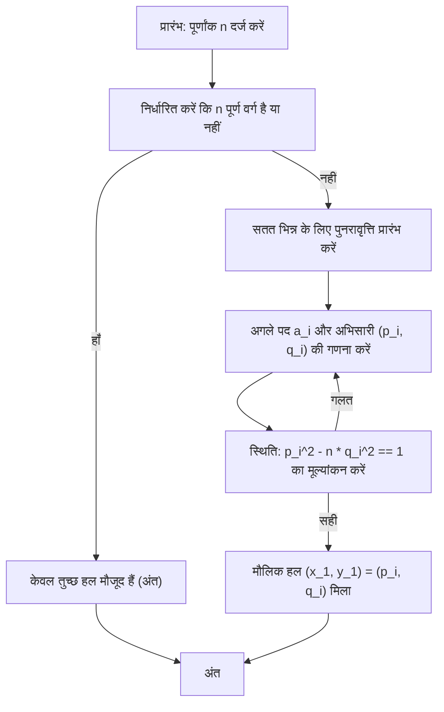

# परिचय

संख्या सिद्धांत के क्षेत्र में, **पेल का समीकरण** (Pell's equation) एक गहरे सैद्धांतिक पृष्ठभूमि वाले सबसे सुंदर डायोफैंटाइन समीकरणों में से एक के रूप में जाना जाता है। इस लेख में, हम इस समीकरण की मूल परिभाषा और गुणों से शुरू करते हुए, सतत भिन्नों (Continued fractions) का उपयोग करके एक सुरुचिपूर्ण और कुशल समाधान पद्धति, और इसके अनंत हलों को उत्पन्न करने के तंत्र तक एक बहुत विस्तृत व्याख्या प्रदान करेंगे। गणित से प्यार करने वाले सभी लोगों के लिए, हमने सूत्रों की व्युत्पत्ति से लेकर एल्गोरिदम के विज़ुअलाइज़ेशन और प्रोग्रामिंग भाषा का उपयोग करके कार्यान्वयन तक सब कुछ कवर किया है।

## 1. पेल का समीकरण क्या है?

पेल का समीकरण दो चरों में एक द्विघात डायोफैंटाइन समीकरण को संदर्भित करता है जिसका निम्नलिखित रूप होता है:

$$ x^2 - ny^2 = 1 $$

यहाँ, $n$ एक धनात्मक पूर्णांक है जो एक वर्ग संख्या नहीं है (वर्ग-मुक्त या कम से कम एक पूर्ण वर्ग नहीं)। हमारा लक्ष्य अज्ञात पूर्णांकों $x$ और $y$ के ऐसे युग्म खोजना है जो इस समीकरण को संतुष्ट करते हों। मान लीजिए कि कुछ समय के लिए $n$ एक पूर्ण वर्ग है, अर्थात, $n = k^2$ (जहाँ $k$ एक पूर्णांक है)। तब समीकरण को इस प्रकार बदला जा सकता है:

$$ x^2 - k^2y^2 = 1 $$
$$ (x - ky)(x + ky) = 1 $$

चूंकि $x$, $y$, और $k$ सभी पूर्णांक हैं, $(x - ky)$ और $(x + ky)$ भी पूर्णांक होने चाहिए। पूर्णांकों के एकमात्र संयोजन जिनका गुणनफल 1 है, वे $(1, 1)$ या $(-1, -1)$ हैं। इसे हल करने पर $y = 0$ प्राप्त होता है, जिसका अर्थ है कि हल बहुत सरल $(x, y) = (\pm 1, 0)$ तक सीमित हैं। इसलिए, पेल के समीकरण में, यह शर्त कि $n$ एक पूर्ण वर्ग नहीं है, सार्थक हल खोजने के लिए एक अनिवार्य आधार है।

## 2. ऐतिहासिक पृष्ठभूमि: पेल, फर्मा और प्राचीन भारतीय गणितज्ञ

हालांकि इस समीकरण पर "पेल" का नाम है, ऐतिहासिक तथ्यों की खोज से एक कुछ अजीब पृष्ठभूमि का पता चलता है। वास्तव में, आधुनिक यूरोप में इस समीकरण के सामान्य हल का अध्ययन करने वाले और दृढ़ता से यह दावा करने वाले पहले व्यक्ति कि एक हल हमेशा मौजूद होता है, महान फ्रांसीसी गणितज्ञ **पियरे डी फर्मा** ([Pierre de Fermat](https://kenji.blog/hi/p/fermat/)) थे।

बाद में, **[लियोनहार्ड यूलर](https://kenji.blog/hi/p/euler/)** ([Leonhard Euler](https://kenji.blog/hi/p/euler/)) ने अंग्रेजी गणितज्ञ **जॉन पेल** (John Pell) का नाम इस समीकरण के साथ गलती से जोड़ दिया, और तब से इसे व्यापक रूप से "पेल का समीकरण" के रूप में जाना जाता है। इस समीकरण को हल करने की विधि में पेल ने स्वयं कोई केंद्रीय भूमिका नहीं निभाई।

समय में और पीछे जाएं, तो भारतीय गणितज्ञों **ब्रह्मगुप्त** (Brahmagupta) और **भास्कर द्वितीय** (Bhāskara II) ने फर्मा से सैकड़ों साल पहले चक्रवाल विधि नामक एक परिष्कृत एल्गोरिदम का उपयोग करके इस प्रकार के समीकरणों के हलों की गणना की थी। प्राचीन काल से लेकर मध्य युग और आधुनिक युग तक गणितज्ञों द्वारा अन्वेषण का इतिहास इस समीकरण में अंकित है।

## 3. तुच्छ और गैर-तुच्छ हलों के बीच का अंतर

पेल के समीकरण $x^2 - ny^2 = 1$ के लिए, $n$ के मान की परवाह किए बिना, हमेशा हल $(x, y) = (\pm 1, 0)$ मौजूद होता है। इन्हें समीकरण में रखने पर $1^2 - n \cdot 0^2 = 1$ प्राप्त होता है, जो स्पष्ट रूप से सत्य है। इसे **तुच्छ हल** (trivial solution) कहा जाता है।

हालाँकि, गणितज्ञों की वास्तव में जिसमें रुचि है वह एक **गैर-तुच्छ हल** (non-trivial solution) है जहाँ $y \neq 0$ हो। आश्चर्यजनक रूप से, यदि $n$ एक धनात्मक पूर्णांक है जो पूर्ण वर्ग नहीं है, तो गणितीय रूप से यह सिद्ध किया जा चुका है कि पेल के समीकरण के **अनंत गैर-तुच्छ हल** हैं। इसके अलावा, इन अनंत हलों में से, सबसे छोटा हल जहाँ $x$ और $y$ दोनों धनात्मक पूर्णांक हैं, **मौलिक हल** (fundamental solution) कहलाता है, और एक बार यह मिल जाने पर, बीजगणितीय संक्रियाओं के माध्यम से अन्य सभी हलों को आसानी से उत्पन्न किया जा सकता है।

## 4. सतत भिन्नों और पेल के समीकरण के बीच का गहरा संबंध

मौलिक हल को कुशलतापूर्वक खोजने के लिए सबसे शक्तिशाली और मानक उपकरण **सतत भिन्न** (Continued fraction) है। चूँकि अपरिमेय संख्या $\sqrt{n}$ को एक परिमित भिन्न द्वारा निरूपित नहीं किया जा सकता है, इसे एक असीमित रूप से जारी रहने वाली आवधिक नियमित सतत भिन्न के रूप में खूबसूरती से व्यक्त किया जा सकता है।

$$ \sqrt{n} = [a_0; \overline{a_1, a_2, \dots, a_k, 2a_0}] $$

यहाँ, $a_0$, $\sqrt{n}$ का पूर्णांक भाग है (अर्थात, $\lfloor \sqrt{n} \rfloor$), और ऊपर की रेखा के नीचे का भाग सतत भिन्न के आवधिक भाग को दर्शाता है। मान लीजिए इस अवधि की लंबाई $m$ है।

सतत भिन्न को एक निश्चित पद पर काटकर प्राप्त परिमेय संख्या $\frac{p_i}{q_i}$ को **अभिसारी** (convergent) कहा जाता है। अभिसारी अपरिमेय संख्या $\sqrt{n}$ के लिए सर्वोत्तम परिमेय सन्निकटन प्रदान करते हैं। आश्चर्यजनक रूप से, पेल के समीकरण का मौलिक हल $(x_1, y_1)$ सीधे $\sqrt{n}$ के सतत भिन्न विस्तार में एक विशिष्ट अभिसारी के अंश $p$ और हर $q$ से प्राप्त किया जाता है। विशेष रूप से, यह अवधि की लंबाई $m$ द्वारा इस प्रकार निर्धारित किया जाता है:

- यदि अवधि $m$ सम है: मौलिक हल $(p_{m-1}, q_{m-1})$ है।
- यदि अवधि $m$ विषम है: मौलिक हल $(p_{2m-1}, q_{2m-1})$ है।

## 5. मौलिक हल खोजना: एल्गोरिदम की विस्तृत व्याख्या

अभिसारी $\frac{p_i}{q_i}$ की गणना निम्नलिखित पुनरावृत्ति संबंधों का उपयोग करके कंप्यूटर पर बहुत तेजी से की जा सकती है।

$$ p_i = a_i p_{i-1} + p_{i-2} $$
$$ q_i = a_i q_{i-1} + q_{i-2} $$

एल्गोरिदम को सुचारू रूप से शुरू करने की अनुमति देने के लिए प्रारंभिक शर्तें इस प्रकार निर्धारित की गई हैं:
- $p_{-1} = 1, \quad p_{-2} = 0$
- $q_{-1} = 0, \quad q_{-2} = 1$

सतत भिन्न का प्रत्येक पद $a_i$ भी क्रमिक रूप से केवल पूर्णांक अंकगणितीय संक्रियाओं का उपयोग करके पाया जा सकता है। यह सटीक पूर्णांक गणना को सक्षम बनाता है जो फ़्लोटिंग-पॉइंट अंकगणितीय त्रुटियों को पूरी तरह से समाप्त कर देता है।

हल खोजने में प्रक्रियाओं की श्रृंखला की कल्पना करने के लिए, हमने निम्नलिखित अवस्था संक्रमण आरेख तैयार किया है।



## 6. विशिष्ट उदाहरण: n = 7 के लिए सतत भिन्न विस्तार और मौलिक हल

केवल अमूर्त सिद्धांत के बजाय, आइए $n = 7$ के विशिष्ट मामले के लिए गणनाओं का पता लगाएं। पेल का समीकरण $x^2 - 7y^2 = 1$ हो जाता है।

सबसे पहले, $\sqrt{7}$ का पूर्णांक भाग $a_0 = 2$ है। शेष दशमलव भाग का व्युत्क्रम लेने और पूर्णांक भाग को निकालने की संक्रिया को दोहराकर, $\sqrt{7}$ का सतत भिन्न विस्तार इस प्रकार पाया जाता है:

$$ \sqrt{7} = [2; \overline{1, 1, 1, 4}] $$

अवधि $m = 4$ है, जो सम है। इसलिए, मौलिक हल अभिसारी $\frac{p_3}{q_3}$ से प्राप्त किया जाना चाहिए। आइए पुनरावृत्ति संबंधों का उपयोग करके अभिसारी की क्रम में गणना करें।

- $i=0$: जब $a_0=2$, $\frac{p_0}{q_0} = \frac{2}{1}$
- $i=1$: जब $a_1=1$, $p_1 = 1 \times 2 + 1 = 3$, $q_1 = 1 \times 1 + 0 = 1$। इस प्रकार, $\frac{p_1}{q_1} = \frac{3}{1}$
- $i=2$: जब $a_2=1$, $p_2 = 1 \times 3 + 2 = 5$, $q_2 = 1 \times 1 + 1 = 2$। इस प्रकार, $\frac{p_2}{q_2} = \frac{5}{2}$
- $i=3$: जब $a_3=1$, $p_3 = 1 \times 5 + 3 = 8$, $q_3 = 1 \times 2 + 1 = 3$। इस प्रकार, $\frac{p_3}{q_3} = \frac{8}{3}$

आइए प्राप्त $(p_3, q_3) = (8, 3)$ को समीकरण में रखकर जाँच करें।
$8^2 - 7 \times 3^2 = 64 - 7 \times 9 = 64 - 63 = 1$।
यह पूरी तरह से स्थिति को संतुष्ट करता है, इसलिए यह $n = 7$ के लिए मौलिक हल $(x_1, y_1) = (8, 3)$ बन जाता है।

## 7. अनंत हलों का निर्माण: मैट्रिक्स और पुनरावृत्ति का उपयोग करने वाला दृष्टिकोण

एक बार कम से कम एक मौलिक हल $(x_1, y_1)$ मिल जाने के बाद, अन्य सभी धनात्मक पूर्णांक हल $(x_k, y_k)$ निम्नलिखित बीजगणितीय संबंध से अनंत रूप से उत्पन्न किए जा सकते हैं।

$$ x_k + y_k \sqrt{n} = (x_1 + y_1 \sqrt{n})^k \quad \text{for} \quad k = 1, 2, 3, \dots $$

इस व्यंजक का विस्तार करके और परिमेय भाग और अपरिमेय भाग ($\sqrt{n}$ का गुणांक) की तुलना करके, हमें पिछले हल $(x_k, y_k)$ से अगले हल $(x_{k+1}, y_{k+1})$ की गणना करने के लिए एक पुनरावृत्ति संबंध प्राप्त होता है। इसे मैट्रिक्स प्रारूप में व्यक्त करने से एक बहुत ही साफ-सुथरा रूप प्राप्त होता है।

$$
\begin{pmatrix} x_{k+1} \\ y_{k+1} \end{pmatrix} = \begin{pmatrix} x_1 & n y_1 \\ y_1 & x_1 \end{pmatrix} \begin{pmatrix} x_k \\ y_k \end{pmatrix}
$$

किसी भी $k$-वें हल की सीधे मैट्रिक्स घातांक का उपयोग करके निम्नानुसार गणना भी की जा सकती है:

$$
\begin{pmatrix} x_k \\ y_k \end{pmatrix} = \begin{pmatrix} x_1 & n y_1 \\ y_1 & x_1 \end{pmatrix}^{k-1} \begin{pmatrix} x_1 \\ y_1 \end{pmatrix}
$$

यह गुण दृढ़ता से सुझाव देता है कि पेल के समीकरण के हल केवल संख्याओं के अनुक्रम नहीं हैं, बल्कि एक बीजगणितीय संरचना (एक समूह संरचना) रखते हैं।

## 8. ब्रह्मगुप्त की सर्वसमिका और चक्रवाल विधि

प्राचीन भारतीय गणित में, पेल के समीकरण को हल करने में **ब्रह्मगुप्त की सर्वसमिका** द्वारा केंद्रीय भूमिका निभाई गई थी। यह सर्वसमिका निम्नलिखित रूप लेती है:

$$ (x_1^2 - ny_1^2)(x_2^2 - ny_2^2) = (x_1 x_2 + n y_1 y_2)^2 - n(x_1 y_2 + x_2 y_1)^2 $$

इस सर्वसमिका का शानदार पहलू यह है कि $x^2 - ny^2 = k_1$ के लिए एक हल $(x_1, y_1)$ और $x^2 - ny^2 = k_2$ के लिए एक हल $(x_2, y_2)$ को मिलाकर, कोई सीधे एक नया हल $(X, Y)$ ऐसे संश्लेषित कर सकता है कि $X^2 - nY^2 = k_1 k_2$ हो।

भारतीय गणितज्ञों ने उत्कृष्ट रूप से इस शक्तिशाली सर्वसमिका का उपयोग छोटी त्रुटियों वाले हलों को एक के बाद एक जोड़ने के लिए किया, अंततः $1$ की त्रुटि वाले हल, अर्थात् पेल के समीकरण के हल तक पहुँचने के लिए **चक्रवाल विधि** का विकास किया। यह मानव गणितीय इतिहास में एक स्मारकीय उपलब्धि है, जिसमें सतत भिन्न विस्तार के समान या उससे अधिक दक्षता है।

## 9. पायथन कार्यान्वयन उदाहरण और स्पष्टीकरण

चूँकि अब हम सैद्धांतिक पृष्ठभूमि को पूरी तरह से समझ चुके हैं, आइए वास्तव में एक प्रोग्राम लिखें। निम्नलिखित पायथन स्क्रिप्ट किसी दिए गए $n$ के लिए सतत भिन्न के लिए पुनरावृत्ति को निष्पादित करती है और पेल के समीकरण के मौलिक हल की खोज करती है। चूँकि यह फ़्लोटिंग-पॉइंट संख्याओं का उपयोग किए बिना पूरी तरह से पूर्णांक अंकगणित के साथ प्रक्रिया करता है, इसलिए सटीकता के नुकसान की कोई चिंता नहीं है।

```python
import math

def is_square(n):
    """
    यह शीघ्रता से निर्धारित करने के लिए एक फ़ंक्शन कि दी गई संख्या n पूर्ण वर्ग है या नहीं।
    """
    s = math.isqrt(n)
    return s * s == n

def solve_pell(n):
    """
    सतत भिन्न विधि का उपयोग करके पेल के समीकरण x^2 - n * y^2 = 1 के मौलिक हल की गणना करता है।
    वापसी: मौलिक हल (x, y) का टपल। पूर्ण वर्गों के लिए None देता है।
    """
    if is_square(n):
        return None  # पूर्ण वर्गों के लिए कोई गैर-तुच्छ हल नहीं है

    # सतत भिन्न गणनाओं के लिए आरंभीकरण
    m = 0
    d = 1
    a0 = math.isqrt(n)
    a = a0
    
    # अभिसारी के लिए प्रारंभिक सेटअप (p_{-1}=1, p_{-2}=0, q_{-1}=0, q_{-2}=1)
    num1, num2 = 1, 0  # p_{i-1}, p_{i-2}
    den1, den2 = 0, 1  # q_{i-1}, q_{i-2}
    
    # पहला अभिसारी (p_0, q_0)
    num = a0
    den = 1
    
    # जब तक कि शर्त x^2 - n*y^2 == 1 संतुष्ट न हो जाए तब तक लूप करें
    while num * num - n * den * den != 1:
        # सतत भिन्न के अगले पद a_i की गणना करें
        m = d * a - m
        d = (n - m * m) // d
        a = (a0 + m) // d
        
        # अभिसारी p_i, q_i को अपडेट करें
        num2 = num1
        num1 = num
        den2 = den1
        den1 = den
        
        num = a * num1 + num2
        den = a * den1 + den2

    return num, den

# उपयोग उदाहरण: जब n = 7
n = 7
solution = solve_pell(n)
if solution:
    x, y = solution
    print(f"n={n} के लिए मौलिक हल: x={x}, y={y}")
    print(f"सत्यापन: {x}^2 - {n}*{y}^2 = {x**2 - n * y**2}")
```

जब इस कोड को निष्पादित किया जाता है, तो मौलिक हल $(x, y) = (8, 3)$ तुरंत आउटपुट होता है, बिल्कुल वैसे ही जैसे हमने पहले हाथ से गणना की थी। यदि आप $n$ के लिए एक बड़ा मान आज़माते हैं, जैसे कि $61$, तो आप सत्यापित कर सकते हैं कि हल भारी संख्या ($x = 1766319049, y = 226153980$) बन जाता है, जिससे आप वास्तव में पेल के समीकरण की गहराई को महसूस कर सकते हैं।

## 10. बीजगणितीय संख्या सिद्धांत के लिए पुल: डिरिचलेट की इकाई प्रमेय के साथ संबंध

पेल का समीकरण केवल पूर्णांकों की एक पहेली नहीं है। आधुनिक गणित में, इसे **वास्तविक द्विघात क्षेत्रों** $\mathbb{Q}(\sqrt{n})$ के सिद्धांत के लिए एक महत्वपूर्ण प्रवेश द्वार के रूप में स्थापित किया गया है।

पेल के समीकरण के हल वास्तविक द्विघात क्षेत्र के बीजगणितीय पूर्णांक वलय में **इकाइयों** (वे तत्व जिनके व्युत्क्रम भी बीजगणितीय पूर्णांक हैं) के निकटता से मेल खाते हैं। मौलिक हल **मौलिक इकाई** (fundamental unit) से मेल खाता है जो इकाइयों के इस समूह को उत्पन्न करता है, और पेल के समीकरण के लिए अनंत हलों के मौजूद होने के तथ्य को एक अधिक उन्नत प्रमेय, **डिरिचलेट की इकाई प्रमेय** (Dirichlet's unit theorem) के एक विशेष मामले के रूप में देखा जा सकता है। मौलिक इकाई के गुणों को समझना द्विघात क्षेत्रों की श्रेणी संख्या के सूत्रों और आदर्श श्रेणियों की संरचना पर गहराई से शोध करने के लिए अत्यंत महत्वपूर्ण है।

## 11. निष्कर्ष

इस लेख में, हमने इसके आधार से लेकर इसके अनुप्रयोगों तक सबसे आकर्षक डायोफैंटाइन समीकरणों में से एक, **पेल के समीकरण** का विस्तार से अन्वेषण किया। हमने इस आश्चर्यजनक तथ्य को समझाया कि किसी भी गैर-वर्ग $n$ के लिए हमेशा अनंत गैर-तुच्छ हल होते हैं, सतत भिन्न विस्तार का उपयोग करके हलों की खोज के लिए एक कुशल एल्गोरिदम, और मैट्रिक्स का उपयोग करके उत्पन्न मौलिक हल से एक के बाद एक नए हलों को संश्लेषित करने की गतिशीलता।

यह तथ्य कि सैकड़ों साल पहले फर्मा और ब्रह्मगुप्त द्वारा विचार की गई शास्त्रीय समस्याओं को आधुनिक कंप्यूटर एल्गोरिदम के रूप में खूबसूरती से लागू किया जा सकता है, और आगे उन्नत बीजगणितीय संख्या सिद्धांत से जोड़ा जा सकता है, एक गहरे और कालातीत गणितीय रोमांस को जन्म देता है। हम आशा करते हैं कि आप पायथन कोड का उपयोग करने और $n$ के विभिन्न मानों के लिए पेल के समीकरण की दुनिया का पता लगाने और संख्याओं के गहरे गुणों को छूने के इस अवसर का लाभ उठाएंगे।
