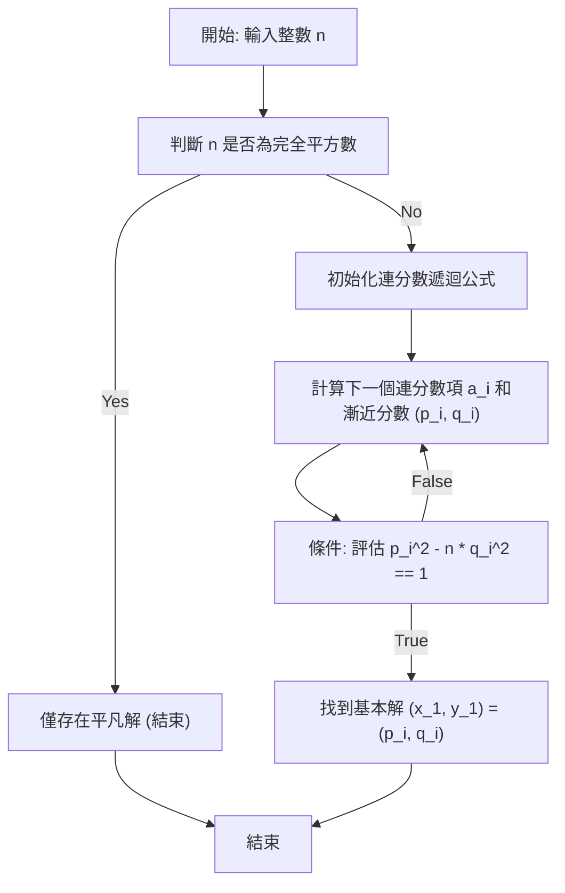

# 引言

在數論領域中，**[佩爾方程](https://kenji.blog/zh-tw/p/pell-equation/)**（Pell's equation）被認為是最優美且具有深厚理論背景的[丟番圖](https://kenji.blog/zh-tw/p/diophantus/)方程之一。本文將從該方程的基本定義和性質出發，詳細講解使用連分數（Continued fractions）的優雅且高效的求解方法，以及其無限解的生成機制。為了所有熱愛數學的讀者，我們涵蓋了從公式推導、算法可視化，到使用程式語言實現的各個方面。

## 1. 什麼是[佩爾方程](https://kenji.blog/zh-tw/p/pell-equation/)？

[佩爾方程](https://kenji.blog/zh-tw/p/pell-equation/)是指具有以下形式的二元二次[丟番圖](https://kenji.blog/zh-tw/p/diophantus/)方程：

$$ x^2 - ny^2 = 1 $$

在這裡，$n$ 是一個非平方數的正整數（無平方因子或至少不是完全平方數）。我們的目標是找到滿足該方程的未知整數 $x$ 和 $y$ 的組合。假設 $n$ 是一個完全平方數，即 $n = k^2$（$k$ 為整數）。那麼該方程可以變形如下：

$$ x^2 - k^2y^2 = 1 $$
$$ (x - ky)(x + ky) = 1 $$

由於 $x$、$y$ 和 $k$ 都是整數，因此 $(x - ky)$ 和 $(x + ky)$ 也必須是整數。乘積為 1 的整數組合只有 $(1, 1)$ 或 $(-1, -1)$。解此方程組可得 $y = 0$，這意味著解僅限於非常簡單的 $(x, y) = (\pm 1, 0)$。因此，在[佩爾方程](https://kenji.blog/zh-tw/p/pell-equation/)中，要求 $n$ 不是完全平方數是尋找有意義解的必要前提。

## 2. 歷史背景：佩爾、費馬以及古印度數學家們

雖然這個方程冠有「佩爾」之名，但追溯歷史事實，其背景有些離奇。實際上，在近代歐洲，首先研究該方程的一般解法並強烈斷言解必然存在的是偉大的法國數學家**[皮埃爾·德·費馬](https://kenji.blog/zh-tw/p/fermat/)**（[Pierre de Fermat](https://kenji.blog/zh-tw/p/fermat/)）。

後來，**萊昂哈德·歐拉**（[Leonhard Euler](https://kenji.blog/zh-tw/p/euler/)）錯誤地將英國數學家**約翰·佩爾**（John Pell）的名字與這個方程聯繫在一起，因此至今它仍被廣泛稱為「[佩爾方程](https://kenji.blog/zh-tw/p/pell-equation/)」。佩爾本人在這個方程的求解方法中並沒有發揮核心作用。

如果將時間進一步往前推移，在費馬之前幾百年，印度數學家**婆羅摩笈多**（Brahmagupta）和**婆什迦羅第二**（Bhāskara II）就使用了一種名為查克拉瓦拉法（Chakravala method）的精妙算法，計算出了這類方程的解。從古代到中世紀，再到近代的數學家們的探索歷史，都銘刻在這個方程中。

## 3. 平凡解與非平凡解的區別

對於[佩爾方程](https://kenji.blog/zh-tw/p/pell-equation/) $x^2 - ny^2 = 1$，無論 $n$ 取何值，始終存在解 $(x, y) = (\pm 1, 0)$。代入方程得到 $1^2 - n \cdot 0^2 = 1$，顯然成立。這被稱為**平凡解**（trivial solution）。

然而，數學家真正感興趣的是 $y \neq 0$ 的**非平凡解**（non-trivial solution）。令人驚嘆的是，如果 $n$ 是一個非完全平方數的正整數，在數學上已經證明[佩爾方程](https://kenji.blog/zh-tw/p/pell-equation/)具有**無限多個非平凡解**。而且，在這無限多個解中，$x$ 和 $y$ 均為正整數的最小解被稱為**基本解**（fundamental solution），只要找到這個基本解，就可以通過代數操作輕鬆生成所有其他的解。

## 4. 連分數展開與[佩爾方程](https://kenji.blog/zh-tw/p/pell-equation/)的深層聯繫

有效尋找基本解的最強大且標準的工具是**連分數**（Continued fraction）。由於無理數 $\sqrt{n}$ 無法用有限的分數表示，它可以優美地表示為無限循環的簡單連分數。

$$ \sqrt{n} = [a_0; \overline{a_1, a_2, \dots, a_k, 2a_0}] $$

在這裡，$a_0$ 是 $\sqrt{n}$ 的整數部分（即 $\lfloor \sqrt{n} \rfloor$），上方帶有橫線的部分代表連分數的循環部分。設這個循環的長度為 $m$。

不進行無限展開，而是在中間某一項截斷所得到的有理數 $\frac{p_i}{q_i}$ 稱為**漸近分數**（convergent）。漸近分數提供了無理數 $\sqrt{n}$ 的最佳有理數近似。令人驚訝的是，[佩爾方程](https://kenji.blog/zh-tw/p/pell-equation/)的基本解 $(x_1, y_1)$ 可以直接從 $\sqrt{n}$ 的連分數展開中某個特定漸近分數的分子 $p$ 和分母 $q$ 獲得。具體來說，它由循環長度 $m$ 決定如下：

- 如果循環長度 $m$ 為偶數：基本解為 $(p_{m-1}, q_{m-1})$。
- 如果循環長度 $m$ 為奇數：基本解為 $(p_{2m-1}, q_{2m-1})$。

## 5. 基本解的求解方法：算法的詳細解析

漸近分數 $\frac{p_i}{q_i}$ 可以使用以下遞迴公式在計算機上進行極快的計算。

$$ p_i = a_i p_{i-1} + p_{i-2} $$
$$ q_i = a_i q_{i-1} + q_{i-2} $$

為了讓算法順利啟動，初始條件設置如下：
- $p_{-1} = 1, \quad p_{-2} = 0$
- $q_{-1} = 0, \quad q_{-2} = 1$

連分數的每一項 $a_i$ 也可以僅使用整數四則運算逐步求出。這使得計算過程能夠完全排除浮點運算誤差，實現精確的整數運算。

為了直觀展示尋找解的過程，我們準備了以下的狀態轉移圖。



## 6. 具體例子：n = 7 時的連分數展開與基本解的推導

不僅僅是抽象的理論，讓我們來具體追踪一下 $n = 7$ 時的計算過程。此時的[佩爾方程](https://kenji.blog/zh-tw/p/pell-equation/)為 $x^2 - 7y^2 = 1$。

首先，$\sqrt{7}$ 的整數部分是 $a_0 = 2$。通過重複取剩餘小數部分的倒數並提取整數部分的操作，可以求出 $\sqrt{7}$ 的連分數展開如下：

$$ \sqrt{7} = [2; \overline{1, 1, 1, 4}] $$

循環長度為 $m = 4$，是一個偶數。因此，基本解應該從漸近分數 $\frac{p_3}{q_3}$ 中獲得。讓我們使用遞迴公式依次計算漸近分數。

- $i=0$: 當 $a_0=2$ 時， $\frac{p_0}{q_0} = \frac{2}{1}$
- $i=1$: 當 $a_1=1$ 時， $p_1 = 1 \times 2 + 1 = 3$， $q_1 = 1 \times 1 + 0 = 1$。因此， $\frac{p_1}{q_1} = \frac{3}{1}$
- $i=2$: 當 $a_2=1$ 時， $p_2 = 1 \times 3 + 2 = 5$， $q_2 = 1 \times 1 + 1 = 2$。因此， $\frac{p_2}{q_2} = \frac{5}{2}$
- $i=3$: 當 $a_3=1$ 時， $p_3 = 1 \times 5 + 3 = 8$， $q_3 = 1 \times 2 + 1 = 3$。因此， $\frac{p_3}{q_3} = \frac{8}{3}$

讓我們將求得的 $(p_3, q_3) = (8, 3)$ 代入方程進行驗算。
$8^2 - 7 \times 3^2 = 64 - 7 \times 9 = 64 - 63 = 1$。
它完美地滿足了條件，因此這就是 $n = 7$ 時的基本解 $(x_1, y_1) = (8, 3)$。

## 7. 生成無限解：使用矩陣與遞迴公式的方法

一旦找到哪怕一個基本解 $(x_1, y_1)$，就可以通過以下代數關係式無限生成所有其他的正整數解 $(x_k, y_k)$。

$$ x_k + y_k \sqrt{n} = (x_1 + y_1 \sqrt{n})^k \quad \text{for} \quad k = 1, 2, 3, \dots $$

通過展開該式並比較有理數部分和無理數部分（$\sqrt{n}$ 的係數），我們可以獲得一個遞迴公式，用於從前一個解 $(x_k, y_k)$ 計算出下一個解 $(x_{k+1}, y_{k+1})$。如果用矩陣的形式來表達，它的形式非常簡潔。

$$
\begin{pmatrix} x_{k+1} \\ y_{k+1} \end{pmatrix} = \begin{pmatrix} x_1 & n y_1 \\ y_1 & x_1 \end{pmatrix} \begin{pmatrix} x_k \\ y_k \end{pmatrix}
$$

任意第 $k$ 個解也可以使用矩陣的冪運算直接計算如下：

$$
\begin{pmatrix} x_k \\ y_k \end{pmatrix} = \begin{pmatrix} x_1 & n y_1 \\ y_1 & x_1 \end{pmatrix}^{k-1} \begin{pmatrix} x_1 \\ y_1 \end{pmatrix}
$$

這個性質強烈暗示了[佩爾方程](https://kenji.blog/zh-tw/p/pell-equation/)的解不僅是簡單的數字羅列，而且具有代數結構（群結構）。

## 8. 婆羅摩笈多恆等式與查克拉瓦拉法

在古印度數學中，在求解[佩爾方程](https://kenji.blog/zh-tw/p/pell-equation/)時發揮核心作用的是**婆羅摩笈多恆等式**（Brahmagupta's identity）。這個恆等式的形式如下：

$$ (x_1^2 - ny_1^2)(x_2^2 - ny_2^2) = (x_1 x_2 + n y_1 y_2)^2 - n(x_1 y_2 + x_2 y_1)^2 $$

這個恆等式的絕妙之處在於，通過組合 $x^2 - ny^2 = k_1$ 的解 $(x_1, y_1)$ 和 $x^2 - ny^2 = k_2$ 的解 $(x_2, y_2)$，可以直接合成出一個滿足 $X^2 - nY^2 = k_1 k_2$ 的新解 $(X, Y)$。

印度數學家巧妙地利用這個強大的恆等式，將具有較小誤差的解不斷組合，最終推導出**查克拉瓦拉法**，以達到誤差為 $1$ 的解，也就是[佩爾方程](https://kenji.blog/zh-tw/p/pell-equation/)的解。這是人類數學史上的一項偉大成就，具有與連分數展開同等甚至更高的效率。

## 9. Python 實現示例與解說

在充分理解了理論背景之後，讓我們實際編寫一個程式。以下 Python 腳本針對指定的 $n$ 執行連分數遞迴，以搜索[佩爾方程](https://kenji.blog/zh-tw/p/pell-equation/)的基本解。由於計算過程不使用浮點數，完全依靠整數運算處理，因此不用擔心精度丟失。

```python
import math

def is_square(n):
    """
    快速判斷給定的數字 n 是否為完全平方數的函數。
    """
    s = math.isqrt(n)
    return s * s == n

def solve_pell(n):
    """
    使用連分數法計算佩爾方程 x^2 - n * y^2 = 1 的基本解。
    返回值: 基本解 (x, y) 的元組。如果是完全平方數則返回 None。
    """
    if is_square(n):
        return None  # 如果是完全平方數，則沒有非平凡解

    # 連分數計算的初始化
    m = 0
    d = 1
    a0 = math.isqrt(n)
    a = a0
    
    # 漸近分數的初始值設定 (p_{-1}=1, p_{-2}=0, q_{-1}=0, q_{-2}=1)
    num1, num2 = 1, 0  # p_{i-1}, p_{i-2}
    den1, den2 = 0, 1  # q_{i-1}, q_{i-2}
    
    # 初始漸近分數 (p_0, q_0)
    num = a0
    den = 1
    
    # 循環直到滿足條件 x^2 - n*y^2 == 1
    while num * num - n * den * den != 1:
        # 計算連分數的下一項 a_i
        m = d * a - m
        d = (n - m * m) // d
        a = (a0 + m) // d
        
        # 更新漸近分數 p_i, q_i
        num2 = num1
        num1 = num
        den2 = den1
        den1 = den
        
        num = a * num1 + num2
        den = a * den1 + den2

    return num, den

# 使用示例: 當 n = 7 時
n = 7
solution = solve_pell(n)
if solution:
    x, y = solution
    print(f"n={n} 的基本解: x={x}, y={y}")
    print(f"驗算: {x}^2 - {n}*{y}^2 = {x**2 - n * y**2}")
```

運行這段代碼，就會瞬間輸出我們剛才手工計算出的基本解 $(x, y) = (8, 3)$。如果您嘗試將 $n$ 的值設置得更大，例如 $61$，您可以確認解會變成一個巨大的數字（$x = 1766319049, y = 226153980$），這會讓你真正體會到[佩爾方程](https://kenji.blog/zh-tw/p/pell-equation/)的深奧。

## 10. 通向代數數論的橋樑：與狄利克雷單位定理的聯繫

[佩爾方程](https://kenji.blog/zh-tw/p/pell-equation/)不僅僅是一個簡單的整數謎題。在近代數學中，它被定位為通向**實二次域**（real quadratic field）$\mathbb{Q}(\sqrt{n})$ 理論的重要入口。

[佩爾方程](https://kenji.blog/zh-tw/p/pell-equation/)的解與實二次域的代數整數環中的**單位**（unit，逆元也是代數整數的元素）密切對應。基本解對應於生成該單位群的**基本單位**（fundamental unit），[佩爾方程](https://kenji.blog/zh-tw/p/pell-equation/)存在無限解這一事實可以被視為更高級的定理——**狄利克雷單位定理**（Dirichlet's unit theorem）的一個特例。理解基本單位的性質，對於深入研究二次域的類數（class number）公式和理想類的結構至關重要。

## 11. 總結

在本文中，我們深入探討了[丟番圖](https://kenji.blog/zh-tw/p/diophantus/)方程中特別迷人的**[佩爾方程](https://kenji.blog/zh-tw/p/pell-equation/)**，從其基礎到應用進行了詳細講解。我們解釋了對於任何非完全平方數 $n$，方程始終存在無限非平凡解的驚人事實，利用連分數展開的高效搜索算法，以及利用矩陣從已生成的基本解不斷合成新解的動態過程。

幾百年前費馬和婆羅摩笈多思考的經典問題，如今能夠被優雅地實現為現代計算機算法，並進一步連接到高級代數數論，這一事實令人不禁感受到超越時代的深邃的數學浪漫。希望您能以此為契機，利用 Python 代碼探索不同 $n$ 值下的[佩爾方程](https://kenji.blog/zh-tw/p/pell-equation/)世界，並感受數字深奧的性質。
