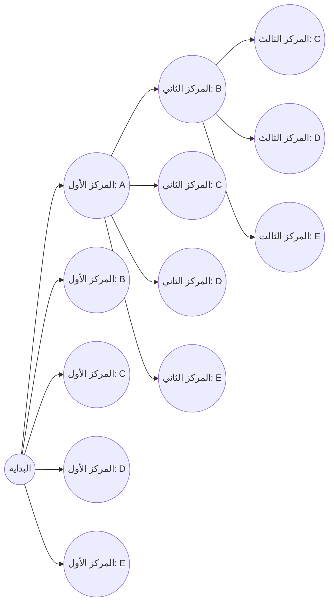
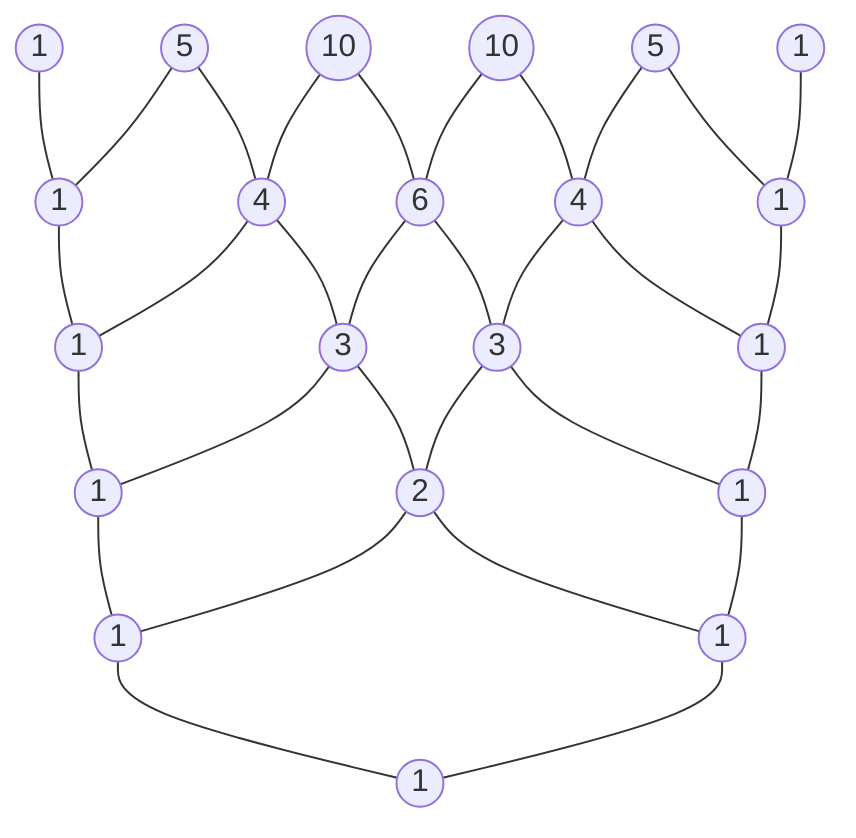

# مقدمة

في عالم الرياضيات، تُعد "التباديل" و"التوافيق" — وهي طرق لعد النتائج الممكنة منطقيًا — مفاهيم أساسية حاسمة في مجموعة واسعة من المجالات، بدءًا من الاحتمالات والإحصاء إلى خوارزميات علوم الكمبيوتر. إن توسيع هذه المفاهيم الأساسية إلى عالم الجبر يقودنا إلى "نظرية ذات الحدين"، ويؤدي تمثيل تسلسل معاملاتها بشكل مرئي وهندسي إلى إنتاج "مثلث باسكال". للوهلة الأولى، قد تبدو هذه موضوعات رياضية مستقلة، ولكن كلما درستها بعمق، تدرك أنها متشابكة بشكل مذهل، وتشكل بنية رياضية واحدة ضخمة وجميلة.

في هذا المقال، سنبدأ بفهم بديهي وطرق الحساب الأساسية للتباديل والتوافيق، ثم نشرح بالتفصيل مفاهيم أكثر تعقيدًا مثل التباديل مع التكرار، والتباديل الدائرية، والتوافيق مع التكرار. ومن هناك، سنستنتج صيغة نظرية ذات الحدين وتناظرها الجميل، وأخيرًا سنتعمق بدقة في موضوعات عميقة مثل الخصائص الغامضة المخفية في مثلث باسكال، وارتباطه بمتتالية فيبوناتشي التي تصف قوانين الطبيعة، والهياكل الكسورية. دعونا ننطلق في رحلة لتقدير "جمال" و"انتظام" الرياضيات بالكامل.

# ما هي التباديل؟

يشير التبديل إلى طريقة اختيار $r$ عنصرًا من $n$ من العناصر المتميزة وترتيبها **بترتيب معين**. النقطة الأكثر أهمية في التباديل هي أنه "إذا كان الترتيب مختلفًا، فإنه يُعامل كترتيب مختلف تمامًا". على سبيل المثال، عند اختيار وترتيب بطاقتين من "A" و "B" و "C"، تُعد "A-B" و "B-A" كتباديل مختلفة.

## صيغة التباديل

يُمثل العدد الإجمالي للتباديل عند اختيار $r$ عنصرًا من $n$ من العناصر المتميزة بالرمز $_n\text{P}_r$ ويُحسب باستخدام الصيغة الرياضية التالية:

$$
_n\text{P}_r = \frac{n!}{(n-r)!}
$$

هنا، يمثل $n!$ مضروب $n$، و $n! = n \times (n-1) \times \dots \times 2 \times 1$. يشير المضروب إلى العدد الإجمالي لطرق إعادة ترتيب جميع العناصر لعدد معين.

## مثال ملموس: تصنيفات سباق الركض وترتيب المقاعد

على سبيل المثال، دعونا نفكر منطقيًا في عدد النتائج الممكنة للمركز الأول إلى الثالث عندما يركض 5 طلاب (A ، B ، C ، D ، E) في سباق.

- الشخص المحتمل للمركز الأول هو أي من الطلاب الخمسة (5 طرق)
- الشخص المحتمل للمركز الثاني هو أي من الطلاب الأربعة المتبقين، باستثناء الفائز بالمركز الأول (4 طرق)
- الشخص المحتمل للمركز الثالث هو أي من الطلاب الثلاثة المتبقين، باستثناء الفائزين بالمركزين الأول والثاني (3 طرق)

نظرًا لأن كل حالة من هذه الحالات تحدث بشكل مستقل ومتتالٍ، فإننا نحسبها على النحو التالي باستخدام قاعدة الضرب:

$$
_5\text{P}_3 = 5 \times 4 \times 3 = 60 \text{ طريقة}
$$

عندما نطبق هذا على الصيغة التي تستخدم المضاريب المذكورة سابقًا، نحصل على $_5\text{P}_3 = \frac{5!}{(5-3)!} = \frac{120}{2} = 60$، مما يؤكد أن حسابنا البديهي يطابق الصيغة الصارمة تمامًا.

# التباديل مع التكرار والتباديل الدائرية

من خلال توسيع مفهوم التباديل قليلاً، يمكننا حل العديد من المشكلات التي نواجهها كثيرًا في الحياة اليومية. هنا، سنشرح "التباديل مع التكرار" و"التباديل الدائرية"، وهي أمثلة تطبيقية نموذجية.

## التباديل مع التكرار

عند اختيار العناصر، يُطلق على التبديل الذي يُسمح لك فيه باختيار نفس العنصر بشكل متكرر أي عدد من المرات اسم **التبديل مع التكرار**.
يتم التعبير عن العدد الإجمالي للتباديل عند أخذ $r$ عنصرًا من $n$ من الأنواع المتميزة مع السماح بالتكرار بصيغة بسيطة جدًا:

$$
n^r
$$

على سبيل المثال، ضع في اعتبارك إعداد رمز PIN مكون من 4 أرقام (باستخدام 10 أنواع من الأرقام من 0 إلى 9). يحتوي كل رقم على 10 خيارات من 0 إلى 9، ويمكنك استخدام نفس الرقم عدة مرات كما تريد. لذلك، فإن العدد الإجمالي لرموز PIN الممكنة لتعيينها هو كما يلي:

$$
10^4 = 10 \times 10 \times 10 \times 10 = 10000 \text{ طريقة}
$$

تعتمد كلمات المرور الرقمية وحساب نتائج رمي عملة معدنية (نوعان) عدة مرات جميعها على هذا المفهوم للتباديل مع التكرار.

## التباديل الدائرية

التبديل الذي يتم فيه ترتيب الأشياء ليس في خط مستقيم ولكن في دائرة يسمى **التبديل الدائري**. تتميز التباديل الدائرية بأن "الترتيبات التي تصبح متطابقة عند تدويرها تُحسب كطريقة واحدة".

يُحسب العدد الإجمالي للتباديل عند ترتيب $n$ من العناصر المتميزة في دائرة بالصيغة التالية:

$$
(n - 1)!
$$

لماذا هو $(n-1)!$؟ هذا لأنه عندما يتم ترتيب $n$ من العناصر في دائرة، يكون هناك $n$ من الطرق للنظر إليها اعتمادًا على العنصر الذي تبدأ في النظر منه. لذلك، بقسمة التبديل العادي المرتب في خط $n!$ على $n$، نستنتج $(n-1)!$.

على سبيل المثال، كم عدد الطرق المتاحة لجلوس 5 أشخاص على طاولة مستديرة؟
$$
(5 - 1)! = 4! = 4 \times 3 \times 2 \times 1 = 24 \text{ طريقة}
$$
من خلال النظر في التناظر الدوراني، ينخفض عدد الحالات بشكل كبير. يُطبق هذا المفهوم أيضًا في مجالات مثل الكيمياء للنظر في التركيب ثلاثي الأبعاد للجزيئات، وفي تحليل الهياكل الحلقية للشبكات.

# ما هي التوافيق؟

بينما تؤكد التباديل على "ترتيب" الترتيب، تركز التوافيق فقط على تكوين المجموعة، أي "العناصر التي تم اختيارها". وبعبارة أخرى، في التوافيق، **لا يتم أخذ الترتيب في الاعتبار**. إذا كان أعضاء العناصر المختارة متماثلين، فسيتم التعامل معهم على أنهم نفس التوفيق الواحد، بغض النظر عن كيفية ترتيبهم.

## صيغة التوافيق

يُمثل العدد الإجمالي للتوافيق عند اختيار $r$ عنصرًا من $n$ من العناصر المتميزة بالرمز $_n\text{C}_r$ أو تدوين المعامل ذي الحدين $\binom{n}{r}$، ويُحسب باستخدام الصيغة الرياضية التالية:

$$
_n\text{C}_r = \binom{n}{r} = \frac{_n\text{P}_r}{r!} = \frac{n!}{r!(n-r)!}
$$

المنطق وراء هذه الصيغة أنيق للغاية. أولاً، نحسب عدد الطرق لاختيار $r$ من العناصر مع مراعاة الترتيب (التبديل $_n\text{P}_r$). ومع ذلك، يمكن ترتيب $r$ من العناصر المختارة بـ $r!$ من الطرق فيما بينها. نظرًا لأن التوافيق تحدد كل هذه على أنها متماثلة، فإننا نقسم العدد الإجمالي على $r!$ لإزالة التكرارات.

## مثال ملموس: تشكيل فريق مشروع

كم عدد الطرق المتاحة لاختيار 3 أعضاء لإطلاق مشروع جديد من بين 8 موظفين ينتمون إلى قسم معين؟
إذا لم يكن هناك تمييز واضح في الأدوار بين الأعضاء، فلن يهم الترتيب الذي يتم اختيارهم به، مما يجعل هذه مشكلة توافيق.

$$
_8\text{C}_3 = \frac{8!}{3!(8-3)!} = \frac{8 \times 7 \times 6}{3 \times 2 \times 1} = 56 \text{ طريقة}
$$

حتى لو كان الأشخاص الثلاثة المختارون هم $\{A, B, C\}$ أو $\{B, C, A\}$، فهم متطابقون تمامًا كفريق مشروع، لذلك يُحسبون كطريقة واحدة. يُعد مفهوم التوافيق أداة لا غنى عنها في تحليل الأحداث التي تنطوي على عدم اليقين، مثل حساب احتمالات الفوز في اليانصيب أو احتمالات أوراق البوكر في البطاقات.

# التوافيق مع التكرار

تمامًا كما أن للتباديل تباديل مع التكرار، فإن للتوافيق أيضًا **توافيق مع التكرار**. يشير هذا إلى عدد الطرق لاختيار $r$ عنصرًا من $n$ من الأنواع المتميزة مع السماح بالتكرار، ويُمثل عمومًا بالرمز $_n\text{H}_r$.

## حساب التوافيق مع التكرار ونموذج "النجوم والأشرطة"

نظرًا لصعوبة حساب التوافيق مع التكرار بشكل مباشر، فإنها تُحول عادةً إلى مشاكل توافيق قياسية لحلها. يُعطى العدد الإجمالي بعد التحويل بالصيغة التالية:

$$
_n\text{H}_r = _{n+r-1}\text{C}_r = \frac{(n+r-1)!}{r!(n-1)!}
$$

نموذج بديهي ممتاز لفهم هذه الصيغة هو نموذج "النجوم والأشرطة" (الدوائر والفواصل).

على سبيل المثال، كم عدد الطرق المتاحة لشراء 5 فواكه من 3 أنواع من الفواكه: التفاح والبرتقال والموز، مع السماح بالتكرار؟ (على افتراض أنه لا بأس إذا لم يتم اختيار بعض الفواكه).
هنا، نختار $r=5$ عناصر من $n=3$ أنواع من الفاكهة.

نستبدل هذا بمشكلة ترتيب 5 "دوائر" و $3-1 = 2$ "فواصل" تُستخدم لفصل الأنواع الثلاثة من الفاكهة في خط.

مثال: `o o | o | o o`
هذا يعني اختيار "تفاحتين وبرتقالة واحدة وموزتين" من اليسار.
مثال: `| o o o | o o`
هذا يعني "0 تفاح، و 3 برتقال، وموزتين".

وبعبارة أخرى، فإنه يساوي توفيق اختيار 5 أماكن لوضع دوائر (أو مكانين لوضع فواصل) من إجمالي $5 + 2 = 7$ أماكن.

$$
_3\text{H}_5 = _{3+5-1}\text{C}_5 = _7\text{C}_5 = _7\text{C}_2 = \frac{7 \times 6}{2 \times 1} = 21 \text{ طريقة}
$$

يوضح نهج "النجوم والأشرطة" هذا قدرة التجريد القوية للرياضيات لتقليل المشكلات التي تبدو معقدة إلى هياكل بصرية وبسيطة.

# نظرية ذات الحدين وتمددها

تُعد معرفة التباديل والتوافيق التي تعلمناها حتى الآن بمثابة إعداد مثالي لفهم "نظرية ذات الحدين"، وهي إحدى النظريات الأساسية في الجبر. نظرية ذات الحدين هي صيغة لتوسيع قوة مجموع حدين، مثل $(x + y)^n$، بشكل مثالي إلى كثير حدود.

## صيغة نظرية ذات الحدين

بالنسبة لأي عدد صحيح موجب $n$، تكون المساواة التالية صحيحة دائمًا:

$$
(x + y)^n = \sum_{k=0}^{n} \binom{n}{k} x^{n-k} y^k
$$

وبدلاً من ذلك، كتابتها في شكل موسع:

$$
(x + y)^n = \binom{n}{0}x^n y^0 + \binom{n}{1}x^{n-1} y^1 + \binom{n}{2}x^{n-2} y^2 + \dots + \binom{n}{n}x^0 y^n
$$

يتطابق معامل كل حد عند توسيعه تمامًا مع التوفيق $\binom{n}{k}$ (أي $_n\text{C}_k$). وبسبب هذا، تسمى هذه المعاملات تحديدًا **معاملات ذات الحدين**.

## إثبات بديهي لنظرية ذات الحدين وعلاقتها بالتوافيق

لماذا تظهر التوافيق، وهي عبارة عن عدد الحالات، في توسيع ذات الحدين؟ دعونا نستكشف السبب البديهي باستخدام توسيع $(x + y)^3$ كمثال.

$$
(x + y)^3 = (x + y)(x + y)(x + y)
$$

يعني فعل توسيع هذا التعبير اختيار إما $x$ أو $y$ من كل من الأقواس الثلاثة $(x+y)$ وفقًا لقانون التوزيع، وضربها، وجمع جميع الأنماط.

- **لإنشاء الحد $x^3$** : يجب اختيار $x$ من جميع الأقواس الثلاثة. عدد طرق الاختيار هذه هو $\binom{3}{0} = 1$ طريقة.
- **لإنشاء الحد $x^2y$** : تحتاج إلى اختيار $x$ من 2 من الأقواس الثلاثة، و $y$ من القوس 1 المتبقي. عدد الطرق لتحديد قوس 1 لاختيار $y$ منه هو $\binom{3}{1} = 3$ طرق.
- **لإنشاء الحد $xy^2$** : تختار $x$ من 1 من الأقواس الثلاثة، و $y$ من القوسين المتبقيين. عدد الطرق لتحديد القوسين لاختيار $y$ منهما هو $\binom{3}{2} = 3$ طرق.
- **لإنشاء الحد $y^3$** : تختار $y$ من جميع الأقواس الثلاثة. عدد الطرق هو $\binom{3}{3} = 1$ طريقة.

لذلك، فإن إضافة كل هذه العناصر معًا ينتج ما يلي:

$$
(x + y)^3 = 1x^3 + 3x^2y + 3xy^2 + 1y^3
$$

بتعميم هذا، فإن الإجابة على السؤال "في ضرب $n$ من الأقواس، ما هو العدد الإجمالي لطرق اختيار $k$ من $y$ (وفي نفس الوقت $n-k$ من $x$)" هو بالضبط $\binom{n}{k}$. تتقاطع صيغ التوسيع الجبري والتوافيقي بشكل جميل هنا.

# مثلث باسكال: الهندسة الجميلة للأرقام

يُسمى ترتيب المعاملات ذات الحدين التي تظهر في صيغة توسيع نظرية ذات الحدين في شكل هرمي من الأعلى إلى الأسفل على النحو التالي $n=0, 1, 2, \dots$ باسم "مثلث باسكال". يتجاوز هذا المثلث البسيط البنية كونه مجرد أداة مساعدة في الحساب، حيث يحمل عددًا لا يحصى من الخصائص الرياضية العميقة والجميلة بداخله.

## قواعد بناء مثلث باسكال

يبدأ مثلث باسكال بوضع $1$ في الرأس العلوي (الصف 0). بالنسبة للصفوف التي تليه، يتم وضع الـ $1$ دائمًا على كلا الطرفين، وتُبنى جميع الأرقام الداخلية وفقًا لقاعدة بسيطة للغاية: "مجموع الرقم الأيسر العلوي والرقم الأيمن العلوي".

الرقم الموجود في الصف $n$ من الأعلى (مع كون الرأس هو الصف 0) والموضع $k$ من اليسار (مع كون الحافة اليسرى هي الموضع 0) يتوافق تمامًا مع المعامل ذي الحدين $\binom{n}{k}$. إن البنية التي يكون فيها مجموع الرقم الأيسر العلوي $\binom{n-1}{k-1}$ والرقم الأيمن العلوي $\binom{n-1}{k}$ مساويًا للرقم الموجود أسفلهما $\binom{n}{k}$ يمثل هندسيًا المعادلة المهمة التالية التي تسمى قاعدة باسكال:

$$
\binom{n}{k} = \binom{n-1}{k-1} + \binom{n-1}{k}
$$

## خصائص مذهلة مخفية في مثلث باسكال

إذا لاحظت مثلث باسكال عن كثب، ستلاحظ أن هناك عددًا لا يحصى من الانتظامات مخفية بالداخل. دعونا نقدم بعضًا منها.

### 1. التناظر المثالي

الأرقام في كل صف متماثلة تمامًا أفقيًا عبر المحور المركزي. يعكس هذا بشكل مباشر الخاصية الأساسية للتوافيق، $\binom{n}{k} = \binom{n}{n-k}$. بالتفكير المنطقي، فإن تحديد $k$ من العناصر لاختيارها من $n$ يعادل تمامًا تحديد "$n-k$ من العناصر غير المختارة" في نفس الوقت، لذلك فهذه نتيجة طبيعية.

### 2. مجموع الصفوف وقوى 2

إذا جمعت أفقيًا جميع الأرقام في أي صف $n$ محدد، فسيكون مجموعها دائمًا $2^n$.

- الصف 0: $1 = 2^0$
- الصف 1: $1 + 1 = 2 = 2^1$
- الصف 2: $1 + 2 + 1 = 4 = 2^2$
- الصف 3: $1 + 3 + 3 + 1 = 8 = 2^3$
- الصف 4: $1 + 4 + 6 + 4 + 1 = 16 = 2^4$

يمكن إثبات ذلك جبريًا بسهولة من المعادلة $(1+1)^n = \sum \binom{n}{k}$، التي تم الحصول عليها عن طريق استبدال $x=1, y=1$ في نظرية ذات الحدين $(x+y)^n = \sum \binom{n}{k} x^{n-k} y^k$. من منظور نظرية المجموعات، يشير هذا إلى أن "عدد جميع المجموعات الفرعية" لمجموعة تحتوي على $n$ من العناصر هو $2^n$.

### 3. الارتباط الخفي بمتتالية فيبوناتشي

حاول إضافة أرقام مثلث باسكال على طول "الخطوط القطرية الضحلة". والمثير للدهشة أن المتتالية $1, 1, 2, 3, 5, 8, 13, 21, \dots$ تظهر.
هذه ليست سوى **متتالية فيبوناتشي**، حيث تجمع الرقمين السابقين لإنشاء الرقم التالي. إن المتتالية الغامضة التي تظهر في كل مكان في الطبيعة، مثل ترتيب بذور عباد الشمس وحلزون قوقعة النوتيلوس، مدمجة بعمق داخل مثلث يقوم ببساطة بترتيب التوافيق. إنه مثال جميل ومؤثر للغاية يوضح كيف ترتبط الرياضيات، وهي نتاج للتفكير المنطقي البشري، بتدابير الطبيعة.

### 4. الهندسة الكسورية: مثلث سيربنسكي

حاول توسيع مثلث باسكال بشكل هائل إلى العشرات أو المئات من الصفوف، ورسم "الأرقام الفردية" في الداخل باللون الأسود، وترك "الأرقام الزوجية" فارغة. بعد ذلك، يظهر بوضوح شكل كسوري متشابه ذاتيًا يُسمى "مثلث سيربنسكي".
يُعد هذا الهيكل، الذي يتكرر فيه نمط المثلث نفسه بشكل لا نهائي سواء قمت بالتكبير أو التصغير على الكل، بمثابة جسر يربط بين نظرية الأعداد والهندسة ونظرية الفوضى.

# التوسع في النظرية متعددة الحدود

كانت نظرية ذات الحدين هي توسيع $(x+y)^n$، ولكن تعميم هذا لتوسيع مجموع ثلاثة حدود أو أكثر، مثل $(x+y+z)^n$ أو $(x_1 + x_2 + \dots + x_m)^n$، هو **النظرية متعددة الحدود**.

تُسمى معاملات كل حد في صيغة التوسيع للنظرية متعددة الحدود بالمعاملات متعددة الحدود، وتُحسب بالصيغة التالية:

$$
\frac{n!}{k_1! k_2! \dots k_m!} \quad (\text{حيث } k_1 + k_2 + \dots + k_m = n)
$$

ليست هذه المعاملات متعددة الحدود مجرد معاملات توسيع جبري، ولكنها تعني "العدد الإجمالي لطرق تقسيم $n$ من العناصر المتميزة إلى مجموعات مكونة من $k_1, k_2, \dots, k_m$ من العناصر على التوالي".
تجسد العملية التي تعمل فيها نظرية ذات الحدين كأساس وتمتد بشكل طبيعي إلى الهياكل التوافيقية ذات الأبعاد الأعلى بشكل جميل مدى القابلية للتوسع والاتساق التي يمتلكها نظام الرياضيات.

# التوزيع ذو الحدين: التطبيق على نظرية الاحتمالات

لقد تعاملنا حتى الآن مع التباديل ونظرية ذات الحدين كرياضيات بحتة، ولكن هذه المفاهيم تُظهر قوة عملية للغاية في "نظرية الاحتمالات" و"الإحصاء" لنمذجة مشاكل العالم الحقيقي. ومن الأمثلة التمثيلية على ذلك **التوزيع ذو الحدين**.

التوزيع ذو الحدين هو توزيع احتمالي يصف احتمالية حدوث $k$ "نجاح" بالضبط عندما تتكرر تجربة مستقلة (تجربة برنولي) لا تُسفر إلا عن "نجاح" أو "فشل" $n$ من المرات.
إذا كان احتمال النجاح في تجربة واحدة هو $p$، واحتمال الفشل هو $q = 1 - p$، فإن احتمال حدوث $k$ نجاح بالضبط، $P(X=k)$، يتم التعبير عنه على النحو التالي:

$$
P(X=k) = \binom{n}{k} p^k q^{n-k}
$$

داخل صيغة كتلة الاحتمال هذه، يظهر المعامل ذو الحدين $\binom{n}{k}$ تمامًا كما هو. هذا لأن هناك $\binom{n}{k}$ من الطرق لاختيار أي $k$ من التجارب ستنجح من أصل $n$ من التجارب.
بدءًا من حساب احتمالات رمي العملات المعدنية وحتى التنبؤ باحتمالية حدوث المنتجات المعيبة في مصنع، وحتى قياس فعالية الأدوية الجديدة في الطب، يدعم التوزيع ذو الحدين أساس جميع تحليلات البيانات في المجتمع الحديث.

# الخاتمة

في هذا المقال، سافرنا عبر منظر طبيعي رياضي شاسع، بدءًا من التباديل والتوافيق، وهي قواعد "عد" بسيطة، لتطبيقها في التباديل مع التكرار والتباديل الدائرية، والتوسع أكثر في نظرية ذات الحدين في الجبر، والوصول إلى الاستكشاف البصري لمثلث باسكال.

من خلال التجريد والتعمق في الفعل البسيط والبدائي المتمثل في "اختيار بعض العناصر من عناصر أخرى متميزة" باستخدام لغة الرياضيات الصارمة، أصبح من الواضح أن هناك عالمًا رياضيًا ثريًا وجميلًا لا يمكن تصوره يمتد إلى الخارج — متضمنًا تناظرًا مثاليًا، وقاعدة قوى العدد 2، ومتتالية فيبوناتشي التي تصف العالم الطبيعي، والهياكل الكسورية اللانهائية.

إن الصيغ والنظريات الرياضية ليست مجرد أدوات غير حية لحل مسائل الامتحانات. إنها الأعمال الفنية الأسمى للبشرية، وتعبر عن النظام الخفي الكامن وراء العالم الذي يحيط بنا والعلاقات الجميلة بشكل ساحق التي نسجتها الأرقام. نأمل أنه من خلال لمس هذا الانتظام الجميل للأرقام الذي أظهرته التباديل والتوافيق ومثلث باسكال، أن تكون قد شعرت بالسحر الحقيقي والعمق الذي يمتلكه تخصص الرياضيات.
