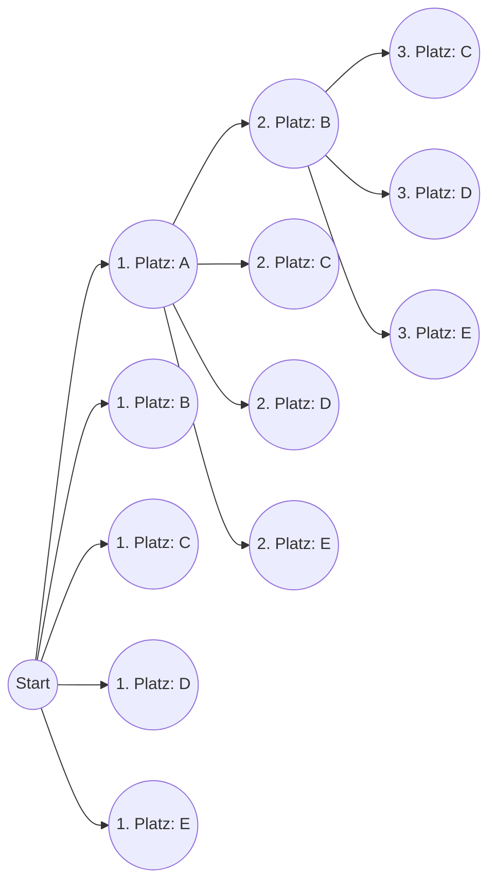
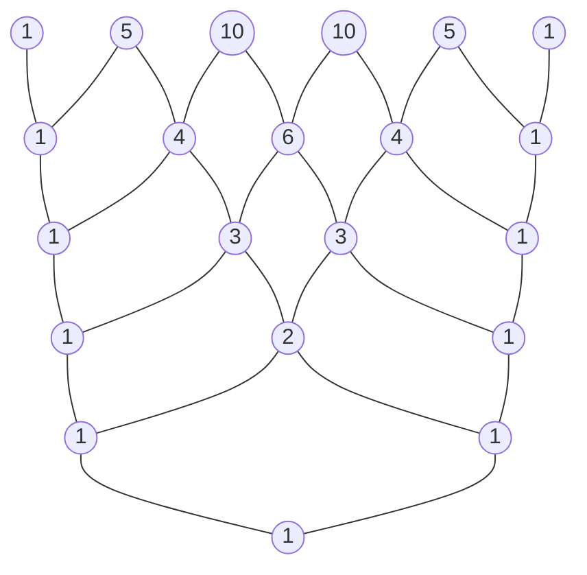

# Einleitung

In der Welt der Mathematik sind "Permutationen" und "Kombinationen" – Methoden zum logischen Zählen der Anzahl möglicher Ergebnisse – entscheidende grundlegende Konzepte in einer Vielzahl von Bereichen, von der Wahrscheinlichkeitstheorie und Statistik bis hin zu Algorithmen der Informatik. Die Ausweitung dieser grundlegenden Konzepte auf den Bereich der Algebra führt uns zum "Binomischen Lehrsatz", und die visuelle und geometrische Darstellung der Abfolge seiner Koeffizienten erzeugt das "Pascalsche Dreieck". Auf den ersten Blick scheinen dies unabhängige mathematische Themen zu sein, aber wenn man sie genauer studiert, erkennt man, dass sie erstaunlich miteinander verflochten sind und eine einzige, massive und wunderschöne mathematische Struktur bilden.

In diesem Artikel beginnen wir mit einem intuitiven Verständnis und den grundlegenden Berechnungsmethoden für Permutationen und Kombinationen und erklären dann im Detail komplexere Konzepte wie Permutationen mit Wiederholung, Zirkularpermutationen und Kombinationen mit Wiederholung. Von dort aus leiten wir die Formel des Binomischen Lehrsatzes und seine wunderschöne Symmetrie ab und befassen uns schließlich ausführlich mit tiefgründigen Themen wie den mysteriösen Eigenschaften, die im Pascalschen Dreieck verborgen sind, seiner Verbindung zur [Fibonacci](https://kenji.blog/de/p/fibonacci/)-Folge, die die Gesetze der Natur beschreibt, und fraktalen Strukturen. Begeben wir uns auf eine Reise, um die "Schönheit" und "Regelmäßigkeit" der Mathematik voll und ganz zu schätzen.

# Was sind Permutationen?

Eine Permutation bezieht sich auf die Methode, $r$ Elemente aus $n$ verschiedenen Elementen auszuwählen und sie **in einer bestimmten Reihenfolge** anzuordnen. Der wichtigste Punkt bei Permutationen ist, dass "eine unterschiedliche Reihenfolge als völlig unterschiedliche Anordnung behandelt wird". Wenn Sie beispielsweise zwei Karten aus "A", "B" und "C" auswählen und anordnen, werden "A-B" und "B-A" als unterschiedliche Permutationen gezählt.

## Permutationsformel

Die Gesamtzahl der Permutationen bei der Auswahl von $r$ Elementen aus $n$ verschiedenen Elementen wird durch das Symbol $_n\text{P}_r$ dargestellt und mit der folgenden mathematischen Formel berechnet:

$$
_n\text{P}_r = \frac{n!}{(n-r)!}
$$

Hierbei steht $n!$ für die Fakultät von $n$, und $n! = n \times (n-1) \times \dots \times 2 \times 1$. Die Fakultät gibt die Gesamtzahl der Möglichkeiten an, alle Elemente einer gegebenen Zahl umzuordnen.

## Konkretes Beispiel: Platzierungen beim Wettlauf und Sitzordnungen

Überlegen wir uns beispielsweise einmal logisch, wie viele mögliche Ergebnisse es für den 1. bis 3. Platz gibt, wenn 5 Schüler (A, B, C, D, E) einen Wettlauf veranstalten.

- Die mögliche Person für den 1. Platz ist jeder der 5 Schüler (5 Möglichkeiten)
- Die mögliche Person für den 2. Platz ist jeder der verbleibenden 4 Schüler, mit Ausnahme des Erstplatzierten (4 Möglichkeiten)
- Die mögliche Person für den 3. Platz ist jeder der verbleibenden 3 Schüler, mit Ausnahme des Erst- und Zweitplatzierten (3 Möglichkeiten)

Da jeder dieser Fälle unabhängig und aufeinanderfolgend eintritt, berechnen wir dies mithilfe der Produktregel wie folgt:

$$
_5\text{P}_3 = 5 \times 4 \times 3 = 60 \text{ Möglichkeiten}
$$

Wenn wir dies auf die zuvor erwähnte Formel mit Fakultäten anwenden, erhalten wir $_5\text{P}_3 = \frac{5!}{(5-3)!} = \frac{120}{2} = 60$, was bestätigt, dass unsere intuitive Berechnung vollständig mit der strengen Formel übereinstimmt.

# Permutationen mit Wiederholung und Zirkularpermutationen

Indem wir das Konzept der Permutationen leicht erweitern, können wir verschiedene Probleme lösen, denen wir im täglichen Leben häufig begegnen. Hier erklären wir "Permutationen mit Wiederholung" und "Zirkularpermutationen", die typische Anwendungsbeispiele sind.

## Permutationen mit Wiederholung

Bei der Auswahl von Elementen wird eine Permutation, bei der Sie dasselbe Element beliebig oft wiederholt auswählen dürfen, als **Permutation mit Wiederholung** bezeichnet.
Die Gesamtzahl der Permutationen bei der Entnahme von $r$ Elementen aus $n$ verschiedenen Arten unter Zulassung von Wiederholungen wird durch eine sehr einfache Formel ausgedrückt:

$$
n^r
$$

Denken Sie beispielsweise an die Festlegung einer 4-stelligen PIN (unter Verwendung von 10 Ziffernarten von 0 bis 9). Jede Ziffer hat 10 Optionen von 0 bis 9, und Sie können dieselbe Ziffer beliebig oft verwenden. Daher ergibt sich folgende Gesamtzahl möglicher PINs:

$$
10^4 = 10 \times 10 \times 10 \times 10 = 10000 \text{ Möglichkeiten}
$$

Digitale Passwörter und das Zählen der Ergebnisse von mehrfachem Münzwurf (2 Arten, Kopf oder Zahl) basieren alle auf diesem Konzept der Permutationen mit Wiederholung.

## Zirkularpermutationen

Eine Permutation, bei der die Dinge nicht in einer geraden Linie, sondern in einem Kreis angeordnet sind, wird als **Zirkularpermutation** bezeichnet. Das Merkmal einer Zirkularpermutation ist, dass "Anordnungen, die durch Drehung gleich werden, als 1 Möglichkeit gezählt werden".

Die Gesamtzahl der Permutationen bei der Anordnung von $n$ verschiedenen Elementen in einem Kreis wird durch die folgende Formel berechnet:

$$
(n - 1)!
$$

Warum ist es $(n-1)!$? Das liegt daran, dass es bei der kreisförmigen Anordnung von $n$ Elementen $n$ Sichtweisen gibt, je nachdem, bei welchem Element Sie mit der Betrachtung beginnen. Wenn wir also die normale Permutation in einer Reihe, $n!$, durch $n$ teilen, leiten wir $(n-1)!$ ab.

Wie viele Möglichkeiten gibt es beispielsweise für 5 Personen, sich an einen runden Tisch zu setzen?
$$
(5 - 1)! = 4! = 4 \times 3 \times 2 \times 1 = 24 \text{ Möglichkeiten}
$$
Durch die Berücksichtigung der Rotationssymmetrie nimmt die Anzahl der Fälle drastisch ab. Dieses Konzept wird auch in Bereichen wie der Chemie zur Betrachtung der dreidimensionalen Struktur von Molekülen und bei der Analyse von Ringtopologien von Netzwerken angewendet.

# Was sind Kombinationen?

Während bei Permutationen die "Reihenfolge" der Anordnung im Vordergrund steht, konzentrieren sich Kombinationen nur auf die Zusammensetzung der Menge, d. h. "welche Elemente wurden ausgewählt". Mit anderen Worten: Bei Kombinationen **wird die Reihenfolge nicht berücksichtigt**. Wenn die Mitglieder der ausgewählten Elemente gleich sind, werden sie als dieselbe einzige Kombination behandelt, unabhängig davon, wie sie angeordnet sind.

## Kombinationsformel

Die Gesamtzahl der Kombinationen bei der Auswahl von $r$ Elementen aus $n$ verschiedenen Elementen wird durch das Symbol $_n\text{C}_r$ oder die Binomialkoeffizientenschreibweise $\binom{n}{r}$ dargestellt und mit der folgenden mathematischen Formel berechnet:

$$
_n\text{C}_r = \binom{n}{r} = \frac{_n\text{P}_r}{r!} = \frac{n!}{r!(n-r)!}
$$

Die Logik hinter dieser Formel ist sehr elegant. Zunächst berechnen wir die Anzahl der Möglichkeiten, $r$ Elemente unter Berücksichtigung der Reihenfolge auszuwählen (Permutation $_n\text{P}_r$). Die ausgewählten $r$ Elemente können jedoch auf $r!$ Arten untereinander angeordnet werden. Da Kombinationen diese alle als gleich identifizieren, teilen wir die Gesamtzahl durch $r!$, um Duplikate zu eliminieren.

## Konkretes Beispiel: Bildung eines Projektteams

Wie viele Möglichkeiten gibt es, 3 Mitglieder für den Start eines neuen Projekts aus 8 Mitarbeitern einer bestimmten Abteilung auszuwählen?
Wenn es keine klare Rollenverteilung unter den Mitgliedern gibt, spielt die Reihenfolge der Auswahl keine Rolle, was dies zu einem Kombinationsproblem macht.

$$
_8\text{C}_3 = \frac{8!}{3!(8-3)!} = \frac{8 \times 7 \times 6}{3 \times 2 \times 1} = 56 \text{ Möglichkeiten}
$$

Selbst wenn die 3 ausgewählten Personen $\{A, B, C\}$ oder $\{B, C, A\}$ sind, sind sie als Projektteam völlig identisch und werden daher als 1 Möglichkeit gezählt. Das Konzept der Kombinationen ist ein unverzichtbares Werkzeug bei der Analyse von Ereignissen mit Unsicherheit, wie z. B. der Berechnung von Lotto-Gewinnwahrscheinlichkeiten oder den Wahrscheinlichkeiten von Pokerblättern bei Kartenspielen.

# Kombinationen mit Wiederholung

So wie es bei Permutationen Permutationen mit Wiederholung gibt, gibt es auch bei Kombinationen **Kombinationen mit Wiederholung**. Dies bezieht sich auf die Anzahl der Möglichkeiten, $r$ Elemente aus $n$ verschiedenen Arten unter Zulassung von Wiederholungen auszuwählen, und wird im Allgemeinen durch das Symbol $_n\text{H}_r$ dargestellt.

## Berechnung von Kombinationen mit Wiederholung und das "Sterne und Striche"-Modell

Da Kombinationen mit Wiederholung schwer direkt zu berechnen sind, werden sie zur Lösung normalerweise in Standard-Kombinationsprobleme umgewandelt. Die Gesamtzahl nach der Umwandlung ergibt sich aus der folgenden Formel:

$$
_n\text{H}_r = _{n+r-1}\text{C}_r = \frac{(n+r-1)!}{r!(n-1)!}
$$

Ein hervorragend intuitives Modell zum Verständnis dieser Formel ist das "Sterne und Striche"-Modell (Kreise und Trennstriche).

Wie viele Möglichkeiten gibt es beispielsweise, 5 Früchte aus 3 Fruchtarten (Äpfel, Orangen und Bananen) zu kaufen, wenn Wiederholungen zulässig sind? (Unter der Annahme, dass es in Ordnung ist, wenn einige Fruchtarten nicht ausgewählt werden).
Hier wählen wir $r=5$ Elemente aus $n=3$ Fruchtarten aus.

Wir ersetzen dies durch das Problem, 5 "Kreise" und $3-1 = 2$ "Trennstriche", mit denen die 3 Fruchtarten getrennt werden, in einer Reihe anzuordnen.

Beispiel: `o o | o | o o`
Dies bedeutet, "2 Äpfel, 1 Orange und 2 Bananen" von links auszuwählen.
Beispiel: `| o o o | o o`
Dies bedeutet "0 Äpfel, 3 Orangen und 2 Bananen".

Mit anderen Worten, es entspricht der Kombination, 5 Plätze für Kreise (oder 2 Plätze für Trennstriche) aus insgesamt $5 + 2 = 7$ Plätzen auszuwählen.

$$
_3\text{H}_5 = _{3+5-1}\text{C}_5 = _7\text{C}_5 = _7\text{C}_2 = \frac{7 \times 6}{2 \times 1} = 21 \text{ Möglichkeiten}
$$

Dieser "Sterne und Striche"-Ansatz demonstriert die starke Abstraktionsfähigkeit der Mathematik, um scheinbar komplexe Probleme auf visuelle und einfache Strukturen zu reduzieren.

# Der Binomische Lehrsatz und seine Entwicklung

Das Wissen über Permutationen und Kombinationen, das wir bisher erlernt haben, dient als perfekte Vorbereitung für das Verständnis des "Binomischen Lehrsatzes", eines der grundlegenden Sätze der Algebra. Der Binomische Lehrsatz ist eine Formel zur vollständigen Entwicklung der Potenz einer Summe zweier Terme, wie $(x + y)^n$, zu einem Polynom.

## Formel des Binomischen Lehrsatzes

Für jede positive ganze Zahl $n$ gilt immer die folgende Gleichheit:

$$
(x + y)^n = \sum_{k=0}^{n} \binom{n}{k} x^{n-k} y^k
$$

Oder in entwickelter Form geschrieben:

$$
(x + y)^n = \binom{n}{0}x^n y^0 + \binom{n}{1}x^{n-1} y^1 + \binom{n}{2}x^{n-2} y^2 + \dots + \binom{n}{n}x^0 y^n
$$

Der Koeffizient jedes Terms bei der Entwicklung stimmt perfekt mit der Kombination $\binom{n}{k}$ (d. h. $_n\text{C}_k$) überein. Aus diesem Grund werden diese Koeffizienten speziell als **Binomialkoeffizienten** bezeichnet.

## Intuitiver Beweis des Binomischen Lehrsatzes und Zusammenhang mit Kombinationen

Warum tauchen Kombinationen, die ja Fallzählungen sind, bei der Entwicklung von Binomen auf? Lassen Sie uns den intuitiven Grund am Beispiel der Entwicklung von $(x + y)^3$ untersuchen.

$$
(x + y)^3 = (x + y)(x + y)(x + y)
$$

Das Entwickeln dieses Ausdrucks bedeutet, dass gemäß dem Distributivgesetz aus jeder der 3 Klammern $(x+y)$ entweder $x$ oder $y$ ausgewählt, multipliziert und alle Muster addiert werden.

- **Um den Term $x^3$ zu bilden**: Müssen Sie $x$ aus allen 3 Klammern auswählen. Die Anzahl solcher Auswahlmöglichkeiten beträgt $\binom{3}{0} = 1$ Möglichkeit.
- **Um den Term $x^2y$ zu bilden**: Müssen Sie $x$ aus 2 der 3 Klammern und $y$ aus der verbleibenden 1 auswählen. Die Anzahl der Möglichkeiten zu entscheiden, aus welcher 1 Klammer $y$ ausgewählt wird, beträgt $\binom{3}{1} = 3$ Möglichkeiten.
- **Um den Term $xy^2$ zu bilden**: Wählen Sie $x$ aus 1 der 3 Klammern und $y$ aus den verbleibenden 2 aus. Die Anzahl der Möglichkeiten, die 2 Klammern zu bestimmen, aus denen $y$ ausgewählt wird, beträgt $\binom{3}{2} = 3$ Möglichkeiten.
- **Um den Term $y^3$ zu bilden**: Wählen Sie $y$ aus allen 3 Klammern aus. Die Anzahl der Möglichkeiten beträgt $\binom{3}{3} = 1$ Möglichkeit.

Addiert man all dies, ergibt sich folgendes:

$$
(x + y)^3 = 1x^3 + 3x^2y + 3xy^2 + 1y^3
$$

Verallgemeinert lautet die Antwort auf die Frage "Wie groß ist bei der Multiplikation von $n$ Klammern die Gesamtzahl der Möglichkeiten, $k$-mal $y$ (und gleichzeitig $n-k$-mal $x$) auszuwählen?" genau $\binom{n}{k}$. Algebraische Entwicklungsformeln und Kombinatorik überschneiden sich hier auf wunderbare Weise.

# Das Pascalsche Dreieck: Die wunderschöne Geometrie der Zahlen

Die Anordnung der Binomialkoeffizienten, die in der Entwicklungsformel des Binomischen Lehrsatzes vorkommen, in Form einer Pyramide von oben nach unten als $n=0, 1, 2, \dots$ wird als "Pascalsches Dreieck" bezeichnet. Dieses einfach strukturierte Dreieck geht weit über ein bloßes Rechenhilfsmittel hinaus und birgt unzählige wunderschöne und tiefe mathematische Eigenschaften.

## Konstruktionsregeln des Pascalschen Dreiecks

Das Pascalsche Dreieck beginnt damit, eine $1$ an die oberste Spitze (Zeile 0) zu setzen. In den folgenden Zeilen werden an beiden Enden immer Einsen platziert, und alle inneren Zahlen werden nach einer extrem einfachen Regel konstruiert: "die Summe der Zahl oben links und der Zahl oben rechts".

Die Zahl, die sich in der $n$-ten Zeile von oben (wobei die Spitze die 0-te Zeile ist) und der $k$-ten Position von links (wobei der linke Rand die 0-te Position ist) befindet, entspricht genau dem Binomialkoeffizienten $\binom{n}{k}$. Die Struktur, bei der die Addition der Zahl oben links $\binom{n-1}{k-1}$ und der Zahl oben rechts $\binom{n-1}{k}$ die Zahl darunter $\binom{n}{k}$ ergibt, stellt geometrisch die folgende wichtige Gleichung dar, die als Pascalsche Regel bezeichnet wird:

$$
\binom{n}{k} = \binom{n-1}{k-1} + \binom{n-1}{k}
$$

## Erstaunliche Eigenschaften, die im Pascalschen Dreieck verborgen sind

Wenn Sie das Pascalsche Dreieck genau betrachten, werden Sie feststellen, dass sich darin unzählige Regelmäßigkeiten verbergen. Stellen wir einige davon vor.

### 1. Perfekte Symmetrie

Die Zahlen in jeder Zeile sind horizontal über die Mittelachse perfekt symmetrisch. Dies spiegelt direkt die grundlegende Eigenschaft von Kombinationen wider, $\binom{n}{k} = \binom{n}{n-k}$. Logisch gedacht ist die Entscheidung, welche $k$ Elemente aus $n$ ausgewählt werden sollen, völlig gleichbedeutend mit der gleichzeitigen Entscheidung über die "nicht ausgewählten $n-k$ Elemente", so dass dies ein natürliches Ergebnis ist.

### 2. Summe der Zeilen und Zweierpotenzen

Wenn Sie alle Zahlen in einer beliebigen $n$-ten Zeile horizontal addieren, ergibt die Gesamtsumme immer $2^n$.

- Zeile 0: $1 = 2^0$
- Zeile 1: $1 + 1 = 2 = 2^1$
- Zeile 2: $1 + 2 + 1 = 4 = 2^2$
- Zeile 3: $1 + 3 + 3 + 1 = 8 = 2^3$
- Zeile 4: $1 + 4 + 6 + 4 + 1 = 16 = 2^4$

Dies lässt sich algebraisch leicht aus der Gleichung $(1+1)^n = \sum \binom{n}{k}$ beweisen, die man durch Einsetzen von $x=1, y=1$ in den Binomischen Lehrsatz $(x+y)^n = \sum \binom{n}{k} x^{n-k} y^k$ erhält. Aus der Perspektive der Mengenlehre zeigt es, dass die "Anzahl aller Teilmengen" einer Menge mit $n$ Elementen $2^n$ beträgt.

### 3. Die verborgene Verbindung zur [Fibonacci](https://kenji.blog/de/p/fibonacci/)-Folge

Versuchen Sie einmal, die Zahlen des Pascalschen Dreiecks entlang der "flachen diagonalen Linien" zu addieren. Erstaunlicherweise erscheint die Folge $1, 1, 2, 3, 5, 8, 13, 21, \dots$.
Dies ist keine andere als die **[Fibonacci](https://kenji.blog/de/p/fibonacci/)-Folge**, bei der Sie die beiden vorherigen Zahlen addieren, um die nächste zu bilden. Die mystische Folge, die überall in der Natur vorkommt, wie z. B. bei der Anordnung von Sonnenblumenkernen und der Spirale eines Nautilusgehäuses, ist tief in einem Dreieck eingebettet, das lediglich Kombinationen anordnet. Es ist ein sehr schönes und bewegendes Beispiel dafür, wie die Mathematik, ein Produkt des menschlichen logischen Denkens, mit den Gesetzmäßigkeiten der Natur verbunden ist.

### 4. Fraktale Geometrie: Sierpinski-Dreieck

Versuchen Sie, das Pascalsche Dreieck enorm auf Dutzende oder Hunderte von Zeilen zu erweitern, wobei Sie die "ungeraden Zahlen" im Inneren schwarz anmalen und die "geraden Zahlen" leer lassen. Dann kommt eine selbstähnliche fraktale Figur namens "Sierpinski-Dreieck" deutlich zum Vorschein.
Diese Struktur, bei der sich dasselbe Dreiecksmuster unendlich wiederholt, unabhängig davon, ob man in das Ganze hinein- oder herauszoomt, dient als Brücke, die Zahlentheorie, Geometrie und Chaostheorie verbindet.

# Erweiterung zum Multinomialen Lehrsatz

Der Binomische Lehrsatz war die Entwicklung von $(x+y)^n$, aber dessen Verallgemeinerung auf die Entwicklung der Summe von drei oder mehr Termen, wie $(x+y+z)^n$ oder $(x_1 + x_2 + \dots + x_m)^n$, ist der **Multinomiale Lehrsatz**.

Die Koeffizienten jedes Terms in der Entwicklungsformel des Multinomialen Lehrsatzes werden als Multinomialkoeffizienten bezeichnet, die mit der folgenden Formel berechnet werden:

$$
\frac{n!}{k_1! k_2! \dots k_m!} \quad (\text{wobei } k_1 + k_2 + \dots + k_m = n)
$$

Diese Multinomialkoeffizienten sind nicht nur algebraische Entwicklungskoeffizienten, sondern bedeuten "die Gesamtzahl der Möglichkeiten, $n$ verschiedene Elemente in Gruppen von $k_1, k_2, \dots, k_m$ Elementen aufzuteilen".
Der Prozess, bei dem der Binomische Lehrsatz als Grundlage dient und sich natürlich auf höherdimensionale kombinatorische Strukturen ausdehnt, verkörpert auf wunderbare Weise die Erweiterbarkeit und Konsistenz, die das System der Mathematik besitzt.

# Binomialverteilung: Anwendung in der Wahrscheinlichkeitstheorie

Bis hierhin haben wir Permutationen und den Binomischen Lehrsatz als reine Mathematik behandelt, aber diese Konzepte weisen in der "Wahrscheinlichkeitstheorie" und "Statistik" zur Modellierung realer Probleme eine äußerst praktische Kraft auf. Ein repräsentatives Beispiel ist die **Binomialverteilung**.

Die Binomialverteilung ist eine Wahrscheinlichkeitsverteilung, die die Wahrscheinlichkeit beschreibt, dass genau $k$ "Erfolge" eintreten, wenn ein unabhängiger Versuch (Bernoulli-Versuch), der nur "Erfolg" oder "Misserfolg" ergibt, $n$-mal wiederholt wird.
Wenn die Erfolgswahrscheinlichkeit in einem einzigen Versuch $p$ und die Misserfolgswahrscheinlichkeit $q = 1 - p$ ist, dann wird die Wahrscheinlichkeit von genau $k$ Erfolgen, $P(X=k)$, wie folgt ausgedrückt:

$$
P(X=k) = \binom{n}{k} p^k q^{n-k}
$$

Innerhalb dieser Wahrscheinlichkeitsmassenformel erscheint der Binomialkoeffizient $\binom{n}{k}$ genau so, wie er ist. Dies liegt daran, dass es $\binom{n}{k}$ Möglichkeiten gibt, aus $n$ Versuchen auszuwählen, welche $k$ Versuche erfolgreich sein werden.
Von der Berechnung der Münzwurfwahrscheinlichkeit über die Vorhersage der Auftrittswahrscheinlichkeit von fehlerhaften Produkten in einer Fabrik bis hin zur Messung der Wirksamkeit neuer Medikamente in der Medizin – die Binomialverteilung stützt die Grundlage der gesamten Datenanalyse in der modernen Gesellschaft.

# Fazit

In diesem Artikel sind wir durch eine weite mathematische Landschaft gereist, beginnend bei den Permutationen und Kombinationen, bei denen es sich um einfache "Zähl"-Regeln handelt, über ihre Anwendung in Permutationen mit Wiederholung und Zirkularpermutationen, weiter ausgedehnt auf den Binomischen Lehrsatz der Algebra bis hin zur visuellen Erforschung des Pascalschen Dreiecks.

Indem wir den extrem einfachen und primitiven Akt des "Auswählens einiger Elemente aus verschiedenen anderen" mit der rigorosen Sprache der Mathematik abstrahiert und vertieft haben, wurde deutlich, dass sich eine unvorstellbar reiche und wunderschöne mathematische Welt nach außen hin ausdehnt – mit perfekten Symmetrien, der Regel der Zweierpotenzen, der [Fibonacci](https://kenji.blog/de/p/fibonacci/)-Folge zur Beschreibung der natürlichen Welt und unendlichen fraktalen Strukturen.

Mathematische Formeln und Sätze sind nicht nur anorganische Werkzeuge zur Lösung von Prüfungsaufgaben. Sie sind die höchsten Kunstwerke der Menschheit, die die unsichtbare Ordnung hinter der Welt, die uns umgibt, und die überwältigend schönen Beziehungen, die von Zahlen gewebt werden, zum Ausdruck bringen. Wir hoffen, dass Sie durch die Berührung mit dieser wunderschönen Regelmäßigkeit der Zahlen, die durch Permutationen, Kombinationen und das Pascalsche Dreieck gezeigt wird, den wahren Reiz und die Tiefgründigkeit der Disziplin Mathematik gespürt haben.
