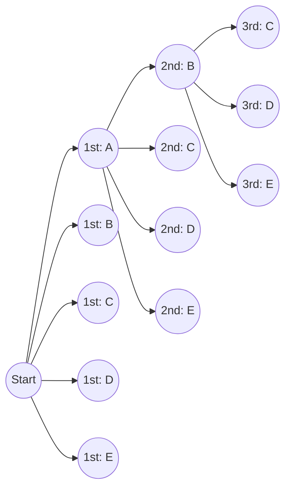
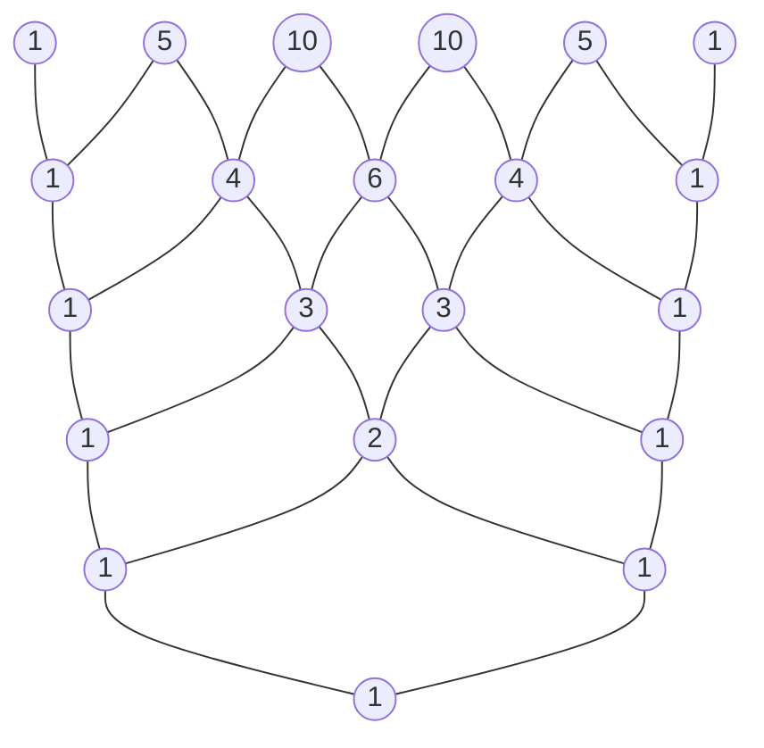

# Introduction

In the world of mathematics, "permutations" and "combinations"—methods for logically counting the number of possible outcomes—are crucial foundational concepts across a wide range of fields, from probability and statistics to computer science algorithms. Extending these fundamental concepts into the realm of algebra leads us to the "Binomial Theorem," and visually and geometrically representing the sequence of its coefficients produces "Pascal's Triangle." At first glance, these may seem like independent mathematical topics, but as you study them deeply, you realize that they are astonishingly intertwined, forming a single, massive, and beautiful mathematical structure.

In this article, we will start with an intuitive understanding and the basic calculation methods for permutations and combinations, and then explain in detail more complex concepts like permutations with repetition, circular permutations, and combinations with repetition. From there, we will derive the formula of the Binomial Theorem and its beautiful symmetry, and ultimately delve thoroughly into profound themes such as the mysterious properties hidden in Pascal's Triangle, its connection to the Fibonacci sequence describing the laws of nature, and fractal structures. Let us embark on a journey to fully appreciate the "beauty" and "regularity" of mathematics.

# What are Permutations?

A permutation refers to the method of choosing $r$ elements from $n$ distinct elements and arranging them **with a specific order**. The most important point in permutations is that "if the order is different, it is treated as a completely different arrangement." For example, when choosing and arranging two cards from "A," "B," and "C," "A-B" and "B-A" are counted as different permutations.

## Permutation Formula

The total number of permutations when choosing $r$ elements from $n$ distinct elements is represented by the symbol $_n\text{P}_r$ and calculated using the following mathematical formula:

$$
_n\text{P}_r = \frac{n!}{(n-r)!}
$$

Here, $n!$ represents the factorial of $n$, and $n! = n \times (n-1) \times \dots \times 2 \times 1$. The factorial indicates the total number of ways to rearrange all elements of a given number.

## Concrete Example: Footrace Rankings and Seat Arrangements

For instance, let's logically consider how many possible outcomes there are for 1st to 3rd place when 5 students (A, B, C, D, E) run a footrace.

- The potential person for 1st place is any of the 5 students (5 ways)
- The potential person for 2nd place is any of the remaining 4 students, excluding the 1st place finisher (4 ways)
- The potential person for 3rd place is any of the remaining 3 students, excluding the 1st and 2nd place finishers (3 ways)

Since each of these cases happens independently and consecutively, we calculate it as follows using the rule of product:

$$
_5\text{P}_3 = 5 \times 4 \times 3 = 60 \text{ ways}
$$

When we apply this to the formula using factorials mentioned earlier, we get $_5\text{P}_3 = \frac{5!}{(5-3)!} = \frac{120}{2} = 60$, confirming that our intuitive calculation completely matches the strict formula.

# Permutations with Repetition and Circular Permutations

By slightly extending the concept of permutations, we can solve various problems frequently encountered in daily life. Here, we will explain "permutations with repetition" and "circular permutations," which are typical application examples.

## Permutations with Repetition

When choosing elements, a permutation where you are allowed to choose the same element repeatedly any number of times is called a **permutation with repetition**.
The total number of permutations when taking $r$ elements from $n$ distinct types allowing repetition is expressed by a very simple formula:

$$
n^r
$$

For example, consider setting a 4-digit PIN (using 10 types of numbers from 0 to 9). Each digit has 10 options from 0 to 9, and you can use the same number as many times as you like. Therefore, the total number of possible PINs to set is as follows:

$$
10^4 = 10 \times 10 \times 10 \times 10 = 10000 \text{ ways}
$$

Digital passwords and counting the results of tossing a coin's heads or tails (2 types) multiple times are all based on this concept of permutations with repetition.

## Circular Permutations

A permutation where things are arranged not in a straight line but in a circle is called a **circular permutation**. The characteristic of a circular permutation is that "arrangements that become the same when rotated are counted as 1 way."

The total number of permutations when arranging $n$ distinct items in a circle is calculated by the following formula:

$$
(n - 1)!
$$

Why is it $(n-1)!$? This is because when $n$ elements are arranged in a circle, there are $n$ ways to look at it depending on which element you start viewing from. Therefore, by dividing the normal permutation arranged in a line $n!$ by $n$, we derive $(n-1)!$.

For example, how many ways are there for 5 people to sit at a round table?
$$
(5 - 1)! = 4! = 4 \times 3 \times 2 \times 1 = 24 \text{ ways}
$$
By considering rotational symmetry, the number of cases drastically decreases. This concept is also applied in fields like chemistry to consider the three-dimensional structure of molecules, and in analyzing ring topologies of networks.

# What are Combinations?

While permutations emphasize the "order" of arrangement, combinations focus only on the composition of the set, i.e., "which elements were chosen." In other words, in combinations, **order is not considered**. If the members of the chosen elements are the same, they are treated as the same single combination, regardless of how they are arranged.

## Combination Formula

The total number of combinations when choosing $r$ elements from $n$ distinct elements is represented by the symbol $_n\text{C}_r$ or the binomial coefficient notation $\binom{n}{r}$, and calculated using the following mathematical formula:

$$
_n\text{C}_r = \binom{n}{r} = \frac{_n\text{P}_r}{r!} = \frac{n!}{r!(n-r)!}
$$

The logic behind this formula is very elegant. First, we calculate the number of ways to choose $r$ elements considering order (permutation $_n\text{P}_r$). However, the chosen $r$ elements can be arranged in $r!$ ways among themselves. Because combinations identify all these as the same, we divide the total number by $r!$ to eliminate duplicates.

## Concrete Example: Forming a Project Team

How many ways are there to choose 3 members to launch a new project from 8 employees belonging to a certain department?
If there is no clear distinction in roles within the members, the order in which they are chosen does not matter, making this a combination problem.

$$
_8\text{C}_3 = \frac{8!}{3!(8-3)!} = \frac{8 \times 7 \times 6}{3 \times 2 \times 1} = 56 \text{ ways}
$$

Even if the chosen 3 people are $\{A, B, C\}$ or $\{B, C, A\}$, they are completely identical as a project team, so they are counted as 1 way. The concept of combinations is an indispensable tool in analyzing events involving uncertainty, such as calculating lottery winning probabilities or the probabilities of poker hands in cards.

# Combinations with Repetition

Just as permutations have permutations with repetition, combinations also have **combinations with repetition**. This refers to the number of ways to choose $r$ items from $n$ distinct types allowing repetition, and is generally represented by the symbol $_n\text{H}_r$.

## Calculating Combinations with Repetition and the "Stars and Bars" Model

Because combinations with repetition are difficult to calculate directly, they are usually converted into standard combination problems to solve. The total number after conversion is given by the following formula:

$$
_n\text{H}_r = _{n+r-1}\text{C}_r = \frac{(n+r-1)!}{r!(n-1)!}
$$

An excellently intuitive model for understanding this formula is the "stars and bars" (circles and dividers) model.

For example, how many ways are there to buy 5 fruits from 3 types of fruits: apples, oranges, and bananas, allowing repetition? (Assuming it is okay if some fruits are not chosen).
Here, we choose $r=5$ items from $n=3$ types of fruit.

We replace this with the problem of arranging 5 "circles" and $3-1 = 2$ "dividers" used to separate the 3 types of fruit in a line.

Example: `o o | o | o o`
This means choosing "2 apples, 1 orange, and 2 bananas" from the left.
Example: `| o o o | o o`
This means "0 apples, 3 oranges, and 2 bananas".

In other words, it is equal to the combination of choosing 5 places to put circles (or 2 places to put dividers) out of a total of $5 + 2 = 7$ places.

$$
_3\text{H}_5 = _{3+5-1}\text{C}_5 = _7\text{C}_5 = _7\text{C}_2 = \frac{7 \times 6}{2 \times 1} = 21 \text{ ways}
$$

This "stars and bars" approach demonstrates the powerful abstraction capability of mathematics to reduce seemingly complex problems into visual and simple structures.

# The Binomial Theorem and its Expansion

The knowledge of permutations and combinations we have learned so far serves as perfect preparation for understanding the "Binomial Theorem," one of the fundamental theorems of algebra. The Binomial Theorem is a formula for perfectly expanding the power of a sum of two terms, like $(x + y)^n$, into a polynomial.

## Binomial Theorem Formula

For any positive integer $n$, the following equality always holds:

$$
(x + y)^n = \sum_{k=0}^{n} \binom{n}{k} x^{n-k} y^k
$$

Alternatively, writing it in expanded form:

$$
(x + y)^n = \binom{n}{0}x^n y^0 + \binom{n}{1}x^{n-1} y^1 + \binom{n}{2}x^{n-2} y^2 + \dots + \binom{n}{n}x^0 y^n
$$

The coefficient of each term when expanded perfectly matches the combination $\binom{n}{k}$ (i.e., $_n\text{C}_k$). Because of this, these coefficients are specifically called **binomial coefficients**.

## Intuitive Proof of the Binomial Theorem and Relation to Combinations

Why do combinations, which are counts of cases, appear in the expansion of binomials? Let's explore the intuitive reason using the expansion of $(x + y)^3$ as an example.

$$
(x + y)^3 = (x + y)(x + y)(x + y)
$$

The act of expanding this expression means choosing either $x$ or $y$ from each of the 3 brackets $(x+y)$ according to the distributive law, multiplying them, and adding up all the patterns.

- **To create the $x^3$ term**: You must choose $x$ from all 3 brackets. The number of such ways to choose is $\binom{3}{0} = 1$ way.
- **To create the $x^2y$ term**: You need to choose $x$ from 2 out of the 3 brackets, and $y$ from the remaining 1. The number of ways to decide which 1 bracket to choose $y$ from is $\binom{3}{1} = 3$ ways.
- **To create the $xy^2$ term**: You choose $x$ from 1 of the 3 brackets, and $y$ from the remaining 2. The number of ways to decide the 2 brackets to choose $y$ from is $\binom{3}{2} = 3$ ways.
- **To create the $y^3$ term**: You choose $y$ from all 3 brackets. The number of ways is $\binom{3}{3} = 1$ way.

Therefore, adding all these together yields the following:

$$
(x + y)^3 = 1x^3 + 3x^2y + 3xy^2 + 1y^3
$$

Generalizing this, the answer to the question "In the multiplication of $n$ brackets, what is the total number of ways to choose $k$ of $y$ (and simultaneously $n-k$ of $x$)" is exactly $\binom{n}{k}$. Algebraic expansion formulas and combinatorics beautifully intersect here.

# Pascal's Triangle: The Beautiful Geometry of Numbers

Arranging the binomial coefficients appearing in the expansion formula of the Binomial Theorem into a pyramid shape from top to bottom as $n=0, 1, 2, \dots$ is called "Pascal's Triangle." This simply structured triangle goes far beyond being a mere calculation aid, holding countless beautiful and deep mathematical properties within.

## Construction Rules of Pascal's Triangle

Pascal's Triangle begins by placing a $1$ at the very top vertex (row 0). For the rows that follow, $1$s are always placed on both ends, and all inner numbers are constructed according to an extremely simple rule: "the sum of the number to the upper left and the number to the upper right."

The number located in the $n$-th row from the top (with the vertex being the 0th row) and the $k$-th position from the left (with the left edge being the 0th position) corresponds exactly to the binomial coefficient $\binom{n}{k}$. The structure where adding the upper left number $\binom{n-1}{k-1}$ and the upper right number $\binom{n-1}{k}$ equals the number below $\binom{n}{k}$ geometrically represents the following important equation called Pascal's Rule:

$$
\binom{n}{k} = \binom{n-1}{k-1} + \binom{n-1}{k}
$$

## Amazing Properties Hidden in Pascal's Triangle

If you observe Pascal's Triangle closely, you will notice that countless regularities are hidden within. Let's introduce a few of them.

### 1. Perfect Symmetry

The numbers in each row are perfectly symmetrical horizontally across the center axis. This directly reflects the fundamental property of combinations, $\binom{n}{k} = \binom{n}{n-k}$. Thinking logically, deciding which $k$ items to choose out of $n$ is completely equivalent to simultaneously deciding the "un-chosen $n-k$ items," so this is a natural result.

### 2. Sum of Rows and Powers of 2

If you horizontally add all the numbers in any given $n$-th row, their total will always be $2^n$.

- Row 0: $1 = 2^0$
- Row 1: $1 + 1 = 2 = 2^1$
- Row 2: $1 + 2 + 1 = 4 = 2^2$
- Row 3: $1 + 3 + 3 + 1 = 8 = 2^3$
- Row 4: $1 + 4 + 6 + 4 + 1 = 16 = 2^4$

This can be easily proven algebraically from the equation $(1+1)^n = \sum \binom{n}{k}$, obtained by substituting $x=1, y=1$ into the Binomial Theorem $(x+y)^n = \sum \binom{n}{k} x^{n-k} y^k$. From a set theory perspective, it indicates that the "number of all subsets" of a set with $n$ elements is $2^n$.

### 3. The Hidden Connection with the Fibonacci Sequence

Try adding the numbers of Pascal's Triangle along "shallow diagonal lines." Astonishingly, the sequence $1, 1, 2, 3, 5, 8, 13, 21, \dots$ appears.
This is none other than the **Fibonacci Sequence**, where you add the previous two numbers to make the next. The mystical sequence that appears everywhere in nature, such as the arrangement of sunflower seeds and the spiral of a nautilus shell, is deeply embedded within a triangle that merely arranges combinations. It is a very beautiful and moving example showing how mathematics, a product of human logical thinking, is tied to the providence of nature.

### 4. Fractal Geometry: Sierpinski Gasket

Try expanding Pascal's Triangle enormously to dozens or hundreds of rows, painting the "odd numbers" inside black, and leaving the "even numbers" blank. Then, a self-similar fractal figure called the "Sierpinski Gasket" clearly emerges.
This structure, where the same triangular pattern repeats infinitely whether you zoom in or zoom out on the whole, serves as a bridge connecting number theory, geometry, and chaos theory.

# Extension to the Multinomial Theorem

The Binomial Theorem was the expansion of $(x+y)^n$, but generalizing this to the expansion of the sum of three or more terms, such as $(x+y+z)^n$ or $(x_1 + x_2 + \dots + x_m)^n$, is the **Multinomial Theorem**.

The coefficients of each term in the expansion formula of the Multinomial Theorem are called multinomial coefficients, calculated by the following formula:

$$
\frac{n!}{k_1! k_2! \dots k_m!} \quad (\text{where } k_1 + k_2 + \dots + k_m = n)
$$

These multinomial coefficients are not just algebraic expansion coefficients, but mean "the total number of ways to divide $n$ distinct items into groups of $k_1, k_2, \dots, k_m$ items respectively."
The process where the Binomial Theorem serves as a foundation and naturally extends to higher-dimensional combinatorial structures beautifully embodies the expansiveness and consistency possessed by the system of mathematics.

# Binomial Distribution: Application to Probability Theory

Up to here, we have dealt with permutations and the Binomial Theorem as pure mathematics, but these concepts demonstrate extremely practical power in "probability theory" and "statistics" for modeling real-world problems. A representative example is the **Binomial Distribution**.

The binomial distribution is a probability distribution that describes the probability of exactly $k$ "successes" occurring when an independent trial (Bernoulli trial) that only yields either "success" or "failure" is repeated $n$ times.
If the probability of success in a single trial is $p$, and the probability of failure is $q = 1 - p$, then the probability of exactly $k$ successes, $P(X=k)$, is expressed as follows:

$$
P(X=k) = \binom{n}{k} p^k q^{n-k}
$$

Inside this probability mass formula, the binomial coefficient $\binom{n}{k}$ appears exactly as it is. This is because there are $\binom{n}{k}$ ways to choose which $k$ trials will be successful out of $n$ trials.
From calculating coin toss probabilities to predicting the occurrence probability of defective products in a factory, and even measuring the effectiveness of new drugs in medicine, the binomial distribution supports the foundation of all data analysis in modern society.

# Conclusion

In this article, we have traveled through a vast mathematical landscape, starting from permutations and combinations, which are simple "counting" rules, to their application in permutations with repetition and circular permutations, further expanding into algebra's Binomial Theorem, and reaching the visual exploration of Pascal's Triangle.

By abstracting and delving into the extremely simple and primitive act of "choosing some items from distinct ones" using the rigorous language of mathematics, it has become clear that an unimaginably rich and beautiful mathematical world extends out—involving perfect symmetry, the rule of powers of 2, the Fibonacci sequence describing the natural world, and infinite fractal structures.

Mathematical formulas and theorems are not merely inorganic tools for solving test problems. They are the supreme works of art of humanity, expressing the invisible order behind the world surrounding us and the overwhelmingly beautiful relationships woven by numbers. We hope that by touching upon this beautiful regularity of numbers shown by permutations, combinations, and Pascal's Triangle, you have felt the true charm and profundity possessed by the discipline of mathematics.
