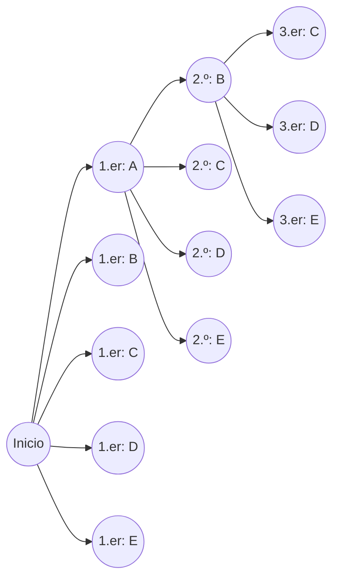
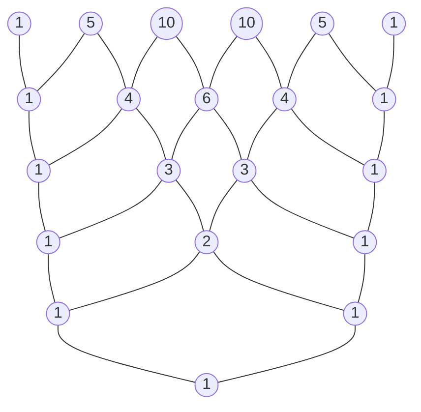

# Introducción

En el mundo de las matemáticas, las "permutaciones" y las "combinaciones" —métodos para contar lógicamente el número de resultados posibles— son conceptos fundamentales cruciales en una amplia gama de campos, desde la probabilidad y la estadística hasta los algoritmos de la ciencia informática. Al extender estos conceptos fundamentales al ámbito del álgebra llegamos al "Teorema del Binomio", y representar visual y geométricamente la secuencia de sus coeficientes produce el "Triángulo de [Pascal](https://kenji.blog/es/p/pascal/)". A primera vista, estos pueden parecer temas matemáticos independientes, pero a medida que los estudias profundamente, te das cuenta de que están asombrosamente entrelazados, formando una estructura matemática única, masiva y hermosa.

En este artículo, comenzaremos con una comprensión intuitiva y los métodos de cálculo básicos para permutaciones y combinaciones, y luego explicaremos en detalle conceptos más complejos como permutaciones con repetición, permutaciones circulares y combinaciones con repetición. A partir de ahí, derivaremos la fórmula del Teorema del Binomio y su hermosa simetría, y finalmente profundizaremos exhaustivamente en temas profundos como las misteriosas propiedades ocultas en el Triángulo de [Pascal](https://kenji.blog/es/p/pascal/), su conexión con la secuencia de [Fibonacci](https://kenji.blog/es/p/fibonacci/) que describe las leyes de la naturaleza y las estructuras fractales. Emprendamos un viaje para apreciar plenamente la "belleza" y "regularidad" de las matemáticas.

# ¿Qué son las Permutaciones?

Una permutación se refiere al método de elegir $r$ elementos de $n$ elementos distintos y ordenarlos **con un orden específico**. El punto más importante en las permutaciones es que "si el orden es diferente, se trata como un arreglo completamente diferente". Por ejemplo, al elegir y organizar dos cartas de "A", "B" y "C", "A-B" y "B-A" se cuentan como permutaciones diferentes.

## Fórmula de Permutación

El número total de permutaciones al elegir $r$ elementos de $n$ elementos distintos se representa con el símbolo $_n\text{P}_r$ y se calcula utilizando la siguiente fórmula matemática:

$$
_n\text{P}_r = \frac{n!}{(n-r)!}
$$

Aquí, $n!$ representa el factorial de $n$, y $n! = n \times (n-1) \times \dots \times 2 \times 1$. El factorial indica el número total de formas de reorganizar todos los elementos de un número dado.

## Ejemplo Concreto: Clasificaciones de Carreras y Arreglos de Asientos

Por ejemplo, consideremos lógicamente cuántos resultados posibles hay para el 1.er al 3.er lugar cuando 5 estudiantes (A, B, C, D, E) corren una carrera.

- La persona potencial para el 1.er lugar es cualquiera de los 5 estudiantes (5 formas)
- La persona potencial para el 2.º lugar es cualquiera de los 4 estudiantes restantes, excluyendo al ganador del 1.er lugar (4 formas)
- La persona potencial para el 3.er lugar es cualquiera de los 3 estudiantes restantes, excluyendo a los ganadores del 1.er y 2.º lugar (3 formas)

Dado que cada uno de estos casos ocurre de forma independiente y consecutiva, lo calculamos de la siguiente manera usando la regla del producto:

$$
_5\text{P}_3 = 5 \times 4 \times 3 = 60 \text{ formas}
$$

Cuando aplicamos esto a la fórmula usando factoriales mencionada anteriormente, obtenemos $_5\text{P}_3 = \frac{5!}{(5-3)!} = \frac{120}{2} = 60$, lo que confirma que nuestro cálculo intuitivo coincide completamente con la fórmula estricta.

# Permutaciones con Repetición y Permutaciones Circulares

Al extender ligeramente el concepto de permutaciones, podemos resolver varios problemas que se encuentran frecuentemente en la vida diaria. Aquí explicaremos las "permutaciones con repetición" y las "permutaciones circulares", que son ejemplos de aplicación típicos.

## Permutaciones con Repetición

Al elegir elementos, una permutación donde se te permite elegir el mismo elemento repetidamente un número arbitrario de veces se llama **permutación con repetición**.
El número total de permutaciones al tomar $r$ elementos de $n$ tipos distintos permitiendo la repetición se expresa mediante una fórmula muy simple:

$$
n^r
$$

Por ejemplo, considera configurar un PIN de 4 dígitos (usando 10 tipos de números del 0 al 9). Cada dígito tiene 10 opciones del 0 al 9, y puedes usar el mismo número tantas veces como desees. Por lo tanto, el número total de posibles PINs a configurar es el siguiente:

$$
10^4 = 10 \times 10 \times 10 \times 10 = 10000 \text{ formas}
$$

Las contraseñas digitales y el conteo de los resultados de lanzar una moneda cara o cruz (2 tipos) varias veces se basan todos en este concepto de permutaciones con repetición.

## Permutaciones Circulares

Una permutación donde las cosas están dispuestas no en línea recta sino en círculo se llama **permutación circular**. La característica de una permutación circular es que "los arreglos que se vuelven iguales al rotar se cuentan como 1 forma".

El número total de permutaciones al disponer $n$ elementos distintos en un círculo se calcula mediante la siguiente fórmula:

$$
(n - 1)!
$$

¿Por qué es $(n-1)!$? Esto es porque cuando $n$ elementos están dispuestos en un círculo, hay $n$ formas de mirarlo dependiendo de por qué elemento comiences a mirar. Por lo tanto, al dividir la permutación normal dispuesta en una línea $n!$ entre $n$, deducimos $(n-1)!$.

Por ejemplo, ¿cuántas formas hay de que 5 personas se sienten en una mesa redonda?
$$
(5 - 1)! = 4! = 4 \times 3 \times 2 \times 1 = 24 \text{ formas}
$$
Al considerar la simetría rotacional, el número de casos disminuye drásticamente. Este concepto también se aplica en campos como la química para considerar la estructura tridimensional de las moléculas y en el análisis de topologías de anillo de redes.

# ¿Qué son las Combinaciones?

Mientras que las permutaciones enfatizan el "orden" del arreglo, las combinaciones se centran solo en la composición del conjunto, es decir, "qué elementos fueron elegidos". En otras palabras, en las combinaciones **no se considera el orden**. Si los miembros de los elementos elegidos son los mismos, se tratan como la misma combinación única, independientemente de cómo estén ordenados.

## Fórmula de Combinación

El número total de combinaciones al elegir $r$ elementos de $n$ elementos distintos se representa con el símbolo $_n\text{C}_r$ o la notación de coeficiente binomial $\binom{n}{r}$, y se calcula utilizando la siguiente fórmula matemática:

$$
_n\text{C}_r = \binom{n}{r} = \frac{_n\text{P}_r}{r!} = \frac{n!}{r!(n-r)!}
$$

La lógica detrás de esta fórmula es muy elegante. Primero, calculamos el número de formas de elegir $r$ elementos considerando el orden (permutación $_n\text{P}_r$). Sin embargo, los $r$ elementos elegidos pueden organizarse de $r!$ formas entre ellos mismos. Debido a que las combinaciones identifican todos estos como el mismo, dividimos el número total entre $r!$ para eliminar los duplicados.

## Ejemplo Concreto: Formar un Equipo de Proyecto

¿De cuántas maneras se pueden elegir 3 miembros para lanzar un nuevo proyecto de entre 8 empleados que pertenecen a un cierto departamento?
Si no hay una distinción clara de roles dentro de los miembros, el orden en el que son elegidos no importa, lo que hace de esto un problema de combinación.

$$
_8\text{C}_3 = \frac{8!}{3!(8-3)!} = \frac{8 \times 7 \times 6}{3 \times 2 \times 1} = 56 \text{ formas}
$$

Incluso si las 3 personas elegidas son $\{A, B, C\}$ o $\{B, C, A\}$, son completamente idénticas como equipo de proyecto, por lo que se cuentan como 1 forma. El concepto de combinaciones es una herramienta indispensable para analizar eventos que involucran incertidumbre, como calcular probabilidades de ganar la lotería o las probabilidades de las manos de póquer en las cartas.

# Combinaciones con Repetición

Así como las permutaciones tienen permutaciones con repetición, las combinaciones también tienen **combinaciones con repetición**. Esto se refiere al número de formas de elegir $r$ elementos de $n$ tipos distintos permitiendo repetición, y generalmente se representa con el símbolo $_n\text{H}_r$.

## Cálculo de Combinaciones con Repetición y el Modelo de "Estrellas y Barras"

Debido a que las combinaciones con repetición son difíciles de calcular directamente, generalmente se convierten en problemas de combinación estándar para resolverlos. El número total después de la conversión está dado por la siguiente fórmula:

$$
_n\text{H}_r = _{n+r-1}\text{C}_r = \frac{(n+r-1)!}{r!(n-1)!}
$$

Un modelo excelentemente intuitivo para entender esta fórmula es el modelo de "estrellas y barras" (círculos y separadores).

Por ejemplo, ¿de cuántas formas hay para comprar 5 frutas de 3 tipos de frutas: manzanas, naranjas y plátanos, permitiendo repetición? (Asumiendo que está bien si algunas frutas no son elegidas).
Aquí, elegimos $r=5$ elementos de $n=3$ tipos de fruta.

Reemplazamos esto con el problema de organizar 5 "círculos" y $3-1 = 2$ "separadores" utilizados para separar los 3 tipos de fruta en una fila.

Ejemplo: `o o | o | o o`
Esto significa elegir "2 manzanas, 1 naranja y 2 plátanos" desde la izquierda.
Ejemplo: `| o o o | o o`
Esto significa "0 manzanas, 3 naranjas y 2 plátanos".

En otras palabras, es igual a la combinación de elegir 5 lugares para poner círculos (o 2 lugares para poner separadores) de un total de $5 + 2 = 7$ lugares.

$$
_3\text{H}_5 = _{3+5-1}\text{C}_5 = _7\text{C}_5 = _7\text{C}_2 = \frac{7 \times 6}{2 \times 1} = 21 \text{ formas}
$$

Este enfoque de "estrellas y barras" demuestra la poderosa capacidad de abstracción de las matemáticas para reducir problemas aparentemente complejos en estructuras visuales y simples.

# El Teorema del Binomio y su Expansión

El conocimiento de permutaciones y combinaciones que hemos aprendido hasta ahora sirve como preparación perfecta para comprender el "Teorema del Binomio", uno de los teoremas fundamentales del álgebra. El Teorema del Binomio es una fórmula para expandir perfectamente la potencia de una suma de dos términos, como $(x + y)^n$, en un polinomio.

## Fórmula del Teorema del Binomio

Para cualquier entero positivo $n$, la siguiente igualdad siempre es cierta:

$$
(x + y)^n = \sum_{k=0}^{n} \binom{n}{k} x^{n-k} y^k
$$

Alternativamente, escribiéndolo en forma expandida:

$$
(x + y)^n = \binom{n}{0}x^n y^0 + \binom{n}{1}x^{n-1} y^1 + \binom{n}{2}x^{n-2} y^2 + \dots + \binom{n}{n}x^0 y^n
$$

El coeficiente de cada término al expandirse coincide perfectamente con la combinación $\binom{n}{k}$ (es decir, $_n\text{C}_k$). Debido a esto, a estos coeficientes se les llama específicamente **coeficientes binomiales**.

## Prueba Intuitiva del Teorema del Binomio y Relación con las Combinaciones

¿Por qué aparecen combinaciones, que son recuentos de casos, en la expansión de los binomios? Exploremos la razón intuitiva usando la expansión de $(x + y)^3$ como ejemplo.

$$
(x + y)^3 = (x + y)(x + y)(x + y)
$$

El acto de expandir esta expresión significa elegir $x$ o $y$ de cada uno de los 3 paréntesis $(x+y)$ de acuerdo con la ley distributiva, multiplicarlos y sumar todos los patrones.

- **Para crear el término $x^3$** : Debes elegir $x$ de todos los 3 paréntesis. El número de formas de elegir así es $\binom{3}{0} = 1$ forma.
- **Para crear el término $x^2y$** : Necesitas elegir $x$ de 2 de los 3 paréntesis y $y$ del 1 restante. El número de formas para decidir de qué 1 paréntesis elegir $y$ es $\binom{3}{1} = 3$ formas.
- **Para crear el término $xy^2$** : Eliges $x$ de 1 de los 3 paréntesis y $y$ de los 2 restantes. El número de formas para decidir los 2 paréntesis de los cuales elegir $y$ es $\binom{3}{2} = 3$ formas.
- **Para crear el término $y^3$** : Eliges $y$ de los 3 paréntesis. El número de formas es $\binom{3}{3} = 1$ forma.

Por lo tanto, sumar todo esto produce lo siguiente:

$$
(x + y)^3 = 1x^3 + 3x^2y + 3xy^2 + 1y^3
$$

Generalizando esto, la respuesta a la pregunta "En la multiplicación de $n$ paréntesis, ¿cuál es el número total de formas de elegir $k$ veces $y$ (y simultáneamente $n-k$ veces $x$)?" es exactamente $\binom{n}{k}$. Las fórmulas de expansión algebraica y la combinatoria se cruzan maravillosamente aquí.

# Triángulo de [Pascal](https://kenji.blog/es/p/pascal/): La Hermosa Geometría de los Números

Organizar los coeficientes binomiales que aparecen en la fórmula de expansión del Teorema del Binomio en forma de pirámide de arriba hacia abajo como $n=0, 1, 2, \dots$ se llama el "Triángulo de [Pascal](https://kenji.blog/es/p/pascal/)". Este triángulo simplemente estructurado va mucho más allá de ser una mera ayuda de cálculo, albergando en su interior innumerables propiedades matemáticas hermosas y profundas.

## Reglas de Construcción del Triángulo de [Pascal](https://kenji.blog/es/p/pascal/)

El Triángulo de [Pascal](https://kenji.blog/es/p/pascal/) comienza colocando un $1$ en el vértice más alto (fila 0). Para las filas que siguen, los $1$s siempre se colocan en ambos extremos, y todos los números internos se construyen de acuerdo con una regla extremadamente simple: "la suma del número de arriba a la izquierda y el número de arriba a la derecha".

El número ubicado en la fila $n$-ésima desde arriba (siendo el vértice la fila 0) y en la posición $k$-ésima desde la izquierda (siendo el borde izquierdo la posición 0) corresponde exactamente al coeficiente binomial $\binom{n}{k}$. La estructura donde sumar el número de arriba a la izquierda $\binom{n-1}{k-1}$ y el número de arriba a la derecha $\binom{n-1}{k}$ equivale al número de abajo $\binom{n}{k}$ representa geométricamente la siguiente ecuación importante llamada la Regla de [Pascal](https://kenji.blog/es/p/pascal/):

$$
\binom{n}{k} = \binom{n-1}{k-1} + \binom{n-1}{k}
$$

## Propiedades Asombrosas Ocultas en el Triángulo de [Pascal](https://kenji.blog/es/p/pascal/)

Si observas de cerca el Triángulo de [Pascal](https://kenji.blog/es/p/pascal/), notarás que innumerables regularidades se ocultan dentro. Introduzcamos algunas de ellas.

### 1. Simetría Perfecta

Los números en cada fila son perfectamente simétricos horizontalmente a través del eje central. Esto refleja directamente la propiedad fundamental de las combinaciones, $\binom{n}{k} = \binom{n}{n-k}$. Pensando lógicamente, decidir qué $k$ elementos elegir de $n$ es completamente equivalente a decidir simultáneamente los "$n-k$ elementos no elegidos", así que esto es un resultado natural.

### 2. Suma de Filas y Potencias de 2

Si sumas horizontalmente todos los números en cualquier fila $n$-ésima dada, su total siempre será $2^n$.

- Fila 0: $1 = 2^0$
- Fila 1: $1 + 1 = 2 = 2^1$
- Fila 2: $1 + 2 + 1 = 4 = 2^2$
- Fila 3: $1 + 3 + 3 + 1 = 8 = 2^3$
- Fila 4: $1 + 4 + 6 + 4 + 1 = 16 = 2^4$

Esto se puede demostrar fácilmente de forma algebraica desde la ecuación $(1+1)^n = \sum \binom{n}{k}$, obtenida al sustituir $x=1, y=1$ en el Teorema del Binomio $(x+y)^n = \sum \binom{n}{k} x^{n-k} y^k$. Desde una perspectiva de teoría de conjuntos, indica que el "número de todos los subconjuntos" de un conjunto con $n$ elementos es $2^n$.

### 3. La Conexión Oculta con la Secuencia de [Fibonacci](https://kenji.blog/es/p/fibonacci/)

Intenta sumar los números del Triángulo de [Pascal](https://kenji.blog/es/p/pascal/) a lo largo de "líneas diagonales poco profundas". Sorprendentemente, aparece la secuencia $1, 1, 2, 3, 5, 8, 13, 21, \dots$.
Esto no es otra cosa que la **Secuencia de [Fibonacci](https://kenji.blog/es/p/fibonacci/)**, donde sumas los dos números anteriores para obtener el siguiente. La secuencia mística que aparece en todas partes en la naturaleza, como la disposición de las semillas de girasol y la espiral del caparazón de un nautilo, está profundamente incrustada dentro de un triángulo que simplemente organiza combinaciones. Es un ejemplo muy hermoso y conmovedor que muestra cómo las matemáticas, un producto del pensamiento lógico humano, están vinculadas a la providencia de la naturaleza.

### 4. Geometría Fractal: Triángulo de Sierpinski

Intenta expandir el Triángulo de [Pascal](https://kenji.blog/es/p/pascal/) enormemente a decenas o cientos de filas, pintando los "números impares" en el interior de negro y dejando los "números pares" en blanco. Entonces, emerge claramente una figura fractal auto-similar llamada el "Triángulo de Sierpinski".
Esta estructura, donde el mismo patrón triangular se repite infinitamente ya sea que acerques o alejes la imagen en conjunto, sirve como un puente que conecta la teoría de números, la geometría y la teoría del caos.

# Extensión al Teorema Multinomial

El Teorema del Binomio fue la expansión de $(x+y)^n$, pero al generalizar esto a la expansión de la suma de tres o más términos, como $(x+y+z)^n$ o $(x_1 + x_2 + \dots + x_m)^n$, nos da el **Teorema Multinomial**.

Los coeficientes de cada término en la fórmula de expansión del Teorema Multinomial se denominan coeficientes multinomiales, calculados mediante la siguiente fórmula:

$$
\frac{n!}{k_1! k_2! \dots k_m!} \quad (\text{donde } k_1 + k_2 + \dots + k_m = n)
$$

Estos coeficientes multinomiales no son solo coeficientes de expansión algebraica, sino que significan "el número total de formas de dividir $n$ elementos distintos en grupos de $k_1, k_2, \dots, k_m$ elementos respectivamente".
El proceso en el cual el Teorema del Binomio sirve como base y se extiende naturalmente a estructuras combinatorias de dimensiones superiores encarna maravillosamente la expansividad y la consistencia que posee el sistema de las matemáticas.

# Distribución Binomial: Aplicación a la Teoría de Probabilidad

Hasta aquí, hemos tratado las permutaciones y el Teorema del Binomio como matemáticas puras, pero estos conceptos demuestran un poder extremadamente práctico en la "teoría de la probabilidad" y la "estadística" para modelar problemas del mundo real. Un ejemplo representativo es la **Distribución Binomial**.

La distribución binomial es una distribución de probabilidad que describe la probabilidad de que ocurran exactamente $k$ "éxitos" cuando una prueba independiente (ensayo de Bernoulli) que solo produce "éxito" o "fracaso" se repite $n$ veces.
Si la probabilidad de éxito en una sola prueba es $p$, y la probabilidad de fracaso es $q = 1 - p$, entonces la probabilidad de exactamente $k$ éxitos, $P(X=k)$, se expresa de la siguiente manera:

$$
P(X=k) = \binom{n}{k} p^k q^{n-k}
$$

Dentro de esta fórmula de masa de probabilidad, el coeficiente binomial $\binom{n}{k}$ aparece exactamente como es. Esto es porque hay $\binom{n}{k}$ formas de elegir qué $k$ pruebas serán exitosas de las $n$ pruebas.
Desde el cálculo de las probabilidades del lanzamiento de una moneda hasta la predicción de la probabilidad de ocurrencia de productos defectuosos en una fábrica, e incluso la medición de la eficacia de nuevos medicamentos en medicina, la distribución binomial respalda los fundamentos de todo análisis de datos en la sociedad moderna.

# Conclusión

En este artículo, hemos viajado a través de un vasto paisaje matemático, comenzando por las permutaciones y combinaciones, que son reglas de "conteo" simples, pasando por su aplicación en permutaciones con repetición y permutaciones circulares, expandiéndonos aún más al Teorema del Binomio del álgebra, y llegando a la exploración visual del Triángulo de [Pascal](https://kenji.blog/es/p/pascal/).

Al abstraer y profundizar en el acto extremadamente simple y primitivo de "elegir algunos elementos de otros distintos" utilizando el lenguaje riguroso de las matemáticas, ha quedado claro que un mundo matemático inimaginablemente rico y hermoso se extiende hacia afuera —que involucra la simetría perfecta, la regla de las potencias de 2, la secuencia de [Fibonacci](https://kenji.blog/es/p/fibonacci/) que describe el mundo natural y las estructuras fractales infinitas.

Las fórmulas y teoremas matemáticos no son meramente herramientas inorgánicas para resolver problemas de exámenes. Son las obras maestras supremas de la humanidad, que expresan el orden invisible detrás del mundo que nos rodea y las relaciones abrumadoramente hermosas tejidas por los números. Esperamos que al estar en contacto con esta hermosa regularidad de números mostrada por las permutaciones, las combinaciones y el Triángulo de [Pascal](https://kenji.blog/es/p/pascal/), hayas sentido el verdadero encanto y la profundidad que posee la disciplina de las matemáticas.
