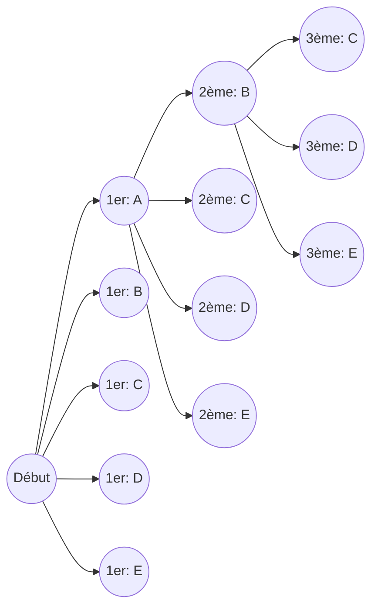
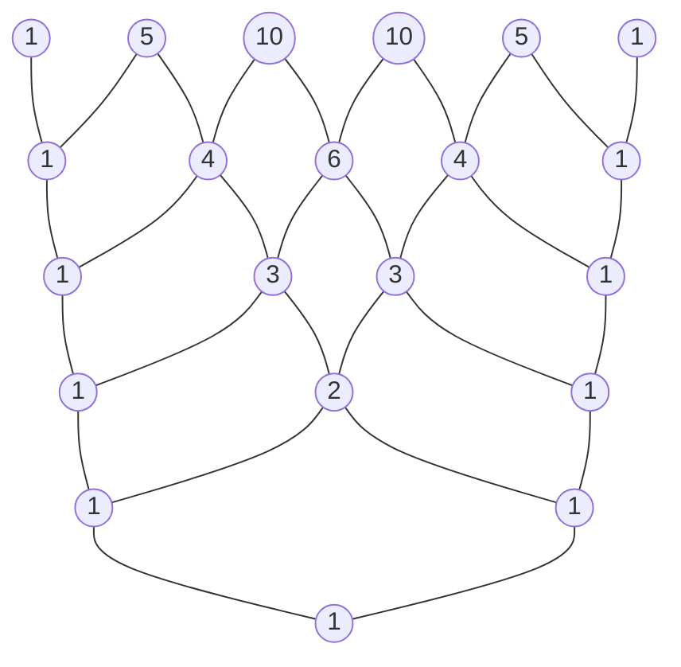

# Introduction

Dans le monde des mathématiques, les « permutations » et les « combinaisons » — des méthodes pour compter logiquement le nombre de résultats possibles — sont des concepts fondamentaux cruciaux dans un large éventail de domaines, allant de la probabilité et la statistique jusqu'aux algorithmes informatiques. En étendant ces concepts fondamentaux dans le domaine de l'algèbre, nous arrivons au « Théorème du Binôme », et la représentation visuelle et géométrique de la séquence de ses coefficients produit le « Triangle de [Pascal](https://kenji.blog/fr/p/pascal/) ». À première vue, ceux-ci peuvent sembler être des sujets mathématiques indépendants, mais en les étudiant en profondeur, on se rend compte qu'ils sont étonnamment imbriqués, formant une structure mathématique unique, massive et magnifique.

Dans cet article, nous commencerons par une compréhension intuitive et les méthodes de calcul de base des permutations et des combinaisons, puis nous expliquerons en détail des concepts plus complexes tels que les permutations avec répétition, les permutations circulaires et les combinaisons avec répétition. À partir de là, nous déduirons la formule du Théorème du Binôme et sa magnifique symétrie, pour finalement plonger au cœur de thèmes profonds tels que les propriétés mystérieuses cachées dans le Triangle de [Pascal](https://kenji.blog/fr/p/pascal/), sa connexion avec la suite de [Fibonacci](https://kenji.blog/fr/p/fibonacci/) qui décrit les lois de la nature, et les structures fractales. Embarquons pour un voyage afin d'apprécier pleinement la « beauté » et la « régularité » des mathématiques.

# Que sont les Permutations ?

Une permutation désigne la méthode consistant à choisir $r$ éléments parmi $n$ éléments distincts et à les arranger **selon un ordre spécifique**. Le point le plus important des permutations est que « si l'ordre est différent, c'est considéré comme un arrangement complètement différent ». Par exemple, lors du choix et de la disposition de deux cartes parmi « A », « B » et « C », « A-B » et « B-A » sont comptés comme des permutations différentes.

## Formule des Permutations

Le nombre total de permutations lors du choix de $r$ éléments parmi $n$ éléments distincts est représenté par le symbole $_n\text{P}_r$ et calculé à l'aide de la formule mathématique suivante :

$$
_n\text{P}_r = \frac{n!}{(n-r)!}
$$

Ici, $n!$ représente la factorielle de $n$, et $n! = n \times (n-1) \times \dots \times 2 \times 1$. La factorielle indique le nombre total de façons de réarranger tous les éléments d'un nombre donné.

## Exemple Concret : Classements d'une Course et Disposition des Sièges

Par exemple, considérons logiquement combien de résultats possibles existent pour les 1ère à 3ème places lorsque 5 élèves (A, B, C, D, E) courent une course.

- La personne potentielle pour la 1ère place est n'importe lequel des 5 élèves (5 façons)
- La personne potentielle pour la 2ème place est n'importe lequel des 4 élèves restants, à l'exclusion du gagnant de la 1ère place (4 façons)
- La personne potentielle pour la 3ème place est n'importe lequel des 3 élèves restants, à l'exclusion des gagnants de la 1ère et 2ème places (3 façons)

Puisque chacun de ces cas se produit indépendamment et consécutivement, nous le calculons de la manière suivante en utilisant le principe multiplicatif :

$$
_5\text{P}_3 = 5 \times 4 \times 3 = 60 \text{ façons}
$$

En appliquant cela à la formule utilisant les factorielles mentionnée plus tôt, nous obtenons $_5\text{P}_3 = \frac{5!}{(5-3)!} = \frac{120}{2} = 60$, ce qui confirme que notre calcul intuitif correspond parfaitement à la formule stricte.

# Permutations avec Répétition et Permutations Circulaires

En élargissant légèrement le concept des permutations, nous pouvons résoudre divers problèmes fréquemment rencontrés dans la vie quotidienne. Nous expliquerons ici les « permutations avec répétition » et les « permutations circulaires », qui sont des exemples typiques d'applications.

## Permutations avec Répétition

Lors du choix d'éléments, une permutation où l'on vous autorise à choisir le même élément de façon répétée n'importe quel nombre de fois s'appelle une **permutation avec répétition**.
Le nombre total de permutations en prenant $r$ éléments parmi $n$ types distincts en permettant la répétition est exprimé par une formule très simple :

$$
n^r
$$

Par exemple, considérez la configuration d'un code PIN à 4 chiffres (en utilisant 10 types de nombres de 0 à 9). Chaque chiffre a 10 options de 0 à 9, et vous pouvez utiliser le même chiffre autant de fois que vous le souhaitez. Par conséquent, le nombre total de codes PIN possibles à configurer est le suivant :

$$
10^4 = 10 \times 10 \times 10 \times 10 = 10000 \text{ façons}
$$

Les mots de passe numériques et le comptage des résultats de lancers de pile ou face (2 types) de multiples fois reposent tous sur ce concept de permutations avec répétition.

## Permutations Circulaires

Une permutation où les éléments sont disposés non pas en ligne droite mais en cercle s'appelle une **permutation circulaire**. La caractéristique d'une permutation circulaire est que « les arrangements qui deviennent identiques lors d'une rotation sont comptés comme 1 façon ».

Le nombre total de permutations lors de la disposition de $n$ éléments distincts en cercle est calculé par la formule suivante :

$$
(n - 1)!
$$

Pourquoi est-ce $(n-1)!$ ? C'est parce que lorsque $n$ éléments sont disposés en cercle, il y a $n$ façons de le regarder selon l'élément par lequel vous commencez. Par conséquent, en divisant la permutation normale disposée en ligne $n!$ par $n$, on déduit $(n-1)!$.

Par exemple, combien y a-t-il de façons pour 5 personnes de s'asseoir à une table ronde ?
$$
(5 - 1)! = 4! = 4 \times 3 \times 2 \times 1 = 24 \text{ façons}
$$
En prenant en compte la symétrie de rotation, le nombre de cas diminue de façon drastique. Ce concept s'applique également dans des domaines comme la chimie pour étudier la structure tridimensionnelle des molécules, ou dans l'analyse des topologies en anneau des réseaux informatiques.

# Que sont les Combinaisons ?

Alors que les permutations soulignent l'« ordre » de l'arrangement, les combinaisons se concentrent uniquement sur la composition de l'ensemble, c'est-à-dire « quels éléments ont été choisis ». Autrement dit, dans les combinaisons, **l'ordre n'est pas pris en compte**. Si les membres des éléments choisis sont les mêmes, ils sont traités comme la même combinaison unique, peu importe comment ils sont disposés.

## Formule des Combinaisons

Le nombre total de combinaisons lors du choix de $r$ éléments parmi $n$ éléments distincts est représenté par le symbole $_n\text{C}_r$ ou la notation du coefficient binomial $\binom{n}{r}$, et est calculé à l'aide de la formule mathématique suivante :

$$
_n\text{C}_r = \binom{n}{r} = \frac{_n\text{P}_r}{r!} = \frac{n!}{r!(n-r)!}
$$

La logique derrière cette formule est très élégante. D'abord, nous calculons le nombre de façons de choisir $r$ éléments en tenant compte de l'ordre (permutation $_n\text{P}_r$). Cependant, les $r$ éléments choisis peuvent être arrangés de $r!$ façons entre eux. Comme les combinaisons identifient tous ces arrangements comme étant les mêmes, nous divisons le nombre total par $r!$ pour éliminer les doublons.

## Exemple Concret : Former une Équipe de Projet

Combien y a-t-il de façons de choisir 3 membres pour lancer un nouveau projet parmi 8 employés appartenant à un certain département ?
S'il n'y a pas de distinction claire de rôles parmi les membres, l'ordre dans lequel ils sont choisis n'a pas d'importance, ce qui en fait un problème de combinaisons.

$$
_8\text{C}_3 = \frac{8!}{3!(8-3)!} = \frac{8 \times 7 \times 6}{3 \times 2 \times 1} = 56 \text{ façons}
$$

Même si les 3 personnes choisies sont $\{A, B, C\}$ ou $\{B, C, A\}$, elles sont complètement identiques en tant qu'équipe de projet, elles sont donc comptées comme 1 façon. Le concept de combinaisons est un outil indispensable dans l'analyse d'événements impliquant l'incertitude, comme le calcul des probabilités de gagner à la loterie ou les probabilités des mains de poker aux cartes.

# Combinaisons avec Répétition

Tout comme les permutations ont des permutations avec répétition, les combinaisons ont aussi des **combinaisons avec répétition**. Cela fait référence au nombre de façons de choisir $r$ éléments parmi $n$ types distincts en permettant la répétition, et est généralement représenté par le symbole $_n\text{H}_r$.

## Calcul des Combinaisons avec Répétition et le Modèle des "Cercles et Barres"

Comme les combinaisons avec répétition sont difficiles à calculer directement, elles sont généralement converties en problèmes de combinaisons standards pour être résolues. Le nombre total après conversion est donné par la formule suivante :

$$
_n\text{H}_r = _{n+r-1}\text{C}_r = \frac{(n+r-1)!}{r!(n-1)!}
$$

Un modèle extrêmement intuitif pour comprendre cette formule est le modèle des « étoiles et barres » (cercles et séparateurs).

Par exemple, de combien de façons peut-on acheter 5 fruits parmi 3 types de fruits : pommes, oranges et bananes, en autorisant la répétition ? (En supposant qu'il est acceptable de ne pas choisir certains fruits).
Ici, nous choisissons $r=5$ éléments parmi $n=3$ types de fruits.

Nous remplaçons cela par le problème d'arranger 5 « cercles » et $3-1 = 2$ « séparateurs » utilisés pour séparer les 3 types de fruits en ligne.

Exemple : `o o | o | o o`
Cela signifie choisir « 2 pommes, 1 orange et 2 bananes » à partir de la gauche.
Exemple : `| o o o | o o`
Cela signifie « 0 pomme, 3 oranges et 2 bananes ».

En d'autres termes, cela équivaut à la combinaison de choisir 5 places pour placer des cercles (ou 2 places pour placer des séparateurs) sur un total de $5 + 2 = 7$ emplacements.

$$
_3\text{H}_5 = _{3+5-1}\text{C}_5 = _7\text{C}_5 = _7\text{C}_2 = \frac{7 \times 6}{2 \times 1} = 21 \text{ façons}
$$

Cette approche de « cercles et barres » démontre la puissante capacité d'abstraction des mathématiques pour réduire des problèmes apparemment complexes en structures visuelles et simples.

# Le Théorème du Binôme et son Développement

La connaissance des permutations et des combinaisons que nous avons acquise jusqu'à présent sert de préparation parfaite pour comprendre le « Théorème du Binôme », l'un des théorèmes fondamentaux de l'algèbre. Le Théorème du Binôme est une formule pour développer parfaitement la puissance de la somme de deux termes, comme $(x + y)^n$, en un polynôme.

## Formule du Théorème du Binôme

Pour tout entier positif $n$, l'égalité suivante est toujours vraie :

$$
(x + y)^n = \sum_{k=0}^{n} \binom{n}{k} x^{n-k} y^k
$$

Alternativement, écrit sous sa forme développée :

$$
(x + y)^n = \binom{n}{0}x^n y^0 + \binom{n}{1}x^{n-1} y^1 + \binom{n}{2}x^{n-2} y^2 + \dots + \binom{n}{n}x^0 y^n
$$

Le coefficient de chaque terme lors de son développement correspond parfaitement à la combinaison $\binom{n}{k}$ (c'est-à-dire $_n\text{C}_k$). De ce fait, ces coefficients sont spécifiquement appelés **coefficients binomiaux**.

## Preuve Intuitive du Théorème du Binôme et Relation avec les Combinaisons

Pourquoi les combinaisons, qui sont des dénombrements de cas, apparaissent-elles dans le développement des binômes ? Explorons la raison intuitive en utilisant le développement de $(x + y)^3$ comme exemple.

$$
(x + y)^3 = (x + y)(x + y)(x + y)
$$

L'acte de développer cette expression signifie choisir soit $x$ soit $y$ dans chacune des 3 parenthèses $(x+y)$ selon la loi de la distributivité, de les multiplier et d'additionner tous les cas possibles.

- **Pour créer le terme $x^3$** : Vous devez choisir $x$ dans les 3 parenthèses. Le nombre de telles façons de choisir est de $\binom{3}{0} = 1$ façon.
- **Pour créer le terme $x^2y$** : Vous devez choisir $x$ dans 2 des 3 parenthèses, et $y$ dans la parenthèse restante. Le nombre de façons de décider de l'unique parenthèse pour choisir $y$ est de $\binom{3}{1} = 3$ façons.
- **Pour créer le terme $xy^2$** : Vous choisissez $x$ dans 1 des 3 parenthèses, et $y$ dans les 2 restantes. Le nombre de façons de décider les 2 parenthèses pour choisir $y$ est de $\binom{3}{2} = 3$ façons.
- **Pour créer le terme $y^3$** : Vous choisissez $y$ dans les 3 parenthèses. Le nombre de façons est de $\binom{3}{3} = 1$ façon.

Par conséquent, l'addition de tout cela donne ce qui suit :

$$
(x + y)^3 = 1x^3 + 3x^2y + 3xy^2 + 1y^3
$$

En généralisant cela, la réponse à la question « Lors de la multiplication de $n$ parenthèses, quel est le nombre total de façons de choisir $k$ fois $y$ (et simultanément $n-k$ fois $x$) » est exactement $\binom{n}{k}$. Les formules de développement algébrique et l'analyse combinatoire se croisent magnifiquement ici.

# Le Triangle de [Pascal](https://kenji.blog/fr/p/pascal/) : La Magnifique Géométrie des Nombres

Disposer les coefficients binomiaux apparaissant dans la formule de développement du Théorème du Binôme sous la forme d'une pyramide de haut en bas avec $n=0, 1, 2, \dots$ s'appelle le « Triangle de [Pascal](https://kenji.blog/fr/p/pascal/) ». Ce triangle de structure simple va bien au-delà d'une simple aide au calcul, renfermant en son sein d'innombrables propriétés mathématiques magnifiques et profondes.

## Règles de Construction du Triangle de [Pascal](https://kenji.blog/fr/p/pascal/)

Le Triangle de [Pascal](https://kenji.blog/fr/p/pascal/) commence par placer un $1$ au sommet supérieur (rangée 0). Pour les rangées qui suivent, des $1$ sont toujours placés aux deux extrémités, et tous les nombres intérieurs sont construits selon une règle extrêmement simple : « la somme du nombre en haut à gauche et du nombre en haut à droite ».

Le nombre situé à la $n$-ième rangée à partir du haut (le sommet étant la 0ème rangée) et à la $k$-ième position à partir de la gauche (le bord gauche étant la 0ème position) correspond exactement au coefficient binomial $\binom{n}{k}$. La structure où l'addition du nombre en haut à gauche $\binom{n-1}{k-1}$ et du nombre en haut à droite $\binom{n-1}{k}$ égale le nombre en dessous $\binom{n}{k}$ représente géométriquement l'importante équation suivante appelée Règle de [Pascal](https://kenji.blog/fr/p/pascal/) :

$$
\binom{n}{k} = \binom{n-1}{k-1} + \binom{n-1}{k}
$$

## Propriétés Incroyables Cachées dans le Triangle de [Pascal](https://kenji.blog/fr/p/pascal/)

Si vous observez attentivement le Triangle de [Pascal](https://kenji.blog/fr/p/pascal/), vous remarquerez que d'innombrables régularités y sont cachées. Présentons quelques-unes d'entre elles.

### 1. Symétrie Parfaite

Les nombres de chaque rangée sont parfaitement symétriques horizontalement par rapport à l'axe central. Cela reflète directement la propriété fondamentale des combinaisons, $\binom{n}{k} = \binom{n}{n-k}$. Logiquement, décider quels $k$ éléments choisir parmi $n$ équivaut complètement à décider simultanément des « $n-k$ éléments non choisis », donc c'est un résultat naturel.

### 2. Somme des Rangées et Puissances de 2

Si vous additionnez horizontalement tous les nombres d'une $n$-ième rangée donnée, leur total sera toujours $2^n$.

- Rangée 0: $1 = 2^0$
- Rangée 1: $1 + 1 = 2 = 2^1$
- Rangée 2: $1 + 2 + 1 = 4 = 2^2$
- Rangée 3: $1 + 3 + 3 + 1 = 8 = 2^3$
- Rangée 4: $1 + 4 + 6 + 4 + 1 = 16 = 2^4$

Cela peut être facilement prouvé de manière algébrique à partir de l'équation $(1+1)^n = \sum \binom{n}{k}$, obtenue en substituant $x=1, y=1$ dans le Théorème du Binôme $(x+y)^n = \sum \binom{n}{k} x^{n-k} y^k$. Du point de vue de la théorie des ensembles, cela indique que le « nombre de tous les sous-ensembles » d'un ensemble de $n$ éléments est $2^n$.

### 3. La Connexion Cachée avec la Suite de [Fibonacci](https://kenji.blog/fr/p/fibonacci/)

Essayez d'additionner les nombres du Triangle de [Pascal](https://kenji.blog/fr/p/pascal/) le long des « lignes diagonales peu profondes ». Étonnamment, la séquence $1, 1, 2, 3, 5, 8, 13, 21, \dots$ apparaît.
Il ne s'agit ni plus ni moins que de la **Suite de [Fibonacci](https://kenji.blog/fr/p/fibonacci/)**, où vous additionnez les deux nombres précédents pour former le suivant. La séquence mystique qui apparaît partout dans la nature, comme la disposition des graines de tournesol et la spirale de la coquille d'un nautile, est profondément intégrée dans un triangle qui ne fait qu'arranger des combinaisons. C'est un exemple très beau et touchant montrant comment les mathématiques, produit de la pensée logique humaine, sont liées à la providence de la nature.

### 4. Géométrie Fractale : Triangle de Sierpinski

Essayez d'agrandir énormément le Triangle de [Pascal](https://kenji.blog/fr/p/pascal/) à des dizaines ou des centaines de rangées, en peignant en noir les « nombres impairs » à l'intérieur et en laissant les « nombres pairs » vides. Alors, une figure fractale auto-similaire appelée le « Triangle de Sierpinski » apparaît clairement.
Cette structure, où le même motif triangulaire se répète infiniment, que l'on zoome ou dézoome sur l'ensemble, sert de pont reliant la théorie des nombres, la géométrie et la théorie du chaos.

# Extension au Théorème Multinomial

Le Théorème du Binôme était le développement de $(x+y)^n$, mais la généralisation de cela au développement de la somme de trois termes ou plus, comme $(x+y+z)^n$ ou $(x_1 + x_2 + \dots + x_m)^n$, est le **Théorème Multinomial**.

Les coefficients de chaque terme dans la formule de développement du Théorème Multinomial sont appelés coefficients multinomiaux, calculés par la formule suivante :

$$
\frac{n!}{k_1! k_2! \dots k_m!} \quad (\text{où } k_1 + k_2 + \dots + k_m = n)
$$

Ces coefficients multinomiaux ne sont pas de simples coefficients de développement algébrique, mais signifient « le nombre total de façons de diviser $n$ éléments distincts en groupes de $k_1, k_2, \dots, k_m$ éléments respectivement ».
Le processus où le Théorème du Binôme sert de base et s'étend naturellement à des structures combinatoires de dimension supérieure incarne magnifiquement la capacité d'expansion et la cohérence que possède le système mathématique.

# Loi Binomiale : Application à la Théorie des Probabilités

Jusqu'à présent, nous avons traité les permutations et le Théorème du Binôme comme des mathématiques pures, mais ces concepts démontrent une puissance extrêmement pratique dans la « théorie des probabilités » et la « statistique » pour modéliser les problèmes du monde réel. Un exemple représentatif est la **Loi Binomiale**.

La loi binomiale est une loi de probabilité qui décrit la probabilité qu'exactement $k$ « succès » se produisent lorsqu'une épreuve indépendante (épreuve de Bernoulli) qui ne produit qu'un « succès » ou un « échec » est répétée $n$ fois.
Si la probabilité de succès d'une seule épreuve est $p$, et la probabilité d'échec est $q = 1 - p$, alors la probabilité d'exactement $k$ succès, $P(X=k)$, s'exprime comme suit :

$$
P(X=k) = \binom{n}{k} p^k q^{n-k}
$$

À l'intérieur de cette formule de masse de probabilité, le coefficient binomial $\binom{n}{k}$ apparaît exactement tel quel. C'est parce qu'il y a $\binom{n}{k}$ façons de choisir quelles $k$ épreuves seront des succès parmi $n$ épreuves.
Du calcul des probabilités de lancers de pièces à la prédiction de la probabilité d'apparition de produits défectueux dans une usine, et même à la mesure de l'efficacité de nouveaux médicaments en médecine, la loi binomiale soutient les fondements de toute l'analyse de données de la société moderne.

# Conclusion

Dans cet article, nous avons voyagé à travers un vaste paysage mathématique, en commençant par les permutations et les combinaisons, qui sont de simples règles de « dénombrement », en passant par leur application dans les permutations avec répétition et les permutations circulaires, en s'étendant encore vers le Théorème du Binôme de l'algèbre, pour atteindre l'exploration visuelle du Triangle de [Pascal](https://kenji.blog/fr/p/pascal/).

En abstrayant et en approfondissant l'acte extrêmement simple et primitif de « choisir certains éléments parmi d'autres distincts » en utilisant le langage rigoureux des mathématiques, il est devenu clair qu'un monde mathématique d'une richesse et d'une beauté inimaginables s'étend vers l'extérieur — impliquant la symétrie parfaite, la règle des puissances de 2, la suite de [Fibonacci](https://kenji.blog/fr/p/fibonacci/) décrivant le monde naturel, et d'infinies structures fractales.

Les formules et les théorèmes mathématiques ne sont pas de simples outils inorganiques pour résoudre des problèmes d'examens. Ce sont les chefs-d'œuvre suprêmes de l'humanité, exprimant l'ordre invisible derrière le monde qui nous entoure et les relations irrésistiblement belles tissées par les nombres. Nous espérons qu'en touchant à cette magnifique régularité des nombres montrée par les permutations, les combinaisons et le Triangle de [Pascal](https://kenji.blog/fr/p/pascal/), vous avez ressenti le véritable charme et la profondeur que possède la discipline des mathématiques.
