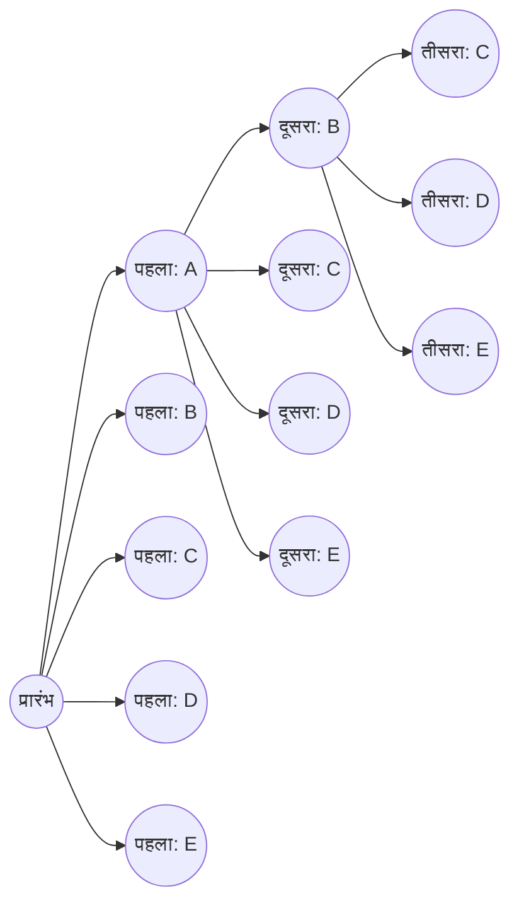
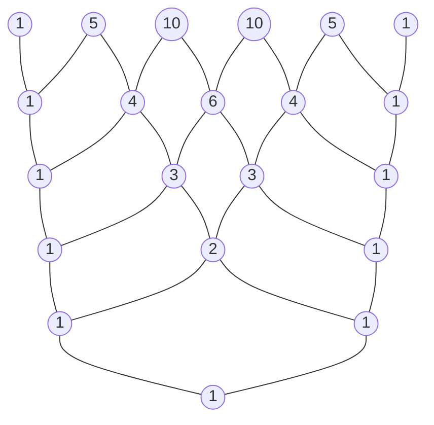

# परिचय

गणित की दुनिया में, "क्रमचय" (Permutations) और "संचय" (Combinations) - संभावित परिणामों की संख्या को तार्किक रूप से गिनने के तरीके - प्रायिकता और सांख्यिकी से लेकर कंप्यूटर विज्ञान के एल्गोरिदम तक विस्तृत क्षेत्रों में महत्वपूर्ण मूलभूत अवधारणाएं हैं। इन मूलभूत अवधारणाओं को बीजगणित (Algebra) के क्षेत्र में विस्तारित करने पर हमें "द्विपद प्रमेय" (Binomial Theorem) प्राप्त होता है, और इसके गुणांकों के अनुक्रम को दृष्टिगत और ज्यामितीय रूप से दर्शाने पर "पास्कल का त्रिभुज" (Pascal's Triangle) बनता है। पहली नज़र में, ये स्वतंत्र गणितीय विषय लग सकते हैं, लेकिन जब आप इनका गहराई से अध्ययन करते हैं, तो आपको एहसास होता है कि ये आश्चर्यजनक रूप से एक-दूसरे से गुंथे हुए हैं, और एक विशाल, सुंदर गणितीय संरचना बनाते हैं।

इस लेख में, हम क्रमचय और संचय के लिए एक सहज समझ और बुनियादी गणना विधियों के साथ शुरू करेंगे, और फिर पुनरावृत्ति के साथ क्रमचय (Permutations with Repetition), वृत्ताकार क्रमचय (Circular Permutations), और पुनरावृत्ति के साथ संचय (Combinations with Repetition) जैसी अधिक जटिल अवधारणाओं को विस्तार से समझाएंगे। वहां से, हम द्विपद प्रमेय का सूत्र और इसकी सुंदर समरूपता (Symmetry) प्राप्त करेंगे, और अंततः पास्कल के त्रिभुज में छिपे रहस्यमय गुणों, प्रकृति के नियमों का वर्णन करने वाले फाइबोनैचि अनुक्रम ([Fibonacci](https://kenji.blog/hi/p/fibonacci/) Sequence) के साथ इसके संबंध और फ्रैक्टल संरचनाओं (Fractal structures) जैसे गहन विषयों में पूरी तरह से उतरेंगे। आइए गणित की "सुंदरता" और "नियमितता" की पूरी तरह से सराहना करने के लिए एक यात्रा पर चलें।

# क्रमचय (Permutations) क्या हैं?

क्रमचय का तात्पर्य $n$ विशिष्ट तत्वों में से $r$ तत्वों को चुनने और उन्हें **एक विशिष्ट क्रम के साथ** व्यवस्थित करने की विधि से है। क्रमचय में सबसे महत्वपूर्ण बिंदु यह है कि "यदि क्रम अलग है, तो इसे पूरी तरह से अलग व्यवस्था माना जाता है।" उदाहरण के लिए, जब "A", "B", और "C" में से दो कार्ड चुनते और व्यवस्थित करते हैं, तो "A-B" और "B-A" को अलग-अलग क्रमचय के रूप में गिना जाता है।

## क्रमचय का सूत्र

$n$ विशिष्ट तत्वों में से $r$ तत्वों को चुनते समय क्रमचयों की कुल संख्या को प्रतीक $_n\text{P}_r$ द्वारा दर्शाया जाता है और निम्नलिखित गणितीय सूत्र का उपयोग करके इसकी गणना की जाती है:

$$
_n\text{P}_r = \frac{n!}{(n-r)!}
$$

यहाँ, $n!$ $n$ के फैक्टोरियल (Factorial) को दर्शाता है, और $n! = n \times (n-1) \times \dots \times 2 \times 1$ है। फैक्टोरियल किसी दी गई संख्या के सभी तत्वों को पुनर्व्यवस्थित करने के कुल तरीकों की संख्या को इंगित करता है।

## ठोस उदाहरण: दौड़ की रैंकिंग और बैठने की व्यवस्था

उदाहरण के लिए, आइए तार्किक रूप से विचार करें कि पहले से तीसरे स्थान के लिए कितने संभावित परिणाम हैं जब 5 छात्र (A, B, C, D, E) एक दौड़ में भाग लेते हैं।

- प्रथम स्थान के लिए संभावित व्यक्ति 5 छात्रों में से कोई भी है (5 तरीके)
- दूसरे स्थान के लिए संभावित व्यक्ति शेष 4 छात्रों में से कोई भी है, प्रथम स्थान के विजेता को छोड़कर (4 तरीके)
- तीसरे स्थान के लिए संभावित व्यक्ति शेष 3 छात्रों में से कोई भी है, प्रथम और द्वितीय स्थान के विजेताओं को छोड़कर (3 तरीके)

चूँकि इनमें से प्रत्येक मामला स्वतंत्र रूप से और लगातार होता है, इसलिए हम गुणन नियम (Rule of product) का उपयोग करके इसकी गणना इस प्रकार करते हैं:

$$
_5\text{P}_3 = 5 \times 4 \times 3 = 60 \text{ तरीके}
$$

जब हम इसे पहले बताए गए फैक्टोरियल वाले सूत्र में लागू करते हैं, तो हमें $_5\text{P}_3 = \frac{5!}{(5-3)!} = \frac{120}{2} = 60$ प्राप्त होता है, जो यह पुष्टि करता है कि हमारी सहज गणना सटीक सूत्र से पूरी तरह मेल खाती है।

# पुनरावृत्ति के साथ क्रमचय और वृत्ताकार क्रमचय

क्रमचय की अवधारणा का थोड़ा विस्तार करके, हम रोजमर्रा की जिंदगी में अक्सर आने वाली विभिन्न समस्याओं को हल कर सकते हैं। यहाँ, हम "पुनरावृत्ति के साथ क्रमचय" और "वृत्ताकार क्रमचय" की व्याख्या करेंगे, जो विशिष्ट अनुप्रयोग उदाहरण हैं।

## पुनरावृत्ति के साथ क्रमचय (Permutations with Repetition)

तत्वों को चुनते समय, एक क्रमचय जिसमें आपको एक ही तत्व को बार-बार कितनी भी बार चुनने की अनुमति होती है, **पुनरावृत्ति के साथ क्रमचय** कहलाता है।
पुनरावृत्ति की अनुमति देते हुए $n$ विशिष्ट प्रकारों में से $r$ तत्वों को लेने पर क्रमचयों की कुल संख्या को एक बहुत ही सरल सूत्र द्वारा व्यक्त किया जाता है:

$$
n^r
$$

उदाहरण के लिए, 4-अंकीय पिन (0 से 9 तक के 10 प्रकार के अंकों का उपयोग करके) सेट करने पर विचार करें। प्रत्येक अंक में 0 से 9 तक 10 विकल्प होते हैं, और आप अपनी इच्छानुसार एक ही संख्या का उपयोग कितनी भी बार कर सकते हैं। इसलिए, सेट किए जाने वाले संभावित पिन की कुल संख्या इस प्रकार है:

$$
10^4 = 10 \times 10 \times 10 \times 10 = 10000 \text{ तरीके}
$$

डिजिटल पासवर्ड और एक सिक्के को कई बार उछालने (2 प्रकार: चित या पट) के परिणामों की गिनती सभी पुनरावृत्ति के साथ क्रमचय की इस अवधारणा पर आधारित हैं।

## वृत्ताकार क्रमचय (Circular Permutations)

एक क्रमचय जिसमें चीजों को एक सीधी रेखा में नहीं बल्कि एक वृत्त में व्यवस्थित किया जाता है, **वृत्ताकार क्रमचय** कहलाता है। वृत्ताकार क्रमचय की विशेषता यह है कि "वे व्यवस्थाएँ जो घुमाने पर समान हो जाती हैं, उन्हें 1 तरीका गिना जाता है।"

$n$ विशिष्ट वस्तुओं को एक वृत्त में व्यवस्थित करते समय क्रमचयों की कुल संख्या की गणना निम्नलिखित सूत्र द्वारा की जाती है:

$$
(n - 1)!
$$

यह $(n-1)!$ क्यों है? ऐसा इसलिए है क्योंकि जब $n$ तत्वों को एक वृत्त में व्यवस्थित किया जाता है, तो उन्हें देखने के $n$ तरीके होते हैं, जो इस बात पर निर्भर करता है कि आप किस तत्व से देखना शुरू करते हैं। इसलिए, एक पंक्ति में व्यवस्थित सामान्य क्रमचय $n!$ को $n$ से विभाजित करके, हम $(n-1)!$ प्राप्त करते हैं।

उदाहरण के लिए, 5 लोगों के गोल मेज पर बैठने के कितने तरीके हैं?
$$
(5 - 1)! = 4! = 4 \times 3 \times 2 \times 1 = 24 \text{ तरीके}
$$
घूर्णी समरूपता (Rotational symmetry) पर विचार करने से, मामलों की संख्या काफी कम हो जाती है। यह अवधारणा रसायन विज्ञान जैसे क्षेत्रों में अणुओं की त्रि-आयामी संरचना पर विचार करने और नेटवर्क की रिंग टोपोलॉजी का विश्लेषण करने में भी लागू होती है।

# संचय (Combinations) क्या हैं?

जहाँ क्रमचय व्यवस्था के "क्रम" पर जोर देता है, संचय केवल सेट की संरचना पर ध्यान केंद्रित करता है, अर्थात, "कौन से तत्व चुने गए थे।" दूसरे शब्दों में, संचय में, **क्रम पर विचार नहीं किया जाता है**। यदि चुने गए तत्वों के सदस्य समान हैं, तो उन्हें एक ही संचय के रूप में माना जाता है, भले ही उन्हें कैसे भी व्यवस्थित किया गया हो।

## संचय का सूत्र

$n$ विशिष्ट तत्वों में से $r$ तत्वों को चुनते समय संचयों की कुल संख्या को प्रतीक $_n\text{C}_r$ या द्विपद गुणांक अंकन $\binom{n}{r}$ द्वारा दर्शाया जाता है, और निम्नलिखित गणितीय सूत्र का उपयोग करके इसकी गणना की जाती है:

$$
_n\text{C}_r = \binom{n}{r} = \frac{_n\text{P}_r}{r!} = \frac{n!}{r!(n-r)!}
$$

इस सूत्र के पीछे का तर्क बहुत ही सुंदर है। सबसे पहले, हम क्रम (क्रमचय $_n\text{P}_r$) को ध्यान में रखते हुए $r$ तत्वों को चुनने के तरीकों की संख्या की गणना करते हैं। हालाँकि, चुने गए $r$ तत्वों को आपस में $r!$ तरीकों से व्यवस्थित किया जा सकता है। चूँकि संचय इन सभी व्यवस्थाओं को एक समान मानता है, इसलिए हम डुप्लिकेट को खत्म करने के लिए कुल संख्या को $r!$ से विभाजित करते हैं।

## ठोस उदाहरण: एक प्रोजेक्ट टीम बनाना

किसी निश्चित विभाग से संबंधित 8 कर्मचारियों में से एक नई परियोजना शुरू करने के लिए 3 सदस्यों को चुनने के कितने तरीके हैं?
यदि सदस्यों के बीच भूमिकाओं का कोई स्पष्ट भेद नहीं है, तो उनके चुने जाने के क्रम से कोई फर्क नहीं पड़ता है, जिससे यह एक संचय की समस्या बन जाती है।

$$
_8\text{C}_3 = \frac{8!}{3!(8-3)!} = \frac{8 \times 7 \times 6}{3 \times 2 \times 1} = 56 \text{ तरीके}
$$

भले ही चुने गए 3 लोग $\{A, B, C\}$ या $\{B, C, A\}$ हों, वे एक प्रोजेक्ट टीम के रूप में पूरी तरह से समान हैं, इसलिए उन्हें 1 तरीके के रूप में गिना जाता है। संचय की अवधारणा उन घटनाओं के विश्लेषण में एक अनिवार्य उपकरण है जिनमें अनिश्चितता शामिल होती है, जैसे लॉटरी जीतने की प्रायिकता या कार्ड में पोकर हाथों की प्रायिकता की गणना करना।

# पुनरावृत्ति के साथ संचय

जिस प्रकार क्रमचयों में पुनरावृत्ति के साथ क्रमचय होते हैं, उसी प्रकार संचयों में भी **पुनरावृत्ति के साथ संचय** होते हैं। यह पुनरावृत्ति की अनुमति देते हुए $n$ विशिष्ट प्रकारों में से $r$ वस्तुओं को चुनने के तरीकों की संख्या को संदर्भित करता है, और इसे आम तौर पर प्रतीक $_n\text{H}_r$ द्वारा दर्शाया जाता है।

## पुनरावृत्ति के साथ संचय की गणना और "तारे और बार" मॉडल

चूंकि पुनरावृत्ति के साथ संचय की सीधे गणना करना मुश्किल है, इसलिए उन्हें हल करने के लिए आमतौर पर मानक संचय समस्याओं में बदल दिया जाता है। रूपांतरण के बाद कुल संख्या निम्नलिखित सूत्र द्वारा दी जाती है:

$$
_n\text{H}_r = _{n+r-1}\text{C}_r = \frac{(n+r-1)!}{r!(n-1)!}
$$

इस सूत्र को समझने के लिए एक उत्कृष्ट सहज ज्ञान युक्त मॉडल "तारे और बार" (Stars and bars) (गोले और विभाजक) मॉडल है।

उदाहरण के लिए, 3 प्रकार के फलों: सेब, संतरे और केले में से 5 फल खरीदने के कितने तरीके हैं, जिसमें पुनरावृत्ति की अनुमति हो? (यह मानते हुए कि यदि कुछ फल नहीं चुने जाते हैं तो कोई बात नहीं)।
यहाँ, हम $n=3$ प्रकार के फलों में से $r=5$ वस्तुएं चुनते हैं।

हम इसे एक पंक्ति में 3 प्रकार के फलों को अलग करने के लिए उपयोग किए जाने वाले 5 "गोलों" और $3-1 = 2$ "विभाजकों" को व्यवस्थित करने की समस्या से बदल देते हैं।

उदाहरण: `o o | o | o o`
इसका अर्थ है बाईं ओर से "2 सेब, 1 संतरा, और 2 केले" चुनना।
उदाहरण: `| o o o | o o`
इसका अर्थ है "0 सेब, 3 संतरे, और 2 केले"।

दूसरे शब्दों में, यह कुल $5 + 2 = 7$ स्थानों में से गोलों को रखने के लिए 5 स्थानों (या विभाजकों को रखने के लिए 2 स्थानों) को चुनने के संचय के बराबर है।

$$
_3\text{H}_5 = _{3+5-1}\text{C}_5 = _7\text{C}_5 = _7\text{C}_2 = \frac{7 \times 6}{2 \times 1} = 21 \text{ तरीके}
$$

यह "तारे और बार" दृष्टिकोण गणित की शक्तिशाली अमूर्तता क्षमता को प्रदर्शित करता है जो प्रतीत होने वाली जटिल समस्याओं को दृश्य और सरल संरचनाओं में बदल देता है।

# द्विपद प्रमेय और इसका विस्तार

अब तक हमने जो क्रमचय और संचय का ज्ञान सीखा है, वह बीजगणित के मूलभूत प्रमेयों में से एक "द्विपद प्रमेय" (Binomial Theorem) को समझने के लिए उत्तम तैयारी के रूप में कार्य करता है। द्विपद प्रमेय दो पदों के योग की घात (power), जैसे $(x + y)^n$, को बहुपद (Polynomial) में पूर्णतया विस्तारित करने का एक सूत्र है।

## द्विपद प्रमेय का सूत्र

किसी भी धनात्मक पूर्णांक $n$ के लिए, निम्नलिखित समानता हमेशा सत्य होती है:

$$
(x + y)^n = \sum_{k=0}^{n} \binom{n}{k} x^{n-k} y^k
$$

वैकल्पिक रूप से, इसे विस्तारित रूप में लिखना:

$$
(x + y)^n = \binom{n}{0}x^n y^0 + \binom{n}{1}x^{n-1} y^1 + \binom{n}{2}x^{n-2} y^2 + \dots + \binom{n}{n}x^0 y^n
$$

विस्तार किए जाने पर प्रत्येक पद का गुणांक संचय $\binom{n}{k}$ (अर्थात, $_n\text{C}_k$) से पूरी तरह मेल खाता है। इस कारण से, इन गुणांकों को विशेष रूप से **द्विपद गुणांक** कहा जाता है।

## द्विपद प्रमेय का सहज प्रमाण और संचय से संबंध

द्विपदों के विस्तार में संचय, जो कि मामलों की गणना है, क्यों आते हैं? आइए उदाहरण के रूप में $(x + y)^3$ के विस्तार का उपयोग करके सहज ज्ञान युक्त कारण का पता लगाएं।

$$
(x + y)^3 = (x + y)(x + y)(x + y)
$$

इस व्यंजक के विस्तार का अर्थ है वितरण नियम (Distributive law) के अनुसार 3 कोष्ठकों $(x+y)$ में से प्रत्येक से $x$ या $y$ को चुनना, उन्हें गुणा करना, और सभी पैटर्नों को जोड़ना।

- **$x^3$ पद बनाने के लिए**: आपको सभी 3 कोष्ठकों से $x$ को चुनना होगा। इस तरह से चुनने के तरीकों की संख्या $\binom{3}{0} = 1$ तरीका है।
- **$x^2y$ पद बनाने के लिए**: आपको 3 में से 2 कोष्ठकों से $x$, और बचे हुए 1 कोष्ठक से $y$ को चुनना होगा। $y$ को चुनने के लिए 1 कोष्ठक तय करने के तरीकों की संख्या $\binom{3}{1} = 3$ तरीके है।
- **$xy^2$ पद बनाने के लिए**: आप 3 में से 1 कोष्ठक से $x$, और बचे हुए 2 कोष्ठकों से $y$ को चुनते हैं। जिन 2 कोष्ठकों से $y$ चुना जाएगा, उन्हें तय करने के तरीकों की संख्या $\binom{3}{2} = 3$ तरीके है।
- **$y^3$ पद बनाने के लिए**: आप सभी 3 कोष्ठकों से $y$ को चुनते हैं। तरीकों की संख्या $\binom{3}{3} = 1$ तरीका है।

इसलिए, इन सबको एक साथ जोड़ने पर निम्नलिखित प्राप्त होता है:

$$
(x + y)^3 = 1x^3 + 3x^2y + 3xy^2 + 1y^3
$$

इसे सामान्यीकृत करते हुए, इस प्रश्न का उत्तर कि "$n$ कोष्ठकों के गुणन में, $k$ बार $y$ (और एक साथ $n-k$ बार $x$) चुनने के कुल तरीकों की संख्या क्या है?" बिल्कुल $\binom{n}{k}$ है। बीजगणितीय विस्तार सूत्र और कॉम्बिनेटरिक्स (Combinatorics) यहाँ खूबसूरती से एक दूसरे को पार करते हैं।

# पास्कल का त्रिभुज: संख्याओं की सुंदर ज्यामिति

द्विपद प्रमेय के विस्तार सूत्र में आने वाले द्विपद गुणांकों को $n=0, 1, 2, \dots$ के रूप में ऊपर से नीचे तक पिरामिड के आकार में व्यवस्थित करने को "पास्कल का त्रिभुज" कहा जाता है। यह सरल रूप से संरचित त्रिभुज मात्र एक गणना सहायता होने से कहीं आगे जाता है, इसके भीतर अनगिनत सुंदर और गहरे गणितीय गुण छिपे हुए हैं।

## पास्कल के त्रिभुज के निर्माण के नियम

पास्कल का त्रिभुज सबसे ऊपर के शीर्ष (पंक्ति 0) पर $1$ रखकर शुरू होता है। इसके बाद आने वाली पंक्तियों के लिए, दोनों सिरों पर हमेशा $1$ रखे जाते हैं, और सभी आंतरिक संख्याएँ एक अत्यंत सरल नियम के अनुसार बनाई जाती हैं: "ऊपरी बाईं संख्या और ऊपरी दाईं संख्या का योग"।

ऊपर से $n$-वीं पंक्ति (शीर्ष 0-वीं पंक्ति होने के साथ) और बाईं ओर से $k$-वीं स्थिति (बायां किनारा 0-वीं स्थिति होने के साथ) पर स्थित संख्या बिल्कुल द्विपद गुणांक $\binom{n}{k}$ से मेल खाती है। वह संरचना जहाँ ऊपरी बाएँ संख्या $\binom{n-1}{k-1}$ और ऊपरी दाएँ संख्या $\binom{n-1}{k}$ को जोड़ने पर उनके नीचे की संख्या $\binom{n}{k}$ प्राप्त होती है, वह ज्यामितीय रूप से पास्कल का नियम (Pascal's Rule) कहलाने वाले निम्नलिखित महत्वपूर्ण समीकरण का प्रतिनिधित्व करती है:

$$
\binom{n}{k} = \binom{n-1}{k-1} + \binom{n-1}{k}
$$

## पास्कल के त्रिभुज में छिपे अद्भुत गुण

यदि आप पास्कल के त्रिभुज को ध्यान से देखें, तो आप पाएंगे कि इसके भीतर अनगिनत नियमितताएं छिपी हैं। आइए उनमें से कुछ का परिचय दें।

### 1. पूर्ण समरूपता (Symmetry)

प्रत्येक पंक्ति में संख्याएँ मध्य अक्ष के दोनों ओर क्षैतिज रूप से पूरी तरह से सममित हैं। यह संचय के मूल गुण, $\binom{n}{k} = \binom{n}{n-k}$ को सीधे दर्शाता है। तार्किक रूप से सोचने पर, $n$ में से कौन सी $k$ वस्तुओं को चुनना है, यह तय करना पूरी तरह से "$n-k$ न चुनी गई वस्तुओं" को एक साथ तय करने के बराबर है, इसलिए यह एक स्वाभाविक परिणाम है।

### 2. पंक्तियों का योग और 2 की घातें

यदि आप किसी भी दी गई $n$-वीं पंक्ति के सभी नंबरों को क्षैतिज रूप से जोड़ते हैं, तो उनका कुल योग हमेशा $2^n$ होगा।

- पंक्ति 0: $1 = 2^0$
- पंक्ति 1: $1 + 1 = 2 = 2^1$
- पंक्ति 2: $1 + 2 + 1 = 4 = 2^2$
- पंक्ति 3: $1 + 3 + 3 + 1 = 8 = 2^3$
- पंक्ति 4: $1 + 4 + 6 + 4 + 1 = 16 = 2^4$

इसे द्विपद प्रमेय $(x+y)^n = \sum \binom{n}{k} x^{n-k} y^k$ में $x=1, y=1$ प्रतिस्थापित करके प्राप्त समीकरण $(1+1)^n = \sum \binom{n}{k}$ से बीजगणितीय रूप से आसानी से सिद्ध किया जा सकता है। समुच्चय सिद्धांत (Set theory) के परिप्रेक्ष्य से, यह इंगित करता है कि $n$ तत्वों वाले सेट के "सभी उपसमुच्चयों (subsets) की संख्या" $2^n$ है।

### 3. फाइबोनैचि अनुक्रम के साथ छिपा हुआ संबंध

पास्कल के त्रिभुज की संख्याओं को "उथली विकर्ण रेखाओं" (shallow diagonal lines) के साथ जोड़ने का प्रयास करें। आश्चर्यजनक रूप से, अनुक्रम $1, 1, 2, 3, 5, 8, 13, 21, \dots$ प्रकट होता है।
यह कोई और नहीं बल्कि **फाइबोनैचि अनुक्रम** है, जहाँ आप अगली संख्या बनाने के लिए पिछली दो संख्याओं को जोड़ते हैं। रहस्यमय अनुक्रम जो प्रकृति में हर जगह प्रकट होता है, जैसे सूरजमुखी के बीजों की व्यवस्था और नॉटिलस खोल का सर्पिल, एक ऐसे त्रिभुज के भीतर गहराई से अंतर्निहित है जो केवल संचयों को व्यवस्थित करता है। यह एक बहुत ही सुंदर और मर्मस्पर्शी उदाहरण है जो दर्शाता है कि कैसे गणित, मानव तार्किक सोच का एक उत्पाद, प्रकृति के विधान से जुड़ा हुआ है।

### 4. फ्रैक्टल ज्यामिति: सियरपिंस्की त्रिकोण

पास्कल के त्रिभुज को दहाई या सैकड़ों पंक्तियों तक विशाल रूप से विस्तारित करने का प्रयास करें, अंदर "विषम संख्याओं" को काले रंग से रंगें, और "सम संख्याओं" को खाली छोड़ दें। फिर, "सियरपिंस्की त्रिकोण" (Sierpinski Gasket) नामक एक स्व-समान (self-similar) फ्रैक्टल आकृति स्पष्ट रूप से उभर कर सामने आती है।
यह संरचना, जहाँ एक ही त्रिभुज पैटर्न अनंत रूप से दोहराया जाता है, चाहे आप पूरे को ज़ूम इन या ज़ूम आउट करें, संख्या सिद्धांत, ज्यामिति और कैओस सिद्धांत (Chaos theory) को जोड़ने वाले पुल के रूप में कार्य करती है।

# बहुपदीय प्रमेय (Multinomial Theorem) तक विस्तार

द्विपद प्रमेय $(x+y)^n$ का विस्तार था, लेकिन इसे तीन या अधिक पदों के योग के विस्तार के लिए सामान्यीकृत करना, जैसे $(x+y+z)^n$ या $(x_1 + x_2 + \dots + x_m)^n$, **बहुपदीय प्रमेय** है।

बहुपदीय प्रमेय के विस्तार सूत्र में प्रत्येक पद के गुणांक बहुपदीय गुणांक कहलाते हैं, जिनकी गणना निम्नलिखित सूत्र द्वारा की जाती है:

$$
\frac{n!}{k_1! k_2! \dots k_m!} \quad (\text{जहाँ } k_1 + k_2 + \dots + k_m = n)
$$

ये बहुपदीय गुणांक केवल बीजगणितीय विस्तार गुणांक नहीं हैं, बल्कि इनका अर्थ है "$n$ विशिष्ट वस्तुओं को क्रमशः $k_1, k_2, \dots, k_m$ वस्तुओं के समूहों में विभाजित करने के कुल तरीकों की संख्या।"
वह प्रक्रिया जिसमें द्विपद प्रमेय एक नींव के रूप में कार्य करता है और स्वाभाविक रूप से उच्च-आयामी संयोजन संरचनाओं तक विस्तृत होता है, गणित की प्रणाली में विस्तारशीलता और स्थिरता को खूबसूरती से समाहित करता है।

# द्विपद बंटन (Binomial Distribution): प्रायिकता सिद्धांत में अनुप्रयोग

अब तक, हमने क्रमचय और द्विपद प्रमेय को शुद्ध गणित के रूप में व्यवहार किया है, लेकिन ये अवधारणाएं वास्तविक दुनिया की समस्याओं को मॉडल करने के लिए "प्रायिकता सिद्धांत" (Probability theory) और "सांख्यिकी" (Statistics) में अत्यंत व्यावहारिक शक्ति प्रदर्शित करती हैं। एक प्रतिनिधि उदाहरण **द्विपद बंटन** है।

द्विपद बंटन एक प्रायिकता बंटन है जो ठीक $k$ "सफलताओं" के होने की प्रायिकता का वर्णन करता है जब एक स्वतंत्र परीक्षण (बर्नौली परीक्षण) जो केवल "सफलता" या "विफलता" उत्पन्न करता है, $n$ बार दोहराया जाता है।
यदि एकल परीक्षण में सफलता की प्रायिकता $p$ है, और विफलता की प्रायिकता $q = 1 - p$ है, तो ठीक $k$ सफलताओं की प्रायिकता, $P(X=k)$, इस प्रकार व्यक्त की जाती है:

$$
P(X=k) = \binom{n}{k} p^k q^{n-k}
$$

इस प्रायिकता द्रव्यमान सूत्र के अंदर, द्विपद गुणांक $\binom{n}{k}$ बिल्कुल वैसा ही दिखाई देता है जैसा वह है। ऐसा इसलिए है क्योंकि $n$ परीक्षणों में से कौन से $k$ परीक्षण सफल होंगे, यह चुनने के $\binom{n}{k}$ तरीके हैं।
सिक्का उछालने की प्रायिकताओं की गणना से लेकर कारखाने में दोषपूर्ण उत्पादों के होने की प्रायिकता की भविष्यवाणी करने तक, और यहाँ तक कि चिकित्सा में नई दवाओं की प्रभावकारिता को मापने तक, द्विपद बंटन आधुनिक समाज में सभी डेटा विश्लेषण की नींव का समर्थन करता है।

# निष्कर्ष

इस लेख में, हमने क्रमचय और संचय से शुरू होकर, जो कि सरल "गिनती" के नियम हैं, एक विशाल गणितीय परिदृश्य के माध्यम से यात्रा की है, पुनरावृत्ति के साथ क्रमचय और वृत्ताकार क्रमचय में उनके अनुप्रयोग के लिए, बीजगणित के द्विपद प्रमेय तक और आगे विस्तार करते हुए, और पास्कल के त्रिभुज के दृश्य अन्वेषण तक पहुँचे हैं।

गणित की कठोर भाषा का उपयोग करते हुए "अलग-अलग चीजों में से कुछ वस्तुओं को चुनने" के अत्यंत सरल और आदिम कार्य को अमूर्त और गहराई से समझने से, यह स्पष्ट हो गया है कि एक अकल्पनीय रूप से समृद्ध और सुंदर गणितीय दुनिया बाहर की ओर फैली हुई है—जिसमें पूर्ण समरूपता, 2 की घातों का नियम, प्राकृतिक दुनिया का वर्णन करने वाला फाइबोनैचि अनुक्रम, और अनंत फ्रैक्टल संरचनाएं शामिल हैं।

गणितीय सूत्र और प्रमेय परीक्षा की समस्याओं को हल करने के लिए केवल अकार्बनिक उपकरण नहीं हैं। वे मानवता की सर्वोच्च कलाकृतियाँ हैं, जो हमारे आस-पास की दुनिया के पीछे छिपी अदृश्य व्यवस्था और संख्याओं द्वारा बुने गए अत्यंत सुंदर संबंधों को व्यक्त करती हैं। हम आशा करते हैं कि क्रमचय, संचय और पास्कल के त्रिभुज द्वारा दिखाए गए संख्याओं की इस सुंदर नियमितता के संपर्क में आने से, आपने गणित के अनुशासन के सच्चे आकर्षण और गहराई को महसूस किया होगा।
