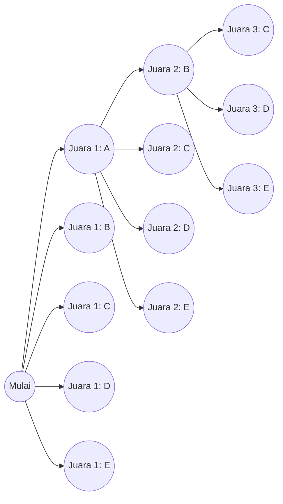
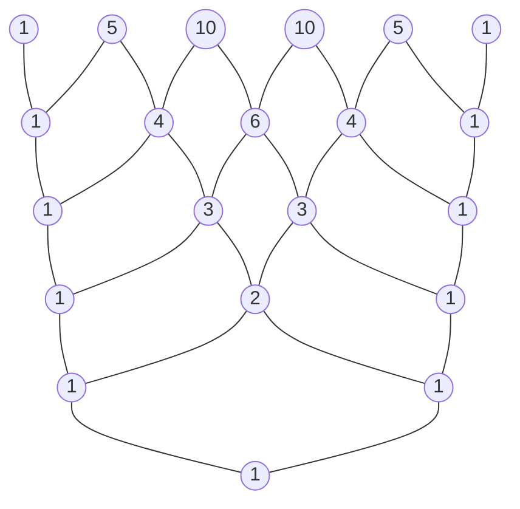

# Pengantar

Dalam dunia matematika, "permutasi" dan "kombinasi"—metode untuk menghitung jumlah kemungkinan hasil secara logis—adalah konsep dasar yang krusial di berbagai bidang, mulai dari probabilitas dan statistik hingga algoritma ilmu komputer. Memperluas konsep dasar ini ke ranah aljabar membawa kita pada "Teorema Binomial", dan merepresentasikan urutan koefisiennya secara visual dan geometris menghasilkan "Segitiga Pascal". Sepintas, topik-topik matematika ini mungkin tampak independen, namun saat Anda mempelajarinya lebih dalam, Anda menyadari bahwa topik-topik tersebut saling terkait secara menakjubkan, membentuk struktur matematika yang tunggal, masif, dan indah.

Dalam artikel ini, kita akan mulai dengan pemahaman intuitif dan metode perhitungan dasar untuk permutasi dan kombinasi, dan kemudian menjelaskan secara rinci konsep-konsep yang lebih kompleks seperti permutasi dengan pengulangan, permutasi melingkar (siklis), dan kombinasi dengan pengulangan. Dari situ, kita akan menurunkan rumus Teorema Binomial dan simetrinya yang indah, dan pada akhirnya mendalami tema-tema mendalam secara menyeluruh seperti sifat-sifat misterius yang tersembunyi di Segitiga Pascal, hubungannya dengan deret Fibonacci yang mendeskripsikan hukum alam, dan struktur fraktal. Mari kita memulai perjalanan untuk sepenuhnya mengapresiasi "keindahan" dan "keteraturan" matematika.

# Apa itu Permutasi?

Permutasi merujuk pada metode untuk memilih $r$ elemen dari $n$ elemen berbeda dan menyusunnya **dengan urutan tertentu**. Poin paling penting dalam permutasi adalah bahwa "jika urutannya berbeda, maka itu diperlakukan sebagai susunan yang sama sekali berbeda." Misalnya, ketika memilih dan menyusun dua kartu dari "A", "B", dan "C", "A-B" dan "B-A" dihitung sebagai permutasi yang berbeda.

## Rumus Permutasi

Total jumlah permutasi saat memilih $r$ elemen dari $n$ elemen berbeda direpresentasikan oleh simbol $_n\text{P}_r$ dan dihitung menggunakan rumus matematika berikut:

$$
_n\text{P}_r = \frac{n!}{(n-r)!}
$$

Di sini, $n!$ merepresentasikan faktorial dari $n$, dan $n! = n \times (n-1) \times \dots \times 2 \times 1$. Faktorial mengindikasikan total jumlah cara untuk mengatur ulang semua elemen dari suatu angka tertentu.

## Contoh Konkret: Peringkat Lomba Lari dan Susunan Tempat Duduk

Misalnya, mari kita pertimbangkan secara logis berapa banyak kemungkinan hasil untuk juara 1 hingga 3 ketika 5 siswa (A, B, C, D, E) berlari dalam sebuah lomba.

- Orang yang potensial untuk juara 1 adalah salah satu dari 5 siswa (5 cara)
- Orang yang potensial untuk juara 2 adalah salah satu dari 4 siswa yang tersisa, tidak termasuk peraih juara 1 (4 cara)
- Orang yang potensial untuk juara 3 adalah salah satu dari 3 siswa yang tersisa, tidak termasuk peraih juara 1 dan 2 (3 cara)

Karena masing-masing kasus ini terjadi secara independen dan berurutan, kita menghitungnya sebagai berikut menggunakan aturan perkalian:

$$
_5\text{P}_3 = 5 \times 4 \times 3 = 60 \text{ cara}
$$

Saat kita mengaplikasikan hal ini ke rumus menggunakan faktorial yang disebutkan sebelumnya, kita mendapatkan $_5\text{P}_3 = \frac{5!}{(5-3)!} = \frac{120}{2} = 60$, memastikan bahwa perhitungan intuitif kita benar-benar cocok dengan rumus ketat.

# Permutasi dengan Pengulangan dan Permutasi Melingkar

Dengan sedikit memperluas konsep permutasi, kita bisa memecahkan berbagai masalah yang sering dijumpai dalam kehidupan sehari-hari. Di sini, kita akan menjelaskan "permutasi dengan pengulangan" dan "permutasi melingkar", yang merupakan contoh aplikasi khas.

## Permutasi dengan Pengulangan

Saat memilih elemen, permutasi di mana Anda diizinkan untuk memilih elemen yang sama berulang kali sebanyak berapa pun disebut **permutasi dengan pengulangan**.
Total jumlah permutasi ketika mengambil $r$ elemen dari $n$ tipe berbeda yang mengizinkan pengulangan diekspresikan dengan rumus yang sangat sederhana:

$$
n^r
$$

Sebagai contoh, pertimbangkan pengaturan PIN 4 digit (menggunakan 10 tipe angka dari 0 hingga 9). Setiap digit memiliki 10 opsi dari 0 hingga 9, dan Anda dapat menggunakan angka yang sama sebanyak yang Anda suka. Oleh karena itu, total jumlah kemungkinan PIN yang dapat diatur adalah sebagai berikut:

$$
10^4 = 10 \times 10 \times 10 \times 10 = 10000 \text{ cara}
$$

Kata sandi digital dan perhitungan hasil pelemparan koin untuk sisi angka atau gambar (2 tipe) beberapa kali semuanya didasarkan pada konsep permutasi dengan pengulangan ini.

## Permutasi Melingkar (Siklis)

Permutasi di mana benda-benda disusun tidak dalam garis lurus tetapi dalam lingkaran disebut **permutasi melingkar**. Karakteristik permutasi melingkar adalah bahwa "susunan yang menjadi sama saat diputar dihitung sebagai 1 cara."

Total jumlah permutasi ketika menyusun $n$ item berbeda dalam lingkaran dihitung dengan rumus berikut:

$$
(n - 1)!
$$

Mengapa $(n-1)!$? Hal ini karena saat $n$ elemen disusun dalam lingkaran, ada $n$ cara untuk melihatnya tergantung pada dari elemen mana Anda mulai melihat. Oleh karena itu, dengan membagi permutasi normal yang disusun dalam satu baris $n!$ dengan $n$, kita menyimpulkan $(n-1)!$.

Misalnya, berapa banyak cara 5 orang untuk duduk di meja bundar?
$$
(5 - 1)! = 4! = 4 \times 3 \times 2 \times 1 = 24 \text{ cara}
$$
Dengan mempertimbangkan simetri rotasi, jumlah kasus menurun secara drastis. Konsep ini juga diaplikasikan dalam bidang-bidang seperti kimia untuk mempertimbangkan struktur tiga dimensi molekul, dan dalam menganalisis topologi cincin suatu jaringan.

# Apa itu Kombinasi?

Sementara permutasi menekankan pada "urutan" susunan, kombinasi hanya berfokus pada komposisi himpunan, yaitu, "elemen mana yang dipilih." Dengan kata lain, dalam kombinasi, **urutan tidak dipertimbangkan**. Jika anggota dari elemen yang dipilih sama, maka mereka diperlakukan sebagai kombinasi tunggal yang sama, terlepas dari bagaimana mereka disusun.

## Rumus Kombinasi

Total jumlah kombinasi saat memilih $r$ elemen dari $n$ elemen berbeda direpresentasikan oleh simbol $_n\text{C}_r$ atau notasi koefisien binomial $\binom{n}{r}$, dan dihitung menggunakan rumus matematika berikut:

$$
_n\text{C}_r = \binom{n}{r} = \frac{_n\text{P}_r}{r!} = \frac{n!}{r!(n-r)!}
$$

Logika di balik rumus ini sangat elegan. Pertama, kita hitung jumlah cara memilih $r$ elemen dengan mempertimbangkan urutan (permutasi $_n\text{P}_r$). Namun, ke-$r$ elemen yang dipilih dapat disusun dalam $r!$ cara di antara mereka sendiri. Karena kombinasi mengidentifikasi semua ini sebagai hal yang sama, kita bagi jumlah total dengan $r!$ untuk mengeliminasi duplikat.

## Contoh Konkret: Membentuk Tim Proyek

Ada berapa cara untuk memilih 3 anggota untuk meluncurkan proyek baru dari 8 karyawan yang tergabung dalam suatu departemen?
Jika tidak ada perbedaan peran yang jelas di dalam anggota, urutan saat mereka dipilih tidak menjadi masalah, menjadikan ini sebagai masalah kombinasi.

$$
_8\text{C}_3 = \frac{8!}{3!(8-3)!} = \frac{8 \times 7 \times 6}{3 \times 2 \times 1} = 56 \text{ cara}
$$

Meskipun 3 orang yang dipilih adalah $\{A, B, C\}$ atau $\{B, C, A\}$, mereka sepenuhnya identik sebagai tim proyek, sehingga dihitung sebagai 1 cara. Konsep kombinasi adalah alat yang sangat diperlukan dalam menganalisis peristiwa yang melibatkan ketidakpastian, seperti menghitung probabilitas memenangkan lotre atau probabilitas kartu pada permainan poker.

# Kombinasi dengan Pengulangan

Sama seperti permutasi yang memiliki permutasi dengan pengulangan, kombinasi juga memiliki **kombinasi dengan pengulangan**. Ini mengacu pada jumlah cara untuk memilih $r$ item dari $n$ tipe berbeda yang memungkinkan pengulangan, dan umumnya direpresentasikan dengan simbol $_n\text{H}_r$.

## Menghitung Kombinasi dengan Pengulangan dan Model "Bintang dan Garis"

Karena kombinasi dengan pengulangan sulit dihitung secara langsung, mereka biasanya diubah menjadi masalah kombinasi standar untuk diselesaikan. Jumlah total setelah konversi diberikan oleh rumus berikut:

$$
_n\text{H}_r = _{n+r-1}\text{C}_r = \frac{(n+r-1)!}{r!(n-1)!}
$$

Model yang sangat intuitif dengan sangat baik untuk memahami rumus ini adalah model "bintang dan garis" (lingkaran dan pembagi).

Misalnya, berapa banyak cara untuk membeli 5 buah dari 3 jenis buah: apel, jeruk, dan pisang, yang memungkinkan pengulangan? (Dengan asumsi tidak masalah jika beberapa buah tidak dipilih).
Di sini, kita memilih $r=5$ item dari $n=3$ jenis buah.

Kita ganti ini dengan masalah menyusun 5 "lingkaran" dan $3-1 = 2$ "pembagi" yang digunakan untuk memisahkan 3 jenis buah dalam satu baris.

Contoh: `o o | o | o o`
Ini berarti memilih "2 apel, 1 jeruk, dan 2 pisang" dari sebelah kiri.
Contoh: `| o o o | o o`
Ini berarti "0 apel, 3 jeruk, dan 2 pisang".

Dengan kata lain, ini sama dengan kombinasi memilih 5 tempat untuk meletakkan lingkaran (atau 2 tempat untuk meletakkan pembagi) dari total $5 + 2 = 7$ tempat.

$$
_3\text{H}_5 = _{3+5-1}\text{C}_5 = _7\text{C}_5 = _7\text{C}_2 = \frac{7 \times 6}{2 \times 1} = 21 \text{ cara}
$$

Pendekatan "bintang dan garis" ini mendemonstrasikan kemampuan abstraksi yang kuat dari matematika untuk mereduksi masalah yang tampaknya kompleks menjadi struktur yang visual dan sederhana.

# Teorema Binomial dan Ekspansinya

Pengetahuan tentang permutasi dan kombinasi yang telah kita pelajari sejauh ini berfungsi sebagai persiapan sempurna untuk memahami "Teorema Binomial", salah satu teorema fundamental dalam aljabar. Teorema Binomial adalah rumus untuk mengekspansi secara sempurna pangkat dari penjumlahan dua suku, seperti $(x + y)^n$, menjadi sebuah polinomial.

## Rumus Teorema Binomial

Untuk sembarang bilangan bulat positif $n$, persamaan berikut ini selalu berlaku:

$$
(x + y)^n = \sum_{k=0}^{n} \binom{n}{k} x^{n-k} y^k
$$

Atau, ditulis dalam bentuk ekspansinya:

$$
(x + y)^n = \binom{n}{0}x^n y^0 + \binom{n}{1}x^{n-1} y^1 + \binom{n}{2}x^{n-2} y^2 + \dots + \binom{n}{n}x^0 y^n
$$

Koefisien dari setiap suku ketika diekspansi secara sempurna cocok dengan kombinasi $\binom{n}{k}$ (yaitu, $_n\text{C}_k$). Karena hal ini, koefisien-koefisien ini secara khusus disebut **koefisien binomial**.

## Bukti Intuitif Teorema Binomial dan Kaitannya dengan Kombinasi

Mengapa kombinasi, yang merupakan perhitungan dari kasus, muncul dalam ekspansi binomial? Mari kita eksplorasi alasan intuitifnya menggunakan ekspansi $(x + y)^3$ sebagai contoh.

$$
(x + y)^3 = (x + y)(x + y)(x + y)
$$

Tindakan mengekspansi ekspresi ini berarti memilih $x$ atau $y$ dari masing-masing 3 tanda kurung $(x+y)$ menurut sifat distributif, mengalikannya, dan menjumlahkan semua polanya.

- **Untuk membuat suku $x^3$** : Anda harus memilih $x$ dari ketiga tanda kurung. Jumlah cara memilih yang demikian adalah $\binom{3}{0} = 1$ cara.
- **Untuk membuat suku $x^2y$** : Anda perlu memilih $x$ dari 2 dari 3 tanda kurung, dan $y$ dari sisa 1 tanda kurung. Jumlah cara memutuskan dari 1 tanda kurung mana untuk memilih $y$ adalah $\binom{3}{1} = 3$ cara.
- **Untuk membuat suku $xy^2$** : Anda memilih $x$ dari 1 dari 3 tanda kurung, dan $y$ dari sisa 2 tanda kurung. Jumlah cara untuk menentukan 2 tanda kurung mana yang akan dipilih $y$ adalah $\binom{3}{2} = 3$ cara.
- **Untuk membuat suku $y^3$** : Anda memilih $y$ dari ketiga tanda kurung. Jumlah caranya adalah $\binom{3}{3} = 1$ cara.

Oleh karena itu, menambahkan semua ini bersama-sama menghasilkan yang berikut:

$$
(x + y)^3 = 1x^3 + 3x^2y + 3xy^2 + 1y^3
$$

Menggeneralisasi hal ini, jawaban atas pertanyaan "Dalam perkalian $n$ tanda kurung, berapa total jumlah cara untuk memilih $k$ buah $y$ (dan secara bersamaan $n-k$ buah $x$)?" tepatnya adalah $\binom{n}{k}$. Rumus ekspansi aljabar dan kombinatorika saling bersinggungan secara indah di sini.

# Segitiga Pascal: Geometri Angka yang Indah

Menyusun koefisien binomial yang muncul dalam rumus ekspansi Teorema Binomial ke dalam bentuk piramida dari atas ke bawah sebagai $n=0, 1, 2, \dots$ disebut "Segitiga Pascal". Segitiga berstruktur sederhana ini jauh melampaui sekadar bantuan perhitungan belaka, menyimpan sifat-sifat matematika yang sangat indah dan dalam tak terhitung jumlahnya di dalamnya.

## Aturan Konstruksi Segitiga Pascal

Segitiga Pascal dimulai dengan menempatkan angka $1$ di puncak paling atas (baris 0). Untuk baris-baris berikutnya, angka $1$ selalu ditempatkan di kedua ujungnya, dan semua angka bagian dalam dibangun menurut aturan yang sangat sederhana: "penjumlahan angka kiri atas dan angka kanan atas".

Angka yang terletak di baris ke-$n$ dari atas (dengan puncaknya menjadi baris ke-0) dan posisi ke-$k$ dari kiri (dengan tepi kiri menjadi posisi ke-0) sesuai persis dengan koefisien binomial $\binom{n}{k}$. Struktur di mana menjumlahkan angka kiri atas $\binom{n-1}{k-1}$ dan angka kanan atas $\binom{n-1}{k}$ sama dengan angka di bawahnya $\binom{n}{k}$ secara geometris merepresentasikan persamaan penting berikut yang disebut Aturan Pascal (Pascal's Rule):

$$
\binom{n}{k} = \binom{n-1}{k-1} + \binom{n-1}{k}
$$

## Sifat-Sifat Menakjubkan yang Tersembunyi di Segitiga Pascal

Jika Anda mengamati Segitiga Pascal secara saksama, Anda akan memperhatikan bahwa banyak keteraturan yang tak terhitung jumlahnya tersembunyi di dalamnya. Mari kita perkenalkan beberapa di antaranya.

### 1. Simetri Sempurna

Angka-angka di setiap baris sangat simetris secara horizontal melintasi sumbu tengah. Hal ini secara langsung merefleksikan sifat dasar kombinasi, $\binom{n}{k} = \binom{n}{n-k}$. Berpikir secara logis, memutuskan $k$ item mana yang akan dipilih dari $n$ sepenuhnya ekuivalen dengan memutuskan secara bersamaan "$n-k$ item yang tidak dipilih," sehingga ini adalah hasil yang wajar.

### 2. Penjumlahan Baris dan Pangkat dari 2

Jika Anda menjumlahkan secara horizontal semua angka dalam baris ke-$n$ tertentu, totalnya akan selalu $2^n$.

- Baris 0: $1 = 2^0$
- Baris 1: $1 + 1 = 2 = 2^1$
- Baris 2: $1 + 2 + 1 = 4 = 2^2$
- Baris 3: $1 + 3 + 3 + 1 = 8 = 2^3$
- Baris 4: $1 + 4 + 6 + 4 + 1 = 16 = 2^4$

Hal ini dapat dengan mudah dibuktikan secara aljabar dari persamaan $(1+1)^n = \sum \binom{n}{k}$, yang diperoleh dengan menyubstitusikan $x=1, y=1$ ke dalam Teorema Binomial $(x+y)^n = \sum \binom{n}{k} x^{n-k} y^k$. Dari perspektif teori himpunan, ini mengindikasikan bahwa "jumlah dari semua himpunan bagian" dari himpunan dengan $n$ elemen adalah $2^n$.

### 3. Koneksi Tersembunyi dengan Deret Fibonacci

Cobalah menjumlahkan angka-angka Segitiga Pascal di sepanjang "garis diagonal landai." Secara mencengangkan, deret $1, 1, 2, 3, 5, 8, 13, 21, \dots$ muncul.
Ini tidak lain adalah **Deret Fibonacci**, di mana Anda menjumlahkan dua angka sebelumnya untuk membuat angka berikutnya. Deret mistik yang muncul di mana-mana di alam, seperti susunan biji bunga matahari dan spiral cangkang nautilus, tertanam dalam-dalam di dalam sebuah segitiga yang hanya menyusun kombinasi. Ini adalah contoh yang sangat indah dan mengharukan yang menunjukkan bagaimana matematika, sebagai produk dari pemikiran logis manusia, terikat dengan ketetapan alam.

### 4. Geometri Fraktal: Segitiga Sierpinski

Cobalah memperbesar Segitiga Pascal menjadi sangat besar hingga puluhan atau ratusan baris, lalu cat "angka ganjil" di dalamnya dengan warna hitam, dan biarkan "angka genap" kosong. Kemudian, sosok fraktal yang serupa dengan dirinya sendiri (self-similar) yang disebut "Segitiga Sierpinski (Sierpinski Gasket)" terlihat dengan jelas.
Struktur ini, di mana pola segitiga yang sama berulang tak terhingga baik jika Anda memperbesar atau memperkecil keseluruhannya, berfungsi sebagai jembatan yang menghubungkan teori bilangan, geometri, dan teori kekacauan (chaos theory).

# Perluasan ke Teorema Multinomial

Teorema Binomial adalah ekspansi dari $(x+y)^n$, tetapi menggeneralisasi hal ini ke ekspansi penjumlahan tiga suku atau lebih, seperti $(x+y+z)^n$ atau $(x_1 + x_2 + \dots + x_m)^n$, adalah **Teorema Multinomial**.

Koefisien dari setiap suku dalam rumus ekspansi Teorema Multinomial disebut koefisien multinomial, dihitung dengan rumus berikut:

$$
\frac{n!}{k_1! k_2! \dots k_m!} \quad (\text{di mana } k_1 + k_2 + \dots + k_m = n)
$$

Koefisien multinomial ini bukan sekadar koefisien ekspansi aljabar, tetapi berarti "total jumlah cara untuk membagi $n$ item yang berbeda ke dalam kelompok-kelompok yang masing-masing terdiri dari $k_1, k_2, \dots, k_m$ item".
Proses di mana Teorema Binomial berfungsi sebagai fondasi dan secara alami meluas ke struktur kombinatorika berdimensi lebih tinggi mewujudkan secara indah keluasan dan konsistensi yang dimiliki sistem matematika.

# Distribusi Binomial: Aplikasi pada Teori Probabilitas

Sejauh ini, kita telah membahas permutasi dan Teorema Binomial sebagai matematika murni, tetapi konsep-konsep ini mendemonstrasikan kekuatan yang sangat praktis dalam "teori probabilitas" dan "statistik" untuk memodelkan masalah dunia nyata. Contoh representatifnya adalah **Distribusi Binomial**.

Distribusi binomial adalah distribusi probabilitas yang mendeskripsikan probabilitas dari tepat $k$ "keberhasilan" yang terjadi ketika percobaan independen (percobaan Bernoulli) yang hanya menghasilkan "berhasil" atau "gagal" diulang $n$ kali.
Jika probabilitas sukses dalam satu kali percobaan adalah $p$, dan probabilitas kegagalan adalah $q = 1 - p$, maka probabilitas untuk tepat $k$ kali sukses, $P(X=k)$, diekspresikan sebagai berikut:

$$
P(X=k) = \binom{n}{k} p^k q^{n-k}
$$

Di dalam rumus massa probabilitas ini, koefisien binomial $\binom{n}{k}$ muncul tepat seperti adanya. Ini karena ada $\binom{n}{k}$ cara untuk memilih $k$ percobaan mana yang akan berhasil dari $n$ percobaan.
Mulai dari menghitung probabilitas pelemparan koin hingga memprediksi probabilitas kemunculan produk cacat di sebuah pabrik, dan bahkan mengukur kemanjuran obat baru dalam bidang medis, distribusi binomial mendukung fondasi dari semua analisis data di masyarakat modern.

# Kesimpulan

Dalam artikel ini, kita telah melakukan perjalanan melintasi lanskap matematika yang luas, mulai dari permutasi dan kombinasi, yang merupakan aturan "berhitung" sederhana, hingga aplikasinya dalam permutasi dengan pengulangan dan permutasi melingkar, meluas lebih jauh ke Teorema Binomial aljabar, dan mencapai penjelajahan visual atas Segitiga Pascal.

Dengan mengabstraksi dan menggali tindakan yang sangat sederhana dan primitif dalam "memilih beberapa item dari yang lain yang berbeda" menggunakan bahasa matematika yang ketat, menjadi jelas bahwa dunia matematika yang sangat kaya dan indah memanjang ke luar—melibatkan simetri sempurna, aturan pangkat 2, deret Fibonacci yang menggambarkan dunia alam, dan struktur fraktal yang tak terhingga.

Rumus dan teorema matematika bukan semata-mata alat anorganik untuk memecahkan soal ujian. Mereka adalah karya seni tertinggi umat manusia, mengekspresikan tatanan tak kasat mata di balik dunia yang mengelilingi kita dan hubungan sangat indah yang ditenun oleh angka-angka. Kami berharap dengan bersentuhan dengan keteraturan angka yang indah yang ditunjukkan oleh permutasi, kombinasi, dan Segitiga Pascal ini, Anda telah merasakan pesona sejati dan kedalaman yang dimiliki disiplin matematika.
